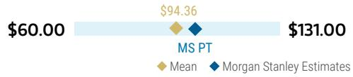
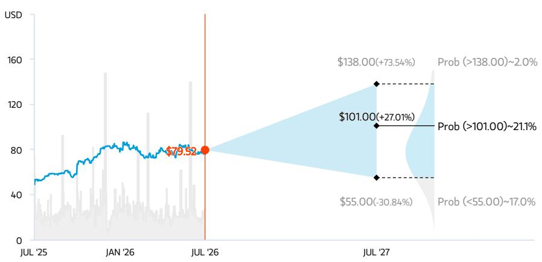
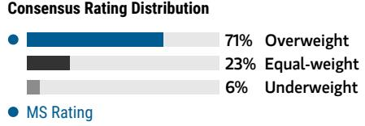

# 通用汽车公司 | 北美市场

# 业绩超预期，指引上调，持续向好

<table><tr><td colspan="3">变化摘要</td></tr><tr><td>通用汽车公司 (GM.N)</td><td>此前</td><td>当前</td></tr><tr><td>目标价</td><td>$100.00</td><td>$101.00</td></tr></table>

通用汽车第二季度业绩表现稳健，超出预期，并上调了2026年调整后EBIT指引，同时对2027年前景给出了积极的初步展望。我们认为，软件和非汽车业务（防务与储能）是推动估值重估下一阶段的关键。

## 核心要点

- **业绩超预期与指引上调**：第二季度调整后EBIT超出预期，主要得益于北美业务的强劲表现。指引中点上调5亿美元（区间为140-160亿美元，市场预期为154亿美元）。

- **2027年展望**：根据我们的估算，管理层首次给出的方向性展望显示，2027年调整后EBIT约为160亿美元。

- **软件业务拐点**：递延收入有望在年底达到75亿美元，推动2027年已实现收入实现两位数增长，毛利率约为70%。

- **非汽车业务潜力**：防务业务收入接近7亿美元，目标在2026年实现正EBIT；钠离子电池投资增添了长期发展潜力。

- **电动车相关不确定性消除**：23亿美元的电动车相关费用标志着多季度业务审查的结束，消除了关于资本回报节奏和灵活性的不确定性。

## 业绩电话会要点——详见我们的快速解读。

**业绩超预期，指引上调。** 通用汽车第二季度业绩表现强劲，主要得益于北美业务，其EBIT较我们预期高出8%，这归因于更强的定价能力和成本管理，包括电动车亏损和保修成本的改善。全年指引方面，通用汽车将2026年调整后EBIT指引中点上调5亿美元（区间为140-160亿美元），主要驱动因素为定价改善（上调约0.5%，此前预期为"持平至增长0.5%"）以及保修成本改善（同比利好10-15亿美元，此前约为10亿美元）。

**2027年方向性展望显示增长。** 管理层首次提供了2027年的高层级展望，预示着收入、EBIT和自由现金流均将实现增长，驱动因素包括：电动车盈利能力提升、数字业务收入增长、额外的保修成本节省、下一代雪佛兰Silverado和GMC Sierra皮卡定价能力增强，以及全尺寸SUV供应增加以满足美国市场需求。我们预计，这部分增长将被全年大宗商品/DRAM成本上升以及关税带来的增量不利因素（因2026年确认的IEEPA退税不再重复出现）所部分抵消。因此，我们预测通用汽车2027年调整后EBIT约为160亿美元（见图表1）。我们对2027年各项因素的框架分析如下：**利好因素**：(i) 电动车亏损改善5-10亿美元（2026年改善10-15亿美元），(ii) 保修成本改善5-10亿美元（2026年改善10-15亿美元），(iii) 销量/价格带来3.5-7.5亿美元的改善。**不利因素**：(i) 大宗商品/DRAM成本增加2.5-5亿美元，(ii) 关税带来2.5-5亿美元的不利影响（5亿美元IEEPA退税不再重复，部分被回流生产减少的关税账单所抵消）。请注意，公司尚未提供官方指引；这些是基于我们的模型和与公司沟通后得出的初步假设。

图表1：2027年MS EBIT变化图

来源：MS估算

**软件与服务是被低估的增长驱动力。** 通用汽车正将数字服务定位为一个日益重要且周期性较弱的盈利引擎，预计2026年新增100万数字订阅用户，支持超过30亿美元的已确认收入。第二季度，递延收入达到63亿美元（同比增长50%），并有望在年底达到75亿美元，为2027年实现两位数增长、毛利率约70%的已确认收入提供支撑。我们预计，软件与服务的长期增长将来自：1) Super Cruise在更多车型/配置上的普及，2) 服务期结束后高利润订阅收入的规模化，3) 功能提升（如脱眼驾驶）带来的ARPU增长。我们认为，随着公司通过利润表积累高利润收入，并持续增加对该业务前景的信息披露，通用汽车的软件与服务业务有望推动其估值显著重估。

**其他非汽车业务增长领域。** 我们此前曾提及，非汽车业务正成为读者关注的核心，并认为通用汽车的防务和能源业务是利润率扩张和收入增长的关键机遇。在防务领域，管理层预计2026年收入将接近7亿美元（仍不到总收入的1%），该业务将实现正EBIT，同时目标是在未来几年实现超过30%的年收入增长和两位数的利润率。此外，管理层关于钠离子电池机遇的评论印证了我们的观点，即该技术相比磷酸铁锂具有潜在成本优势、原材料丰富、温度适应性广，以及冷却和维护要求较低。我们认为，与Peak Energy的合作以轻资产方式提供了相关敞口，与管理层在保持资本效率的同时维持战略灵活性的总体执行策略一致。虽然我们认识到在储能市场建立战略立足点的价值，以及该技术未来扩展到车辆应用的可能性，但生产可能要到本十年末才能规模化，限制了近期的盈利上行空间。

**电动车相关费用最终确定，消除了资本回报的不确定性。** 通用汽车基本完成了对其电动车业务的审查，导致本季度额外计提了23亿美元的费用。尽管公司已明确其对资本回报计划的承诺，但我们认为，电动车业务审查的结束有助于消除围绕通用汽车资本回报机会的长期不确定性（即读者担心未来现金费用可能对资本回报产生负面影响）。

**我们的估算如何变化（图表2）。** 我们的估算基本保持不变，因为我们此前已基于公司拥有多个推动业绩超预期的杠杆（正如本次财报所体现的）这一观点，将模型设定在先前指引区间的高端。我们认为，估算的进一步上行可能来自：(i) 大宗商品成本前景改善，(ii) 有利的定价环境，即使通用汽车在年底临近卡车换代，(iii) 保修成本进一步改善，或 (iv) 额外的成本合理化措施。我们的目标价上调至101美元，主要驱动因素是流通股数量减少。

图表2：模型变化表

<table>
<tr><td rowspan="2">利润表（百万美元）</td><td colspan="3">2026e</td><td colspan="3">2027e</td></tr>
<tr><td>新</td><td>旧</td><td>变化</td><td>新</td><td>旧</td><td>变化</td></tr>
<tr><td>集团收入</td><td>186,107</td><td>185,973</td><td>0.1%</td><td>188,267</td><td>187,796</td><td>0.3%</td></tr>
<tr><td>增长率</td><td>0.6%</td><td>0.5%</td><td>0.1%</td><td>1.2%</td><td>1.0%</td><td>0.2%</td></tr>
<tr><td>销售成本</td><td>152,554</td><td>150,263</td><td>1.5%</td><td>150,843</td><td>150,442</td><td>0.3%</td></tr>
<tr><td>毛利润</td><td>33,553</td><td>35,710</td><td>-6.0%</td><td>37,424</td><td>37,355</td><td>0.2%</td></tr>
<tr><td>毛利率</td><td>18.0%</td><td>19.2%</td><td>-1.2%</td><td>19.9%</td><td>19.9%</td><td>0.0%</td></tr>
<tr><td>销售、一般及管理费用</td><td>8,496</td><td>8,678</td><td>-2.1%</td><td>8,767</td><td>8,683</td><td>1.0%</td></tr>
<tr><td>占收入比例</td><td>4.6%</td><td>4.7%</td><td>-0.1%</td><td>4.7%</td><td>4.6%</td><td>0.0%</td></tr>
<tr><td>其他（收入）/费用</td><td>13,675</td><td>13,215</td><td>3.5%</td><td>13,065</td><td>12,946</td><td>0.9%</td></tr>
<tr><td>营业利润</td><td>11,383</td><td>13,817</td><td>-17.6%</td><td>15,592</td><td>15,726</td><td>-0.9%</td></tr>
<tr><td>营业利润率</td><td>6.1%</td><td>7.4%</td><td>-1.3%</td><td>8.3%</td><td>8.4%</td><td>-0.1%</td></tr>
<tr><td>调整后EBIT</td><td>15,333</td><td>15,350</td><td>-0.1%</td><td>15,979</td><td>15,997</td><td>-0.1%</td></tr>
<tr><td>调整后EBIT利润率</td><td>8.2%</td><td>8.3%</td><td>0.0%</td><td>8.5%</td><td>8.5%</td><td>0.0%</td></tr>
<tr><td>利息费用</td><td>629</td><td>755</td><td>-16.8%</td><td>719</td><td>717</td><td>0.3%</td></tr>
<tr><td>利率</td><td>3.9%</td><td>4.6%</td><td>-0.8%</td><td>4.5%</td><td>4.5%</td><td>0.0%</td></tr>
<tr><td>利息收入及其他非营业收益净额</td><td>1,244</td><td>1,314</td><td>-5.3%</td><td>1,172</td><td>1,267</td><td>-7.5%</td></tr>
<tr><td>利率</td><td>5.8%</td><td>5.9%</td><td>-0.1%</td><td>5.5%</td><td>5.5%</td><td>0.0%</td></tr>
<tr><td>税前利润</td><td>11,999</td><td>14,376</td><td>-16.5%</td><td>16,045</td><td>16,277</td><td>-1.4%</td></tr>
<tr><td>所得税</td><td>2,391</td><td>2,998</td><td>-20.2%</td><td>3,289</td><td>3,337</td><td>-1.4%</td></tr>
<tr><td>税率</td><td>19.9%</td><td>20.9%</td><td>-0.9%</td><td>20.5%</td><td>20.5%</td><td>0.0%</td></tr>
<tr><td>权益法投资收益（税后）</td><td>447</td><td>478</td><td>-6.3%</td><td>387</td><td>271</td><td>43.2%</td></tr>
<tr><td>净利润</td><td>10,055</td><td>11,856</td><td>-15.2%</td><td>13,143</td><td>13,210</td><td>-0.5%</td></tr>
<tr><td>归属于非控制权益的净利润</td><td>(126)</td><td>(78)</td><td>-61.5%</td><td>-</td><td>-</td><td>0.0%</td></tr>
<tr><td>归属于股东的净利润</td><td>9,929</td><td>11,778</td><td>-15.7%</td><td>13,143</td><td>13,210</td><td>-0.5%</td></tr>
<tr><td>报告净利润</td><td>12,705</td><td>12,594</td><td>0.9%</td><td>13,143</td><td>13,210</td><td>-0.5%</td></tr>
<tr><td>归属于普通股股东的净利润</td><td>12,624</td><td>12,561</td><td>0.5%</td><td>13,062</td><td>13,177</td><td>-0.9%</td></tr>
<tr><td>加权平均稀释股份数</td><td>905</td><td>906</td><td>-0.1%</td><td>887</td><td>888</td><td>-0.1%</td></tr>
<tr><td>基本每股收益（报告）</td><td>$11.07</td><td>$13.19</td><td>-16.1%</td><td>$15.94</td><td>$16.14</td><td>-1.2%</td></tr>
<tr><td>稀释每股收益（报告）</td><td>$10.90</td><td>$12.97</td><td>-16.0%</td><td>$14.72</td><td>$14.84</td><td>-0.8%</td></tr>
<tr><td>稀释每股收益（剔除非常项目）</td><td>$13.93</td><td>$13.85</td><td>0.6%</td><td>$14.72</td><td>$14.84</td><td>-0.8%</td></tr>
</table>

来源：MS估算

图表3：模型变化表

<table>
<tr><td rowspan="2">分部数据</td><td colspan="3">2026e</td><td colspan="3">2027e</td></tr>
<tr><td>新</td><td>旧</td><td>变化</td><td>新</td><td>旧</td><td>变化</td></tr>
<tr><td>批发销量（千辆）</td><td></td><td></td><td></td><td></td><td></td><td></td></tr>
<tr><td>GMNA</td><td>3,274</td><td>3,271</td><td>0.1%</td><td>3,299</td><td>3,288</td><td>0.3%</td></tr>
<tr><td>GMI</td><td>539</td><td>527</td><td>2.3%</td><td>542</td><td>532</td><td>1.8%</td></tr>
<tr><td>总批发销量</td><td>3,813</td><td>3,798</td><td>0.4%</td><td>3,840</td><td>3,820</td><td>0.5%</td></tr>
<tr><td>收入（百万美元）</td><td></td><td></td><td></td><td></td><td></td><td></td></tr>
<tr><td>GMNA</td><td>154,336</td><td>154,503</td><td>-0.1%</td><td>156,271</td><td>156,052</td><td>0.1%</td></tr>
<tr><td>GMI</td><td>14,185</td><td>13,969</td><td>1.5%</td><td>14,327</td><td>14,180</td><td>1.0%</td></tr>
<tr><td>GM Financial</td><td>17,222</td><td>17,236</td><td>-0.1%</td><td>17,303</td><td>17,300</td><td>0.0%</td></tr>
<tr><td>公司/抵销</td><td>365</td><td>264</td><td>38.1%</td><td>366</td><td>265</td><td>38.3%</td></tr>
<tr><td>总收入</td><td>186,107</td><td>185,973</td><td>0.1%</td><td>188,267</td><td>187,796</td><td>0.3%</td></tr>
<tr><td>汽车业务收入</td><td>168,521</td><td>168,472</td><td>0.0%</td><td>170,598</td><td>170,232</td><td>0.2%</td></tr>
<tr><td>调整后EBIT（百万美元）</td><td></td><td></td><td></td><td></td><td></td><td></td></tr>
<tr><td>GMNA</td><td>13,139</td><td>13,150</td><td>-0.1%</td><td>13,830</td><td>13,811</td><td>0.1%</td></tr>
<tr><td>利润率</td><td>8.5%</td><td>8.5%</td><td>0.0%</td><td>8.9%</td><td>8.9%</td><td>0.0%</td></tr>
<tr><td>GMI</td><td>720</td><td>709</td><td>1.5%</td><td>746</td><td>767</td><td>-2.8%</td></tr>
<tr><td>利润率</td><td>5.1%</td><td>5.1%</td><td>0.0%</td><td>5.2%</td><td>5.4%</td><td>-0.2%</td></tr>
<tr><td>GM Financial</td><td>2,692</td><td>2,710</td><td>-0.7%</td><td>2,604</td><td>2,619</td><td>-0.6%</td></tr>
<tr><td>利润率</td><td>15.6%</td><td>15.7%</td><td>-0.1%</td><td>15.0%</td><td>15.1%</td><td>-0.1%</td></tr>
<tr><td>公司及抵销</td><td>(1,217)</td><td>(1,219)</td><td>0.2%</td><td>(1,200)</td><td>(1,200)</td><td>0.0%</td></tr>
<tr><td>总EBIT</td><td>15,333</td><td>15,350</td><td>-0.1%</td><td>15,979</td><td>15,997</td><td>-0.1%</td></tr>
<tr><td>利润率</td><td>8.2%</td><td>8.3%</td><td>0.0%</td><td>8.5%</td><td>8.5%</td><td>0.0%</td></tr>
<tr><td>汽车业务EBIT</td><td>13,858</td><td>13,859</td><td>0.0%</td><td>14,576</td><td>14,577</td><td>0.0%</td></tr>
<tr><td>利润率</td><td>8.2%</td><td>8.2%</td><td>0.0%</td><td>8.5%</td><td>8.6%</td><td>0.0%</td></tr>
</table>

来源：MS估算

图表4：2026年预测——MS估算 vs. 市场共识

<table>
<tr><td rowspan="2"></td><td colspan="3">2026</td></tr>
<tr><td>MS估算</td><td>市场共识</td><td>差异百分比</td></tr>
<tr><td>车辆销量（千辆）</td><td></td><td></td><td></td></tr>
<tr><td>GMNA</td><td>3,274</td><td>3,286</td><td>-0.4%</td></tr>
<tr><td>GMI</td><td>539</td><td>531</td><td>1.5%</td></tr>
<tr><td>收入（百万美元）</td><td></td><td></td><td></td></tr>
<tr><td>GMNA</td><td>154,336</td><td>154,254</td><td>0.1%</td></tr>
<tr><td>GMI</td><td>14,185</td><td>13,903</td><td>2.0%</td></tr>
<tr><td>GM Financial</td><td>17,222</td><td>17,197</td><td>0.1%</td></tr>
<tr><td>公司/抵销</td><td>365</td><td>216</td><td>68.6%</td></tr>
<tr><td>总计</td><td>186,107</td><td>185,322</td><td>0.4%</td></tr>
<tr><td>调整后EBIT（百万美元）</td><td></td><td></td><td></td></tr>
<tr><td>GMNA</td><td>13,139</td><td>12,710</td><td>3.4%</td></tr>
<tr><td>GMI</td><td>720</td><td>692</td><td>4.0%</td></tr>
<tr><td>GM Financial</td><td>2,692</td><td>2,743</td><td>-1.9%</td></tr>
<tr><td>公司/抵销</td><td>(1,217)</td><td>(1,264)</td><td>3.7%</td></tr>
<tr><td>总计</td><td>15,333</td><td>14,714</td><td>4.2%</td></tr>
<tr><td>每股收益</td><td>$13.93</td><td>$12.86</td><td>8.3%</td></tr>
<tr><td>资本支出（百万美元）</td><td>10,982</td><td>10,286</td><td>6.8%</td></tr>
<tr><td>调整后汽车业务自由现金流（百万美元）</td><td>11,108</td><td>8,494</td><td>30.8%</td></tr>
</table>

来源：Visible Alpha, MS估算

图表5：2026年第二季度业绩差异

<table>
<tr><td rowspan="2">利润表项目（百万美元）</td><td rowspan="2">2026年第二季度</td><td rowspan="2">市场共识</td><td rowspan="2">MS估算</td><td colspan="2">差异百分比</td></tr>
<tr><td>vs. 市场共识</td><td>vs. MS估算</td></tr>
<tr><td>收入</td><td></td><td></td><td></td><td></td><td></td></tr>
<tr><td>GMNA</td><td>39,912</td><td>38,967</td><td>39,882</td><td>2.4%</td><td>0.1%</td></tr>
<tr><td>GMI</td><td>3,691</td><td>3,429</td><td>3,359</td><td>7.6%</td><td>9.9%</td></tr>
<tr><td>GM Financial</td><td>4,267</td><td>4,269</td><td>4,276</td><td>(0.1%)</td><td>(0.2%)</td></tr>
<tr><td>Cruise + 公司/抵销</td><td>156</td><td>35</td><td>55</td><td>340.7%</td><td>182.2%</td></tr>
<tr><td>总收入</td><td>48,026</td><td>46,701</td><td>47,573</td><td>2.8%</td><td>1.0%</td></tr>
<tr><td>汽车业务收入</td><td>43,759</td><td>42,431</td><td>43,296</td><td>3.1%</td><td>1.1%</td></tr>
<tr><td>调整后EBIT</td><td></td><td></td><td></td><td></td><td></td></tr>
<tr><td>GMNA</td><td>3,446</td><td>3,231</td><td>3,191</td><td>6.7%</td><td>8.0%</td></tr>
<tr><td>利润率</td><td>8.6%</td><td>8.3%</td><td>8.0%</td><td></td><td></td></tr>
<tr><td>GMI</td><td>190</td><td>144</td><td>175</td><td>31.5%</td><td>8.8%</td></tr>
<tr><td>利润率</td><td>5.1%</td><td>4.2%</td><td>5.2%</td><td></td><td></td></tr>
<tr><td>GM Financial</td><td>605</td><td>723</td><td>672</td><td>(16.3%)</td><td>(10.0%)</td></tr>
<tr><td>利润率</td><td>14.2%</td><td>16.9%</td><td>15.7%</td><td></td><td></td></tr>
<tr><td>公司及抵销</td><td>(298)</td><td>(359)</td><td>(300)</td><td>17.0%</td><td>0.7%</td></tr>
<tr><td>调整后EBIT合计</td><td>3,943</td><td>3,740</td><td>3,737</td><td>5.4%</td><td>5.5%</td></tr>
<tr><td>利润率</td><td>8.2%</td><td>8.0%</td><td>7.9%</td><td></td><td></td></tr>
<tr><td>汽车业务EBIT</td><td>3,636</td><td>3,376</td><td>3,365</td><td>7.7%</td><td>8.0%</td></tr>
<tr><td>利润率</td><td>8.3%</td><td>8.0%</td><td>7.8%</td><td></td><td></td></tr>
<tr><td>汽车业务自由现金流</td><td>5,033</td><td>3,568</td><td>3,973</td><td>41.1%</td><td>26.7%</td></tr>
<tr><td>调整后稀释每股收益</td><td>$3.57</td><td>$3.20</td><td>$3.31</td><td>11.4%</td><td>7.8%</td></tr>
</table>

来源：Visible Alpha, MS估算

图表6：2026年指引

<table>
<tr><td rowspan="2">2026年展望</td><td colspan="3">当前指引</td><td colspan="3">此前指引</td><td rowspan="2">变化</td><td rowspan="2">市场共识</td><td rowspan="2">MS估算</td><td colspan="2">差异百分比</td></tr>
<tr><td>低端</td><td>中点</td><td>高端</td><td>低端</td><td>中点</td><td>高端</td><td>vs. 市场共识</td><td>vs. MS估算</td></tr>
<tr><td>调整后每股收益</td><td>$12.00</td><td>$13.00</td><td>$14.00</td><td>$11.50</td><td>$12.50</td><td>$13.50</td><td>$0.50</td><td>$12.86</td><td>$13.85</td><td>1.1%</td><td>(6.2%)</td></tr>
<tr><td>调整后EBIT（百万美元）</td><td>14,000</td><td>15,000</td><td>16,000</td><td>13,500</td><td>14,500</td><td>15,500</td><td>$500</td><td>14,714</td><td>15,350</td><td>1.9%</td><td>(2.3%)</td></tr>
<tr><td>净利润（百万美元）</td><td>9,900</td><td>10,650</td><td>11,400</td><td>9,900</td><td>10,650</td><td>11,400</td><td>$0</td><td>11,758</td><td>11,778</td><td>(9.4%)</td><td>(9.6%)</td></tr>
<tr><td>调整后汽车业务经营现金流（百万美元）</td><td>16,800</td><td>18,800</td><td>20,800</td><td>16,800</td><td>18,800</td><td>20,800</td><td>$0</td><td>16,534</td><td>18,624</td><td>13.7%</td><td>0.9%</td></tr>
<tr><td>调整后汽车业务自由现金流（百万美元）</td><td>9,500</td><td>10,500</td><td>11,500</td><td>9,000</td><td>10,000</td><td>11,000</td><td>$500</td><td>8,494</td><td>9,752</td><td>23.6%</td><td>7.7%</td></tr>
<tr><td>资本支出（百万美元）</td><td>10,000</td><td>11,000</td><td>12,000</td><td>10,000</td><td>11,000</td><td>12,000</td><td>$0</td><td>10,286</td><td>11,108</td><td>6.9%</td><td>(1.0%)</td></tr>
</table>

来源：Visible Alpha, MS估算

## 风险回报——通用汽车公司 (GM.N)

**认可其执行力、灵活性和资本配置**

## 目标价 101.00美元

我们基于DCF模型得出的101美元目标价，对应2026年每股收益13.93美元的约7.3倍估值，较当前交易水平有约1.2倍的溢价。DCF假设包括：至2035年收入/EBIT（不含GMF）年复合增长率分别为+1.6%/+0.3%，折现率11.2%（WACC），退出自由现金流倍数4.0倍。我们对2026年每股收益的估算高于市场共识。

市场共识目标价分布

来源：Refinitiv, MS

市场共识评级分布

## 风险回报图及期权隐含概率（12个月）

关键：— 历史表现 ● 当前报价 ◆ 目标价

来源：Refinitiv, MS, MS Institutional Equities Division。我们的牛市、基准和熊市情景概率是根据截至2026年7月21日期权市场的隐含波动率数据估算的。所有数字均为股票在三个月或一年内达到情景价格以上的近似风险中性概率。点击此处查看期权概率方法说明

## 增持（Overweight）逻辑

在宏观层面，通用汽车将受益于：1) 政策不确定性的减少，2) 电动车税收抵免的逐步退出，以及 3) 2026年下半年预期的利率下调对购车负担能力的改善。除了有利的宏观环境，通用汽车展现了强劲的执行力，包括行业领先的美国库存和激励措施纪律、通过供应链重新调整（在美国投资40亿美元）和市场策略进行的关税缓解措施，以及国际业务的显著好转。尽管我们预计2026年美国SAAR将趋于温和，但我们认为通用汽车能够通过适当调整的资本配置策略和焕新的产品阵容（突出其核心燃油卡车和SUV的优势）来应对。

来源：Refinitiv, MS

## 风险回报主题

<table>
<tr><td>电动车：</td><td>负面</td></tr>
<tr><td>自我改善：</td><td>正面</td></tr>
</table>

点击此处查看风险回报主题说明

## 牛市情景

138.00美元

**对应2026财年牛市情景每股收益的9.1倍**

我们基于DCF模型得出的138美元牛市情景，对应我们牛市情景2026年每股收益15.09美元的约9.1倍（较基准情景溢价约1.8倍）。除了近期更强的盈利增长，我们认为估值扩张将源于通用汽车在推进个人自动驾驶（Super Cruise）以及软件和服务产品方面的能力。DCF假设包括：至2035年收入/EBIT（不含GMF）年复合增长率分别为+2.4%/+3.1%，折现率11.2%（WACC），退出自由现金流倍数7.5倍。

## 基准情景

**对应2026财年基准情景每股收益的7.3倍**

我们基于DCF模型得出的101美元目标价，对应2026年每股收益13.93美元的约7.3倍，较当前交易水平有约1.2倍的溢价。DCF假设包括：至2035年收入/EBIT（不含GMF）年复合增长率分别为+1.6%/+0.3%，折现率11.2%（WACC），退出自由现金流倍数4.0倍。我们对2026年每股收益的估算高于市场共识。

##
