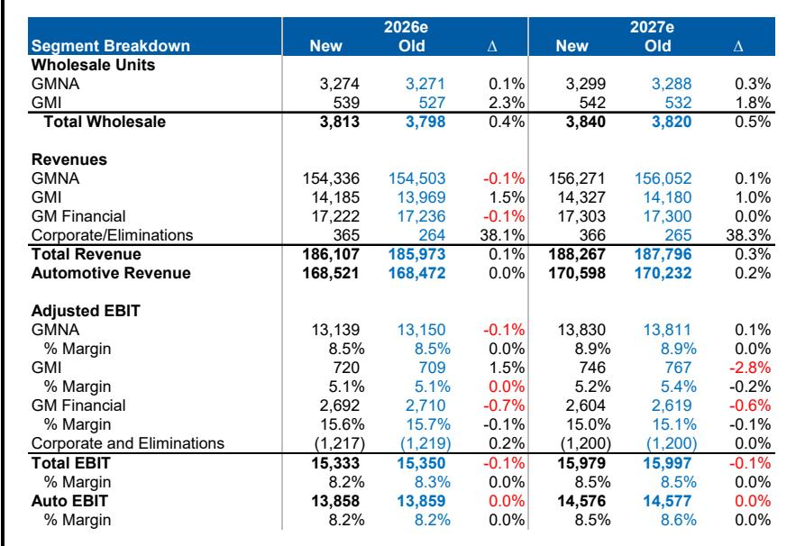
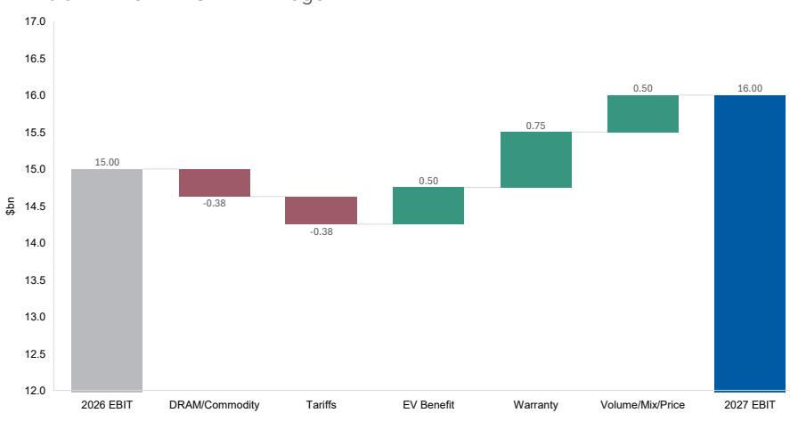
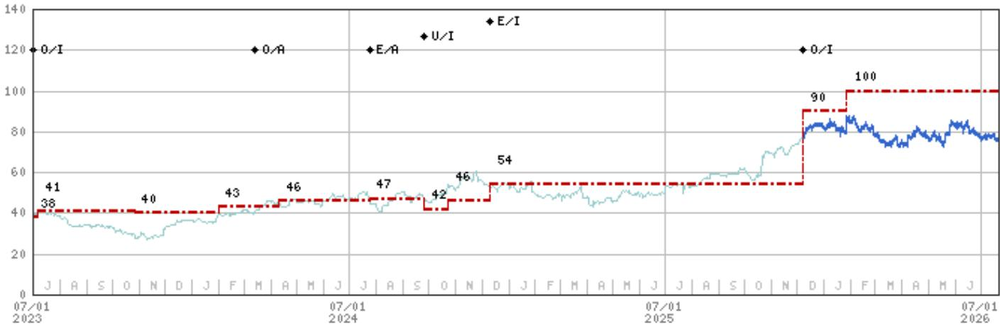

# GM的业绩超预期与上调指引已非重点：软件与防务业务将决定下一轮估值扩张

通用汽车（GM）2026年第二季度调整后息税前利润（EBIT）较市场共识预期高出5.5%，并将全年2026年指引中值上调5亿美元至140亿至160亿美元区间，同时首次给出2027年方向性展望，预示营收、EBIT及自由现金流将实现增长。这延续了读者已熟悉的模式：超预期、上调、再超预期。但真正的战略转变并非在于季度性利好，而在于GM在汽车业务盈利表象之下正在构建的内容。

公司正接近一个转折点，两大非传统收入来源——软件与服务、防务业务——可能开始重塑盈利结构，并关键性地改变市场赋予其的估值倍数。23亿美元的电动车相关减值支出结束了多季度的业务审查，消除了资本回报方面长期存在的隐忧，但下一阶段的估值重评将取决于GM能否让读者相信其盈利正变得更具韧性、更少周期性。本季度的证据表明，基础构件已就位，但验证将取决于未来12至18个月的执行情况。

第二季度的业绩超预期本身是扎实的，主要由北美地区推动，该地区EBIT较预期高出8%。更强的定价能力和成本管理（包括电动车亏损和保修成本的改善）是主要驱动因素。管理层将全年定价假设从“持平至增长0.5%”上调至“约增长0.5%”，并将预期的保修费用同比改善从约10亿美元提高至10亿至15亿美元。这些并非戏剧性的修正，但反映了近几个季度以来一贯的运营控制水平。对读者而言，问题已不再是GM能否执行其核心业务，而是公司能否从新来源产生足够增长，以证明一个反映非周期峰值汽车盈利的估值倍数是合理的。

## GM软件递延收入有望在年底达到75亿美元，打造市场尚未定价的高利润率收入引擎

GM第二季度业绩中最被低估的进展是其软件与服务业务的发展轨迹。递延收入在第二季度达到63亿美元，同比增长50%，管理层预计到2026年底将达到75亿美元。这并非一个小项目。它代表了一笔未来收入的储备，随着公司履行订阅承诺而逐步确认，其经济性令人瞩目：该收入的毛利率约为70%。

GM预计2026年将新增100万数字订阅用户，支持超过30亿美元的已确认收入。到2027年，递延收入余额将以两位数的增长率开始转化为已实现收入。其机制很简单。当客户购买配备Super Cruise或其他互联服务的车辆时，初始订阅期的收入被递延并随时间确认。随着安装基数的增长，递延收入池也随之扩大。而当订阅者在包含的服务期后续约时，收入便从递延转为高利润的经常性收入。

三个驱动因素将决定这是否能成为重要的盈利贡献来源。首先，Super Cruise在更多车型和配置上的可用性提升将扩大潜在市场。其次，包含服务期后高利润订阅收入的规模化将把递延库存转化为现金盈利。第三，随着功能进步（包括脱眼能力），每用户平均收入的提升将增加每次订阅的价值。

其战略意义重大。如果GM能够证明软件收入正以可预测的方式和高利润率增长，那么盈利流将减少对销量和定价周期的依赖。这种盈利质量的转变可能支撑更高的估值倍数。公司已开始增加围绕软件前景的披露，75亿美元的递延收入目标为读者提供了一个具体的跟踪基准。风险在于转化所需时间可能长于预期，或续约时的流失率高于模型假设。但方向是明确的：GM正在构建一个经常性收入基础，凭借70%的毛利率，它有可能随着时间的推移改变公司的利润率结构。

## 防务业务收入接近7亿美元，2026年目标实现正EBIT，增加第二个具有两位数利润率潜力的非汽车盈利流

GM的防务业务已从探索性 ventures 转变为切实的盈利贡献者。管理层预计2026年收入将接近7亿美元，仍不到总收入的1%，但关键在于其发展轨迹。该业务的目标是在2026年实现正EBIT，随后几年实现超过30%的年收入增长和两位数的利润率。

防务垂直领域代表着与汽车业务根本不同的盈利模式。合同通常是多年期、政府资助的，且对消费需求周期的敏感度较低。一旦业务达到规模，其利润率在结构上高于汽车制造利润率。对于一家历史上被估值周期性的汽车OEM公司而言，即使防务盈利的贡献很小，也可能开始改变市场叙事。

挑战在于规模。以7亿美元的收入计，防务业务在GM 1860亿美元的总收入背景下仍微不足道。要撬动合并利润率，该业务需要增长到数十亿美元的收入，同时保持或改善其利润率轨迹。如果30%的年增长目标得以维持，该业务将在三年内达到约15亿美元的收入。以两位数的利润率计算，这将贡献1.5亿美元或更多的EBIT。这本身并非变革性的，但与软件盈利流结合时，方向性意义重大。

通过Peak Energy合作伙伴关系进行的钠离子电池投资增加了另一层选择权。管理层对该技术的评论证实了以下观点：钠离子相比磷酸铁锂具有潜在成本优势、原材料丰富、温度适应性广以及冷却和维护要求更低。这种轻资产方式与GM更广泛的战略一致，即在保持战略选择权的同时维护资本效率。生产可能要到本十年末才能规模化，限制了近期的盈利上行空间，但该技术最终可能扩展到车辆应用并进一步降低电池成本。

## 23亿美元电动车支出完成多季度业务审查，消除资本回报的主要隐忧，使管理层专注于执行

第二季度新增的23亿美元电动车相关支出基本完成了GM对其电动车业务的审查。尽管公司此前已明确其对资本回报计划的承诺，但隐忧是真实存在的：读者担心未来与电动车重组相关的现金支出可能扰乱股票回购和股息节奏。

随着审查基本结束，这种不确定性已被消除。资本回报计划可以在不受意外支出干扰的情况下推进。这一点很重要，因为GM的自由现金流生成一直很强劲。公司仅在第二季度就产生了50亿美元的汽车自由现金流，全年估计为111亿美元，而市场共识为85亿美元。该现金流支持股票回购，而较低的流通股数已在贡献每股盈利增长——但需注意，这主要来自较低的流通股数，而非运营假设的改变。

电动车隐忧的消除也使管理层能够专注于将推动2027年盈利的运营杠杆。管理层提供的方向性展望指出，增长将由以下因素驱动：电动车盈利能力的改善、数字收入、增量保修成本节省、下一代雪佛兰Silverado和GMC Sierra皮卡定价能力的增强，以及为满足美国需求而增加的全尺寸SUV供应。这些是执行项目，而非重组项目，管理团队现在可以全神贯注于这些方面。

## 评估GM 2027年盈利桥梁的决策框架：决定公司能否实现160亿美元调整后EBIT的四个顺风与两个逆风

2027年的方向性展望为读者评估未来18个月将推动GM盈利的关键变量提供了一个有用的框架。基于基础分析的基本情景是，2027年调整后EBIT约为160亿美元，高于2026年上调后的指引中值150亿美元。但2026年至2027年之间的桥梁包含几个读者应跟踪的变动因素。

四个顺风如下。首先，电动车亏损预计在2027年改善5亿至10亿美元，继2026年改善10亿至15亿美元之后。改善速度放缓，但随着规模扩Daiwa电池成本下降，方向仍然积极。其次，保修成本预计在2027年改善5亿至10亿美元，同样较2026年10亿至15亿美元的改善速度放缓。第三，销量和价格预计贡献3.5亿至7.5亿美元的改善，由新卡车发布和SUV供应增加驱动。第四，随着递延收入余额转化为已确认收入，软件与服务收入流将开始更有意义地贡献。

两个逆风同样重要。首先，增量商品和DRAM成本预计造成2.5亿至5亿美元的拖累。这些是GM无法通过定价或效率提升完全抵消的投入成本。其次，关税逆风预计造成2.5亿至5亿美元的拖累，由2026年确认的5亿美元IEEPA退款不再发生驱动。部分影响被回流美国生产所抵消，后者减少了关税账单，但净效应仍是逆风。

该框架之所以有用，是因为它允许读者评估哪些变量在管理层控制范围内，哪些是外部因素。保修改善和电动车亏损减少是管理层可以通过质量改进和成本工程施加影响的运营变量。商品成本和关税是需要情景分析的外部变量。这四个顺风和两个逆风的净效应，加上软件贡献，决定了GM是达到160亿美元目标还是低于预期。

该框架还揭示，盈利增长是增量式的，而非变革性的。从2026年到2027年增加的10亿美元是由运营改善和外部顺风共同驱动的，其中任何一项本身都不具戏剧性。变革潜力在于软件和防务业务流，它们在2027年仍太小，无法显著影响整体EBIT数字，但如果增长轨迹得以维持，到2028年或2029年可能变得重要。

结论是，GM在短期内仍是一个运营执行的故事，而在中期则是一个结构性转型的故事。超预期与上调指引已成为常态，市场已基本消化了公司交付核心汽车业务的能力。下一轮估值扩张将取决于GM能否证明其软件和防务盈利流是真实的、增长的，并且足够持久以改变盈利质量的叙事。第二季度业绩提供了基础构件已就位的证据，但验证将在未来几个季度到来。

*仅供参考。部分内容可能基于源材料通过AI辅助生成、翻译、总结或编辑，可能存在遗漏或错误。请独立核实。本文不构成专业建议。*

仅供参考。部分内容可能基于源材料通过AI辅助生成、翻译、总结或编辑，可能存在遗漏或错误。请独立核实。本文不构成专业建议。

