Unless otherwise noted, all metrics are based on MS ModelWare framework

# 多重转型叠加推高执行风险；下调至低配

<table><tr><td colspan="3">变化摘要</td></tr><tr><td>Adobe Inc. (ADBE.O)</td><td>原评级</td><td>现评级</td></tr><tr><td>评级</td><td>等权重</td><td>低配</td></tr><tr><td>目标价</td><td>$365.00</td><td>$240.00</td></tr></table>

Adobe同时推进免费增值、管理层更迭和再投资三重转型，叠加生成式AI颠覆性讨论对ARR重新加速路径的干扰，使得执行风险进一步上升。在约12倍GAAP收益的估值水平下，风险可能已得到较多反映，但其他领域更清晰的增长和AI变现前景，支持我们给出相对低配的判断。

## 核心要点

三重转型（免费增值GTM、CEO/CFO更迭、AI再投资）推高执行风险，并进一步模糊了ARR稳定/加速的路径

■ 行业领先的利润率可能已接近峰值，因为AI和低ARPU用户互动需要更多投入，与SaaS同行相比，进一步运营杠杆的空间有限

估值约12倍GAAP每股收益可能已反映较多风险，但潜在反转的时间和幅度缺乏可见性，预计报价将在区间内波动

\- 由于需要持久的ARR重新加速来缓解对Creative Cloud生成式AI颠覆风险的担忧，短期内认为该标的相对低配；目标价下调至$240

自本报告起，Adam Wood担任Adobe（ADBE）的主要覆盖分析师，给予低配评级和$240目标价。

转型叠加降低反转的可见性。自去年秋季我们将评级调为等权重以来（参见《Adobe Inc.：未知因素困扰；下调至等权重》），我们对Adobe的判断并非公司缺乏紧迫感或创新力，而是将这些创新转化为持久的ARR加速变得越来越难以评估，因为Creative Cloud的ARR池面临更大的生成式AI替代风险（且难以有把握地量化这一风险在整体用户中的分布）。当时我们指出，生成式AI的变现进度落后于初期预期，因为Adobe主要优先考虑产品的普及和采用，而非直接变现。因此，ARR增长方向与产品创新速度、使用量上升以及定价收益在组合中的传导之间的分化，让市场参与者对重新加速的路径产生疑问。自那以后，我们（以及市场普遍）观察到三重增量转型进一步使该路径复杂化——更明确的免费增值市场策略转向、CEO/CFO同时更迭的领导层过渡，以及运营模式从利润收割转向AI再投资。虽然每项转型单独来看或许可控，但它们的叠加提高了执行门槛，而软件其他领域正提供更清晰的增长持续性、运营杠杆和/或近期AI变现证据。此外，在我们对覆盖范围内公司就AI准备度的“护城河与旅程”评分评估中，Adobe在SaaS中表现相对偏弱（详见下文）。综上，尽管我们承认约12倍CY27 GAAP市盈率的报价已反映较多颠覆风险，但Adobe的多重转型降低了可见性——因此也降低了我们对潜在反转时机和幅度的信心。我们预计这种不确定性和执行风险将继续抑制市场参与者参与意愿，使估值倍数承压并在区间内波动，支持我们的相对低配观点（图表1）。

图表1：ADBE报价处于成熟规模化软件同行区间的低端  
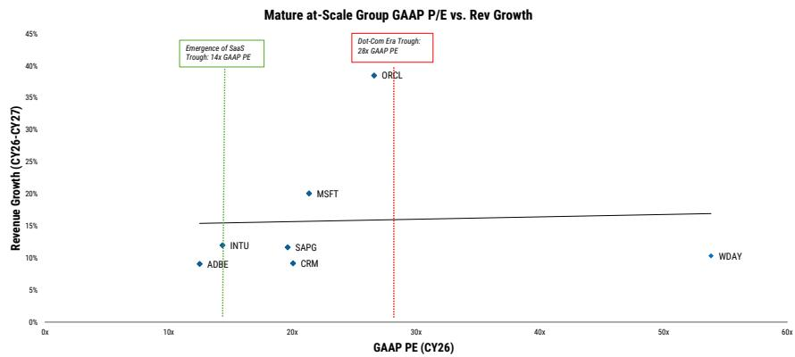  
来源：公司数据，MS

护城河与旅程框架。在今日的行业洞察中，我们通过AI带来的机遇与挑战两个维度评估了软件覆盖范围。我们从两个维度审视公司：公司抵御AI原生进入者和日益简化的代码创建的护城河，以及公司在适应将定义下一阶段软件的定价模式、开发周期和交互方式时必须经历的旅程。Adobe整体处于中间位置（第三五分位，总分64/100），护城河得分33/50，旅程得分31/50（图表2）。在护城河方面，我们认为Adobe的风险不在于品牌、分销或领域专长——其安装基数、创意专业人士的标准化以及数十年的工作流特定产品深度仍是显著优势。相反，风险集中在较低的工作流关键性和较弱的系统记录特性上，相对于其他软件公司——Adobe仍深度嵌入创意工作流，但部分工作流是任务型、可提示的，且日益暴露于AI原生替代，尤其是在用户未锚定于企业审批、合规或更广泛内容供应链编排的情况下。在旅程方面，我们认为Adobe的优势主要体现在其规模、强劲的盈利能力、资产负债表容量，以及由此产生的在有机和无机创新方面积极再投资的能力。然而，这种投资强度尚未转化为可见的增长拐点，使得市场参与者将AI视为Creative领域的机遇与颠覆风险并存。因此，如果有证据表明不断增长的AI使用量和免费增值流量正在可持续地转化为付费ARR，并最终推动ARR增长持续和/或加速至低两位数水平，我们可能会对Adobe的旅程更加积极。

图表2：Adobe在护城河和旅程两方面均处于中间位置  
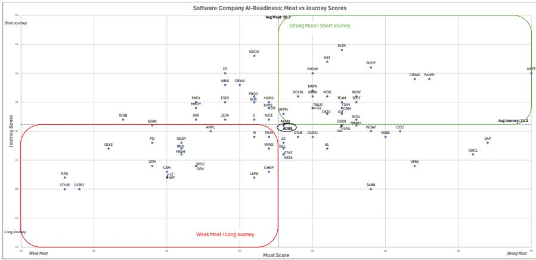  
来源：MS

结合Adobe在我们护城河与旅程框架分析中的相对位置，我们因三重即将到来的转型叠加推高执行风险而下调至低配：

1. 免费增值获取与变现转型抑制ARR可见性。在Adobe第二季度财报中，公司实际上降低了有机ARR增长（约$500M），因为全年ARR增长指引（同比+10.2%，反映从FY25约11.5%持续减速的趋势，图表3）在Semrush收购完成后保持不变。这一展望反映了加速免费增值MAU增长并推迟此前计划的Creative Cloud定价行动的战略选择，管理层将ARR影响大致均分归因于这两个驱动因素。管理层评论表明，免费增值转向是对AI将需求从传统品牌购买路径引向基于意图的创意任务的回应。虽然这一动态确实体现在流量模式中（截至第二季度，Adobe.com上的商务专业及消费者流量同比增长35%，创意免费增值MAU从50M增至90M），但管理层正越来越多地将该需求导向Acrobat、Express和Firefly体验，而非直接付费漏斗。因此，我们认为近期Creative增长拐点更难评估。虽然免费增值可能是正确的长期策略（尤其是如果替代方案是过早将高意向流量推入付费流程而失去用户），但变现不太可能是线性的。Adobe现在需要扩展并优化其现有的转化基础设施——包括付费墙时机、积分消耗和升级路径——面向一个更大的创意免费增值受众，同时不损害用户参与度，这一过程可能需要时间。因此，我们认为如果没有比历史更积极的Creative Cloud定价努力，ARR增长可能会持续减速至FY27，而鉴于免费增值执行中的诸多变数，我们认为这种定价努力不太可能实现。

图表3：总ARR增长持续减速  
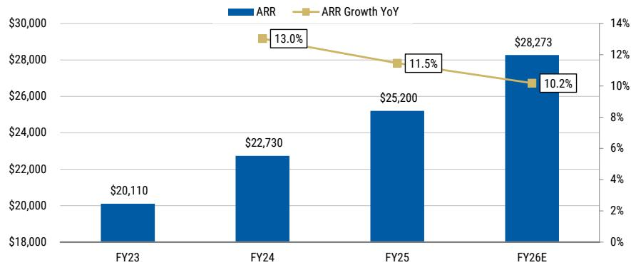  
来源：公司数据，MS

2. “利润率转型”：Adobe再投资于有机创新并加大战略并购力度。凭借SaaS中领先的利润率（图表4），Adobe有充足空间进行投入以参与这一创新周期。然而，即使在FY25加大投入后（尤其是在研发方面，图表5），Adobe在我们的效率分析中仍位居前列（图表6和图表7），表明公司可能正接近效率峰值，未来杠杆空间有限。因此，我们实际上可能看到近期利润率面临一定下行倾向，原因包括：1）免费增值转型实际上将更多投入（投资）引入低ARPU群体，早于变现（投资回报）；2）随着公司优先优化品牌和客户忠诚度而非近期变现，AI使用量上升可能对毛利率构成影响。鉴于人均运营利润已优化、利润率已接近峰值，且管理层仍需进行有机和无机投入以捍卫Creative，我们认为标准效率周期带来显著利润率上行的机会较少。要从当前水平实现利润率的阶跃式提升，Adobe可能需要一次有意义的重组——这在需要执行一项依赖加速创新、改善免费增值转化并证明AI能够扩展而非蚕食Creative基础的战略时，是一个难以传达的信息。

图表4：Adobe在SaaS同行中拥有领先的利润率……  
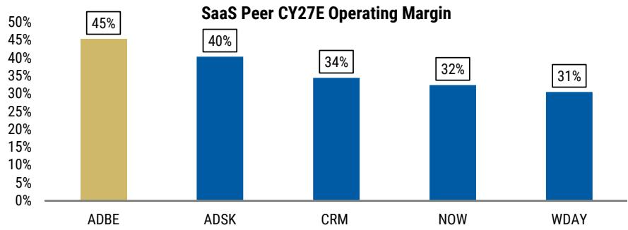  
来源：公司数据，MS

图表5：……即使在研发支出占收入比重显著提升之后  
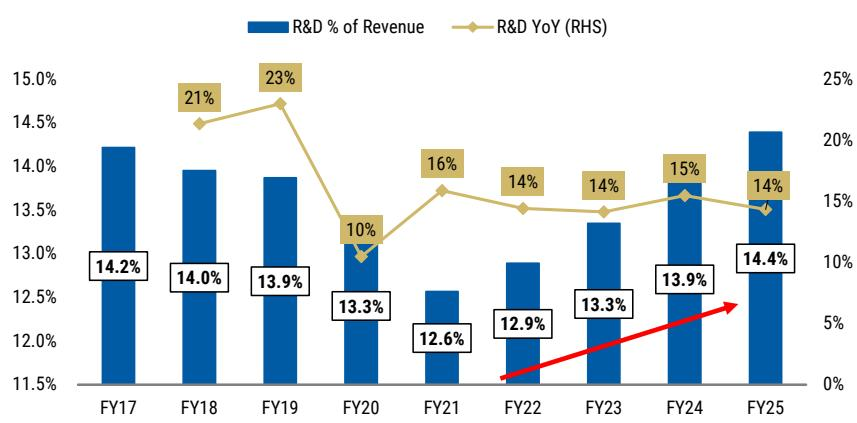  
来源：公司数据，MS

图表6：Adobe在GAAP GP/员工方面排名靠前……  
  
来源：公司数据，MS

图表7：……GAAP运营利润/员工同样如此  
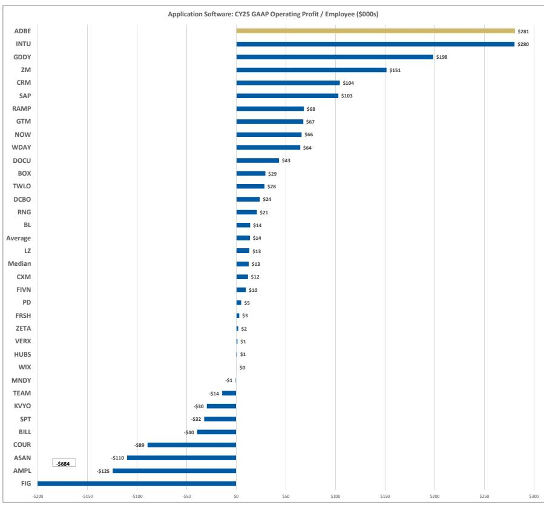  
来源：公司数据，MS

图表8：相对而言，鉴于需要通过研发投入参与AI创新周期，我们认为在S&M支出较高的SaaS同行（尤其是CRM）中，杠杆和运营费用优化的空间更大  
  
来源：公司数据，MS。利润率基于非GAAP口径

3. 领导层更迭时机叠加战略风险。CEO和CFO的更迭不一定改变我们对Adobe产品深度的看法，但无疑在叙事困难时期提高了执行门槛。在1Q26财报电话会议上，长期担任CEO的Shantanu Narayen宣布，一旦继任者被任命，他将从CEO职位过渡，同时保留董事长职务，董事会正在评估内部和外部候选人。此外，CFO Dan Durn在2Q26财报同时宣布离职（加入Marvell），Steve Day被任命为临时CFO。我们认为，在更平稳的时期，有计划的继任是可控的，但当前Adobe正在围绕免费增值重构市场策略、推迟Creative Cloud定价、整合收购，并且最关键的是，要求市场参与者评估一个延迟的变现曲线，因为它更积极地推进免费增值模式。在新领导团队确定优先事项、市场能够评估免费增值/AI再投资周期是否转化为ARR加速之前，我们预计“先看证据”的情绪将持续。

目标价下调至$240。我们将目标价下调至$240（此前为$365），因为我们现采用9倍估值倍数（此前为13倍，仍低于Adobe历史均值），应用于我们对FY27每股收益约$27.23的估计。这得出$240的目标价，隐含约0.6倍PEG（相对于SaaS同行折价）。我们的目标价也隐含约12倍CY27 GAAP市盈率，同样相对于SaaS同行略有折价，我们认为鉴于突出的生成式AI颠覆讨论和加剧的近期执行担忧，这一折价是合理的。

低配判断的风险：1）免费增值流量转化快于预期；2）新任CEO/CFO通过战略重组显著改善盈利能力；3）AI被证明对Creative业务具有净扩张效应，Firefly/Express的采用、AI积分变现以及企业内容供应链需求推动持久的ARR重新加速，并缓解Creative Cloud颠覆担忧。

## 风险回报 – Adobe Inc. (ADBE.O)

多重转型叠加推高执行风险

## 目标价 $240.00

我们的$240目标价基于9倍基准情景2027年每股收益$27.23。FY27e的9倍每股收益倍数隐含约0.6倍PEG，相对于SaaS同行和ADBE历史均值折价

市场共识目标价分布

来源：Refinitiv，MS

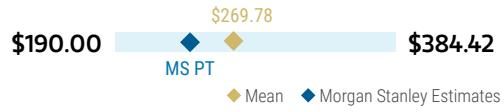

## 风险回报图表及期权隐含概率（12个月）

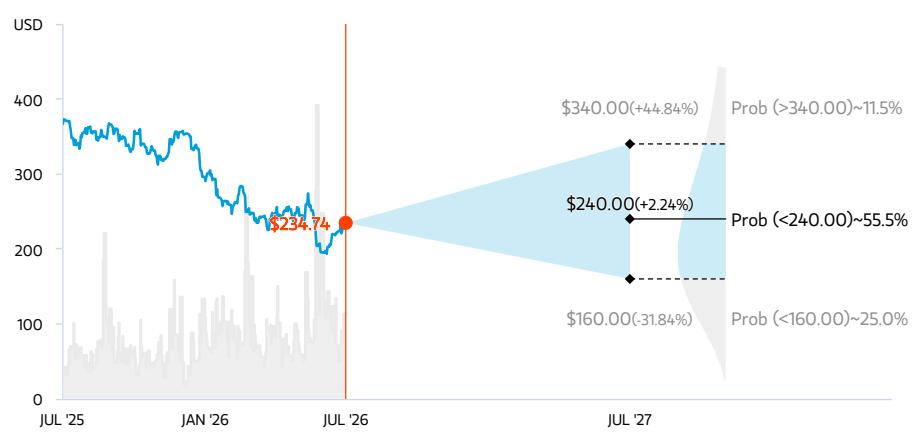  
关键：— 历史表现 ● 当前报价 ◆ 目标价

来源：Refinitiv，MS，MS机构权益部门。我们牛市、基准和熊市情景的概率是基于截至2026年7月20日期权市场的隐含波动率数据估算的。所有数字均为近似风险中性概率，表示报价在三个月或一年内达到情景价格以上的可能性。点击此处查看期权概率方法说明

## 低配判断逻辑

■ Adobe在专业创意工作流和企业内容供应链中拥有强大的护城河，得益于其品牌、分销和工作流特定的产品深度。然而，消费者、商务用户和较简单的营销人员仍易受AI原生替代的影响

■ 免费增值、领导层更迭和再投资三重转型叠加推高执行风险，因为推迟的CC定价、不确定的免费增值转化以及同时进行的CEO/CFO更迭降低了ARR增长重新加速的可见性

■ 行业领先的利润率提供了捍卫业务的能力，但认为增量杠杆选择有限。约10倍GAAP市盈率反映了风险，但认为其他领域存在更清晰的增长、杠杆和AI变现机会。相对低配

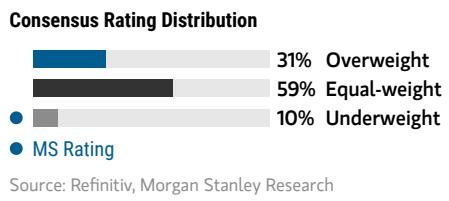

## 风险回报主题

颠覆：负面
定价能力：负面
技术扩散：正面

点击此处查看风险回报主题说明

## 牛市情景

## $340.00

## 12倍牛市情景2027年每股收益$28.20

免费增值流量的有效转化扩大了用户基础并推高了定价，支撑总收入CAGR达12%。运营利润率约45%，FY27每股收益为$28.20。ADBE以12倍每股收益交易，基本与成熟规模化软件同行持平，受益于中十几%的每股收益CAGR，得出$340/股。

## 基准情景

## $240.00 熊市情景

## 9倍基准情景2027年每股收益$27.23

总收入从FY24到FY27以10%的CAGR增长。运营利润率44.7%，FY27每股收益为$27.23，FY24-FY27每股收益CAGR为14%。在FY27e以9倍每股收益倍数交易，得出$240/股，ADBE约0.6倍PEG，相对于其历史均值折价。

## $160.00

## 6倍熊市情景2027年每股收益$26.32

来自AI原生企业的竞争限制了有效将免费增值流量转化为付费ARR的能力，导致增长进一步减速。FY27利润率保持约45%，因增长投入放缓，得出FY27e每股收益$26.32。该标的以6倍FY27e每股收益交易，得出$160/股。

## 风险回报 – Adobe Inc. (ADBE.O)

## 关键收益输入

<table><tr><td>驱动因素</td><td>2025年12月</td><td>2026年12月e</td><td>2027年12月e</td><td>2028年12月e</td></tr><tr><td>数字媒体净新增ARR同比 (%)</td><td>11.5</td><td>10.3</td><td>9.6</td><td>0.0</td></tr><tr><td>每股收益同比 (%)</td><td>13.6</td><td>16.5</td><td>11.6</td><td>8.9</td></tr><tr><td>数字体验收入同比 (%)</td><td>9.0</td><td>9.6</td><td>10.1</td><td>10.1</td></tr><tr><td>总收入同比 (%)</td><td>10.5</td><td>11.7</td><td>9.1</td><td>8.7</td></tr><tr><td>运营利润率 (%)</td><td>46.2</td><td>45.0</td><td>44.7</td><td>44.5</td></tr></table>

## 投资驱动因素

\- 提升客户生命周期价值和TAM扩展机会

\- 通过免费增值产品扩大客户基础

• 围绕一方数据的长期数据趋势

\- 运营杠杆和股份回购

## 全球收入分布

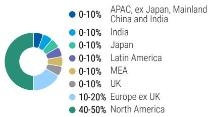  
来源：MS估计 点击此处查看区域层级说明

## MS ALPHA模型

<table><tr><td>1/5最佳</td><td>24个月展望</td><td>1/5最多</td><td>3个月展望</td></tr></table>

来源：Refinitiv，FactSet，MS；1为最高偏好五分位，5为最低偏好五分位

## 目标价/评级的风险

## 上行风险

\- 免费增值流量转化快于预期

\- 新任CEO/CFO通过战略重组显著改善盈利能力

\- AI被证明对Creative业务具有净扩张效应

## 下行风险

\- 难以有效将免费增值流量转化为付费

\- 用户基础更快被蚕食/竞争加剧拖累增长

• 生成式AI投入导致利润率下降

## 持仓情况

<table><tr><td>机构持有人，主动型占比</td><td>44.9%</td><td colspan="3"></td></tr><tr><td>对冲基金行业多空比</td><td>2.1x</td><td colspan="3"></td></tr><tr><td>对冲基金行业净敞口</td><td>29.5%</td><td colspan="3"></td></tr></table>

Refinitiv；MSPB内容。包含与MSPB持有的部分对冲基金敞口。信息可能与更广泛的市场趋势不一致或无法反映。多空比 = 多头敞口 / 空头敞口。行业占净敞口百分比 = （特定行业：多头敞口 - 空头敞口）/（所有行业：多头敞口 - 空头敞口）。

MS估计 vs. 市场共识  
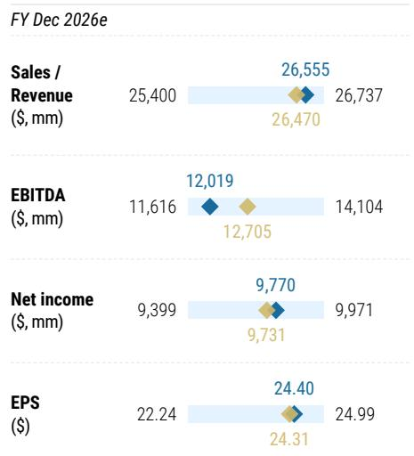  
平均MS估计 来源：Refinitiv，MS

## 模型变更与财务数据

图表9：模型变更

<table><tr><td></td><td>FY23</td><td>FY24</td><td>FY25</td><td>2/26</td><td>5/26</td><td>8/26E</td><td>11/26E</td><td>FY26E</td><td>FY27E</td></tr><tr><td>新创意与营销F</td><td>$13,420M</td><td>$14,750M</td><td>$16,312M</td><td>$4,390M</td><td>$4,540M</td><td>$4,620M</td><td>$4,689M</td><td>$18,240M</td><td>$19,827M</td></tr><tr><td>同比变化</td><td>0.0%</td><td>9.9%</td><td>10.6%</td><td>11.9%</td><td>12.9%</td><td>12.1%</td><td>10.3%</td><td>11.8%</td><td>8.7%</td></tr><tr><td>旧CMP</td><td>$13,420M</td><td>$14,750M</td><td>$16,312M</td><td>$4,390M</td><td>$4,426M</td><td>$4,450M</td><td>$4,570M</td><td>$17,835M</td><td>$19,404M</td></tr><tr><td>同比变化</td><td>0.0%</td><td>9.9%</td><td>10.6%</td><td>11.9%</td><td>10.1%</td><td>8.0%</td><td>7.5%</td><td>9.3%</td><td>8.8%</td></tr><tr><td>% 变化</td><td>0%</td><td>0%</td><td>0%</td><td>0%</td><td>3%</td><td>4%</td><td>3%</td><td>2%</td><td>2%</td></tr><tr><td>新消费者与商务</td><td>$4,750M</td><td>$5,670M</td><td>$6,504M</td><td>$1,780M</td><td>$1,850M</td><td>$1,880M</td><td>$1,950M</td><td>$7,460M</td><td>$8,368M</td></tr><tr><td>同比变化</td><td></td><td>19.4%</td><td>14.7%</td><td>16.0%</td><td>15.6%</td><td>13.9%</td><td>13.4%</td><td>14.7%</td><td>12.2%</td></tr><tr><td>旧C&amp;BP</td><td>$4,893M</td><td>$5,670M</td><td>$6,504M</td><td>$1,780M</td><td>$1,812M</td><td>$1,859M</td><td>$1,932M</td><td>$7,383M</td><td>$8,385M</td></tr><tr><td>同比变化</td><td>10.7%</td><td>19.4%</td><td>14.7%</td><td>16.0%</td><td>13.3%</td><td>12.7%</td><td>12.3%</td><td>13.5%</td><td>13.6%</td></tr><tr><td>% 变化</td><td>-3%</td><td>0%</td><td>0%</td><td>0%</td><td>2%</td><td>1%</td><td>1%</td><td>1%</td><td>0%</td></tr><tr><td>新总收入</td><td>$19,409M</td><td>$21,505M</td><td>$23,769M</td><td>$6,398M</td><td>$6,618M</td><td>$6,695M</td><td>$6,844M</td><td>$26,555M</td><td>$28,965M</td></tr><tr><td>同比变化</td><td>10.2%</td><td>10.8%</td><td>10.5%</td><td>12.0%</td><td>12.7%</td><td>11.8%</td><td>10.5%</td><td>11.7%</td><td>9.1%</td></tr><tr><td>旧总收入</td><td>$19,409M</td><td>$21,505M</td><td>$23,769M</td><td>$6,398M</td><td>$6,461M</td><td>$6,472M</td><td>$6,680M</td><td>$26,011M</td><td>$28,560M</td></tr><tr><td>同比变化</td><td>10.2%</td><td>10.8%</td><td>10.5%</td><td>12.0%</td><td>10.0%</td><td>8.1%</td><td>7.8%</td><td>9.4%</td><td>9.8%</td></tr><tr><td>% 变化</td><td>0%</td><td>0%</td><td>0%</td><td>0%</td><td>2%</td><td>3%</td><td>2%</td><td>2%</td><td>1%</td></tr><tr><td>新总ARR</td><td></td><td>$22,730M</td><td>$25,200M</td><td>$26,060M</td><td>$27,100M</td><td>$27,482M</td><td>$28,273M</td><td>$28,273M</td><td>$30,862M</td></tr><tr><td>旧总ARR</td><td></td><td>$22,730M</td><td>$25,200M</td><td>$26,060M</td><td>$27,100M</td><td>$27,570M</td><td>$28,273M</td><td>$28,273M</td><td>$31,650M</td></tr><tr><td>% 变化</td><td></td><td>0%</td><td>0%</td><td>0%</td><td>0%</td><td>0%</td><td>0%</td><td>0%</td><td>-2%</td></tr><tr><td>新运营利润</td><td>$8,918M</td><td>$10,019M</td><td>$10,986M</td><td>$3,035M</td><td>$2,945M</td><td>$2,943M</td><td>$3,037M</td><td>$11,960M</td><td>$12,953M</td></tr><tr><td>新运营利润率</td><td>45.9%</td><td>46.6%</td><td>46.2%</td><td>47.4%</td><td>44.5%</td><td>44.0%</td><td>44.4%</td><td>45.0%</td><td>44.7%</td></tr><tr><td>旧运营利润</td><td>$8,918M</td><td>$10,019M</td><td>$10,986M</td><td>$3,035M</td><td>$2,878M</td><td>$2,883M</td><td>$2,897M</td><td>$11,693M</td><td>$12,949M</td></tr><tr><td>旧运营利润率</td><td>45.9%</td><td>46.6%</td><td>46.2%</td><td>47.4%</td><td>44.5%</td><td>44.5%</td><td>43.4%</td><td>45.0%</td><td>45.3%</td></tr><tr><td>% 变化</td><td>0%</td><td>0%</td><td>0%</td><td>0%</td><td>2%</td><td>2%</td><td>5%</td><td>2%</td><td>0%</td></tr><tr><td>新FCF</td><td>$6,942M</td><td>$7,873M</td><td>$9,852M</td><td>$2,921M</td><td>$2,107M</td><td>$2,323M</td><td>$3,077M</td><td>$10,428M</td><td>$11,330M</td></tr><tr><td>新FCF利润率</td><td>35.8%</td><td>36.6%</td><td>41.4%</td><td>45.7%</td><td>31.8%</td><td>34.7%</td><td>45.0%</td><td>39.3%</td><td>39.1%</td></tr><tr><td>同比变化</td><td>-6.1%</td><td>13.4%</td><td>25.1%</td><td>18.9%</td><td>-1.7%</td><td>9.3%</td><td>-1.6%</td><td>5.9%</td><td>8.6%</td></tr><tr><td>旧FCF</td><td>$6,942M</td><td>$7,873M</td><td>$9,852M</td><td>$2,921M</td><td>$1,679M</td><td>$2,285M</td><td>$3,227M</td><td>$10,112M</td><td>$11,420M</td></tr><tr><td>旧FCF利润率</td><td>35.8%</td><td>36.6%</td><td>41.4%</td><td>45.7%</td><td>26.0%</td><td>35.3%</td><td>48.3%</td><td>38.9%</td><td>40.0%</td></tr><tr><td>新每股收益</td><td>$16.06</td><td>$18.43</td><td>$20.94</td><td>$6.05</td><td>$5.97</td><td>$6.06</td><td>$6.32</td><td>$24.40</td><td>$27.23</td></tr><tr><td>同比变化</td><td>17.1%</td><td>14.7%</td><td>13.6%</td><td>19.2%</td><td>18.0%</td><td>14.1%</td><td>14.9%</td><td>16.5%</td><td>11.6%</td></tr><tr><td>旧每股收益</td><td>$16.06</td><td>$18.43</td><td>$20.94</td><td>$6.05</td><td>$5.85</td><td>$5.70</td><td>$5.85</td><td>$23.46</td><td>$26.37</td></tr><tr><td>同比变化</td><td>17.1%</td><td>14.7%</td><td>13.6%</td><td>19.2%</td><td>15.7%</td><td>7.4%</td><td>6.3%</td><td>12.1%</td><td>12.4%</td></tr><tr><td>% 变化</td><td>0%</td><td>0%</td><td>0%</td><td>0%</td><td>2%</td><td>6%</td><td>8%</td><td>4%</td><td>3%</td></tr></table>

来源：公司数据，MS

图表10：利润表

<table><tr><td colspan="17">（百万美元，每股数据除外）</td></tr><tr><td></td><td>FY21</td><td>FY22</td><td>FY23</td><td>FY24</td><td>FY25</td><td>2/26</td><td>5/26</td><td>8/26E</td><td>11/26E</td><td>FY26E</td><td>2/27</td><td>5/27E</td><td>8/27E</td><td>11/27E</td><td>FY27E</td><td>FY28E</td></tr><tr><td>总收入</td><td>15,785</td><td>17,606</td><td>19,409</td><td>21,505</td><td>23,769</td><td>6,398</td><td>6,618</td><td>6,695</td><td>6,844</td><td>26,555</td><td>6,987</td><td>7,176</td><td>7,285</td><td>7,517</td><td>28,965</td><td>31,496</td></tr><tr><td>% 同比增速</td><td>22.7%</td><td>11.5%</td><td>10.2%</td><td>10.8%</td><td>10.5%</td><td>12.0%</td><td>12.7%</td><td>11.8%</td><td>10.5%</td><td>11.7%</td><td>9.2%</td><td>8.4%</td><td>8.8%</td><td>9.8%</td><td>9.1%</td><td>8.7%</td></tr><tr><td>% 环比增速</td><td>-</td><td>-</td><td>-</td><td>-</td><td>-</td><td>3%</td><td>3%</td><td>1%</td><td>2%</td><td>-</td><td>2%</td><td>3%</td><td>2%</td><td>3%</td><td>-</td><td>-</td></tr><tr><td>收入成本</td><td></td><td></td><td></td><td></td><td></td><td></td><td></td><td></td><td></td><td></td><td></td><td></td><td></td><td></td><td></td><td></td></tr><tr><td>总收入成本</td><td>1,615</td><td>1,838</td><td>1,989</td><td>2,116</td><td>2,278</td><td>630</td><td>669</td><td>625</td><td>666</td><td>2,590</td><td>674</td><td>771</td><td>705</td><td>755</td><td>2,905</td><td>3,172</td></tr><tr><td>毛利润</td><td>14,170</td><td>15,768</td><td>17,420</td><td>19,389</td><td>21,491</td><td>5768</td><td>5949</td><td>6070</td><td>6178</td><td>23,965</td><td>6313</td><td>6405</td><td>6581</td><td>6761</td><td>26,060</td><td>28,324</td></tr><tr><td>毛利率</td><td>89.8%</td><td>89.6%</td><td>89.8%</td><td>90.2%</td><td>90.4%</td><td>90.2%</td><td>89.9%</td><td>90.7%</td><td>90.3%</td><td>90.2%</td><td>90.4%</td><td>89.3%</td><td>90.3%</
