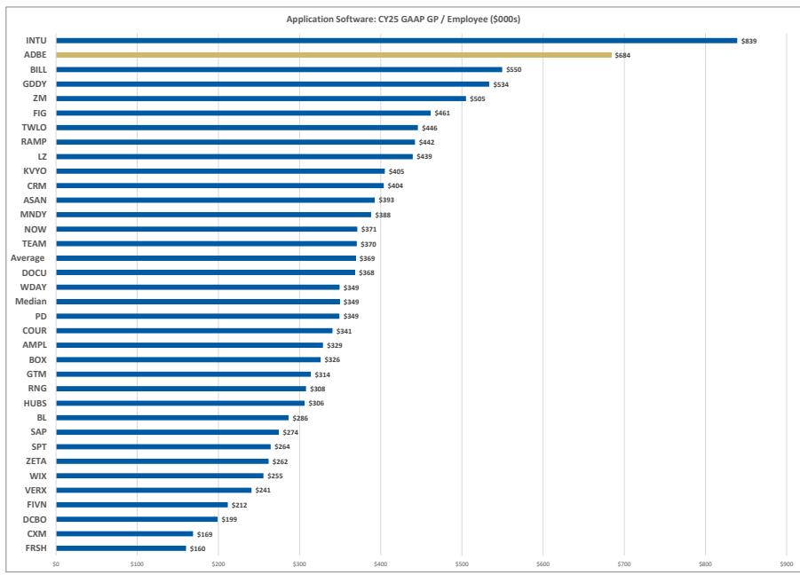
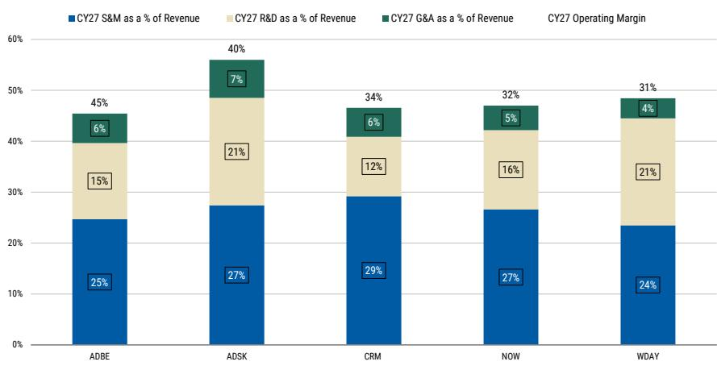

# MS：Adobe三重转型叠加执行业务与近期数据观察

Adobe 正在同时推进免费增值模式转型、CEO 和 CFO 交接、以及 AI 再研究，这三件事单独看或许可控，但叠加在一起，让市场很难判断其核心指标——年度经常性收入（ARR）何时能重新加速。MS在最新报告中调整了对 Adobe 的观察，认为其当前约 12 倍 GAAP 市盈率的估值虽然已经反映了部分不确定性，但缺乏清晰的扭转路径，报价可能长期在低位区间波动。

报告的核心判断是：Adobe 的 ARR 增速从 FY25 的约 11.5% 持续节奏变化，而公司主动选择推迟 Creative Cloud 涨价、将用户导入免费产品线，意味着短期内很难看到增长拐点。与此同时，其行业领先的利润率可能已接近峰值，AI 和低 ARPU 用户群的运营投入将压缩进一步改善的空间。

## 1. 免费增值模式转型拉低了 ARR 可见度

在 2026 财年第二季度，Adobe 管理层将全年 ARR 增长指引维持在同比增长约 10.2%，但这一数字包含了 Semrush 收购的贡献。剔除收购后，有机 ARR 增长实际上被下调了约 5 亿美元。管理层将这一影响归因于两个因素：加速免费增值 MAU 增长，以及推迟原计划的 Creative Cloud 定价调整，两者对 ARR 的影响大致各占一半。

免费增值策略的逻辑是应对 AI 带来的用户行为变化——传统品牌购买路径正在被意图驱动的创意任务取代。Adobe.com 上商务专业和消费者流量同比增长 35%，Creative 免费 MAU 从 5000 万增至 9000 万。但问题在于，这些流量被导向 Acrobat、Express 和 Firefly 等免费体验，而非直接进入付费转化漏斗。报告认为，免费增值可能是正确的长期策略，但货币化不会是线性的。Adobe 需要在一个更大的免费用户池中优化付费墙时机、信用消耗和升级路径，这个过程需要时间。

> **KC评论：** 免费增值模式的核心矛盾在于，用户规模增长与 ARR 增长之间存在时间差。Adobe 现在需要证明的是，这 9000 万免费用户中有多少能在未来 12-18 个月内转化为付费用户，而不是仅仅展示流量数字。报告隐含的意思是，如果转化率不及预期，ARR 增速可能继续下滑至 FY27。

## 2. 利润率已近峰值，再研究空间有限

Adobe 在 SaaS 同行中拥有最高的利润率水平，但报告认为这可能已是阶段性高点。即便在 FY25 显著增加了研发投入后，Adobe 在人均运营利润等效率指标上仍位居行业前列，这意味着进一步通过效率提升来扩大利润率的空间已经很小。

相反，短期内利润率可能面临节奏变化不确定性。免费增值模式将更多用户引入低 ARPU 群体，在货币化之前需要持续投入；AI 使用量的上升也可能拉低毛利率，因为公司优先考虑品牌和用户忠诚度而非短期变现。报告指出，如果 Adobe 想从当前水平实现利润率的跃升，可能需要一次实质性的重组——但这与当前需要加速创新、改善免费增值转化、证明 AI 能扩大而非蚕食 Creative 用户群的战略方向存在矛盾。

## 3. 领导层交接在关键节点增加了执行难度

CEO 和 CFO 的同时交接，是报告认为最容易被低估的不确定性。长期 CEO Shantanu Narayen 已宣布将在继任者确定后交棒，CFO Dan Durn 也已离职。在正常时期，有序的继任计划可以平稳推进，但 Adobe 目前正在重构市场进入策略、推迟定价调整、整合收购，同时要求读者接受一个延迟的货币化曲线。

在新领导团队明确优先级、市场能够评估免费增值和 AI 再研究周期能否转化为 ARR 加速之前，报告预计“先看证据”的情绪将持续压制报价。这种不确定性使得读者很难在当前估值水平上建立信心。

## 4. 一个可复用的观察框架：护城河与旅程评分

报告引入了一个分析框架，从“护城河”和“旅程”两个维度评估软件公司在 AI 时代的定位。护城河衡量公司抵御 AI 原生竞争者的能力，旅程衡量公司适应新定价模式、开发周期和交互方式的难度。

Adobe 在MS覆盖的软件公司中处于中间位置，总分 64/100。护城河得分 33/50，不确定性并非来自品牌或分销能力——其安装基础、创意专业人士的标准化使用习惯和数十年的工作流产品深度仍是显著优势——而是来自工作流关键性较低、系统记录属性较弱。部分创意工作流是任务导向的、可提示的，越来越容易被 AI 原生工具替代，尤其是在用户不依赖企业审批、合规或内容供应链协调的场景中。

旅程得分 31/50，优势在于规模、盈利能力和资产负债表，使其有能力进行激进的有机和无机研究。但问题在于，这些研究尚未转化为可见的增长拐点。报告认为，只有当 AI 使用量和免费增值流量持续转化为付费 ARR，推动 ARR 增长向低双位数迈进时，Adobe 的旅程评分才有望改善。

For informational purposes only. Portions may be generated,translated,summarized,or edited with AI assistance based on source materials and may contain omissions or errors. Please verify independently. This is not investment,legal,tax,accounting,or other professional advice.

For informational purposes only. Portions may be generated,translated,summarized,or edited with AI assistance based on source materials and may contain omissions or errors. Please verify independently. This is not investment,legal,tax,accounting,or other professional advice.

