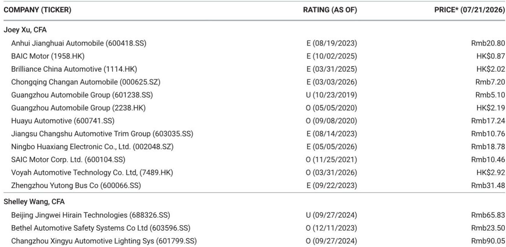

# MS：中国汽车共享出行逐步落地与窄化

7月第三周，中国汽车市场订单出现回暖迹象，但这份MS基于渠道调研的周度追踪显示，这轮反弹并非全面启动。报告覆盖的11个品牌中，只有小鹏和理想汽车凭借新车型上市实现了显著周环比增长，其余品牌的订单改善幅度温和，鸿蒙智行甚至成为相对少见环比下滑的主要品牌。

分析师认为，夏季产品周期带来的订单回升正在逐步落地，但强度更多体现为“个别新车型驱动”，而非全行业的跳板式复苏。对于读者而言，判断这轮订单改善的可持续性，比关注单周数据本身更重要。

## 1. 小鹏与理想凭借新车型实现周订单弹性较高

小鹏汽车7月16日开启MONA L03预订，当周订单量跃升至4.18-4.2万，周环比增长585%，月环比增长497%，同比增长287%。理想汽车受益于新L系列上市，当周订单1.79-1.81万，周环比增长225%，月环比增长196%，同比增长118%，其中新L系列贡献了超过75%的订单。

这两家公司的订单爆发直接对应产品发布窗口。报告指出，新车型驱动的订单表现是当前较强的信号，但可持续性仍待观察——在竞争持续激烈的环境下，单周订单高峰能否转化为稳定的月度交付，是后续需要追踪的关键。

## 2. 比亚迪订单企稳，零跑持续获得增量

相比新车型驱动的爆发式增长，比亚迪和零跑的订单表现提供了更持久的信号。比亚迪当周订单7.67-7.72万，周环比增长4%，月环比下降9%，同比增长7%。零跑订单1.61-1.66万，周环比增长15%，月环比下降2%，同比增长58%。

这两家公司的订单增速虽不及小鹏和理想，但波动幅度更小，反映出稳定的市场需求基础。比亚迪的订单企稳尤其值得关注——作为行业规模最大的参与者，其订单不再继续下滑，可能意味着价格竞争进入阶段性平衡。

> **KC评论：** 零跑的订单连续几周保持同比增长超过50%，且不依赖单一新车型爆发，这种“匀速增长”在当前的竞争环境中反而更稀缺。报告没有展开零跑的增长来源，但渠道反馈显示其产品定位和定价策略正在持续获得市场认可。

## 3. 鸿蒙智行成为相对少见周环比下滑的主要品牌

鸿蒙智行当周订单0.94-0.96万，周环比下降2%，月环比下降33%。其中Aito品牌订单0.62-0.64万，周环比增长7%，但月环比仍下降28%。这是报告覆盖的主要品牌中相对少见出现周环比下滑的。

鸿蒙智行的订单下滑与行业整体回暖形成反差。报告没有详细解释原因，但结合其月环比大幅下降33%的数据，可能反映出此前集中交付后的订单透支，或是竞品新车型上市带来的分流效应。

## 4. 特斯拉中国订单小幅回升，蔚来双品牌订单反弹

特斯拉中国当周订单1.1-1.12万，周环比增长22%，月环比增长7%，但同比下降15%。蔚来当周订单1.18-1.2万，周环比增长27%，月环比下降21%，同比增长127%。报告特别指出，蔚来和ONVO双品牌的订单流入均出现反弹。

特斯拉的订单回升幅度温和，且同比仍为负增长，反映出其在华面临的竞争不确定性。蔚来的双品牌策略开始显现效果——主品牌和ONVO同时获得订单增长，但月环比下降21%说明单周反弹的持续性仍需验证。

## 5. 观察框架：区分“新车型脉冲”与“稳态需求”

这份报告提供了一个可复用的观察框架：将品牌订单分为“新车型驱动型”和“稳态需求型”。前者关注产品发布窗口的订单峰值和转化率，后者关注月度订单的波动幅度和同比增长趋势。

当前市场环境下，新车型脉冲的可持续性取决于三个因素：产品力是否足够支撑定价、产能爬坡速度、以及竞品是否会在同一价格带推出对标产品。稳态需求型品牌则需要关注其市场份额是否在价格竞争中被侵蚀，以及产品矩阵能否覆盖更广泛的消费群体。

For informational purposes only. Portions may be generated,translated,summarized,or edited with AI assistance based on source materials and may contain omissions or errors. Please verify independently. This is not investment,legal,tax,accounting,or other professional advice.

For informational purposes only. Portions may be generated,translated,summarized,or edited with AI assistance based on source materials and may contain omissions or errors. Please verify independently. This is not investment,legal,tax,accounting,or other professional advice.

