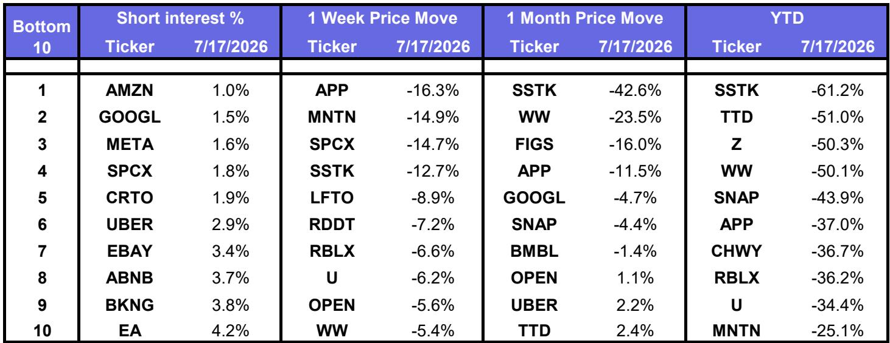
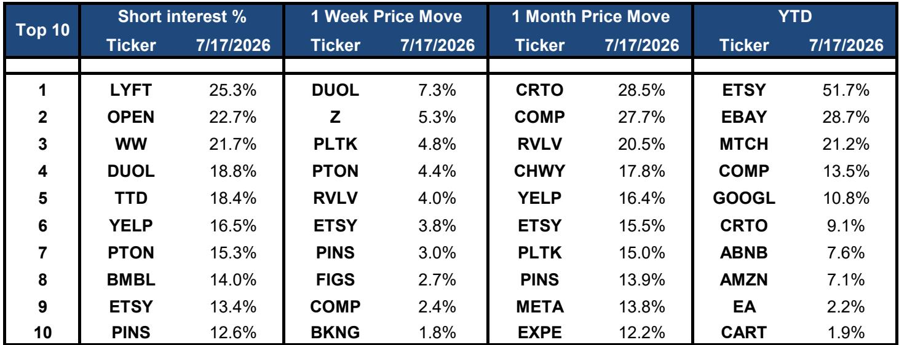
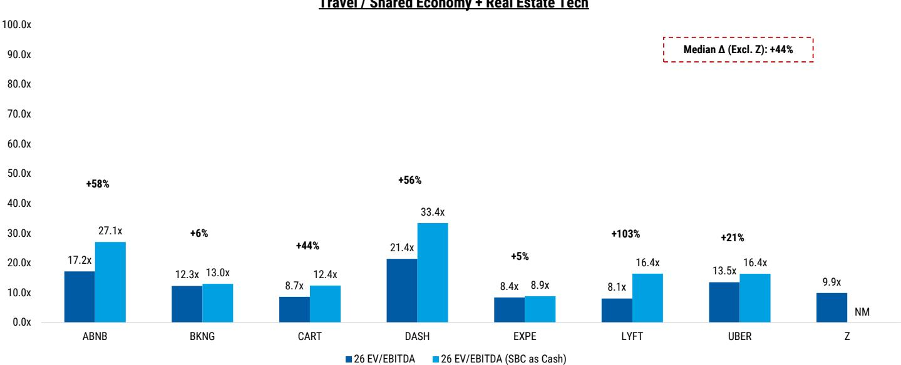

# The Internet Sector Is Entering Earnings in a State of Rare Valuation Dispersion, and Only Selective Positioning Will Capture the Next Leg

The week ending July 17, 2026, delivered a clear signal that the North American internet sector is no longer moving as a single asset class. The broad internet cohort fell 4%, underperforming both the S&P 500 and the Nasdaq, which declined 2% and 4% respectively. But the aggregate number conceals a far more instructive pattern. Digital advertising giants Meta and Alphabet each fell 3%, while Amazon rose 1%. AppLovin dropped 16%, Reddit fell 7%, and Snap declined 3%. These moves were not random. They reflect a market that is beginning to differentiate between companies on the basis of earnings power, cash flow generation, and the durability of their competitive advantages.

The timing matters. Second-quarter earnings season is about to begin, and the current valuation landscape is unusually wide. Amazon, Google, and Meta trade at 26x, 23x, and 20x 2026 estimated earnings respectively. These multiples are 17%, 11%, and 16% below their trailing twelve-month averages. By contrast, companies such as Duolingo trade at 49x, Pinterest at 39x, and Reddit at 26x. The gap between the most expensive and least expensive names in the sector is not a sign of market inefficiency. It is a reflection of divergent growth trajectories, margin profiles, and investor conviction about which business models can sustain their current trajectories.

For institutional investors, the implication is direct. The era of beta-driven internet investing is over. The coming weeks will separate companies that can deliver on elevated expectations from those that cannot. The data in the report provides a framework for making that distinction, and it points to three structural themes that will define the earnings season: the compression of multiples in large-cap digital advertising, the cash flow divergence within e-commerce and shared economy platforms, and the extreme short interest and volatility in mid-cap names that leaves little room for error.

## Large-Cap Digital Advertising Has Already Repriced Downward, Creating a Margin-of-Safety Test That Only Execution Can Resolve

The three largest digital advertising platforms—Amazon, Alphabet, and Meta—collectively command market capitalizations exceeding $8.5 trillion. Yet their current P/E multiples on 2026 estimated earnings are 26x, 23x, and 20x respectively. Each of these multiples sits well below its trailing twelve-month average. Amazon is 17% below, Alphabet 11% below, and Meta 16% below. This compression did not happen in a vacuum. It reflects a market that has already adjusted expectations downward, likely in anticipation of decelerating revenue growth, rising capital expenditure, or regulatory overhang.

The question is whether these lower multiples are justified or whether they represent an opportunity. The answer depends entirely on the earnings reports themselves. If these companies can demonstrate accelerating revenue, expanding margins, and disciplined capital allocation, the current discounts will look attractive in hindsight. If they disappoint, the downside risk is amplified precisely because the market has already lowered its guard. The 1-week price performance is instructive: Meta fell 3.5%, Alphabet fell 2.9%, and Amazon rose 0.8%. The market is not uniformly punishing large-cap advertising. It is making distinctions based on perceived earnings quality and forward visibility.

The critical metric to watch is not just revenue growth but the relationship between revenue and free cash flow. Amazon, for example, shows a negative free cash flow yield on 2026 estimates, meaning the market is currently valuing the company on future earnings rather than current cash generation. Alphabet and Meta show free cash flow yields of 0.5% and 0.7% respectively. These are low by historical standards. For these multiples to sustain or expand, each company must demonstrate that its reinvestment cycle is producing a measurable return on invested capital. The earnings season will provide that evidence, and the current valuation compression suggests that the market is skeptical but open to being proven wrong.

## The E-Commerce and Shared Economy Segments Reveal a Cash Flow Spectrum That Demands Granular Differentiation

The e-commerce and shared economy subsectors are often grouped together in sector-level analysis, but the report's data shows they are moving on fundamentally different trajectories. In e-commerce, the market-cap weighted average 1-week return was positive 0.7%. Amazon led with a 0.8% gain, while Etsy rose 3.8%, Revolve rose 4.0%, and Peloton rose 4.4%. By contrast, the shared economy segment declined 3.3% on a market-cap weighted basis, with DoorDash falling 4.0%, Instacart falling 5.3%, and Uber declining 2.8%.

The divergence is not about sector classification. It is about cash flow visibility. E-commerce platforms, particularly those with high gross margins and asset-light models, are generating free cash flow yields that range from 5.9% to 10.4% on 2026 estimates. Revolve, for example, shows a free cash flow yield of 5.0%, while Etsy shows 7.1%. These are real, measurable returns that provide a valuation floor. In the shared economy segment, the picture is more mixed. Lyft shows a free cash flow yield of 21.2%, but that number is partly a reflection of its low market capitalization and the market's skepticism about sustainability. Uber and DoorDash show negative or near-zero free cash flow yields, meaning investors are paying for growth that has not yet translated into cash generation.

The implication for portfolio construction is clear. In a rising interest rate environment or in a period of economic uncertainty, cash flow matters more than narrative. Companies that can demonstrate consistent free cash flow generation will command higher multiples and lower volatility. Those that cannot will face a higher cost of capital and greater scrutiny. The earnings season will force this distinction into the open. Investors should prioritize names where free cash flow yield is both high and sustainable, and avoid those where the narrative of future profitability is the only support for the current valuation.

## Elevated Short Interest and Extreme Price Dispersion in Mid-Cap Internet Names Create a High-Stakes Environment Where Earnings Misses Will Be Punished Disproportionately

The report's data on short interest reveals a striking pattern. Among the most heavily shorted internet names are Lyft at 25.3%, Opendoor at 22.7%, WW International at 21.7%, and Duolingo at 18.8%. These are not small positions. Short interest above 15% indicates a concentrated bet by sophisticated investors that these companies will underperform. The risk, of course, is that a positive earnings surprise triggers a short squeeze. But the data on recent price performance suggests that the shorts have been winning more often than not.

The 1-week price performance shows that the most heavily shorted names are not uniformly declining. Duolingo rose 7.3%, Peloton rose 4.4%, and Revolve rose 4.0%. But Lyft fell 0.6%, Opendoor data is not available in the 1-week table, and WW fell 5.4%. The pattern is not random. It correlates with whether the company has a clear catalyst or a credible turnaround story. Duolingo, for example, trades at 49x 2026 earnings, a multiple that is justified only if the company can sustain its current growth rate. The market is giving it the benefit of the doubt. WW, by contrast, trades at a negative P/E and has no earnings to support its valuation. The short interest in WW is a vote of no confidence, and the 5.4% decline in the past week suggests the market agrees.

For investors, the takeaway is not to avoid high short interest names entirely. It is to recognize that the margin for error is razor thin. A company with 20% short interest that misses earnings by even a small margin will see a disproportionate decline as shorts add to their positions and longs capitulate. Conversely, a beat can produce outsized gains. The decision framework for these names should be binary. Either the company has a clear path to profitability and a defensible competitive position, or it does not. There is no middle ground. The earnings season will resolve this uncertainty for many of these names, and the price moves will be violent in either direction.

## A Decision Framework for Allocating Capital Across the Internet Sector During Earnings Season

The data in the report supports a structured approach to positioning. The framework has three dimensions: valuation relative to history, free cash flow yield, and short interest. Each dimension provides a signal, and the combination of signals determines the appropriate action.

First, valuation relative to history. Companies trading below their trailing twelve-month average P/E, such as Amazon, Alphabet, and Meta, offer a margin of safety if their earnings reports confirm the market's lowered expectations. If they beat, the re-rating potential is significant. If they miss, the downside is limited because the multiple has already compressed. These are asymmetric bets in favor of the investor, provided the underlying business is sound.

Second, free cash flow yield. Companies with high and sustainable free cash flow yields, such as Etsy at 7.1%, Revolve at 5.0%, and Lyft at 21.2%, provide a valuation floor. Even if growth decelerates, the cash generation provides a return that supports the stock price. The risk is that the cash flow is not sustainable due to competitive pressure or secular decline. Investors must verify the durability of the cash flow, not just its magnitude.

Third, short interest. High short interest names such as Duolingo, Peloton, and WW are binary bets. They should only be held if the investor has a high-conviction view that the company will exceed expectations. Otherwise, the risk of a sharp decline is too great. The appropriate position size for these names should be smaller than for names with low short interest, and the exit criteria should be clearly defined before the earnings report.

Applying this framework to the current landscape suggests that large-cap digital advertising names offer the best risk-reward profile, provided the investor believes in the long-term growth of digital advertising and the ability of these platforms to monetize AI-driven improvements. Mid-cap names with high short interest should be treated as tactical trades, not core holdings. E-commerce and shared economy names should be selected on the basis of cash flow, not narrative. The earnings season will provide the data to validate or invalidate these positions, and the investor who enters with a clear framework will be better positioned to act decisively when the results are released.

*For informational purposes only. Portions may be generated, translated, summarized, or edited with AI assistance based on source materials and may contain omissions or errors. Please verify independently. This is not investment, legal, tax, accounting, or other professional advice.*

For informational purposes only. Portions may be generated, translated, summarized, or edited with AI assistance based on source materials and may contain omissions or errors. Please verify independently. This is not investment, legal, tax, accounting, or other professional advice.

