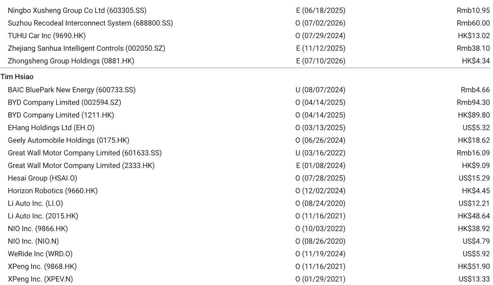
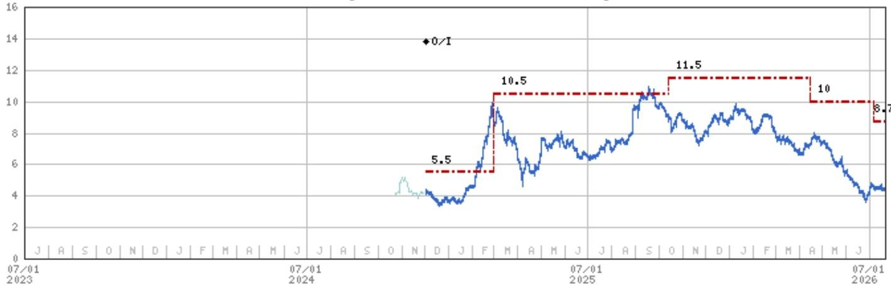
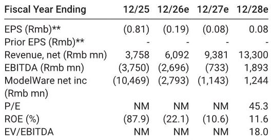

# Horizon Robotics Has Priced in the Trough, but the Re-Rating Depends Entirely on Customer Wins, Not Margin Recovery

Horizon Robotics reported a preliminary first-half 2026 net loss of RMB 1.4-1.7 billion, excluding share-based compensation and fair value changes, a year-over-year widening of 5% to 28% from the RMB 1.3 billion loss in 1H25. The headline profit of RMB 3.5-4.0 billion, which contrasts sharply with a RMB 5.2 billion net loss a year earlier, is almost entirely an artifact of fair value changes in financial liabilities—a non-cash, non-operational item that tells observers nothing about the company's competitive trajectory. The real story is that revenue grew only 25-35% year-over-year to between RMB 1.93 billion and RMB 2.08 billion, a deceleration that management had signaled but that the market had hoped would be stronger.

The stock has already fallen 61% from its 52-week high of HK$ 11.32 to a close of HK$ 4.45, compressing the enterprise value to roughly RMB 33 billion against a market capitalization of RMB 56 billion. At that valuation, the market is discounting a scenario in which Horizon's core chip business fails to scale materially over the next twelve months. The question for observers is not whether the worst is reflected in the price—it largely is—but what specific catalysts must materialize to justify a re-rating. The answer, based on the operating data and the competitive dynamics in China's ADAS and autonomous driving market, is that Horizon must convert its design-win pipeline at BYD, Geely, Chery, and Li Auto into volume shipments, and it must demonstrate that its next-generation J7 and high-speed domain control (HSD 2.0) platforms can win orders against incumbents and in-house alternatives.

## The 1H26 Revenue Deceleration Is Structural, Not Cyclical, and Points to a Concentration Risk in the Customer Base

The preliminary 1H26 revenue growth of 25-35% represents a meaningful slowdown from the pace implied by the full-year consensus estimate of approximately RMB 6.1 billion. To meet that full-year number, Horizon would need to grow chip-driven revenue by over 80% year-over-year in the second half. That is a steep requirement, and the burden falls disproportionately on four customers: Li Auto, BYD, Geely, and Chery. The concentration is not new, but the dependency has deepened. If any one of these OEMs delays a program, shifts to an in-house solution, or simply sells fewer vehicles equipped with Horizon's J-series chips, the second-half ramp becomes unachievable.

The gross profit margin guidance of 60-66% for 1H26, flat to slightly lower than the 1H25 level, provides an additional clue about the revenue mix. A stable or declining gross margin in the context of 25-35% top-line growth implies that product solutions revenue—which carries lower margins than licensing—is growing faster. Licensing revenue, which is high-margin and recurring in nature, is not scaling proportionally. That is a structural concern because it suggests that Horizon is winning hardware sockets but not yet converting those into the software and toolchain licensing relationships that generate higher lifetime value per vehicle. The company's long-term margin expansion thesis depends on licensing becoming a larger share of revenue; the 1H26 data points in the opposite direction.

Operating expenses increased from RMB 2.6 billion in 1H25, driven by R&D spending on the J7 chip and the HSD platform. This is the correct strategic move—Horizon must invest to stay competitive—but it also means that near-term operating leverage is negative. Revenue growth is not yet outpacing cost growth, and the net loss is widening in absolute terms. The company is in a classic investment phase: spending to build the next-generation product while the current-generation J6 ramps more slowly than anticipated.

## The J6 Ramp Has Been Slower Than Expected, and the Second-Half Catch-Up Depends on Launch Timing, Not Demand

Management had previously communicated to observers that the 1H26 chip sales would be weighed down by a weaker domestic automotive market, a slower-than-expected ramp of the J6 platform, and a concentration of customer vehicle launches in the second quarter that pushed chip deliveries into the second half. This is not a demand destruction story; it is a timing story. The underlying program wins at Li Auto, BYD, Geely, and Chery are intact, but the revenue recognition from those wins has been back-end loaded.

The risk is that the second-half concentration creates a binary outcome. If the customer launches proceed on schedule and the vehicles equipped with J6 chips ship at the expected volumes, Horizon can still hit the full-year consensus. But any delay—whether due to OEM production hiccups, component shortages, or a slower-than-expected EV adoption rate in China—would compress the revenue into an even narrower window. The stock is already pricing in a negative outcome, but it is not pricing in a catastrophic one. A further miss would likely push the stock below the HK$ 3.60 52-week low.

The J6 ramp is also important for a second reason: it is the platform that will determine whether Horizon can cross the threshold from a design-win company to a volume-shipment company. Design wins are necessary but not sufficient. The market needs to see production volumes that translate into revenue growth of 50% or more annually. The 25-35% growth in 1H26 is below that threshold, and the market has responded accordingly.

## The Re-Rating Catalyst Is Not Earnings Improvement but Order Share Wins at BYD and Breakthroughs in HSD 2.0

The most important sentence in the report is that "stock upside hinges on its order share wins at major customers, like BYD, and breakthroughs in HSD 2.0." This is a critical distinction. The market is not waiting for Horizon to report a narrower loss or a higher gross margin. Those are backward-looking metrics. The re-rating will come from forward-looking signals: a public announcement that Horizon has been selected as the primary ADAS chip supplier for a high-volume BYD model, or a design win for the HSD 2.0 platform at a major OEM.

BYD is the most important variable. BYD is the largest EV manufacturer in China, and it has been developing in-house ADAS capabilities. If BYD chooses to scale its in-house solution rather than rely on Horizon, the addressable market for Horizon's chips in BYD's vehicle lineup shrinks dramatically. Conversely, if Horizon wins a significant share of BYD's ADAS chip volume, it signals that even the largest OEMs find Horizon's performance-per-watt and toolchain advantages superior to internal development. That would be a powerful endorsement and would likely trigger multiple expansion.

HSD 2.0 is the second catalyst. High-speed domain control is the bridge between current-generation ADAS (highway assist) and future autonomous driving (urban and full-scenario). If Horizon can deliver a competitive HSD 2.0 platform that wins orders at Geely or Chery, it would demonstrate that the company can move up the value chain from low-level perception chips to integrated domain controllers. That would increase the revenue per vehicle and extend the competitive moat.

## The Decision Framework for Observers: Three Scenarios, Two Inflection Points

For observers trying to frame the risk-reward, the most useful approach is a scenario-based framework that centers on the two inflection points: BYD order share and HSD 2.0 design wins. The current stock price of HK$ 4.45 implies a base case in which Horizon maintains its current customer relationships but fails to expand its share at BYD and does not win a major HSD 2.0 contract in the next six months. In that scenario, the company continues to grow revenue at 25-35% annually, the net loss narrows slowly, and the stock trades in a range of HK$ 3.50 to HK$ 5.00.

The bull case requires both inflection points to materialize. If Horizon wins a substantial BYD program and secures at least one HSD 2.0 design win at a top-five Chinese OEM, the revenue trajectory shifts to 50%+ growth, and the market begins to discount a path to profitability in 2028. In that scenario, the stock could re-rate to a price-to-sales multiple of roughly 7x on 2027 estimated revenue of RMB 9.4 billion.

The bear case is that BYD scales its in-house solution and HSD 2.0 fails to gain traction. In that scenario, Horizon becomes a niche supplier to second-tier OEMs, revenue growth decelerates to 15-20%, and the company may need to raise additional capital before reaching profitability. The stock would likely trade below HK$ 3.00, and the enterprise value would compress toward the cash balance of approximately RMB 23 billion.

The key insight from this framework is that the stock's upside is asymmetric to the customer win catalysts, not to the earnings trajectory. Observers who wait for earnings to improve will have already missed the re-rating. The re-rating will happen when the market sees evidence that Horizon has crossed the adoption chasm—and that evidence will come in the form of customer announcements, not financial statements.

## The Gross Margin Trajectory Is a Lagging Indicator of Competitive Position, Not a Leading One

A common analytical error is to focus on gross margin as a proxy for competitive moat. In Horizon's case, the 60-66% gross margin in 1H26 is healthy but flat, and it may decline further as product solutions revenue grows faster than licensing. That is not a sign of weakening pricing power; it is a sign of a shifting revenue mix as the company scales hardware shipments ahead of software licensing.

The more important metric is the lifetime value of a chip shipment. When Horizon sells a J6 chip into a vehicle, that chip generates a one-time hardware revenue. But if the OEM also licenses Horizon's toolchain and software stack, the revenue becomes recurring and high-margin. The gross margin compression in 1H26 suggests that the licensing attachment rate is not yet where it needs to be. That is a fixable problem, but it requires time and customer education.

The market should watch for any disclosure about the number of vehicles equipped with Horizon's software stack versus just its chips. If that ratio improves, the gross margin will follow. Until then, the gross margin is a lagging indicator that reflects the past sales mix, not the future competitive position.

## Operating Expense Growth Will Remain Elevated Until the J7 and HSD Platforms Reach Production

The R&D spending increase in 1H26 is a deliberate investment in the next generation of products. The J7 chip is expected to offer significantly higher performance than the J6, and the HSD 2.0 platform is designed to compete with solutions from Mobileye, Qualcomm, and Nvidia in the high-speed domain control segment. Both are necessary for Horizon to remain relevant as Chinese OEMs demand more integrated and more powerful ADAS solutions.

The risk is that the investment cycle extends longer than expected. If the J7 or HSD 2.0 programs encounter technical delays, the operating expense will remain elevated without the corresponding revenue uplift. That would push the breakeven point beyond 2028, which is the current consensus expectation for positive net income. The report's own estimates show a net loss of RMB 2.8 billion in 2026, narrowing to RMB 1.1 billion in 2027, and turning positive at RMB 1.2 billion in 2028. Any delay in the product roadmap would push that timeline to the right, and the stock would re-rate downward as the market discounts a longer cash-burn period.

The conclusion for observers is that Horizon Robotics is a high-conviction, high-risk bet on two specific catalysts. The stock has already discounted a pessimistic scenario. The upside depends on customer wins that are observable and verifiable. The company is not a broad-based ADAS play; it is a binary bet on BYD's sourcing decision and on the technical competitiveness of HSD 2.0. Observers who are comfortable with that binary structure should monitor those two data points above all others. Observers who require earnings visibility or margin expansion should wait until the licensing revenue mix improves and the operating leverage becomes positive. The stock will re-rate before those financial metrics improve, not after.

*For informational purposes only. Portions may be generated, translated, summarized, or edited with AI assistance based on source materials and may contain omissions or errors. Please verify independently. This is not professional advice.*

For informational purposes only. Portions may be generated, translated, summarized, or edited with AI assistance based on source materials and may contain omissions or errors. Please verify independently. This is not professional advice.

