# Alphabet 2Q26 财报观察与分析

## 公司概况

**U.S. Internet**

**Alphabet Inc**

**市场表现观察**

**参考价目标**

**GOOGL**

**385.00 USD (390.00 OLD)**

**研究团队**

Mark Shmulik  
Wenhuan Chang  
Deeksha Pandey

## Google 2Q26: 市场观察与思考

“如果你对谷歌的这份成绩单感到不满，先吃顿东西；如果你觉得谷歌让你失望，不妨先休息一下。”这一季度的数据呈现了复杂图景：搜索业务符合预期，云计算大幅超预期，运营利润率和每股回报（剔除市值变动）也有小幅超预期。但与此同时，市场对模型进展和AI投入回报的疑问仍然存在。

**搜索业务保持稳健。** 搜索收入同比增长17%，符合预期，服务业务运营利润率维持在42%。管理层持续强调，随着Gemini被应用于广告投放、广告工具和用户体验，搜索市场正在扩大。但后续对比基数将逐步提高，竞争也在缓慢加剧。

**谷歌在AI云计算领域表现强劲。** 云计算收入同比增长82%，远超市场预期，利润率扩大至约36%。90%的财富100强企业以某种形式使用Gemini Enterprise。然而，随着谷歌将重点转向Gemini 4而非3.5 Pro，并加速第三方云计算交易，市场对利润率压缩的担忧也随之增加。

## 研究启示

**保持观望，但态度趋于积极。** 维持市场表现评级，目标价调整为385美元（下调5美元）。

<table><tr><td>每股报告回报</td><td>F25A</td><td>F26E</td><td>F27E</td></tr><tr><td>GOOGL (USD)</td><td>10.81</td><td>20.84</td><td>15.26</td></tr><tr><td>OLD</td><td>--</td><td>14.81</td><td>15.16</td></tr></table>

<table><tr><td>财务数据</td><td>F25A</td><td>F26E</td><td>F27E</td><td>年复合增长率</td></tr><tr><td>收入（百万）</td><td>402,836</td><td>496,135</td><td>616,895</td><td>23.7%</td></tr><tr><td>EBITDA（百万）</td><td>150,175</td><td>203,580</td><td>270,455</td><td>34.2%</td></tr><tr><td>EBIT（百万）</td><td>129,039</td><td>169,211</td><td>213,701</td><td>28.7%</td></tr><tr><td>EBITDA利润率（%）</td><td>37.3</td><td>41.0</td><td>43.8</td><td>--</td></tr><tr><td>运营利润率（%）</td><td>32.0</td><td>34.1</td><td>34.6</td><td>--</td></tr><tr><td>调整后每股回报</td><td>12.85</td><td>23.34</td><td>18.37</td><td>19.6%</td></tr></table>

**资本支出上升，自由现金流下降。** 2026年资本支出指引上调至1950-2050亿美元（符合预期），同时谷歌首次出现季度自由现金流为负。支出过多会面临压力，支出不足则会落后——这是一个两难局面。谷歌需要在搜索领域防守、在前沿模型竞争、并在企业AI云计算上取胜，任务艰巨。

<table><tr><td>截止日期</td><td>2026年7月22日</td></tr><tr><td>GOOGL收盘价（USD）</td><td>342.09</td></tr><tr><td>目标价（USD）</td><td>385.00</td></tr><tr><td>潜在空间</td><td>13%</td></tr><tr><td>52周范围</td><td>408.61/187.82</td></tr><tr><td>SPX</td><td>7,498.96</td></tr><tr><td>财年结束</td><td>12月</td></tr><tr><td>股息率</td><td>0.3%</td></tr><tr><td>总市值（USD）（十亿）</td><td>4,182.69</td></tr><tr><td>企业价值（USD）（十亿）</td><td>4,071.00</td></tr></table>

<table><tr><td>表现</td><td>年初至今</td><td>1个月</td><td>6个月</td><td>12个月</td></tr><tr><td>相对（%）</td><td>9.3</td><td>(1.2)</td><td>4.3</td><td>79.8</td></tr><tr><td>SPX（%）</td><td>9.5</td><td>0.4</td><td>8.5</td><td>18.8</td></tr><tr><td>相对（%）</td><td>(0.3)</td><td>(1.5)</td><td>(4.2)</td><td>61.0</td></tr></table>

来源：Bloomberg，Bernstein估算与分析。

**一年期价格走势**  
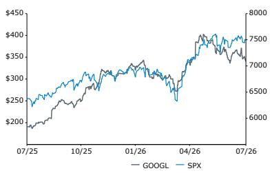

<table><tr><td>估值指标</td><td>F25A</td><td>F26E</td><td>F27E</td></tr><tr><td>报告P/E（倍）</td><td>31.7</td><td>16.4</td><td>22.4</td></tr><tr><td>报告PEG（倍）</td><td>0.9</td><td>0.2</td><td>(0.8)</td></tr><tr><td>EV/收入（倍）</td><td>10.1</td><td>8.2</td><td>6.6</td></tr><tr><td>EV/EBITDA（倍）</td><td>27.1</td><td>20.0</td><td>15.1</td></tr><tr><td>EV/EBIT（倍）</td><td>31.5</td><td>24.1</td><td>19.0</td></tr><tr><td>股息率（%）</td><td>0.2</td><td>0.3</td><td>0.3</td></tr><tr><td>调整后P/E（倍）</td><td>26.6</td><td>14.7</td><td>18.6</td></tr></table>

## 详细分析

## 组合管理摘要

Alphabet于今日盘后公布了2026年第二季度财报。

这是我们有史以来最简短的一份组合管理摘要： unpacking和评估谷歌的故事突然变得相当困难，这意味着当前持有谷歌的报价可能过于复杂，而更简单的做法是重新聚焦于硬件瓶颈主题。

为什么故事变得困难？当公司持续在所有关键指标上超出预期并上调指引时——尤其是加速增长的搜索、云计算和云计算利润率，同时前沿模型发布、AI产品出货量增加以及健康的AI采用指标共同推动故事完善——谷歌的报价更容易持有。而基于本季度的数据，净效应来看，大多数市场预期将上调。搜索符合预期，可能维持不变；YouTube或因世界杯第二屏效应小幅上调；谷歌服务利润率保持稳健，也可能上调；云计算增长仍是亮点，同比增长80%以上，积压订单再增约500亿美元以上增量承诺，TPU系统销售已启动，这些因素都应使市场对云计算收入的预期大幅上调。即使管理层对未来云计算利润率面临逆风做出评论，云计算利润率仍扩大约3个百分点至36%，因此云计算运营收入仍可能更高。每股回报也可能小幅上升，本季度确认了少数股权（SpaceX和可能Anthropic）的大幅市值变动，但即使剔除这部分，每股回报在可比基础上也小幅超预期。当然，资本支出也随之上调，公司将其2026年支出估计提高了约150亿美元至1950-2050亿美元，并可能推高市场对2027年的数字。

仅看第二季度报告，你可能会认为报价在盘后上涨，但事实并非如此——报价小幅下跌，虽不剧烈，但引发了一些问题。问题从这里开始：谷歌面临2026年下半年较为困难的基数。搜索比较基数变高，同时外汇顺风转为逆风——是的，谷歌一直明确表示AI正在扩大TAM，我们完全同意，但市场增速与谷歌搜索收入增速之间的差距表明搜索收入同比增长将放缓至中teen水平。此外，虽然云计算收入增长，但预计运营利润率将下降，因为谷歌急于整合第三方计算能力以满足需求，整体利润率已承压并朝不利方向发展：

- 如果没有足够计算能力服务企业，它们会回到亚马逊或微软
- 如果没有足够计算能力服务开发者，或没有领先的一流前沿模型通过API提供，开发者忠诚度将受到考验，而谷歌已习惯披露一流模型每分钟token数，市场将审视前沿模型性能（不仅是成本/性能）对消费的重要性
- 如果没有足够计算能力保护搜索护城河——我们甚至不愿考虑这种情况。搜索增长仍是谷歌研究框架的基础。

这就是本季度最重要的内容。市场参与者或许希望听到管理层对谷歌即将重返前沿模型地位的更强信心，但评论更多聚焦在Gemini 4与3.5 Pro上，这一叙事尚需等待。虽然更高的资本支出在意料之中，但评估大量增量支出带来的回报仍然是一个老生常谈但相关的问题，尤其是这种投资已使谷歌陷入负自由现金流状态，并迫使其寻找创造性的融资方式。

那么，如何应对这种报价？我们同样对AI回报问题感到疲惫——搜索同比增长17%，云计算同比增长82%！请记住，两年前市场预期搜索增长为高个位数，云计算增长为mid-20s且利润率低teen。但我们现在处于一个叙事驱动的市场，如果核心基本面出现恶化信号，同时模型性能存在未解答的问题，以及不断上升的资本支出账单需要股权融资、债务融资甚至出售可交易证券来支撑，那么谷歌的报价就难以持有。尤其是当它的估值倍数仍高于其他大型科技公司同行时。

也许我们正在接近一个有吸引力的入场点，但我们见过公司在互联网板块内长期处于“惩罚区”的情况，而互联网板块仍常被用作资金来源。我们也不例外——我们上调收入数字以反映云计算增长，小幅上调Properties收入，但下调云计算利润率（受第三方交易压力）和每股回报（受股权稀释影响），最终结果未变。至于倍数？我们并不完全认可模型表现看空叙事，但叙事难以撼动，我们对其盈利质量提出一些疑问，从而略微下调估值。我们维持市场表现评级，并将目标价下调至385美元/股（-5美元）。我们使用2027年EV/EBIT倍数24倍（-4倍）的50%、以及WACC 10%和终值增长率3.5%的DCF模型各50%来评估Alphabet。由于盈利质量下降，我们下调了EV/EBIT倍数。我们将Alphabet主要视为数字广告业务，并以此为基准与行业可比公司进行估值比较。

## 财务数据

## 收入

整体收入轻松超过市场预期，同比增长24% [固定汇率23%]至1198亿美元，其中搜索符合预期（同比增长17%），云计算增速加快至82%，远高于市场预期。订阅、平台和设备（SP&D）收入同比增长15%，YouTube广告同比增长13%，网络收入小幅下降1%。

## 广告

广告收入同比增长14%至820亿美元，其中YouTube广告和网络分别超出预期2%-2.5%，搜索符合预期。

- 搜索收入同比增长17%至630亿美元，零售和金融贡献最大。虽然报告增速从第一季度的19%放缓，但固定汇率基础上搜索增长基本稳定。搜索趋势保持健康，AI驱动的持续改进继续提升用户参与度和变现能力。不过，市场对搜索的预期仍然很高，后续几个季度增长基数将越来越高，外汇顺风转为逆风。

- 市场扩张。谷歌继续深化AI与搜索的整合，将AI Overviews和AI Mode统一为无缝体验。AI驱动的改进促进了用户参与和搜索活动。自去年10月全球推出AI Mode以来，该产品月活跃用户已超过10亿。与AI Overviews类似，AI Mode正在产生增量查询增长，谷歌目前每周通过搜索AI功能向网站发送数十亿次点击。

- AI效率提升。随着AI查询量持续增长，谷歌保持了效率重点。管理层指出，持续的工程改进和硬件优化使AI Mode响应的成本在本季度降至发布以来最低水平，同时公司还扩展了产品的高级AI功能。

- Gemini应用势头强劲，月活跃用户达9.5亿，日活跃用户同比增长超过3倍，谷歌以极快速度推出新功能。

- YouTube广告收入同比增长13%至110亿美元，受直接响应广告和品牌广告推动。该平台在世界杯期间作为官方合作伙伴发挥了核心作用，超过17亿独立观众观看了YouTube上的世界杯相关内容，其中超过5.5亿通过联网电视观看。

- 网络持续市场份额下降。网络收入连续第16个季度同比下降，降幅1%至70亿美元。

## 订阅、平台和设备（前身为Google Other）

- SP&D低于市场预期约1%。收入同比增长15%至130亿美元，受YouTube订阅（特别是YouTube Music和Premium）以及Google One（受AI计划需求推动）强劲增长支撑。

## 云计算

- 进入本季度市场预期持续上升，但谷歌云计算仍超预期。云计算收入同比增长82%至248亿美元，由谷歌云平台（GCP）在企业AI解决方案和企业AI基础设施以及核心GCP服务方面引领。

- 积压订单持续强劲增长。上季度积压订单环比几乎弹性较高至约4620亿美元。本季度谷歌又增加了500亿美元以上，积压订单达到5140亿美元，受企业AI产品强劲需求推动。大部分积压订单与广泛的客户GCP合同相关，谷歌预计未来24个月内将确认超过50%的积压订单收入。

- Gemini Enterprise需求旺盛，安全解决方案同样突出。谷歌强调Gemini Enterprise广泛采用，近90%的财富100强企业使用。强大的采用推动了付费token消费增长，近500家云客户在过去一年中各自处理了超过1万亿个token，超过2000家企业消费了超过1000亿个token。谷歌的AI驱动安全平台（结合威胁情报、AI自动扫描、代码修复、监控和与Wiz的网络响应优先级）也获得强劲进展。目前，90%的财富100强企业使用谷歌云安全，近90%的Wiz客户利用其AI能力，平台上扫描和保护的AI工作负载环比增长超过45%。

- 在模型方面，谷歌重申了AI模型的创新步伐，表明开发仍在正轨，尽管市场对前沿模型延迟的担忧日益增加。模型需求继续加速，推动开发者和企业客户token消费强劲增长。每月有超过900万开发者通过API和开发平台使用谷歌模型构建，token处理量增至每分钟220亿个，高于上季度的160亿和更早的100亿。

- Gemini 4 > 3.5 Pro？关于Gemini 3.5 Pro（谷歌旗舰AI模型）延迟的失望情绪持续增加。公司似乎花费额外时间来改进关键能力，特别是编码性能，但市场对下一次发布的时间和竞争力的疑问变得更加突出。谷歌强调Gemini 3.5 Pro目前正在测试，而管理层一般将讨论重点放在Gemini 4上，并强调训练所需的大量增量计算。

- 与此同时，谷歌宣布了Gemini 3.6 Flash和Gemini 3.5 Flashlight，强调其成本效率和强大性能。Gemini Flash系列需求依然强劲，反映了其良好的性能与成本比。谷歌还强调了Gemini 3.5 Flash Cyber，一个专注于网络安全的模型，能够检测和修复漏洞，管理层指出其性能达到前沿水平，可与更大的网络模型媲美。

- 供应受限。为应对持续的能力限制，谷歌计划在第三季度利用额外的第三方基础设施作为桥梁，同时继续建设更多内部能力。这一策略应有助于维持客户增长并支持需求上升，但代价是短期利润率压力，因为外部能力成本更高。

- 开始确认TPU系统销售收入。谷歌在第二季度首次向客户数据中心交付TPU，但管理层明确表示，即使排除TPU系统销售的影响，云计算收入增速也显著加快。

- 云计算运营收入88亿美元，同比增长两倍，运营利润率35.6%，高于2025年第二季度的约20.7%和2026年第一季度的约33%。利润率扩张主要由强劲收入增长驱动，产生运营杠杆，同时成本纪律和运营效率改善也有贡献。虽然数据中心资本支出带来的更高折旧和第三方桥接计算能力构成逆风，但公司正聚焦于平衡这些逆风与效率提升。

## 其他

- Waymo正在加速，但当前数字较温和，本季度并非焦点，预计很快将有更多车辆上路。其他投注收入（主要是Waymo）略低于预期，同比增长2%至3.82亿美元。

## 利润率与资本支出

- 运营利润率约34%，同比上升（2025年第二季度为32%），但环比下降（2026年第一季度为36%）。总运营支出同比增长27%至330亿美元。研发支出增长32%，受AI人才薪酬及折旧驱动。销售与营销支出增长18%，用于支持Gemini应用、搜索及薪酬。一般及行政支出增长24%，主要由薪酬及某些法律和其他事项费用驱动。

- 每股回报9.11美元。其他收入反映了980亿美元的净收益，主要来自权益证券的未实现收益。

- 自由现金流为负（-59亿美元），受资本支出影响。过去12个月自由现金流为533亿美元。谷歌期末拥有现金及可交易证券2425亿美元，长期负债982亿美元。

- 2026年资本支出指引中点上调约150亿美元至1950-2050亿美元（之前为1800-1900亿美元），背景是BOM通胀和供应链限制，以及加快交付能力以满足增长需求。谷歌再次表示预计2027年资本支出将“显著”增加。从费用角度看，对技术基础设施的持续投资将通过更高的折旧和数据中心运营成本（包括能源支出）继续影响损益表。谷歌还预计将在AI和云计算等优先领域继续招聘。

- 股权融资。2026年6月，谷歌通过A类及C类股票和强制性可转换优先股筹集496亿美元，用于一般公司需求，包括AI基础设施和全球计算扩展。公司还启动了400亿美元的ATM股票出售计划，主要用于覆盖员工股权相关税务义务，但截至2026年6月30日，该计划尚未出售任何股票。

- 高级无担保票据。谷歌在本季度发行了高级无担保票据，净收益203亿美元。

## 估计与目标价调整

- 收入：我们上调云计算收入估计，以反映更强劲的业务表现。对YouTube、网络、SP&D和其他投注的收入估计进行小幅微调，以反映近期表现。

- 利润率：我们上调EBIT估计，主要与强劲的云计算表现相关。

- 资本支出：我们将2026年全年资本支出估计小幅上调至约2000亿美元，以反映更新后的管理层指引。2026年之后，资本支出估计基本保持不变。

- 每股回报：我们上调2026年每股回报估计，主要受第二季度其他收入超预期驱动。2027年每股回报基本稳定，因为更高的EBIT和股权发行稀释相互抵消。

- 我们将目标价调整至385美元/股（-5美元）。我们使用2027年EV/EBIT倍数24倍（-4倍）的50%、以及WACC 10%和终值增长率3.5%的DCF模型各50%来评估Alphabet。由于盈利质量下降，我们下调了EV/EBIT倍数。我们将Alphabet主要视为数字广告业务，并以此为基准与行业可比公司进行估值比较。

## 图表

**图表1：第二季度后谷歌估计调整**  
GOOGL: Bernstein estimate revisions post 2Q26

<table><tr><td>估计调整</td><td></td><td>新</td><td>旧</td><td>新 vs. 旧</td><td>新同比增长</td><td>市场一致</td><td>Bern vs 市场</td></tr><tr><td rowspan="4">总收入</td><td>2Q26</td><td>119,796</td><td>117,499</td><td>2%</td><td>24%</td><td>117,022</td><td>2%</td></tr><tr><td>3Q26</td><td>126,286</td><td>124,380</td><td>2%</td><td>23%</td><td>124,010</td><td>2%</td></tr><tr><td>FY26</td><td>496,135</td><td>490,153</td><td>1%</td><td>23%</td><td>488,335</td><td>2%</td></tr><tr><td>FY27</td><td>616,895</td><td>587,693</td><td>5%</td><td>24%</td><td>584,273</td><td>6%</td></tr><tr><td rowspan="6">3Q26收入</td><td>搜索</td><td>65,052</td><td>65,052</td><td>0%</td><td>15%</td><td>65,006</td><td>0%</td></tr><tr><td>YouTube</td><td>11,215</td><td>11,215</td><td>0%</td><td>9%</td><td>11,286</td><td>-1%</td></tr><tr><td>网络</td><td>7,097</td><td>7,060</td><td>1%</td><td>-4%</td><td>7,145</td><td>-1%</td></tr><tr><td>云计算</td><td>27,586</td><td>25,441</td><td>8%</td><td>82%</td><td>25,465</td><td>8%</td></tr><tr><td>SP&amp;D*</td><td>14,981</td><td>15,251</td><td>-2%</td><td>16%</td><td>14,864</td><td>1%</td></tr><tr><td>其他投注</td><td>356</td><td>361</td><td>-1%</td><td>4%</td><td>399</td><td>-11%</td></tr><tr><td rowspan="6">2026收入</td><td>搜索</td><td>260,625</td><td>260,757</td><td>0%</td><td>16%</td><td>260,464</td><td>0%</td></tr><tr><td>YouTube</td><td>44,788</td><td>44,327</td><td>1%</td><td>11%</td><td>44,710</td><td>0%</td></tr><tr><td>网络</td><td>28,925</td><td>28,606</td><td>1%</td><td>-3%</td><td>28,836</td><td>0%</td></tr><tr><td>云计算</td><td>104,177</td><td>98,091</td><td>6%</td><td>77%</td><td>97,106</td><td>7%</td></tr><tr><td>SP&amp;D*</td><td>56,162</td><td>57,000</td><td>-1%</td><td>17%</td><td>56,064</td><td>0%</td></tr><tr><td>其他投注</td><td>1,532</td><td>1,552</td><td>-1%</td><td>0%</td><td>1,637</td><td>-6%</td></tr><tr><td>EBIT</td><td>2Q26</td><td>40,770</td><td>39,926</td><td>2%</td><td>34%</td><td>40,548</td><td>1%</td></tr><tr><td rowspan="3">*在“新增长”列显示新的EBIT利润率</td><td>3Q26</td><td>42,223</td><td>41,467</td><td>2%</td><td>33%</td><td>42,634</td><td>-1%</td></tr><tr><td>FY26</td><td>169,211</td><td>166,968</td><td>1%</td><td>34%</td><td>170,283</td><td>-1%</td></tr><tr><td>FY27</td><td>213,701</td><td>206,146</td><td>4%</td><td>35%</td><td>210,776</td><td>1%</td></tr><tr><td rowspan="4">GAAP每股回报</td><td>2Q26</td><td>9.11</td><td>3.06</td><td>198%</td><td>294%</td><td>2.90</td><td>214%</td></tr><tr><td>3Q26</td><td>3.18</td><td>3.17</td><td>0%</td><td>11%</td><td>3.02</td><td>5%</td></tr><tr><td>FY26</td><td>20.84</td><td>14.81</td><td>41%</td><td>93%</td><td>14.63</td><td>42%</td></tr><tr><td>FY27</td><td>15.26</td><td>15.16</td><td>1%</td><td>-27%</td><td>14.85</td><td>3%</td></tr><tr><td rowspan="4">资本支出</td><td>2Q26</td><td>44,924</td><td>50,524</td><td>-11%</td><td></td><td>44,150</td><td>2%</td></tr><tr><td>3Q26</td><td>56,829</td><td>53,483</td><td>6%</td><td></td><td>50,188</td><td>13%</td></tr><tr><td>FY26</td><td>200,497</td><td>199,184</td><td>1%</td><td></td><td>186,400</td><td>8%</td></tr><tr><td>FY27</td><td>326,338</td><td>326,170</td><td>0%</td><td></td><td>258,437</td><td>26%</td></tr></table>

来源：公司文件，Bloomberg一致预期，Bernstein估算与分析

**图表2：GOOGL第二季度业绩 vs 市场预期及我们的预期**  

来源：公司报告，Bloomberg，Bernstein估算与分析

<table><tr><td></td><td>2Q26A</td><td>同比增长</td><td>Bernstein</td><td>超/低</td><td>市场一致</td><td>超/低</td></tr><tr><td>总收入</td><td>119,796</td><td>24%</td><td>117,499</td><td>2%</td><td>117,022</td><td>2%</td></tr><tr><td>谷歌搜索及其他</td><td>63,271</td><td>17%</td><td>63,402</td><td>0%</td><td>63,285</td><td>0%</td></tr><tr><td>YouTube广告</td><td>11,055</td><td>13%</td><td>10,776</td><td>3%</td><td>10,806</td><td>2%</td></tr><tr><td>谷歌网络会员属性</td><td>7,303</td><td>-1%</td><td>7,060</td><td>3%</td><td>7,131</td><td>2%</td></tr><tr><td>谷歌云计算</td><td>24,768</td><td>82%</td><td>22,594</td><td>10%</td><td>22,462</td><td>10%</td></tr><tr><td>订阅、平台和设备</td><td>12,911</td><td>15%</td><td>13,276</td><td>-3%</td><td>13,056</td><td>-1%</td></tr><tr><td>其他投注收入</td><td>382</td><td>2%</td><td></td><td></td><td>402</td><td>-5%</td></tr><tr><td>对冲收益（损失）</td><td>106</td><td>-195%</td><td></td><td></td><td></td><td></td></tr><tr><td>总支出</td><td>79,026</td><td>21%</td><td>77,573</td><td>2%</td><td>76,474</td><td>3%</td></tr><tr><td>运营收入</td><td>40,770</td><td>30%</td><td>39,926</td><td>2%</td><td>40,548</td><td>1%</td></tr><tr><td>谷歌服务</td><td>39,544</td><td>20%</td><td>36,584</td><td>8%</td><td>40,235</td><td>-2%</td></tr><tr><td>谷歌云计算</td><td>8,814</td><td>212%</td><td>7,456</td><td>18%</td><td>6,911</td><td>28%</td></tr><tr><td>其他投注</td><td>-1,799</td><td>44%</td><td>-2,142</td><td>-16%</td><td>-1,720</td><td>5%</td></tr><tr><td>Alphabet层面活动（重组）</td><td>-5,789</td><td>72%</td><td>-1,972</td><td>194%</td><td>-4,814</td><td>20%</td></tr><tr><td>运营利润率（%）</td><td>34.0%</td><td>2ppt</td><td>34.0%</td><td>0ppt</td><td>34.7%</td><td>-1ppt</td></tr><tr><td>剔除一次性重组</td><td>34.0%</td><td>0ppt</td><td>34.0%</td><td>0ppt</td><td>34.7%</td><td>-1ppt</td></tr><tr><td>谷歌服务</td><td>41.8%</td><td>2ppt</td><td>38.7%</td><td>3ppt</td><td>42.7%</td><td>-1ppt</td></tr><tr><td>谷歌云计算</td><td>35.6%</td><td>15ppt</td><td>33.0%</td><td>3ppt</td><td>30.8%</td><td>5ppt</td></tr><tr><td>其他投注</td><td>-470.9%</td><td></td><td>-16.1%</td><td></td><td>-427.6%</td><td></td></tr><tr><td>净利润</td><td>112,107</td><td>298%</td><td>37,423</td><td>200%</td><td>35,432</td><td>216%</td></tr><tr><td>稀释后每股回报</td><td>9.11</td><td>294%</td><td>3.06</td><td>198%</td><td>2.90</td><td>214%</td></tr><tr><td>资本支出</td><td>44,924</td><td></td><td>50,524</td><td></td><td>44,150</td><td></td></tr><tr><td>自由现金流</td><td>-5,855</td><td></td><td>-11,269</td><td></td><td>2,214</td><td>-364%</td></tr></table>

来源：公司报告，Bloomberg一致预期，Bernstein估算与分析

**图表3：分部门收入与运营利润**  

<table><tr><td>部门收入与运营利润（$B）</td><td>1Q25</td><td>2Q25</td><td>3Q25</td><td>4Q25</td><td>1Q26</td><td>2Q26</td><td>FY25</td><td>FY26E</td><td>FY27E</td></tr><tr><td>谷歌服务</td><td></td><td></td><td></td><td></td><td></td><td></td><td></td><td></td><td></td></tr><tr><td>- 收入</td><td>77,264</td><td>82,543</td><td>87,052</td><td>95,862</td><td>89,637</td><td>94,540</td><td>342,721</td><td>390,500</td><td>434,105</td></tr><tr><td>- 运营利润</td><td>32,682</td><td>33,063</td><td>33,527</td><td>40,132</td><td>40,589</td><td>39,544</td><td>139,404</td><td>155,929</td><td>178,185</td></tr><tr><td>- 运营利润率（%）</td><td>42%</td><td>40%</td><td>39%</td><td>42%</td><td>45%</td><td>42%</td><td>41%</td><td>40%</td><td>41%</td></tr><tr><td>谷歌云计算</td><td></td><td></td><td></td><td></td><td></td><td></td><td></td><td></td><td></td></tr><tr><td>- 收入</td><td>12,260</td><td>13,624</td><td>15,157</td><td>17,664</td><td>20,028</td><td>24,768</td><td>58,705</td><td>104,177</td><td>181,205</td></tr><tr><td>- 运营利润</td><td>2,177</td><td>2,826</td><td>3,594</td><td>5,313</td><td>6,598</td><td>8,814</td><td>13,910</td><td>34,966</td><td>56,898</td></tr><tr><td>- 运营利润率（%）</td><td>18%</td><td>21%</td><td>24%</td><td>30%</td><td>33%</td><td>36%</td><td>24%</td><td>34%</td><td>31%</td></tr><tr><td>其他投注</td><td></td><td></td><td></td><td></td><td></td><td></td><td></td><td></td><td></td></tr><tr><td>- 收入</td><td>450</td><td>373</td><td>344</td><td>370</td><td>411</td><td>382</td><td>1,537</td><td>1,532</td><td>1,586</td></tr><tr><td>- 运营利润</td><td>(1,226)</td><td>(1,246)</td><td>(1,426)</td><td>(3,617)</td><td>(2,100)</td><td>(1,799)</td><td>(7,515)</td><td>(7,497)</td><td>(7,196)</td></tr><tr><td>- 运营利润率（%）</td><td>-272%</td><td>-334%</td><td>-415%</td><td>-978%</td><td>-511%</td><td>-471%</td><td>-489%</td><td>-489%</td><td>-454%</td></tr><tr><td>对冲收益（损失）</td><td>260</td><td>(112)</td><td>(207)</td><td>(68)</td><td>(180)</td><td>106</td><td>-</td><td>-</td><td>-</td></tr><tr><td>公司成本、未分配</td><td>(3,027)</td><td>(3,372)</td><td>(4,467)</td><td>(5,894)</td><td>(5,391)</td><td>(5,789)</td><td>(16,760)</td><td>(14,187)</td><td>(14,187)</td></tr><tr><td>总收入</td><td>90,234</td><td>96,428</td><td>102,346</td><td>113,828</td><td>109,896</td><td>119,796</td><td>402,963</td><td>496,209</td><td>616,895</td></tr><tr><td>总运营利润（剔除重组）</td><td>30,606</td><td>31,271</td><td>31,228</td><td>35,934</td><td>39,696</td><td>40,770</td><td>129,039</td><td>169,211</td><td>213,701</td></tr><tr><td>运营利润率（%）（剔除重组）</td><td>34%</td><td>32%</td><td>31%</td><td>32%</td><td>36%</td><td>34%</td><td>32%</td><td>34%</td><td>35%</td></tr></table>

来源：公司文件，Bernstein估算与分析

**图表4：谷歌收入估计在过去两年大幅上调**  
Google Revenue 2026E Y/Y Growth Rate Revision History  

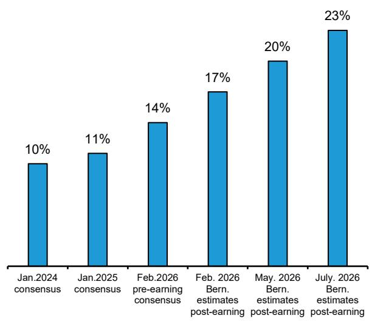  
来源：Bloomberg，Bernstein估算与分析

**图表5：但并非所有数字都在上升：我们预计自由现金流将显著收缩**  
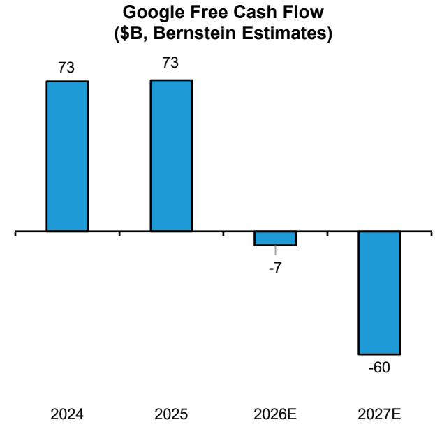  
来源：公司报告，Bernstein估算与分析

**图表6：数字广告增速（%）**  
截至2Q26的报告广告收入同比增长率（%）  
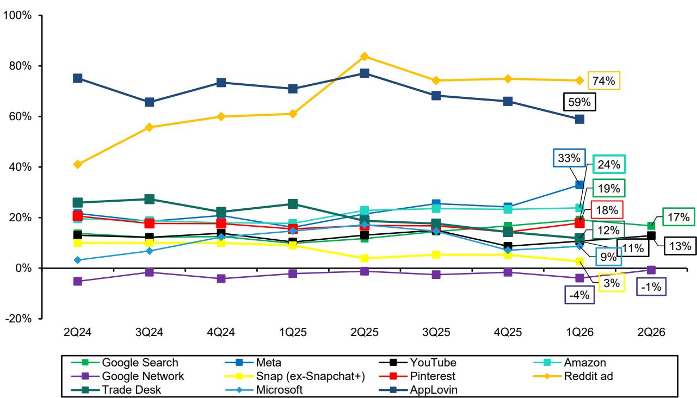  
Google, Meta, Amazon, Snapchat, Pinterest; AppLovin excludes IAP 来源：公司报告，Bernstein分析

**每分钟token数（B）**  
**图表7：谷歌云计算利润率及增量利润率（环比）**  
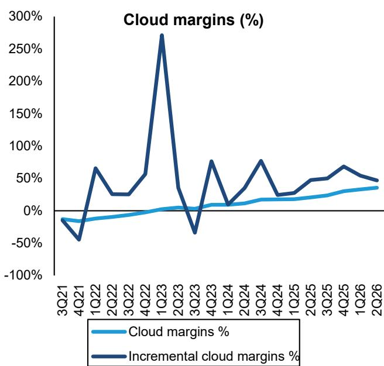

**图表8：谷歌云计算积压订单在2Q26升至5140亿美元**  
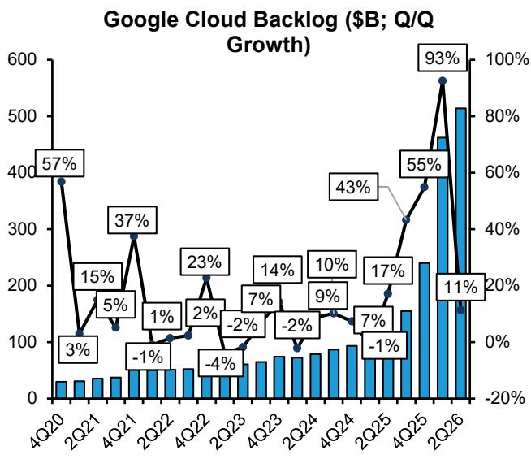  
来源：公司报告，Bernstein分析

来源：公司报告及Bernstein分析  
**图表9：token处理增长至每分钟220亿**  
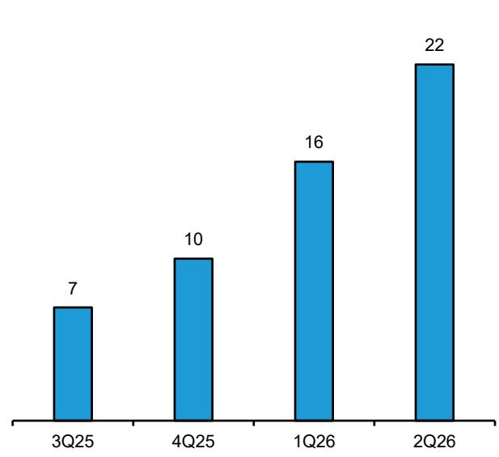  
来源：公司报告；Bernstein分析  
**图表10：谷歌运营利润瀑布图**  
2Q26运营利润瀑布图（$B）  

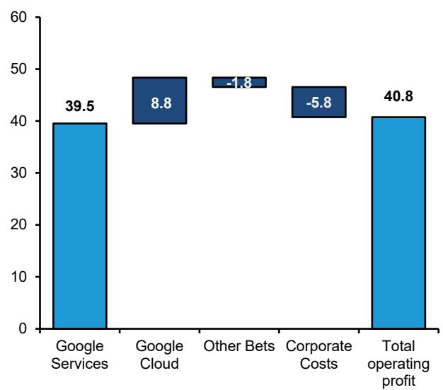  
来源：公司文件，Bernstein分析

**图表11：员工人数环比增加4.3k，同比增长6%**  
员工人数及人均运营支出（剔除TAC）增速（%，同比）  
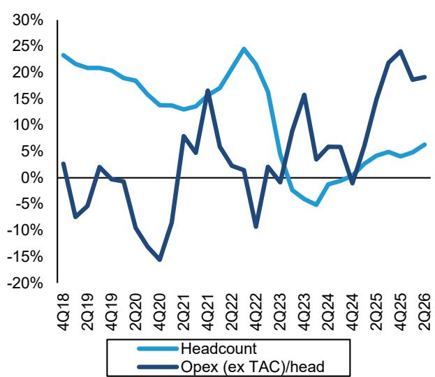  
来源：公司报告，Bernstein分析

**图表12：谷歌在过去两个季度停止股票回购**  
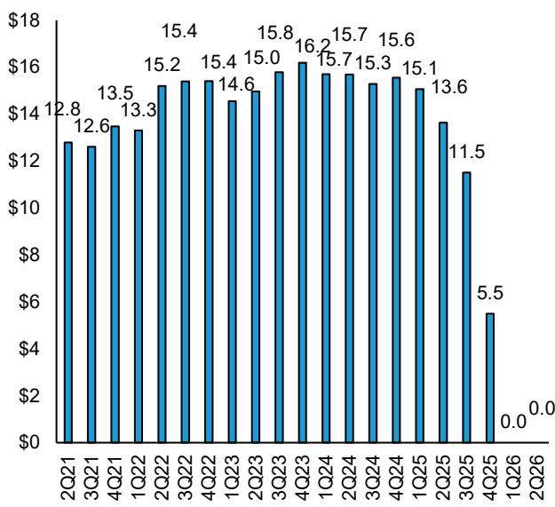  
来源：公司报告，Bernstein分析

**图表13：各部门收入占比**  
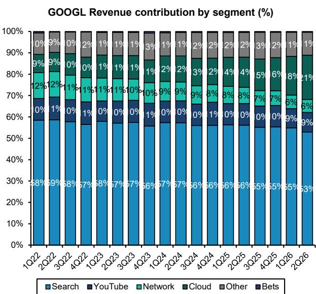  
来源：公司文件，Bernstein分析

**图表14：各部门收入同比增长率（%）**  
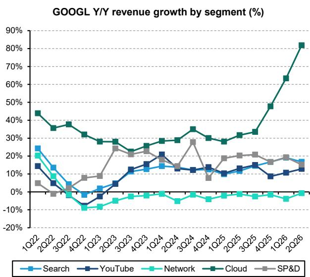  
来源：公司文件，Bernstein分析

**图表15：广告收入构成**  
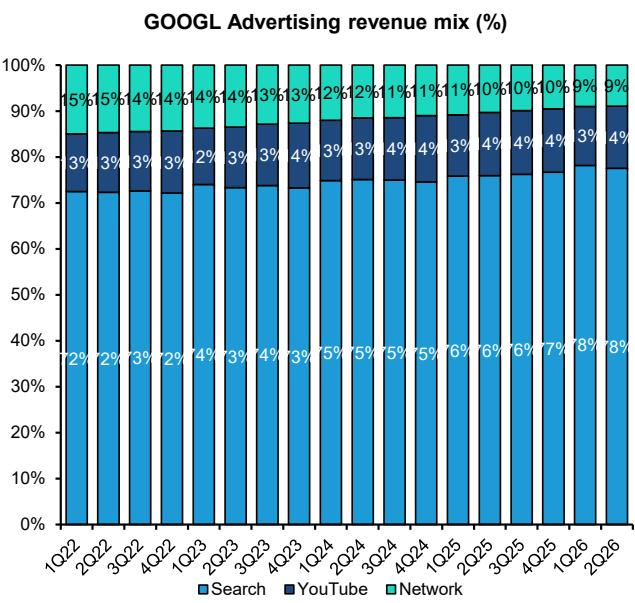  
来源：公司文件，Bernstein分析

**图表16：各部门两年收入复合增长率**  
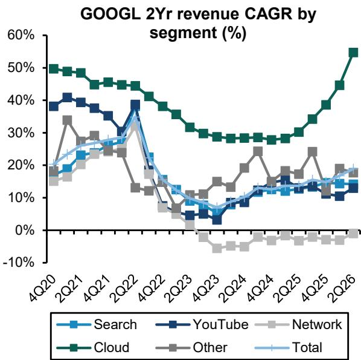  
来源：公司文件，Bernstein分析

## 附录 - 财务预测

## 图表17：我们的谷歌模型

<table><tr><td>GOOGL</td><td>1Q25</td><td>2Q25</td><td>3Q25</td><td>4Q25</td><td>1Q26</td><td>2Q26</td><td>3Q26E</td><td>4Q26E</td><td>FY2025</td><td>FY2026E</td><td>FY2027E</td><td>FY2028E</td></tr><tr><td colspan="13">GAAP损益表</td></tr><tr><td>收入</td><td>90,234</td><td>96,428</td><td>102,346</td><td>113,828</td><td>109,896</td><td>119,796</td><td>126,286</td><td>140,157</td><td>402,836</td><td>496,135</td><td>616,895</td><td>768,757</td></tr><tr><td>收入成本</td><td>36,361</td><td>39,039</td><td>41,369</td><td>45,766</td><td>41,271</td><td>45,943</td><td>49,461</td><td>55,091</td><td>162,535</td><td>191,767</td><td>233,426</td><td>284,746</td></tr><tr><td>研发</td><td>13,556</td><td>13,808</td><td>15,151</td><td>18,572</td><td>17,032</td><td>18,219</td><td>20,332</td><td>22,425</td><td>61,087</td><td>78,008</td><td>99,937</td><td>124,539</td></tr><tr><td>销售与营销</td><td>6,172</td><td>7,101</td><td>7,205</td><td>8,215</td><td>7,606</td><td>8,403</td><td>9,093</td><td>10,091</td><td>28,693</td><td>35,193</td><td>43,835</td><td>54,630</td></tr><tr><td>一般及行政</td><td>3,539</td><td>5,209</td><td>7,393</td><td>5,341</td><td>4,291</td><td>6,461</td><td>5,178</td><td>6,027</td><td>21,482</td><td>21,956</td><td>25,997</td><td>32,406</td></tr><tr><td>一次性成本（重组及罚款）</td><td>-</td><td>-</td><td>-</td><td>-</td><td>-</td><td>-</td><td>-</td><td>-</td><td>-</td><td>-</td><td>-</td><td>-</td></tr><tr><td>总支出</td><td>59,628</td><td>65,157</td><td>71,118</td><td>77,894</td><td>70,200</td><td>79,026</td><td>84,064</td><td>93,635</td><td>273,797</td><td>326,924</td><td>403,195</td><td>496,321</td></tr><tr><td>EBIT</td><td>30,606</td><td>31,271</td><td>31,228</td><td>35,934</td><td>39,696</td><td>40,770</td><td>42,223</td><td>46,522</td><td>129,039</td><td>169,211</td><td>213,701</td><td>272,436</td></tr><tr><td>D&amp;A</td><td>4,487</td><td>4,998</td><td>5,611</td><td>6,040</td><td>6,482</td><td>7,104</td><td>9,850</td><td>10,932</td><td>21,136</td><td>34,369</td><td>56,754</td><td>84,563</td></tr><tr><td>EBITDA（含SBC）</td><td>35,093</td><td>36,269</td><td>36,839</td><td>41,974</td><td>46,178</td><td>47,874</td><td>52,073</td><td>57,454</td><td>150,175</td><td>203,580</td><td>270,455</td><td>356,999</td></tr><tr><td>其他收入（支出）</td><td>11,183</td><td>2,662</td><td>12,759</td><td>3,183</td><td>37,716</td><td>97,983</td><td>5,000</td><td>5,000</td><td>29,787</td><td>145,699</td><td>16,000</td><td>10,000</td></tr><tr><td>净利润</td><td>34,540</td><td>28,196</td><td>34,979</td><td>34,455</td><td>62,578</td><td>112,193</td><td>39,337</td><td>42,918</td><td>132,170</td><td>257,026</td><td>191,341</td><td>235,269</td></tr><tr><td>加权平均摊薄股数</td><td>12,291</td><td>12,198</td><td>12,203</td><td>12,228</td><td>12,238</td><td>12,309</td><td>12,389</td><td>12,471</td><td>12,230</td><td>12,352</td><td>12,536</td><td>12,656</td></tr><tr><td>稀释后GAAP每股回报</td><td>2.81</td><td>2.31</td><td>2.87</td><td>2.82</td><td>5.11</td><td>9.11</td><td>3.18</td><td>3.44</td><td>10.81</td><td>20.84</td><td>15.26</td><td>18.58</td></tr><tr><td colspan="13">GAAP利润率：</td></tr><tr><td>毛利率</td><td>60%</td><td>60%</td><td>60%</td><td>60%</td><td>62%</td><td>62%</td><td>61%</td><td>61%</td><td>60%</td><td>61%</td><td>62%</td><td>63%</td></tr><tr><td>EBIT利润率（剔除一次性罚款）</td><td>34%</td><td>34%</td><td>34%</td><td>33%</td><td>36%</td><td>34%</td><td>33%</td><td>33%</td><td>32%</td><td>34%</td><td>35%</td><td>35%</td></tr><tr><td>EBITDA利润率（剔除一次性罚款）</td><td>39%</td><td>38%</td><td>36%</td><td>37%</td><td>42%</td><td>40%</td><td>41%</td><td>41%</td><td>37%</td><td>41%</td><td>44%</td><td>46%</td></tr><tr><td colspan="13">同比增长（GAAP）：</td></tr><tr><td>收入</td><td>12%</td><td>14%</td><td>16%</td><td>18%</td><td>22%</td><td>24%</td><td>23%</td><td>23%</td><td>15%</td><td>23%</td><td>24%</td><td>25%</td></tr><tr><td>EBITDA</td><td>21%</td><td>16%</td><td>13%</td><td>19%</td><td>32%</td><td>32%</td><td>41%</td><td>37%</td><td>11%</td><td>18%</td><td>22%</td><td>22%</td></tr><tr><td>每股回报</td><td>52%</td><td>22%</td><td>35%</td><td>31%</td><td>82%</td><td>294%</td><td>11%</td><td>22%</td><td>35%</td><td>93%</td><td>-27%</td><td>22%</td></tr><tr><td colspan="13">调整后项目</td></tr><tr><td>调整后EBITDA（剔除SBC）</td><td>40,609</td><td>42,267</td><td>43,207</td><td>49,045</td><td>52,929</td><td>55,831</td><td>59,931</td><td>66,161</td><td>175,128</td><td>234,852</td><td>309,339</td><td>405,456</td></tr><tr><td>调整后EBITDA利润率</td><td>45%</td><td>44%</td><td>42%</td><td>43%</td><td>48%</td><td>47%</td><td>47%</td><td>47%</td><td>43%</td><td>47%</td><td>50%</td><td>53%</td></tr><tr><td>非GAAP净利润</td><td>40,056</td><td>34,194</td><td>41,347</td><td>41,526</td><td>69,329</td><td>120,150</td><td>47,194</td><td>51,625</td><td>157,123</td><td>288,298</td><td>230,224</td><td>283,726</td></tr><tr><td>稀释后非GAAP每股回报</td><td>3.26</td><td>2.80</td><td>3.39</td><td>3.40</td><td>5.67</td><td>9.76</td><td>3.81</td><td>4.14</td><td>12.85</td><td>23.34</td><td>18.37</td><td>22.42</td></tr><tr><td colspan="13">关键指标（剔除其他投注）</td></tr><tr><td>搜索</td><td>50,702</td><td>54,190</td><td>56,567</td><td>63,073</td><td>60,399</td><td>63,271</td><td>65,052</td><td>71,903</td><td>224,532</td><td>260,625</td><td>291,900</td><td>324,009</td></tr><tr><td>YouTube</td><td>8,927</td><td>9,796</td><td>10,261</td><td>11,383</td><td>9,883</td><td>11,055</td><td>11,215</td><td>12,635</td><td>40,367</td><td>44,788</td><td>49,491</td><td>53,945</td></tr><tr><td>网络会员</td><td>7,256</td><td>7,354</td><td>7,354</td><td>7,828</td><td>6,971</td><td>7,303</td><td>7,097</td><td>7,554</td><td>29,792</td><td>28,925</td><td>28,202</td><td>27,496</td></tr><tr><td>广告收入</td><td>66,885</td><td>71,340</td><td>74,182</td><td>82,284</td><td>77,253</td><td>81,629</td><td>83,364</td><td>92,092</td><td>294,691</td><td>334,338</td><td>369,593</td><td>405,451</td></tr><tr><td>云计算</td><td>12,260</td><td>13,624</td><td>15,157</td><td>17,664</td><td>20,028</td><td>24,768</td><td>27,586</td><td>31,795</td><td>58,705</td><td>104,177</td><td>181,205</td><td>289,927</td></tr><tr><td>其他</td><td>10,379</td><td>11,203</td><td>12,870</td><td>13,578</td><td>12,384</td><td>12,911</td><td>14,981</td><td>15,886</td><td>48,030</td><td>56,162</td><td>64,512</td><td>71,737</td></tr><tr><td>谷歌部门收入</td><td>89,524</td><td>96,167</td><td>102,209</td><td>113,526</td><td>109,665</td><td>119,308</td><td>125,930</td><td>139,774</td><td>401,426</td><td>494,677</td><td>615,310</td><td>767,116</td></tr><tr><td>广告增速（同比）</td><td>8%</td><td>10%</td><td>13%</td><td>14%</td><td>16%</td><td>14%</td><td>12%</td><td>12%</td><td>11%</td><td>13%</td><td>11%</td><td>10%</td></tr><tr><td>谷歌部门增速（同比）</td><td>12%</td><td>14%</td><td>16%</td><td>18%</td><td>22%</td><td>24%</td><td>23%</td><td>23%</td><td>12%</td><td>11%</td><td>11%</td><td>9%</td></tr><tr><td colspan="13">资产负债表与现金流</td></tr><tr><td>现金+可交易证券</td><td>95,328</td><td>95,148</td><td>98,496</td><td>126,843</td><td>126,840</td><td>242,474</td><td>246,895</td><td>257,369</td><td>126,843</td><td>257,369</td><td>168,366</td><td>149,899</td></tr><tr><td>物业与设备，净额</td><td>185,062</td><td>203,231</td><td>223,787</td><td>246,597</td><td>281,020</td><td>321,212</td><td>368,191</td><td>420,329</td><td>246,597</td><td>420,329</td><td>689,912</td><td>933,608</td></tr><tr><td>其他资产</td><td>194,984</td><td>203,674</td><td>214,186</td><td>221,841</td><td>296,059</td><td>358,297</td><td>354,320</td><td>372,535</td><td>221,841</td><td>372,535</td><td>434,191</td><td>512,363</td></tr><tr><td>总资产</td><td>475,374</td><td>502,053</td><td>536,469</td><td>595,281</td><td>703,919</td><td>921,983</td><td>969,406</td><td>1,050,232</td><td>595,281</td><td>1,050,232</td><td>1,292,469</td><td>1,595,870</td></tr><tr><td>自由现金流</td><td>18,953</td><td>5,301</td><td>24,461</td><td>24,551</td><td>10,116</td><td>(5,855)</td><td>(8,511)</td><td>(2,438)</td><td>73,266</td><td>(6,688)</td><td>(59,617)</td><td>12,366</td></tr><tr><td>自由现金流利润率</td><td>21%</td><td>5%</td><td>24%</td><td>22%</td><td>9%</td><td>-5%</td><td>-7%</td><td>-2%</td><td>18%</td><td>-1%</td><td>-10%</td><td>2%</td></tr></table>

来源：公司报告，Bernstein估算与分析

## Bernstein股票列表

<table><tr><td rowspan="2"></td><td colspan="4">2026年7月22日</td><td>TTM</td><td colspan="4">报告每股回报</td><td colspan="3">报告P/E（倍）</td></tr><tr><td></td><td></td><td rowspan="2">收盘价</td><td rowspan="2">目标价</td><td rowspan="2">相对表现</td><td></td><td></td><td></td><td></td><td></td><td></td><td></td></tr><tr><td>代码</td><td>评级</td><td>货币</td><td>当前</td><td>当前</td><td>2025A</td><td>2026E</td><td>2027E</td><td>2025A</td><td>2026E</td><td>2027E</td></tr><tr><td>GOOGL (Alphabet)</td><td>M</td><td>USD</td><td>342.09</td><td>385.00</td><td>61.0%</td><td>USD</td><td>10.81</td><td>20.84</td><td>15.26</td><td>31.7</td><td>16.4</td><td>22.4</td></tr><tr><td>OLD</td><td></td><td></td><td></td><td>390.00</td><td></td><td></td><td></td><td>14.81</td><td>15.16</td><td></td><td></td><td></td></tr><tr><td>SPX</td><td></td><td></td><td>7,498.96</td><td></td><td></td><td></td><td></td><td></td><td></td><td></td><td></td><td></td></tr></table>

**目标价变动 / 估计变动加粗**

O - 优于市场，M - 市场表现，U - 低于市场，NR - 未评级，CS - 覆盖暂停  
来源：Bloomberg，Bernstein估算与分析。

## I. 必要披露

“Bernstein”或“本公司”在这些披露中指的是以下实体：Bernstein Institutional Services LLC（自2024年4月1日起）、Bernstein & Co., LLC（2024年4月1日之前）、Bernstein Autonomous LLP、BSG France S.A.（自2024年4月1日起）、Bernstein (Hong Kong) Limited 盛博香港有限公司、Bernstein (Canada) Limited、Bernstein (India) Private Limited（SEBI注册号INH000006378）、Bernstein (Singapore) Private Limited、Bernstein Japan KK（サンフォード・C・バーンスタイン株式会社）以及根据Bernstein与SG之间的全球服务协议受雇于SG Africa Technologies & Services为Bernstein制作报告的分析师。

Bernstein是SG（SG）与AllianceBernstein, L.P.（AB）合资企业的一部分。除非另有明确说明，就这些披露而言，提及Bernstein的“关联方”均指SG和AB及其各自的关联方。

为本报告做出贡献的关联人士在Alphabet Inc.的股权或债务证券中拥有经济利益。

## 估值方法

## Alphabet Inc

我们以385美元的目标价对Alphabet进行估值，采用2027年EV/EBIT倍数24倍（50%权重）及WACC 10%和终值增长率3.5%的DCF模型（50%权重）的组合。我们将Alphabet主要视为数字广告业务，并以此为基准与行业可比公司进行估值比较。

## 风险

## Alphabet Inc

目标价上行风险：

- 数字广告复苏及公司特有努力带来的收入增长快于预期，或近期放缓招聘及小规模裁员带来的利润率好于预期。
- 有利监管结果进一步加强谷歌在搜索和网络领域的现有地位。

目标价下行风险：

- 与搜索脱媒相关的终局风险叙事，无论是负面头条还是搜索用户（和/或收入）份额下降。如果搜索收入发生变化，可能对整个业务产生连锁影响，并对GOOGL的广告收入产生实质性影响，我们预计报价将进一步下调。
- Alphabet目前在国内和国际上正面临多起反垄断和隐私监管调查。特别是，美国司法部针对谷歌搜索的案件可能会在今年晚些时候做出裁决。

## 评级定义、基准与分布

## 股权评级定义

## Bernstein品牌

Bernstein品牌根据未来12个月相对S&P 500（美国和加拿大上市股票）、Bloomberg欧洲发达市场大型和中型股价格回报指数EUR（EDME）（欧洲及新兴市场交易所上市股票，亚洲太平洋地区除外）、Bloomberg日本大型和中型股价格回报指数USD（JPL）（日本交易所上市股票）以及Bloomberg亚洲（除日本）大型和中型股价格回报指数（ASIAX）（亚洲（除日本）交易所上市股票）的预测表现进行评级——除非另有说明。

Bernstein品牌有三个评级类别：

- 优于市场：股票将跑赢市场指数超过15个百分点
- 市场表现：股票将表现与市场指数一致，波动在+/-15个百分点以内
- 低于市场：股票将落后于市场指数超过15个百分点

覆盖暂停：Bernstein品牌对某公司的覆盖已暂停。评级和目标价暂时中止，不再有效，因此不应依赖。

未评级：当股票无法准确估值或公司表现目前无法准确预测时分配的评级。覆盖分析师可能继续发布关于该公司的研究报告，以向读者更新事件和进展。

未覆盖（NC）表示未在覆盖范围内的公司。

Bernstein品牌股票评级基于12个月时间框架。

## Autonomous品牌——普通股

Autonomous品牌按如下方式对普通股进行评级。我们的基准指数包括：Bloomberg欧洲600金融价格回报指数（E600BK）和Bloomberg欧洲发达市场金融大型和中型股价格回报指数EUR（EDMFI）用于发达欧洲银行和支付、Bloomberg欧洲600保险价格回报指数（E600IN）用于欧洲保险公司、S&P 500和S&P金融指数用于美国银行和支付覆盖、S5LIFE用于美国保险、S&P保险精选行业指数（SPSIINS）用于美国非寿险公司覆盖、Bloomberg新兴市场金融大型、中型和小型股价格回报指数（EMLSF）用于新兴市场银行、保险公司和支付、以及Bloomberg日本金融大型和中型股价格回报指数（JPFILM）用于日本金融。评级是相对于行业（而非市场）给出的。

Autonomous品牌有三个普通股评级类别：

- 优于市场（OP）：股票将跑赢相关指数超过10个百分点
- 中性（N）：股票将表现与指数一致，波动在+/-10个百分点以内
- 低于市场（UP）：股票将落后于相关指数超过10个百分点

覆盖暂停：Autonomous研究品牌对某公司的覆盖已暂停。评级和目标价暂时中止，不再有效，因此不应依赖。

未评级：当股票无法准确估值或公司表现目前无法准确预测时分配的评级。覆盖分析师可能继续发布关于该公司的研究报告，以向读者更新事件和进展。

标记为“特色”（例如，特色优于市场FOP，特色低于优于市场FUP）的为我们的核心观点。

未覆盖（NC）表示未在覆盖范围内的公司。

Autonomous品牌普通股评级基于12个月时间框架。

## Autonomous品牌——优先股

Autonomous品牌有三个优先股评级类别：

- 优于市场（OP）：优先工具的总回报预计将在未来六个月内优于类似行业或评级类别中其他发行人的优先证券。
- 中性（N）：优先工具的总回报预计将在未来六个月内与类似行业或评级类别中其他发行人的优先证券表现一致。
- 低于市场（UP）：优先工具的总回报预计将在未来六个月内落后于类似行业或评级类别中其他发行人的优先证券。

Autonomous优先股评级基于6个月时间框架。

## AUTONOMOUS信用研究

如果本报告包含对信用工具的研究交流（如市场滥用监管法规第3(1)(35)条所定义），以下信息旨在满足其披露要求。

本报告还可能包含对Autonomous或Bernstein其他分析师所覆盖本文件提及发行人权益证券的已发表观点的引用。请注意，本报告作者发布的信用工具研究交流可能与覆盖该发行人权益证券的分析师所发表的观点不同，反之亦然。

## 信用评级定义

Autonomous品牌有三个信用评级类别：

- 信用优于市场（C-OP）：参考信用工具的总回报预计将在未来六个月内优于类似行业或评级类别中其他发行人债券的信用利差。
- 信用中性（C-N）：参考信用工具的总回报预计将在未来六个月内与类似行业或评级类别中其他发行人债券的信用利差表现一致。
- 信用低于市场（C-UP）：参考信用工具的总回报预计将在未来六个月内落后于类似行业或评级类别中其他发行人债券的信用利差。

Autonomous信用评级基于6个月时间框架。

本报告作者制作的所有研究交流清单以及信用评级历史可应要求提供。

是否启动、更新和停止研究覆盖完全由本公司自行决定。本公司已建立、维护并依赖信息壁垒来控制包含在一个或多个领域（即非公开侧）内的信息流向本公司其他领域、部门、集团或关联方（即公开侧）。

**股权评级 / 投资银行服务分布**

| 股权评级 | 市场滥用监管法规(MAR)和FINRA评级类别 | 全球评级分布 | 投资银行关系* |
|----------|---------------------------------------|--------------|----------------|
| 优于市场 | 买入 | 51.2% | 15.3% |
| 市场表现 (Bernstein品牌) / 中性 (Autonomous品牌) | 持有 | 35.8% | 16.2% |
| 低于市场 | 卖出 | 13.1% | 13.6% |

*这些数字代表每个股权评级类别中，Bernstein关联方在过去12个月内提供过投资银行服务的公司百分比。
截至2026年6月30日。所有数字按季度更新。

## 价格图表 / 评级与目标价历史

在2024年4月1日之前，Bernstein & Co., LLC发布了以下公司的评级和目标价信息：Alphabet Inc。

Alphabet Inc (GOOGL) Bernstein评级历史（截至2026年7月22日）  
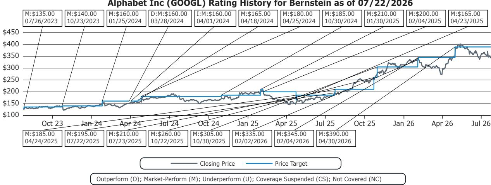  
上述图表中的所有目标价和收盘价数据均以本报告股票列表中所列货币计价。

## 利益冲突

SG和/或其关联方正在担任Alphabet Inc债券发行（欧元，3、6、9、13、19、39年期）的联合账簿管理人。

Bernstein Autonomous LLP或BSG France SA实益持有以下MiFID合格证券中某类普通股总已发行股本0.5%或以上的净多头或净空头头寸：Alphabet Inc。

Bernstein和/或其关联方在过去十二个月中已从Alphabet Inc收到投资银行服务报酬。

Bernstein和/或其关联方在过去十二个月中已从以下客户收到非投资银行证券相关产品或服务的报酬：Alphabet Inc。

Bernstein和/或其关联方预计在未来三个月内将收到或打算寻求从Alphabet Inc获得投资银行服务报酬。

Bernstein的某些关联方在Alphabet Inc的债务证券中担任做市商或流动性提供者。

Bernstein和/或其关联方在过去十二个月中与Alphabet Inc存在投资银行客户关系。

Bernstein的关联方在过去十二个月中管理或联合管理了Alphabet Inc的证券公开发行。

Bernstein的某些关联方在Alphabet Inc的权益证券中担任做市商或流动性提供者。

## 其他事项

列于本报告中的分析师所任职的法律实体及其所在地可通过其电话号码的国家代码确定：

+1 Bernstein Institutional Services LLC; 纽约州纽约市，美国

+44 Bernstein Autonomous LLP; 伦敦，英国

+212 SG Africa Technologies & Services; 卡萨布兰卡，摩洛哥

+33 BSG France S.A.; 巴黎，法国

+34 BSG France S.A.; 马德里，西班牙

+41 Bernstein Autonomous LLP; 日内瓦，瑞士

+49 BSG France S.A.; 法兰克福，德国

+91 Bernstein (India) Private Limited; 孟买，印度

+852 Bernstein (Hong Kong) Limited 盛博香港有限公司; 中国香港

+65 Bernstein (Singapore) Private Limited; 新加坡

+81 Bernstein Japan KK; 东京，日本

如果本报告由非美国关联公司雇佣的研究分析师编写，则该分析师（除非另有明确说明）未注册为Bernstein Institutional Services LLC或任何其他SEC注册经纪交易商的关联人士，也未获得FINRA研究分析师的资格或执照。因此，该分析师可能不受FINRA关于（其中包括）研究分析师与主题公司之间的沟通、研究分析师与投资银行人员之间的互动、研究分析师参与与投资银行交易相关的招揽和营销活动、研究分析师的公开露面以及研究分析师账户中的证券交易等限制。

如果本报告由SG Africa Technologies & Services（SG集团成员）雇佣的研究分析师编写，则是根据Bernstein与SG之间的全球服务协议代表某Bernstein公司编写的。

## 认证

本报告每位主要负责内容编写的研究分析师证明，本出版物中表达的所有观点均准确反映了该分析师对任何及所有主题证券或发行人的个人观点，并且该分析师的报酬中没有任何部分直接或间接与本次出版物中的具体建议或观点相关。

## II. 附加全球冲突披露

是否启动、更新和停止研究覆盖完全由本公司自行决定。本公司已建立、维护并依赖信息壁垒来控制包含在一个或多个领域（即非公开侧）内的信息流向本公司其他领域、部门、集团或关联方（即公开侧）。

## III. 其他重要信息和披露

“Bernstein”和“Autonomous”研究产品保持独立的品牌标识。

- Bernstein制作多种不同类型的研究产品，包括但不限于Bernstein和Autonomous品牌下的基本面分析和定量分析。一种研究产品中包含的建议可能与其他类型研究产品中的建议不同，无论是因为时间框架、方法论或其他方面的差异。此外，一个品牌下发布的研究产品中的观点或建议可能与其他品牌发布的同类研究产品中的观点或建议不同。两个品牌的研究评级体系及与这些评级体系相关的其他信息均包含在前一节中。

- Autonomous作为独立业务部门在以下实体中运营：Bernstein Institutional Services LLC、Bernstein Autonomous LLP、Bernstein (Hong Kong) Limited 盛博香港有限公司和Bernstein (India) Private Limited。有关“Autonomous”品牌产品（包括某些销售资料）的信息，请访问：www.autonomous.com。有关Bernstein品牌产品的信息，请访问：www.bernsteinresearch.com。

分析师的薪酬基于其对整体研究业务的贡献，通过客户渗透率、生产力和投资想法的主动性来衡量。没有分析师的薪酬是基于投资银行收入的表现或贡献来决定的。

本报告由独立分析师根据欧盟596/2014市场滥用监管法规（“MAR”）第3(1)(34)(i)条定义编写，该条款同样构成英国国内法——《1972年欧洲共同体法案》——的一部分。

致美国读者：Bernstein Institutional Services LLC是一家在美国证券交易委员会（SEC）注册的经纪交易商，是美国金融业监管局（FINRA）的成员，正在美国分发本出版物并对其内容负责。如果本材料包含对债务产品的分析，则该材料仅面向机构读者，不适用于为零售读者准备的债务研究的美国独立性和披露标准。

Bernstein Institutional Services LLC可能以自有账户或作为他人（包括关联方）的代理人买卖本报告主题的任何证券。本报告不声称满足任何特定个人、实体或账户的目标或需求。

致加拿大读者：如果本出版物涉及一家加拿大注册公司，则由Bernstein (Canada) Limited在加拿大分发，该公司由加拿大投资监管组织（CIRO）许可并监管。如果出版物涉及非加拿大注册公司，则由Bernstein Institutional Services LLC（由SEC和FINRA许可和监管）根据国际交易商豁免在加拿大分发。

本文件不得传递给加拿大的任何人，除非该人符合国家文书31-103第1.1节定义的“许可客户”资格。

致巴西读者：本报告由Bernstein Institutional Services LLC编写，Banco BTG Pactual S.A.（“BTG”）负责在巴西分发本报告。

致英国读者：本出版物已在英国由Bernstein Autonomous LLP发布或批准发布，该公司由金融行为监管局（FCA）授权和监管，地址为60 London Wall, London EC2M 5SH，电话+44 (0)20-7170-5000。在英格兰和威尔士注册，编号OC343985。

本文件仅分发给以下人士：(i) 具有金融促销令（2005年金融服务和市场法案（金融促销）令，经修订，“金融促销令”）第19(5)条规定的投资相关事项专业经验的人士；(ii) 属于金融促销令第49(2)(a)至(d)条（“高净值公司、非法人协会等”）的人士；(iii) 位于英国境外的人士；或(iv) 可以合法地以其他方式传达或导致传达与发行或销售任何证券相关的投资活动邀请或诱导（FSMA第21条含义内）的人士（所有此类人士统称为“相关人士”）。本文件仅面向相关人士，非相关人士不得依据或依赖本文件。本文件相关的任何投资或投资活动仅对相关人士开放，且仅与相关人士进行。

致欧洲经济区成员国读者：本出版物由BSG France S.A.分发，该公司由审慎监管与决议局（ACPR）和金融市场管理局（AMF）授权和监管。

致香港读者：本出版物由Bernstein (Hong Kong) Limited 盛博香港有限公司在香港分发，该公司由香港证券及期货事务监察委员会（SFC）许可和监管（中央实体编号AXC846），从事第4类（就证券提供意见）受规管活动，并受SFC公共登记册（https://www.sfc.hk/publicregWeb/corp/AXC846/details）中所述的许可条件约束。本出版物仅面向专业读者（定义见证券及期货条例（第571章））。本报告的目的仅为提供对本报告所述发行人的分析，并非旨在违反香港法律。

致新加坡读者：本出版物由Bernstein (Singapore) Private Limited在新加坡分发，仅面向认可读者或机构读者（定义见新加坡2001年证券及期货法（“SFA”））。新加坡的接收者应联系Bernstein (Singapore) Private Limited处理与本出版物相关的事宜。Bernstein (Singapore) Private Limited受新加坡金融管理局监管，并根据SFA获得资本市场服务牌照，可进行证券和集体投资计划等资本市场产品的交易，并作为豁免财务顾问提供关于证券的建议、发布和分析报告。Bernstein (Singapore) Private Limited在新加坡注册，公司注册号20213710W，地址为8 Marina Boulevard, #12-01, Marina Bay Financial Centre, Singapore 018981，电话+65-6326-7000。

致中华人民共和国读者：本文件中提及的证券不在中华人民共和国（为本目的，不包括香港和澳门特别行政区或台湾，“中国”）发售或销售，也不得在违反中国任何适用法律的情况下直接或间接地在中国发售或销售。

本文件不构成向任何中国境内人士发售任何证券的要约或招揽购买任何证券的要约，如果向该人士发出该等要约或招揽属违法。

我们不表示本文件可以在符合中国任何适用登记或其他要求的情况下合法分发，也不表示可以根据任何豁免合法发行任何证券，并且我们不对促进任何此类分发或发行承担任何责任。特别是，我们未采取任何行动允许在中国公开发行任何证券或分发本文件。因此，证券未通过本文件或任何其他文件在中国境内发行或销售。本文件及任何广告或其他发售材料不得在中国境内分发或发布，除非在将导致遵守任何适用法律法规的情况下。

致日本读者：本出版物由Bernstein Japan KK（サンフォード・C・バーンスタイン株式会社）在日本分发，该公司在日本注册为金融工具业务经营者，注册号为关东财务局长（金商）第3387号，由金融厅监管。它也是日本投资信托协会的会员。本出版物仅面向日本的合格机构读者（定义见金融工具与交易法第2条第(3)款第(i)项）。

对于通过Daiwa Group Inc.（“Daiwa”）获得Bernstein网站访问权限的日本机构客户读者，您对本文件的访问不应被解释为Bernstein为您提供任何目的的研究交流。虽然Bernstein编制了本文件，但您的关系是与Daiwa的关系，并将继续是Daiwa的关系，而Bernstein与您没有任何合同关系，也不对您承担任何义务。

致澳大利亚读者：Bernstein (Hong Kong) Limited 盛博香港有限公司负责在澳大利亚分发研究。它受美国证券交易委员会根据美国法律监管，受英国金融行为监管局根据英国法律监管，这与澳大利亚法律不同。Bernstein (Hong Kong) Limited 盛博香港有限公司根据2001年公司法免于持有澳大利亚金融服务许可证的要求，以向批发客户提供以下金融服务：

- 提供金融产品建议；
- 交易金融产品；
- 为金融产品做市；以及
- 提供托管或存管服务。

致印度读者：本出版物由Bernstein (India) Private Limited（SCB India）在印度分发，该公司由印度证券交易委员会（SEBI）根据2014年SEBI（研究分析师）条例许可和监管为研究分析师实体，注册号INH000006378，并作为股票经纪商，注册号INZ000213537。SCB India目前从事研究和股票经纪服务业务。更多信息请参阅www.bernsteinresearch.in。

- SCB India是一家根据2013年公司法于2017年4月12日成立的私人有限公司，公司识别号U65999MH2017FTC293762，注册办公室位于Level 3A, 4th Floor, First International Financial Centre, Plot Nos C-54 and C-55, G Block, Near CBI Office, Bandra Kurla Complex, Bandra (East), Mumbai 400098, Maharashtra, India（电话：+91-22-68421401）。

- 有关SCB India联营公司（即关联方/集团公司）的详细信息，请发送电子邮件至MUM-BERNSTEIN-InCompliance@bernsteinsg.com。

- 截至本报告日期，SCB India没有任何纪律处分历史。

- 除非上文另有说明，SCB India和/或其联营公司（即关联方/集团公司）、编写本报告的研究分析师及其亲属：
  - 在主题公司中没有财务利益；
  - 在主题公司证券中没有实益拥有1%或以上的所有权；
  - 未从事任何印度公司的投资银行活动；
  - 在过去十二个月内未管理或联合管理任何印度公司的公开发行；
  - 在过去十二个月内未从主题公司收到投资银行服务或商人银行服务的任何报酬；
  - 在过去十二个月内未从主题公司收到经纪服务报酬；
  - 未从主题公司或第三方收到与本报告具体建议或观点相关的任何报酬或其他利益；以及
  - 目前没有，但将来可能在所覆盖公司的金融工具中担任做市商。
  - 截至本报告日期，在主题公司中没有利益冲突。

- 除非上文另有说明，在本研究报告分发日期之前的十二个月内，主题公司不是SCB India的客户。SCB India和/或其联营公司（即关联方/集团公司）在过去十二个月内未从主题公司收到除投资银行、商人银行或经纪服务之外的产品或服务报酬。

- 编写本报告的主要研究分析师、分析师团队成员及其家庭成员不是所覆盖公司的高级职员、董事、员工或顾问委员会成员。

- 我们的合规官/申诉官是Ms. Rupal Talati，可通过电话+91-22-68421451或电子邮件MUM-BERNSTEIN-InCompliance@bernsteinsg.com / Scbin-investorgrievance@bernsteinsg.com联系。

- SCB India的研究读者章程和条款及条件可在其网站https://bernsteinresearch.in/上查阅。

- 免责声明：SEBI的注册和NISM的认证绝不保证中介的业绩或为读者提供任何回报保证。证券市场投资存在市场风险。投资前请仔细阅读所有相关文件。

致瑞士读者：本文件由Bernstein Autonomous LLP在瑞士提供，仅提供给符合瑞士集体投资计划法（“CISA”）第10条及相关集体投资计划条例定义的合格读者，并且严格遵守适用的瑞士法律法规。本文件中提到的产品可能不适合所有类型的读者。本文件基于瑞士银行家协会（SBA）2008年1月发布的金融研究独立性指引。

致中东读者：Bernstein Autonomous LLP, DIFC分支的主要办公室位于Gate Village 06, DIFC, Dubai, UAE。Bernstein Autonomous LLP, DIFC分支由迪拜金融服务管理局（DFSA）监管，注册号CL10040，可安排交易投资和提供金融产品建议。所有通信和服务仅面向专业客户和市场对手方（定义见DFSA规则手册）。专业客户和市场对手方以外的个人（如零售客户）不是我们通信或服务的预期接收者。

## 法律声明

所有研究报告通过公司密码保护的网站bernsteinresearch.com和autonomous.com向客户发布。某些（但非全部）研究报告也通过第三方供应商提供给客户，或通过其他电子方式作为便利重新分发。

本出版物已按照本公司投资研究利益冲突管理政策发布和分发，该政策副本可从Bernstein Institutional Services LLC, Director of Compliance, 245 Park Avenue, New York, NY 10167获取。有关Bernstein业务的更多披露和信息，请访问我们的网站www.bernsteinresearch.com。

本文所述的证券可能并非在所有司法管辖区或对某些类别的读者均有出售资格，前提是该许可范围与本文所述实体持有的牌照不一致。本文件仅按法律允许的方式分发。本出版物不针对或意图分发给任何位于任何司法管辖区、州、国家或其他地区的任何个人或实体，如果此类分发、出版、可用性或使用违反法律法规，或会使本文提及的任何实体或其子公司或关联方受制于该司法管辖区的任何注册或许可要求。本出版物基于我们认为可靠的公开来源，但我们不保证该出版物的准确性或完整性。我们不承诺告知您报告信息或此处意见的任何变化。本出版物由本文所述实体编写和发布，面向合格对手方或专业客户分发。本出版物不是购买或出售任何证券的要约，也不构成投资、法律或税务建议。本文提到的投资可能不适合您。读者必须在咨询专业顾问的情况下根据自身具体情况做出投资决策。研究价值可能波动，以外币计价的投资可能因汇率波动而价值波动。关于投资过去表现的信息不一定是未来表现的指南、指标或保证。

本报告面向并仅适用于我们的客户，即上述监管机构定义的“合格对手方”、“专业客户”、“机构读者”和/或“专业读者”，不得重新分发给上述监管机构定义的零售客户。收到本报告的零售客户应注意，本文所述实体的服务不适用于他们，他们不应依赖本文材料做出投资决策。因上述行为而导致任何损失，本文所述实体概不负责，因为本文所述实体未注册/授权/获得许可与零售客户交易，也不会与零售客户签订任何合同协议/安排。本报告根据客户可能与本文所述实体签订的任何协议条款和条件提供。所有研究报告均通过电子方式同时向合格客户发布到我们的客户门户。

本报告中的信息由Bernstein仅为客户的内部业务使用而准备。客户可以为这一有限用途存储、展示、分析、重新格式化并打印本报告中的信息。未经Bernstein明确书面同意，客户不得复制、更改、制作衍生作品、转售、逆向工程、商业利用、共享或分发本报告所含的任何部分信息用于任何目的。这些限制包括提取数据或使用内容开发指数或其他产品。此外，您不得使用本报告或其任何部分来训练或微调任何第三方机器学习或人工智能系统，或作为任何此类系统的提示或输入。未经Bernstein明确书面同意，您也不得为自身的内部机器学习或人工智能系统执行上述任何操作。

Bernstein可能在准备其材料时使用人工智能工具。任何此类材料均经过Bernstein研究分析师在发布前审查。

本报告仅为信息目的编写，基于我们认为可靠的最新公开信息，但本文所述实体对其中包含的信息或数据的来源是否准确、完整、不具误导性或是否适合所述目的不做任何保证或陈述（明示或暗示），即使本文所述实体依赖信誉良好或可信的数据提供商，也不应以此为依据。所表达的意见是作者截至材料日期时的当前意见，我们不承诺告知您报告信息或此处意见的任何变化。

本文中对SG的任何引用纯粹基于事实，基于公开信息，仅用于比较目的。它们不构成对SG证券的意见或建议。

本出版物由本文所述实体编写和发布，面向合格对手方或专业客户分发。本报告中的信息旨在一般流通，不构成购买或出售任何证券、投资、法律或税务建议，也不构成上述任何监管机构定义的个人建议。它未考虑特定读者的投资目标、财务状况或需求。本报告未经上述任何监管机构审查，不代表上述任何监管机构的官方推荐。本文提到的投资可能不适合您。读者必须在咨询财务顾问关于投资产品合适性的建议后，根据自身具体投资目标、财务状况或需求做出投资决策。

本文包含的分析基于众多假设。不同的假设可能导致截然不同的结果。本报告中的信息不构成也不构成任何出售或发行要约，或任何购买或认购股份的要约，或诱导参与任何其他投资活动。本报告中提到的任何证券或金融工具的价值可能随市场状况波动。关于投资过去表现的信息不一定是未来表现的指南、指示或保证。研究分析师在本报告中提到的未来表现估计基于可能因不可预见因素（如市场波动/波动性）而无法实现的假设。对于以客户本国货币以外的外币计价的证券或金融工具，汇率变动将对其价值产生有利或不利影响。在根据本报告中的任何建议采取行动之前，接收者应考虑投资主题证券或金融工具的适当性，并在必要时寻求独立专业意见。

本文所述的证券可能并非在所有司法管辖区或对某些类别的读者均有出售资格，前提是该许可范围与本文所述实体持有的牌照不一致。本文件仅按法律允许的方式分发。它不针对或意图分发给任何位于任何司法管辖区、州、国家或其他地区的任何个人或实体，如果此类分发、出版、可用性或使用违反法律法规，或会使本文所述实体受制于该司法管辖区的任何注册或许可要求。

来源：Bloomberg Index Services Limited。BLOOMBERG®是Bloomberg Finance L.P.及其关联方（统称“Bloomberg”）的商标和服务标志。Bloomberg或其许可方拥有Bloomberg指数的所有专有权利。Bloomberg或其许可方不认可或赞同本材料，也不保证其中任何信息的准确性或完整性，也不对由此获得的结果做出任何明示或暗示的保证，并且在法律允许的最大范围内，不对与此相关的任何伤害或损害承担责任。

未经本文所述实体事先同意，不得复制、分发或传输或以其他方式提供本材料的任何部分。版权：Bernstein Institutional Services LLC, Bernstein Autonomous LLP, BSG France S.A., Bernstein (Hong Kong) Limited 盛博香港有限公司, Bernstein (Canada) Limited, Bernstein (India) Private Limited (SEBI registration no. INH000006378), Bernstein (Singapore) Private Limited, Bernstein Japan KK (サンフォード・C・バーンスタイン株式会社)。保留所有权利。本文中包含的商标和服务标志是其各自所有者的财产。任何未经授权的使用或披露均被严格禁止。本文所述实体可针对未经授权使用导致对本文所述实体及Bernstein和Autonomous品牌下发表的研究造成诽谤和/或声誉损害的行为提起法律诉讼。
