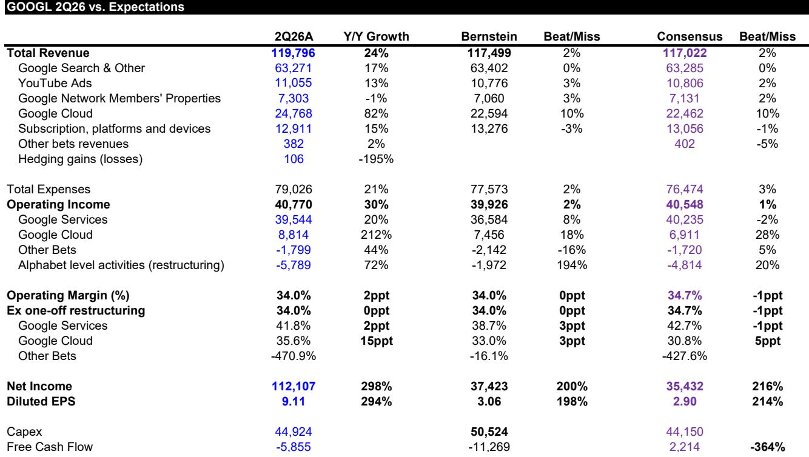
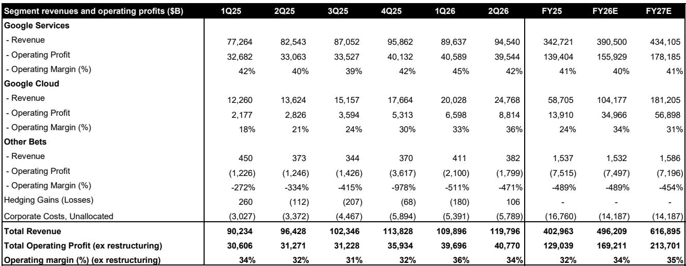

# Google 2026财年第二季度报告：业绩符合预期，但叙事面临挑战

Alphabet发布了季度报告，从数据看应当让观察者感到满意。搜索业务收入同比增长17%，与预期一致。云计算业务收入同比增长82%，显著高于分析预期。云计算经营利润率从去年同期的20.7%扩大至35.6%。服务板块经营利润率维持在42%。即使剔除对少数股权高达980亿美元的按市值计价收益，单位股份盈利在可比基础上也略有超出。按照任何传统衡量标准，这都是一次达到预期并有所提升的季度。然而，公司报价在盘后时段出现回调。数据与行情反应之间的张力并非不理性的表现，而是表明对Google的研究逻辑已进入一个更复杂的阶段——单纯经营出色已不足以维持其定价倍数。

核心问题不在于本次季度本身，而在于业务的远期结构。Google在搜索、云计算和AI基础设施三大支柱上均交出良好成绩，但每一支柱如今都面临各自且正在加剧的逆风，同时被行情所定价。搜索面临更困难的同比基数，增长速率从17%左右放缓至13%-15%，外汇顺风也转为逆风。云计算利润率预计将承压，因为Google急于租赁第三方计算能力以满足自身基础设施无法满足的需求。2026年资本支出上调约150亿美元至1950-2050亿美元区间，导致自由现金流转为负值。行情并非否定本次季度，而是在折扣其背后盈利质量的可持续性。

## 搜索业务仍是基石，但增长速率正从加速转向常态化

搜索业务收入630亿美元，同比增长17%，按任何历史标准都是健康数字。剔除汇率影响后，增速与上一季度持平。管理层继续强调，AI驱动的改进——特别是将AI概览与AI模式整合为单一体验——正在扩大搜索查询的总可寻址场域。AI模式全球上线以来月活用户已超过10亿，Google每周通过AI功能向网站发送数十亿次点击。得益于工程改进和硬件优化，AI模式的回复成本降至发布以来最低。

战略问题不在于搜索是否增长，而在于其增速是否足以维持Google相对于其他大型公司仍享有的定价倍数。答案正变得不那么清晰。17%的增速较上一季度的19%有所放缓，且下半年基数将更为困难。Google一直强调AI正在拓展总可寻址场域，这一逻辑有数据支撑。但场域的扩张速率与Google搜索收入的增长速率正在出现分化。如果搜索增速稳定在13%-15%区间，公司当前定价——向前调整市盈率约26.6倍、企业价值/息税前利润约24.1倍——所留的误差空间十分有限。搜索是Google研究逻辑的基石，而这块基石正从加速转向常态化。这一转变本身并不瓦解逻辑，但消除了此前支撑倍数上行的动力。

## 云计算收入增长惊人，但利润率走势即将逆转——Google购买自身无法快速建造的容量

Google云计算收入248亿美元，同比增长82%，是本季度最突出的数字。积压订单环比再增加500亿美元至5140亿美元，企业级AI解决方案需求强劲。近90%的《财富》100强公司在以某种方式使用Gemini Enterprise。代币处理量已达每分钟220亿个，高于上季度的160亿和前季度的100亿。云计算经营利润同比增长两倍至88亿美元，经营利润率扩大至35.6%。

矛盾在于Google计划如何维持这一增长。公司面临供给约束。为满足需求，它将在第三季度租赁第三方计算能力作为桥梁，同时加速内部产能建设。这一策略是防止客户流向亚马逊或微软的必要之举，但直接代价是利润率承压。第三方容量成本高于自建容量，利润率压缩将在未来几个季度显现。管理层已明确表示：云计算综合利润率预计将下降。问题在于降多少、持续多久。如果云利润率从当前的35.6%回落至20%-25%区间，那么云计算收入增长所带来的增量利润将明显低于当前运行速率所暗示的水平。行情已开始反映这一压缩，这也是云计算超预期并未转化为倍数上行动力的原因。

## 资本支出周期进入自由现金流为负的阶段，资金筹措方式日趋灵活

Google2026年资本支出指引为1950-2050亿美元，中位数较此前区间增加150亿美元。公司给出的原因是物料清单通胀、供应链约束以及需要加速产能交付。这是Google首次报告自由现金流为负，为负59亿美元。按过去十二个月计算，自由现金流为533亿美元，但随着资本支出加速，趋势明显向下。

战略含义很直白：Google已进入一个必须积极支出以捍卫搜索地位、在AI模型开发前沿竞争、同时争夺企业云计算业务的阶段。这三项目标并不互斥，但它们共同对资本的密集需求程度是公司此前未曾经历的。为这一投资周期融资，将需要结合债务发行、潜在权益稀释以及出售可交易证券。本季度末公司持有现金及可交易证券2425亿美元，长期债务982亿美元，资产负债表并未立即承压。但从一个持续创造自由现金流的公司转向一个为增长而消耗现金的公司，改变了盈利质量的属性。行情现在提出的问题是两年前无关紧要的：这批增量资本的回报是多少，需要多久才能实现？

## 一个基于三种场景的分析框架：当前定价是配置机会还是估值风险？

当前局势更适合用场景框架而非单点估计来审视。第一种场景：Google的AI投资在未来四至六个季度内产生可见回报。在此场景下，搜索增速稳定在13%-15%区间，云计算利润率暂时压缩但随着内部产能上线重新扩张，自由现金流在资本支出见顶后恢复正值。当前倍数压缩是暂时的，公司报价在当前水平具有吸引力。第二种场景：AI云计算的竞争格局迫使Google维持高资本支出更长时间，利润率持续承压，搜索增速继续放缓至10%左右。在此场景下，公司报价可能横盘或下行，因为行情将重新评估其盈利质量较低、增长持久性较弱的特点。第三种场景：Google模型表现与前沿竞争者之间的差距拉大，开发者和企业客户忠诚度下降，公司被迫投入更多以追赶，从而形成资本支出上升与回报下降的负向循环。

本次季度数据并未明确支持任何一种场景。搜索增长仍然健康。云计算收入正在加速。模型需求强劲，每月有900万开发者在Google平台上构建。但能够确认第一种场景的信号——云计算利润率持续扩大、Gemini 3.5 Pro或Gemini 4的明确时间表、资本支出周期见顶——尚未显现。管理层的评论更多聚焦于Gemini 4而非延迟的Gemini 3.5 Pro，而租赁第三方容量的决策表明内部产能上线所需时间将比行情所期望的更久。该框架表明，对于需要清晰看到资本回报的研究者而言，当前并非一个具有吸引力的介入节点。这是一只需要耐心并接受叙事可能在未来数个季度仍存在争议的品种。

## 盈利质量已发生转变，即使长期逻辑完好，定价倍数也应反映这一变化

本次季度最重要的分析结论并非收入超预期或云计算利润率扩张，而是Google盈利质量的转变。公司目前报告的盈利中有相当一部分来自非经营来源——对少数股权的980亿美元按市值计价收益是最明显的例子——但更广泛的问题是，经营盈利正被一个消耗自由现金流的资本支出周期所支撑。基于2026财年预期的调整市盈率14.7倍看起来不高，但这一倍数被按市值计价收益的包含以及当前经营利润率可持续的假设所扭曲。当剔除一次性收益并对资本支出周期进行常态化调整后，有效倍数实际上更高。

最合理的定价分析框架是将Google主要作为一家数字广告公司来评估，并与该行业板块内的可比公司进行对标。在此基础上，当前向前企业价值/息税前利润倍数24.1倍并不便宜。它反映了一种溢价，当公司在所有指标上均超出预期且无明显逆风时，这一溢价是合理的。如今，在搜索增速放缓、云计算利润率预期压缩、自由现金流为负的情况下，这一溢价更难以成立。将2027年企业价值/息税前利润24倍与加权平均资本成本10%、终值增长率3.5%的贴现现金流分析各取50%权重，得到的结果并不构成一个吸引人的风险回报比，尤其考虑到公司盈利质量的可持续性和资本回报轨迹仍有多重未解问题。

*仅供参考。部分内容可能基于源材料借助AI生成、翻译、摘要或编辑，可能存在遗漏或错误。请独立核实。这不是专业建议。*
