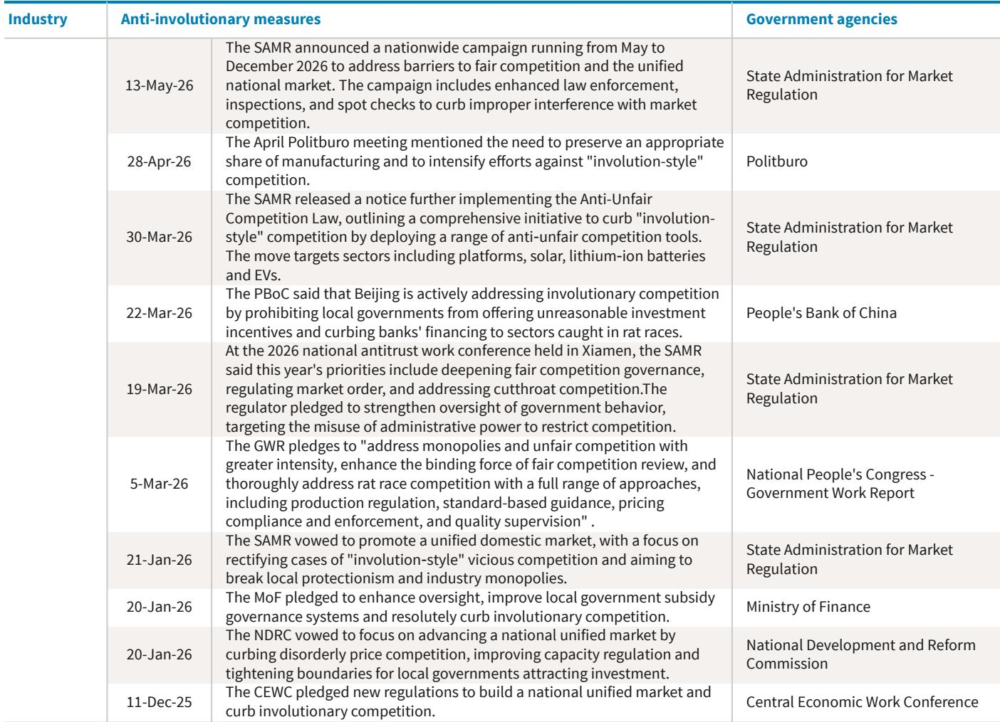
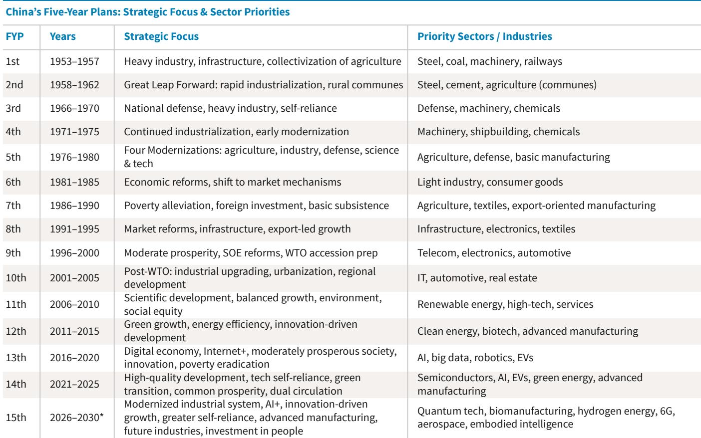
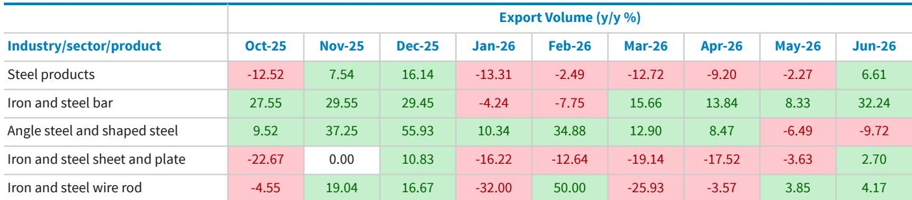

# BARC：中国6月生产数据结构观察

中国6月生产与出口数据延续了一个清晰的分化格局：新兴领域与传统部门之间的差距在扩大，且外部需求在吸收国内产出中扮演的角色越来越重要。BARC最新发布的产能跟踪报告指出，这种分化并非简单的强弱之别，而是呈现出“领先领域集中度提升、且日益集中于特定上游与赋能技术”的特征。

报告的核心观察是，中国出口产能结构变化的主题仍在延续，但构成正在发生结构性转变。6月集成电路出口额同比增速从5月的110.9%进一步攀升至121.9%，而出口量却微降0.3%。这意味着半导体出口的增长驱动力正在从数量转向单位价值提升和产品结构优化，而非单纯的产能调整。

## 1. 新能源车呈现生产与出口的显著分化

6月数据中最突出的情况出现在新能源车领域。国内生产端，混合动力乘用车产量同比下降34.2%，插电式混合动力下降32.4%，纯电动车产量基本持平于-0.6%。但出口端却呈现截然不同的景象：三类车型出口量分别增长105.3%、183.3%和81.3%。

这种生产与出口之间的巨大落差，说明国内需求对新能源车产能的吸收能力正在发生变化，而海外市场成为消化产能的主要渠道。报告认为，这一趋势在短期内仍将持续，但需要关注贸易政策变化对出口可持续性的影响。

> **注：** 新能源车生产与出口的分化幅度在6月进一步扩大，这不仅是产能结构的体现，更反映出国内新能源车市场可能已进入存量竞争阶段。观察“出口增长”与“出口盈利”之间的差异——量增价稳是更具参考意义的信号。

## 2. 家电出口呈现需求驱动的平稳增长

与新能源车形成对比的是，家电出口展现出更均衡的格局。6月冰箱产量、出口量和出口额分别同比增长14.7%、18.9%和19.5%，三者基本匹配。空调出口在经历5月调整后，6月出口量和出口额分别恢复至11.3%和10.1%的增长，而国内产量仍下降9.6%。

报告特别指出，空调出口量值与增速的匹配，表明这一增长主要由需求拉动而非价格折让驱动。时间节点上，这与西欧创纪录高温和冷却设备需求上升相吻合。这种“量价同步增长”的出口模式，与传统产能调整型出口有本质区别。

## 3. 集成电路与锂电池成为技术升级的典型代表

集成电路是报告中最典型的技术升级案例。6月出口额增速连续四个月加速，从3月的84.9%升至121.9%，而出口量增速从3月的12.9%降至-0.3%。这种“量缩价升”的组合，意味着中国半导体出口正在向更高附加值产品转移。

锂电池同样呈现类似特征：6月出口量增长23.5%，出口额增长31.7%，价值增速持续高于数量增速。报告认为，这与全球对电动汽车、储能和可再生能源整合的持续需求一致。

## 4. 传统部门仍以量补价，但分化也更加明显

水泥和钢铁等传统产能密集型部门仍处于典型的产能调整模式。6月水泥产量下降5.6%，出口量却增长109.2%，出口额增长88.4%，量增价滞的特征最为明显。钢铁产品产量基本持平，出口温和改善。

但即便在传统部门内部，分化也在持续。铝产品出口额增长77.0%，远超出口量44.9%的增速，表明部分高附加值铝制品正在受益于更优的定价或产品组合。而氧化铝出口额增速（35.1%）明显落后于出口量增速（58.8%），反映出更大的定价不确定性。

> **注：** 报告提供了一个实用的分析框架：观察“出口额增速”与“出口量增速”之间的差距。当出口额增速持续高于出口量增速时，说明出口正在向高附加值方向升级；反之，则可能是量增价跌的产能调整。这一框架适用于所有出口导向型行业。

总体而言，BARC这份报告揭示了一个正在持续推进的结构性转变：中国出口不再只是简单的产能释放，而是在部分领域展现出技术价值链上移的迹象。但这一过程并不均匀——半导体和锂电池是升级的代表，而新能源车和传统部门仍主要依赖出口消化多余产能。对于观察中国工业生产竞争力的读者而言，区分“量增价跌”与“量缩价升”的出口模式，比关注总量增速更有意义。

For informational purposes only. Portions may be generated,translated,summarized,or edited with AI assistance based on source materials and may contain omissions or errors. Please verify independently. This is not investment,legal,tax,accounting,or other professional advice.

For informational purposes only. Portions may be generated,translated,summarized,or edited with AI assistance based on source materials and may contain omissions or errors. Please verify independently. This is not investment,legal,tax,accounting,or other professional advice.

