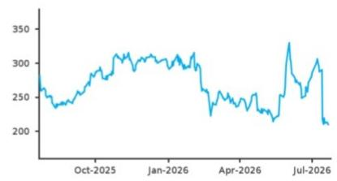
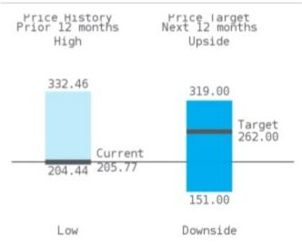

IBM Corp.

# 2Q26 回顾：适应客户行为变化

IBM 下半年的加速态势取决于其能否更快恢复部分递延的 ELA 交易、提升整体执行效率，以及分布式基础设施、存储、Power 系统和 z17 大型主机周期的持续强劲表现。

根据管理层反馈，大约三分之一延迟的大型企业交易已在第三季度初的几周内完成，同时强调客户行为属于需求推迟而非需求消失，因此我们对 IBM 在 FY26 实现 4% 同比增长的基本情景更有信心。不过，客户行为从 AI 基础设施/存储/内存采购中回归正常化的时间和节奏，是 IBM 下半年上行空间中不确定的因素。我们预计下半年执行效率将提升，这有望对冲潜在的不利影响，同时 IBM 的生产力计划进展顺利（指导营运税前利润率扩张 100 个基点，并重申自由现金流指引）。我们维持正面看法，但将目标参考价从 288 美元下调至 262 美元，以反映 FY26 可能较低的增长空间。

**关键数据：** 总收入 172 亿美元，同比增长 1%（固定汇率增长 1%，市场预期固定汇率增长 3%），低于市场预期 3%（市场预期 178.6 亿美元）。软件总收入 77.6 亿美元（市场预期 80 亿美元），固定汇率增长 5%（Q1 为 8%），其中混合云固定汇率增长 11%（市场预期 10.8%），自动化固定汇率增长 3%（市场预期 8.5%），数据固定汇率增长 18%（市场预期 20%），交易处理固定汇率下降 9%（市场预期下降 2.6%）。咨询收入 53.3 亿美元（市场预期 54 亿美元），固定汇率增长 1%（Q1 为 0.9%），其中策略与技术固定汇率增长 1%（市场预期 2%），智能运营固定汇率增长 1%（市场预期 1.3%）。基础设施收入 38.4 亿美元（市场预期 39.7 亿美元），固定汇率下降 7%（Q1 为增长 11.7%），其中混合基础设施固定汇率下降 10%（市场预期下降 2%），基础设施支持固定汇率下降 1%（市场预期下降 6%）。非 GAAP 毛利率 59.4%，低于市场预期约 100 个基点（60.4%）；非 GAAP 营运利润率 20.4%，高于市场预期 25 个基点（20.2%）。管理层将 FY2026 收入指引从固定汇率增长 5% 调整为同比增长 4-5%，但维持自由现金流增长预期为 10 亿美元。

**积极因素：** (1) 基础设施指引从低至中个位数同比下降上调为低个位数增长，因客户资本支出转向 AI 基础设施，分布式基础设施增长 37%，为 IBM 有记录以来较强季度。(2) 管理层预计下半年加速增长，得益于 ELA 转化率正常化和软件交易完成率改善，支持 FY26 软件增长展望 6-8%。(3) 尽管下调收入指引，管理层仍维持 FY26 自由现金流增长展望（同比增加约 10 亿美元），反映对生产力计划能够抵消收入不利因素的信心。

IBM 积极看法 不变  
美国软件 正面 不变  
目标参考价 262.00 美元，较 288.00 美元下调 9%  
报价（2026年7月22日） 205.77 美元  
潜在上行/下行空间 +27.3%  
来源：Bloomberg, BARC

<table><tr><td>市值（百万美元）</td><td>193400</td></tr><tr><td>流通股数（百万）</td><td>939.89</td></tr><tr><td>自由流通比例（%）</td><td>99.12</td></tr><tr><td>52周日均成交量（百万）</td><td>6.7</td></tr><tr><td>股息回报率（%）</td><td>3.28</td></tr><tr><td>TTM 净资产回报率（%）</td><td>35.93</td></tr><tr><td>当前每股账面价值（美元）</td><td>35.08</td></tr><tr><td colspan="2">来源：Bloomberg</td></tr></table>

价格表现 交易所-NYSE

  
来源：IDC  
链接到 BARC Live 查看交互图表

## 美国软件

Raimo Lenschow, CFA  
Sheldon McMeans  
Eamon Coughlin

**负面因素：** (1) IBM 将 FY26 收入指引下调约 100 个基点至增长 4-5%，原因是大型主机相关的 ELA 推迟和交易处理软件疲弱，客户资本支出从软件转向基础设施。(2) 软件收入增长 5%，但增长主要来自 HashiCorp 和 Confluent 收购，核心业务有机增长约 0%。(3) FY26 展望现在依赖于下半年软件和 ELA 转化率的显著回升，如果客户继续优先考虑 AI 基础设施支出而非软件采购，则存在执行风险。

**潜在观察点：** 10 月第二季度财报（暂定）。

IBM：季度及年度每股回报（美元）

<table><tr><td></td><td>2025</td><td colspan="3">2026</td><td colspan="3">2027</td><td colspan="2">同比变化</td></tr><tr><td>财年 12月</td><td>实际</td><td>旧</td><td>新</td><td>市场预期</td><td>旧</td><td>新</td><td>市场预期</td><td>2026</td><td>2027</td></tr><tr><td>Q1</td><td>1.61A</td><td>1.91A</td><td>1.91A</td><td>1.91A</td><td>2.03E</td><td>2.11E</td><td>2.07E</td><td>19%</td><td>10%</td></tr><tr><td>Q2</td><td>2.80A</td><td>2.77E</td><td>2.93A</td><td>2.97E</td><td>3.10E</td><td>3.14E</td><td>3.18E</td><td>5%</td><td>7%</td></tr><tr><td>Q3</td><td>2.65A</td><td>2.91E</td><td>2.80E</td><td>2.89E</td><td>3.07E</td><td>3.00E</td><td>3.14E</td><td>6%</td><td>7%</td></tr><tr><td>Q4</td><td>4.52A</td><td>4.77E</td><td>4.77E</td><td>4.47E</td><td>4.91E</td><td>4.89E</td><td>4.72E</td><td>6%</td><td>3%</td></tr><tr><td>全年</td><td>11.59A</td><td>12.36E</td><td>12.41E</td><td>12.20E</td><td>13.12E</td><td>13.14E</td><td>13.10E</td><td>7%</td><td>6%</td></tr><tr><td>估值倍数</td><td>17.8</td><td></td><td>16.6</td><td></td><td></td><td>15.7</td><td></td><td></td><td></td></tr></table>

市场预期来自 Bloomberg，接收时间 2026年7月22日 12:50 GMT  
来源：BARC

注：财年截止 12 月

## 美国软件

<table><tr><td>利润表（百万美元）</td><td>2025A</td><td>2026E</td><td>2027E</td><td>2028E</td><td>复合年增长率</td></tr><tr><td>收入</td><td>67,534</td><td>70,372</td><td>72,961</td><td>76,132</td><td>4.1%</td></tr><tr><td>EBITDA（调整后）</td><td>19,151</td><td>20,553</td><td>21,375</td><td>22,070</td><td>4.8%</td></tr><tr><td>营业利润（调整后）</td><td>N/A</td><td>N/A</td><td>N/A</td><td>N/A</td><td>N/A</td></tr><tr><td>税前利润（调整后）</td><td>12,714</td><td>13,842</td><td>14,599</td><td>15,685</td><td>7.2%</td></tr><tr><td>净利润（调整后）</td><td>10,994</td><td>11,824</td><td>12,526</td><td>13,405</td><td>6.8%</td></tr><tr><td>每股回报（调整后）（美元）</td><td>11.59</td><td>12.41</td><td>13.14</td><td>14.05</td><td>6.6%</td></tr><tr><td>摊薄股数（百万）</td><td>949</td><td>953</td><td>954</td><td>954</td><td>0.2%</td></tr><tr><td>每股股息（美元）</td><td>6.59</td><td>6.66</td><td>6.66</td><td>6.66</td><td>0.3%</td></tr></table>

<table><tr><td>利润率及回报数据</td><td>2025A</td><td>2026E</td><td>2027E</td><td>2028E</td><td>平均</td></tr><tr><td>EBITDA（调整后）利润率（%）</td><td>28.4</td><td>29.2</td><td>29.3</td><td>29.0</td><td>29.0</td></tr><tr><td>营业利润率（调整后）（%）</td><td>N/A</td><td>N/A</td><td>N/A</td><td>N/A</td><td>N/A</td></tr><tr><td>税前（调整后）利润率（%）</td><td>18.8</td><td>19.7</td><td>20.0</td><td>20.6</td><td>19.8</td></tr><tr><td>净（调整后）利润率（%）</td><td>16.3</td><td>16.8</td><td>17.2</td><td>17.6</td><td>17.0</td></tr><tr><td>ROIC（%）</td><td>10.9</td><td>10.8</td><td>11.0</td><td>11.2</td><td>11.0</td></tr><tr><td>ROA（%）</td><td>7.0</td><td>6.5</td><td>6.6</td><td>6.7</td><td>6.7</td></tr><tr><td>ROE（%）</td><td>32.4</td><td>26.3</td><td>23.9</td><td>22.0</td><td>26.1</td></tr></table>

<table><tr><td>资产负债表及现金流量（百万美元）</td><td>2025A</td><td>2026E</td><td>2027E</td><td>2028E</td><td>复合年增长率</td></tr><tr><td>固定资产净额</td><td>N/A</td><td>N/A</td><td>N/A</td><td>N/A</td><td>N/A</td></tr><tr><td>商誉</td><td>N/A</td><td>N/A</td><td>N/A</td><td>N/A</td><td>N/A</td></tr><tr><td>现金及现金等价物</td><td>13,590</td><td>11,127</td><td>19,889</td><td>30,745</td><td>31.3%</td></tr><tr><td>总资产</td><td>151,880</td><td>158,799</td><td>167,576</td><td>178,417</td><td>5.5%</td></tr><tr><td>短期及长期债务</td><td>61,260</td><td>61,987</td><td>61,987</td><td>61,987</td><td>0.4%</td></tr><tr><td>其他长期负债</td><td>9,810</td><td>9,875</td><td>9,587</td><td>10,519</td><td>2.4%</td></tr><tr><td>总负债</td><td>119,139</td><td>119,380</td><td>121,299</td><td>124,290</td><td>1.4%</td></tr><tr><td>净债务/（资金）</td><td>46,843</td><td>49,900</td><td>41,138</td><td>30,282</td><td>-13.5%</td></tr><tr><td>股东权益</td><td>32,741</td><td>39,419</td><td>46,277</td><td>54,127</td><td>18.2%</td></tr><tr><td>营运资本变动</td><td>-4,090</td><td>-1,585</td><td>-1,023</td><td>898</td><td>N/A</td></tr><tr><td>经营活动现金流量</td><td>13,194</td><td>15,977</td><td>17,021</td><td>19,200</td><td>13.3%</td></tr><tr><td>资本支出</td><td>1,617</td><td>1,822</td><td>1,910</td><td>1,993</td><td>7.2%</td></tr><tr><td>自由现金流</td><td>14,736</td><td>15,770</td><td>17,321</td><td>18,176</td><td>7.2%</td></tr></table>

<table><tr><td>估值及杠杆指标</td><td>2025A</td><td>2026E</td><td>2027E</td><td>2028E</td><td>平均</td></tr><tr><td>估值倍数（调整后）（倍）</td><td>17.8</td><td>16.6</td><td>15.7</td><td>14.6</td><td>16.2</td></tr><tr><td>企业价值/收入（倍）</td><td>3.5</td><td>3.4</td><td>3.2</td><td>2.9</td><td>3.3</td></tr><tr><td>企业价值/EBITDA（调整后）（倍）</td><td>12.5</td><td>11.8</td><td>10.9</td><td>10.1</td><td>11.3</td></tr><tr><td>股权自由现金流回报表现（%）</td><td>7.5</td><td>8.0</td><td>8.8</td><td>9.3</td><td>8.4</td></tr><tr><td>股息回报率（%）</td><td>3.2</td><td>3.2</td><td>3.2</td><td>3.2</td><td>3.2</td></tr><tr><td>净债务/EBITDA（调整后）（倍）</td><td>2.4</td><td>2.4</td><td>1.9</td><td>1.4</td><td>2.0</td></tr><tr><td>总债务/资本（%）</td><td>65.2</td><td>61.1</td><td>57.3</td><td>53.4</td><td>59.2</td></tr></table>

<table><tr><td>精选运营指标</td><td>2025A</td><td>2026E</td><td>2027E</td><td>2028E</td><td>复合年增长率</td></tr><tr><td>许可收入</td><td>N/A</td><td>N/A</td><td>N/A</td><td>N/A</td><td>N/A</td></tr><tr><td>维护收入</td><td>N/A</td><td>N/A</td><td>N/A</td><td>N/A</td><td>N/A</td></tr><tr><td>服务收入</td><td>N/A</td><td>N/A</td><td>N/A</td><td>N/A</td><td>N/A</td></tr><tr><td>递延收入</td><td>N/A</td><td>N/A</td><td>N/A</td><td>N/A</td><td>N/A</td></tr></table>

来源：公司数据，Bloomberg，BARC

报价（2026年7月22日） 205.77 美元  
目标参考价 262.00 美元

## 为什么积极看法？

IBM 的混合云基础设施、AI 和企业软件解决方案组合为大型客户的业务关键型工作负载提供支持。IBM 正在向更高增长的软件领域扩展，同时现有解决方案的需求健康，提供稳定的增长和利润率扩张，量子计算提供上行增长潜力。

IBM 的混合云战略可能吸引更多客户兴趣和需求，因为他们希望现代化 IT 架构同时更好地控制云成本。此外，IBM 在量子计算方面有引人注目的机会，如果成功可加速增长。

## 下行情景 151.00 美元

IBM 在其多个产品领域面临竞争市场，并通过并购扩展到相邻市场，这带来执行风险。此外，IBM 在量子计算方面有长期的增长机会，如果不成功可能会压缩估值倍数。

上行/下行情景  

## 2Q26 业绩回顾

IBM 第二季度整体业绩表现参差不齐，大部分关键指标低于预期，但这因公司先前预告（IBM Corp.: Negative Q2 Pre-Announcement Requires Second Look, 7/14/26）而广为人知。软件板块中，混合云（Red Hat）收入同比增长 11%（固定汇率 11%，Q1 为 10%），自动化同比增长 4%（固定汇率 3%，Q1 为 7%），数据同比增长 19%（固定汇率 18%，Q1 为 16%），交易处理同比下降 8%（固定汇率下降 9%，Q1 为增长 2%）。咨询板块中，策略与技术同比增长 1%（固定汇率 1%，与 Q1 相同），智能运营同比增长 1%（固定汇率 1%）。

## 业绩指引评论

管理层将 FY26 总收入增长指引下调至 4%-5%（此前：5%+），反映第二季度收入不及预期，源于大型企业交易延迟。IBM 还预计 FY26 软件收入增长 6%-8%（此前：10%+同比），基础设施低个位数增长（不变），咨询低至中个位数增长（此前：低至中个位数下降）。不过，IBM 维持 FY26 自由现金流增长约 10 亿美元的预期，并预计营运税前利润率扩张 100 个基点（因生产力计划足以抵消收入不利因素）。第三季度，IBM 预计固定汇率收入增长与全年展望一致（美元走强带来约 1.5 个百分点外汇逆风），营运税前利润率接近第二季度水平，营运税率中等偏上。

## 电话会议要点

在电话会议中，IBM 将第二季度业绩缺口主要归因于少数大型企业交易延迟，客户将支出转向 AI 基础设施和其他资本支出优先事项，疲弱约 20% 的软件收入仍为交易性质，而经常性收入基础持续表现良好（年化经常性收入增长约 8%）。管理层强调业务目前约 80% 为经常性收入，认为延迟的需求主要为时间性而非结构性，并指出几个推迟的交易已关闭，公司继续看到健康的潜在需求趋势。IBM 重申 FY26 收入增长基本情景为 4%，软件增长 6%-8% 仍是关键变量，指引假设管道转化率低于历史水平。公司还反驳了 AI 支出广泛侵蚀软件预算的观点，认为客户继续在基础设施、存储、内存和软件方面投资，并越来越多地采用灵活的运营支出型消费模式和传统 ELA。尽管收入展望较温和，IBM 仍维持约 157 亿美元的自由现金流目标，得到生产力计划、库存正常化的支持，后者预计成为下半年利好。

## 预测调整与估值

我们根据业绩更新预测，下表汇总。我们维持积极看法，但将目标参考价从 288 美元下调至 262 美元，基于 16 倍企业价值/CY27E 预估自由现金流（此前 18 倍）和 CY27E 预估自由现金流 191 亿美元（此前 184 亿美元）。下调目标价反映 FY26 上行空间缩小以及同行估值水平下降。

图1. 预测调整汇总

<table><tr><td></td><td colspan="3">2026E</td><td colspan="3">2027E</td></tr><tr><td>百万美元</td><td>新</td><td>旧</td><td>变化%</td><td>新</td><td>旧</td><td>变化%</td></tr><tr><td>混合云收入</td><td>8,174</td><td>8,179</td><td>0.0%</td><td>8,992</td><td>9,117</td><td>-1.4%</td></tr><tr><td>自动化收入</td><td>8,134</td><td>8,425</td><td>-3.5%</td><td>8,540</td><td>9,260</td><td>-7.8%</td></tr><tr><td>数据收入</td><td>7,419</td><td>7,787</td><td>-4.7%</td><td>8,145</td><td>8,576</td><td>-5.0%</td></tr><tr><td>交易处理收入</td><td>8,273</td><td>9,009</td><td>-8.2%</td><td>8,481</td><td>9,416</td><td>-9.9%</td></tr><tr><td>软件总收入</td><td>31,993</td><td>33,399</td><td>-4.2%</td><td>34,158</td><td>36,369</td><td>-6.1%</td></tr><tr><td>咨询总收入</td><td>21,541</td><td>21,707</td><td>-0.8%</td><td>22,162</td><td>22,290</td><td>-0.6%</td></tr><tr><td>基础设施总收入</td><td>15,915</td><td>15,680</td><td>1.5%</td><td>15,707</td><td>15,471</td><td>1.5%</td></tr><tr><td>总收入</td><td>70,372</td><td>71,611</td><td>-1.7%</td><td>72,961</td><td>74,966</td><td>-2.7%</td></tr><tr><td>非GAAP毛利润</td><td>42,227</td><td>43,494</td><td>-2.9%</td><td>44,478</td><td>46,133</td><td>-3.6%</td></tr><tr><td>毛利率</td><td>60.0%</td><td>60.7%</td><td></td><td>61.0%</td><td>61.5%</td><td></td></tr><tr><td>非GAAP营业利润</td><td>15,352</td><td>15,486</td><td>-0.9%</td><td>16,540</td><td>16,524</td><td>0.1%</td></tr><tr><td>营业利润率</td><td>21.8%</td><td>21.6%</td><td></td><td>22.7%</td><td>22.0%</td><td></td></tr><tr><td>经营活动现金流量</td><td>15,977</td><td>15,863</td><td>0.7%</td><td>17,021</td><td>17,171</td><td>-0.9%</td></tr><tr><td>资本支出</td><td>-1,206</td><td>-1,301</td><td>-7.3%</td><td>-1,238</td><td>-1,351</td><td>-8.3%</td></tr><tr><td>调整后自由现金流</td><td>15,770</td><td>15,695</td><td>0.5%</td><td>17,321</td><td>16,643</td><td>4.1%</td></tr></table>

来源：公司数据，BARC 预测

财务模型  
图2. IBM 利润表

<table><tr><td>财年 = 12月 百万美元</td><td>2022A</td><td>2023A</td><td>2024A</td><td>2025A</td><td>1Q26A</td><td>2Q26A</td><td>3Q26E</td><td>4Q26E</td><td>2026E</td><td>2027E</td><td>2028E</td><td>2029E</td><td>2030E</td></tr><tr><td>软件收入</td><td>25,038.0</td><td>26,407.0</td><td>27,086.0</td><td>30,042.0</td><td>7,057.2</td><td>7,761.0</td><td>7,587.8</td><td>9,587.2</td><td>31,993.3</td><td>34,158.5</td><td>36,442.5</td><td>38,751.6</td><td>41,012.6</td></tr><tr><td>同比增速</td><td>5.2%</td><td>5.5%</td><td>2.6%</td><td>10.9%</td><td>11.4%</td><td>5.1%</td><td>5.3%</td><td>5.2%</td><td>6.5%</td><td>6.8%</td><td>6.7%</td><td>6.3%</td><td>5.8%</td></tr><tr><td>咨询收入</td><td>19,108.0</td><td>19,986.0</td><td>20,692.0</td><td>21,007.0</td><td>5,270.7</td><td>5,327.0</td><td>5,430.5</td><td>5,512.9</td><td>21,541.1</td><td>22,162.1</td><td>22,740.3</td><td>23,194.8</td><td>23,774.7</td></tr><tr><td>同比增速</td><td>7.1%</td><td>4.6%</td><td>3.5%</td><td>1.5%</td><td>4.0%</td><td>0.2%</td><td>2.0%</td><td>4.0%</td><td>2.5%</td><td>2.9%</td><td>2.6%</td><td>2.0%</td><td>2.5%</td></tr><tr><td>基础设施收入</td><td>15,287.0</td><td>14,592.0</td><td>14,020.0</td><td>15,686.0</td><td>3,322.1</td><td>3,835.0</td><td>3,568.7</td><td>5,189.0</td><td>15,914.8</td><td>15,707.0</td><td>16,007.7</td><td>16,094.1</td><td>16,290.5</td></tr><tr><td>同比增速</td><td>7.7%</td><td>-4.5%</td><td>-3.9%</td><td>11.9%</td><td>15.1%</td><td>-7.4%</td><td>0.3%</td><td>1.7%</td><td>1.5%</td><td>-1.3%</td><td>1.9%</td><td>0.5%</td><td>1.2%</td></tr><tr><td>融资收入</td><td>646.0</td><td>741.0</td><td>713.0</td><td>736.0</td><td>219.7</td><td>186.5</td><td>204.0</td><td>182.6</td><td>792.7</td><td>804.3</td><td>812.4</td><td>816.4</td><td>816.4</td></tr><tr><td>同比增速</td><td>-16.5%</td><td>14.7%</td><td>-3.8%</td><td>3.2%</td><td>15.0%</td><td>12.3%</td><td>2.0%</td><td>2.0%</td><td>7.7%</td><td>1.5%</td><td>1.0%</td><td>0.5%</td><td>0.0%</td></tr><tr><td>其他收入</td><td>452.0</td><td>233.0</td><td>243.0</td><td>63.0</td><td>48.0</td><td>52.5</td><td>34.2</td><td>(5.0)</td><td>129.7</td><td>128.7</td><td>128.7</td><td>128.7</td><td>128.7</td></tr><tr><td>同比增速</td><td>-40.1%</td><td>-48.5%</td><td>4.3%</td><td>-74.1%</td><td>-21.3%</td><td>269.4%</td><td>-10.0%</td><td>0.0%</td><td>105.9%</td><td>-0.7%</td><td>0.0%</td><td>0.0%</td><td>0.0%</td></tr><tr><td>总收入</td><td>60,531.0</td><td>61,959.0</td><td>62,754.0</td><td>67,534.0</td><td>15,917.7</td><td>17,162.0</td><td>16,825.2</td><td>20,466.7</td><td>70,371.6</td><td>72,960.6</td><td>76,131.6</td><td>78,985.6</td><td>82,023.0</td></tr><tr><td>同比增速</td><td>5.5%</td><td>2.4%</td><td>1.3%</td><td>7.6%</td><td>9.5%</td><td>1.1%</td><td>3.0%</td><td>4.0%</td><td>4.2%</td><td>3.7%</td><td>4.3%</td><td>3.7%</td><td>3.8%</td></tr><tr><td>总收入成本</td><td>27,842.0</td><td>27,560.0</td><td>26,478.0</td><td>27,351.0</td><td>6,730.7</td><td>6,968.0</td><td>6,756.6</td><td>7,689.1</td><td>28,144.4</td><td>28,482.9</td><td>29,294.6</td><td>29,920.9</td><td>30,696.4</td></tr><tr><td>同比增速</td><td>7.6%</td><td>-1.0%</td><td>-3.9%</td><td>3.3%</td><td>6.7%</td><td>2.8%</td><td>0.3%</td><td>2.1%</td><td>2.9%</td><td>1.2%</td><td>2.8%</td><td>2.1%</td><td>2.6%</td></tr><tr><td>非GAAP毛利润</td><td>32,689.0</td><td>34,399.0</td><td>36,276.0</td><td>40,183.0</td><td>9,187.0</td><td>10,194.0</td><td>10,068.6</td><td>12,777.6</td><td>42,227.2</td><td>44,477.7</td><td>46,837.0</td><td>49,064.8</td><td>51,326.6</td></tr><tr><td>毛利率（%）</td><td>54.0%</td><td>55.5%</td><td>57.8%</td><td>59.5%</td><td>57.7%</td><td>59.4%</td><td>59.8%</td><td>62.4%</td><td>60.0%</td><td>61.0%</td><td>61.5%</td><td>62.1%</td><td>62.6%</td></tr><tr><td>总运营成本</td><td>23,424.0</td><td>23,845.0</td><td>25,012.0</td><td>26,054.0</td><td>6,682.0</td><td>6,697.0</td><td>6,578.6</td><td>6,917.8</td><td>26,875.4</td><td>27,938.2</td><td>28,868.5</td><td>29,709.5</td><td>30,523.0</td></tr><tr><td>非GAAP营业利润</td><td>9,265.0</td><td>10,554.0</td><td>11,264.0</td><td>14,129.0</td><td>2,505.0</td><td>3,497.0</td><td>3,489.9</td><td>5,859.9</td><td>15,351.8</td><td>16,539.5</td><td>17,968.5</td><td>19,355.3</td><td>20,803.6</td></tr><tr><td>非GAAP营业利润率（%）</td><td>15.3%</td><td>17.0%</td><td>17.9%</td><td>20.9%</td><td>15.7%</td><td>20.4%</td><td>20.7%</td><td>28.6%</td><td>21.8%</td><td>22.7%</td><td>23.6%</td><td>24.5%</td><td>25.4%</td></tr><tr><td>非GAAP EBITDA（调整后）</td><td>14,067.0</td><td>14,950.0</td><td>15,931.0</td><td>19,151.0</td><td>3,779.0</td><td>4,847.0</td><td>4,802.5</td><td>7,124.7</td><td>20,553.2</td><td>21,375.3</td><td>22,070.2</td><td>22,951.0</td><td>24,050.8</td></tr><tr><td>EBITDA利润率（%）</td><td>23.2%</td><td>24.1%</td><td>25.4%</td><td>28.4%</td><td>23.7%</td><td>28.2%</td><td>28.5%</td><td>34.8%</td><td>29.2%</td><td>29.3%</td><td>29.0%</td><td>29.1%</td><td>29.3%</td></tr><tr><td>非GAAP净利润</td><td>7,361.0</td><td>8,779.0</td><td>9,687.0</td><td>10,994.0</td><td>1,821.0</td><td>2,792.0</td><td>2,666.1</td><td>4,546.6</td><td>11,823.7</td><td>12,526.5</td><td>13,405.2</td><td>14,385.6</td><td>15,466.9</td></tr><tr><td>非GAAP净利润率（%）</td><td>-9.0%</td><td>19.3%</td><td>10.3%</td><td>13.5%</td><td>20.0%</td><td>5.3%</td><td>5.9%</td><td>5.6%</td><td>7.5%</td><td>5.9%</td><td>7.0%</td><td>7.3%</td><td>7.5%</td></tr><tr><td>基本股数</td><td>901.9</td><td>911.2</td><td>920.7</td><td>932.3</td><td>938.5</td><td>941.2</td><td>941.5</td><td>941.7</td><td>940.7</td><td>942.3</td><td>943.3</td><td>944.3</td><td>945.3</td></tr><tr><td>摊薄股数</td><td>912.3</td><td>922.1</td><td>937.2</td><td>948.7</td><td>952.1</td><td>953.3</td><td>952.4</td><td>953.6</td><td>952.8</td><td>953.6</td><td>953.8</td><td>954.3</td><td>954.7</td></tr><tr><td>基本每股回报（美元）</td><td>$8.16</td><td>$9.63</td><td>$10.52</td><td>$11.79</td><td>$1.94</td><td>$2.97</td><td>$2.83</td><td>$4.83</td><td>$12.57</td><td>$13.29</td><td>$14.21</td><td>$15.23</td><td>$16.36</td></tr><tr><td>非GAAP摊薄每股回报（美元）</td><td>$8.07</td><td>$9.52</td><td>$10.34</td><td>$11.59</td><td>$1.91</td><td>$2.93</td><td>$2.80</td><td>$4.77</td><td>$12.41</td><td>$13.14</td><td>$14.05</td><td>$15.07</td><td>$16.20</td></tr></table>

来源：公司数据，BARC 预测

图3. IBM 资产负债表

<table><tr><td>财年 = 12月 百万美元</td><td>2022A</td><td>2023A</td><td>2024A</td><td>2025A</td><td>1Q26A</td><td>2Q26A</td><td>3Q26E</td><td>4Q26E</td><td>2026E</td><td>2027E</td><td>2028E</td><td>2029E</td><td>2030E</td></tr><tr><td colspan="14">资产</td></tr><tr><td>现金及现金等价物</td><td>7,886.0</td><td>13,067.0</td><td>13,948.0</td><td>13,590.0</td><td>10,823.0</td><td>7,176.0</td><td>8,666.4</td><td>11,127.4</td><td>11,127.4</td><td>19,889.0</td><td>30,745.0</td><td>43,136.7</td><td>57,070.2</td></tr><tr><td>受限资金</td><td>101.0</td><td>21.0</td><td>214.0</td><td>54.0</td><td>45.0</td><td>46.0</td><td>46.0</td><td>46.0</td><td>46.0</td><td>46.0</td><td>46.0</td><td>46.0</td><td>46.0</td></tr><tr><td>有价证券</td><td>852.0</td><td>374.0</td><td>643.0</td><td>827.0</td><td>964.0</td><td>960.0</td><td>960.0</td><td>960.0</td><td>960.0</td><td>960.0</td><td>960.0</td><td>960.0</td><td>960.0</td></tr><tr><td>应收账款 - 贸易</td><td>6,541.0</td><td>7,214.0</td><td>6,804.0</td><td>8,112.0</td><td>6,493.0</td><td>6,044.0</td><td>5,900.3</td><td>8,074.5</td><td>8,074.5</td><td>8,697.7</td><td>9,027.0</td><td>9,250.3</td><td>8,894.0</td></tr><tr><td>短期融资应收款</td><td>7,790.0</td><td>6,793.0</td><td>7,159.0</td><td>8,476.0</td><td>6,510.0</td><td>6,656.0</td><td>6,057.1</td><td>8,596.0</td><td>8,596.0</td><td>8,867.9</td><td>9,328.0</td><td>9,623.7</td><td>10,144.8</td></tr><tr><td>存货总额</td><td>1,552.0</td><td>1,161.0</td><td>1,289.0</td><td>1,220.0</td><td>1,476.0</td><td>1,746.0</td><td>1,609.7</td><td>1,259.6</td><td>1,259.6</td><td>1,683.5</td><td>1,743.5</td><td>1,401.5</td><td>1,391.5</td></tr><tr><td>递延成本</td><td>967.0</td><td>998.0</td><td>959.0</td><td>1,084.0</td><td>1,157.0</td><td>1,238.0</td><td>1,213.7</td><td>1,476.4</td><td>1,476.4</td><td>1,526.7</td><td>1,335.8</td><td>1,378.1</td><td>1,432.2</td></tr><tr><td>预付费用及其他流动资产</td><td>2,611.0</td><td>2,639.0</td><td>2,520.0</td><td>2,530.0</td><td>3,209.0</td><td>3,188.0</td><td>2,648.2</td><td>3,043.5</td><td>3,043.5</td><td>3,365.2</td><td>3,321.0</td><td>3,394.4</td><td>3,312.8</td></tr><tr><td>流动资产合计</td><td>29,117.0</td><td>32,909.0</td><td>34,483.0</td><td>36,945.0</td><td>31,919.0</td><td>28,402.0</td><td>28,279.2</td><td>35,606.8</td><td>35,606.8</td><td>46,517.4</td><td>58,287.2</td><td>70,568.7</td><td>84,683.7</td></tr><tr><td>固定资产 - 净额</td><td>5,334.0</td><td>5,501.0</td><td>5,732.0</td><td>5,899.0</td><td>5,781.0</td><td>5,736.0</td><td>5,690.0</td><td>5,753.7</td><td>5,753.7</td><td>5,555.1</td><td>5,494.8</td><td>5,518.7</td><td>5,604.6</td></tr><tr><td>经营租赁使用权资产 - 净额</td><td>2,878.0</td><td>3,220.0</td><td>3,197.0</td><td>3,129.0</td><td>3,219.0</td><td>3,068.0</td><td>3,068.0</td><td>3,068.0</td><td>3,068.0</td><td>3,068.0</td><td>3,068.0</td><td>3,068.0</td><td>3,068.0</td></tr><tr><td>长期融资应收款</td><td>5,806.0</td><td>5,766.0</td><td>5,353.0</td><td>7,708.0</td><td>7,014.0</td><td>7,126.0</td><td>6,225.3</td><td>7,555.4</td><td>7,555.4</td><td>7,791.7</td><td>8,196.0</td><td>8,455.9</td><td>8,951.3</td></tr><tr><td>预付养老金资产</td><td>8,236.0</td><td>7,506.0</td><td>7,492.0</td><td>7,544.0</td><td>7,578.0</td><td>7,645.0</td><td>7,645.0</td><td>7,645.0</td><td>7,645.0</td><td>7,645.0</td><td>7,645.0</td><td>7,645.0</td><td>7,645.0</td></tr><tr><td>递延成本</td><td>866.0</td><td>842.0</td><td>788.0</td><td>825.0</td><td>831.0</td><td>835.0</td><td>818.6</td><td>995.8</td><td>995.8</td><td>1,029.7</td><td>1,083.2</td><td>1,117.5</td><td>1,161.4</td></tr><tr><td>递延税项</td><td>6,256.0</td><td>6,656.0</td><td>6,978.0</td><td>8,610.0</td><td>8,552.0</td><td>8,709.0</td><td>8,931.1</td><td>9,107.7</td><td>9,107.7</td><td>9,629.8</td><td>10,352.1</td><td>10,795.1</td><td>11,457.6</td></tr><tr><td>商誉</td><td>55,949.0</td><td>60,178.0</td><td>60,706.0</td><td>67,717.0</td><td>74,709.0</td><td>74,599.0</td><td>74,599.0</td><td>74,599.0</td><td>74,599.0</td><td>74,599.0</td><td>74,599.0</td><td>74,599.0</td><td>74,599.0</td></tr><tr><td>无形资产 - 净额</td><td>11,184.0</td><td>11,036.0</td><td>10,660.0</td><td>11,391.0</td><td>14,624.0</td><td>13,955.0</td><td>13,175.4</td><td>12,439.3</td><td>12,439.3</td><td>9,712.0</td><td>7,663.6</td><td>6,111.7</td><td>4,925.8</td></tr><tr><td>投资及其他资产</td><td>1,617.0</td><td>1,626.0</td><td>1,787.0</td><td>2,112.0</td><td>2,009.0</td><td>2,028.0</td><td>2,028.0</td><td>2,028.0</td><td>2,028.0</td><td>2,028.0</td><td>2,028.0</td><td>2,028.0</td><td>2,028.0</td></tr><tr><td>总资产</td><td>127,243.0</td><td>135,240.0</td><td>137,176.0</td><td>151,880.0</td><td>156,236.0</td><td>152,103.0</td><td>150,459.6</td><td>158,798.6</td><td>158,798.6</td><td>167,575.8</td><td>178,416.9</td><td>189,907.6</td><td>204,124.3</td></tr><tr><td colspan="14">负债</td></tr><tr><td>应交税费</td><td>2,196.0</td><td>2,270.0</td><td>2,033.0</td><td>2,347.0</td><td>2,053.0</td><td>2,023.0</td><td>1,850.8</td><td>2,251.3</td><td>2,251.3</td><td>2,222.3</td><td>2,226.3</td><td>2,182.0</td><td>2,148.3</td></tr><tr><td>短期债务</td><td>4,760.0</td><td>6,426.0</td><td>5,089.0</td><td>6,424.0</td><td>8,655.0</td><td>5,775.0</td><td>5,775.0</td><td>5,775.0</td><td>5,775.0</td><td>5,775.0</td><td>5,775.0</td><td>5,775.0</td><td>5,775.0</td></tr><tr><td>应付账款</td><td>4,051.0</td><td>4,132.0</td><td>4,032.0</td><td>4,756.0</td><td>4,039.0</td><td>4,395.0</td><td>3,756.0</td><td>4,864.8</td><td>4,864.8</td><td>4,890.9</td><td>5,092.7</td><td>5,232.1</td><td>5,422.1</td></tr><tr><td>递延收入</td><td>12,032.0</td><td>13,451.0</td><td>13,907.0</td><td>16,101.0</td><td>17,034.0</td><td>16,160.0</td><td>15,720.8</td><td>17,379.6</td><td>17,379.6</td><td>19,147.1</td><td>20,630.4</td><td>22,587.0</td><td>25,332.4</td></tr><tr><td>经营租赁负债</td><td>874.0</td><td>820.0</td><td>768.0</td><td>800.0</td><td>798.0</td><td>770.0</td><td>770.0</td><td>770.0</td><td>770.0</td><td>770.0</td><td>770.0</td><td>770.0</td><td>770.0</td></tr><tr><td>其他应计费用及负债</td><td>4,111.0</td><td>3,521.0</td><td>3,709.0</td><td>4,116.0</td><td>3,582.0</td><td>3,425.0</td><td>3,425.0</td><td>3,425.0</td><td>3,425.0</td><td>3,425.0</td><td>3,425.0</td><td>3,425.0</td><td>3,425.0</td></tr><tr><td>流动负债合计</td><td>31,505.0</td><td>34,121.0</td><td>33,143.0</td><td>38,657.0</td><td>40,102.0</td><td>35,912.0</td><td>34,661.5</td><td>37,829.7</td><td>37,829.7</td><td>39,594.3</td><td>41,283.4</td><td>43,335.1</td><td>46,236.7</td></tr><tr><td>长期债务</td><td>46,189.0</td><td>50,121.0</td><td>49,884.0</td><td>54,836.0</td><td>57,706.0</td><td>56,212.0</td><td>56,212.0</td><td>56,212.0</td><td>56,212.0</td><td>56,212.0</td><td>56,212.0</td><td>56,212.0</td><td>56,212.0</td></tr><tr><td>退休及非养老金离职后福利义务</td><td>9,596.0</td><td>10,808.0</td><td>9,432.0</td><td>9,018.0</td><td>8,763.0</td><td>8,603.0</td><td>8,603.0</td><td>8,603.0</td><td>8,603.0</td><td>8,603.0</td><td>8,603.0</td><td>8,603.0</td><td>8,603.0</td></tr><tr><td>递延收入</td><td>3,499.0</td><td>3,533.0</td><td>3,622.0</td><td>4,271.0</td><td>4,195.0</td><td>4,272.0</td><td>3,930.2</td><td>4,344.9</td><td>4,344.9</td><td>4,786.8</td><td>5,157.6</td><td>5,646.7</td><td>6,333.1</td></tr><tr><td>经营租赁负债</td><td>2,190.0</td><td>2,568.0</td><td>2,655.0</td><td>2,547.0</td><td>2,643.0</td><td>2,515.0</td><td>2,515.0</td><td>2,515.0</td><td>2,515.0</td><td>2,515.0</td><td>2,515.0</td><td>2,515.0</td><td>2,515.0</td></tr><tr><td>其他负债</td><td>12,243.0</td><td>11,475.0</td><td>11,048.0</td><td>9,810.0</td><td>9,767.0</td><td>10,044.0</td><td>8,749.1</td><td>9,875.2</td><td>9,875.2</td><td>9,587.5</td><td>10,519.0</td><td>10,680.3</td><td>11,481.5</td></tr><tr><td>总负债</td><td>105,222.0</td><td>112,626.0</td><td>109,784.0</td><td>119,139.0</td><td>123,176.0</td><td>117,558.0</td><td>114,670.8</td><td>119,379.8</td><td>119,379.8</td><td>121,298.5</td><td>124,290.0</td><td>126,992.1</td><td>131,381.3</td></tr><tr><td></td><td></td><td></td><td></td><td></td><td></td><td></td><td></td><td></td><td></td><td></td><td></td><td></td><td></td></tr><tr><td>股东权益</td><td>22,021.0</td><td>22,614.0</td><td>27,392.0</td><td>32,741.0</td><td>33,060.0</td><td>34,545.0</td><td>35,788.8</td><td>39,418.8</td><td>39,418.8</td><td>46,277.3</td><td>54,126.9</td><td>62,915.5</td><td>72,743.0</td></tr><tr><td></td><td></td><td></td><td></td><td></td><td></td><td></td><td></td><td></td><td></td><td></td><td></td><td></td><td></td></tr><tr><td>负债及股东权益合计</td><td>127,243.0</td><td>135,240.0</td><td>137,176.0</td><td>151,880.0</td><td>156,236.0</td><td>152,103.0</td><td>150,459.6</td><td>158,798.6</td><td>158,798.6</td><td>167,575.8</td><td>178,416.9</td><td>189,907.6</td><td>204,124.3</td></tr></table>

来源：公司数据，BARC 预测

图4. IBM 现金流量表

<table><tr><td>财年 = 12月 百万美元</td><td>2022A</td><td>2023A</td><td>2024A</td><td>2025A</td><td>1Q26A</td><td>2Q26A</td><td>3Q26E</td><td>4Q26E</td><td>2026E</td><td>2027E</td><td>2028E</td><td>2029E</td><td>2030E</td></tr><tr><td>净利润</td><td>1,214.0</td><td>7,502.0</td><td>6,026.0</td><td>10,593.0</td><td>1,216.0</td><td>2,165.0</td><td>2,344.0</td><td>4,626.6</td><td>10,351.6</td><td>11,081.7</td><td>11,917.1</td><td>12,852.8</td><td>13,888.1</td></tr><tr><td>折旧</td><td>2,407.0</td><td>2,109.0</td><td>2,168.0</td><td>2,298.0</td><td>555.0</td><td>533.0</td><td>533.0</td><td>528.7</td><td>2,149.7</td><td>2,108.5</td><td>2,053.3</td><td>2,043.7</td><td>2,061.3</td></tr><tr><td>资本化软件及收购无形资产摊销</td><td>2,395.0</td><td>2,287.0</td><td>2,499.0</td><td>2,724.0</td><td>719.0</td><td>817.0</td><td>779.6</td><td>736.1</td><td>3,051.7</td><td>2,727.3</td><td>2,048.4</td><td>1,551.9</td><td>1,185.9</td></tr><tr><td>股份支付</td><td>987.0</td><td>1,133.0</td><td>1,311.0</td><td>1,715.0</td><td>506.0</td><td>498.0</td><td>488.2</td><td>593.9</td><td>2,086.1</td><td>2,126.5</td><td>2,283.9</td><td>2,290.6</td><td>2,296.6</td></tr><tr><td>递延税项</td><td>(2,726.0)</td><td>(1,114.0)</td><td>(2,330.0)</td><td>0.0</td><td>0.0</td><td>0.0</td><td>0.0</td><td>0.0</td><td>0.0</td><td>0.0</td><td>0.0</td><td>0.0</td><td>0.0</td></tr><tr><td>处置收益/损失净额</td><td>(122.0)</td><td>(170.0)</td><td>(652.0)</td><td>(46.0)</td><td>(11.0)</td><td>(67.0)</td><td>0.0</td><td>0.0</td><td>(78.0)</td><td>0.0</td><td>0.0</td><td>0.0</td><td>0.0</td></tr><tr><td>营运资产及负债变动</td><td>(39.0)</td><td>2,184.0</td><td>1,313.0</td><td>(4,090.0)</td><td>2,185.0</td><td>(1,349.0)</td><td>(579.0)</td><td>(1,841.5)</td><td>(1,584.5)</td><td>(1,022.7)</td><td>897.7</td><td>2,075.1</td><td>3,006.0</td></tr><tr><td>经营活动现金流量净额</td><td>10,010.0</td><td>13,931.0</td><td>13,448.0</td><td>13,194.0</td><td>5,170.0</td><td>2,597.0</td><td>3,565.9</td><td>4,643.7</td><td>15,976.6</td><td>17,021.3</td><td>19,200.4</td><td>20,814.1</td><td>22,437.9</td></tr><tr><td>经营现金流利润率（%）</td><td>16.5%</td><td>22.5%</td><td>21.4%</td><td>19.5%</td><td>32.5%</td><td>15.1%</td><td>21.2%</td><td>22.7%</td><td>22.7%</td><td>23.3%</td><td>25.2%</td><td>26.4%</td><td>27.4%</td></tr><tr><td>固定资产支出</td><td>(1,346.0)</td><td>(1,245.0)</td><td>(1,048.0)</td><td>(1,259.0)</td><td>(232.0)</td><td>(228.5)</td><td>(336.5)</td><td>(409.3)</td><td>(1,206.3)</td><td>(1,238.3)</td><td>(1,292.1)</td><td>(1,340.6)</td><td>(1,392.1)</td></tr><tr><td>固定资产处置收入</td><td>111.0</td><td>321.0</td><td>557.0</td><td>118.0</td><td>8.0</td><td>23.0</td><td>0.0</td><td>0.0</td><td>31.0</td><td>0.0</td><td>0.0</td><td>0.0</td><td>0.0</td></tr><tr><td>软件投资</td><td>(626.0)</td><td>(565.0)</td><td>(637.0)</td><td>(476.0)</td><td>(159.0)</td><td>(153.5)</td><td>(150.5)</td><td>(183.1)</td><td>(646.0)</td><td>(671.6)</td><td>(700.8)</td><td>(727.1)</td><td>(755.1)</td></tr><tr><td>购买有价证券及其他投资</td><td>(5,930.0)</td><td>(11,143.0)</td><td>(7,762.0)</td><td>(6,552.0)</td><td>(1,612.0)</td><td>(1,259.0)</td><td>0.0</td><td>0.0</td><td>(2,871.0)</td><td>0.0</td><td>0.0</td><td>0.0</td><td>0.0</td></tr><tr><td>出售有价证券及其他投资收入</td><td>4,665.0</td><td>10,647.0</td><td>6,544.0</td><td>6,162.0</td><td>1,971.0</td><td>1,152.0</td><td>0.0</td><td>0.0</td><td>3,123.0</td><td>0.0</td><td>0.0</td><td>0.0</td><td>0.0</td></tr><tr><td>收购业务（扣除现金）</td><td>(2,348.0)</td><td>(5,082.0)</td><td>(3,289.0)</td><td>(8,294.0)</td><td>(10,465.0)</td><td>(15.0)</td><td>0.0</td><td>0.0</td><td>(10,480.0)</td><td>0.0</td><td>0.0</td><td>0.0</td><td>0.0</td></tr><tr><td>处置业务（扣除现金）</td><td>1,272.0</td><td>(4.0)</td><td>698.0</td><td>(1.0)</td><td>1.0</td><td>0.0</td><td>0.0</td><td>0.0</td><td>1.0</td><td>0.0</td><td>0.0</td><td>0.0</td><td>0.0</td></tr><tr><td>投资活动现金流量净额</td><td>-4,202.0</td><td>-7,071.0</td><td>-4,937.0</td><td>-10,302.0</td><td>-10,488.0</td><td>-481.0</td><td>-487.0</td><td>-592.4</td><td>-12,048.4</td><td>-1,909.9</td><td>-1,992.9</td><td>-2,067.7</td><td>-2,147.2</td></tr><tr><td>新增债务收入</td><td>7,804.0</td><td>9,586.0</td><td>5,705.0</td><td>8,391.0</td><td>7,437.0</td><td>0.0</td><td>0.0</td><td>0.0</td><td>7,437.0</td><td>0.0</td><td>0.0</td><td>0.0</td><td>0.0</td></tr><tr><td>偿债支出</td><td>(6,800.0)</td><td>(5,082.0)</td><td>(6,615.0)</td><td>(5,489.0)</td><td>(2,928.0)</td><td>(4,213.0)</td><td>0.0</td><td>0.0</td><td>(7,141.0)</td><td>0.0</td><td>0.0</td><td>0.0</td><td>0.0</td></tr><tr><td>短期借贷净额</td><td>217.0</td><td>(7.0)</td><td>30.0</td><td>(29.0)</td><td>0.0</td><td>0.0</td><td>0.0</td><td>0.0</td><td>0.0</td><td>0.0</td><td>0.0</td><td>0.0</td><td>0.0</td></tr><tr><td>股份回购（税务预扣）</td><td>(407.0)</td><td>(402.0)</td><td>(651.0)</td><td>(851.0)</td><td>(350.0)</td><td>(116.0)</td><td>0.0</td><td>0.0</td><td>(466.0)</td><td>0.0</td><td>0.0</td><td>0.0</td><td>0.0</td></tr><tr><td>发行股份收入</td><td>279.0</td><td>0.0</td><td>745.0</td><td>535.0</td><td>178.0</td><td>240.0</td><td>0.0</td><td>0.0</td><td>418.0</td><td>0.0</td><td>0.0</td><td>0.0</td><td>0.0</td></tr><tr><td>融资-其他</td><td>(103.0)</td><td>176.0</td><td>(145.0)</td><td>(132.0)</td><td>(42.0)</td><td>(49.0)</td><td>0.0</td><td>0.0</td><td>(91.0)</td><td>0.0</td><td>0.0</td><td>0.0</td><td>0.0</td></tr><tr><td>现金股息支付</td><td>(5,948.0)</td><td>(6,040.0)</td><td>(6,147.0)</td><td>(6,254.0)</td><td>(1,576.0)</td><td>(1,590.0)</td><td>(1,588.4)</td><td>(1,590.4)</td><td>(6,344.8)</td><td>(6,349.7)</td><td>(6,351.4)</td><td>(6,354.7)</td><td>(6,357.3)</td></tr><tr><td>融资活动现金流量净额</td><td>-4,958.0</td><td>-1,769.0</td><td>-7,078.0</td><td>-3,829.0</td><td>2,719.0</td><td>-5,728.0</td><td>-1,588.4</td><td>-1,590.4</td><td>-6,187.8</td><td>-6,349.7</td><td>-6,351.4</td><td>-6,354.7</td><td>-6,357.3</td></tr><tr><td>汇率变动影响</td><td>(244.0)</td><td>9.0</td><td>(359.0)</td><td>419.0</td><td>(177.0)</td><td>(34.0)</td><td>0.0</td><td>0.0</td><td>(211.0)</td><td>0.0</td><td>0.0</td><td>0.0</td><td>0.0</td></tr><tr><td>现金及等价物净变动</td><td>-14.9</td><td>87.8</td><td>108.7</td><td>-125.2</td><td>58.0</td><td>83.8</td><td>73.5</td><td>200.9</td><td>416.1</td><td>655.1</td><td>784.4</td><td>873.6</td><td>0.0</td></tr><tr><td>期初现金及等价物</td><td>6,957.0</td><td>7,563.0</td><td>13,088.0</td><td>14,162.0</td><td>13,644.0</td><td>10,868.0</td><td>7,222.0</td><td>8,712.4</td><td>13,644.0</td><td>11,173.4</td><td>19,935.0</td><td>30,791.0</td><td>43,182.7</td></tr><tr><td>减：受限资金变动</td><td>0.0</td><td>0.0</td><td>0.0</td><td>0.0</td><td>0.0</td><td>0.0</td><td>0.0</td><td>0.0</td><td>0.0</td><td>0.0</td><td>0.0</td><td>0.0</td><td>0.0</td></tr><tr><td>期末现金及等价物</td><td>7,563.0</td><td>13,088.0</td><td>14,162.0</td><td>13,644.0</td><td>10,868.0</td><td>7,222.0</td><td>8,712.4</td><td>11,173.4</td><td>11,173.4</td><td>19,935.0</td><td>30,791.0</td><td>43,182.7</td><td>57,116.2</td></tr><tr><td>自由现金流</td><td>9,293.0</td><td>11,211.0</td><td>12,752.0</td><td>14,736.0</td><td>2,221.0</td><td>2,540.0</td><td>2,998.9</td><td>8,010.0</td><td>15,769.9</td><td>17,321.0</td><td>18,175.7</td><td>18,252.4</td><td>18,879.0</td></tr><tr><td>同比增速</td><td>43%</td><td>21%</td><td>14%</td><td>16%</td><td>13%</td><td>-11%</td><td>26%</td><td>6%</td><td>7%</td><td>10%</td><td>5%</td><td>0%</td><td>3%</td></tr><tr><td>自由现金流利润率（%）</td><td>15%</td><td>18%</td><td>20%</td><td>22%</td><td>14%</td><td>15%</td><td>18%</td><td>39%</td><td>22%</td><td>24%</td><td>24%</td><td>23%</td><td>23%</td></tr></table>

来源：公司数据，BARC 预测

估值方法：我们的 262 美元目标参考价基于 16 倍企业价值/CY27E 预估自由现金流 191 亿美元。

可能影响 BARC 估值和目标价实现的风险：IBM 的研究逻辑仍取决于软件和 AI 的持续加速，在持续中个位数增长且缺乏明确催化剂的背景下，执行失误的空间有限。同时，公司面临持续的资产组合调整带来的显著执行复杂性，以及来自超大规模厂商和软件厂商的竞争压力，这可能限制其长期增长和 AI 价值链中的利润率。此外，量子计算等长期押注的商业化时间表不确定，可能稀释回报，而宏观导致的企业 IT 支出波动则为咨询需求和大型转型项目带来下行风险。

[BARC 评级分布及免责声明部分已按合规要求删除]
