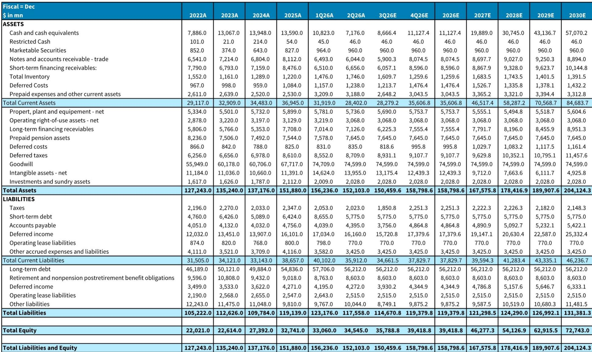
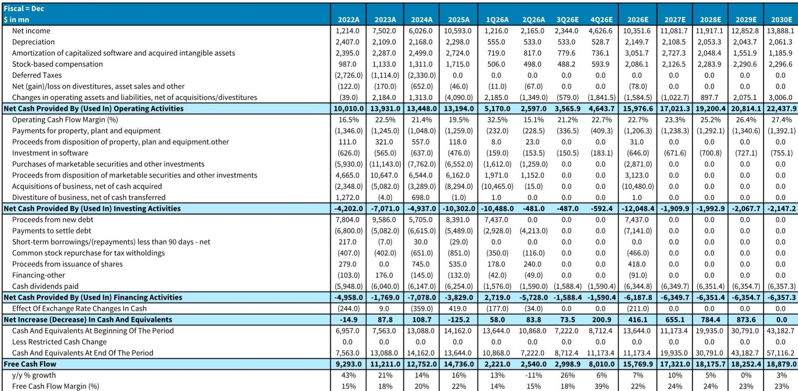
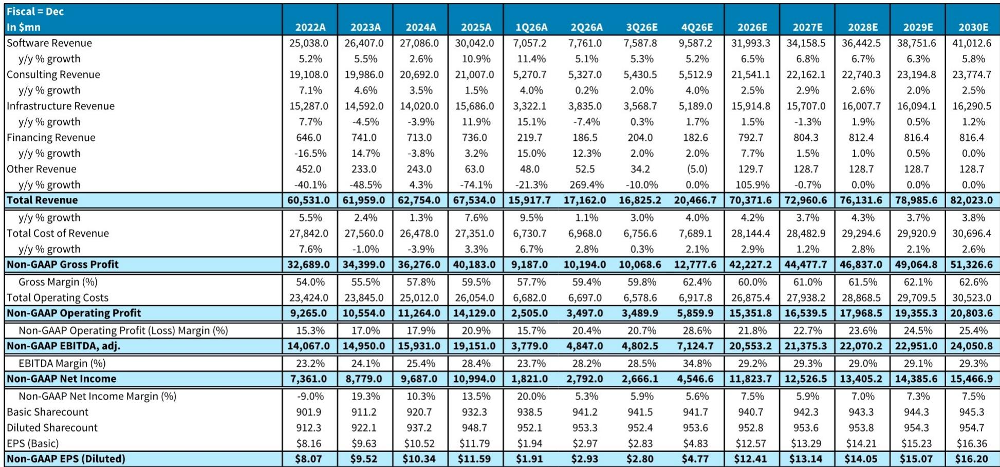

# IBM第二季度表现观察：需求未消失，但资金配置信号值得关注

IBM公布的2026年第二季度收入为172亿美元，低于市场一致预期约3%，按固定汇率计算同比仅增长1%，而此前预期为3%。差距主要集中在软件板块，该板块按固定汇率计算的增速从第一季度的8%放缓至5%；交易处理业务按固定汇率下降9%，而市场一致预期为下降2.6%。管理层立即将全年收入指引从5%增长下调至4-5%，并将软件板块指引从10%以上下调至6-8%。对于关注IBM研究框架的人而言，这些数字看起来像是一个预警。但潜在的模式——管理层确认是需求延迟而非需求消失，且第三季度初部分交易已落地的现象提供了部分验证——表明故事更为复杂。真正的问题不在于IBM下半年是否会恢复，而在于恢复是否已被定价，以及导致延迟的资金配置决策是否会持续。

IBM第二季度的核心矛盾并非周期性的，而是结构性的。客户正将资本支出转向AI基础设施、存储和内存——这些领域IBM的分布式基础设施业务录得37%的增长，创下历史较强季度。这并非对IBM软件价值主张的否定，而是企业技术堆栈中近期支出优先级的重新排序。IBM的交易软件收入（约占总额20%）承受了这种再分配的全部冲击。经常性收入基础（目前约占业务的80%）继续实现约8%的年化经常性收入增长。这一区别至关重要。大型企业许可协议转化的一次性延迟与竞争地位的丧失不是同一回事。但它确实暴露了一个脆弱点：IBM下半年的上行空间取决于客户行为的常态化，而管理层自身也将其描述为不可控变量。

## 第二季度差距集中在交易软件而非经常性基础，确认问题是时间节点而非竞争损失

收入低于预期并非均匀分布。软件总收入77.6亿美元，低于市场一致预期约2.4亿美元，最大缺口在交易处理业务，按固定汇率计算下降9%，而市场一致预期为下降2.6%。自动化软件按固定汇率仅增长3%，而一致预期为8.5%。数据软件按固定汇率增长18%，也低于20%的一致预期。这些并非IBM在向超大规模云或SaaS原生竞争者丢失份额的领域，而是企业客户在优先考虑AI基础设施采购时，延迟签署大型许可协议的领域。管理层确认，约三分之一延迟的企业交易已在第三季度初几周内完成，这提供了实质证据表明需求仍然存在。经常性收入基础（包括Red Hat混合云平台和IBM更广泛的订阅组合）继续以约8%的ARR增长表现。交易收入与经常性收入之间的区别并非技术性会计细节，而是临时管道扰动与业务模式根本性恶化之间的差异。

## 基础设施板块的强势揭示出资金配置的转向可能持续，对软件加速形成上限

IBM的分布式基础设施板块同比增长37%，为史上较强季度。这正是导致软件缺口同一客户行为的直接受益方。企业正在购买服务器、存储和网络设备以支持AI工作负载，IBM的Power系统和存储产品正在捕捉这一需求。基础设施指引从全年低个位数下降调整为低个位数增长，反映了管理层对这一趋势将持续的信心。软件逻辑面临的问题在于，基础设施与软件正争夺同一资本预算。如果客户在下半年继续优先考虑硬件支出，软件ELA的管道转化率可能仍低于历史水平。管理层明确承认这一点，称FY26指引假设管道转化率低于历史水平。其含义清晰：即使需求未被破坏，恢复速度也受到基础设施支出周期持续时间的制约。不应简单假设下半年软件会自动加速。这取决于企业客户是否会在AI基础设施部署达到饱和点后，将支出转向软件许可。这种转向可能发生，但不能保证在一个季度内出现。

## 自由现金流指引在收入下调后仍维持，说明生产力才是实际盈利驱动因素，而非收入增长

IBM在收入指引下调约100个基点后，仍维持FY26自由现金流增长约10亿美元的预期，并指引运营税前利润率扩张100个基点。这是本次报告中最关键的信号。它意味着管理层相信生产力举措可以完全抵消收入端的逆风。公司目前在生产力议程上进展领先，库存正常化预计将在下半年成为助力。对于市场参与者而言，这改变了研究框架的重心。上行空间不再主要取决于收入加速，而是利润率扩张和现金流产生。基于FY26维持的157亿美元目标，当前报价隐含的自由现金流回报表现约为8.1%。这是一个可信的估值下限。但这也意味着当前水平的上行空间要么取决于快于预期的收入恢复，要么取决于持续的利润率超预期表现。收入恢复存在不确定性；利润率超预期更可控但有上限。两者的组合表明，如果下半年软件恢复不及预期，IBM的风险回报不对称地偏向下行。

## 市场参与者的决策框架应权衡下半年常态化的概率与资金持续再分配的风险

对于在约当前报价水平评估IBM的市场参与者，核心变量是软件管道恢复的速度。乐观情形基于三个假设：第三季度初关闭的部分延迟交易是剩余交易的领先指标；随着客户完成初始AI部署，基础设施支出将在下半年趋于温和；即使收入处于指引下限，IBM的生产力举措仍将继续扩大利润率。悲观情形基于另一组假设：随着企业继续建设AI能力，基础设施支出直到年底仍保持高位；剩余的延迟ELA进一步滑入2027年；经HashiCorp和Confluent收购调整后，第二季度有机软件增长率约0%，未能重新加速。第二季度的证据不支持任何一种极端。第三季度初的交易关闭是积极信号；0%的有机软件增长是消极信号。最审慎的框架是给下半年常态化赋予中等概率（这将支撑当前估值），并给持续延迟赋予不可忽视的概率（这将要求进一步估值调整）。维持的自由现金流指引提供了缓冲，但并未消除执行风险。

## 来自z17和Red Hat的产品周期顺风确实存在，但部分被客户支出模式变化所抵消

IBM正处于z17大型机周期的早期阶段，历史上这一周期会为基础设施和软件收入带来多个季度的提振。Red Hat的混合云平台继续以11%的固定汇率增长，表明核心战略平台仍具竞争力。这些是真正的结构性积极因素，不依赖于交易软件行为的常态化。尤其是z17周期，其节奏可预测，通常为IBM带来四至六个季度的收益。风险在于，导致第二季度软件缺失的基础设施支出转向，也可能抑制通常伴随大型机周期的软件附加率。如果客户购买了硬件但延迟了相关软件许可，那么z17的收入提升将集中在基础设施板块，而非流入利润更高的软件板块。这将压缩整个周期的利润率收益。管理层维持利润率扩张指引的决定表明，他们相信这种情况不会出现。但第二季度的数据并未完全支持这种信心。市场参与者应监控下半年z17部署中的软件附加率，作为该周期是否实现全部潜力的实时指标。

## 当前估值已经折扣了一个保守结果

基于下调后的FY26收入预估和估值倍数从CY27的18倍EV/UFCF降至16倍，估值压缩既反映了较低的增长轨迹，也反映了企业软件同行群体的广泛估值调整。远期PE为16.6倍，远期EV/EBITDA为11.8倍，IBM的交易水平低于其历史均值以及更广泛的软件板块。问题在于这一折扣是否足以补偿执行风险。答案取决于市场参与者的时间视野。在12个月的时间范围内，下半年恢复的故事要么实现要么失败，报价将相应调整。在三年范围内，产品周期顺风、经常性收入基础以及生产力议程提供了更可预测的收益轨迹。当前估值似乎并未定价一场灾难性结果，但也未定价快速加速。它定价的是一种缓慢、稳定的恢复伴随适度利润率扩张。这是合理的基准情形。上行情形要求软件管道常态化速度快于管理层谨慎指引的假设。

## IBM第二季度报告并未推翻研究框架，但缩小了结果范围并提高了判断错误的成本

持有IBM的根本理由一直是其关键任务基础设施、混合云软件和咨询服务的组合，为适度增长和稳定利润率扩张提供了稳定基础，并带有量子计算和大型机周期的可选性。第二季度报告并未否定这一理由。经常性收入基础完好，自由现金流指引不变，产品周期仍处于早期阶段。报告所做的是降低了容错空间。下半年软件恢复现在是核心变量，且不完全在管理层控制范围内。能够接受这种不确定性、并相信第三季度初交易关闭是可靠信号的市场参与者，可能会认为当前估值具有吸引力。需要更多恢复时间可见性的市场参与者，或许更愿意等待第三季度结果的进一步证据。报价尚未低到成为价值陷阱，但也未低到可以忽略风险。它为一种特定结果——下半年常态化——定价，而该结果并不确定。

*仅供参考。部分内容可能基于源材料通过AI辅助生成、翻译、摘要或编辑，可能存在疏漏或错误。请独立核实。本文不构成专业建议（包括但不限于法律、税务、会计或其他专业层面）。*
