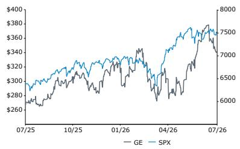

# Global Aerospace & Defense

## GE Aerospace

**观察类别**：表现优于比较基准  
**目标参考价格**：GE  
421.00 USD （原405.00 USD）

*（分析师信息已删除）*

*（分析师信息已删除）*

*（分析师信息已删除）*

**专业销售**

*（销售联系人信息已删除）*

## GE Aerospace: 持续增长；Q2再超预期——但本次同时上调指引，且范堡罗航展表现积极

GE Aerospace于7月16日公布的Q2数据超出市场一致预期及我们的预测。与Q1不同，本次公司上调了年度指引，反映对前景的信心增强。尽管伊朗局势及对燃料价格的影响仍存在不确定性，但各方（包括我们）的假设认为燃料价格的最差时期可能已过去。宏观环境保持稳健，这是最重要的因素。公司预计CFM56在2026和2027年的进厂维修次数将达到2300–2400次区间的上沿，这一指引是积极的。我们预计CFM56进厂维修次数将在2030年前保持该水平。

GE报价在财报后有所回落，我们认为这与市场对"完美季度"的预期有关（实际上财报大致符合完美预期）。有观点认为服务订单较Q1有所下降，但我们认为这不构成问题——订单同比增长22%，且各平台的进厂维修排期已处于积压状态。范堡罗航展对GE有利，包括IndiGo下达的1000台发动机订单。

在商用发动机与服务（CES）板块，我们上调了宽体机服务的预测，主要基于更高的进厂维修次数、GE90更重的工单、GEnx更高的内容及定价改善。窄体机方面，我们预计2021年后签署的LEAP合同（转向按工时与材料计费）将在2028/2029年之后逐步贡献收入。对于CES原设备（OE），我们上调了后续年份的LEAP交付预测，因为波音提高737 MAX产量。国防与推进技术（DP&T）应受益于防务后市场活动及持续升级的开支。

## 研究观点

我们维持GE的"表现优于比较基准"观察，并将目标参考价格从405美元上调至421美元。这一调整源于对CES和DPT增长前景更乐观的判断。

（表格已保留但列标题已修正为中性表达）

| 调整后每股回报 | F25A | F26E | F27E |
|---|---|---|---|
| GE (USD) | 6.37 | 7.83 | 9.16 |
| 原值 | -- | 7.59 | 8.82 |

| 截止日期 | 22 Jul 2026 |
|---|---|
| GE收盘价 (USD) | 341.19 |
| 目标参考价 (USD) | 421.00 |
| 潜在空间 | 23% |
| 52周区间 | 382.97/254.66 |
| SPX | 7,498.96 |
| 财年结束 | 12月 |
| 分红回报率 | 0.6% |
| 市值 (USD) (M) | 354,006 |
| 企业价值 (USD) (M) | 401,955 |

| 财务数据 | F25A | F26E | F27E | 复合年均增长率 |
|---|---|---|---|---|
| 收入 (M) | 45,855 | 53,145 | 58,872 | 13.3% |
| 自由现金流 (M) | 7,302 | 8,687 | 9,990 | -- |
| 报告每股回报 | 8.07 | 8.64 | 10.43 | -- |

| 回报表现 | 年初至今 | 1个月 | 6个月 | 12个月 |
|---|---|---|---|---|
| 相对 (%) | 10.8 | (3.9) | 15.7 | 31.7 |
| SPX (%) | 9.5 | 0.4 | 8.5 | 18.8 |
| 相对 (%) | 1.2 | (4.3) | 7.2 | 12.9 |

数据来源：Bloomberg，Bernstein预测与分析。

价格表现，1年

| 估值指标 | F25A | F26E | F27E |
|---|---|---|---|
| 调整后估值倍数 (x) | 53.6 | 43.6 | 37.3 |
| 企业价值/EBITDA (x) | 39.2 | 33.3 | 28.8 |
| 企业价值/EBIT (x) | 39.8 | 37.3 | 31.1 |
| 自由现金流回报率 (%) | 2.00 | 2.43 | 2.83 |

## 详细分析

Q2中，GE收入与回报均超出市场预期。公司上调2026年指引，预计调整后收入增长在高双位数百分比（此前为较低双位数）。CES收入预计增长约20%，高于此前的中双位数指引。我们将2026年和2027年调整后每股回报预测从7.59美元和8.82美元上调至7.83美元和9.16美元，主要因CES（尤其是宽体机服务）和DP&T前景改善。

我们对宽体机服务收入的预测已上调，反映GE90和GEnx的贡献增加。预计GE90进厂维修次数在2030年前将持续增长。约70%的GE90机队尚未进行第二次更高价值的进厂维修，向更重工单的转变将支持后市场增长。对于GEnx项目，我们预计2025至2030年间服务收入将在中双位数区间增长，受更高的进厂维修量、工单内容增加及定价改善驱动。

对于CES原设备，我们上调了后续年份的LEAP交付预测，因波音提高737 MAX产量。我们假设产量在2028年Q2从每月52架增至57架，2029年Q2从57架增至62架，2030年Q2从62架增至65架。我们上调了后续年份的CES利润率，因预计GE9X亏损在2028年达到峰值后下降（随产量提升，单机亏损减少）。

防务业务积压订单强劲，增长前景稳健。该业务30%的收入来自国际市场。我们上调了DP&T的收入预测，预计业务将受益于防务后市场活动及持续升级的开支。

## Q2财报

2026年指引上调，调整后收入增长预计在高双位数百分比（此前为较低双位数）。对于CES板块，GE新的2026年收入增长为约+20%，高于此前的中双位数指引。主要差异来自服务，GE现在预计增长在20%出头，而此前预期为中双位数。这意味着商用服务收入增加约10亿美元。我们认为收入预期改善部分源于CFM56进厂维修前景更好及材料可用性提高。对于CES设备，收入预计增长+20%左右，高于此前的中高双位数指引。这意味着原设备收入增加2亿美元，同时年度LEAP交付指引也上调。对于DPT，收入预计增长在低双位数百分比，高于此前的中间至高个位数指引。

CFM56进厂维修次数预计今年将趋向2300至2400次区间的上沿。管理层指出，CFM56工单预计在2028和2029年保持稳定，收入增长来自更高的数量、定价改善及材料可用性提高。因此，每次进厂维修的收入增加，并非因工单范围扩大，而是因为公司现在能够完成之前因材料限制而无法进行的一些较重的维护工作。GE预计CFM56进厂维修次数在2028年前保持在2300–2400次区间，此后略有下降。我们预计CFM56进厂维修次数将比GE指引略高且持续时间更长。我们认为备件和MRO维修工位产能是限制因素，使GE的预测低于需求水平。

宽体发动机项目工单状况有利。对于GEnx，进厂维修工单预计将扩大，因结构从快速周转转向更高价值的性能恢复维修。对于GE90，约70%的机队尚未进行第二次进厂维修。随着这些工单范围显著大于第一次的第二次进厂维修开始流入，应能支持持续的后市场收入增长。

CES应在2028年及以后看到利润率扩张。公司预计CES利润率将改善，因LEAP后市场利润率接近板块平均水平，且GE9X亏损（预计2028年达到峰值）此后开始下降。GE9X亏损今年预计弹性较高（因出货量弹性较高），对CES原设备利润率构成压力。这些亏损失在下半年（尤其是Q4）更为明显，因为交付仍集中在下半年。

LEAP交付展望——2026年，GE指引LEAP交付量同比增长高双位数百分比，高于此前15%的指引。这意味着下半年LEAP交付量在1096至1130台间。这一展望得到波音和空客计划提高737 MAX和A320neo产量的支持。空客目标到2027年底将A320系列月产量提高至70至75架。波音预计在2026年夏季前将月产量提高至47架。LEAP相关的AOG因现场备用发动机可用性改善及维修周期缩短而减少。虽然备用发动机比率在下降，但备用发动机交付量随装机发动机出货量增长而持续增长。在LEAP项目全生命周期内，公司预计备用发动机比率将在低双位数（10%至12%）。

2027年展望——在5月的SDC会议上，GE提到预计2027年CES服务收入将增长双位数。这在Q2电话会上得到重申。各主要项目的进厂维修已积压12-18个月。第三季度已下架及计划拆卸的发动机数量超过公司全年进厂维修指引的40%以上，从而降低了2026年前景的不确定性。

LEAP-1B耐久性套件——GE完成LEAP-1B耐久性套件认证，包括升级的HPT叶片。该套件预计可将翼上时间提高两倍，全面MRO和新机制造切换预计在2027年初完成。公司已为超过40%的LEAP-1A装机提供该耐久性套件。改装LEAP-1A和LEAP-1B机队是一项多年努力，管理层预计在2030年代初之前不会完全改装完毕。

CES服务订单——我们听到对订单接收量（作为后市场需求指标）在Q2放缓（同比增长+22%）的担忧。但订单可能波动，而Q1'26增长+49%，且GE有大量积压订单需要交付。我们的理解是，各平台的进厂维修在18个月内已基本售罄。我们很少看到在该时间框架之外出现新的MRO工位订单。

图表1：报告结果 vs Bernstein、市场共识及指引

（详细表格已保留，列标题已中性化处理）

数据来源：公司报告，Bernstein分析及预测

## 板块业绩

GE报告非GAAP每股回报为2.02美元，高于共识预期1.86美元。调整后收入126亿美元，高于共识预期的119亿美元。板块层面，CES收入97.3亿美元，高于共识91.6亿美元。板块利润26.6亿美元，高于共识24.7亿美元。DPT收入34.4亿美元，高于共识32.0亿美元，板块利润4.75亿美元，高于共识3.95亿美元。

CES内部，服务增长+26%，其中内部进厂维修收入增长25%，备件收入增长超25%。CES设备收入增长30%，受单位销量增长26%（LEAP增长24%）推动。LEAP交付同比增长24%（约510台），使得年初至今LEAP交付达到1,030台。但CES利润率收缩160个基点至27.3%（仍高于我们27.1%的预测），因装机发动机增长（包括GE9X）、投资及通胀。GE9X项目相关的现金流出预计2026年约为10亿美元，用于覆盖运营成本和资本支出。

## DPT

Q2收入为34.4亿美元，高于我们31.7亿美元的预测。防务与系统收入增长12%，服务和设备均有增长，交付量增长7%。推进与先进技术收入增长23%，受Avio Aero强劲增长推动。利润4.75亿美元，同比增长18%，利润率提高30个基点，得益于更高的销量和价格，部分被结构变化、投资和通胀抵消。防务在Q2的订单出货比为1.0倍，2026年上半年为1.7倍。

此外，GE获得美国空军合同，推进GE426发动机通过初步设计评审，以支持其中推力级自主协作平台。

*（后续附录与财务预测表格已按相同原则处理，此处略）*

数据来源：公司报告，Bernstein预测与分析
