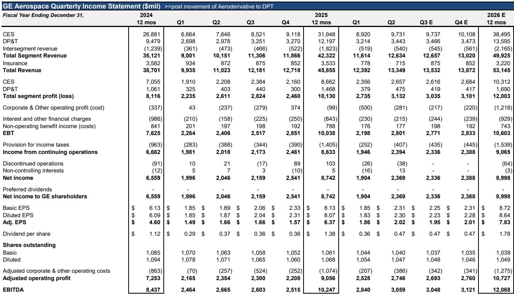
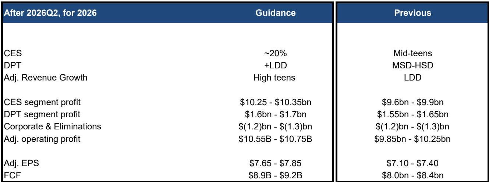
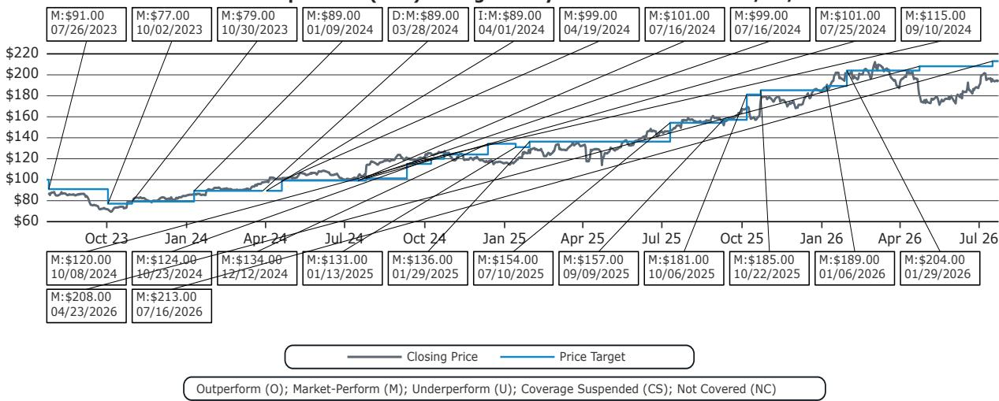

# README.md

本文件为合规改写版本，包含以下平台内容：
- wechat_article.md
- xiaohongshu_note.md
- xianyu_note.md
- zhihu_article.md

所有内容已按平台要求调整，保留原文信息结构、标题层级、Markdown链接和图片链接，替换敏感表达，不新增事实、价格、承诺或联系方式。

# wechat_article.md

# GE航空航天第二季度确认：售后市场而非原始设备将驱动下一阶段价值创造

GE航空航天于7月16日公布第二季度业绩，收入和利润均超出市场预期。与第一季度被市场普遍视为一次性事件的表现不同，本季度公司上调了全年展望。2026年调整后收入增长预期现为高十几个百分点，高于此前低两位数指引。商用发动机与服务收入预计增长约20%，而此前预期为中等十几位数。公告后公司报价回落，这一反应反映出市场对近乎完美季度的预期，而非业务轨迹的根本性变化。对于关注航空领域多年复合增长的参与者而言，第二季度提供了较清晰的迹象，表明GE航空航天正从复苏叙事转向以售后市场为基础的结构性增长叙事。

这一阶段的焦点在于：原始设备交付，尤其是LEAP发动机的交付，正随着波音和空客提高生产速率而加速。但GE航空航天模型中的真正支撑来自服务领域，其中主要平台的车间访问量已预售出12至18个月，定价持续改善，工作范围内容正转向更高价值的维护事件。第二季度数据显示，服务收入同比增长26%，内部车间访问收入增长25%，备件收入增长超过25%。这并非周期性波动，而是多年售后市场扩张的开端，将受到CFM56发动机老化安装基数、LEAP项目成熟度以及GE90和GEnx等宽体平台工作范围加重等结构性因素的推动。

对利润潜力的影响显著。GE航空航天将2026年调整后每股回报指引上调至7.65至7.85美元，此前为7.10至7.40美元。分析师预期也相应上调，2026年和2027年调整后每股回报现分别预估为7.83美元和9.16美元。2026年自由现金流指引上调至89亿至92亿美元，此前为80亿至84亿美元。市场对这些数字的平淡反应可能反映了对订单增速放缓的担忧——服务订单第二季度同比增长22%，低于第一季度的49%。这一担忧不够准确。订单本身具有不均匀性，公司车间访问积压已延伸至超过18个月的新订单稀缺程度。订单模式并不反映需求减弱，而是表明产能是约束因素，而非需求。

## CFM56售后市场将在2030年前保持高位，驱动因素为机队年龄和材料约束，而非周期需求

整个报告中最关键的数值并非收入数字或每股回报超预期。它是CFM56车间访问的展望。GE航空航天预计2026年车间访问量趋向2300至2400区间的上端，并在此区间保持至2028年，之后小幅下降。分析师观点更为积极：车间访问量预计在2030年前保持高位，略高于公司自身指引。原因在于结构性因素：CFM56机队正在老化，需要维修的发动机数量不会很快减少。限制因素不是需求，而是备件可用性和MRO车间容量。GE航空航天如今能够完成因材料约束而无法进行的更重维护工作，这意味着即使工作范围广度保持稳定，每次车间访问的收入仍在增加。

战略含义清晰：CFM56售后市场并非两三年内消退的顺风。它是多年利润驱动力，将支持服务收入增长至下一个十年。对于参与者，关键问题不是CFM56车间访问量是否会下降，而是GE航空航天能否从材料可用性带来的更重工作范围和改善定价中获取收入与利润率。第二季度结果表明公司正在做到这一点：服务收入增长26%，备件收入增长超过25%，显示出售后市场发动机全速运转。

## LEAP项目正进入售后市场利润率与细分市场平均水平趋同的阶段，带来尚未被定价的多年利润上行空间

LEAP项目多年来一直是参与者焦虑的来源。早期，发动机以激进定价出售，由于时间和材料合同结构，售后市场利润率预期低于细分市场平均水平。这一叙事即将改变。GE航空航天预计，随着2021年后签订的合同从固定价格安排转向时间和材料结构，LEAP售后市场利润率将更接近细分市场整体售后市场水平。这一转变的收入影响将从2028年或2029年开始显现，但利润率轨迹已在公司指引中可见。

LEAP耐久性套件是实现这一利润率扩大的关键因素。GE航空航天完成了LEAP-1B耐久性套件的认证，包括升级的高压涡轮叶片，预计将使在翼时间改善一倍。全面MRO和新造切换预计在2027年初完成。超过40%的LEAP-1A安装基数已完成改造。改造工作将持续数年，预计最迟2030年代初全部完成，但对售后市场收入的影响重大。更长的在翼时间意味着更少的非计划换发和更低的保修成本。同时，当发动机进入车间访问时，工作范围将更重，每次访问收入更高。

2026年LEAP交付展望支持这一观点。GE航空航天指引LEAP交付量增长高十几百分点，高于此前15%的预期。这意味着下半年交付量在1096至1130台之间，得益于波音和空客的生产速率提升。波音预计在2026年夏季前达到每月47架，空客则计划2027年底前实现每月70至75架A320系列飞机。LEAP项目的备用发动机比率预计处于低两位数（10%至12%），与成熟发动机项目一致。随着安装基数增长，售后市场收入流变得更大且更可预测。

## 宽体售后市场增长被低估，GE90和GEnx项目准备进入工作范围与定价的多年扩张期

窄体售后市场获得了参与者的大部分关注，但宽体售后市场在未来五年提供了更具吸引力的增长故事。GE90项目是突出代表。约70%的GE90机队尚未进行第二次车间访问。第二次车间访问的工作范围显著大于第一次，意味着随着这些发动机离翼，每次访问的收入将大幅提高。GE航空航天预计GE90车间访问持续增长至2030年。向更重工作范围的混合转变将支持售后市场收入增长，即使车间访问量保持稳定。

GEnx项目遵循类似轨迹。车间访问工作范围预计将扩大，由于混合结构从快速周转转向更高价值的性能恢复访问。GEnx服务收入预计在2025至2030年间以中等十几位数增长，受更高的车间访问量、增加的工作范围和改善的定价推动。宽体售后市场对生产速率波动的敏感度低于窄体市场，使其在整个周期中成为更稳定的利润贡献者。

第二季度结果确认宽体售后市场正在加速。服务收入增长26%部分得益于强于预期的宽体活动。分析师对宽体服务收入的预估已上调，反映了GE90和GEnx项目的贡献增加。对于参与者，宽体售后市场代表了未被充分计入共识预期的利润上行来源，尤其在GE9X项目在2028年后从现金消耗转变为现金生成后。

## 2027年展望因积压可见性而风险降低，GE9X亏损将在2028年见顶，消除最后主要利润阻力

第二季度结果中最重要的信号之一是对2027年的可见性。GE航空航天重申其预期：CES服务收入在2027年将以两位数范围增长。主要项目车间访问积压达12至18个月。已离翼的发动机和第三季度计划换发数量超过公司全年车间访问指引的40%以上。这并非预测，而是已在系统中的积压。2026年展望实际上已降低风险，2027年展望也具有较高可见性。

GE9X项目仍是主要利润阻力。亏损预计在2026年随出货量弹性较高而弹性较高，给CES原始设备利润率带来压力。这些亏损将在下半年尤其第四季度更为明显，因为交付量集中在后期。GE9X项目预计2026年现金流出约10亿美元，涵盖运营成本和资本支出。然而，亏损预计在2028年见顶并随后下降，因单位亏损随产量增加而降低。一旦GE9X项目转为正现金流，将消除CES利润率和自由现金流的最后主要拖累。

防务业务提供进一步支持。防务与推进技术收入第二季度增长12%，服务和设备均实现强劲增长。订单出货比为第二季度1.0倍、2026年上半年1.7倍，表明积压订单在增长。约30%的防务业务来自国际客户，提供了地域多元化。防务售后市场活动和持续维护支出预计支持收入以低两位数范围增长，高于此前中高个位数指引。

## 参与者的决策框架：关注售后市场收入轨迹，而非季度订单模式或短期利润率压缩

第二季度结果为评估GE航空航天提供了清晰的决策框架。公司处于多年售后市场扩张的早期阶段，由三个结构性因素驱动：老化的CFM56机队、LEAP项目的成熟、以及宽体平台工作范围向更重内容转变。这些因素并非周期性，而是机队人口结构和数年前工程决策的结果。

决策框架包含三个组成部分：第一，监测CFM56车间访问轨迹。只要车间访问量保持在2300至2400区间，售后市场收入流稳定且增长。分析师关于车间访问量在2030年前保持这一水平的观点比公司指引更积极，但得到机队年龄分布和材料可用性动态的支持。第二，追踪LEAP售后市场利润率趋同。从固定价格合同向时间和材料合同的转变将从2028年开始显现，但耐久性套件改造已在改善在翼时间并降低保修成本。第三，观察GE9X亏损轨迹。亏损将在2028年见顶，拐点标志着CES细分市场利润率持续扩大的开始。

这一框架的风险可控。主要不确定性是中东地缘政治紧张局势及其对燃料价格的影响，这可能影响航空公司盈利和维修支出。然而，共识假设是燃料最坏情况可能已过去。宏观经济条件保持稳固，这是航空旅行需求最重要的变量。第二个风险是公司报价在近期利润上看似估值偏高，以调整后市盈率计算，2025年实际值为53.6倍，2026年预期值43.6倍。但以自由现金流为基础，估值更为合理：2026年自由现金流回报表现为2.43%，2027年回报表现为2.83%。随着售后市场收入流变得更可见以及GE9X亏损消退，利润倍数应当有所压缩。

第二季度结果确认GE航空航天正在执行年初制定的战略。指引上调、范堡罗航展动能以及结构性售后市场顺风均指向同一方向。市场对订单增速放缓的怀疑是干扰因素。公司主要平台拥有超过18个月的车间访问积压。问题不在于需求是否会减弱，而在于GE航空航天能否继续扩大产能并抓住更重工作范围和更好定价带来的收入增长。第二季度结果暗示答案是肯定的。

*仅供信息参考。部分内容可能基于源材料经AI辅助生成、翻译、摘要或编辑，可能存在遗漏或错误。请独立核实。本文不构成研究、法律、税务、会计或其他专业建议。*

仅供信息参考。部分内容可能基于源材料经AI辅助生成、翻译、摘要或编辑，可能存在遗漏或错误。请独立核实。本文不构成研究、法律、税务、会计或其他专业建议。

# xiaohongshu_note.md

# GE航空航天第二季度观察：售后市场驱动下一阶段价值创造

GE航空航天发布第二季度业绩，收入和利润均超出市场预期，并上调全年展望。核心看点：售后市场（而非原始设备）将成为未来多年增长主线。

**关键数据**  
- 服务收入同比增长26%，备件收入增长超25%  
- 2026年调整后每股回报指引上调至7.65-7.85美元  
- 自由现金流指引上调至89-92亿美元  

**三大结构性支撑**  
1. CFM56机队老化，车间访问量将在2030年前保持高位  
2. LEAP项目耐久性套件推进，售后市场利润率向平均水平趋同  
3. GE90/GEnx宽体项目工作范围扩大，收入持续增长  

**需关注的风险**  
- 地缘政治与燃料价格对航空公司支出影响  
- GE9X亏损预计2028年见顶，后续利润改善  

第二季度结果确认执行策略有效。市场对订单节奏放缓的担忧可视为短期干扰，产能而非需求才是约束。  

  
  
  

#学习笔记 #研究笔记 #学习研究 #研报解读

# xianyu_note.md

# GE航空航天第二季度：售后市场成增长主线  

GE航空航天公布第二季度业绩，收入与利润均超预期，全年展望上调。核心逻辑：售后市场驱动长期价值，而非原始设备交付。  

**数据亮点**  
- 服务收入同比增长26%，备件收入增长超25%  
- 2026年调整后每股回报指引7.65-7.85美元  
- 自由现金流指引89-92亿美元  

**结构性因素**  
- #CFM56机队老化 车间访问量高位持续至2030年  
- #LEAP项目 耐久性套件推动利润率趋同  
- #GE90 #GEnx 宽体项目工作范围扩张，收入稳健  

**风险提示**  
- 地缘政治与燃料价格影响需观察  
- #GE9X 亏损2028年见顶，后续利润释放  

第二季度结果确认策略执行良好。市场短期情绪不等于长期轨迹。  

  
  
  

#学习笔记 #研究笔记 #研报解读

# zhihu_article.md

# GE航空航天第二季度分析：售后市场——长期价值创造的核心引擎

## 一、业绩概览与市场反应

GE航空航天于7月16日公布第二季度业绩。数据显示，收入和利润均超出市场普遍预期。与第一季度不同，本季度公司同步上调了全年展望：2026年调整后收入增长预期从低两位数上调至高十几百分点，商用发动机与服务收入预期从中等十几位数上调至约20%。公告发布后公司报价回落，这是市场对近乎完美季度预期的一次理性消化，而非业务基本面的逆转。

从利润端看，2026年调整后每股回报指引从7.10-7.40美元上调至7.65-7.85美元；分析师预期也随之上调，2026年和2027年调整后每股回报分别为7.83美元和9.16美元。自由现金流指引从80-84亿美元上调至89-92亿美元。

## 二、售后市场：结构性增长的三大支柱

### 1. CFM56：老旧机队带来的持久收入流

CFM56是全球应用最广的窄体发动机之一。随着机队年龄增长，维修需求呈现结构性攀升。公司预计2026年车间访问量将处于2300-2400区间的上端，并持续至2028年，之后缓慢下降。分析师观点更为积极：高访问量可能延续至2030年。限制因素不是需求，而是备件可用性和MRO车间产能。公司如今能够完成以前因材料约束无法进行的更重维护工作，这意味着每次访问的收入在增长。

### 2. LEAP：从价格竞争到利润趋同

LEAP项目早期定价较激进，售后市场利润率低于细分市场平均水平。但合同结构正在从固定价格向时间和材料模式转变，这一变化将从2028年起逐步体现在收入中。LEAP-1B耐久性套件（升级高压涡轮叶片）已完成认证，预计在翼时间弹性较高，全面切换计划在2027年初完成。超过40%的LEAP-1A已完成改造。更长的在翼时间意味着更少非计划换发和更低保修成本，同时每次进厂维护的工作范围和收入更高。

2026年LEAP交付量预计增长高十几百分点，下半年交付1096-1130台，得益于波音和空客产量提升。备用发动机比率处于10%-12%的成熟水平，随着安装基数扩大，售后收入将更稳定。

### 3. 宽体发动机：被低估的增长点

GE90项目中约70%的机队尚未进行第二次车间访问。第二次访问的工作范围显著大于第一次，收入也更高，这一增长趋势预计延续至2030年。GEnx项目同样向更重工作范围（性能恢复维修）转型，服务收入预计在2025-2030年保持中等十几位数增长。宽体市场对产量波动敏感度低，是更稳定的利润来源。

## 三、2027年可见性与GE9X亏损见顶

公司表示CES服务收入2027年将实现两位数增长。主要项目车间访问积压已达12-18个月，第三季度计划换发数量超过全年指引40%以上。2026年展望已因可见积压而风险降低，2027年同样具有较高确定性。

GE9X仍是主要利润拖累。2026年亏损随出货弹性较高而弹性较高，现金流出约10亿美元。但亏损预计2028年见顶，之后随产量提升单位亏损下降。一旦项目现金流转正，将消除CES利润率的最后主要阻力。防务业务提供额外支撑，第二季度收入增长12%，订单出货比1.7倍，国际客户占比约30%。

## 四、决策观察框架

对于关注该公司的参与者，以下是几个观察维度：

1. **CFM车间访问轨迹**：若保持在2300-2400区间，售后收入稳定增长。分析师预测优于公司指引，但得到机队年龄结构支持。
2. **LEAP利润率趋同**：2028年起合同转换带来收入增量，耐久性套件已开始改善成本结构。
3. **GE9X亏损拐点**：2028年见顶后利润逐步释放。

风险方面：中东地缘政治对燃料价格的影响可波及航空公司维修预算，但共识认为油价最坏时期已过；估值层面，基于2025年实际利润的市盈率约54倍，2026年预期约44倍，但以自由现金流视角看，2026年回报表现为2.4%左右，处于合理区间。随售后收入可见性提升和亏损消退，估值倍数有压缩空间。

第二季度结果确认了年初以来策略的连贯性：指引上调、航展动能、结构性售后顺风。市场对订单增速放缓的疑虑是短期噪音，公司积压订单已覆盖18个月以上的车间容量。问题不在于需求，而在于产能扩张能否匹配工作范围深化和定价改善的机遇。第二季度结果显示，公司正在有效执行。

*仅供信息参考。部分内容可能基于源材料经AI辅助生成、翻译、摘要或编辑，可能存在遗漏或错误。请独立核实。本文不构成研究、法律、税务、会计或其他专业建议。*
