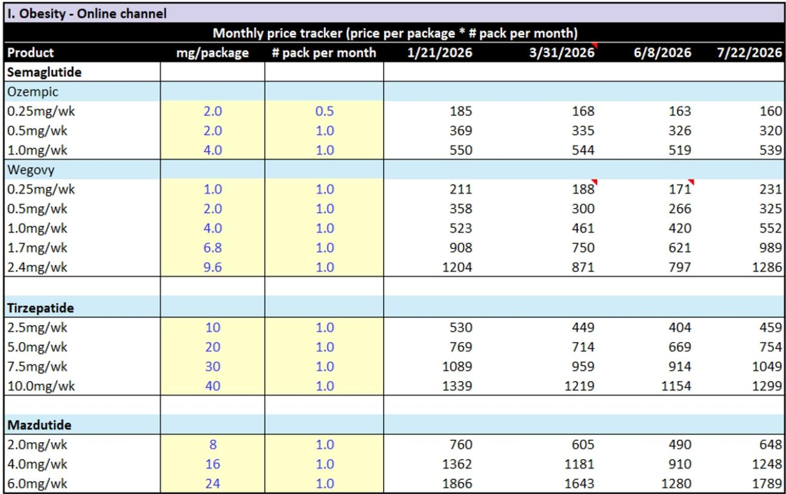
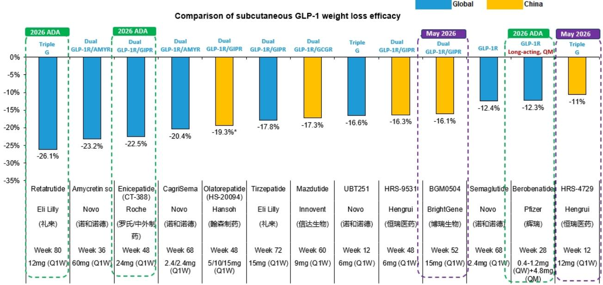
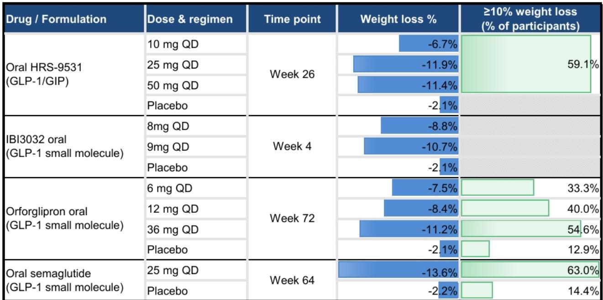

# Bernstein：GLP-1市场进入代谢获益与便利性竞争新阶段

肥胖药物市场正在进入一个竞争维度显著扩展的阶段。Bernstein在一份面向亚洲生物医药读者的专题报告中指出，虽然减重疗效仍是核心指标，但下一代疗法的差异化已转向更广泛的代谢获益、肌肉保留和给药便利性。报告认为，未来市场中表现突出的候选药物不仅需要实现超过20%的安慰剂调整减重幅度，还需在心血管、肾脏、肝脏和身体成分改善方面提供可验证的临床证据。

口服GLP-1药物和长效疗法正在拓宽治疗工具箱。礼来的orforglipron和诺和诺德的口服司美格鲁肽已证明口服疗法可实现约10%的减重效果，这对相当一部分患者可能已经足够。信达生物的IBI3032在仅四周内即实现8.6%的安慰剂调整减重，而周制剂口服候选药物IBI3042则体现了行业在降低给药频率方面的整体努力。

> **KC评论：** 口服GLP-1的竞争不仅在于减重幅度，更在于给药便利性。orforglipron作为小分子药物，避免了口服司美格鲁肽严格的空腹要求，这一差异可能在实际处方中转化为显著的依从性优势。

## 1. 下一代注射疗法将减重基准从10%推升至20%以上

仅几年前，市场还将超过10%的安慰剂调整减重视为重要突破，司美格鲁肽以约12.4%的水平树立了当时的标准。此后创新速度明显加快。替尔泊肽将安慰剂调整减重推至接近18%，而新一代候选药物——包括retatrutide、皮下amycretin、enicepatide（CT-388）和CagriSema——已在临床研究中实现超过20%的安慰剂调整减重。其中retatrutide在第80周达到约26.1%，皮下amycretin和enicepatide在第36至48周分别达到约23.2%和22.5%，CagriSema在第68周约为20.4%。

这些药物不仅在最终减重幅度上拉开差距，其减重轨迹也显示，部分候选药物在治疗16至24周时即实现两位数减重，并在此后持续扩大优势。从机制上看，这反映了行业从单一GLP-1靶点向多靶点策略的转变，包括GLP-1/GIP、GLP-1/amylin乃至三重激动机制。从商业角度而言，早期起效可能是一个重要优势：在治疗最初几周内即感受到明显减重的患者，更有可能认为治疗有效，从而提高依从性和长期治疗保留率。

## 2. 代谢获益正从减重附属效应变为独立竞争维度

肥胖、糖尿病、慢性肾病、心血管疾病和代谢功能障碍相关脂肪性肝炎（MASH）之间存在显著的患者重叠。约44%的慢性肾病患者同时患有肥胖，39%的肥胖患者患有代谢功能障碍相关脂肪性肝病（MAFLD）。GLP-1药物在治疗肥胖的同时，已在多项合并症中显示出临床获益。

司美格鲁肽目前拥有最广泛的证据基础，在心血管、肾脏疾病和MASH领域均已获得批准或阳性数据。替尔泊肽在MASH和阻塞性睡眠呼吸暂停（OSA）方面表现尤为突出。新一代药物则试图进一步扩大优势：mazdutide和retatrutide在肝脏脂肪含量方面实现了约81%和83%的安慰剂调整降幅，显著高于司美格鲁肽或替尔泊肽的报告数据。Retatrutide在OSA和骨关节炎方面也显示出初步疗效。

> **KC评论：** 代谢获益的临床证据正在改变GLP-1药物的市场定位。如果后续III期结果证实这些药物在心血管和肾脏保护方面的优势，其目标患者群体将从单纯寻求减重的人群扩展至整个代谢综合征相关患者群体，市场空间可能进一步扩展。

## 3. 中国GLP-1市场展望

尽管面临定价不确定性和针对肥胖药物处方的监管环境，Bernstein仍维持对中国GLP-1市场未来规模的关注。该机构调整了市场假设：下调长期定价预期，但上调渗透率和可治疗人群范围。报告认为，2027年开始的一波主要产品上市将进一步扩大患者可及性并加速市场渗透。

在竞争格局方面，信达生物、恒瑞医药、翰森制药、科伦博泰和百济神州被Bernstein给予关注评级。报告特别指出，信达生物的IBI3032在口服GLP-1领域展现出竞争力，而该公司在抗体-多肽偶联物（APC）和circRNA等下一代平台上的布局也值得关注。

## 4. 新兴给药技术平台正在探索月度甚至单次给药方案

抗体-多肽偶联物、circRNA疗法和基因疗法正在被开发以实现月度给药或单次给药后的长期代谢控制。安进的MariTide目前提供了最先进的概念验证数据，而信达生物和PegBio等中国创新企业也在积极布局这些下一代平台。

报告认为，GLP-1市场的下一阶段发展将由疗效、代谢获益、身体成分改善、便利性和可负担性共同驱动，而非任何单一属性。评估候选药物时需要考虑的维度已从单纯的减重幅度扩展到包括起效速度、合并症获益、给药频率和长期安全性在内的综合框架。

For informational purposes only. Portions may be generated,translated,summarized,or edited with AI assistance based on source materials and may contain omissions or errors. Please verify independently. This is not investment,legal,tax,accounting,or other professional advice.

