# US Communications Infrastructure

## Digital Realty (DLR) 2Q26 观察：成长路径清晰，但需要持续投入

DLR 季度运营表现稳健，多线策略执行到位，核心运营指标超出预期约 6%。但需要注意，7月1日作为Blackstone收购交易一部分发行的1200万股，实质上抵消了2026年的大部分增值预期。来自相关资产的1.88亿美元净收益（每股影响约0.50美元）缓解了部分影响。该项收益虽不可持续，但体现了DLR长期策略的可行性。

**超大规模业务**：DLR >1MW业务单独来看表现中规中矩，主要由于Q1基数较高（Charlotte项目——公司史上最大租约）以及7月两项大型签约的时间因素（总金额4.1亿美元，DLR份额2.05亿美元——将计入Q3）。该板块续租利差表现突出，现金基础超过66%（GAAP基础92%——幅度较大但属个案）；积压订单增至14亿美元。

**企业业务**：我们关注DLR成长轨迹中的亮点——0-1MW板块再创季度新高，达到1.08亿美元（公司首次突破1亿美元），其中互联业务贡献约19%。各地区定价持续坚挺，客户流失率维持在低位。

**开发业务**：在Q1较强开发管线基础上，公司新增约200MW在建项目，总在建规模达1.4GW。其中54%已预租（计入7月签约后约64%，另加约5%用于托管），回报率略高于历史水平（全年预计小幅下降）。可建设容量全球增加超2GW至8.5GW；当前在建项目大部分计划于2027年通电。亚特兰大设施尚未预租，但考虑到需求环境，我们认为并非投机建设。

**资产负债表与稀释**：DLR资产负债表保持健康，净债务/EBITDA维持在4.7倍，但得益于公司积极使用权益工具：股份数量增至3.732亿单位（较4Q25增约6%，同比增约8%）。开发资本开支指引也显著上调（2026年增加7.5亿美元），矛盾清晰：公司正努力在加速增长的开发管线与持续的每股稀释之间取得平衡。部分抵消来自约120亿美元的“表外储备”……以及约0.8倍的债务提升空间。

| 截止日期 | 2026年7月23日 |
|---|---|
| DLR收盘价（美元） | 179.34 |
| 参考价位（美元） | 226.00 |
| 潜在空间 | 26% |
| 52周范围 | 208.14/146.23 |
| SPX | 7,408.30 |
| 财年截止 | 12月 |
| 股息率 | 2.7% |
| 市值（百万美元） | 67,553 |
| 企业价值（百万美元） | 85,096 |
| 表现 | 年初至今 | 1个月 | 6个月 | 12个月 |
| 相对（%） | 15.9 | (8.0) | 12.7 | 0.1 |
| SPX（%） | 8.2 | 0.6 | 7.1 | 16.5 |
| 相对（%） | 7.7 | (8.6) | 5.6 | (16.4) |

来源：Bloomberg，Bernstein估计与分析。

1年价格表现  
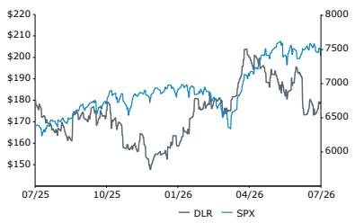

| 调整后每股收益 | 2025A | 2026E | 2027E | 财务数据 | 2025A | 2026E | 2027E | CAGR | 估值指标 | 2025A | 2026E | 2027E |
|---|---|---|---|---|---|---|---|---|---|---|---|---|
| DLR（美元） | 3.87 | 3.09 | 3.21 | 报告EPS | 3.65 | 2.97 | 2.95 | -- | 调整后P/E（x） | 46.3 | 58.0 | 55.9 |
| 前值 | -- | 2.74 | 2.37 | | | | | | | | | |

来源：Bloomberg，Bernstein估计与分析。

## 观察与思考

我们对DLR保持正面看法，参考价位为226美元（前值232美元）。主要模型调整包括滚动历史数据及考虑股权发行的影响。我们仍然看重DLR的长期策略，认为它是全球超大规模数据中心能力建设中最可信赖的参与者之一。如前所述，我们认为DLR在企业托管（0-1MW）领域渗透不足，有较大市场份额提升空间。同时，我们也关注其资本循环策略和表外开发项目。

## 详细内容

## 主要发现

Digital Realty 2026年第二季度业绩与我们对其作为全球全频谱数据中心平台的长期看法基本一致：超大规模业务构成“地板”，而不断加速的托管和连接业务则提供动力，同时借助战略私人资本扩大规模而不过度加重资产负债表杠杆。扣除净收益后核心FFO每股达2.13美元，同比增长14%。收入端，几乎所有主要运营和财务指标均实现两位数增长，同店现金NOI同比增长8.9%（固定汇率下7.2%），尽管季度净新增投资近60亿美元，净债务/调整后EBITDA仍维持在4.7倍。此外，季度还因新加坡此前一起事件导致租金损失的业务中断保险赔款获得每股0.07美元净收益，对盈利形成温和支撑；该项收益已包含在全年展望中，但时间不确定，二季度现反映全部结算价值。我们还注意到，考虑到（1）净收益、（2）保险收益、（3）Blackstone股权发行的1200万股稀释，二季度业绩与市场预期较为接近——AFFO每股和核心AFFO每股均超预期1%（见图表1、图表2），调整后稀释每股收益低于预期3%（图表3）。

开发方面，DLR加速了越来越多合作伙伴资本支持的管线：季度开发资本支出11亿美元（扣除合作伙伴份额），新开工312MW，交付76MW IT容量（60%已预租），在建管线扩至1.4GW，总成本200亿美元——较1H26弹性较高。计入7月超大规模租约后，开发管线现63%已预租，平均预期稳定回报率11.5%，超过80%管线位于美洲，重点区域包括北弗吉尼亚、夏洛特、亚特兰大、圣保罗，并计划于2H26在堪萨斯城启动建设。加之约6.35亿美元年化租金计划在2H26起租（45%在3Q，55%在4Q），4.8亿美元计划于2027年起租，3.12亿美元计划于2028年及以后起租，扩大的管线和积压订单为核心FFO每股的两位数增长提供了长期支撑，管理层预计这一增长将延续至2027年及以后。

战略层面，DLR持续深耕三大核心增长支柱：托管与连接、超大规模、战略私人资本。超大规模方面，DLR同意以12亿美元现金加1230万股DLR股份（估值约23亿美元）收购Blackstone在三座全租约北弗吉尼亚超大规模数据中心（288MW）中64%的混合权益，同时承担其合作伙伴份额的7.25亿美元贷款及剩余资本支出，预计这些资产将在2027年和2028年为核心FFO每股带来增值，同时仍将2026年指引提高1.5%，尽管交易在稳定前完成。私人资本方面，拟收购Columbia Capital（约4.85亿美元）及Teraco 16%权益（约6.5亿美元DLR股票），加之32.5亿美元美国超大规模基金及超过120亿美元剩余能力支持超大规模开发，显著扩大了DLR基于收费的盈利能力和在光纤、移动及企业技术领域的资金承诺，强化了平台在不显著增加公司杠杆的情况下扩大超大规模容量的能力。

我们维持约27倍NTM AFFO的估值，2Q26业绩增强了我们对核心论点的三个关键要素的信念：0-1MW加互联业务（包括AI相关部署和创纪录的渠道贡献）的持续强劲与一致性，25%以上现金续租利差和加速的同类现金NOI增长所体现的结构性定价能力，以及由合作伙伴资金支持的风险较低的超大规模建设项目，将DLR核心FFO每股的双位数增长轨道延伸至2027年及以后。接下来，我们将关注0-1MW AI和企业预订量的趋势、北弗吉尼亚、夏洛特、亚特兰大、堪萨斯城、圣保罗及重要EMEA/APAC枢纽大型园区投产后的利用率和利润率趋势，以及核心FFO指引修订的节奏。

图表1：一次性调整和BX稀释对AFFO每股的影响  
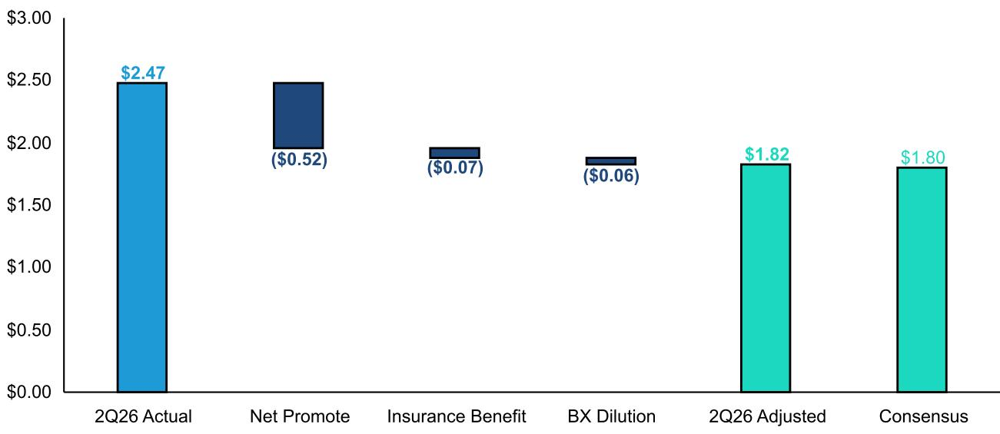  
来源：公司披露，Bloomberg，Bernstein分析

图表2：一次性调整和BX稀释对核心FFO每股（扣除净收益）的影响  
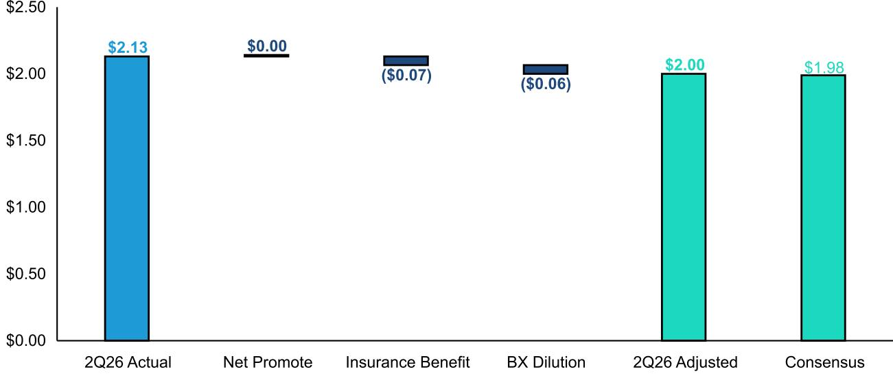  
来源：公司披露，Bloomberg，Bernstein分析

图表3：一次性调整和BX稀释对调整后稀释每股收益的影响  
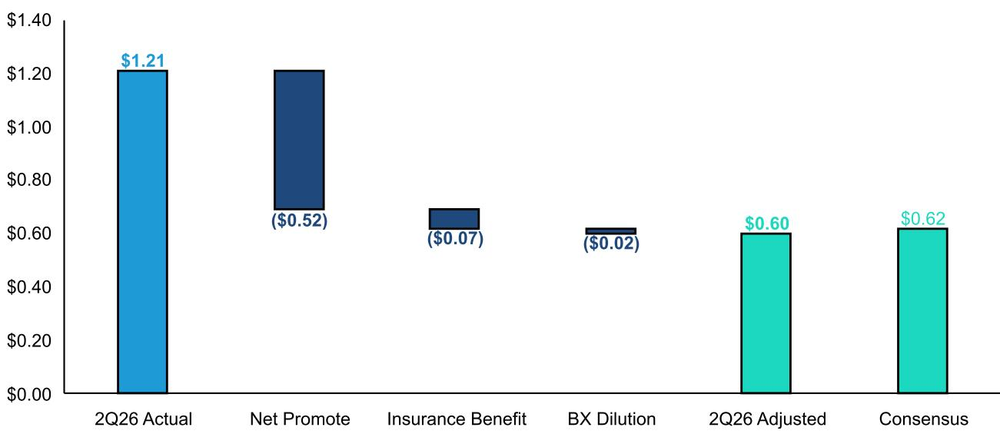  
来源：公司披露，Bloomberg，Bernstein分析

## 长期视角

DLR通常被理解为超大规模地产物业持有方。我们预计其超大规模业务收入到2030年将保持中等个位数增长（与市场共识一致），提供较为稳固的基本盘。而企业业务的发展方向更值得关注。DLR的互联密度和全球布局（六大洲50多个城市300多个数据中心）应能在不断增长的市场中带来超额份额提升。我们预计DLR <1MW板块的复合年增长率为15-20%。

关于未来建设，我们认为DLR的开发管线已通过资本结构策略降低了风险。除各类合资企业外，DLR还设有美国超大规模数据中心基金（首支封闭式基金，LP权益承诺超32亿美元）。有限的投机建设和合作伙伴分担投资的同时，DLR保留运营控制权并收取费用，开发风险呈现不对称性。

催化剂方面，我们关注DLR的企业业务和预订组合，尤其是<1MW板块的持续加速。我们还将密切关注各地区利用率和利润率、合资活动、核心FFO指引修订，以及未来股权发行的风险。

图表4：DLR 2Q26差异表

| | 实际2Q26 | 估计2Q26 | 市场共识2Q26 | 预测差异 | 实际2Q25 | 年度增长（实际） | 年度增长（预测） |
|---|---|---|---|---|---|---|---|
| 租金及其他服务 | 1,675 | 1,627 | 1,626 | 3.0% | 1,457 | 14.9% | 11.6% |
| 租金收入 | 1,146 | 1,118 | 1,123 | 2.1% | 1,004 | 14.2% | 11.9% |
| 租户代收电费 | 353 | 340 | 336 | 5.0% | 295 | 19.8% | 14.1% |
| 租户其他代收 | 45 | 36 | 40 | 13.9% | 37 | 21.5% | 6.6% |
| 互联及其他 | 130 | 132 | 128 | 2.0% | 122 | 6.9% | 4.8% |
| 收费收入及其他 | 249 | 37 | 38 | 562.7% | 36 | 596.9% | 5.2% |
| 总收入 | 1,924 | 1,664 | 1,160 | 65.8% | 1,493 | 28.9% | -22.3% |
| 营业利润 | 467 | 245 | 258 | 81.0% | 212 | 120.7% | 22.0% |
| 营业利润率 | 24.3% | 14.7% | 22.3% | 203bps | 14.2% | 1011bps | 808bps |
| 净利润 | 443 | 255 | 201 | 120.2% | 1,047 | -57.7% | -80.8% |
| 运营现金流（FFO） | 982 | 652 | 685 | 43.3% | 600 | 63.6% | 14.2% |
| FFO每股 | 2.73 | 1.84 | 1.91 | 42.8% | 1.74 | 57.2% | 10.1% |
| 核心运营现金流 | 768 | 681 | 707 | 8.6% | 643 | 19.4% | 9.9% |
| 核心FFO每股 | 2.13 | 1.92 | 1.98 | 7.5% | 1.86 | 14.5% | 6.5% |
| 调整后运营现金流 | 889 | 642 | 641 | 38.6% | 576 | 54.3% | 11.3% |
| AFFO每股 | 2.47 | 1.81 | 1.80 | 37.3% | 1.67 | 48.2% | 7.9% |
| 稀释每股收益 | 1.21 | 0.69 | 0.52 | 132.9% | 2.96 | -59.1% | -82.4% |
| 调整后稀释每股收益 | 0.60 | 0.73 | 0.62 | -3.1% | 2.96 | -79.7% | -79.0% |
| 资本支出 | 914 | 746 | 983 | -7.0% | 704 | 29.8% | 39.5% |
| 自由现金流 | 1,373 | 216 | 335 | 309.3% | 244 | 461.8% | 37.3% |

来源：公司披露，Bernstein分析与估计

图表5：DLR FY26指引

| | 2Q26给出的指引 | 1Q26给出的指引 | 市场共识FY2026 | 估计FY2026 |
|---|---|---|---|---|
| 总收入 | 68.5-69.5亿美元 | 66.5-67.5亿美元 | 6,768 | 7,163 |
| 管理费用 | 6.2-6.3亿美元 | 6.15-6.25亿美元 | 623 | 630 |
| 资本支出（扣除合作伙伴贡献） | 42.5-47.5亿美元 | 35-40亿美元 | 3,730 | 4,862 |
| 调整后EBITDA | 37.5-38.5亿美元 | 36.5-37.5亿美元 | 3,731 | 3,834 |
| 调整后稀释每股收益 | 3.10-3.15美元 | 2.65-2.75美元 | 2.51 | 3.09 |
| FFO/股（固定汇率） | 8.10-8.15美元 | 7.95-8.05美元 | 7.17 | 8.67 |

来源：公司披露，Bernstein分析与估计

图表6：DLR开发生命周期（十亿美元，GW）  
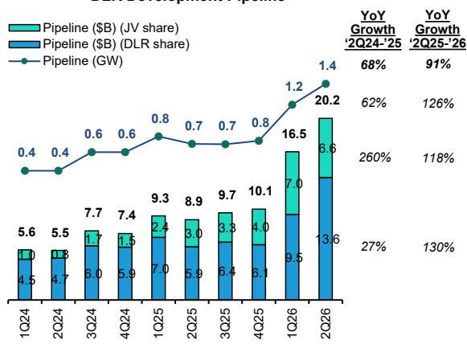  
来源：公司文件，Bernstein分析

图表7：DLR开发管线预期回报率（%）  
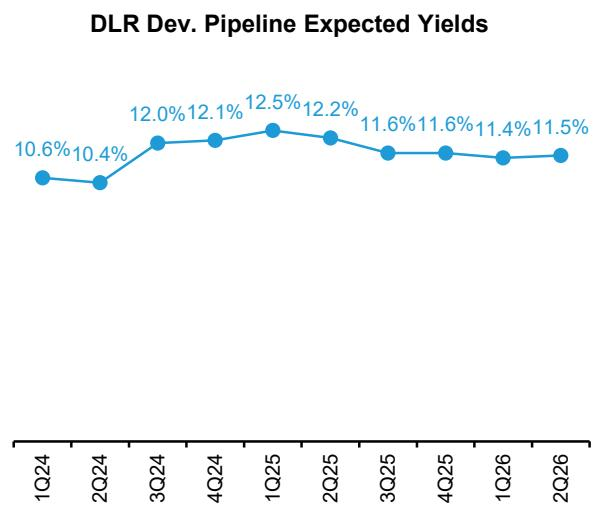  
来源：公司文件，Bernstein分析

图表8：DLR按板块划分的同比收入增长  
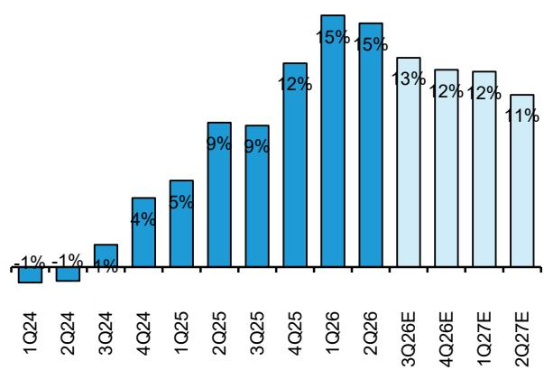  
来源：公司文件，Bernstein分析与估计

图表9：DLR EBIT利润率同比变化（%）  
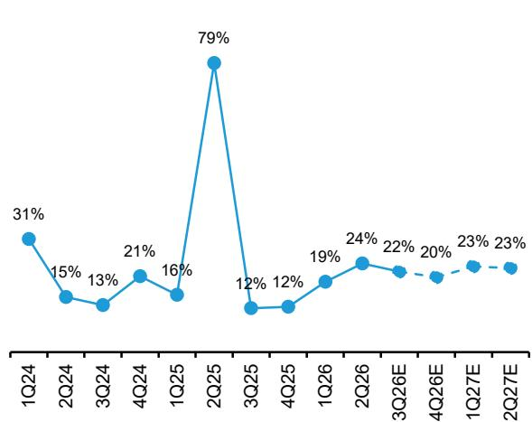  
来源：公司文件，Bernstein分析与估计

图表10：DLR稀释每股收益同比变化（美元，%）  
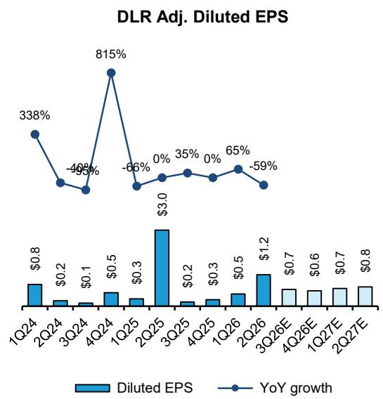  
来源：公司文件，Bernstein分析与估计

图表11：DLR AFFO同比变化（美元，%）  
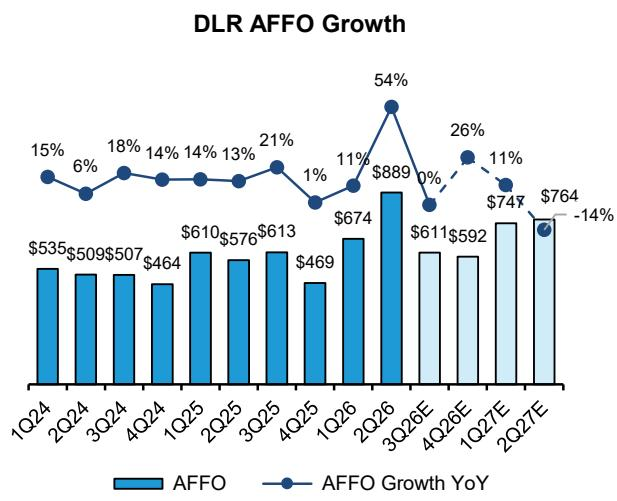  
来源：公司文件，Bernstein分析与估计

图表12：DLR历史新租约年化收入（百万美元）  
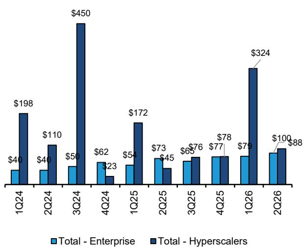  
■ 总计-企业 ■ 总计-超大规模  
来源：公司文件，Bernstein分析

图表13：DLR新租约与起租前置时间（MW，单位）  
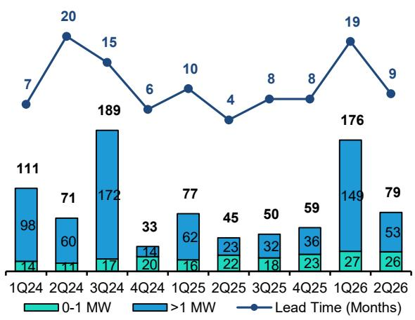  
来源：公司文件，Bernstein分析

图表14：DLR季度末积压订单（百万美元）  
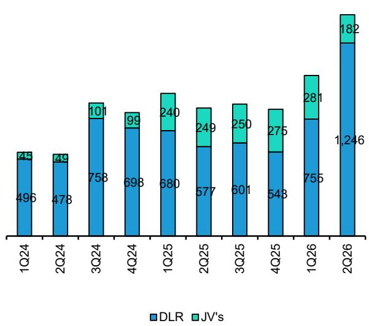  
来源：公司文件，Bernstein分析

图表15：历史DLR开发生命周期（GW）  
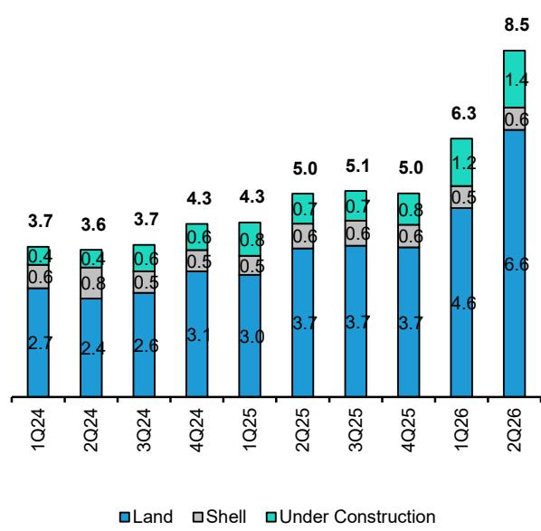  
来源：公司文件，Bernstein分析

图表16：DLR季度预订量（百万美元）  
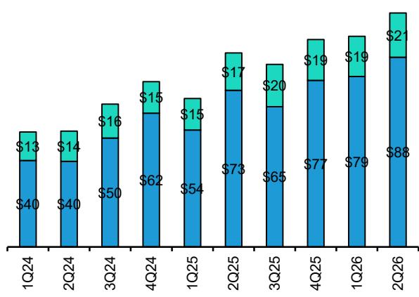  
■ 0-1 MW ■ 互联  
按年化GAAP基础租金列示 来源：公司文件，Bernstein分析

图表17：DLR现金基础续租利差（%）  
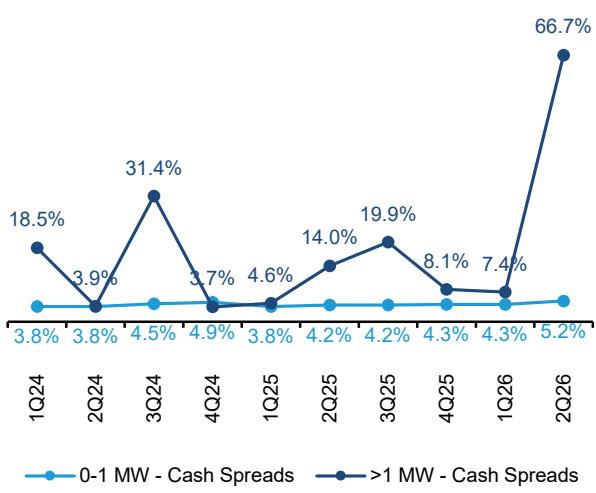  
来源：公司文件，Bernstein分析

图表18：DLR GAAP基础续租利差（%）  
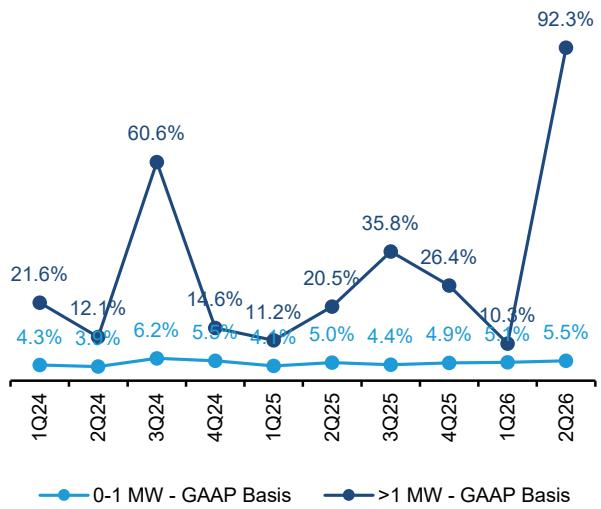  
来源：公司文件，Bernstein分析

图表19：DLR与EQIX的NTM AFFO每股价格（2021-2026）  
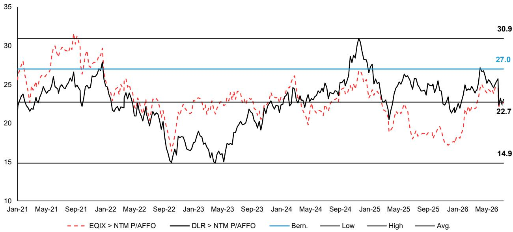  
DLR NTM AFFO每股价格 > 最大值：30.9x，中位数：23.2x，平均值：22.7x，最小值：14.9x，Bernstein 27x。数据截至2026年7月23日。  
来源：Bloomberg，Bernstein分析与估计

## 附录 - 财务预测

图表20：DLR利润表概览

| 所有数值以百万美元计，每股数据除外 | 3Q25 | 4Q25 | 1Q26 | 2Q26 | 3Q26E | 4Q26E | 1Q27E | 2Q27E |
|---|---|---|---|---|---|---|---|---|
| 租金收入 | 1,046 | 1,075 | 1,104 | 1,146 | 1,172 | 1,198 | 1,232 | 1,267 |
| 租户代收电费 | 333 | 356 | 334 | 353 | 379 | 399 | 374 | 395 |
| 租户其他代收 | 37 | 34 | 38 | 45 | 44 | 43 | 41 | 40 |
| 互联及其他 | 120 | 123 | 124 | 130 | 138 | 141 | 145 | 149 |
| 租金及其他服务收入 | 1,536 | 1,589 | 1,600 | 1,675 | 1,733 | 1,780 | 1,791 | 1,851 |
| 收费收入 | 36 | 46 | 35 | 249 | 45 | 45 | 45 | 46 |
| 其他 | 5 | 0 | 0 | 0 | 1 | 1 | 1 | 1 |
| 收费收入及其他 | 41 | 46 | 35 | 249 | 46 | 46 | 46 | 46 |
| 总营业收入 | 1,577 | 1,635 | 1,635 | 1,924 | 1,778 | 1,826 | 1,837 | 1,897 |
| 总营业费用 | 1,439 | 1,522 | 1,368 | 1,465 | 1,630 | 1,699 | 1,660 | 1,717 |
| 营业利润 | 138 | 113 | 267 | 459 | 148 | 127 | 177 | 180 |
| 税前利润 | 75 | 86 | 191 | 491 | 272 | 251 | 302 | 305 |
| 所得税费用 | (12) | 10 | (16) | (34) | (19) | (17) | (34) | (12) |
| 净利润（亏损） | 64 | 96 | 175 | 458 | 253 | 234 | 269 | 293 |
| 归属于非控制权益的净亏损（收益） | 4 | 3 | 4 | (4) | - | - | - | - |
| 归属于Digital Realty Trust Inc.的净利润 | 68 | 99 | 179 | 453 | 253 | 234 | 269 | 293 |
| 优先股股息 | (10) | (10) | (10) | (10) | (10) | (10) | (10) | (10) |
| 优先股赎回损益 | - | - | - | - | - | - | - | - |
| 归属于普通股股东的净利润 | 58 | 88 | 169 | 443 | 243 | 223 | 259 | 283 |
| (+) 调整项 | - | 79 | - | - | 22 | 22 | 23 | 24 |
| 调整后净利润 | 58 | 167 | 169 | 443 | 265 | 245 | 281 | 307 |

**每股收益（EPS）**
| EPS（基本） | 0.17 | 0.26 | 0.49 | 1.25 | 0.66 | 0.61 | 0.70 | 0.77 |
| EPS（稀释） | 0.17 | 0.25 | 0.48 | 1.23 | 0.65 | 0.60 | 0.69 | 0.75 |
| 调整后EPS（稀释） | 0.17 | 0.48 | 0.48 | 1.23 | 0.71 | 0.66 | 0.75 | 0.81 |
| 调整后FFO（AFFO）每股（基本） | 1.79 | 1.37 | 1.95 | 2.51 | 1.67 | 1.62 | 2.03 | 2.07 |

来源：公司文件，Bernstein分析与估计

| FY 2025 | FY 2026E | FY 2027E | FY 2028E | FY 2029E |
|---|---|---|---|---|
| 4,084 | 4,619 | 5,152 | 5,862 | 6,723 |
| 1,254 | 1,465 | 1,640 | 1,866 | 2,140 |
| 151 | 170 | 160 | 174 | 199 |
| 479 | 533 | 604 | 693 | 802 |
| 5,969 | 6,788 | 7,555 | 8,594 | 9,864 |
| 137 | 374 | 185 | 192 | 200 |
| 7 | 2 | 2 | 2 | 2 |
| 144 | 375 | 187 | 194 | 202 |
| 6,113 | 7,163 | 7,742 | 8,788 | 10,066 |
| 5,454 | 6,162 | 7,009 | 7,735 | 8,518 |
| 658 | 1,001 | 733 | 1,053 | 1,549 |
| 1,345 | 1,205 | 1,231 | 1,501 | 1,930 |
| (32) | (86) | (82) | (100) | (121) |
| 1,313 | 1,119 | 1,150 | 1,402 | 1,809 |
| (5) | 0 | - | - | - |
| 1,309 | 1,119 | 1,150 | 1,402 | 1,809 |
| (41) | (41) | (41) | (41) | (41) |
| - | - | - | - | - |
| 1,268 | 1,079 | 1,109 | 1,361 | 1,768 |
| 79 | 43 | 99 | 108 | 89 |
| 1,346 | 1,122 | 1,208 | 1,469 | 1,857 |

| 3.73 | 3.04 | 3.00 | 3.63 | 4.66 |
| 3.65 | 2.97 | 2.95 | 3.56 | 4.57 |
| 3.87 | 3.09 | 3.21 | 3.85 | 4.80 |
| 6.67 | 7.79 | 8.08 | 8.75 | 10.28 |
