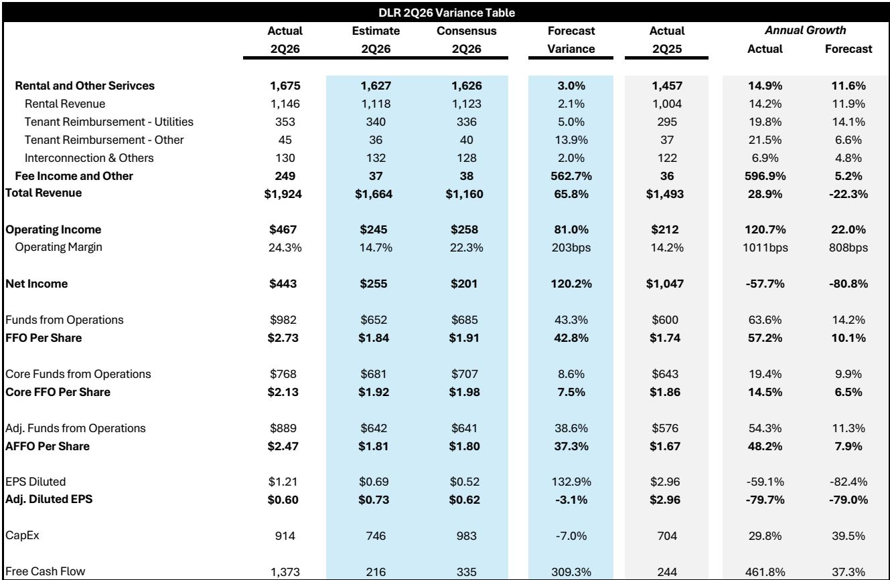
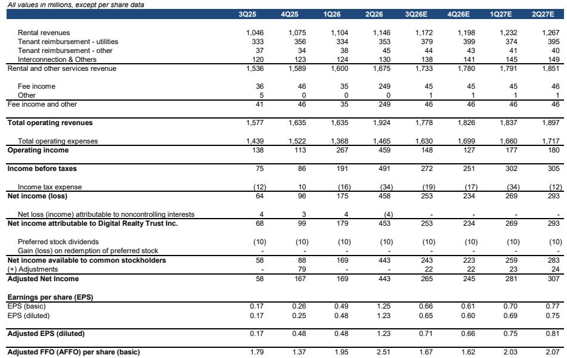
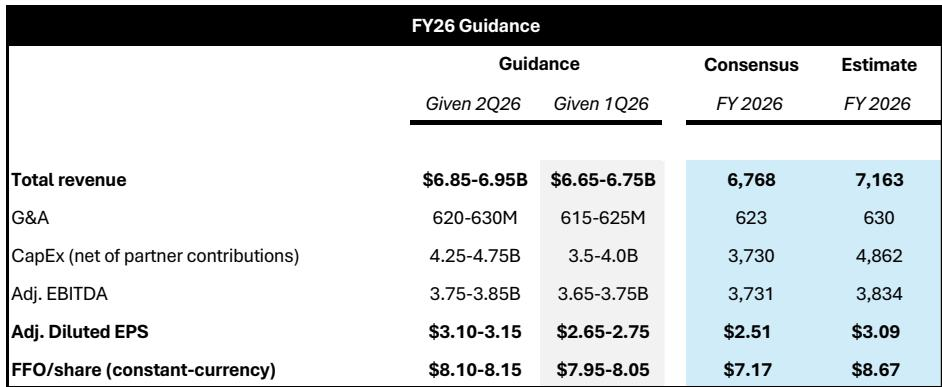

# Bernstein：二季度续租价差达到现金基础66%、GAAP基础92%的水平

Digital Realty交出了一份运营层面相当扎实的二季度成绩单。这家全球数据中心平台在超大规模和企业托管两个赛道同时发力，核心运营指标普遍录得两位数增长。但这份报告最值得关注的判断，并非运营数据本身，而是增长背后的成本结构变化。

Bernstein分析师指出，二季度核心运营指标超出预期约6%，但7月1日与黑石交易相关的1200万股增发，几乎完全抵消了2026年的每股回报表现增长。一笔1.88亿美元的净促进收益（编者注：此处指一次性财务调整收益）暂时缓解了冲击，但这种收益不可持续。报告的核心张力在于：Digital Realty正在加速建设，但每股层面的稀释不确定性也在同步累积。

## 1. 企业托管业务首次突破1亿美元季度收入

Digital Realty的企业托管业务（0-1MW）在二季度录得1.08亿美元收入，这是公司历史上首次单季突破1亿美元。互连服务贡献了其中约19%。这一细分市场被Bernstein视为Digital Realty增长轨迹中最值得关注的部分。

报告认为，Digital Realty在企业托管领域渗透率仍然偏低，拥有显著的市场份额提升空间。与超大规模业务相比，企业托管业务的定价能力更强，客户粘性更高，且利润率结构更优。二季度数据表明，这一战略方向正在产生实质性回报。

> **KC评论：** 企业托管业务的突破，意味着Digital Realty正在从“超大规模房东”的单一标签中走出来。互连服务占比接近20%，说明客户不仅租用空间，还在购买网络连接服务，这能带来更高的客户留存率和更稳定的现金流。

## 2. 超大规模业务季度波动明显，但定价能力突出

超大规模业务（>1MW）在二季度单独来看表现偏弱，主要原因是第一季度基数过高——夏洛特数据中心签下了公司历史上最大的单笔租约。两个大型签约延迟至7月完成，合计金额4.1亿美元（按Digital Realty份额计算为2.05亿美元），将计入三季度。

但这一业务的定价能力令人瞩目。二季度续租价差达到现金基础66%、GAAP基础92%的水平。Bernstein认为这一数字属于异常值，但确实反映了市场对数据中心容量的强劲需求。截至季末，积压订单跳升至14亿美元。

在建管道方面，Digital Realty二季度新增约200MW在建项目，全球在建总量达到1.4GW，总成本约200亿美元。其中54%已预租，若计入7月签约则达到约64%。可建设容量增长超过2GW，全球总量达到8.5GW。大部分在建项目计划在2027年通电。

## 3. 资产负债表健康，但股权稀释是持续关注点

Digital Realty的资产负债表保持健康，净债务与调整后EBITDA比率维持在4.7倍。但这一指标得以维持，部分得益于公司对股权的积极使用。二季度末总股本数增至3.732亿股，较一季度末增长约6%，同比增幅约8%。

开发资本支出指引也大幅上调，2026年增加7.5亿美元。Bernstein的分析清晰呈现了公司面临的平衡难题：加速增长的管道与持续的每股稀释之间存在内在矛盾。部分缓解来自约120亿美元的资产负债表外“干火药”，以及约0.8个杠杆率的债务融资空间。

报告认为，Digital Realty的资本循环策略和资产负债表外开发模式，使其能够在不过度增加公司杠杆的情况下扩大超大规模容量。但每股层面的稀释效应，需要读者持续跟踪。

## 4. 开发管道不确定性结构不对称，但亚特兰大项目需关注

Bernstein认为，Digital Realty的开发管道通过资本结构策略实现了不确定性分散。除了各类合资企业，公司还设立了美国超大规模数据中心产品，首期封闭式产品获得超过32亿美元的有限合伙人权益承诺。

在有限投机性建设和合作伙伴分担研究的情况下，Digital Realty保留运营控制权并收取管理费，开发不确定性呈现不对称特征。但报告也指出，亚特兰大设施尚未预租，分析师认为在当前需求环境下这不算投机性建设，但这一判断需要后续数据验证。

从催化剂角度看，Bernstein关注企业业务和签约组合的持续变化，特别是0-1MW细分市场的加速趋势。同时，各地区的利用率和利润率趋势、合资企业活动以及核心FFO指引的修订，都是需要密切跟踪的变量。

> **KC评论：** 亚特兰大项目是报告中少数尚未预租的大型在建项目。在超大规模需求仍然旺盛的背景下，这或许不是不确定性信号，但读者需要关注该项目未来的预租进度和定价水平，以验证管理层对市场需求的判断是否准确。

---

For informational purposes only. Portions may be generated,translated,summarized,or edited with AI assistance based on source materials and may contain omissions or errors. Please verify independently. This is not investment,legal,tax,accounting,or other professional advice.

For informational purposes only. Portions may be generated,translated,summarized,or edited with AI assistance based on source materials and may contain omissions or errors. Please verify independently. This is not investment,legal,tax,accounting,or other professional advice.

