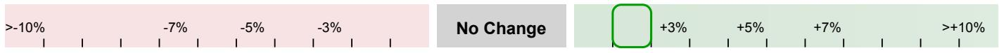

# 美国多元化工业与电气设备行业
Honeywell International Inc

# HON 2026年第二季度：业绩稳健，高于预期，展望上调

整体来看，Honeywell Technologies 本季度表现稳健。整体内生增长率为4%，高于此前持平的市场预期；调整后营业利润率约为19%，基本符合预期。调整后每股利润为1.95美元，比市场平均预期高约7%。

三个业务部门的内生增长率均高于市场预期（建筑自动化：9% vs. 6.5%市场预期；流程自动化：-1% vs. -7.5%市场预期；工业自动化：4% vs. 0.5%市场预期）。部门营业利润率也高于预期（根据不同业务单位，约高出20–30个基点）。全年展望也小幅上调：内生增长率上调至3–4%（此前为2–3%），部门利润率中点上调至20.3%（此前约为20.0%），调整后每股利润展望中点从8.10美元上调至8.20美元。

## 对市场平均预期盈利的调整

无变化

**数据摘要**：营收51.87亿美元，比市场平均预期约49.78亿美元高出4.2%，同比增长3.4%（2025年第二季度为50.18亿美元）。内生增长率4.0%，比市场平均预期0.2%高出380个基点。部门利润9.85亿美元，比市场平均预期9.43亿美元高出4.4%。营业利润率19.0%，比市场平均预期18.9%高出5个基点。调整后每股利润1.95美元，比市场平均预期1.82美元高出7.4%。

**业务部门**：
- **工业自动化**：营收15.01亿美元，比市场平均预期14.57亿美元高出3.0%（2025年第二季度为15.77亿美元）。内生增长率4.0%（2025年第二季度为0.0%），比市场平均预期0.5%高出350个基点。部门营业利润2.58亿美元，比市场平均预期2.47亿美元高出4.5%；部门营业利润率17.2%（2025年第二季度为16.3%，市场平均预期16.9%），高出预期25个基点。
- **建筑自动化**：营收20.02亿美元，比市场平均预期19.54亿美元高出2.5%（2025年第二季度为18.26亿美元）。内生增长率9.0%（2025年第二季度为8.0%），比市场平均预期6.5%高出250个基点。部门营业利润5.42亿美元，比市场平均预期5.24亿美元高出3.5%；部门营业利润率27.1%（2025年第二季度为26.2%，市场平均预期26.8%），高出预期29个基点。
- **流程自动化**：营收16.79亿美元，比市场平均预期15.49亿美元高出8.4%（2025年第二季度为16.13亿美元）。内生增长率-1.0%（2025年第二季度为6.0%），比市场平均预期-7.5%高出650个基点。部门营业利润3.71亿美元，比市场平均预期3.42亿美元高出8.4%；部门营业利润率22.1%（2025年第二季度为23.9%，市场平均预期22.1%），符合预期。

**展望**：Honeywell 对2026年全年展望进行小幅更新，销售额区间从199–202亿美元调整为198–200亿美元，同时将内生增长率展望从2–3%上调至3–4%。公司还将调整后每股利润展望从7.90–8.30美元上调至8.05–8.35美元，部门利润率展望从19.8–20.3%上调至20.1–20.5%。自由现金流展望维持约20亿美元不变。

**附表：HON 实际业绩 vs 市场平均预期**

| 集团（百万美元） | 2025年Q2 实际 | 2026年Q2 实际 | 2026年Q2 市场预期 | 同比变化 | 高于/低于市场预期 | 高于/低于幅度 |
| --- | --- | --- | --- | --- | --- | --- |
| 营收（持续经营） | 5,018 | 5,187 | 4,978 | +3.4% | 高于预期 | +4.2% |
| 内生增长率 | | 4.0% | 0.2% | 400个基点 | 高于预期 | 383个基点 |
| 部门利润（持续经营） | 904 | 985 | 943 | +9.0% | 高于预期 | +4.4% |
| 营业利润率 | 18.0% | 19.0% | 18.9% | 100个基点 | 高于预期 | 5个基点 |
| 调整后每股利润（美元，持续经营） | 1.77 | 1.95 | 1.82 | +10.2% | 高于预期 | +7.4% |

| 部门（百万美元） | 2025年Q2 实际 | 2026年Q2 实际 | 2026年Q2 市场预期 | 同比变化 | 高于/低于市场预期 | 高于/低于幅度 |
| --- | --- | --- | --- | --- | --- | --- |
| **工业自动化** | | | | | | |
| 营收 | 1,577 | 1,501 | 1,457 | -5% | 高于预期 | +3.0% |
| 内生增长率 | 0.0% | 4.0% | 0.5% | 400个基点 | 高于预期 | 350个基点 |
| 部门营业利润 | 257 | 258 | 247 | 0% | 高于预期 | +4.5% |
| 部门营业利润率 | 16.3% | 17.2% | 16.9% | 90个基点 | 高于预期 | 25个基点 |
| **建筑自动化** | | | | | | |
| 营收 | 1,826 | 2,002 | 1,954 | 10% | 高于预期 | +2.5% |
| 内生增长率 | 8.0% | 9.0% | 6.5% | 100个基点 | 高于预期 | 250个基点 |
| 部门营业利润 | 479 | 542 | 524 | 13% | 高于预期 | +3.5% |
| 部门营业利润率 | 26.2% | 27.1% | 26.8% | 87个基点 | 高于预期 | 29个基点 |
| **流程自动化** | | | | | | |
| 营收 | 1,613 | 1,679 | 1,549 | 4% | 高于预期 | +8.4% |
| 内生增长率 | 6.0% | -1.0% | -7.5% | -700个基点 | 高于预期 | 650个基点 |
| 部门营业利润 | 386 | 371 | 342 | -4% | 高于预期 | +8.4% |
| 部门营业利润率 | 23.9% | 22.1% | 22.1% | -183个基点 | 高于预期 | 0个基点 |

*注：2025年第二季度持续经营的营业利润和调整后每股利润数据未提供。*
来源：Visible Alpha，公司报告，Bernstein分析
