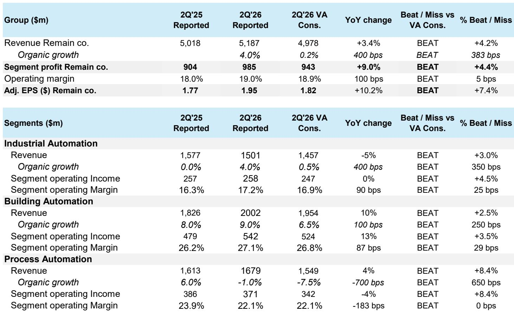
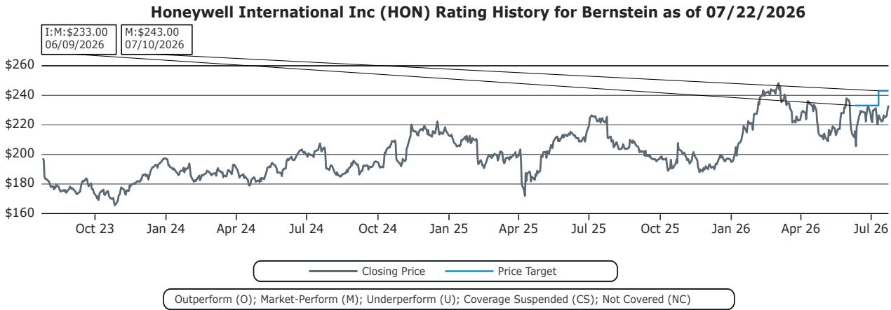

# Honeywell’s 2Q26 Results Reveal a Diverging Portfolio: Building Automation Is the Growth Engine, Process Automation the Hidden Risk

Honeywell International Inc. reported second-quarter 2026 results that exceeded consensus on nearly every major metric. Total revenue reached $5,187 million, beating the consensus estimate of $4,978 million by 4.2%. Organic growth came in at 4.0%, a remarkable 380 basis points above the 0.2% the market had expected. Adjusted EPS of $1.95 surpassed the Street estimate of $1.82 by 7.4%. The company raised its full-year organic growth guidance to 3-4% from 2-3%, lifted segment margin guidance to 20.1-20.5% from 19.8-20.3%, and increased the adjusted EPS midpoint to $8.20 from $8.10.

These numbers tell an unequivocally positive near-term story. But beneath the aggregate beat lies a portfolio that is becoming less uniform in its performance drivers and more exposed to divergent macro currents. The real insight from this quarter is not that Honeywell beat expectations—it is that the composition of the beat reveals which businesses are gaining structural momentum and which are merely benefiting from a low bar.

Observers who focus solely on the headline guidance raise risk missing the critical strategic question: Can Honeywell sustain this trajectory as its strongest segment faces potential headwinds and its weakest segment shows signs of stabilization rather than acceleration? The answer requires a granular look at the three segments, each telling a different story about demand, margins, and cyclical exposure.

## Building Automation Delivered a Structural Beat That Deserves Scrutiny for Sustainability

Building Automation was the standout performer, posting organic growth of 9.0% against consensus expectations of 6.5%. This marks an acceleration from the 8.0% organic growth recorded in the year-ago quarter. Revenue reached $2,002 million, beating the consensus of $1,954 million by 2.5%. Segment operating margin expanded to 27.1% from 26.2% a year earlier, exceeding the consensus estimate of 26.8% by 29 basis points. Segment operating income of $542 million beat consensus by 3.5%.

The margin expansion is particularly noteworthy. Building Automation’s 27.1% margin now sits well above the company’s overall segment margin guidance midpoint of 20.3%, meaning this segment is pulling the entire portfolio upward. The 87-basis-point year-over-year margin improvement suggests that Honeywell is capturing pricing power and operational leverage in its building solutions portfolio, likely driven by demand for energy efficiency upgrades, smart building retrofits, and compliance-driven investments in commercial real estate.

The question is whether this momentum is sustainable. The report’s risk disclosures explicitly identify a downside scenario: “Power prices stay stable or decline as supply comes online (reducing impetus for building automation).” This is not a hypothetical tail risk. The current beat is partly a function of elevated energy costs and regulatory pressure pushing building owners toward automation investments. If power prices moderate—as new generation capacity comes online and inflationary pressures ease—the urgency behind these investments could diminish. Observers should watch for signs of order deceleration in the second half of 2026, as the comps become more challenging and the macro tailwind potentially fades.

## Industrial Automation Rebounded Sharply, but the Recovery Is Early and Narrow

Industrial Automation delivered the most dramatic surprise of the quarter. Revenue of $1,501 million beat consensus of $1,457 million by 3.0%. Organic growth came in at 4.0%, compared with 0.0% in the year-ago quarter and far above the consensus expectation of 0.5%. Segment operating margin improved to 17.2% from 16.3%, exceeding the consensus of 16.9% by 25 basis points.

This is the segment that had been under the most pressure, and the magnitude of the beat suggests that inventory adjustment cycles may be ending and end-market demand is stabilizing. However, context matters. The consensus estimate of 0.5% organic growth was exceptionally low, reflecting widespread skepticism about the industrial cycle. Beating a pessimistic baseline by 350 basis points is meaningful, but it does not yet confirm a sustained up-cycle.

The risk here is that the rebound is concentrated in specific end markets rather than broad-based. The report does not provide a granular breakdown of sub-segment performance, but the fact that Process Automation—a related but distinct business—continued to show negative organic growth suggests that the recovery in Industrial Automation may be driven by short-cycle products and aftermarket services rather than large capital project wins. If this is the case, the margin improvement may prove more durable than the revenue acceleration, since aftermarket margins tend to be higher and less cyclical. Observers should monitor whether Industrial Automation can sustain organic growth above 3% for two consecutive quarters before concluding that a genuine upturn is underway.

## Process Automation Beat a Very Low Bar, but the Underlying Trend Remains Negative

Process Automation reported organic growth of -1.0%, which beat the consensus expectation of -7.5% by a stunning 650 basis points. Revenue of $1,679 million exceeded consensus by 8.4%. However, segment operating margin contracted to 22.1% from 23.9% a year earlier, and operating income declined 4% year over year.

This is the segment that requires the most careful interpretation. Beating a consensus estimate of -7.5% organic growth is not the same as demonstrating strength. The market had priced in a severe downturn, likely reflecting delays in large LNG projects and a broader slowdown in capital spending by energy and chemical customers. The actual result suggests that conditions are not as bad as feared, but they are still negative.

The report’s risk disclosures highlight this explicitly: “Weakness / delays in LNG projects which market is not pricing.” This is a critical caution. Process Automation’s revenue stream is heavily tied to large-scale energy and industrial projects, many of which are subject to permitting delays, financing challenges, and political uncertainty. The fact that organic growth remains negative even as the consensus was overly pessimistic indicates that the underlying demand environment has not improved—it has merely stabilized at a lower level than feared. The margin compression from 23.9% to 22.1% suggests that the segment is absorbing fixed costs on a declining revenue base, a pattern that typically precedes further margin erosion unless volumes recover.

## The Guidance Raise Is Modest and Implies a Narrowing Range of Outcomes

Honeywell’s updated guidance reveals more about management’s confidence than about the trajectory of demand. The company raised its organic growth guidance to 3-4% from 2-3%, narrowed its sales range to $19.8-$20.0 billion from $19.9-$20.2 billion, and lifted adjusted EPS guidance to $8.05-$8.35 from $7.90-$8.30. Segment margin guidance was raised to 20.1-20.5% from 19.8-20.3%.

The narrowing of the sales range is revealing. By bringing the top end down from $20.2 billion to $20.0 billion while raising the bottom end from $19.9 billion to $19.8 billion, management is signaling that the range of possible outcomes is contracting. This is consistent with a company that sees greater visibility into the second half but also recognizes that the upside is capped by the same macro uncertainties that have kept Process Automation in negative territory. The EPS guidance midpoint of $8.20 implies a multiple of approximately 28x based on the current company valuation of $232.99, which is below the trailing multiple of 36.1x but still above the historical average for a multi-industrial conglomerate.

The decision to maintain free cash flow guidance at approximately $2.0 billion is notable. Free cash flow is the ultimate measure of earnings quality, and holding it flat while raising EPS guidance implies that the improvement in profitability is coming from operational leverage and margin expansion rather than from working capital improvements or one-time gains. This is a positive signal, but it also means that any revenue disappointment in the second half would directly pressure free cash flow conversion.

## A Decision Framework for Observers: Three Scenarios and the Signals to Watch

The divergence among Honeywell’s three segments creates a clear decision framework for observers. The critical question is not whether the company beat in the second quarter—it did—but whether the current portfolio composition is positioned for the macro environment that is likely to emerge over the next 12 months.

In the first scenario, Building Automation sustains its momentum as energy prices remain elevated and regulatory mandates drive continued investment in smart building infrastructure. Industrial Automation continues its recovery, reaching 3-4% organic growth as inventory adjustments end and end-market demand gradually improves. Process Automation stabilizes at flat to slightly positive growth as LNG projects resume and capital spending recovers. In this scenario, Honeywell can deliver on the raised guidance and potentially exceed it, with EPS approaching $8.50.

In the second scenario, Building Automation decelerates as power prices moderate and the low-hanging fruit of energy efficiency investments is captured. Industrial Automation’s recovery stalls as end-market demand proves uneven. Process Automation remains in negative territory as LNG delays persist. In this scenario, the second-half comps become more challenging, and the company may struggle to meet even the raised guidance. EPS would come in near the low end of the range at $8.05.

In the third scenario, a broader macro downturn affects all three segments simultaneously. Building Automation faces headwinds from commercial real estate developments, Industrial Automation enters a new inventory adjustment cycle, and Process Automation suffers from project cancellations. In this scenario, the guidance raise would prove premature.

The signal to watch is Process Automation orders. If the negative organic growth in that segment narrows to flat or turns positive in the third quarter, it would confirm that the stabilization is real and that the capital spending cycle is turning. If Process Automation remains in negative territory while Building Automation shows signs of deceleration, the portfolio’s center of gravity would shift unfavorably. Observers should also monitor free cash flow conversion in the second half, as any deviation from the $2.0 billion target would be a leading indicator of earnings quality.

Honeywell’s second-quarter beat is a genuine positive, but it does not change the fundamental strategic challenge facing the company. The portfolio is increasingly reliant on Building Automation for growth and margin expansion, while Process Automation remains a drag and Industrial Automation is recovering from a low base. The guidance raise reflects confidence in the near term, but the narrowing of the sales range suggests that management sees limited room for upside surprises. For observers, the key insight is not that Honeywell beat expectations—it is that the composition of the beat reveals a company navigating a diverging set of end markets, where the strongest segment faces potential macro headwinds and the weakest segment has yet to turn positive. The second half of 2026 will determine whether this quarter was the beginning of a sustained trajectory or a high-water mark for the current cycle.

*For informational purposes only. Portions may be generated, translated, summarized, or edited with AI assistance based on source materials and may contain omissions or errors. Please verify independently.*
