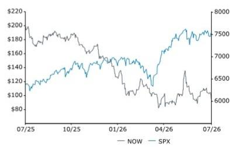
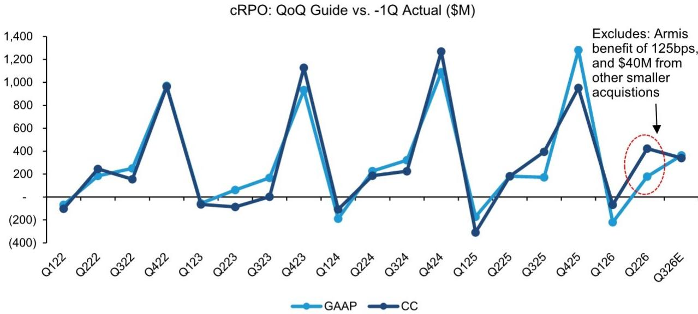
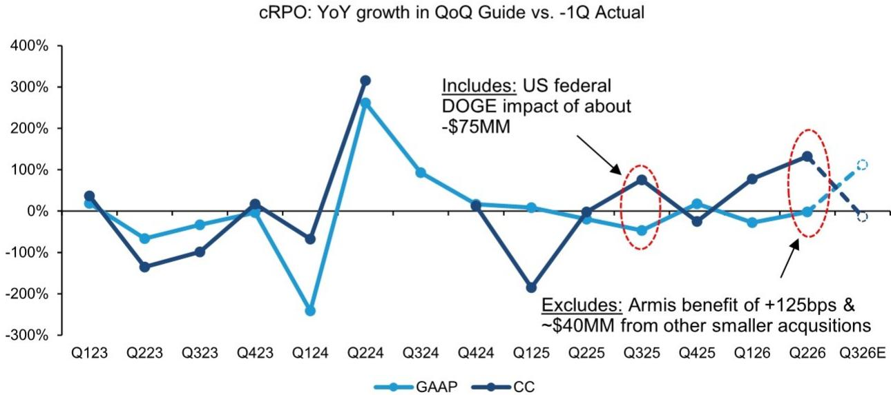
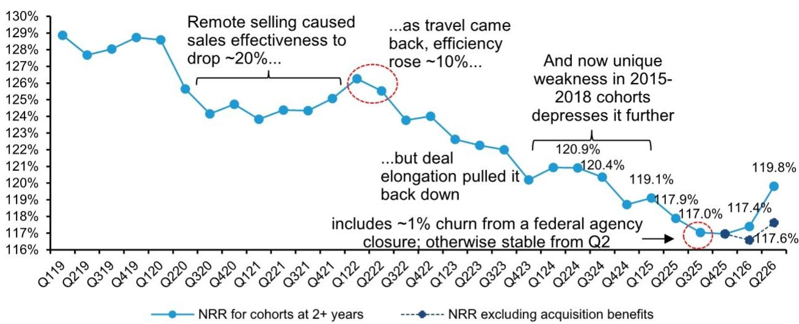
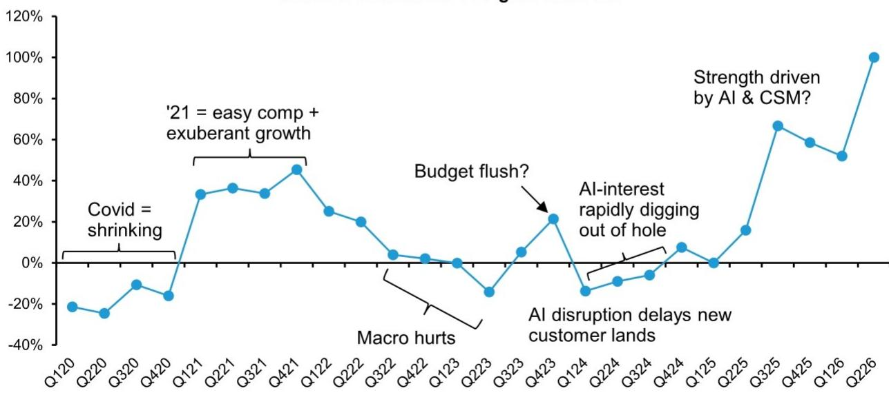
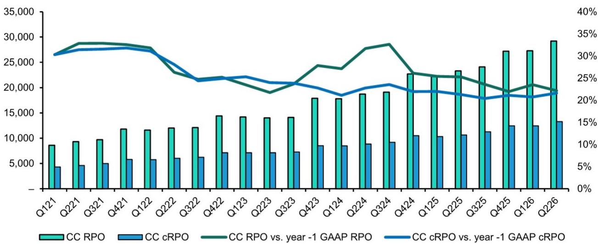
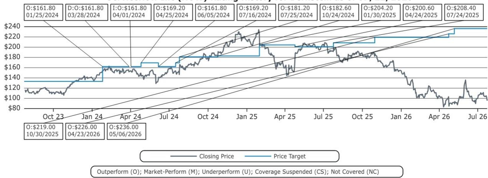

# U.S. SMID-Cap Software ServiceNow Inc

## 研究观察

NOW

248.00 USD (236.00 OLD)

Luwei Yang  
+1 917 344 8342  
luwei.yang@bernsteinsg.com

## ServiceNow (NOW) Q2'26：业绩表现回归预期

ServiceNow Q2'26在多个维度上显现了相比Q1的积极变化——Q1时部分市场参与者对业绩超预期节奏、核心需求强度、非内生增长贡献以及较低的Q2有机cRPO指引存在疑虑。而Q2实现了订阅收入较指引高出230个基点的明显超预期。部分超预期来自本地部署合同的提前续约（受AI控制塔及AI与风险产品的需求推动），这部分对全年指引的提升影响较小（仅为将Q3收入前置），其余部分则是干净的可摊销ACV超预期，并传导至全年指引的提升。此外，Q3的cRPO指引环比继续增长，且不再包含非内生因素，但Q3整体收入指引因本地部署续约前置而较常规水平约低100个基点。管理层表示对下半年指引保持保守态度，但需求依然稳健，这使其对持续达成超预期表现有信心。

## 关于客户的“市场讨论”部分已得到回应，部分仍待观察

季度内，大客户Sanofi宣布将部分软件（包括ServiceNow）转向自建。管理层指出这仍属个例，并已看到该计划部分环节被收回的信号。其次，针对来自CIO和渠道调研中关于ServiceNow新SKU组合的“噪音”——客户抱怨被强行提价——管理层感到意外，因为新SKU组合并非强制迁移，客户可选择留在原有SKU并维持正常升级与支持，甚至Pro Plus级别属于免费升级。管理层怀疑可能是部分销售人员的过度行为，并承诺进行内部调查后反馈。

<table><tr><td>Close Date</td><td></td><td></td><td colspan="2">22 Jul 2026</td></tr><tr><td>NOW Close Price (USD)</td><td></td><td></td><td colspan="2">95.46</td></tr><tr><td>Price Target (USD)</td><td></td><td></td><td colspan="2">248.00</td></tr><tr><td>Upside/(Downside)</td><td></td><td></td><td colspan="2">160%</td></tr><tr><td>52-Week Range</td><td></td><td></td><td colspan="2">210.20/81.24</td></tr><tr><td>SPX</td><td></td><td></td><td colspan="2">7,498.96</td></tr><tr><td>FYE</td><td></td><td></td><td colspan="2">Dec</td></tr><tr><td>Div Yield</td><td></td><td></td><td colspan="2">NA</td></tr><tr><td>Market Cap (USD) (M)</td><td></td><td></td><td colspan="2">98,419</td></tr><tr><td>EV (USD) (M)</td><td></td><td></td><td colspan="2">95,668</td></tr><tr><td>Performance</td><td>YTD</td><td>1M</td><td>6M</td><td>12M</td></tr><tr><td>Absolute (%)</td><td>(37.7)</td><td>2.6</td><td>(25.7)</td><td>(50.4)</td></tr><tr><td>SPX (%)</td><td>9.5</td><td>0.4</td><td>8.5</td><td>18.8</td></tr><tr><td>Relative (%)</td><td>(47.2)</td><td>2.3</td><td>(34.2)</td><td>(69.3)</td></tr><tr><td colspan="5">Source: Bloomberg, Bernstein estimates and analysis.</td></tr></table>

Price Performance, 1YR  

## 研究观察要点

Q3收入因本地部署合同续约前置略有调整，Q4+模型因超预期有小幅上调。毛利率指引下调，税率上调至30%（SBC收益减少）。采用50/50的Ro40倍数回归（约13x P/NTM收入）与DCF（WACC约9.6%，较Q1的约10%因+60亿美元债务融资而下降，终值增长3%），将参考区间上调至248美元，维持原有研究视角。

<table><tr><td>Adjusted EPS</td><td>F25A</td><td>F26E</td><td>F27E</td></tr><tr><td>NOW (USD)</td><td>3.50</td><td>3.92</td><td>4.69</td></tr><tr><td>OLD</td><td>--</td><td>4.02</td><td>4.87</td></tr></table>

Source: Bloomberg, Bernstein estimates and analysis.

<table><tr><td>Financials</td><td>F25A</td><td>F26E</td><td>F27E</td><td>CAGR</td></tr><tr><td>Revenues (M)</td><td>13,278</td><td>16,347</td><td>19,260</td><td>--</td></tr><tr><td>Cost of Goods Sold (M)</td><td>2,517</td><td>3,546</td><td>4,271</td><td>--</td></tr><tr><td>Operating Earnings (M)</td><td>4,149</td><td>5,226</td><td>6,350</td><td>--</td></tr><tr><td>FCF (M)</td><td>4,636</td><td>5,788</td><td>7,016</td><td>--</td></tr></table>

<table><tr><td>Valuation Metrics</td><td>F25A</td><td>F26E</td><td>F27E</td></tr><tr><td>Adjusted P/E (x)</td><td>27.2</td><td>24.4</td><td>20.3</td></tr><tr><td>EV/FCF (x)</td><td>20.6</td><td>16.5</td><td>13.6</td></tr><tr><td>EV/Sales (x)</td><td>7.2</td><td>5.9</td><td>5.0</td></tr><tr><td>EV/EBITDA (x)</td><td>37.3</td><td>31.3</td><td>23.0</td></tr></table>

## 详细内容

## 与CFO及CPO电话会议要点

Q2 cRPO超预期表现由强于预期的提前续约和广泛的新ACV增长共同驱动。约一半的cRPO超预期来自提前续约，另一半来自净新增ACV表现优于预期。重要的是，提前续约的增加与定价变化无关，主要受客户在网络安全和AI治理产品需求增强的背景下，扩展至AI控制塔、安全及风险产品的推动。管理层认为，Q3至Q4的恒定货币cRPO增长回落约50个基点是合理估计。在全年订阅收入指引方面，Q2净新增ACV的超预期已完全传导至指引，而提前续约的超预期则属于收入从Q3移至Q2的时间性变化。

管理层认为核心业务持续稳定，收购正进一步拉动平台需求。尽管市场参与者仍关注近期收购的贡献，但管理层强调内生表现正趋于稳定，Moveworks和Armis等产品在增强而非替代核心平台需求。例如，Employee Works与Moveworks已紧密集成，Moveworks成为用户界面入口。Armis和安全产品也正推动整个平台的增量采用，带来比收购后早期通常更强的商业进展。

Armis持续超预期，同时强化了ServiceNow更广泛的安全平台策略。Armis贡献了Q2 cRPO超预期约10%，其Q2超预期已传导至全年指引。但由于超预期规模相对较小，四舍五入后全年收入贡献仍约为125个基点，与上季度指引一致。更重要的是，管理层强调Armis通过涵盖暴露管理、身份治理、AI治理和工作流自动化的捆绑解决方案，加速核心安全增长，并以更好整合的平台方案推动SecOps和AI Control Tower等产品的需求。

公共部门需求保持强劲，AI、安全和风险管理推动客户互动增加。管理层指出，联邦预算环境相较去年有明显改善，联邦、州、地方及教育客户均呈现良好势头。需求日益集中在AI治理、网络安全和运营韧性方面。

现有SKU尚未退役，客户在新AI包装框架下保留完全灵活性。管理层反驳了新AI捆绑包代表强制性涨价的看法，重申现有客户可按当前方案续约。公司随后进一步澄清，现有SKU将继续获得功能更新和新特性，客户不会被强制迁移至新AI原生SKU。

管理层认为，领域专业知识和专有工作流上下文仍是企业AI领域的核心竞争优势。面对市场对前沿AI模型提供商是否会进一步进入应用软件的疑问，管理层认为企业自动化需要深厚的领域知识、工作流编排、治理、维护和运营上下文，这些难以仅通过基础模型复现。公司将AI模型视为使能技术，而ServiceNow的差异化来自工作流特定的元数据、运营专业知识及企业级治理能力。

毛利率压力主要来自通过超大规模市场采用ServiceNow产品以及AI消费的增加。管理层预计这些压力将随着超大规模用量扩大带来更好定价以及推理成本下降而逐步缓解，同时持续的运营纪律和AI驱动的效率提升正在帮助抵消毛利率压力并支持运营利润率目标。

语音AI正在成为客户服务和员工工作流方面一个新兴的采用方向。管理层指出，客户对语音AI代理的兴趣日益增长，特别是在航空公司等高客量客服场景。公司已构建了支持多模型提供商的多模态语音架构，并预计语音交互能力将逐步嵌入客服和工作流产品中。

ServiceNow正加速向中型市场拓展，推出轻量级、AI原生的服务管理产品。管理层讨论了即将推出的对话式优先服务台产品，该产品部署快速，IT参与需求较低，面向数字原生和中型市场客户，从底层利用AI，并提供进入ServiceNow生态系统的更简易入口。

EXHIBIT 1: Q3 cRPO指引环比增长强于往年。

  
Source: Company reports, Bernstein analysis  

EXHIBIT 2: 增量Q3 cRPO同比增速面临去年同期高基数，但金额水平非常强劲。

  
Source: Company reports, Bernstein analysis

EXHIBIT 3: 隐含NRR自2022年下半年开始下降，最初受交易延长和支出压力影响。2024年影响似乎集中在2015-2018年客户群。若剔除Q3'25约1%的流失影响，NRR自那以来基本持平于Q2'25水平。即使假设收购贡献推高了NRR，剔除收购影响后的NRR本季度也显示出明显回升。

NRR for cohorts at 2+ years  
  
Source: Company presentation, Bernstein estimates and analysis (all data)

EXHIBIT 4: 2023年初宏观因素影响下，新客户ACV同比增速出现明显下滑，2023年底开始改善，可能反映未使用预算的释放。但2024年GenAI的干扰效应再现。Q1'25持平，Q2'25起出现回升，Q3和Q4新AI功能帮助公司落地更多大额交易。H1'26净新增ACV持续走强，本季度增长更为显著。

Net new customers: YoY growth in ACV  
  
Source: Company presentation, Bernstein estimates and analysis (all data)

■ Technology Workflows ■ Customer & Employee Workflows ■ Creator Workflows & Others

EXHIBIT 5: 过去三个季度三大板块比例保持稳定  
Net new ACV Revenue Mix by Workflows  
  
Source: Company reports, Bernstein analysis

EXHIBIT 6: 本季度恒定货币RPO和cRPO同比增速均维持在20%以上  
Constant Currency RPO & cRPO and Growth Rates (YoY)  
  
Source: Company reports, Bernstein analysis

EXHIBIT 7: ServiceNow业绩与市场共识及我们预估的对比

<table><tr><td rowspan="2"></td><td colspan="3">Reported (&#x27;000)</td></tr><tr><td>Q225</td><td>Q226</td><td>yoy</td></tr><tr><td colspan="4">[Non-GAAP]</td></tr><tr><td>Revenue</td><td>3,215,000</td><td>3,987,000</td><td>24%</td></tr><tr><td>COGS</td><td>611,000</td><td>880,000</td><td>44%</td></tr><tr><td>Gross Profit</td><td>2,604,000</td><td>3,107,000</td><td>19%</td></tr><tr><td>R&amp;D</td><td>531,000</td><td>613,000</td><td>15%</td></tr><tr><td>S&amp;M</td><td>954,000</td><td>1,116,000</td><td>17%</td></tr><tr><td>G&amp;A</td><td>164,000</td><td>206,000</td><td>26%</td></tr><tr><td>Operating Profit</td><td>955,000</td><td>1,172,000</td><td>23%</td></tr><tr><td>EBT</td><td>1,068,000</td><td>1,449,000</td><td>36%</td></tr><tr><td>Net Income</td><td>854,000</td><td>930,000</td><td>9%</td></tr><tr><td>EPS</td><td>0.82</td><td>0.90</td><td>10%</td></tr><tr><td colspan="4">[GAAP]</td></tr><tr><td>Revenue</td><td>3,215,000</td><td>3,987,000</td><td>24%</td></tr><tr><td>Subscription</td><td>3,113,000</td><td>3,877,000</td><td>25%</td></tr><tr><td>Prof Svcs</td><td>102,000</td><td>110,000</td><td>8%</td></tr><tr><td>COGS</td><td>724,000</td><td>1,169,000</td><td>61%</td></tr><tr><td>Gross Profit</td><td>2,491,000</td><td>2,818,000</td><td>13%</td></tr><tr><td>Margin</td><td>77%</td><td>71%</td><td>-7%</td></tr><tr><td>R&amp;D</td><td>734,000</td><td>915,000</td><td>25%</td></tr><tr><td>S&amp;M</td><td>1,128,000</td><td>1,372,000</td><td>22%</td></tr><tr><td>G&amp;A</td><td>271,000</td><td>369,000</td><td>36%</td></tr><tr><td>Operating Profit</td><td>358,000</td><td>162,000</td><td>-55%</td></tr><tr><td>Margin</td><td>11%</td><td>4%</td><td></td></tr><tr><td>Other Income (expense)</td><td>113,000</td><td>276,000</td><td>144%</td></tr><tr><td>EBT</td><td>471,000</td><td>438,000</td><td>-7%</td></tr><tr><td>Tax provisions</td><td>86,000</td><td>140,000</td><td>63%</td></tr><tr><td>Net Income</td><td>385,000</td><td>298,000</td><td>-23%</td></tr><tr><td>EPS</td><td>0.37</td><td>0.29</td><td>-22%</td></tr></table>

<table><tr><td colspan="4">FQ2 2026 Estimates</td></tr><tr><td>Cons</td><td>vs. Actual</td><td>Bernstein</td><td>vs. Actual</td></tr><tr><td>3,926,632</td><td>2%</td><td>3,984,835</td><td>0%</td></tr><tr><td>816,721</td><td>8%</td><td>891,498</td><td>-1%</td></tr><tr><td>3,109,910</td><td>0%</td><td>3,093,337</td><td>0%</td></tr><tr><td>662,033</td><td>-7%</td><td>654,292</td><td>-6%</td></tr><tr><td>1,198,682</td><td>-7%</td><td>1,169,005</td><td>-5%</td></tr><tr><td>203,811</td><td>1%</td><td>192,641</td><td>7%</td></tr><tr><td>1,045,385</td><td>12%</td><td>1,077,399</td><td>9%</td></tr><tr><td>1,107,639</td><td>31%</td><td>1,169,379</td><td>24%</td></tr><tr><td>892,049</td><td>4%</td><td>864,435</td><td>8%</td></tr><tr><td>0.87</td><td>3%</td><td>0.84</td><td>8%</td></tr><tr><td>3,926,632</td><td>2%</td><td>3,984,835</td><td>0%</td></tr><tr><td>3,814,230</td><td>2%</td><td>3,855,078</td><td>1%</td></tr><tr><td>112,402</td><td>-2%</td><td>129,758</td><td>-15%</td></tr><tr><td>965,851</td><td>21%</td><td>1,135,975</td><td>3%</td></tr><tr><td>2,960,781</td><td>-5%</td><td>2,848,860</td><td>-1%</td></tr><tr><td>75%</td><td></td><td>71%</td><td></td></tr><tr><td>900,686</td><td>2%</td><td>927,441</td><td>-1%</td></tr><tr><td>1,368,889</td><td>0%</td><td>1,362,450</td><td>1%</td></tr><tr><td>317,497</td><td>16%</td><td>297,149</td><td>24%</td></tr><tr><td>373,708</td><td>-57%</td><td>261,820</td><td>-38%</td></tr><tr><td>10%</td><td></td><td>7%</td><td></td></tr><tr><td>(62,405)</td><td></td><td>198,019</td><td>39%</td></tr><tr><td>436,113</td><td>0%</td><td>459,839</td><td>-5%</td></tr><tr><td>59,495</td><td>135%</td><td>68,976</td><td>103%</td></tr><tr><td>376,618</td><td>-21%</td><td>390,863</td><td>-24%</td></tr><tr><td>0.34</td><td>-15%</td><td>0.38</td><td>-23%</td></tr></table>

<table><tr><td rowspan="2"></td><td colspan="3">Reported (&#x27;000)</td></tr><tr><td>Q225</td><td>Q226</td><td>yoy</td></tr><tr><td>Gross Retention</td><td>98%</td><td>98%</td><td>0%</td></tr><tr><td>Net Retention (estimated)</td><td>119.3%</td><td>120.9%</td><td>1.5%</td></tr><tr><td>Adj. Free Cash Flow</td><td>535,000</td><td>634,000</td><td>19%</td></tr><tr><td># customers with &gt;$5M ACV</td><td>533</td><td>658</td><td>23%</td></tr><tr><td>ACV/customer &gt;$5M, millions</td><td>14.4</td><td>15.2</td><td>6%</td></tr><tr><td>Deals &gt;$1M net new ACV in quarter</td><td>89</td><td>123</td><td>38%</td></tr></table>

Source: Company reports, Bloomberg, Bernstein estimates and analysis

<table><tr><td colspan="4">FQ2 2026 Estimates</td></tr><tr><td>Cons</td><td>vs. Actual</td><td>Bernstein</td><td>vs. Actual</td></tr><tr><td>98.2%</td><td>0%</td><td>97%</td><td>1%</td></tr><tr><td></td><td></td><td>119.0%</td><td>1.6%</td></tr><tr><td>650,917</td><td>-3%</td><td>752,213</td><td>-16%</td></tr></table>

## 附录 - 财务预测

EXHIBIT 8: ServiceNow 财务摘要

<table><tr><td>ServiceNow$ , ThousandsIncome Statement</td><td>2020</td><td>2021</td><td>2022</td><td>2023</td><td>2024</td><td>2025</td><td>Q126</td><td>Q226</td><td>Q326</td><td>Q426</td><td>2026</td><td>2027</td><td>2028</td></tr><tr><td>Total Revenue</td><td>4,519,484</td><td>5,895,000</td><td>7,245,000</td><td>8,971,000</td><td>10,984,000</td><td>13,278,000</td><td>3,770,000</td><td>3,987,000</td><td>4,144,241</td><td>4,445,618</td><td>16,346,859</td><td>19,259,859</td><td>22,804,133</td></tr><tr><td>Cost of Revenue (Non-GAAP)</td><td>801,479</td><td>1,102,000</td><td>1,275,000</td><td>1,590,000</td><td>1,907,000</td><td>2,517,000</td><td>782,000</td><td>880,000</td><td>905,006</td><td>978,880</td><td>3,545,886</td><td>4,270,980</td><td>4,932,448</td></tr><tr><td>Gross Profit (Non-GAAP)</td><td>3,718,005</td><td>4,793,000</td><td>5,970,000</td><td>7,381,000</td><td>9,077,000</td><td>10,761,000</td><td>2,988,000</td><td>3,107,000</td><td>3,239,235</td><td>3,466,738</td><td>12,800,973</td><td>14,988,878</td><td>17,871,684</td></tr><tr><td>R&amp;D (Non-GAAP)</td><td>740,263</td><td>990,000</td><td>1,252,000</td><td>1,513,000</td><td>1,862,000</td><td>2,148,000</td><td>582,000</td><td>613,000</td><td>627,457</td><td>642,643</td><td>2,465,100</td><td>2,866,497</td><td>3,347,009</td></tr><tr><td>S&amp;M (Non-GAAP)</td><td>1,533,427</td><td>1,903,000</td><td>2,355,000</td><td>2,796,000</td><td>3,288,000</td><td>3,755,000</td><td>1,041,000</td><td>1,116,000</td><td>1,025,184</td><td>1,144,713</td><td>4,326,897</td><td>4,913,769</td><td>5,671,713</td></tr><tr><td>G&amp;A (Non-GAAP)</td><td>323,094</td><td>418,000</td><td>503,000</td><td>583,000</td><td>673,000</td><td>709,000</td><td>166,000</td><td>206,000</td><td>200,793</td><td>210,732</td><td>783,525</td><td>858,183</td><td>921,491</td></tr><tr><td>Total Operating Expenses (Non-GAAP)</td><td>2,596,784</td><td>3,310,000</td><td>4,110,000</td><td>4,892,000</td><td>5,823,000</td><td>6,612,000</td><td>1,789,000</td><td>1,935,000</td><td>1,853,435</td><td>1,998,087</td><td>7,575,522</td><td>8,638,449</td><td>9,940,214</td></tr><tr><td>Operating Income (Non-GAAP)</td><td>1,121,221</td><td>1,483,000</td><td>1,860,000</td><td>2,489,000</td><td>3,254,000</td><td>4,149,000</td><td>1,199,000</td><td>1,173,000</td><td>1,385,800</td><td>1,468,651</td><td>5,226,451</td><td>6,350,430</td><td>7,931,471</td></tr><tr><td>Margin %</td><td>25%</td><td>25%</td><td>26%</td><td>28%</td><td>30%</td><td>31%</td><td>32%</td><td>29%</td><td>33%</td><td>33%</td><td>32%</td><td>33%</td><td>35%</td></tr><tr><td>Interest income and other, net</td><td>21,411</td><td>3,000</td><td>44,000</td><td>246,000</td><td>374,000</td><td>437,000</td><td>170,000</td><td>276,000</td><td>82,786</td><td>88,026</td><td>616,812</td><td>554,784</td><td>855,773</td></tr><tr><td>[Non-GAAP] Earnings before taxes</td><td>1,142,632</td><td>1,486,000</td><td>1,904,000</td><td>2,735,000</td><td>3,628,000</td><td>4,586,000</td><td>1,369,000</td><td>1,449,000</td><td>1,468,586</td><td>1,556,677</td><td>5,843,263</td><td>6,905,214</td><td>8,787,244</td></tr><tr><td>Provision for income taxes</td><td>217,100</td><td>283,000</td><td>361,000</td><td>520,000</td><td>726,000</td><td>917,000</td><td>357,000</td><td>519,000</td><td>440,576</td><td>467,003</td><td>1,783,579</td><td>2,071,564</td><td>2,636,173</td></tr><tr><td>Net income (loss)</td><td>925,532</td><td>1,203,000</td><td>1,543,000</td><td>2,215,000</td><td>2,902,000</td><td>3,669,000</td><td>1,012,000</td><td>930,000</td><td>1,028,010</td><td>1,089,674</td><td>4,059,684</td><td>4,833,650</td><td>6,151,071</td></tr><tr><td>Net income attributable to common shareholders</td><td>925,532</td><td>1,203,000</td><td>1,543,000</td><td>2,215,000</td><td>2,902,000</td><td>3,669,000</td><td>1,012,000</td><td>930,000</td><td>1,028,010</td><td>1,089,674</td><td>4, 059,684</td><td>4,833,650</td><td>6,151,071</td></tr><tr><td>Earnings (loss) per share - Basic</td><td>$0.96</td><td>$1.21</td><td>$1.50</td><td>$2.17</td><td>$2.82</td><td>$3.54</td><td>$0.98</td><td>$0.90</td><td>$0.99</td><td>$1.05</td><td>$3.92</td><td>$4.69</td><td>$5.99</td></tr><tr><td>Earnings (loss) per share - Diluted</td><td>$1.77</td><td>$1.19</td><td>$1.52</td><td>$2.15</td><td>$2.78</td><td>$3.50</td><td>$0.97</td><td>$0.90</td><td>$0.99</td><td>$1.05</td><td>$3.92</td><td>$4.69</td><td>$5.99</td></tr><tr><td>Balance Sheet</td><td>2020</td><td>2021</td><td>2022</td><td>2023</td><td>2024</td><td>2025</td><td>Q126</td><td>Q226</td><td>Q326</td><td>Q426</td><td>2026</td><td>2027</td><td>2028</td></tr><tr><td>Cash and cash equivalents</td><td>1,676,794</td><td>1,728,000</td><td>1,470,000</td><td>1,897,000</td><td>2,304,000</td><td>3,726,000</td><td>2,702,000</td><td>2,503,000</td><td>2,674,944</td><td>3,812,852</td><td>3,812,852</td><td>7,081,099</td><td>10,127,096</td></tr><tr><td>Short-term investments</td><td>1,415,242</td><td>1,576,000</td><td>2,810,000</td><td>2,980,000</td><td>3,458,000</td><td>2,558,000</td><td>2,480,000</td><td>2,161,000</td><td>2,284,277</td><td>2,715,391</td><td>2,715,391</td><td>3,647,418</td><td>5,121,186</td></tr><tr><td>Receivables</td><td>1,009,415</td><td>1,390,000</td><td>1,725,000</td><td>2,036,000</td><td>2,240,000</td><td>2,627,000</td><td>1,713,000</td><td>2,201,000</td><td>1,882,972</td><td>3,109,503</td><td>3,109,503</td><td>3,604,613</td><td>3,909,978</td></tr><tr><td>Other current assets</td><td>420,391</td><td>526,000</td><td>649,000</td><td>864,000</td><td>1,185,000</td><td>1,560,000</td><td>1,540,000</td><td>1,649,000</td><td>2,056,342</td><td>1,980,982</td><td>1,980,982</td><td>1,975,262</td><td>2,015,632</td></tr><tr><td>Total current assets</td><td>4,521,842</td><td>5,220,000</td><td>6,654,000</td><td>7,777,000</td><td>9,187,000</td><td>10,471,000</td><td>8,435,000</td><td>8,514,000</td><td>8,898,535</td><td>11,618,729</td><td>11,618,729</td><td>16,308,393</td><td>21,173,891</td></tr><tr><td>Total PPE</td><td>659,641</td><td>766,000</td><td>1,053,000</td><td>1,358,000</td><td>1,763,000</td><td>2,289,000</td><td>2,250,000</td><td>2,177,000</td><td>2,294,832</td><td>2,424,556</td><td>2,424,556</td><td>2,656,255</td><td>2,990,299</td></tr><tr><td>Other assets</td><td>3,533,574</td><td>4,812,000</td><td>5,592,000</td><td>8,252,000</td><td>9,433,000</td><td>13,278,000</td><td>13,696,000</td><td>20,975,000</td><td>21,052,110</td><td>21,803,926</td><td>21,803,926</td><td>23,421,967</td><td>26,596,666</td></tr><tr><td>Total assets</td><td>8,715,057</td><td>10,798,000</td><td>13,299,000</td><td>17,387,000</td><td>20,383,000</td><td>26,038,000</td><td>24,381,000</td><td>31,666,000</td><td>32,245,477</td><td>35,847,211</td><td>35,847,211</td><td>42,386,615</td><td>50,760,857</td></tr><tr><td>Accounts payable</td><td>34,236</td><td>89,000</td><td>274,000</td><td>126,000</td><td>68,000</td><td>204,000</td><td>427,000</td><td>162,000</td><td>202,966</td><td>294,696</td><td>294,696</td><td>340,342</td><td>444,294</td></tr><tr><td>Other current liabilities</td><td>3,702,908</td><td>4,860,000</td><td>5,731,000</td><td>7,239,000</td><td>8,290,000</td><td>10,239,000</td><td>9,556,000</td><td>11,991,000</td><td>11,559,005</td><td>14,007,458</td><td>14,007,458</td><td>15,658,523</td><td>17,462,725</td></tr><tr><td>Total current liabilities</td><td>3,737,144</td><td>4,949,000</td><td>6,005,000</td><td>7,365,000</td><td>8,358,000</td><td>10,443,000</td><td>9,983,000</td><td>12,153,000</td><td>11,761,971</td><td>14,302,154</td><td>14,302,154</td><td>15,998,865</td><td>17,907,020</td></tr><tr><td>Deferred revenue, non-current</td><td>45,346</td><td>63,000</td><td>70,000</td><td>81,000</td><td>95,000</td><td>120,000</td><td>99,000</td><td>135,000</td><td>118,025</td><td>142,871</td><td>142,871</td><td>161,237</td><td>180,429</td></tr><tr><td>Other liabilities, non-current</td><td>2,098,086</td><td>2,091,000</td><td>2,192,000</td><td>2,313,000</td><td>2,321,000</td><td>2,511,000</td><td>2,571,000</td><td>6,862,000</td><td>6,862,000</td><td>6,862,000</td><td>6,862,000</td><td>6,862,000</td><td>6,862,000</td></tr><tr><td>Total non-current liabilities</td><td>2,143,432</td><td>2,154,000</td><td>2,262,000</td><td>2,394,000</td><td>2,416,000</td><td>2,631,000</td><td>2,670,000</td><td>6,997,000</td><td>6,980,025</td><td>7,004,871</td><td>7,004,871</td><td>7,023,237</td><td>7,042,429</td></tr><tr><td>Total Liabilities</td><td>5,880,576</td><td>7,103,000</td><td>8,267,000</td><td>9,759,000</td><td>10,774,000</td><td>13,074,000</td><td>12,653,000</td><td>19,150,000</td><td>18,741,996</td><td>21,307,026</td><td>21,307,026</td><td>23,022,102</td><td>24,949,449</td></tr><tr><td>Total Equity</td><td>2,834,481</td><td>3,695,000</td><td>5,032,000</td><td>7,628,000</td><td>9,609,000</td><td>12,964,000</td><td>11,728,000</td><td>12,516,000</td><td>13,503,481</td><td>14,540,185</td><td>14,540,185</td><td>19,364,513</td><td>25,811,407</td></tr><tr><td>Total Liabilities and Equity</td><td>8,715,057</td><td>10,798,000</td><td>13,299,000</td><td>17,387,000</td><td>20,383,000</td><td>26,038,000</td><td>24,381,000</td><td>31,666,000</td><td>32,245,477</td><td>(35,847,211)</td><td>(35,847,211)</td><td>42,386,615</td><td>50,760,857</td></tr></table>

Source: Company reports, Bernstein estimates and analysis

## I. 必要披露

关于“Bernstein”或“本机构”的参考文献涵盖以下实体：Bernstein Institutional Services LLC（自2024年4月1日起）、Bernstein & Co., LLC（2024年4月1日前）、Bernstein Autonomous LLP、BSG France S.A.（自2024年4月1日起）、Bernstein (Hong Kong) Limited 盛博香港有限公司、Bernstein (Canada) Limited、Bernstein (India) Private Limited（SEBI注册号INH000006378）、Bernstein (Singapore) Private Limited、Bernstein Japan KK（サンフォード・C・バーンスタイン株式会社）以及根据Bernstein与SG之间的全球服务协议由SG Africa Technologies & Services雇用的分析师。

Bernstein是SG（SG）与AllianceBernstein, L.P.（AB）合资企业的一部分。除非特别注明，本披露中提及的Bernstein“关联方”指SG及AB及其各自关联方。

## 估值方法

## ServiceNow Inc

参考区间248美元是DCF（WACC 9.6%，终值增长3%）与13倍P/S（未来5-8个季度）可比倍数的50/50等权重平均。P/S（未来5-8个季度）可比倍数基于我们的40法则行业估值回归。假设当前云SaaS倍数回归线在未来1年以上保持稳定。

## 风险

## ServiceNow Inc

除宏观环境相关风险外，下行风险包括：大型行业参与者通过部署防御性或更优产品来提高客户留存率并与ServiceNow竞争；未能开发新解决方案并扩展至新市场；收入增长放缓可能导致市场信心变化，进而引起倍数收缩。

## 评级定义、基准及分布

## 股权评级定义

## Bernstein品牌

Bernstein品牌基于未来12个月相对S&P 500（美国及加拿大上市股票）、Bloomberg Europe Developed Markets Large and Mid Cap Price Return Index EUR (EDME)（欧洲及新兴市场（亚太除外）上市股票）、Bloomberg Japan Large and Mid Cap Price Return Index USD (JPL)（日本上市股票）以及Bloomberg Asia ex-Japan Large and Mid Cap Price Return Index (ASIAX)（亚洲（日本除外）上市股票）的预期相对表现进行评级，除非另有说明。

Bernstein品牌包含三类评级：

- 跑赢：股票将跑赢市场指数超过15个百分点
- 同步：股票表现与市场指数相差在±15个百分点以内
- 跑输：股票将跑输市场指数超过15个百分点

暂停覆盖：Bernstein品牌下的公司覆盖被暂停。评级和参考区间暂时失效，不应再依赖。

未评级：当股票当前无法准确估值或无法准确预测公司表现时赋予的评级。覆盖分析师可继续发布公司研究报告以向市场参与者更新事件和进展。

未覆盖（NC）表示未纳入覆盖的公司。

Bernstein品牌股票评级基于12个月时间框架。

## Autonomous品牌 – 普通股

Autonomous品牌按以下方式对普通股进行评级。基准采用Bloomberg Europe 600 Financials Price Return Index (E600BK)和Bloomberg Europe Dev Mkt Financials Large and Mid Cap Price Ret Index EUR (EDMFI)（发达欧洲银行和支付）、Bloomberg Europe 600 Insurance Price Return Index (E600IN)（欧洲保险公司）、S&P 500和S&P Financials（美国银行和支付覆盖）、S5LIFE（美国保险）、S&P Insurance Select Industry (SPSIINS)（美国非寿险保险公司覆盖）、Bloomberg Emerging Markets Financials Large, Mid and Small Cap Price Return Index (EMLSF)（新兴市场银行、保险和支付）以及Bloomberg Japan Financials Large & Mid Cap Price Return Index (JPFILM)（日本金融）。评级相对于行业（而非市场）给出。

Autonomous品牌包含三类普通股评级：

- 跑赢（OP）：股票将跑赢相关基准超过10个百分点
- 中性（N）：股票表现与市场指数相差在±10个百分点以内
- 跑输（UP）：股票将跑输相关基准超过10个百分点

暂停覆盖：Autonomous研究品牌下的公司覆盖被暂停。评级和参考区间暂时失效，不应再依赖。

未评级：当股票当前无法准确估值或无法准确预测公司表现时赋予的评级。覆盖分析师可继续发布公司研究报告以向市场参与者更新事件和进展。

标注为“精选”（如Feature Outperform FOP、Feature Under Outperform FUP）的为核心观点。

未覆盖（NC）表示未纳入覆盖的公司。

Autonomous品牌普通股评级基于12个月时间框架。

## Autonomous品牌 – 优先股

Autonomous品牌包含三类优先股评级：

- 跑赢（OP）：优先工具的总回报预计在未来六个月内优于在类似行业或评级类别中经营的其他发行人发行的优先证券。
- 中性（N）：优先工具的总回报预计在未来六个月内与在类似行业或评级类别中经营的其他发行人发行的优先证券表现一致。
- 跑输（UP）：优先工具的总回报预计在未来六个月内劣于在类似行业或评级类别中经营的其他发行人发行的优先证券。

Autonomous优先股评级基于6个月时间框架。

## AUTONOMOUS 信用研究

若本报告包含《市场滥用条例》第3(1)(35)条定义的信用工具推荐，以下信息旨在满足其披露要求。

本报告可能包含对Autonomous或Bernstein其他分析师所覆盖的上述发行人股权证券的已发表意见的引用。请注意，本报告作者发布的信用工具推荐可能与覆盖该发行人股权证券的分析师的观点不同，反之亦然。

## 信用评级定义

Autonomous品牌包含三类信用评级：

- 信用跑赢（C-OP）：参考信用工具的总回报预计在未来六个月内优于在类似行业或评级类别中经营的其他发行人发行的债券的信用利差。
- 信用中性（C-N）：参考信用工具的总回报预计在未来六个月内与在类似行业或评级类别中经营的其他发行人发行的债券的信用利差表现一致。
- 信用跑输（C-UP）：参考信用工具的总回报预计在未来六个月内劣于在类似行业或评级类别中经营的其他发行人发行的债券的信用利差。

Autonomous信用评级基于6个月时间框架。

本报告作者制作的所有推荐清单及信用评级历史可应要求提供。

本机构何时启动、更新和停止研究覆盖由其自行决定。本机构已建立、维护并依赖信息隔离墙来控制一个或多个领域（即非公开侧）内的信息流动，并防止信息流入本机构的其他领域、单位、集团或关联方（即公开侧）。

## 股权评级分布/投资银行服务

<table><tr><td>股权评级</td><td>市场滥用条例（MAR）和FINRA评级类别</td><td>全球评级分布</td><td>投资银行关系*</td></tr><tr><td>跑赢</td><td>买入</td><td>51.2%</td><td>15.3%</td></tr><tr><td>同步（Bernstein品牌）/中性（Autonomous品牌）</td><td>持有</td><td>35.8%</td><td>16.2%</td></tr><tr><td>跑输</td><td>卖出</td><td>13.1%</td><td>13.6%</td></tr></table>

\* 这些数字代表各股权评级类别中，Bernstein关联方在过去12个月内提供过投资银行服务的公司百分比。
截至2026年6月30日。所有数字每季度更新。

## 价格图表/评级及参考区间历史

2024年4月1日前，Bernstein & Co., LLC. 对以下公司发布了评级和参考区间信息：ServiceNow Inc.

ServiceNow Inc (NOW) Rating History for Bernstein as of 07/22/2026  
  
上述图表中的所有参考区间和收盘价数据均以本报告“代码表”中注明的货币计价。

## 利益冲突

Bernstein的某些关联方在以下公司的股权证券中担任做市商或流动性提供者：ServiceNow Inc.

## 其他事项

本报告所列分析师的雇佣法律实体及其所在地可通过其电话号码的国家代码确定，如下所示：

+1 Bernstein Institutional Services LLC; 纽约州纽约市, 美国
+44 Bernstein Autonomous LLP; 伦敦, 英国
+212 SG Africa Technologies & Services; 卡萨布兰卡, 摩洛哥
+33 BSG France S.A.; 巴黎, 法国
+34 BSG France S.A.; 马德里, 西班牙
+41 Bernstein Autonomous LLP; 日内瓦, 瑞士
+49 BSG France S.A.; 法兰克福, 德国
+91 Bernstein (India) Private Limited; 孟买, 印度
+852 Bernstein (Hong Kong) Limited 盛博香港有限公司; 香港, 中国
+65 Bernstein (Singapore) Private Limited; 新加坡
+81 Bernstein Japan KK; 东京, 日本

若本报告由非美国关联公司雇用的研究分析师编写，则（除非另有明确说明）该分析师未注册为Bernstein Institutional Services LLC或任何其他SEC注册经纪交易商的关联人士，也未获得FINRA研究分析师的资格或许可。因此，该分析师可能不受FINRA关于（包括但不限于）研究分析师与主题公司之间的沟通、研究分析师与投资银行人员之间的互动、研究分析师参与投资银行交易相关的招揽和营销活动、研究分析师的公开露面以及研究分析师账户中持有证券的交易等限制。

若本报告由SG Africa Technologies & Services（SG集团成员）雇用的研究分析师编写，则其是根据Bernstein与SG之间的全球服务协议代表Bernstein公司编写的。

## 认证

本报告的主要内容负责分析师确认，本出版物中的所有观点准确反映了该分析师对所涉任何及所有主题证券或发行人的个人看法，并且该分析师的薪酬中没有任何部分直接或间接与本出版物中的具体建议或观点相关。

## II. 附加全球冲突披露

本机构何时启动、更新和停止研究覆盖由其自行决定。本机构已建立、维护并依赖信息隔离墙来控制一个或多个领域（即非公开侧）内的信息流动，并防止信息流入本机构的其他领域、单位、集团或关联方（即公开侧）。

## III. 其他重要信息及披露

“Bernstein”和“Autonomous”研究产品维持独立的品牌。

- Bernstein生产多种不同类型的研究产品，包括但不限于在“Autonomous”和“Bernstein”品牌下的基础分析和量化分析。一种研究产品中的建议可能因时间框架、方法论或其他原因与另一种研究产品中的建议不同。此外，一个品牌下研究产品中的观点或建议可能与另一品牌下同类研究产品的观点或建议不同。两个品牌的研究评级系统及其他与评级系统相关的信息包含在前一节中。

- Autonomous作为以下实体内的独立业务部门运营：Bernstein Institutional Services LLC、Bernstein Autonomous LLP、Bernstein (Hong Kong) Limited 盛博香港有限公司和Bernstein (India) Private Limited。有关“Autonomous”品牌产品（包括某些销售材料）的信息，请访问：www.autonomous.com。有关Bernstein品牌产品的信息，请访问：www.bernsteinresearch.com。

分析师的薪酬基于其对研究整体贡献的汇总衡量，包括账户渗透、生产力和投资创意的主动性。没有任何分析师的薪酬与投资银行收入的产生表现或贡献挂钩。

本报告由符合欧盟596/2014市场滥用条例（“MAR”）第3(1)(34)(i)条定义的独立分析师编写，该条例作为英国国内法的一部分（经2018年欧盟（退出）法案修订）同样适用。

致美国读者：Bernstein Institutional Services LLC是一家在美国证券交易委员会（SEC）注册的经纪交易商，是美国金融业监管局（FINRA）的成员，在美国分发本出版物并对其内容承担责任。若本材料包含对债务产品的分析，则该材料仅面向机构读者，不受适用于面向散户读者的债务研究的美国独立性和披露标准约束。

Bernstein Institutional Services LLC可作为本人或作为他人（包括关联方）的代理人，对本报告主题的任何证券进行销售或购买。本报告不旨在满足任何特定个人、实体或账户的目标或需求。

致加拿大读者：若本出版物涉及加拿大注册公司，则由Bernstein (Canada) Limited在加拿大分发，该公司由加拿大投资监管组织（CIRO）许可并监管。若出版物涉及非加拿大注册公司，则由Bernstein Institutional Services LLC（SEC和FINRA许可并监管）通过国际交易商豁免在加拿大分发。本文件不得传递给加拿大境内的任何人，除非该人符合NI 31-103第1.1节定义的“允许客户”。

致巴西读者：本报告由Bernstein Institutional Services LLC编制，Banco BTG Pactual S.A.（“BTG”）负责在巴西分发本报告。

致英国读者：本出版物已由Bernstein Autonomous LLP（由金融行为监管局授权和监管，地址：60 London Wall, London EC2M 5SH，电话+44 (0)20-7170-5000）在英国发布或批准发布。在英格兰和威尔士注册，编号OC343985。本文件仅面向以下人士分发：（i）具有与投资相关事务的专业经验，符合《2000年金融服务与市场法（金融促进）令2005》（修订版，“金融促进令”）第19(5)条；（ii）属于金融促进令第49(2)(a)至(d)条（“高净值公司、非法人协会等”）的人士；（iii）英国境外人士；或（iv）可依法向其传达或促使传达与任何证券发行或销售相关的投资活动邀请或诱导的人士（所有此类人士统称为“相关人士”）。本文件仅面向相关人士，不得被非相关人士依赖或依据其行动。本文件相关的任何投资或投资活动仅面向相关人士，并将仅与相关人士进行。

致欧洲经济区成员国读者：本出版物由BSG France SA（由法国审慎监管和处置局（ACPR）和金融市场管理局（AMF）授权和监管）分发。

致香港读者：本出版物由Bernstein (Hong Kong) Limited 盛博香港有限公司（由香港证券及期货事务监察委员会（SFC）许可和监管，中央实体编号AXC846，从事第4类（就证券提供意见）受规管活动，并受SFC公开登记册中许可条件的约束）在香港分发。本出版物仅面向《证券及期货条例》（第571章）定义的专业读者。本报告的目的仅为提供对所涉发行人的分析，无意违反香港法律。

致新加坡读者：本出版物由Bernstein (Singapore) Private Limited在新加坡分发，仅面向《2001年新加坡证券及期货法》（“SFA”）定义的认可读者或机构读者。新加坡的接收者应就本出版物引起的事宜联系Bernstein (Singapore) Private Limited。Bernstein (Singapore) Private Limited受新加坡金融管理局监管，并持有SFA下的资本市场服务牌照，从事证券和集体投资计划等资本市场产品的交易，同时作为豁免财务顾问就证券提供建议、发布和传播分析及报告。Bernstein (Singapore) Private Limited在新加坡注册，公司注册号20213710W，地址为8 Marina Boulevard, #12-01, Marina Bay Financial Centre, Singapore 018981，电话+65-6326-7000。

致中华人民共和国读者：本文件中提及的证券并未、也不会在中华人民共和国（为本目的不包括香港和澳门特别行政区或台湾，“中国”）境内违反任何适用法律直接或间接发行或销售。本文件不构成向中国境内任何人士出售或邀约购买任何证券的要约。我们不表示本文件可在遵守中国任何注册或其他要求或依据其豁免的情况下合法分发，也不承担促进任何此类分发或发行的责任。我们未采取任何允许在中国公开发行任何证券或分发本文件的行动。因此，不通过本文件或任何其他文件在中国境内发行或销售证券。本文件或任何广告或其他发售材料不得在中国境内分发或发布，除非在符合所有适用法律法规的情况下。

致日本读者：本出版物由Bernstein Japan KK（サンフォード・C・バーンスタイン株式会社）在日本分发，该公司在日本注册为金融工具业务经营者，注册号为关东财务局（金融商品取引業者）第3387号，受金融厅监管，同时也是日本投资顾问协会会员。本出版物仅面向日本《金融商品取引法》第2条第3项第i号定义的合格机构读者。

对于通过Daiwa集团（“Daiwa”）获得Bernstein网站访问权限的日本机构客户读者，您对本文件的访问不应被理解为Bernstein正在为您提供任何目的的投顾建议。虽然Bernstein已编制本文件，但您的关系是（并将继续是）与Daiwa的关系，Bernstein与您既无合同关系，也无任何义务。

致澳大利亚读者：Bernstein (Hong Kong) Limited 盛博香港有限公司负责在澳大利亚分发研究。其受美国法律下的SEC和英国法律下的金融行为监管局监管，这与澳大利亚法律不同。Bernstein (Hong Kong) Limited 盛博香港有限公司豁免于《2001年公司法》下持有澳大利亚金融服务牌照的要求，可向批发客户提供以下金融服务：提供金融产品建议、交易金融产品、为金融产品做市以及提供托管或存管服务。

致印度读者：本出版物由Bernstein (India) Private Limited（SCB India）在印度分发，该公司由印度证券交易委员会（SEBI）许可和监管，作为研究分析师实体（SEBI注册号INH000006378）和股票经纪人（注册号INZ000213537）。SCB India目前从事研究和股票经纪业务。更多信息请访问www.bernsteinresearch.in。

- SCB India是一家根据2013年《公司法》于2017年4月12日成立的私人有限公司，公司识别号U65999MH2017FTC293762，注册办公室地址：Level 3A, 4th Floor, First International Financial Centre, Plot Nos C-54 and C-55, G Block, Near CBI Office, Bandra Kurla Complex, Bandra (East), Mumbai 400098, Maharashtra, India（电话：+91-22-68421401）。有关SCB India关联方（即关联公司/集团企业）的详细信息，请发送邮件至MUM-BERNSTEIN-InCompliance@bernsteinsg.com。
- SCB India截至本报告日期无任何纪律处分历史。
- 除上述注明外，SCB India及其关联方、编写本报告的研究分析师及其亲属：
  - 在主题公司中无任何财务利益；
  - 在主题公司的证券中无实际/受益所有权达到或超过1%；
  - 未参与任何针对印度公司的投行业务；
  - 过去12个月内未管理或联合管理任何印度公司的公开发行；
  - 过去12个月内未从主题公司收取任何投行服务或商人银行服务报酬；
  - 过去12个月内未从主题公司收取经纪服务报酬；
  - 未因本报告中的具体建议或观点从主题公司或第三方收取任何报酬或其他利益；
  - 目前（但未来可能）在所覆盖公司的金融工具中担任做市商；
  - 截至本报告日期与主题公司不存在利益冲突。
- 除上述注明外，主题公司在本研究报告分发日期前12个月内未成为SCB India的客户。SCB India及其关联方过去12个月内未从主题公司收取除投行、商人银行或经纪服务以外的产品或服务报酬。
- 编写本报告的主要研究分析师、分析团队及同住家庭成员不是所覆盖公司的管理人员、董事、员工或咨询委员会成员。
- 我们的合规官/申诉官为Ms. Rupal Talati，可通过+91-22-68421451或MUM-BERNSTEIN-InCompliance@bernsteinsg.com / Scbin-investorgrievance@bernsteinsg.com联系。
- SCB India的研究读者章程及条款和条件可在其网站https://bernsteinresearch.in/上查阅。
- 免责声明：SEBI的注册及NISM的认证绝非对中介机构业绩的保证，也不为读者提供任何收益保证。证券市场投资存在市场风险。投资前请仔细阅读所有相关文件。

致瑞士读者：本文件在瑞士由Bernstein Autonomous LLP提供，仅面向《瑞士集体投资计划法》（“CISA”）第10条及其相关条例定义的合格读者，并严格遵守瑞士法律法规。本文件中提及的产品可能不适合所有读者类型。本文件基于2008年1月瑞士银行家协会（SBA）发布的《金融研究独立性指令》。

致中东读者：Bernstein Autonomous LLP, DIFC分支机构的主要办公地址为Gate Village 06, DIFC, Dubai, UAE。Bernstein Autonomous LLP, DIFC分支机构由迪拜金融服务管理局（DFSA）监管，注册号CL10040，被授权从事交易安排和金融产品咨询。所有通信和服务仅面向专业客户和市场对手方（定义见DFSA规则手册）。非专业客户和市场对手方（如零售客户）不是我们通信或服务的预期接收者。

## 法律声明

所有研究出版物通过我们密码保护的网站bernsteinresearch.com和autonomous.com向客户发布。部分（但非全部）研究出版物也通过第三方供应商向客户提供或通过替代电子方式重新分发。

本出版物已根据投资研究中利益冲突管理政策发布和分发，该政策副本可从Bernstein Institutional Services LLC合规总监处获取（地址：245 Park Avenue, New York, NY 10167）。有关Bernstein业务的额外披露和信息，请访问我们的网站www.bernsteinresearch.com。

本文件所述证券可能并非在所有司法管辖区或对某些读者类别均适合销售，若此类许可与本文所述实体持有的牌照不一致。本文件仅按法律允许的方式分发。本出版物不针对或意图分发给任何位于任何地方、州、国家或其他司法管辖区的公民、居民或人员，若此类分发、出版、获取或使用将违反法律或法规，或将使本文提及的任何实体或其子公司或关联方受制于任何注册或许可要求。本出版物基于我们认为是可靠的公开来源，但我们不对出版物的准确性或完整性作任何陈述。我们不承担通知您所报告信息或本文件意见任何变更的责任。本出版物由本文提及的实体编制和发布，供符合条件的对手方或专业客户使用。本出版物不构成买入或卖出任何证券的要约，也不构成投资、法律或税务建议。本文提及的投资可能不适合您。读者必须根据自身具体情况咨询专业顾问后自行做出投资决定。研究价值可能波动，以外国货币计价的投资可能因汇率波动而价值变化。过去的表现并非未来表现的指引、指标或保证。

本报告面向且仅面向我们的客户，即前述监管机构定义的“合格对手方”、“专业客户”、“机构读者”和/或“专业读者”，不得重新分发给前述监管机构定义的零售客户。收到本报告的零售客户应注意，本文所述实体的服务不向其提供，也不应依赖本文材料做出投资决定。此类行为的任何损失将不使本文所述实体承担责任，因为这些实体未注册/授权/许可与零售客户交易，也不会与零售客户签订任何合同协议/安排。本报告根据客户可能与本文所述实体签订的任何协议的条款和条件提供。所有研究报告通过电子方式同步向合格客户发布至我们的客户门户。

本报告中的信息由Bernstein仅为客户的内部业务使用而准备。客户仅可为本有限目的储存、展示、分析、重新格式化及打印本报告中的信息。未经Bernstein明确书面同意，客户不得出于任何目的复制、修改、创作衍生作品、转售、逆向工程、商业利用、共享或分发本报告中的任何信息。这些限制包括提取数据或使用内容开发指数或其他产品。此外，您不得使用本报告或其任何部分来训练或微调任何第三方机器学习或人工智能系统，也不得将其用作此类系统的提示或输入。未经Bernstein明确书面同意，您也不得在与您自己的内部机器学习或人工智能系统相关的情况下进行前述任何操作。

Bernstein可在其材料准备过程中使用人工智能工具。任何此类材料在发布前均经Bernstein研究分析师审查。

本报告仅为信息目的准备，基于我们认为可靠的当前公开信息，但本文所述实体不对信息来源或数据（即使本文所述实体依赖于信誉良好的数据提供商）的准确性、完整性、非误导性或适合预期目的作任何明示或暗示的保证或陈述，不应依赖于此。观点为作者截至材料日期时的当前观点，我们不承担通知您所报告信息或本文件意见任何变更的责任。

本文中任何对SG的引用均为基于公开信息的事实性引用，仅用于比较目的。它们不构成对SG证券的意见或推荐。

本出版物由本文提及的实体编制和发布，供符合条件的对手方或专业客户使用。本报告中的信息旨在广泛传播，不构成买入或卖出任何证券的要约，也不构成投资、法律或税务建议，亦不构成前述任何监管机构定义的个性化推荐。它未考虑个别读者的特定投资目标、财务状况或需求。本报告未经任何前述监管机构审查，也不代表前述监管机构的任何官方推荐。本文提及的投资可能不适合您。读者必须在向财务顾问咨询有关投资产品的适合性（考虑接收建议者的具体投资目标、财务状况或特定需求）后，再自行做出购买该投资产品的承诺。

本文中的分析基于众多假设。不同假设可能导致重大不同的结果。本报告中的信息不构成、也不构成任何出售或发行股份的要约或邀请，也不构成购买或认购股份的要约或邀请，也不构成诱导参与任何其他活动。本报告中提及的任何证券或金融工具的价值可能随市场状况波动。过去的表现并非未来表现的指引、指标或保证。研究分析师在本报告中提到的未来表现估计基于可能因市场波动/变化等不可预见因素而无法实现的假设。对于以客户本币以外的外国货币计价的证券或金融工具，汇率变动将对其价值产生有利或不利影响。在根据本报告中的任何建议行动前，接收者应考虑投资于主题证券或金融工具的适当性，并在必要时寻求独立专业意见。

本文所述证券可能并非在所有司法管辖区或对某些读者类别均适合销售，若此类许可与本文所述实体持有的牌照不一致。本文件仅按法律允许的方式分发。它不针对或意图分发给任何位于任何地方、州、国家或其他司法管辖区的公民、居民或人员，若此类分发、出版、获取或使用将违反法律或法规，或将使本文所述实体受制于任何此类司法管辖区的法规或许可要求。

来源：Bloomberg Index Services Limited。BLOOMBERG®是Bloomberg Finance L.P.及其附属公司（统称“Bloomberg”）的商标和服务标志。Bloomberg或其许可方拥有Bloomberg指数的所有专有权利。Bloomberg或其许可方均不认可或背书本材料，也不保证其中任何信息的准确性或完整性，也不对由此获得的结果作任何明示或暗示的保证，并且在法律允许的最大范围内，不对与之相关的任何伤害或损害承担责任。

未经本文所述实体的事先同意，不得复制、分发、传输或以其他方式提供本材料的任何部分。版权归Bernstein Institutional Services LLC、Bernstein Autonomous LLP、BSG France S.A.、Bernstein (Hong Kong) Limited 盛博香港有限公司、Bernstein (Canada) Limited、Bernstein (India) Private Limited (SEBI registration no. INH000006378)、Bernstein (Singapore) Private Limited和Bernstein Japan KK（サンフォード・C・バーンスタイン株式会社）所有。保留所有权利。本文中包含的商标和服务标志为其各自所有者的财产。任何未经授权的使用或披露均被严格禁止。本文所述实体可在未经授权使用导致诽谤和/或声誉风险时采取法律行动。
