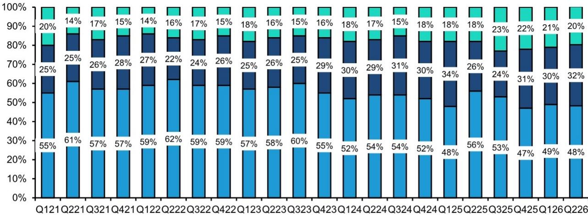
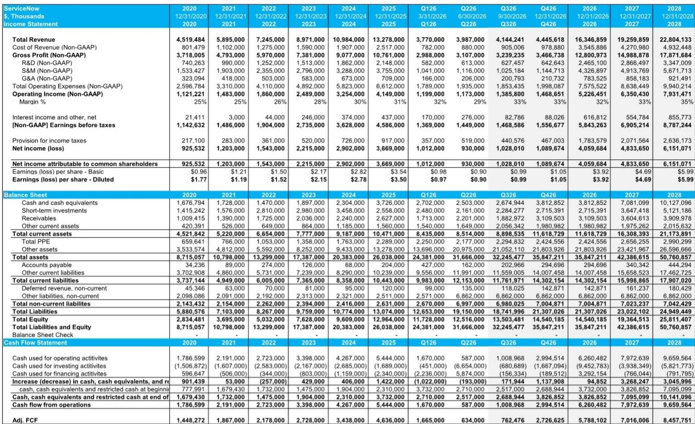

# Bernstein：该季度订阅收入表现超出公司指引230个基点

ServiceNow在2026年第二季度的表现受到市场关注。该季度订阅收入超出公司指引230个基点，其中约一半的超预期来自净新增年度合同价值（ACV）的良好表现，另一半则来自本地部署的提前续约。后者主要由企业对AI控制塔、安全与不确定性管理产品的积极需求推动。这份Bernstein研报详细分析了业绩构成，并指出市场此前对ServiceNow表现节奏、核心需求强度及收购贡献的疑虑，在本季度得到了部分改善。

报告特别强调，Q3的cRPO（当前剩余履约义务）指引实现了良好的环比增长，且不再包含收购相关的疑问。不过，由于部分本地部署收入提前确认在Q2，Q3的收入指引大约被拉低了100个基点。管理层表示对下半年保持保守指引，但需求仍然良好，这让他们有信心继续实现良好的表现。

## 1. 业绩超预期由净新增ACV和提前续约共同驱动

Q2的cRPO超预期并非单一因素所致。Bernstein在与公司CFO及CPO的沟通中确认，提前续约和净新增ACV各贡献了约一半的超预期。值得注意的是，提前续约的增加并非源于定价变化，而是客户在网络安全和AI治理需求增长的背景下，愿意扩展至AI Control Tower、安全与不确定性管理产品。

管理层认为，从Q3到Q4，cRPO的恒定汇率增速下降50个基点是一个合理估计。对于全年订阅收入指引，Q2净新增ACV超出预期的部分已全额纳入，而提前续约带来的收入则更多是时间上的转移——从Q3提前到了Q2。

> **KC评论：** 市场通常关注cRPO的相对增速，但这次需要区分背后因素。提前续约是时间平移，不改变全年总量；净新增ACV的超出预期才是增量。Bernstein的拆解让读者看清了哪些是“一次性”的，哪些是可持续的。

## 2. 收购整合进入正向循环，Armis贡献超预期但规模有限

读者此前对ServiceNow通过收购拉动增长的模式存在关注。本季度，管理层强调收购正在进入正向循环，而非简单叠加。以Armis为例，它贡献了Q2 cRPO超预期中略超10%的部分，其Q2的超出指引部分也流入了全年指引。但由于超出指引规模相对较小，Armis对全年收入的整体贡献仍约为125个基点，与上季度指引一致。

更重要的是，Armis正在推动核心安全业务的增长。通过捆绑解决方案，覆盖暴露管理、身份治理、AI治理和工作流自动化，Armis与SecOps、AI Control Tower等产品形成了“更好在一起”的平台效应。Employee Works与Moveworks的深度整合也是一个例证——Moveworks已成为用户界面的前端入口，增强了而非替代了核心平台需求。

## 3. 客户对SKU调整的担忧被管理层明确否认

研报中一个值得关注的细节是，市场曾传出ServiceNow新SKU（库存单位）体系导致客户被迫提价的传闻。管理层对此表示意外，并明确否认了这种说法。他们指出，现有客户完全可以选择留在原有SKU上，价格不变，且正常升级和支持服务照常提供。Pro Plus级别的升级是免费的。

管理层推测，这种传闻可能源于部分销售人员的过度推销行为，并承诺会进行内部调查。这一表态有助于减少市场对客户流失或定价不确定性的关注。报告同时指出，现有SKU并未被废弃，仍会持续获得功能更新和新特性，客户不会被强制迁移至新的AI原生SKU。

## 4. 公共部门与AI语音成为新增长极

公共部门需求在本季度表现良好。管理层指出，联邦预算环境相比去年有了改善，联邦、州、地方及教育客户的活跃度都在增加。需求主要集中在AI治理、网络安全和运营韧性领域。

此外，AI语音正成为客户服务和员工工作流中的一个新兴采用方向。管理层提到，航空公司等高容量的客户服务场景对AI语音代理的兴趣正在增加。ServiceNow已构建了一个多模态语音架构，可集成多个模型提供商，预计语音交互能力将逐步嵌入客户服务和员工工作流产品中。这一方向为平台打开了新的应用场景和客户群。

> **KC评论：** 公共部门的预算改善和AI语音的兴起，是ServiceNow未来几个季度可以持续跟踪的两个结构性变量。前者意味着稳定的政府订单，后者则可能带来全新的使用场景和用户粘性。Bernstein的调研提供了这两个方向的早期证据。

For informational purposes only. Portions may be generated,translated,summarized,or edited with AI assistance based on source materials and may contain omissions or errors. Please verify independently. This is not professional advice.

For informational purposes only. Portions may be generated,translated,summarized,or edited with AI assistance based on source materials and may contain omissions or errors. Please verify independently. This is not professional advice.

