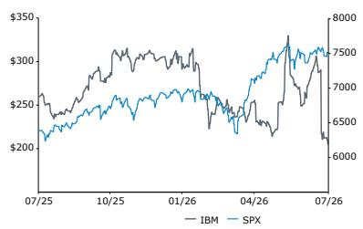
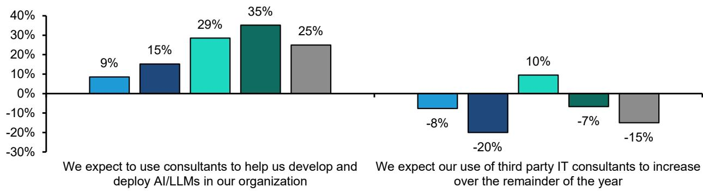
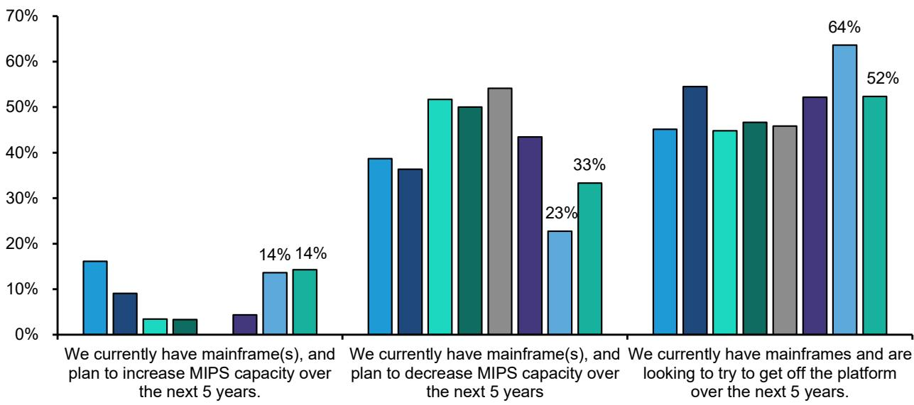
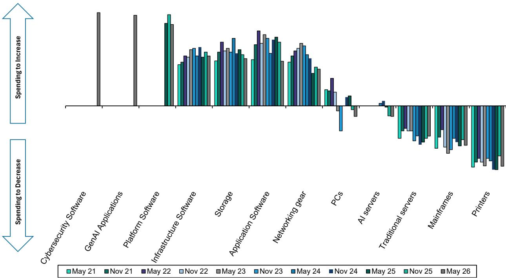
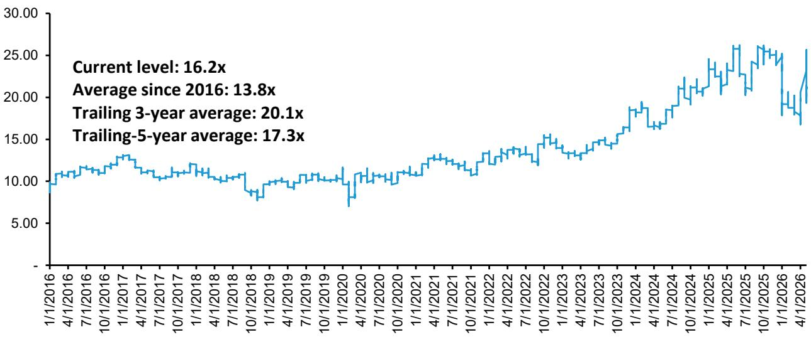
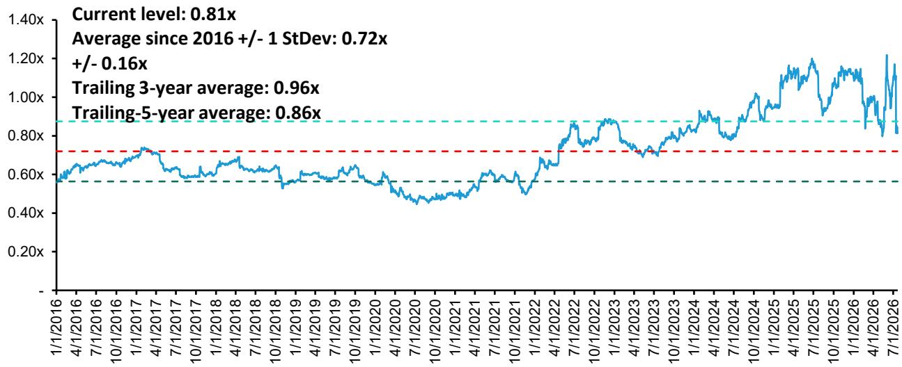

# 美国IT硬件  
# 国际商业机器公司  

市场表现评估：与市场表现一致  
市场定价参考：230.00美元（此前280.00美元）  

  

研究团队  
（联系方式已省略）  

  
  

（分析师信息已删除）  

# IBM 2026财年第二季度：基本面无实质问题；市场定价参考230美元  

IBM在昨日收盘后公布了2026财年第二季度财报。  

IBM第二季度业绩低于此前预期（此前已发布罕见的预公告），总营收172亿美元，同比增长仅1%（市场一致预期为175亿美元），每股回报2.93美元，同比增长5%。与公司预公告一致，短期波动主要源于部分交易延迟（主要涉及大型机和交易处理），原因是当前环境下的支出预算限制受内存短缺影响。  

全年营收展望略有下调，但大部分延迟交易预计将在本财年剩余时间内完成。2026财年营收增速从5%以上下调至4%–5%，大型机及相关软件方面的短期调整部分被分布式基础设施（Power服务器和存储）的增长所抵消，低端水平反映当前环境作为基准情景。2026财年软件增速从10%以上下调至6%–8%。2026财年基础设施增速从低个位数负增长上调至低个位数正增长，受益于分布式基础设施的增长以及对第二季度大型机延迟交易大部分将在2026年下半年实现的预期。2026财年咨询收入增速预期维持低至中个位数百分比。IBM继续预计自由现金流同比增加约10亿美元，经营税前利润率扩大100个基点。  

## 研究观察  

我们将市场定价参考下调至230美元，基于17倍（与5年均值一致，此前为20倍）新的2027财年每股指标。关于IBM的市场定价分析，请参见我们的笔记。  

| 调整后每股指标 | 2025A | 2026E | 2027E |
|--------------|-------|-------|-------|
| IBM（美元）   | 11.58 | 12.23 | 13.40 |
| 旧值          | --    | 12.35 | 13.93 |

| 财务数据            | 2025A    | 2026E    | 2027E    | 复合增速 |
|--------------------|----------|----------|----------|----------|
| 营收（百万美元）    | 67,527   | 70,570   | 74,486   | --       |
| 经营利润率（%）     | --       | --       | --       | --       |
| 销售成本（百万美元）| (27,343) | (28,474) | (29,123) | --       |

我们对预测进行了小幅下调，以反映最新业绩和展望。我们认为基本面没有实质问题，主要是客户面临的支出预算压力导致了一些交易延迟。我们新的2026财年和2027财年每股指标分别为12.23美元和13.40美元。  

| 收盘日期         | 2026年7月22日 |
|----------------|---------------|
| IBM收盘价（美元）| 205.77        |
| 市场定价参考（美元）| 230.00        |
| 潜在空间        | 12%           |
| 52周范围        | 332.46 / 204.44 |
| 标普500指数     | 7,498.96      |
| 财年结束         | 12月          |
| 股息率           | 3.3%          |
| 市值（百万美元）  | 193,400       |
| 企业价值（百万美元）| 250,629       |

| 表现          | 年初至今 | 1个月 | 6个月 | 12个月 |
|--------------|----------|--------|--------|---------|
| 相对涨幅（%）  | (30.5)   | (22.3) | (29.6) | (27.0)  |
| 标普500（%）   | 9.5      | 0.4    | 8.5    | 18.8    |
| 相对涨幅（%）  | (40.1)   | (22.7) | (38.1) | (45.9)  |

数据来源：彭博、Bernstein估算与分析。  

价格表现，1年  
  

| 市场定价指标        | 2025A | 2026E | 2027E |
|-------------------|-------|-------|-------|
| 调整后价格/回报倍数（x）| 17.8  | 16.8  | 15.4  |
| 相对价格/回报倍数（x）| NA    | NA    | NA    |
| 价格/增长倍数（x）  | 1.5   | 3.0   | 1.6   |
| 报告价格/回报倍数（x）| 17.8  | 16.8  | 15.4  |
| 相对报告价格/回报倍数（x）| NA | NA | NA  |
| 企业价值/自由现金流（x）| 17.0 | 16.1 | 12.8 |
| 企业价值/EBITDA（x） | 12.7 | 12.2 | 11.6 |
| 企业价值/EBIT（x）  | 17.1 | 16.0 | 14.5 |

## 详细信息  

IBM在昨日收盘后公布了2026财年第二季度财报。  

IBM第二季度业绩低于此前预期（此前已发布罕见的预公告），总营收172亿美元，同比增长仅1%（市场一致预期为175亿美元），每股回报2.93美元，同比增长5%。与公司预公告一致，短期波动主要源于部分交易延迟（主要涉及大型机和交易处理），原因是当前环境下的预算限制受内存短缺影响。  

软件：78亿美元，同比增长5%。缺口集中在交易处理（同比下降8%/按固定汇率下降9%），因为6月下旬大量客户将支出转向服务器、存储和内存以应对预期中的价格上涨。数据业务同比增长19%/按固定汇率增长18%，受益于Confluent收购后的首个完整季度。混合云（红帽）增长11%，环比加速1个百分点，订阅组合更强且消费增长稳定，OpenShift年度经常性收入（ARR）现已达22亿美元。自动化增长4%/按固定汇率增长3%，由于其订阅为主的组合，基本未受影响。约80%的软件收入为经常性收入（红帽、HashiCorp、Confluent），增长约8%，其余20%的交易收入下降高个位数。  

基础设施：38亿美元，同比下降7%。IBM Z下降42%，而分布式基础设施（Power和存储）增长37%，创下最高季度增长纪录，因企业预期内存价格上涨而重新调整优先级。  

咨询：53亿美元，持平/按固定汇率增长1%。签约增长6%，连续第二个季度，生成式AI占签约量的约50%，现在占积压订单的30%以上，客户正从AI试点转向企业级部署。  

利润率、每股回报及自由现金流。IBM经营毛利率同比下降70个基点至59.4%，经营税前利润率同比扩大30个基点至19.2%。IBM每股回报2.93美元，同比增长5%，市场一致预期为2.97美元。自由现金流为25亿美元，低于市场一致预期的29亿美元。  

## 展望下调及我们的思考  

全年营收展望略有下调，但大部分延迟交易预计将在本财年剩余时间内实现。2026财年营收增速从5%以上下调至4%–5%，大型机及相关软件方面的短期调整部分被分布式基础设施（Power服务器和存储）的增长所抵消，低端水平反映当前环境作为基准情景。2026财年软件增速从10%以上下调至6%–8%。2026财年基础设施增速从低个位数负增长上调至低个位数正增长，受益于分布式基础设施的增长以及对第二季度大型机延迟交易大部分将在2026年下半年实现的预期。2026财年咨询收入增速预期维持低至中个位数百分比。IBM继续预计自由现金流同比增加约10亿美元，经营税前利润率扩大100个基点。  

基础设施表现显著低于预期（同比下降7%），与初步指引一致。在该分部内，IBM Z收入下降42%，而分布式基础设施（Power和存储）增长37%。关于大型机业务，管理层强调没有证据表明客户正在迁移离开该平台，IBM Z仍支撑全球超过70%的交易价值。管理层将基础设施内部的分化归因于第二季度末客户支出转向，客户优先购买服务器、存储和内存，以确保受供应限制的基础设施，应对预期的价格上涨。在后续沟通中，我们就尽管近期大型机表现短期波动，为何上调2026财年基础设施增速预期（从低个位数负增长到低个位数正增长）进行了询问。管理层表示：（1）此次上调中大型机假设保持不变；（2）Power和存储的需求显著增强；（3）创纪录的5亿美元积压订单预计将在第三季度大部分转化为收入。  

软件方面，数据业务（+18%）和红帽（+11%）加速增长，软肋是交易处理（-9%），这是IBM Z大型机波动的直接溢出。管理层指出，许多客户通过企业许可协议（ELA）购买大型机硬件及相关软件栈，其中通常包含大量交易处理软件。因此，大型机采购活动减少对该软件类别产生了相应影响。相比之下，基于订阅和消费的软件产品通常被视为运营费用而非资本支出，因此基本未受近期资本支出动态的影响。还提到，约80%的年度软件收入是经常性收入，来自订阅和消费产品（如红帽、HashiCorp、Confluent）。  

报告的数据业务增长19%/按固定汇率增长18%，主要得益于Confluent的纳入，有机数据收入可能持平。Confluent在2025年第二季度产生约2.82亿美元收入；按21%的增速（鉴于Confluent的历史增长轨迹以及IBM称其业务开局良好）推算，2026年第二季度收入约为3.42亿美元。在估计总数据业务收入约18亿美元的基础上，这意味着不含Confluent的数据业务收入约14.58亿美元，同比下降约3%（假设2025年第二季度数据业务收入约15亿美元）。管理层将短期波动归因于大型机企业许可协议的延迟，指出约60%受影响的软件是交易处理，但相当一部分还包括数据业务和自动化软件。这表明IBM数据业务和自动化软件组合中有相当一部分仍与大型机相关，可能受到大型机短期波动的影响。  

咨询收入53亿美元，持平/按固定汇率增长1%，生成式AI现占签约量的约50%，积压订单的30%以上，客户正从AI试点转向企业级部署。这与我们更广泛的行业判断一致，即企业正从AI实验转向大规模采用，因为越来越多组织认识到AI可以带来的生产力提升和潜在回报。然而，我们的CIO调查对外部顾问需求给出了更谨慎的信号：净25%的CIO现在期望使用顾问部署AI，低于上次调查的净35%，表明尽管内部AI采用加速，但对外部支持的兴趣减弱。更值得注意的是，净-15%的CIO预计其咨询支出将在2026年剩余时间内增加，这可能预示着未来面临一定阻力。  

## 我们下调预测及市场定价参考至230美元（基于17倍新的2027财年每股指标）  

我们对预测进行了小幅下调，以反映最新业绩和展望。我们认为基本面没有实质问题，主要是客户面临的支出预算压力导致了一些交易延迟。我们新的2026财年和2027财年每股指标分别为12.23美元和13.40美元。我们还将市场定价参考下调至230美元，基于17倍（与5年均值一致，此前为20倍）新的2027财年每股指标。  

**图表1：IBM模型调整前后对比**  

| （百万美元）      | 2026E    | 旧值     | 差异    | 2027E    | 旧值     | 差异    | 2028E    | 旧值     | 差异    |
|------------------|----------|----------|---------|----------|----------|---------|----------|----------|---------|
| 总营收           | 70,570   | 71,975   | (2.0)%  | 74,486   | 75,604   | (1.5)%  | 79,260   | 80,769   | (1.9)%  |
| 软件营收         | 32,108   | 33,140   | (3.1)%  | 35,242   | 36,612   | (3.7)%  | 38,592   | 40,173   | (3.9)%  |
| 咨询营收         | 21,646   | 21,827   | (0.8)%  | 22,295   | 22,482   | (0.8)%  | 22,741   | 22,931   | (0.8)%  |
| 基础设施营收     | 15,879   | 16,117   | (1.5)%  | 16,054   | 15,633   | 2.7%    | 17,025   | 16,781   | 1.5%    |
| 总税前利润       | 13,719   | 13,859   | (1.0)%  | 15,123   | 15,722   | (3.8)%  | 16,708   | 17,415   | (4.1)%  |
| 税前利润率%      | 19.4%    | 19.3%    | 19bps   | 20.3%    | 20.8%    | -49bps   | 21.1%    | 21.6%    | -48bps   |
| 软件税前利润     | 10,981   | 12,007   | (8.5)%  | 12,054   | 13,211   | (8.8)%  | 13,200   | 14,496   | (8.9)%  |
| 软件税前利润率%   | 34.2%    | 36.2%    | -203bps | 34.2%    | 36.1%    | -188bps | 34.2%    | 36.1%    | -188bps |
| 咨询税前利润     | 2,586    | 2,986    | (13.4)% | 2,663    | 3,076    | (13.4)% | 2,739    | 3,160    | (13.3)% |
| 咨询税前利润率%   | 11.9%    | 13.7%    | -174bps | 11.9%    | 13.7%    | -174bps | 12.0%    | 13.8%    | -174bps |
| 基础设施税前利润 | 3,449    | 2,550    | 35.2%   | 3,488    | 2,345    | 48.7%   | 3,742    | 2,559    | 46.2%   |
| 基础设施税前利润率%| 21.7%   | 15.8%    | 590bps  | 21.7%    | 15.0%    | 673bps  | 22.0%    | 15.3%    | 673bps  |
| 每股指标（美元）  | 12.23    | 12.35    | (1.0)%  | 13.40    | 13.93    | (3.8)%  | 14.73    | 15.35    | (4.0)%  |

数据来源：公司报告、Bernstein估算与分析  

**图表2：IBM实际 vs Bernstein预测 vs 市场一致预期**  

| （百万美元）      | 报告值   | Bernstein | 差异    | 市场一致预期 | 差异    |
|------------------|----------|-----------|---------|--------------|---------|
| 营收             | 17,162   | 17,961    | -4.4%   | 17,529       | -2.1%   |
| 软件营收         | 7,761    | 8,142     | (4.7)%  | 7,998        | (3.0)%  |
| 咨询营收         | 5,327    | 5,508     | (3.3)%  | 5,398        | (1.3)%  |
| 基础设施营收     | 3,835    | 4,118     | (6.9)%  | 3,966        | (3.3)%  |
| 毛利润           | 10,194   | 10,778    | -5.4%   | 10,422       | -2.2%   |
| 毛利率%          | 59.4%    | 60.0%     | -61bps  | 59.5%        | -6bps   |
| 税前利润         | 3,290    | 3,464     | -5.0%   | 3,537        | -7.0%   |
| 税前利润率%      | 19.2%    | 19.3%     | -12bps  | 20.2%        | -101bps |
| 软件税前利润     | 2,502    | 2,809     | (10.9)% | 2,493        | 0.4%    |
| 软件税前利润率%   | 32.2%    | 34.5%     | -226bps | 31.2%        | 107bps  |
| 咨询税前利润     | 647      | 716       | (9.6)%  | 592          | 9.2%    |
| 咨询税前利润率%   | 12.1%    | 13.0%     | -85bps  | 11.0%        | 117bps  |
| 基础设施税前利润 | 835      | 638       | 30.8%   | 784          | 6.5%    |
| 基础设施税前利润率%| 21.8%   | 15.5%     | 627bps  | 19.8%        | 202bps  |
| 净利润           | 2,792    | 2,944     | -5.2%   | 2,820        | -1.0%   |
| 每股指标（美元）  | 2.93     | 3.09      | -5.2%   | 2.97         | -1.4%   |

数据来源：彭博、公司报告、Bernstein估算与分析  

**图表3：IBM市场一致预期 vs Bernstein预测**  

| IBM                | 2026    | 2027    | 2028    |
|--------------------|---------|---------|---------|
| 营收（百万美元）   |         |         |         |
| 市场一致预期       | 70,584  | 73,411  | 77,290  |
| 实际/Bernstein预测 | 70,570  | 74,486  | 79,260  |
| Bernstein vs 一致   | 0.0%    | 1.5%    | 2.5%    |
| 税前利润率%        | 19.5%   | 20.2%   | 20.8%   |
| vs Bernstein       | 19.4%   | 20.3%   | 21.1%   |
| 每股指标（美元）   |         |         |         |
| 市场一致预期       | 12.21   | 13.12   | 14.32   |
| 实际/Bernstein预测 | 12.23   | 13.40   | 14.73   |
| Bernstein vs 一致   | 0.1%    | 2.1%    | 2.9%    |

数据来源：彭博、Bernstein估算与分析  

**图表4：Bernstein预测 vs 实际营收增速（GAAP，非固定汇率）**  

|                     | 2026年第二季度 |          |        |
|---------------------|----------------|----------|--------|
|                     | 我们的预测     | 实际值   | 差异   |
| 混合云（红帽）       | 10.0%          | 11.0%    | 1.0%   |
| 自动化              | 10.0%          | 3.0%     | -7.0%  |
| 数据业务            | 20.0%          | 18.0%    | -2.0%  |
| 交易处理            | 4.0%           | -9.0%    | -13.0% |
| 软件分部            | 10.2%          | 5.0%     | -5.2%  |
| 战略与技术          | 3.5%           | 1.0%     | -2.5%  |
| 智能运营            | 3.5%           | 1.0%     | -2.5%  |
| 咨询分部            | 3.5%           | 1.0%     | -2.5%  |
| 混合基础设施        | 1.0%           | -10.0%   | -11.0% |
| 基础设施支持        | -3.0%          | -1.0%    | 2.0%   |
| 基础设施分部        | -0.2%          | -7.0%    | -6.8%  |
| 融资分部            | 1.0%           | 11.0%    | 10.0%  |
| IBM总营收           | 5.8%           | 1.0%     | -4.8%  |
| 汇率影响            | 0.0%           | 0.0%     | 0.0%   |

数据来源：公司报告、Bernstein估算与分析  

**图表5：CIO对咨询的看法**  
  
数据来源：Bernstein CIO调查  

**图表6：CIO对大型机的看法**  
  
2018年11月 2019年11月 2020年11月 2021年11月 2022年11月 2023年11月 2025年11月 2026年5月  

数据来源：Bernstein CIO调查  

**图表7：CIO计划增减IT支出类别的加权百分比**  
  
数据来源：Bernstein CIO调查  

**图表8：IBM价格/回报倍数**  
IBM远期价格/回报倍数，2016年至今  
  
数据来源：彭博（截至2026年7月22日），Bernstein分析  

## 图表9：IBM相对价格/回报倍数  

IBM相对价格/回报倍数，2016年至今  
  
数据来源：彭博（截至2026年7月22日），Bernstein分析与预测  

## 附录 - 财务预测  

## 图表10：IBM利润表  

| （百万美元）IBM利润表 | 2024    | 2025    | 2026E   | 2027E   | 2028E   | 2025年第四季度 | 2026年第一季度 | 2026年第二季度 | 2026年第三季度E | 2026年第四季度E |
|----------------------|---------|---------|---------|---------|---------|----------------|----------------|----------------|----------------|----------------|
| **备考非GAAP利润表** |         |         |         |         |         |                |                |                |                |                |
| 营收                 | 62,754  | 67,527  | 70,570  | 74,486  | 79,260  | 19,686         | 15,917         | 17,162         | 17,004         | 20,487         |
| 销售成本             | 26,479  | 27,343  | 28,474  | 29,123  | 30,262  | 7,527          | 6,730          | 6,968          | 6,904          | 7,872          |
| 毛利润               | 36,275  | 40,184  | 42,097  | 45,363  | 48,999  | 12,159         | 9,187          | 10,194         | 10,100         | 12,616         |
| 毛利率%              | 57.8%   | 59.5%   | 59.7%   | 60.9%   | 61.8%   | 61.8%          | 57.7%          | 59.4%          | 59.4%          | 61.6%          |
| 销售、一般及行政费用| 18,529  | 18,706  | 18,733  | 19,805  | 21,075  | 5,100          | 4,682          | 4,560          | 4,746          | 4,746          |
| 研发及工程费用       | 7,479   | 8,312   | 8,824   | 9,056   | 9,636   | 2,187          | 2,173          | 2,311          | 2,170          | 2,170          |
| 知识产权及定制开发收入| (996)   | (964)   | (842)   | (1,052) | (1,119) | (277)          | (172)          | (166)          | (252)          | (252)          |
| 其他（收入）/费用    | (1,656) | (517)   | (307)   | 308     | 440     | (74)           | (98)           | (280)          | (334)          | 405            |
| 利息费用             | 1,712   | 1,935   | 1,977   | 2,123   | 2,259   | 478            | 473            | 486            | 509            | 509            |
| 税前利润             | 11,207  | 12,712  | 13,712  | 15,123  | 16,708  | 4,745          | 2,129          | 3,290          | 3,262          | 5,038          |
| 税前利润率%          | 17.9%   | 18.8%   | 19.4%   | 20.3%   | 21.1%   | 24.1%          | 13.4%          | 19.2%          | 19.2%          | 24.6%          |
| 税项                 | 1,523   | 1,719   | 2,051   | 2,269   | 2,506   | 438            | 308            | 498            | 489            | 756            |
| 持续经营净利润       | 9,684   | 10,993  | 11,661  | 12,855  | 14,202  | 4,307          | 1,821          | 2,792          | 2,772          | 4,283          |
| 净利率%              | 15.4%   | 16.3%   | 16.5%   | 17.3%   | 17.9%   | 21.9%          | 11.4%          | 16.3%          | 16.3%          | 20.9%          |
| 稀释后每股指标（美元）| 10.32   | 11.58   | 12.23   | 13.40   | 14.73   | 4.52           | 1.91           | 2.93           | 2.90           | 4.48           |
| 每股股息（美元）     | 6.67    | 6.71    | 6.75    | 6.79    | 6.83    | 1.68           | 1.68           | 1.69           | 1.69           | 1.69           |
| 平均股数（稀释后）   | 938.2   | 949.6   | 953.8   | 959.4   | 964.1   | 952.4          | 952.1          | 953.3          | 954.6          | 955.9          |
| **增速%**            |         |         |         |         |         |                |                |                |                |                |
| 营收                 | 1.4%    | 7.6%    | 4.5%    | 5.5%    | 6.4%    | 12.1%          | 9.5%           | 1.1%           | 4.1%           | 4.1%           |
| 毛利润               | 3.8%    | 10.8%   | 4.8%    | 7.8%    | 8.0%    | 14.4%          | 11.6%          | (0.1%)         | 5.3%           | 3.8%           |
| 销售、一般及行政费用 | 3.2%    | 1.0%    | 0.1%    | 5.7%    | 6.4%    | 11.8%          | 3.3%           | (2.5%)         | 8.0%           | (7.0%)         |
| 研发及工程费用       | 10.4%   | 11.1%   | 6.2%    | 2.6%    | 6.4%    | 11.2%          | 11.7%          | 10.2%          | 4.2%           | (0.8%)         |
| 经营费用             | 1.8%    | 9.6%    | 3.3%    | 6.5%    | 6.8%    | 16.6%          | 8.7%           | (1.5%)         | 4.3%           | 2.2%           |
| 税前利润             | 8.7%    | 13.4%   | 7.9%    | 10.3%   | 10.5%   | 11.1%          | 22.5%          | 2.9%           | 7.5%           | 6.2%           |
| 净利润               | 9.2%    | 13.5%   | 6.1%    | 10.2%   | 10.5%   | 16.7%          | 20.0%          | 5.3%           | 10.1%          | (0.6%)         |
| 稀释后每股指标       | 7.5%    | 12.2%   | 5.6%    | 9.6%    | 9.9%    | 15.5%          | 19.2%          | 4.7%           | 9.5%           | (0.9%)         |
| 估计汇率影响         | (1.1%)  | (1.2%)  | 0.1%    | -       | -       | 1.8%           | 3.0%           | 0.1%           | (1.5%)         | (1.0%)         |
| 隐含固定汇率增速     | 2.5%    | 8.8%    | 4.4%    | 5.5%    | 6.4%    | 10.3%          | 6.5%           | 1.0%           | 5.6%           | 5.1%           |

数据来源：公司报告、Bernstein估算与分析  

**图表11：IBM资产负债表**  

| （百万美元）IBM资产负债表 | 2024    | 2025    | 2026E   | 2027E   | 2028E   | 2025年第四季度 | 2026年第一季度 | 2026年第二季度 | 2026年第三季度E | 2026年第四季度E |
|--------------------------|---------|---------|---------|---------|---------|----------------|----------------|----------------|----------------|----------------|
| **资产**                 |         |         |         |         |         |                |                |                |                |                |
| 现金及现金等价物         | 14,161  | 13,641  | 9,691   | 13,057  | 9,245   | 13,641         | 10,864         | 7,217          | 10,127         | 9,691          |
| 应收账款                 | 7,751   | 9,164   | 9,879   | 10,453  | 11,123  | 9,164          | 7,735          | 7,392          | 8,199          | 9,879          |
| 存货                     | 1,289   | 1,220   | 1,294   | 1,338   | 1,391   | 1,220          | 1,476          | 1,746          | 1,135          | 1,294          |
| 短期融资应收款           | 7,159   | 8,475   | 7,761   | 7,839   | 9,265   | 8,475          | 6,510          | 6,656          | 8,672          | 7,761          |
| 其他流动资产             | 4,123   | 4,444   | 5,467   | 5,729   | 5,319   | 4,444          | 5,329          | 5,387          | 4,701          | 5,467          |
| 流动资产合计             | 34,483  | 36,944  | 34,092  | 38,416  | 36,343  | 36,944         | 31,914         | 28,398         | 32,834         | 34,092         |
| 固定资产及经营租赁使用权资产| 8,928  | 9,028   | 9,079   | 9,319   | 9,711   | 9,028          | 9,000          | 8,804          | 9,009          | 9,079          |
| 预付养老金资产           | 8,280   | 8,369   | 10,414  | 11,102  | 11,855  | 8,369          | 8,409          | 8,480          | 9,398          | 10,414         |
| 商誉                     | 60,706  | 67,717  | 76,100  | 79,101  | 82,102  | 67,717         | 74,709         | 74,599         | 75,349         | 76,100         |
| 无形资产                 | 10,660  | 11,391  | 13,633  | 13,931  | 12,009  | 11,391         | 14,624         | 13,955         | 13,794         | 13,633         |
| 投资、递延税项及其他资产 | 8,765   | 10,722  | 11,952  | 14,102  | 16,341  | 10,722         | 10,561         | 10,737         | 9,998          | 11,952         |
| 长期融资应收款           | 5,353   | 7,708   | 8,309   | 8,392   | 8,427   | 7,708          | 7,014          | 7,126          | 9,284          | 8,309          |
| 非流动资产合计           | 102,692 | 114,935 | 129,487 | 135,947 | 140,445 | 114,935        | 124,317        | 123,701        | 126,833        | 129,487        |
| 资产总计                 | 137,175 | 151,879 | 163,579 | 174,363 | 176,789 | 151,879        | 156,231        | 152,099        | 159,667        | 163,579        |
| **负债及股东权益**       |         |         |         |         |         |                |                |                |                |                |
| 应付账款                 | 4,032   | 4,756   | 4,939   | 5,226   | 5,561   | 4,756          | 4,039          | 4,395          | 4,100          | 4,939          |
| 递延收入                 | 13,907  | 16,101  | 16,054  | 17,621  | 19,296  | 16,101         | 17,034         | 16,160         | 16,054         | 16,054         |
| 短期债务                 | 5,089   | 6,424   | 5,775   | 5,775   | 5,775   | 6,424          | 8,655          | 5,775          | 5,775          | 5,775          |
| 其他流动负债             | 10,114  | 11,377  | 11,103  | 11,713  | 12,073  | 11,377         | 10,373         | 9,582          | 10,675         | 11,103         |
| 流动负债合计             | 33,142  | 38,658  | 37,871  | 40,335  | 42,705  | 38,658         | 40,101         | 35,912         | 36,603         | 37,871         |
| 长期债务                 | 49,884  | 54,836  | 56,212  | 56,212  | 50,000  | 54,836         | 57,706         | 56,212         | 56,212         | 56,212         |
| 退休义务                 | 9,432   | 9,018   | 11,351  | 12,096  | 12,916  | 9,018          | 8,763          | 8,603          | 11,351         | 11,351         |
| 其他长期负债             | 17,325  | 16,628  | 19,859  | 21,102  | 22,602  | 16,628         | 16,605         | 16,831         | 19,826         | 19,859         |
| 非流动负债合计           | 76,641  | 80,482  | 87,422  | 89,410  | 85,519  | 80,482         | 83,074         | 81,646         | 87,388         | 87,422         |
| 负债合计                 | 109,783 | 119,140 | 125,293 | 129,746 | 128,224 | 119,140        | 123,175        | 117,558        | 123,992        | 125,293        |
| 股东权益                 | 27,306  | 32,648  | 38,198  | 44,530  | 48,476  | 32,648         | 32,974         | 34,452         | 35,587         | 38,198         |
| 非控制权益               | 86      | 93      | 89      | 89      | 89      | 93             | 81             | 89             | 89             | 89             |
| 权益合计                 | 27,392  | 32,741  | 38,287  | 44,619  | 48,565  | 32,740         | 33,055         | 34,541         | 35,676         | 38,287         |
| 负债及权益总计           | 137,175 | 151,881 | 163,580 | 174,364 | 176,789 | 151,880        | 156,230        | 152,099        | 159,668        | 163,580        |

数据来源：公司报告、Bernstein估算与分析  

**图表12：IBM现金流量表**  

| （百万美元）IBM现金流量表 | 2024    | 2025    | 2026E   | 2027E   | 2028E   | 2025年第四季度 | 2026年第一季度 | 2026年第二季度 | 2026年第三季度E | 2026年第四季度E |
|--------------------------|---------|---------|---------|---------|---------|----------------|----------------|----------------|----------------|----------------|
| 净利润                   | 6,023   | 10,593  | 10,083  | 12,212  | 9,739   | 5,600          | 1,216          | 2,165          | 2,634          | 4,068          |
| 折旧与摊销               | 4,667   | 5,021   | 4,894   | 4,425   | 4,538   | 1,296          | 1,274          | 1,349          | 1,133          | 1,137          |
| 其他                     | 2,755   | (2,421) | 598     | 3,290   | 3,065   | (2,856)        | 2,679          | (917)          | (667)          | (497)          |
| 经营活动现金流量         | 13,445  | 13,193  | 15,574  | 19,927  | 17,342  | 4,040          | 5,169          | 2,597          | 3,100          | 4,709          |
| 资本支出（净处置）       | (490)   | (970)   | (664)   | (467)   | (673)   | (379)          | (224)          | (206)          | (117)          | (117)          |
| 软件投资                 | (637)   | (647)   | (629)   | (616)   | (619)   | (171)          | (159)          | (154)          | (158)          | (158)          |
| 收购（净处置）           | (2,591) | (8,295) | (11,980)| (3,001) | (3,001) | (391)          | (10,464)       | (15)           | (750)          | (750)          |
| 其他                     | (1,219) | (390)   | (558)   | (1,621) | (1,621) | 2,358          | 358            | (106)          | (405)          | (405)          |
| 投资活动现金流量         | (4,937) | (10,302)| (13,830)| (5,705) | (5,913) | 1,417          | (10,489)       | (481)          | (1,430)        | (1,430)        |
| 债务净收入               | (880)   | 2,873   | 296     | -       | (6,212) | (1,810)        | 4,509          | (4,213)        | -              | -              |
| 股份回购                 | -       | (1,018) | (1,098) | (1,265) | (1,265) | (167)          | (350)          | (115)          | (316)          | (316)          |
| 股息                     | (6,147) | (6,255) | (6,355) | (6,430) | (6,466) | (1,574)        | (1,576)        | (1,590)        | (1,593)        | (1,596)        |
| 其他                     | (52)    | 571     | 1,674   | (3,162) | (1,299) | 145            | 136            | 191            | 3,150          | (1,803)        |
| 融资活动现金流量         | (7,079) | (3,829) | (5,482) | (10,856)| (15,242)| (3,406)        | 2,719          | (5,727)        | 1,240          | (3,715)        |
| 自由现金流               | 12,398  | 12,102  | 14,911  | 19,460  | 16,669  | 3,490          | 4,786          | 2,237          | 2,983          | 4,592          |
| 每股自由现金流（美元）   | 13.21   | 12.74   | 15.63   | 20.28   | 17.29   | 3.66           | 5.03           | 2.35           | 3.13           | 4.80           |
| 自由现金流率%            | 19.8%   | 17.9%   | 21.1%   | 26.1%   | 21.0%   | 17.7%          | 30.1%          | 13.0%          | 17.5%          | 22.4%          |
| 自由现金流（不含融资应收）| 12,749  | 14,721  | 15,519  | 19,551  | 16,761  | 7,553          | 2,220          | 2,539          | 967            | 5,502          |

数据来源：公司报告、Bernstein估算与分析  

## Bernstein参考表  

|                     | 2026年7月22日 |         |              | TTM    | 调整后每股指标   |          |          | 调整后价格/回报倍数 |          |          |
|---------------------|---------------|---------|--------------|--------|----------------|----------|----------|-------------------|----------|----------|
|                     | 收盘价         | 市场定价参考 | 相对表现      | 货币   | 2025A          | 2026E    | 2027E    | 2025A            | 2026E    | 2027E    |
| IBM (IBM)           | 205.77        | 230.00  | (45.9)%      | 美元   | 11.58          | 12.23    | 13.40    | 17.8             | 16.8     | 15.4     |
| 旧值                |               | 280.00  |              |        |                | 12.35    | 13.93    |                  |          |          |
| 标普500指数         | 7,498.96      |         |              |        |                |          |          |                  |          |          |

**市场定价参考变动/预测变动以粗体显示**  
（评级定义及分类等法律声明已省略）  

（本笔记仅为研究观点分享，不构成任何操作建议。市场有风险，决策需谨慎。）
