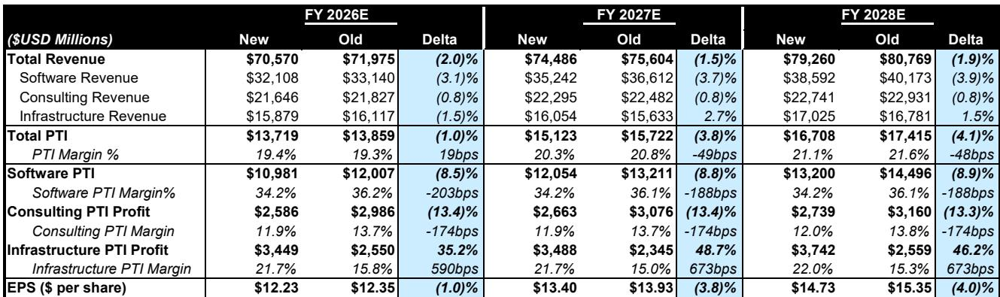

# Bernstein：IBMF业务与近期数据观察

IBM 在 7 月 22 日发布 FQ2 2026 财报前预先发布，最终收入 172 亿美元，同比增长 1%，与共识预期的 175 亿美元存在差距。每股回报 2.93 美元，同比增长 5%，同样略低于共识预期。Bernstein在最新研究记录中给出的核心观点是：IBM 未出现结构性变化，季度表现主要受客户在内存短缺和价格上涨环境下重新分配资金预算影响，导致部分大型机及交易处理软件订单调整到下半年。

这份报告的关键不在于季度数字本身，而在于它揭示了企业 IT 支出在当前环境下的真实优先级排序——客户倾向于调整大型机升级计划，优先采购分布式基础设施（Power 服务器和存储），以锁定供应紧张的硬件资源。

## 1. 基础设施内部出现明显分化：大型机下降 42%，分布式增长 37%

IBM 基础设施部门整体收入 38 亿美元，同比下降 7%。但内部结构差异显著：IBM Z（大型机）收入下降 42%，而分布式基础设施（Power 服务器和存储）增长 37%，达到该板块有记录以来的最高季度增速。

管理层在后续沟通中强调，没有证据表明客户正在迁移离开大型机平台——IBM Z 仍然支撑着全球超过 70% 的交易价值。订单调整的原因是客户在 6 月底集中将资金转向服务器、存储和内存采购，以应对预期中的价格上涨。Bernstein分析师指出，这一行为模式与内存短缺导致的硬件涨价预期直接相关，属于临时性资金再分配，而非需求结构发生根本变化。

> **KC评论：** 大型机下降 42% 和分布式增长 37% 同时出现，说明企业 IT 采购决策正在被供应链预期而非长期战略驱动。如果内存价格在下半年趋于稳定，之前调整的大型机订单可能会有所改善，这一假设需要后续季度验证。

## 2. 软件收入中 80% 的经常性部分保持稳定，交易型部分表现不同

软件部门收入 78 亿美元，同比增长 5%。其中 Red Hat 增长 11%，Data 业务（含 Confluent 首个完整季度贡献）增长 19%，Automation 增长 4%。但 Transaction Processing 收入下降 9%，是软件板块的主要变动因素。

Bernstein分析指出，约 80% 的软件收入来自 Red Hat、HashiCorp、Confluent 等订阅和消费模式产品，这部分增长约 8%，基本不受资金支出周期影响。而剩余 20% 的交易型软件收入下降高个位数，与大型机订单调整直接相关——许多客户通过企业许可协议（ELA）同时采购大型机硬件和配套软件，硬件采购节奏变化自然影响交易处理软件。

报告还拆解了 Data 业务的实际增长质量：包含 Confluent 后的 Data 收入增长 19%，但剔除 Confluent 约 3.42 亿美元的贡献后，有机 Data 收入同比有所减少。管理层承认，约 60% 受影响的软件属于 Transaction Processing，但 Data 和 Automation 软件中也有相当比例与大型机绑定。

## 3. 咨询业务维持平稳，CIO 调查显示外部咨询需求可能出现变化

咨询部门收入 53 亿美元，同比持平。生成式 AI 相关签约占比达到 50%，占积压订单超过 30%，表明客户正在从 AI 试点向企业级部署过渡。签约额连续第二个季度增长 6%。

但Bernstein的 CIO 调查提供了另一层信息：净 25% 的 CIO 预计将使用第三方咨询公司部署 AI，低于上一轮调查的净 35%。更关键的是，净 15% 的 CIO 预计其 2026 年剩余时间的咨询支出将有所减少。报告认为，这暗示企业内部 AI 能力建设正在加速，但对外部咨询服务的需求可能面临调整。

## 更新观察：基本面未出现变化

基于最新财报和指引，Bernstein将 FY26 和 FY27 每股回报预测分别更新至 12.23 美元和 13.40 美元，对应 17 倍 FY27 预期市场定价倍数，与五年均值持平。

管理层将 FY26 收入增长指引从 5% 以上更新为 4%-5%，软件增长从 10% 以上更新为 6%-8%，但基础设施增长指引从低个位数负值调整为低个位数正值。调整的主要依据是分布式基础设施需求显著增强，以及之前积累的 5 亿美元积压订单预计在 Q3 确认为收入。公司仍预期全年自由现金流同比增加约 10 亿美元，营业利润率扩张 100 个基点。

> **KC评论：** Bernstein将市场定价倍数从 20 倍调整为 17 倍，与五年均值对齐，反映的是对收入可见度的重新评估，而非对 IBM 长期竞争力的否定。报告反复强调业务基础未变，但市场定价调整本身说明市场对大型机周期性和咨询业务增速节奏变化的关注度有所提升。

这份研究记录最有价值的部分不是季度数字本身，而是它提供了一个观察企业 IT 支出优先级变化的窗口：在硬件涨价预期下，客户愿意调整大型机升级计划来确保分布式基础设施供应，而订阅制软件和咨询业务则表现出不同的特征。对于跟踪企业技术支出的读者来说，IBM 的订单调整和恢复节奏，可能比季度收入数字更能反映宏观环境对 IT 预算的真实影响。

For informational purposes only. Portions may be generated,translated,summarized,or edited with AI assistance based on source materials and may contain omissions or errors. Please verify independently. This is not research,legal,tax,accounting,or other professional advice.

For informational purposes only. Portions may be generated,translated,summarized,or edited with AI assistance based on source materials and may contain omissions or errors. Please verify independently. This is not research,legal,tax,accounting,or other professional advice.

