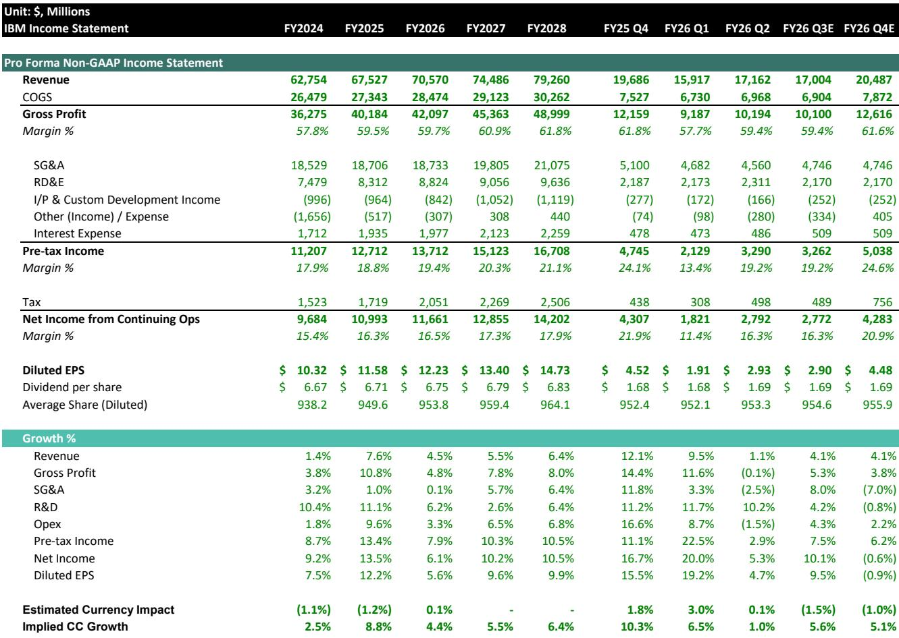
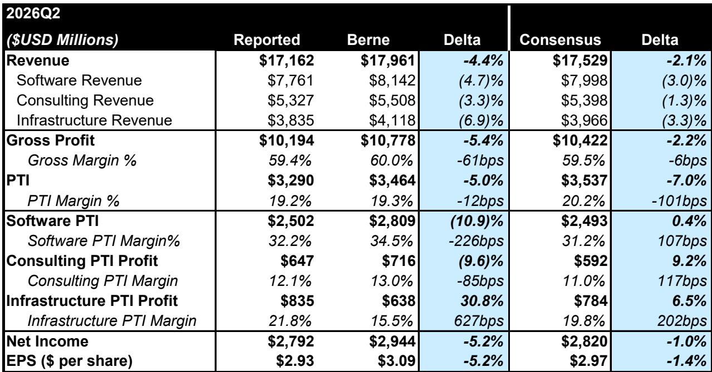
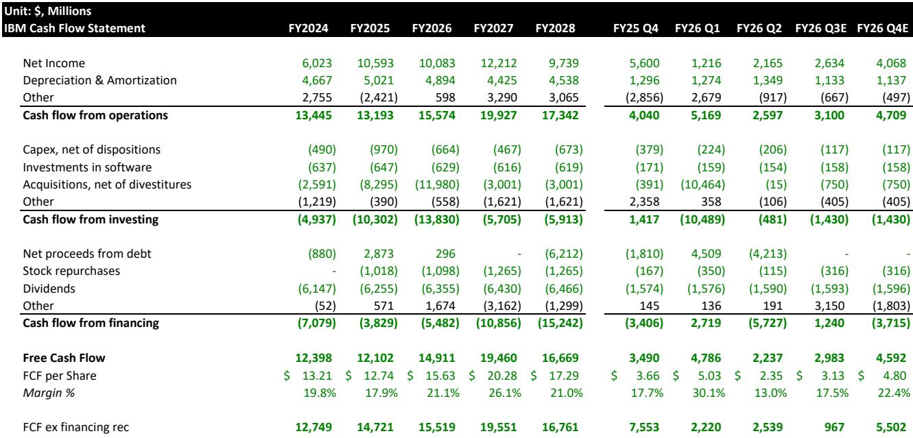

# IBM's Mainframe Air Pocket Is a Customer Budget Squeeze, Not a Platform Rejection

IBM's fiscal second quarter of 2026 revealed a company that remains fundamentally intact but is experiencing a rare and instructive dislocation. Revenue came in at $17.2 billion, growing just 1% year over year against consensus expectations of $17.5 billion, while earnings per share of $2.93 missed the $2.97 consensus by a narrow margin. The headline numbers alone would suggest a company losing momentum. But the real story lies beneath the aggregate figures: IBM's miss was not driven by competitive displacement, product failure, or strategic missteps. It was driven by a sudden, severe shift in customer capital expenditure priorities as memory shortages and anticipated price increases forced enterprises to redirect spending away from mainframes and transaction processing toward distributed infrastructure. This is a timing problem, not a structural one. Yet the implications for IBM's near-term valuation, segment mix, and market perception are material enough to warrant a recalibrated view.

The quarter's weakness was concentrated and self-contained. Mainframe revenue collapsed 42% year over year, and transaction processing software—which is tightly coupled with mainframe hardware through enterprise license agreements—fell 9% in constant currency. Meanwhile, distributed infrastructure, comprising Power servers and storage, surged 37% in what management described as the segment's best quarterly growth on record. The pattern is unmistakable: customers made a tactical pivot in late June, pulling forward spending on servers, storage, and memory to secure supply-constrained components before prices rose, and in doing so, they pushed mainframe and associated software purchases into the back half of the year. The question for market observers is whether this dynamic is genuinely transitory or whether it signals a deeper shift in how IBM's customers allocate their technology budgets.

Management's response was measured and consistent. Full-year fiscal 2026 revenue growth outlook was trimmed to 4-5% from 5% or more, and software growth was revised down to 6-8% from the prior 10% or more. Infrastructure growth expectations were actually raised from low-single-digit negative to low-single-digit positive, reflecting the strength in Power and storage and the expectation that most of the slipped mainframe deals will close in the second half. Free cash flow outlook of roughly $1 billion year-over-year improvement and 100 basis points of operating pretax margin expansion remained unchanged. The message from the C-suite was clear: nothing is broken. The deals are not lost. They are delayed.

But a delay is not costless. The shift in revenue timing has consequences for margins, earnings trajectory, and the multiple the market is willing to assign. The implied forward multiple on fiscal 2027 earnings per share has compressed to roughly 15 times, down from 20 times previously. That multiple compression alone signals that the market is not fully accepting the "temporary dislocation" narrative at face value.

## The Q2 Miss Was Concentrated in Mainframe and Transaction Processing, Confirming a Capex Reallocation Event Rather Than a Demand Deterioration

The anatomy of IBM's second quarter is instructive precisely because the weakness was so narrowly contained. Total software revenue of $7.8 billion grew 5% year over year, but that headline number masks a sharp divergence within the segment. Hybrid Cloud, led by Red Hat, grew 11% and accelerated sequentially on stronger subscription mix, with OpenShift annualized recurring revenue now at $2.2 billion. Data grew 19%, though that figure was materially inflated by the first full quarter of Confluent's contribution. Excluding Confluent, organic Data revenue was likely flattish to slightly down, as the acquisition contributed roughly $342 million in the quarter against an estimated total Data revenue of $1.8 billion. Automation grew only 3%, a deceleration that management attributed to the same mainframe-linked enterprise license agreement dynamic affecting transaction processing.

The critical insight here is that approximately 80% of IBM's software revenue is recurring, driven by subscription and consumption-based products such as Red Hat, HashiCorp, and Confluent. That recurring base grew roughly 8% in the quarter. The remaining 20%, which is transactional and tied to mainframe purchasing cycles, declined high single digits. The miss was thus entirely a function of the transactional tail, not the recurring core. This distinction matters because it suggests that the fundamental health of IBM's software franchise is intact. The recurring revenue stream provides a stable foundation, and the transactional volatility, while painful in a given quarter, is by definition episodic.

Infrastructure told a similar story through a different lens. The segment declined 7% overall, but the composition was extraordinary. IBM Z mainframe revenue fell 42%, while distributed infrastructure grew 37%. Management emphasized that there is no evidence of customers migrating away from the mainframe platform, which still underpins more than 70% of the world's transaction value. Instead, customers made a late-quarter decision to prioritize spending on Power servers and storage to lock in supply before memory prices increased. The record $500 million backlog in distributed infrastructure is expected to convert largely in the third quarter, and management explicitly stated that mainframe assumptions were unchanged in the upward revision to full-year infrastructure outlook.

The pattern is consistent with a classic budget squeeze. When enterprises face rising prices for critical components, they reallocate discretionary spending toward securing those components. Mainframe purchases, which are large, lumpy, and often tied to multi-year enterprise license agreements, become the natural source of funding. The deals do not disappear. They get pushed to the next quarter or the next half. But the timing mismatch creates a visible earnings hole that the market must digest.

## IBM's Software Profitability Is Being Compressed by a Mix Shift Away from High-Margin Transactional Revenue

The most consequential second-order effect of the mainframe air pocket is not on revenue growth but on software margins. In the second quarter, IBM's software segment pre-tax income margin was 32.2%, down 203 basis points from the prior estimate. The reason is straightforward: transaction processing software carries higher incremental margins than subscription-based offerings, and when transactional revenue declines, the margin mix deteriorates even if the recurring base remains healthy.

This dynamic is not fully captured by the headline outlook. Management continues to expect 100 basis points of operating pretax margin expansion for the full year, and the model shows total pre-tax income margin improving from 19.4% in fiscal 2026 to 20.3% in fiscal 2027. But the path to that expansion is now more dependent on the recovery of mainframe-related software revenue in the second half. If the slipped deals do not materialize as expected, the margin trajectory could face additional headwinds.

The revised estimates reflect this tension. Software pre-tax income for fiscal 2026 is now projected at $10.98 billion, down 8.5% from the prior estimate of $12.01 billion, despite only a 3.1% reduction in software revenue. That implies a 203-basis-point compression in software margin, from 36.2% to 34.2%. In fiscal 2027, the software margin is expected to remain at 34.2%, rather than recovering to the previously estimated 36.1%. The implication is that even as mainframe revenue normalizes, the mix shift toward subscription and consumption-based models will permanently cap software margins at a lower level than previously assumed.

Consulting margins face a similar but distinct challenge. Consulting pre-tax income for fiscal 2026 is now projected at $2.59 billion, down 13.4% from the prior estimate, on only a 0.8% reduction in revenue. The consulting margin is expected to remain at 11.9% through fiscal 2028, down from the prior estimate of 13.7%. This compression reflects a structural shift in the consulting business mix, as generative AI engagements, which now represent about 50% of signings and over 30% of backlog, carry different margin profiles than traditional consulting work.

The margin story is therefore one of gradual structural compression in software and consulting, partially offset by a sharp improvement in infrastructure margins as distributed infrastructure revenue grows. Infrastructure pre-tax margin is now projected at 21.7% for fiscal 2026, up from 15.8% previously, reflecting the mix shift toward higher-margin Power and storage products. The net effect is that total company margins can still expand, but the composition of that expansion is less favorable than before.

## Generative AI Consulting Signings Are Surging, But CIO Survey Data Suggests This Momentum May Be a Leading Indicator of a Slowing Phase

IBM's consulting segment delivered $5.3 billion in revenue, flat year over year in reported terms and up 1% in constant currency. The headline number was unremarkable. But the underlying dynamics deserve careful scrutiny. Signings grew 6% for a second consecutive quarter, and generative AI now represents approximately 50% of new signings and over 30% of the consulting backlog. Management framed this as evidence that clients are moving from AI pilots toward enterprise-wide deployment, a narrative that aligns with the broader industry thesis that AI adoption is accelerating.

But a more cautious story emerges from independent CIO survey data. In the most recent survey, a net 25% of CIOs now expect to use consultants to deploy AI, down from a net 35% in the prior survey. This suggests that even as internal AI adoption accelerates, the appetite for external consulting support is waning. More notably, a net negative 15% of CIOs expect their consulting spend to increase over the remainder of 2026. The divergence between IBM's reported signings and the CIO survey sentiment is striking and warrants close monitoring.

There are three possible explanations for this divergence. The first is that IBM is gaining market share in AI consulting, capturing a disproportionate share of a shrinking pool of external consulting demand. The second is that the survey data is a lagging indicator, and the surge in signings will eventually be reflected in future surveys. The third, and most concerning, is that the signings momentum is front-loaded and will decelerate as clients internalize AI capabilities and reduce their reliance on external consultants.

The available evidence does not allow a definitive conclusion, but the risk of a consulting slowdown is real and underappreciated. If consulting revenue growth decelerates in the second half, it would compound the margin pressure from the software mix shift and create additional headwinds for the earnings trajectory. IBM's outlook assumes consulting revenue growth remains at low-to-mid single digits for the full year, which is consistent with the current run rate. But the survey data suggests that the balance of risk is to the downside.

## A Decision Framework for Evaluating IBM's Recovery Trajectory

The fundamental question for market observers is whether IBM's current dislocation presents a scenario of temporary adjustment or a longer-term challenge. The answer depends on three variables that can be tracked over the next two quarters.

The first variable is the conversion of the distributed infrastructure backlog. Management has indicated that the record $500 million backlog in Power and storage is expected to convert largely in the third quarter. If this conversion materializes as planned, it will provide a visible bridge to the second-half recovery. If it slips, the credibility of the full-year outlook will be undermined.

The second variable is the recovery of mainframe and transaction processing revenue. Management expects most of the slipped deals from the second quarter to close in the second half. The key metric to watch is the trajectory of IBM Z revenue in the third and fourth quarters. If mainframe revenue returns to positive growth, it will confirm the temporary nature of the dislocation. If it remains weak, it will suggest that customers are permanently shifting their mainframe purchasing patterns.

The third variable is consulting revenue growth and the trajectory of generative AI signings. The CIO survey data provides an early warning signal. If consulting revenue growth decelerates in the third quarter, it will suggest that the signings momentum is not translating into sustainable revenue. If it accelerates, it will validate management's narrative of enterprise-wide AI deployment.

These three variables form a coherent framework because they are mutually exclusive and collectively exhaustive. The distributed infrastructure backlog addresses the near-term revenue bridge. The mainframe recovery addresses the core of the Q2 miss. The consulting trajectory addresses the structural growth story. Each variable can be tracked with publicly available data, and each has clear implications for the earnings trajectory and the appropriate valuation framework.

Under the base case, where all three variables improve, IBM's fiscal 2027 earnings per share of $13.65 would imply a normalized multiple of roughly 17 times, supporting a price level around $235. Under a scenario where the mainframe recovery is delayed and consulting growth decelerates, earnings would face additional downward pressure, and the multiple could compress further toward the 15 times level. Under a more favorable scenario, where all three variables exceed expectations, the multiple could re-expand toward 20 times.

The current market valuation at roughly 17 times fiscal 2026 earnings and 15 times fiscal 2027 earnings already embeds a significant discount to the prior multiple of 20 times. The market is pricing in a degree of skepticism about the recovery. The question is whether that skepticism is warranted or excessive.

## IBM's Structural Position Remains Intact, But the Path to Multiple Re-Rating Requires Consistent Execution

The temptation in a quarter like this is to overinterpret the weakness. IBM's core franchises—Red Hat, the mainframe ecosystem, distributed infrastructure, and the consulting practice—are not facing competitive threats that would justify a structural re-rating downward. The memory shortage and the associated capex reallocation are exogenous events that will resolve over time. The company continues to generate strong free cash flow, with an expected $1 billion year-over-year improvement, and it continues to expand operating margins despite the revenue headwinds.

But the market is not wrong to be cautious. The compression in software margins, the potential for a consulting slowdown, and the uncertainty around the timing of mainframe deal closures create a range of outcomes that is wider than normal. IBM's management has earned credibility through consistent execution over the past several years, but credibility can be eroded by repeated outlook reductions. The reduction in full-year software growth outlook from 10% or more to 6-8% is a meaningful step down, and it will take more than one quarter of recovery to restore confidence.

The most important signal will come in the third quarter. If IBM can demonstrate that the distributed infrastructure backlog converts, that mainframe revenue stabilizes, and that consulting growth holds, the current valuation discount will begin to close. If any of these variables disappoint, the stock will remain range-bound or under additional pressure.

IBM is not a broken company. It is a company experiencing a temporary dislocation in a specific part of its business. But temporary dislocations can become persistent if they reveal underlying vulnerabilities that were previously hidden. The next two quarters will determine which narrative prevails.

*For informational purposes only. Portions may be generated, translated, summarized, or edited with AI assistance based on source materials and may contain omissions or errors. Please verify independently. This is not professional advice.*

For informational purposes only. Portions may be generated, translated, summarized, or edited with AI assistance based on source materials and may contain omissions or errors. Please verify independently. This is not professional advice.

