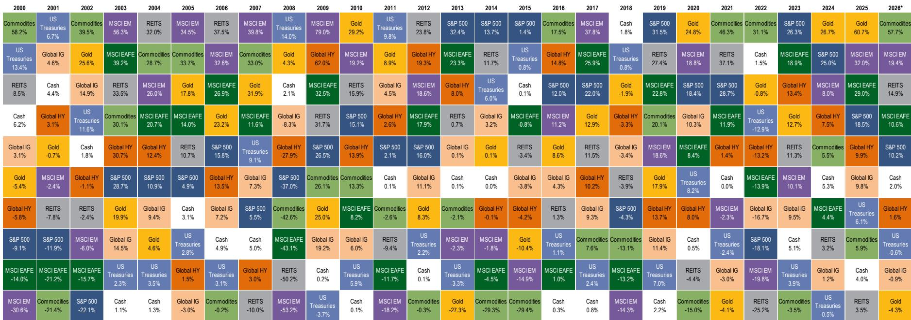
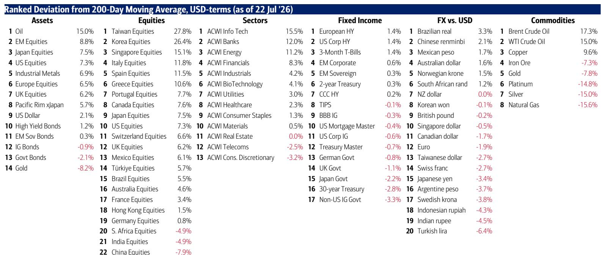
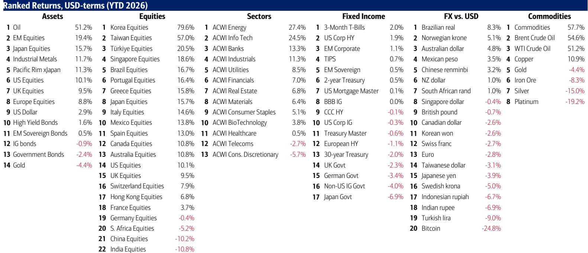

# BofA：研究主题与行业变化观察

美国30年期国债回报表现升至5.2%，创2007年6月以来新高；30年期实际回报表现达到3%，为2008年11月以来最高。与此同时，BofA牛熊指标维持在9.6的极高水平，触发于2026年5月的观点偏谨慎信号仍然有效。这份BofA7月23日发布的资金流向周报显示，市场正在经历一个关键节点：债券市场已经对通胀和美联储政策做出定价，但公司读者尚未充分消化利率上升对不确定性资产的潜在影响。

报告的核心判断是，当前市场共识的“繁荣”预期面临挑战。BofA7月全球组合负责人调查中，83%的读者认为美联储在11月中期选举前不会提高利率，但市场隐含的7月29日美联储会议提高利率的概率已升至38%，9月16日会议提高利率已被完全定价。这种预期差正是资产价格重新定价的潜在催化剂。

## 1. 债券回报表现与资金条件收紧已超过盈利影响

报告指出，资金条件指数（FCI）的收紧幅度已经超过盈利预期（EPS）的变化。2026年至今，全球已有23家央行提高利率，BofA预测年底前还有18次提高利率。债券市场比市场更早感受到调整变化——“没有前瞻指引的Warsh式政策调整”正在被定价，背后是3-4%的通胀水平和未被AI冲击的劳动力市场。

> **KC评论：** BofA用“FCI > EPS”这个简写点出了一个关键关系：当资金条件收紧的速度超过企业盈利增长的速度时，市场的主要矛盾就从“公司赚多少钱”变成了“资金成本有多高”。这张图值得关注。

30年期实际回报表现回到3%，意味着长期增长预期和不确定性溢价都在重新定价。美国科技债价格已降至两年低点，而公司读者尚未将利率视为“Anything But Bonds”积极市场的威胁。

## 2. 资金流向显示读者行为出现明显分化

当周资金流向数据呈现一个矛盾画面：公司产品流入304亿美元，债券产品流入149亿美元，黄金流入20亿美元，加密货币流入9亿美元。但结构性信号更值得关注。

中国公司产品单周流入213亿美元，为历史第三大流入；韩国公司产品过去四周累计流入163亿美元，创纪录；科技产品过去四周流入528亿美元，同样创纪录。这些数据指向资金正在集中涌入特定区域和板块。

与此同时，BofA私人客户（管理资产4.5万亿美元）的公司配置为65.6%，债券配置17.5%，现金配置9.6%，现金比例已回到2026年5月的纪录低点。私人客户过去四周在ETF中观点偏积极市政债券和防御性板块（必需消费、医疗保健），观点偏谨慎材料、低波动和日本资产。这种从进攻转向防御的调仓，与机构资金明显流入科技和新兴市场形成鲜明对比。

## 3. “蓝筹半导体”指数从6月高点回调21%预示工业周期信号

报告特别关注一个领先指标：等权重的“蓝筹半导体”指数（包括德州仪器、ADI、NXP、微芯科技、安森美、意法半导体、英飞凌、Monolithic Power）从6月高点回调21%。BofA将其视为工业周期的观察信号。

这个指数覆盖的是工业、汽车、通信基础设施等领域的芯片供应商，而非AI算力芯片。其回调意味着工业端需求可能正在调整，这与当前市场对“繁荣”的共识形成反差。超大规模科技股（MAGS）也在200日移动均线（65美元）附近波动，进一步增加了对“繁荣”叙事的讨论。

## 4. 2020年代研究主题的结构性转变：供给取代需求成为主导

报告用一张图表对比了2010年代和2020年代的研究主题：从全球化到国家安全，从财政宽松到AI资本开支，从美联储独立到政策配合，从美国例外主义到全球再平衡。核心变化是，“供给”比“需求”更成为宏观和市场的驱动力。

劳动力供给受移民政策约束——美国初请失业金人数处于1969年以来低位；进口供给受保护主义和关税约束——美国将对60个贸易伙伴加征新关税；石油供给受地缘政治约束——全球每天约8000万桶海运石油中，有6400万桶通过霍尔木兹海峡、曼德海峡等重要“咽喉”运输。相对不受约束的是债券供给——联邦政府仍运行2万亿美元赤字，每年支付1万亿美元利息，尽管过去12个月关税收入达2500亿美元。

> **KC评论：** 供给约束意味着通胀可能比市场预期的更具粘性。BofA的逻辑是，当劳动力、进口和能源都受制于供给时，货币政策机构很难快速转向宽松。这对对利率变化敏感的资产的定价有深远影响。

## 5. 当地地产股被BofA视为长期关注视角

报告在“最大的图景”部分提出一个具体判断：当地地产股是长期关注视角。恒生当地地产指数当前价格与30年前相同，涨跌空间有限，2020年代下半段向上可能性较大。BofA将其定位为“稳定中国资金背景、中国/亚洲科技长期崛起、新兴市场和房地产新积极阶段”的研究载体，同时认为迪拜和新加坡的吸引力正在减弱。

这个判断建立在两个前提上：美联储收紧或日本央行货币扰动（日元兑美元至1986年以来最低）引发的任何回调，都是关注时机。

---

BofA这份周报的核心价值不在于单一资产判断，而在于它勾勒了一个正在形成的矛盾：债券市场已经为更高利率定价，资金流向显示读者仍在涌入不确定性资产，但领先指标（蓝筹半导体）和读者仓位（现金比例极低）都在提示反转可能性。报告建议关注防御性板块、股息和久期，建议谨慎看待银行（正经历大额资金流入）、机构、科技和工业板块——这些板块的读者仓位处于2021年7月以来最拥挤的水平。当“繁荣”预期开始修正时，拥挤的交易往往最先面临调整。

For informational purposes only. Portions may be generated,translated,summarized,or edited with AI assistance based on source materials and may contain omissions or errors. Please verify independently. This is not investment,legal,tax,accounting,or other professional advice.

For informational purposes only. Portions may be generated,translated,summarized,or edited with AI assistance based on source materials and may contain omissions or errors. Please verify independently. This is not investment,legal,tax,accounting,or other professional advice.

