2026年7月22日

# 中国的贸易关系

面临阻力而非退缩

- 中国的贸易覆盖范围依然广泛：超过80个经济体视其为第一大进口来源...
- ...但发达经济体与新兴经济体对其贸易做法的关切有所上升
- 我们通过50余张图表观察中国贸易地位与流向近年来的变化

近年来，全球对中国贸易的关切有所上升，美国、欧盟等经济体对双边贸易差额问题日益关注。但不仅西方经济体，印度、墨西哥、韩国等伙伴近年来也对中国进口商品发起了多项反倾销调查（涉及金属、化学品、塑料等）。事实上，2019至2025年间，针对中国实施的不利贸易措施数量增加了75%。在石墨、稀土等关键商品上对中国的依赖仍是关注点。与此同时，中国近月来也在强化其应对境外法律的反制手段。

尽管贸易领域存在一定波动，但中国的贸易覆盖范围依然广泛。中国自2009年以来一直是全球最大的货物出口国。2025年，超过80个经济体将中国视为其第一大货物进口来源，36个经济体将中国视为其第一大出口目的地。中国也继续推进贸易自由化，约40%的贸易在与现有自贸协定伙伴之间进行。

与此同时，中国的贸易通道正在向东转移。2016至2025年间，中国对东盟（尤其是越南）出口份额上升了5个百分点，而对美出口份额下降了7个百分点。目前中国对东盟（18%）和欧盟（约15%）的出口份额均高于对美国（10%）的出口。在与美国贸易关系调整的背景下，中国从巴西和澳大利亚进口了更多农产品，并作为全球第三大外资来源地，加大了对东盟经济体的投资。

同时，中美贸易关系的调整也引发了关于关税导向下中国产品从美国转至欧盟等其他市场的关注。不过，有迹象表明，虽然越南对美出口中所含的中国增加值份额有所上升，但墨西哥对美出口增长中可归因于中国转口贸易的比例极小。

在此背景下，我们进一步观察中国在全球贸易中角色近年来的演变。

这是我们关于贸易与资金流向主题的最新报告。如需订阅我们九大主题中的任意一项，可点击此处查阅。

## 披露与免责声明

本报告须连同披露附录中的披露内容及分析师证明、以及作为其组成部分的免责声明一并阅读。

宏观研究 全球

## Prachi Mathur

HSBC Securities and Capital Markets (India) Private Limited
prachi.mathur@hsbc.co.in

## Shanella Rajanayagam

高级贸易研究员
HSBC Bank plc
shanella.l.ajanayagam@hsbc.com

2026 Extel 全球固定收益研究调查
7月6日–24日
可参与投票

报告发行方：HSBC Securities and Capital Markets (India) Private Limited

查阅 HSBC 全球研究： https://www.research.hsbc.com

## 中国的全球贸易关系如何演变？

**1. 中国在全球出口中的份额有所上升，而进口份额略有回落**  
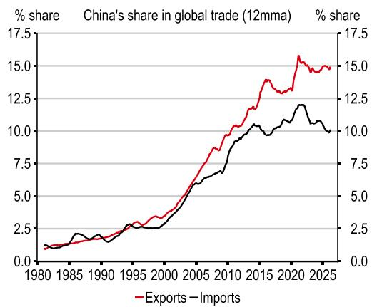  
来源：Macrobond。注：最新数据截至2026年3月。

**2. 与亚洲的贸易持续增强，同时减少对北美市场的依赖**  
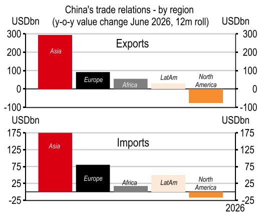  
来源：Macrobond。注：墨西哥归入拉丁美洲。

**3. 2025年全球前30大货物贸易走廊中，一半涉及中国**  
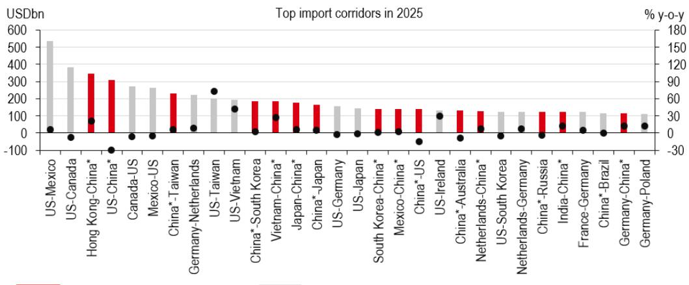  
进口额 - 涉及中国（左轴）  
进口额 - 不涉及中国（左轴） • 2024-25年增速（右轴）  
来源：IMF、HSBC

**4. 约40个经济体将中国视为其第一大出口目的地...**  
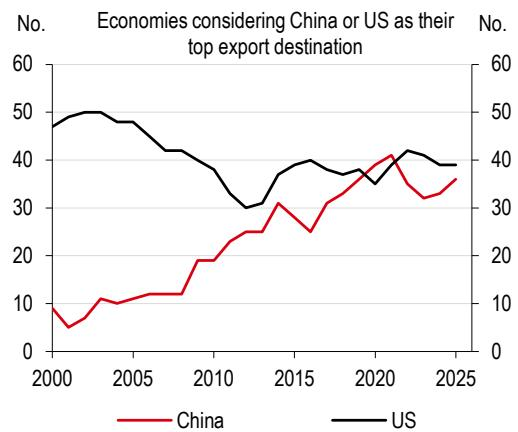  
来源：HSBC、IMF

**5. ...而视中国为第一大进口来源的经济体数量约为前者的两倍**  
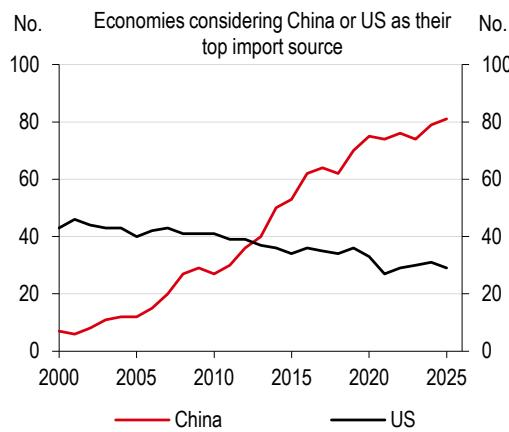  
来源：HSBC、IMF

**6. 其他经济体作为出口目的地对美国和中国的依赖程度有所降低...**  
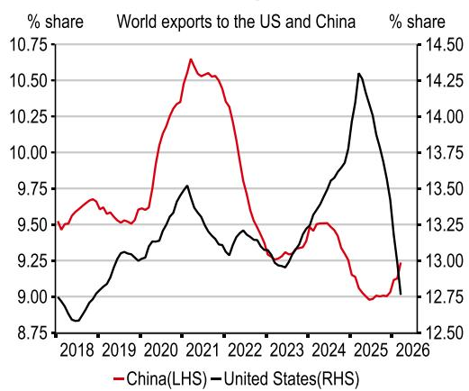  
来源：Macrobond

**7. ...而对中国的进口依赖程度在上升后，自2025年以来趋于平稳**  
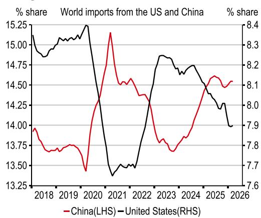  
来源：Macrobond

**8. 东盟在中国出口中的份额上升，而美国的份额下降...**  
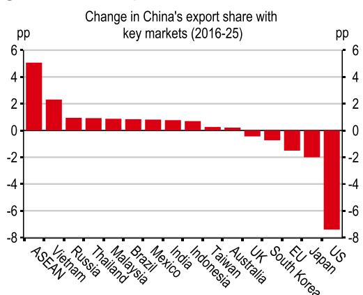  
来源：HSBC、Macrobond

**9. ...这一趋势始于中美首次关税调整之后**  
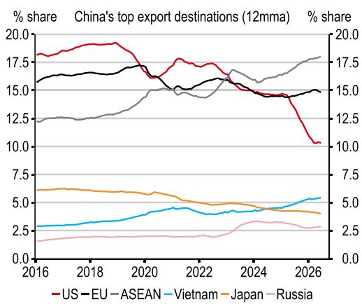  
**10. 俄罗斯、东盟和巴西在中国进口市场中的份额上升...**  
来源：Macrobond

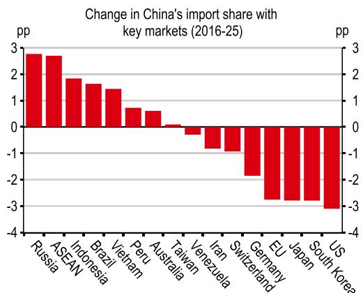  
来源：HSBC、Macrobond

**11. ...目前约15%的中国进口来自东南亚伙伴**  
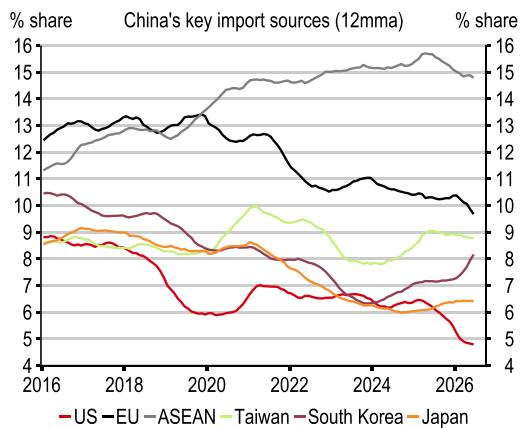  
来源：Macrobond

**12. 中国对美国的贸易顺差有所收窄，但对欧盟的顺差扩大...**  
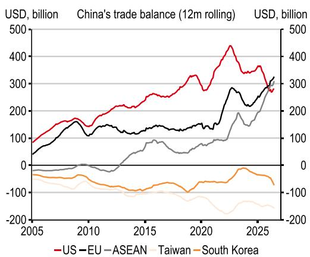  
来源：Macrobond

**13. ...去年美国大幅提升了针对中国进口商品的关税水平**  
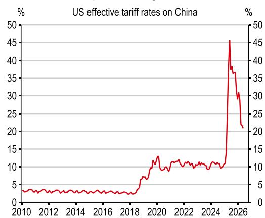  
来源：Macrobond、HSBC。注：基于实征关税与进口数据。

**14. 与制造业进口国（欧盟、印度、越南、墨西哥）的贸易顺差有所扩大**  
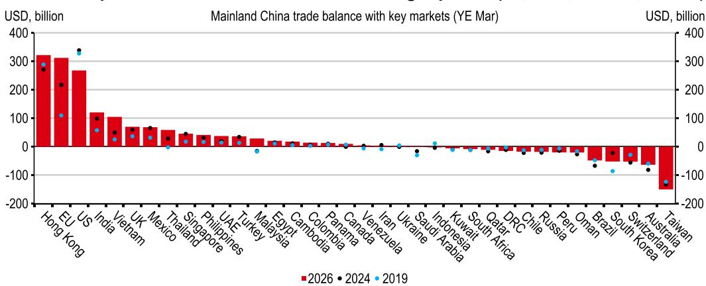  
来源：Macrobond、IMF

**15. 欧盟对华贸易逆差已升至每日约10亿欧元的水平...**  
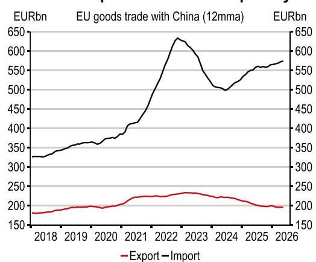  
来源：Macrobond

**16. ...所有欧盟成员均对该经济体存在货物贸易逆差**  
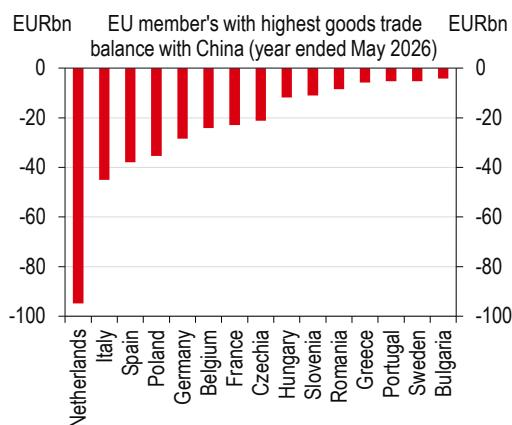  
来源：Macrobond。注：仅展示部分欧盟成员数据。

**17. 中国的主要出口商品为电子产品和汽车...**  
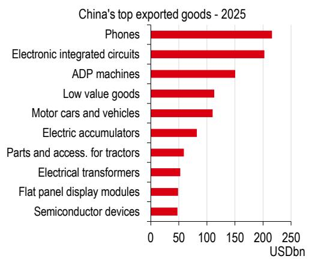  
来源：海关总署。注：低价值商品享受简化报关流程。

**18. ...主要进口商品为电子集成电路、原油和铁矿石**  
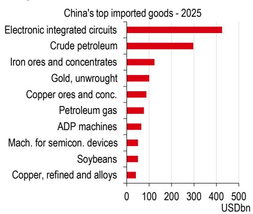

**19. 主要商品进出口名义总额普遍上升，部分受电子元件及石油价格变化推动...**  
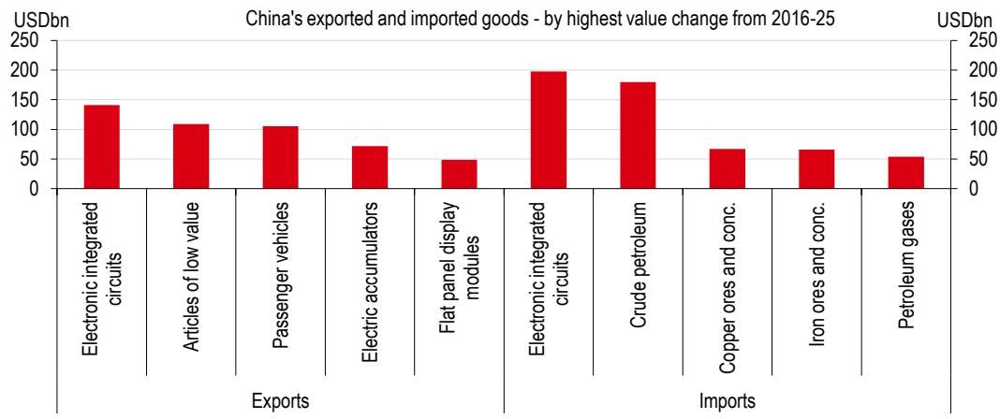

**20. ...过去九年中对香港和越南的电子集成电路出口增长尤为显著...**  
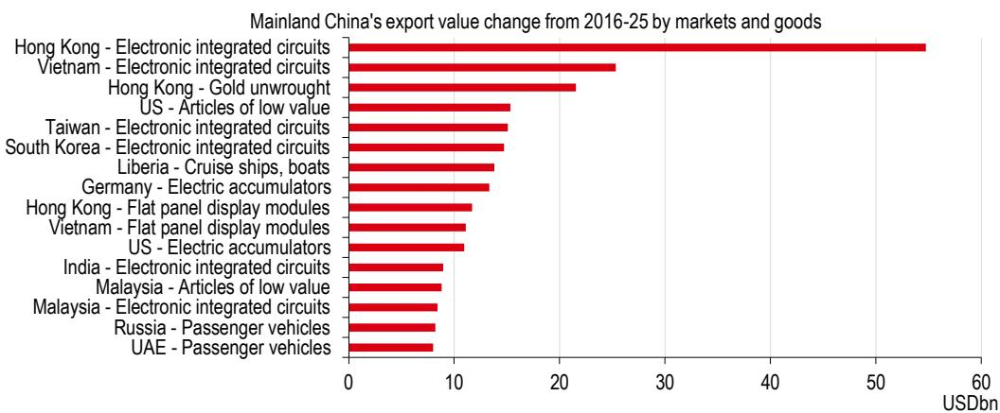  
来源：海关总署、HSBC。注：香港99%的出口为转口，其中42%来自中国大陆。这相当于2025年中国大陆7%的货物经香港转口，美国和越南是香港最大的转口目的地（中国大陆除外）。香港出口的电子集成电路几乎全部为转口。

**21. ...在进口方面，来自台湾和韩国的电子集成电路、来自澳大利亚的铁矿石、以及来自俄罗斯和马来西亚的原油增长最为明显**  
中国大陆2016-25年分市场及商品的进口额变化  
  
来源：海关总署、HSBC

**22. 中国汽车出口中流向欧盟的份额有所下降...**  
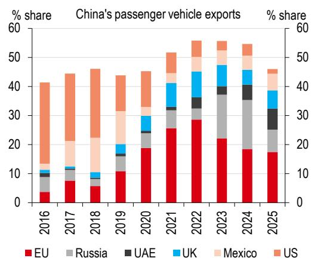  
来源：海关总署

**23. ...但混合动力汽车对欧盟的出口金额大幅上升**  
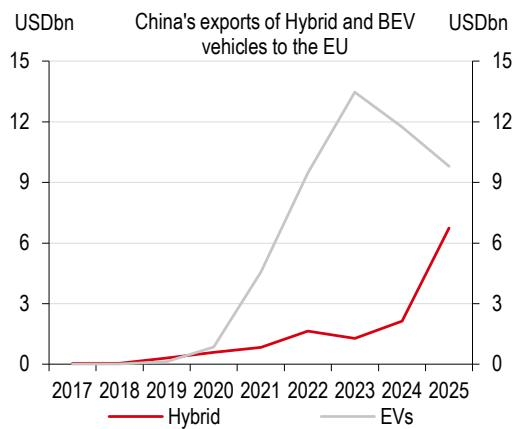  
**24. 欧盟是中国从美国转移出口的关键目的地...**  
来源：海关总署  
中国主要商品及市场出口份额变化（2016-25年）

**25. ...同时中国越来越多地从巴西和澳大利亚进口关键农产品**

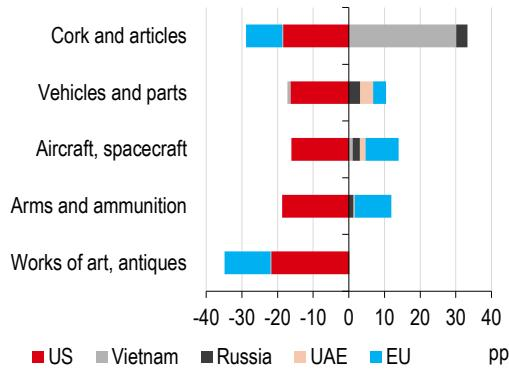  
来源：海关总署。注：选取对美份额下降最多的商品。  
中国主要商品及市场进口份额变化（2016-25年）  
炸药、烟火制品  
食品工业残渣

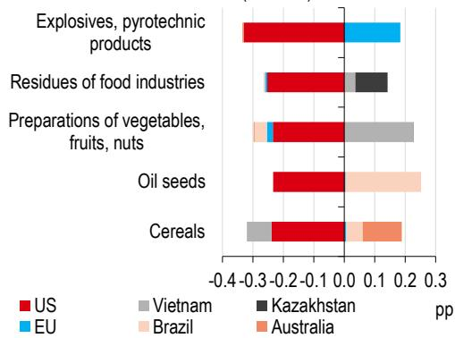  
蔬菜、水果、坚果制品  
来源：海关总署。注：选取对美份额下降最多的商品。

**26. 在取消小额豁免规则后，对美低价值出口有所回落**  
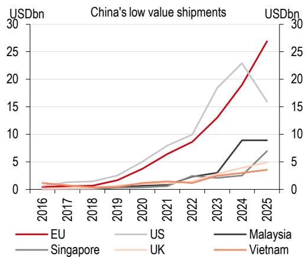  
来源：海关总署。注：美国于2025年取消了小额豁免（低于800美元商品免关税及其他税费）。

**27. 从美国进口的大豆有所减少，但近期有所回升**  
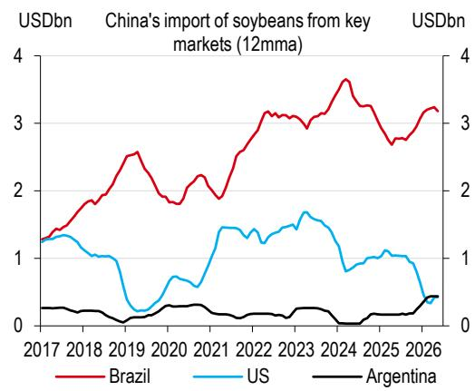  
来源：海关总署

**28. 全球对中国的石墨、稀土等关键矿物依赖度较高...**  
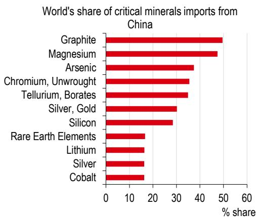  
来源：亚行、WTO数据库。注：2024年数据  
受中美关税影响的美国企业

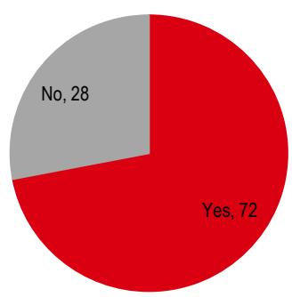

**30. 在华运营的美国企业大部分受到关税影响...**  
**29. ...以及风电涡轮机、太阳能电池等关键能源转型产品**  
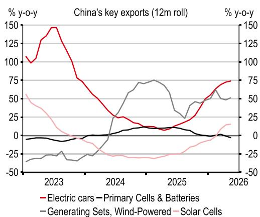  
来源：Macrobond  
来源：美中贸易全国委员会。注：2026年调查，百分比。

**31. ...关税是其在中国的前三大成本关注点之一**  
在华主要成本关注点  
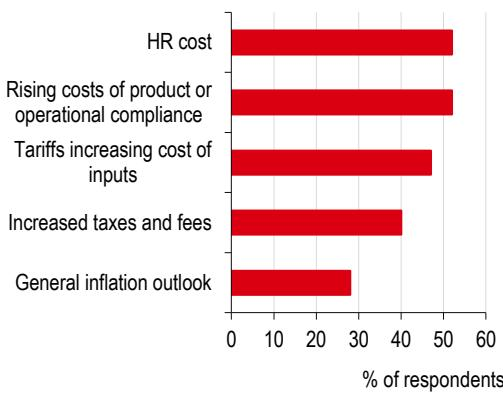  
来源：美中贸易全国委员会。注：2026年调查。

**32. 部分企业正通过多元化方式重新评估其中国供应链...**  
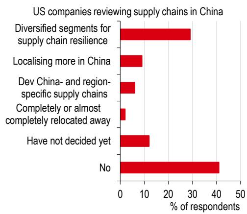  
来源：美中贸易全国委员会。注：2026年调查。

**33. ...但对西方而言，到2050年脱离中国可能需要24万亿美元**  
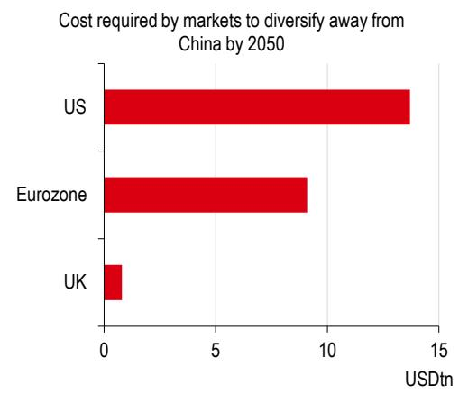  
来源：EY-Parthenon研究、金融时报。注：基于在关键行业中复制依赖中国的基础设施、研究、软件、制造及供应链所需价值。

**34. 2019至2025年间，针对中国的不利贸易措施增加了75%...**  
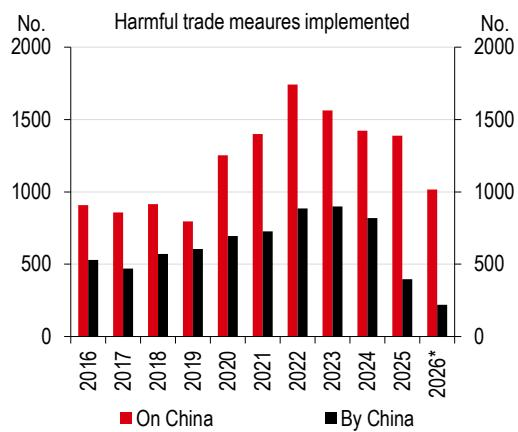  
来源：Global Trade Alert。注：*指截至2026年7月17日的数据。

**35. ...但中国采取的措施所影响的贸易量更大**  
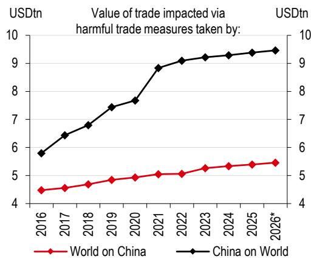  
来源：Global Trade Alert。注：*指截至2026年7月17日的数据。

**36. 美国对华施加的不利措施数量最多...**  
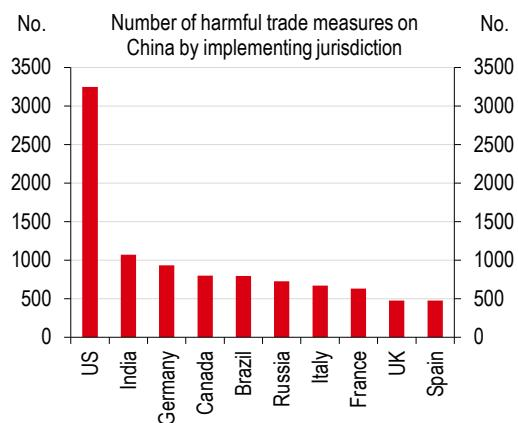  
来源：Global Trade Alert。注：数据取自2016年至2026年7月17日。

**37. ...伙伴方主要针对金属和车辆**  
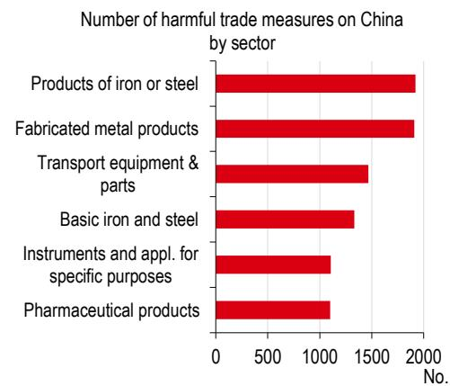  
来源：Global Trade Alert。注：数据取自2016年至2026年7月17日。

中国与FTA及非FTA伙伴的贸易

**38. 财政拨款、国家贷款和关税是针对中国的主要措施...**  
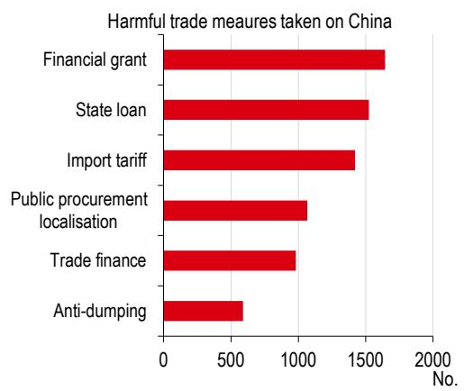  
来源：Global Trade Alert。注：数据取自2016年至2026年7月17日。未展示所有已实施措施。

**39. ...而财政拨款是中国应用的最不利贸易措施**  
  
来源：Global Trade Alert。注：数据取自2016年至2026年7月17日。未展示所有已实施措施。

**40. 中国已生效的FTA超过20个，另有10个正在谈判...**  
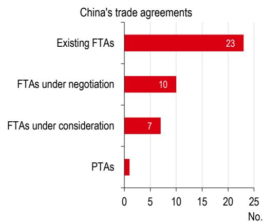  
来源：商务部

**41. ...约40%的货物贸易在与FTA伙伴之间进行**  
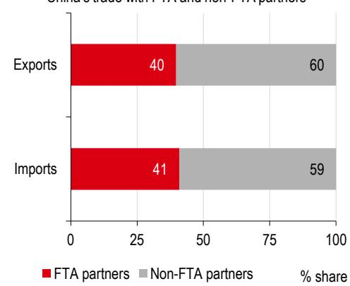  
来源：海关总署。注：2025年数据

**42. 中国是全球主要外资来源国之一...**  
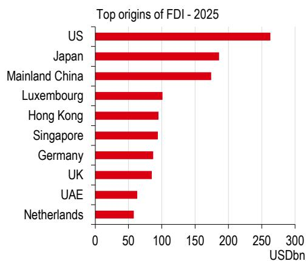  
来源：世界投资报告、UNCTAD

**43. ...并持续增加对东盟经济体的资金投入**  
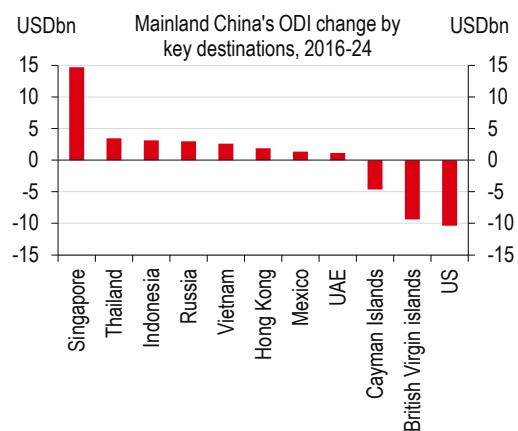  
来源：CEIC

**44. 目前人民币占全球支付的比重不足3%...**  
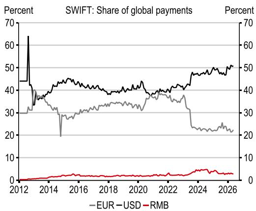  
来源：Macrobond。注：最新数据截至2026年5月。

**45. ...但在贸易融资领域的使用重要性有所提升**  
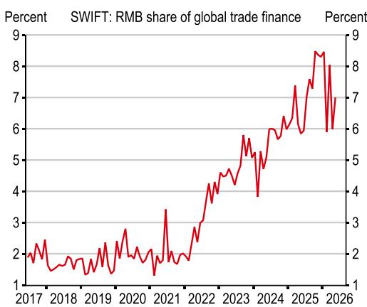  
来源：Macrobond。注：最新数据截至2026年5月。

**46. 中国大陆对越南、泰国和墨西哥的出口份额上升，同时美国从这些市场的进口份额也同步增长**  
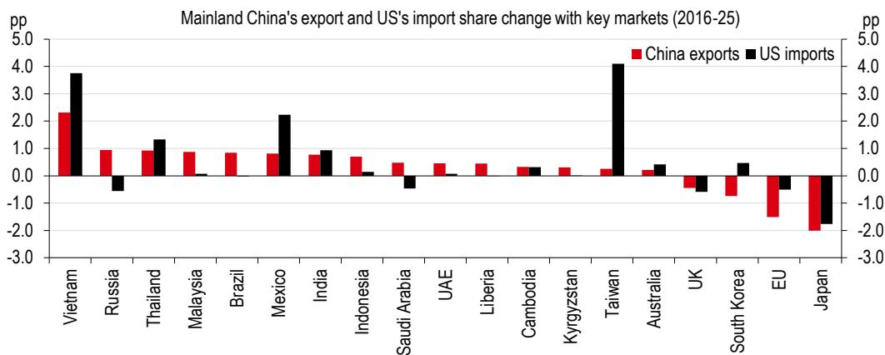  
来源：Macrobond、海关总署、HSBC。注：选取增速最高与降幅最大的前几位（不含香港）。

**47. 中国大陆在柬埔寨、越南、泰国、韩国和墨西哥的出口中贡献了较大增加值...**  
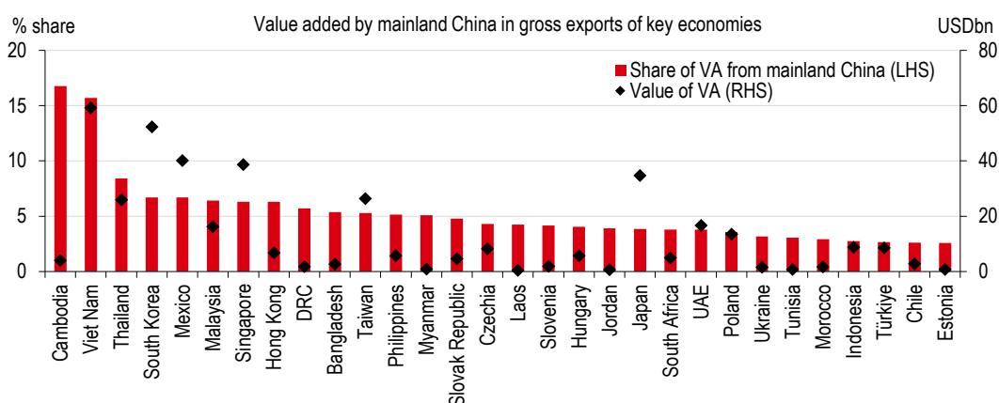  
来源：OECD TiVA。注：2022年数据。

**48. ...亚洲经济体在进口中也含有较大份额的中国大陆增加值**  
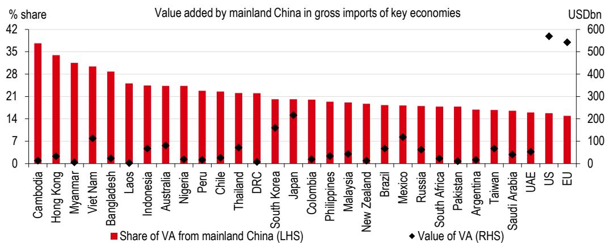  
来源：OECD TiVA。注：2022年数据。

**49. 中国在美国和欧盟最终需求中的增加值占比有所上升...**  
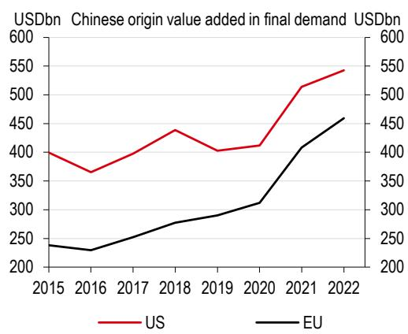  
来源：OECD TiVA

**50. ...但这一占比越来越多地体现于越南对美出口中**  
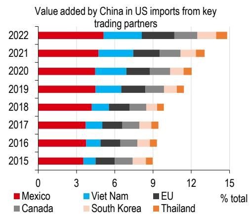  
来源：OECD TiVA。注：图表展示中国在美国从主要市场进口中的增加值份额，例如红色条表示美国从墨西哥进口中包含的中国增加值份额。

**51. 中国在美国从墨西哥进口中的增加值占比也略有上升...**  
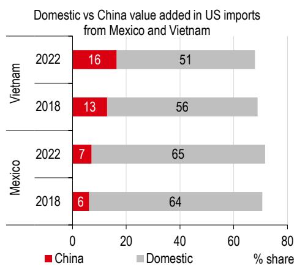  
来源：OECD TiVA。注：国内指本国增加值，例如墨西哥的灰色条表示美国从墨西哥进口中由墨西哥创造的价值占比，越南类似。  
**52. ...但中国转口贸易并非墨西哥对美出口增长的主要推动因素**  
墨西哥对美出口增长的分解

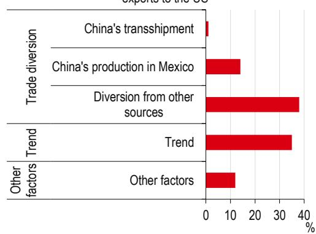  
来源：美联储纪要，2026年6月5日。注：各标题代表墨西哥对美出口增长的年化分解份额，所有条块之和为100%。数据比较2014-17年与2021-24年墨西哥对美出口的增长。

# 披露附录

## 分析师证明

主要负责本报告的下述分析师、研究员或策略师（包括任一章节的作者，以及分部估值中子公司覆盖分析师的署名者）证明，其对相关证券或发行方的看法、在个人署名章节中表述的观点或预测、以及本文中其他任何看法或预测（包括研究报告封底的任何看法）均准确反映了其个人观点，且其薪酬中没有任何部分与这些具体观点直接或间接相关：Prachi Mathur 和 Shanella Rajanayagam

## 重要披露

本文档由HSBC部编制并分发，仅面向HSBC客户，不得通过媒体或其他方式向他人公布。

本文档仅供信息参考，不应被视为出售要约或购买其中提及的证券或其他资金配置产品的要约邀请，也不构成参与任何交易策略的建议。本文档中的建议为一般性建议，因未考虑任何特定读者的目标、财务状况或需求，故不应视为个人化建议。因此，读者在依据建议行动之前，应结合自身目标、财务状况和需求评估建议的适当性。必要时请寻求专业资金配置及税务建议。

本文档中提及的某些资金配置产品可能在某些州或国家不具备销售资格，也可能不适合所有类型的读者。读者在做出购买决定前，应咨询HSBC代表了解相关产品的适合性，并考虑其具体的投资目标、财务状况或特殊需求。

本文档中提及的资金配置产品的价值及收益可能波动，读者可能收回低于初始投入的金额。某些高波动性产品可能面临突然大幅贬值，贬值幅度可能等于或超过投入金额。产品价值及收益可能受汇率、利率或其他因素的不利影响。特定产品的过往表现不代表未来结果。

HSBC及其关联公司可能不时以自营或代理身份向客户买卖本文提及的公司的证券/工具（包括股权和债务及其衍生品），或担任这些证券/工具的市场做市商或流动性提供者。

分析师、研究员及策略师的薪酬部分参考HSBC的盈利能力，包括公司金融业务、销售与交易及自营交易收入。

本分析报告的更新是否发布及发布时间不事先确定。

关于本文提及的任何公司的披露信息，请参阅该公司最近发布于 www.hsbcnet.com/research 的研究报告。HSBC私人银行客户应联系客户经理查询其他研究报告。如需了解用于编制本报告的专有模型，请联系署名分析师。

## 其他披露

1. 本报告日期为2026年7月22日。
2. 除另有说明外，本报告中的所有市场数据均截至2026年7月17日收盘。
3. HSBC设有程序以识别并管理研究业务中可能出现的利益冲突。HSBC分析师及其他参与研究和发布的人员，其管理汇报线独立于HSBC的公司金融业务。研究、自营交易与公司金融业务之间设有信息隔离程序，确保保密和/或价格敏感信息得到妥善处理。
4. 您不得将本文档中的任何数据用于以下目的：(i) 确定贷款协议或其他金融合同或工具下的应付利息或其他款项；(ii) 确定金融工具的买卖、交易或赎回价格或其价值；以及/或 (iii) 衡量金融工具或基金的表现。

# 免责声明

截至2026年5月13日的法律实体：

HSBC Bank plc; HSBC Continental Europe; HSBC Continental Europe SA, Germany; HSBC Bank Middle East Limited, DIFC; HSBC Bank Middle East Limited, Dubai branch; HSBC Yatirim Menkul Degerler AS, Istanbul; The Hongkong and Shanghai Banking Corporation Limited, Hong Kong; The Hongkong and Shanghai Banking Corporation Limited, Singapore Branch; The Hongkong and Shanghai Banking Corporation Limited, Seoul Securities Branch; The Hongkong and Shanghai Banking Corporation Limited, Seoul Branch; HSBC Qianhai Securities Limited; HSBC Securities (Taiwan) Corporation Limited; HSBC Securities and Capital Markets (India) Private Limited, Mumbai; HSBC Bank Australia Limited; HSBC Securities (USA) Inc., New York; HSBC México, SA, Institución de Banca Múltiple, Grupo Financiero HSBC; Banco HSBC SA

报告发行人
HSBC Securities and Capital Markets (India) Private Limited
注册办公室
52/60 Mahatma Gandhi Road
Fort, Mumbai 400 001, India
电话：+91 22 2267 4921
传真：+91 22 2263 1983
网站：www.research.hsbc.com
SEBI注册号 INH000001287
CIN: U67120MH1994PTC081575

本文档由HSBC Securities and Capital Markets (India) Private Limited（“HSBC”）为其客户信息编制并分发。HSBC Securities and Capital Markets (India) Private Limited 注册为“研究分析师”（注册号 INH000001287）、商人银行（注册号 INM000010353）及股票经纪人（统一注册号 INZ000234533），受印度证券交易委员会监管。如果由HSBC关联公司的客户收悉，则提供方与接收方之间的业务条款适用。本文档不构成出售要约或购买认购任何资金配置产品的要约邀请。HSBC基于其认为可靠的来源获取信息，但未独立核实；HSBC不对其准确性或完整性作出任何保证、陈述或担保，也不承担任何责任或义务。观点仅代表HSBC部门的判断，可能随时变更。研究分析师不时对覆盖发行人进行实地访问。HSBC政策禁止研究分析师接受发行人支付的差旅费用。HSBC及其关联公司和/或其高级职员、董事及员工可能持有本文提及的任何证券（或相关投资）的头寸，并可能不时增加或处置任何此类证券（或投资）。HSBC及其关联公司可能担任本文讨论的公司证券（或相关投资）的市场做市商或承担承销承诺，可能以自营方式向客户出售或购买这些证券，也可能为这些公司提供或寻求提供公司金融或承销服务，并可能在这些公司的监事会或任何其他委员会中任职。关联公司详情可向合规官获取。对于HSBC Securities and Capital Markets (India) Private Limited 发布的报告的任何投诉可联系合规官员 Neha Malviya，邮箱 neha.malviya@hsbc.co.in，电话 +91 22 4089 1536。研究报告中的信息及观点基于公开信息及发布时适用的税率，税率可能随时变更。过往表现不一定是未来业绩的指引。任何资金配置产品或收入的价值可能下跌或上升，读者可能无法收回全部投入金额。如果资金配置产品以接收方当地货币以外的货币计价，汇率变动可能对价值、价格或收入产生不利影响。对于没有公认市场的资金配置产品，读者可能难以出售其投资或获取关于其价值或风险敞口的可靠信息。SEBI 的注册及 NISM 的认证不代表对中介机构业绩的保证，也不提供对读者的回报保证。证券市场资金配置存在市场风险。投资前请仔细阅读所有相关文件。本文档旨在完整分发。除非适用法律允许，否则如您希望使用HSBC集团服务进行本文提及的任何资金配置产品的交易，必须联系您所在司法管辖区的HSBC集团成员。

在英国，本出版物由 HSBC Bank plc 向其客户（按FCA规则定义）及其关联公司客户分发。本文不排除或限制 HSBC Bank plc 根据《2000年金融服务与市场法》或FCA及PRA规则对客户承担的任何责任或义务。选择与英国非HSBC Bank plc代表的任何人进行交易的接收方，将无法享受英国监管体制下的保护。HSBC Bank plc 受金融行为监管局及审慎监管局监管。

在欧洲经济区，本出版物由 HSBC Continental Europe 或其他提供相关服务的HSBC关联公司分发。

在日本，本出版物由 HSBC Securities (Japan) Co., Ltd. 分发。在香港，本文档由 The Hongkong and Shanghai Banking Corporation Limited 在其香港受规管业务中向其机构及专业客户分发；除非允许，否则不适用于零售客户。The Hongkong and Shanghai Banking Corporation Limited 不担风险自担文提及的产品或服务在香港可供任何人使用，或适合任何特定人士，或符合当地法律。此类接收方的所有咨询须直接联系 The Hongkong and Shanghai Banking Corporation Limited。在韩国，本出版物由 The Hongkong and Shanghai Banking Corporation Limited, Seoul Securities Branch (HBAP SLS) 或 The Hongkong and Shanghai Banking Corporation Limited, Seoul Branch (HBAP SEL) 向《金融投资服务与资本市场法》第9条界定的专业读者分发。本出版物不属于FSCMA定义下的招股说明书。未经许可不得进一步整体或部分分发。HBAP SLS 和 HBAP SEL 均受韩国金融委员会及金融监督院监管。在新加坡，本出版物由 The Hongkong and Shanghai Banking Corporation Limited, Singapore Branch 向《2001年证券与期货法》(SFA) 第274条及第304条界定的机构读者或其他人士，以及按照SFA第275条及第305条规定的合格读者和其他人士分发。只有宏观或货币报告面向非合格读者、专家读者或机构读者分发。The Hongkong and Shanghai Banking Corporation Limited, Singapore Branch 接受报告内容的法律责任。本出版物不属于SFA定义下的招股说明书。未经许可不得进一步整体或部分分发。The Hongkong and Shanghai Banking Corporation Limited Singapore Branch 受新加坡金融管理局监管。新加坡接收方应就本报告相关事宜联系 The Hongkong and Shanghai Banking Corporation Limited, Singapore Branch 代表。联系方式见 www.business.hsbc.com.sg。在澳大利亚，本出版物由 The Hongkong and Shanghai Banking Corporation Limited (ABN 65 117 925 970, AFSL 301737) 向其《2001年公司法》定义的“批发”客户分发。如向零售客户分发，则由 HSBC Bank Australia Limited (ABN 48 006 434 162, AFSL 232595) 分发。相关实体不担风险自担文提及的产品或服务在澳大利亚可供任何人使用，或适合任何特定人士，或符合当地法律。未考虑任何接收方的特定资金配置目标、财务状况或特殊需求。

HSBC Securities (USA) Inc. 对其非美国关联公司编制的本研究报告内容负责。本文所含信息在任何情况下均不构成资金配置建议，也不针对接收方需求量身定制。所有接收和/或访问本报告的美国人士如欲交易本文讨论的任何证券，应通过美国的 HSBC Securities (USA) Inc. 进行，而非通过非美国关联公司（即本报告发行人）。HSBC México, S.A., Institución de Banca Múltiple, Grupo Financiero HSBC 经墨西哥财政与公共信贷部及国家银行与证券委员会授权并受其监管。在巴西，本文档由 Banco HSBC SA（“HSBC巴西”）及/或其关联公司分发。按照巴西证券交易委员会第20/2021号决议要求，关于 (i) HSBC巴西及/或其关联公司与 (ii) 负责编制本报告的分析师之间的潜在利益冲突，已在上方“HSBC与分析师披露”图表中说明。

如果您是HSBC国际财富及卓越理财（包括HSBC私人银行）客户，仅在以下情况下您才有资格接收本出版物：(i) 经适用的HSBC法律实体批准接收相关研究出版物；(ii) 同意适用的HSBC实体的条款及条件及/或访问研究的客户声明；以及 (iii) 同意通过该HSBC实体提供的任何网上银行、手机银行及/或资金配置服务（连同(ii)统称“条款”）访问研究出版物。如您不符合上述资格要求，请忽略本出版物；如您是国际财富及卓越理财客户，请通知您的客户经理或致电相关客户热线。本出版物的分发由您已同意条款的HSBC实体全权负责。接收研究出版物严格受条款约束，并受国际财富及卓越理财可能建议的任何其他条件或免责声明限制。© 版权所有 2026，HSBC Securities and Capital Markets (India) Private Limited，保留所有权利。未经HSBC Securities and Capital Markets (India) Private Limited 事先书面许可，不得以任何形式或方式复制、存储于检索系统或传播本出版物的任何部分。

# 全球宏观研究团队

## 全球

全球首席宏观研究员
Janet Henry +44 20 7991 6711
janet.henry@hsbcib.com

全球宏观研究员
James Pomeroy +44 20 7991 6714
james.pomeroy@hsbc.com

全球宏观研究员
Bethan Ellis +44 20 7991 6714
bethan.ellis@hsbc.com

高级贸易研究员
Shanella Rajanayagam +44 20 3268 4118
shanella.l.rajanayagam@hsbc.com

贸易研究员
Prachi Mathur +91 99 5880 6333
prachi.mathur@hsbc.co.in

## 欧洲

欧洲首席宏观研究员
Simon Wells +44 20 7991 6718
simon.wells@hsbcib.com

高级研究员
Chris Hare +44 20 7991 2995
chris.hare@hsbc.com

## 英国

英国高级研究员
Elizabeth Martins +44 20 7991 2170
liz.martins@hsbc.com

英国研究员
Emma Wilks + 44 20 3268 5948
emma.wilks@hsbc.com

## 德国

Stefan Schilbe +49 211 910 3137
stefan.schilbe@hsbc.de

Anja Sabine Heimann +44 738 724 7457
anja.sabine.heimann@hsbc.com

## 法国

Chantana Sam +33 1 4070 7795
chantana.sam@hsbc.fr

## 北美

## 美国

Ryan Wang +1 212 525 3181
ryan.wang@us.hsbc.com

## 亚太

全球研究联合主管（亚太）及亚洲宏观研究联合主管
Frederic Neumann +852 2822 4556
fredericneumann@hsbc.com.hk

澳大利亚、新西兰及全球商品首席宏观研究员
Paul Bloxham +612 9255 2635
paulbloxham@hsbc.com.au

印度及印度尼西亚首席宏观研究员
Pranjul Bhandari +65 6658 4976
pranjul.bhandari@hsbc.com.sg

Jamie Culling +612 9006 5042
jamie.culling@hsbc.com.au

Jing Liu +852 3941 0063
jing.econ.liu@hsbc.com.hk

Ines Lam +852 2288 7131
ines.y.k.lam@hsbc.com.hk

Yun Liu + 852 2822 4297
yun.liu@hsbc.com.hk

Aayushi Chaudhary +91 22 2268 5543
aayushi.b.chaudhary@hsbc.co.in

Maitreyi Das +91 80 6737 3155
maitreyi.das@hsbc.co.in

Erin Xin +852 2996 6975
erin.y.xin@hsbc.com.hk

Aris Dacanay +852 3945 1247
aris.dacanay@hsbc.com.hk

Jin Choi +852 2996 6597
jin.h.j.choi@hsbc.com.hk

Akiko Kitamura +852 2996 6676
akiko.kitamura@hsbc.com.hk

Justin Feng +852 2288 7108
justin.feng@hsbc.com.hk

Taylor Wang +852 2288 8650
taylor.t.l.wang@hsbc.com.hk

Priya Mehrishi +91 97 3916 9567
priya.mehrishi@hsbc.co.in

## CEEMEA

CEEMEA首席宏观研究员
Simon Williams +971 50 9143382
simon.williams@hsbc.com

中欧及东欧高级研究员
Agata Urbanska-Giner +44 20 7992 2774
agata.urbanska@hsbcib.com

CEEMEA高级研究员
Melis Metiner +44 20 3359 2636
melismetiner@hsbcib.com

南非高级研究员
Hugo Pienaar +44 20 7718 9563
hugo.pienaar@hsbc.com

## 拉丁美洲

墨西哥首席宏观研究员
Jose Carlos Sanchez +52 55 5721 5623
jose.c.sanchez@hsbc.com.mx

巴西宏观研究主管
Daniel Lavarda +55 11 2802 2640
daniel.lavarda@hsbc.com
