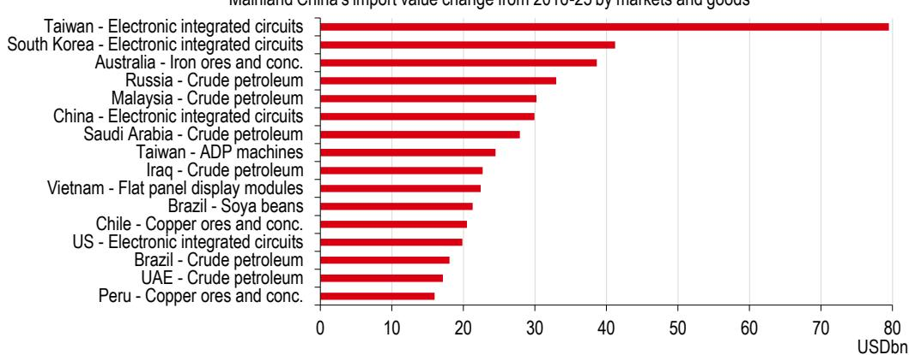

# 中国贸易足迹并非在收缩——而是在外部环境变化下向东重新配置

2019年至2025年间，针对中国的贸易措施数量增长了75%。美国、欧盟、印度、墨西哥和韩国均对中国的金属、化工、塑料和车辆发起了反倾销调查。然而在2025年，超过80个经济体仍将中国视为其首要进口来源，36个经济体视其为最大出口目的地。这种在外部压力持续与核心地位稳固之间的张力，定义了当前阶段中国贸易关系的特征。

常见的“分离”叙事忽略了更深层的结构性变化。中国并未失去其出口优势，而是在重新调整出口路径。2016年至2025年间，中国对东盟的出口份额上升了5个百分点，而对美国的出口份额下降了7个百分点。目前，中国约18%的出口流向东盟，约15%流向欧盟，仅10%流向美国。中国贸易的地理分布正在向东转移，这一重新配置对发达和新兴市场的供应链、贸易政策及研究视角具有深远影响。

这不是一个收缩的故事。这是一个在外部影响下进行战略调整的故事——而这一影响仍在持续累积。

## 外部压力显著增加，但中国的应对能力也在增强

贸易措施的数据清晰明确。根据全球贸易预警组织的数据，针对中国的贸易措施从2019年的约1600项增加到2025年中期的超过2800项。美国是采取这些措施最多的国家，但行动的地理广度令人瞩目。印度、墨西哥和韩国均对中国的进口产品（尤其是金属和车辆）发起了反倾销调查。欧盟对中国的贸易逆差已扩大到相当于每天约10亿欧元，所有欧盟成员国目前均对华存在商品逆差。

值得关注的不仅是压力的规模，还有其构成。针对中国最常用的工具包括财政补贴、政府贷款和关税。与此同时，中国也强化了自身的应对工具。中国实施的相关措施——尽管数量少于针对其的——却影响了更大规模的贸易流量。这种影响不对称反映的是中国进口市场的庞大体量及其作为关键中间品供应商的角色。

对于在华运营的跨国企业而言，实际影响是具体的。美中贸易全国委员会2026年的一项调查发现，关税是美国在华企业的三大成本关注之一，相当一部分企业正在重新评估其供应链。这意味着：贸易关系调整并非两国政府间的双边争端，而是企业承受的结构性成本，并且正在实时重塑资源配置决策。

## 中国的出口走廊正在向东转移，东盟承接了美国份额

过去十年中国贸易中最显著的地理变化是东盟作为主要出口目的地的兴起。2016年至2025年间，中国对美出口份额下降7个百分点，而对东盟（尤其是越南）的出口份额上升5个百分点。这一趋势在中美首次关税调整后加速，并持续至今。

但故事并不仅限于最终商品。中国增加值越来越多地嵌入第三国对美出口中。越南对美出口中的中国增加值占比显著上升。与此形成关键对比的是，墨西哥对美出口的快速增长中，仅有极小部分可归因于中国货物的转运。自2021年以来，墨西哥对美出口的增长主要来自墨西哥本国增加值和美国含量，而非经墨西哥转口的中国商品。

这一区别对研究者和政策制定者很重要。关于通过墨西哥大规模规避关税的担忧似乎被夸大了。中国间接出口渗透的真正渠道是通过东南亚，而非拉丁美洲。越南、泰国和柬埔寨在所有主要贸易伙伴中，其出口中的中国增加值占比最高。对于构建供应链韧性的企业而言，这意味着监测越南的出口构成——而不仅仅是总量——对于理解中国商品的真实流向至关重要。

## 中国的进口策略正多元化，尤其在农产品和能源领域减少对美国依赖

在进口方面，中国正在积极调整采购模式。来自美国的进口份额在多个产品类别中下降，而从巴西和澳大利亚的进口则大幅上升。大豆是最明显的例子：美国大豆对华出口下降，尽管近期有所回升。蔬菜、水果、坚果等农产品加工品以及食品工业残渣等品类，美国在中国市场的份额降幅最大。

能源进口也呈现类似趋势。自2016年以来，中国从俄罗斯和马来西亚的原油进口显著增长，而俄罗斯和巴西的农产品也在中国进口市场中获得更大份额。这一模式具有一致性：中国正利用其购买力减少对战略物资的美国依赖，同时深化与亚洲、大洋洲和南美洲国家的贸易联系。

其战略逻辑清晰。通过多元化进口来源，中国降低了对供应中断和关税升级的敏感性。同时，它加强了与未参与以美国为首的贸易限制框架的国家的外交和经济关系。对于商品出口国——巴西、澳大利亚、俄罗斯和东盟成员国——这一转变代表着结构性需求机会，无论美国政策周期如何，该趋势都可能持续。

## 关键矿物对中国的依赖仍是西方国家面临的战略关注点

中国的重要性没有减弱的领域之一是关键矿物。世界高度依赖中国的石墨和稀土——这些是风电涡轮、太阳能电池和电动汽车电池等能源转型技术所必需的投入品。中国在这些材料上的主导地位不仅体现在产量上，更反映了矿业、加工和制造环节的深度整合。

其战略影响值得深思。根据报告中引用的安永-帕特农研究，复制目前依赖中国的关键行业所需的基础设施、研发、软件、制造和供应链，到2050年西方经济体需投入约24万亿美元。这一数字凸显了依赖的规模。通过适度回流或少量新采矿项目无法解决这一问题，它需要全球产业能力的系统性重构。

对于企业战略制定者而言，这意味着关键矿物供应链在未来至少十年内仍将是地缘摩擦的来源。依赖中国石墨或稀土的企业应预期持续的干预——出口限制、许可要求和潜在的供应中断。即使成本更高，建设替代来源也不是可选项，而是风险管理的必选项。

## 应对中国重新配置的贸易格局的分析框架

本报告提供的证据指向全球企业和研究者的三个战略现实。

第一，中国的出口机制并未放缓，而是在转向。中国对东盟、欧盟和新兴市场的出口增长部分弥补了对美出口的下降。将“与中国分离”视为二元事件的思维，可能错过贸易重新配置的复杂现实。供应链策略需考虑经由越南、泰国和柬埔寨的间接中国增加值流动。

第二，退出中国的代价巨大且分布不均。关键行业24万亿美元的数字提醒我们，对大多数行业而言，全面分离在经济上是不可行的。企业应将中国关联分为三类：关键依赖（矿物、稀土、先进电子）——退出成本高且速度慢；战略合作（制造、组装、部件）——在3-5年内可实现多元化；市场准入关系（消费品、服务）——继续参与是理性选择。

第三，中国自身的进口多元化为非美国供应商创造了机会。巴西和澳大利亚的农产品出口商、俄罗斯和中东的能源生产商、韩国和台湾的技术供应商，都是中国有意识减少美国来源的受益者。这些地区的企业应将中国进口再平衡视为结构性有利因素，而非周期性事件。

核心结论是：中国的贸易关系并非在崩溃，而是在外部压力与内部调整的共同作用下被重塑。赢家将是那些理解新流动地理的人——而非那些假设旧版地图仍然适用的人。

*仅供参考。部分内容可能基于源材料通过AI辅助生成、翻译、总结或编辑，可能存在遗漏或错误。请独立核实。不构成任何建议。*

仅供参考。部分内容可能基于源材料通过AI辅助生成、翻译、总结或编辑，可能存在遗漏或错误。请独立核实。不构成任何建议。

