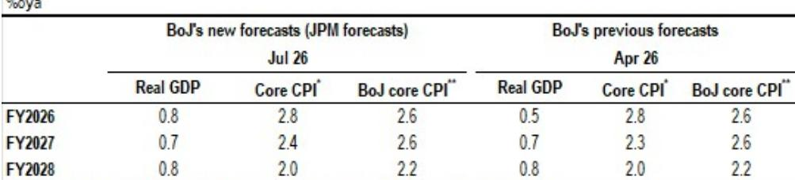

# JPM：研究主题与行业变化观察

日本央行下周的利率决议预计不会调整政策。市场关注的焦点在于，央行是否会在宏观环境与通胀展望发生变化后，释放调整政策正常化节奏的信号。JPM认为，日本央行最有可能在10月实施下一次加息。

这份报告的核心判断建立在一个关键前提上：日本央行可能在7月的《宏观环境与物价形势展望报告》中，上调2026财年的宏观环境增长预测。今年4月，受中东冲突影响，日本央行将2026财年GDP增速预测从1.0%大幅下调至0.5%。但此后国内外宏观环境活动数据持续显示出韧性，并未出现实质性节奏变化。报告指出，去年春季关税冲击后，日本央行曾因谨慎情绪而大幅下调宏观环境与通胀展望，随后采取的观望立场导致了市场对其“滞后于市场节奏”的看法。在此背景下，本次会议提前修正预测，是更为适宜的操作。

如果增长预测确实上调，市场的注意力将自然转向日本央行如何将这一变化反映在政策回应中。报告分析了一个核心矛盾：日本的产出缺口自2022年初以来持续为正，如果预测显示增长和通胀在整个预测期内都高于潜在水平和央行目标，而央行同时维持宽松的政策立场并强调“在寻找中性利率的过程中逐步加息”，市场将不得不强化对通胀的关切。考虑到高市早苗方面对低利率的偏好已被广泛认知，日本央行如何主动回应并确保物价稳定，将成为未来一段时期的主要关注点。

> **KC评论：** 这份报告点出了一个容易被忽略的张力：日本央行在“数据依赖”和“政策环境”之间的平衡。产出缺口持续为正，意味着宏观环境已经处于偏强状态，但央行却因宏观政策不确定性和市场预期而放慢步伐。读者需要关注的是，央行如何定义“确认每次加息效果所需的时间”，这直接决定了加息的节奏是每季度一次还是每半年一次。

从更务实的角度看，本次会议将提供关于日本央行如何评估每次加息对资金状况影响的线索。这有助于判断近期媒体报道中“对加息步伐持灵活态度”的具体含义——是意味着央行开始考虑每次会议或每季度加息一次，还是仅仅延续了此前“以大约六个月为基准，视情况提前一次会议”的立场。报告认为，对于6月加息的影响，本次会议可能还难以得出明确结论。但央行如何评估当前的资金状况，包括日元持续面临的贬值不确定性，将是判断下一次加息时间表的重要依据。

报告提供的预测表格显示，JPM预计日本央行在7月会议上将2026财年GDP增速预测从0.5%上调至0.8%，核心CPI预测维持在2.8%，而央行核心CPI（剔除生鲜食品和能源）预测维持在2.6%。2027和2028财年的预测则基本保持不变。这意味着，日本央行面临的核心问题并非宏观环境复苏的强度，而是在通胀持续高于目标的情况下，如何在不引发市场动荡的前提下，逐步退出超宽松政策。

For informational purposes only. Portions may be generated,translated,summarized,or edited with AI assistance based on source materials and may contain omissions or errors. Please verify independently. This is not investment,legal,tax,accounting,or other professional advice.

For informational purposes only. Portions may be generated,translated,summarized,or edited with AI assistance based on source materials and may contain omissions or errors. Please verify independently. This is not investment,legal,tax,accounting,or other professional advice.

