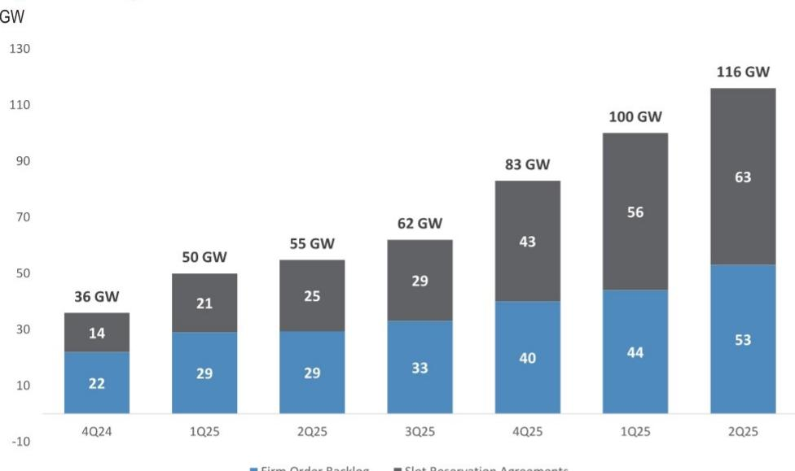

# JPM

# 亚洲电力设备

## 从GE Vernova 2Q26业绩看行业动向

GE Vernova报告了新订单增长和运营趋势，其报价在发布后出现调整，与西门子能源等同行业公司表现相似，这或许反映市场对燃气轮机订单增长可能接近阶段性高位以及本十年末供给情况的关注。但分析师指出，GEV的预约订单向正式订单的转化情况良好，需求与供给基本面在本十年末之前保持健康。管理层在电话会议中表示，他们看到了到2027年持续扩大涡轮机订单的清晰路径。电气化业务势头持续，有机收入同比增长约30%，EBITDA利润率扩大约4个百分点；管理层提到开关设备、变电站、变压器和高压直流输电设备等领域增长明显，并预计3季度EBITDA利润率环比进一步改善。数据中心订单表现突出，上半年达50亿美元（约为2025全年的两倍），表明尽管存在项目延期担忧，需求依然稳健。总体来看，这些业绩——特别是电气化板块——强化了我们对于订单获取、利润率提升以及输电设备在数据中心机遇上的积极看法；我们持续关注亚洲相关公司。

- 2Q26业绩概要：GEV第二季度预估EBITDA略低于市场预期约3%，收入略高于预期约3%。EBITDA小幅不及预期主要源于风电业务盈利低于预期以及当季未分配公司成本较高，而核心的电力与电气化板块表现优于预期。当季订单242亿美元，高于预期，主要受电力板块167亿美元订单驱动，电气化板块63亿美元订单也小幅超预期。电力板块：新签燃气发电合同约20GW，高于管理层此前指引的10–15GW，也高于我们听到的买方预期区间的高端。GEV预计到2026年底燃气发电在手订单加预约订单将至少达到125GW，此前为至少110GW。公司还宣布燃气发电产能扩至20GW已完成，2028年24GW的目标按计划推进。此外，管理层指出，正在利用现有工厂内的精益生产和增量设备，到2030年实现30GW产能。

- 为什么电力设备相关报价在GEV业绩后出现调整？欧洲分析师的报告认为有两点原因。（1）关于燃气轮机新订单获取：分析师指出，GEV本季度20GW新燃气轮机订单中，18GW为预约协议，2GW为新增正式订单，这可能在初步解读时被视为“确定性较低”。但分析师认为这种看法有误导性。他提到，GEV本季度将10GW预约协议转化为正式订单，意味着正式订单总获取量为12GW（10+2），约为季度交付量的3.7倍。他还指出，在订单储备从44GW增至53GW，预约订单从56GW增至63GW，这反映了需求相对于供给的态势。（2）关于燃气轮机产能扩充：分析师指出，GEV将产能指引上调至2030年30GW（此前2028年目标为26GW，含航改型）。他认为这是增量信息，并非意外，但确实重新引发了关于本十年末供给格局的讨论。他估算全球供给与订单对比：2024年约50GW对约57GW；2025年约55GW对约100GW；2026年约64GW对约115–120GW；2027年约70GW对约110–120GW；2028年约80GW对约110–120GW。到2030年他预计供给达90–95GW以上，在订单和定价方面仍有一定支撑。

- 燃气轮机订单今年并未见顶：管理层在业绩电话会上表示，他们看到了非常清晰的路径，可以在今年之后继续扩大签约合同规模。虽然今年指引为125GW，但他们有信心在2027年相对于2026年底实现超过125GW的稳健增长。预计未来六个季度的大部分时间内，签约合同储备将持续增加。

- 电气化板块势头持续：电气化板块2Q26收入增长64%至36亿美元（剔除Prolec收购影响后为29%），EBITDA弹性较高以上至6.71亿美元。EBITDA利润率同比扩大近4个百分点至18.4%，订单仍保持强劲，为收入的1.7倍，达63亿美元（同比增长66%）。公司指引EBITDA利润率环比小幅改善。管理层将全年收入指引上调至145–150亿美元（此前为140–145亿美元）。管理层提到各产品线均有增长，开关设备、变电站、变压器和HVDC设备表现突出。我们认为GEV的强劲订单和利润率扩张表明美国高压输电设备正处于上行周期，这将对亚洲相关公司产生积极影响，尤其是未来两周将发布业绩的韩国电力设备公司。

- 上半年数据中心订单50亿美元，为2025年全年两倍：公司电气化板块录得27亿美元数据中心订单，使上半年该板块数据中心订单总额超过50亿美元（占全部订单140亿美元的约35%以上），是2025年全年的两倍多。公司为数据中心提供广泛产品，包括发电设备、软件和控制系统。公司目前指引每GW约3亿美元的范围，但若推出新产品（如中压UPS、固态变压器等），该数字有望提升，单GW范围可能是目前的2–3倍。总体而言，我们认为GEV的数据中心订单表明输电设备的需求不仅来自受监管的公用事业/电网，数据中心（包括表前和表后发电）也贡献了强劲需求。值得注意的是，HD Hyundai Electric和Hyosung Heavy的数据中心新订单占比目前约10%，我们预计即将发布的二季度业绩中这一比例将有所上升。

- 固态变压器取得进展：GEV已完成用于室内场景的5MW固态变压器样机制造，将于今年晚些时候交付给首个超大规模用户；同时已启动6MW户外场景固态变压器的开发。订单可能最早于2027年出现。

Figure 1: 在手订单 + 预约订单 GW  
  
■ 正式订单储备 ■ 预约协议

Source: JPM, Company Reports

Table 1: GEV 2Q业绩

| (单位：百万美元，每股数据除外) | 2Q26实际 | 2Q26 JPM预估 | 实际 vs 预估 | 2Q26市场预期 | 实际 vs 预期 |
|---|---|---|---|---|---|
| 财务数据 | | | | | |
| 电力收入 | 5,477 | 5,529 | -1% | 5,556 | -1% |
| 同比增速 | 15.1% | 16.2% | | 16.8% | |
| 风电收入 | 2,026 | 1,906 | 6% | 1,870 | 8% |
| 同比增速 | -9.8% | -15.1% | | -16.7% | |
| 电气化收入 | 3,637 | 3,489 | 4% | 3,379 | 8% |
| 同比增速 | 65.2% | 58.5% | | 53.5% | |
| 分部间抵销 | -36 | -102 | | 20 | |
| 总收入 | 11,104 | 10,821 | 3% | 10,825 | 3% |
| 同比增速 | 21.9% | 18.8% | | 18.8% | |
| 电力预估EBITDA | 1,031 | 1,000 | 3% | 992 | 4% |
| 电力预估EBITDA利润率 | 18.8% | 18.1% | | 17.9% | |
| 风电预估EBITDA | -275 | -255 | -8% | -248 | -11% |
| 风电预估EBITDA利润率 | -13.6% | -13.4% | | -13.2% | |
| 电气化预估EBITDA | 671 | 646 | 4% | 610 | 10% |
| 电气化预估EBITDA利润率 | 18.4% | 18.5% | | 18.0% | |
| 其他预估EBITDA | -177 | -128 | -38% | -123 | -44% |
| 总计预估EBITDA | 1,250 | 1,263 | -1% | 1,290 | -3% |
| 总计预估EBITDA利润率 | 11.3% | 11.7% | | 11.9% | |
| 自由现金流 | 5,107 | 1,007 | 407% | 1,299 | 293% |

Source: JPM estimates, Company Reports

Table 2: GEV电气化关键业绩指标 百万美元

| 订单 | | | | |
|---|---|---|---|---|
| 百万美元 | 1Q'25 | 2Q'25 | 1Q'26 | 2Q'26 |
| 设备 | 2,808 | 2,746 | 6,421 | 5,667 |
| 服务 | 557 | 537 | 691 | 680 |
| 总订单 | 3,366 | 3,283 | 7,112 | 6,347 |
| 同比%（有机） | | | | |
| 设备 | | | 99% | 72% |
| 服务 | | | 18% | 31% |
| 总订单 | | | 86% | 66% |

| 百万美元 | 1Q'25累计 | 2Q'25累计 | 1Q'26累计 | 2Q'26累计 |
|---|---|---|---|---|
| 设备 | 2,808 | 5,555 | 6,421 | 12,089 |
| 服务 | 557 | 1,094 | 691 | 1,371 |
| 总订单 | 3,366 | 6,649 | 7,112 | 13,460 |
| 同比%（有机） | | | | |
| 设备 | | | 99% | 85% |
| 服务 | | | 18% | 25% |
| 总订单 | | | 86% | 76% |

| 分部收入与EBITDA | | | | |
|---|---|---|---|---|
| 百万美元 | 1Q'25 | 2Q'25 | 1Q'26 | 2Q'26 |
| 输电 | 692 | 759 | 1,380 | 1,877 |
| 电网系统集成 | 390 | 579 | 691 | 806 |
| 电力转换与储能 | 381 | 411 | 477 | 539 |
| 电网自动化与软件 | 378 | 412 | 411 | 416 |
| 分部总收入 | 1,840 | 2,162 | 2,959 | 3,637 |
| 设备 | 1,391 | 1,673 | 2,501 | 3,130 |
| 服务 | 448 | 488 | 459 | 507 |
| 分部总收入 | 1,840 | 2,162 | 2,959 | 3,637 |
| 分部EBITDA | 205 | 314 | 528 | 671 |
| 分部EBITDA利润率 | 11.1% | 14.5% | 17.8% | 18.4% |

| 同比%（有机） | | | | |
|---|---|---|---|---|
| 设备 | | | 39% | 36% |
| 服务 | | | -5% | 6% |
| 分部总收入 | | | 29% | 29% |
| 分部EBITDA利润率 | | | 590bps | 700bps |

| 百万美元 | 1Q'25累计 | 2Q'25累计 | 1Q'26累计 | 2Q'26累计 |
|---|---|---|---|---|
| 输电 | 692 | 1,451 | 1,380 | 3,256 |
| 电网系统集成 | 390 | 968 | 691 | 1,497 |
| 电力转换与储能 | 381 | 792 | 477 | 1,016 |
| 电网自动化与软件 | 378 | 790 | 411 | 827 |
| 分部总收入 | 1,840 | 4,001 | 2,959 | 6,597 |
| 设备 | 1,391 | 3,065 | 2,501 | 5,631 |
| 服务 | 448 | 937 | 459 | 966 |
| 分部总收入 | 1,840 | 4,001 | 2,959 | 6,597 |
| 分部EBITDA | 205 | 519 | 528 | 1,200 |
| 分部EBITDA利润率 | 11.1% | 13.0% | 17.8% | 18.2% |

| 同比%（有机） | | | | |
|---|---|---|---|---|
| 设备 | | | 39% | 37% |
| 服务 | | | -5% | 1% |
| 分部总收入 | | | 29% | 29% |
| 分部EBITDA利润率 | | | 590bps | 650bps |

Source: Company data, JPM.

Table 3: 电力与电气化板块财务数据 百万美元

| 百万美元 | 1Q'25 | 2Q'25 | 3Q'25 | 4Q'25 | 1Q'26 | 2Q'26 | 2Q'26同比%（有机） |
|---|---|---|---|---|---|---|---|
| 电力 | | | | | | | |
| 分部收入 | 4,449 | 4,785 | 4,863 | 5,776 | 4,971 | 5,477 | 14% |
| 设备 | 1,491 | 1,504 | 1,744 | 1,946 | 1,885 | 1,965 | 30% |
| 服务 | 2,958 | 3,280 | 3,119 | 3,830 | 3,086 | 3,512 | 7% |
| 分部EBITDA | 517 | 785 | 651 | 982 | 811 | 1,031 | |
| 分部EBITDA利润率 | 11.6% | 16.4% | 13.4% | 17.0% | 16.3% | 18.8% | 320bps |

| 电气化 | | | | | | | |
|---|---|---|---|---|---|---|---|
| 分部收入 | 1,840 | 2,162 | 2,565 | 2,921 | 2,959 | 3,637 | 29% |
| 设备 | 1,391 | 1,673 | 2,035 | 2,279 | 2,501 | 3,130 | 36% |
| 服务 | 448 | 488 | 530 | 642 | 459 | 507 | 6% |
| 分部EBITDA | 205 | 314 | 387 | 494 | 528 | 671 | |
| 分部EBITDA利润率 | 11.1% | 14.5% | 15.1% | 16.9% | 17.8% | 18.4% | 700bps |

Source: Company data, JPM.

Table 4: GEV指引

| | 4月22日指引 | 7月22日指引 |
|---|---|---|
| GE Vernova | | |
| 总收入 | $44.5B-$45.5B | $45.5B-$46.5B |
| 调整后EBITDA利润率 | 12%-14% | 12%-14% |
| 自由现金流 | $6.5B-$7.5B | $11.5B-$12.5B |
| 电力 | | |
| 有机收入增速 | 16%-18% | 18%-20% |
| 分部EBITDA利润率 | 17%-19% | 17%-19% |
| 电气化 | | |
| 收入 | $14.0B-$14.5B，含Prolec GE约$3.0B | $14.5B-$15.0B，含Prolec GE约$3.1B |
| 分部EBITDA利润率 | 18%-20% | 18%-20% |
| 风电 | | |
| 有机收入增速 | 低两位数下降 | 低两位数下降 |
| 分部EBITDA | 亏损约$400M | 亏损约$400M |

Source: Company data, JPM.

本文提及的公司：GE Vernova, HD Hyundai Electric, Hyosung Heavy Industries, Siemens Energy, Wasion Holdings Ltd - H
