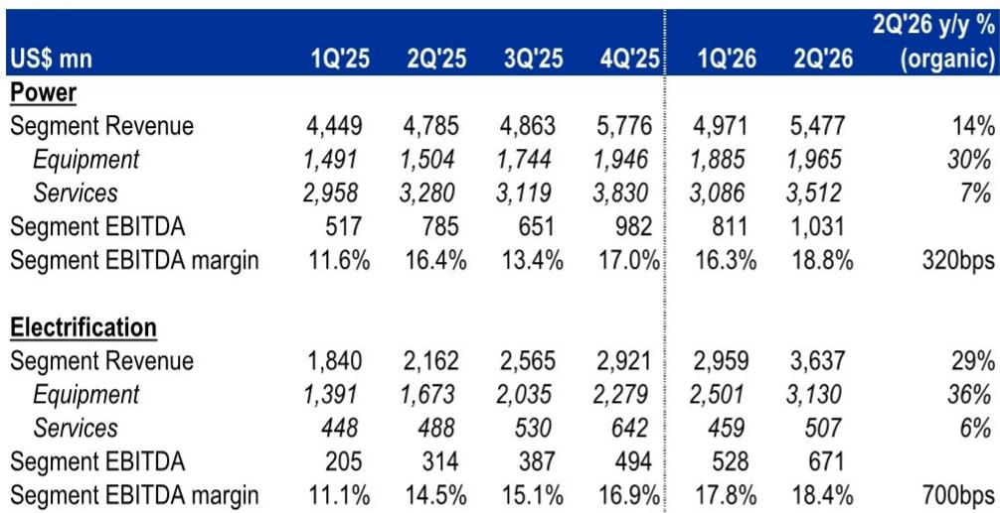
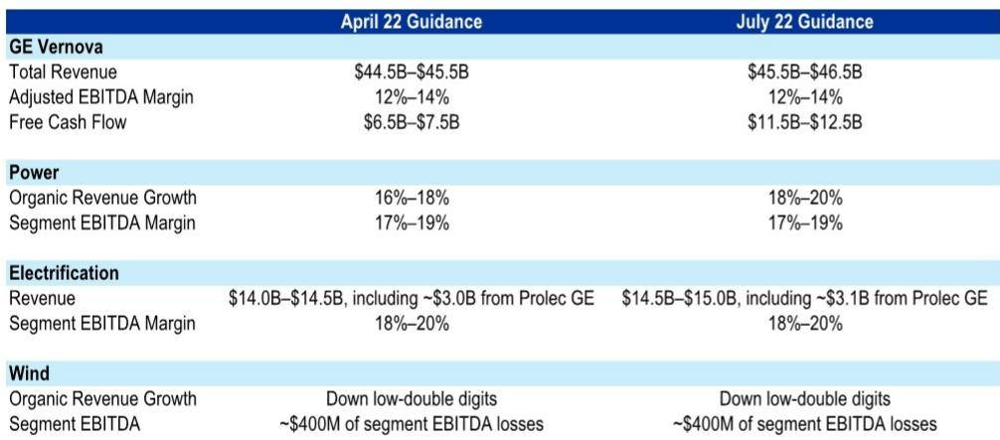

# 电气化周期远未触顶——正进入最具结构性支撑的阶段

GE Vernova 2026财年第二季度业绩公布后，电力设备相关公司的报价出现短暂调整。市场的即时反应主要围绕两个关注点：燃气轮机订单可能趋于平稳，以及面向2030年的产能扩张计划可能带来供应过剩风险。然而，这一解读与数据本身存在偏差。更深入的数据分析揭示了相反的动态。GE Vernova在一个季度内将10吉瓦的产能预留协议转化为正式订单，使正式订单总量达到12吉瓦——约为季度交付量的3.7倍。公司积压订单从44吉瓦增至53吉瓦，产能预留从56吉瓦增至63吉瓦。这些并非周期见顶的信号，而是需求持续超过供给、定价和利润结构持续增强的证明。

本季度最重要的信号并非来自燃气轮机，而是来自电气化业务板块。该板块收入同比增长64%至36亿美元，有机增长率为29%。EBITDA增长逾一倍至6.71亿美元，利润率扩大近400个基点至18.4%。订单额达到收入的1.7倍，总计63亿美元。这是市场参与者应重点关注的业务领域，因为它捕捉了来自数据中心、电网现代化和高压输电设备的长期需求——这些趋势并非周期性，不会在2027或2028年触顶。对于亚洲电力设备制造商而言，这一信号具有直接的参考意义。周期仍在持续，利润率趋势向好，机遇空间正在扩大。

## 市场误读燃气轮机订单趋于平稳，但产能预留向正式订单的转化证明需求仍在加速

财报发布后市场出现调整的主要原因，是对GE Vernova 20吉瓦新增燃气轮机订单的表面解读。其中，18吉瓦来自产能预留协议，仅2吉瓦来自新的正式订单。对关注总体数字的观察者而言，这似乎是一种承诺约束力减弱的转变。但这种解读具有误导性。同一季度，GE Vernova将10吉瓦的现有产能预留转化为正式订单。净效果是，正式订单总量达到12吉瓦，远高于公司季度交付能力。积压订单环比增长9吉瓦，产能预留协议增长7吉瓦。公司目前预计，到2026财年末，积压订单与产能预留合计至少达到125吉瓦，高于此前110吉瓦的目标。

管理层在财报电话会议上明确表示，他们看到了在2026年后继续增长合同订单量的清晰路径。他们预期到2026年底达到125吉瓦，并对2027年水平在此基础上有健康增长表示有信心。公司还确认，年产20吉瓦燃气轮机产能的扩建已完成，按计划到2028财年将达24吉瓦，并预计到2030年通过精益制造和现有工厂内的增量设备配置达到30吉瓦。产能扩张的叙事再次引发了关于本十年末供应过剩的担忧，但这些担忧为时过早。2025财年全球供应估计约为55吉瓦，而订单约为100吉瓦。到2028财年，预计供应为80吉瓦，需求为110至120吉瓦。即使到2030财年，当供应可能达到90至95吉瓦时，积压订单和定价预计仍将保持支撑性。市场目前正在定价一种订单簿尚未支持的供应过剩情景。

## 电气化板块是结构性增长引擎，利润率扩张速度快于预期

GE Vernova的电气化板块交出了本季度最具影响力的业绩。收入同比增长64%至36亿美元，在剔除Prolec收购影响后有机增长率为29%。EBITDA增长逾一倍至6.71亿美元，利润率同比扩大约700个基点至18.4%。公司将该板块全年收入指引上调至145亿至150亿美元，此前为140亿至145亿美元。管理层提到，所有主要产品类别均表现强劲：开关设备、变电站、变压器和高压直流设备。

这并非单季度现象。电气化板块利润率已连续六个季度环比扩张，从2025财年第一季度的11.1%升至2026财年第二季度的18.4%。公司预计第三季度利润率将温和环比扩张。销量增长、定价能力和运营杠杆的结合表明，该板块仍处于多年利润率改善周期的早期阶段。对于亚洲电力设备制造商，这是最重要的参考信号。美国的电气化周期仍在持续，来自受监管公用事业和数据中心运营商的高压输电设备需求正在加速，而非减速。

## 数据中心订单六个月内弹性较高，确认表后需求是结构性驱动因素而非周期性现象

GE Vernova在第二季度仅电气化板块就录得27亿美元的数据中心订单，使2026财年上半年数据中心订单总额超过50亿美元。这比2025财年全年水平翻了一倍以上。数据中心订单目前约占该板块140亿美元订单总额的35%。公司为数据中心提供广泛产品，包括发电设备、软件和能源管理解决方案。管理层对当前每吉瓦数据中心容量的产品价值方向性估算约为3亿美元，并指出，如果公司推出中压不间断电源和固态变压器等新产品，该数字可能增长两到三倍。

这一数据点的意义超越了GE Vernova本身。它表明输电设备需求并非仅由受监管公用事业的电网支出驱动。数据中心运营商，无论是表前还是表后发电，都在进行大规模、多年度的变压器、开关设备和变电站设备采购。对于现代电气和晓星重工等亚洲制造商而言，其数据中心订单占比目前仅为个位数百分比至两位数百分比，其含义是清晰的。在接下来的几个季度中，数据中心在其订单簿中的占比可能会显著增加，而这两家公司即将发布的第二季度业绩将是对这一判断的重要验证。

## 固态变压器正从原型走向商业部署，开启行业新产品周期

GE Vernova已完成用于室内应用的5兆瓦固态变压器原型建造，并将于今年晚些时候交付给一家超大规模客户。公司还已开始开发6兆瓦的户外版本。最早可能在2027年开始获得订单。固态变压器代表了电力转换设备在效率、尺寸和可控性方面的潜在跃迁。对于空间约束和功率密度要求至关重要的数据中心应用而言，它们尤其具有相关性。一家主要的超大规模客户已在接收原型，这表明商业采用比许多市场参与者预期的更近。

对于更广泛的电力设备行业而言，固态变压器的发展标志着一个新产品的周期，可能延长当前资本支出浪潮的持续时间。传统变压器是长周期产品，有着成熟的供应链和定价模式。固态变压器引入了不同的成本结构、不同的性能特征和不同的竞争格局。早期投入这一技术的公司可能能够在数据中心和电网现代化领域占据更大份额。GE Vernova的进展，加上中国的并行发展，表明这并非一项投机性技术，它正进入部署阶段。

## 亚洲电力设备公司的观察框架：聚焦积压订单质量、利润率趋势与数据中心占比

GE Vernova的业绩为评估亚洲电力设备公司提供了一个清晰的框架。第一个维度是积压订单质量。正式订单与产能预留之间的区别很重要，但转化率是关键指标。GE Vernova在一个季度内将10吉瓦的产能预留转化为正式订单。可以观察亚洲制造商是否也在经历类似的转化动态。转化率高且积压订单增长的公司，比那些依赖可能无法转化为收入的新订单获取的公司更具优势。

第二个维度是利润率趋势。GE Vernova电气化板块的利润率同比扩大了700个基点。这不仅仅是销量的作用，它反映了在供给受限市场中的定价能力。涉及高压输电设备、变压器和开关设备的亚洲制造商，应能观察到类似的利润率扩张。现代电气和晓星重工即将发布的第二季度业绩将直接检验利润率周期是否传导至亚洲地区。

第三个维度是数据中心占比。GE Vernova的数据中心订单在六个月内弹性较高。亚洲制造商目前对数据中心的敞口处于低个位数到低两位数百分比之间。如果这一占比增加，可能推动该领域的重新评估。可以关注即将发布的季度报告中数据中心订单占比情况。有意义的增长将确认数据中心周期是全球性的，而不仅仅是美国的现象。

第四个维度是技术定位。固态变压器、中压UPS系统和电网自动化软件正成为竞争差异化的因素。能够为数据中心运营商提供更广泛产品组合的公司，每吉瓦容量的产品价值将更高。当前每吉瓦3亿美元的估算值，随着产品组合的扩展可能弹性较高或增长两倍。正在这些技术领域进行投入的亚洲制造商将获得更多收益。

周期并未结束。它正从燃气轮机转向电气化，从公用事业支出转向数据中心需求，从传统变压器转向下一代电力电子设备。市场对财报的即时反应是对数据的误读。基本面状况比报价反应所暗示的更加强劲。

*本文仅供参考，部分内容可能基于源材料通过AI辅助生成、翻译、摘要或编辑，可能存在遗漏或错误。请独立核实。本文不构成专业建议。*

本文仅供参考，部分内容可能基于源材料通过AI辅助生成、翻译、摘要或编辑，可能存在遗漏或错误。请独立核实。本文不构成专业建议。

