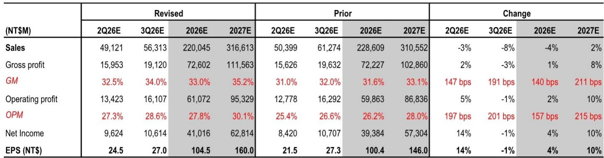
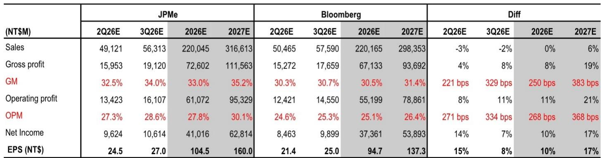
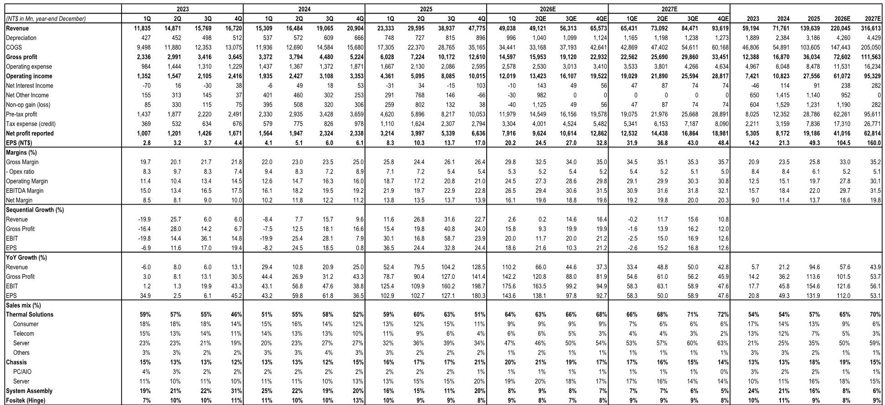

# JPM：研究主题与行业变化观察

一份来自JPM的最新报告，将亚洲组件（Asia Vital Components,AVC）的2026年第二季度毛利率预期从31%上调至32.5%，远高于市场一致预期的约30%。这一判断的核心依据并非营收规模扩张，而是公司在液冷散热领域良率提升和生产效率改善带来的结构性利润增长。报告同时指出，AVC过去三个月相对台湾加权指数表现落后约35%，主要原因是英伟达VR200冷板订单从6月推迟至8月出货。随着这一问题基本解决，营收动能有望在8月恢复。

## 1. 第二季度毛利率预期与市场共识存在明显差距

报告认为，AVC第二季度营收约491亿新台币，环比持平，低于JPM和彭博一致预期约3%，主要受VR200出货延迟影响。但毛利率预计达到32.5%，高于JPM此前预期的31%，更显著高于彭博一致预期的约30%。这一差距来自良率控制和生产效率提升，而非单纯的价格因素。结合费用管控和非营业收益，JPM将第二季度每股数据预期上调14%至24.5新台币，高于市场一致预期的21.4新台币。

> **KC观察：** 毛利率是判断一家散热组件公司竞争力的核心指标。市场对AVC的毛利率预期仍停留在30%左右，而JPM认为实际数据可能高出2.5个百分点。这种差距如果被后续财报验证，可能引发市场对该公司盈利能力的重新评估。

## 2. 液冷散热项目从第三季度起进入量产爬坡阶段

报告预计，AVC第三季度营收将环比增长15%，主要驱动力是英伟达VR200冷板从8月开始量产。到第四季度，AWS Trainium 3和谷歌TPU v8的液冷版本冷板也将进入量产，且单机价值量高于英伟达系统。JPM模型显示，这些新ASIC液冷项目将推动第四季度营收环比再增长16%。毛利率方面，液冷散热占比提升和良率改善将推动第三、第四季度毛利率分别达到34%和35%，而市场一致预期仍停留在30.5%和31.4%。

## 3. 下一代产品液冷散热价值量存在进一步上升空间

报告指出，在VR Ultra代际中，计算托盘液冷散热的价值量可能继续增长。此前从GB到VR代际，液冷散热价值量已提升超过50%。VR Ultra因更高规格和功率密度，需要增加冷板和快接头（QD）单元。这一设计预计在未来几个月内确认。这意味着液冷散热的结构性升级趋势尚未结束，单台服务器的散热组件价值量仍有提升空间。

## 4. 业绩展望上调反映毛利率加速和内容价值增长

基于上述判断，JPM将2026年和2027年每股数据预期分别上调4%和10%，主要来自毛利率加速增长以及未来GPU和ASIC系统散热内容价值的持续提升。报告认为，AVC在2024至2027年期间约100%的利润增长，是其估值高于历史均值的基础。

这份报告的核心逻辑可以概括为：液冷散热渗透率提升和单机价值量增长，正在改变散热组件公司的利润结构。市场对毛利率的预期可能滞后于实际改善速度，而营收节奏的短期扰动不应被误读为需求趋势的变化。对于关注AI硬件产业链的读者，AVC的毛利率走势和下一代产品设计确认时间点，是值得持续跟踪的两个关键变量。

For informational purposes only. Portions may be generated,translated,summarized,or edited with AI assistance based on source materials and may contain omissions or errors. Please verify independently. This is not investment,legal,tax,accounting,or other professional advice.

For informational purposes only. Portions may be generated,translated,summarized,or edited with AI assistance based on source materials and may contain omissions or errors. Please verify independently. This is not investment,legal,tax,accounting,or other professional advice.

