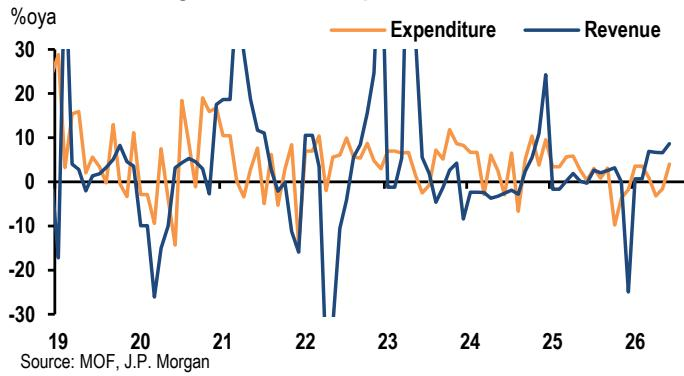
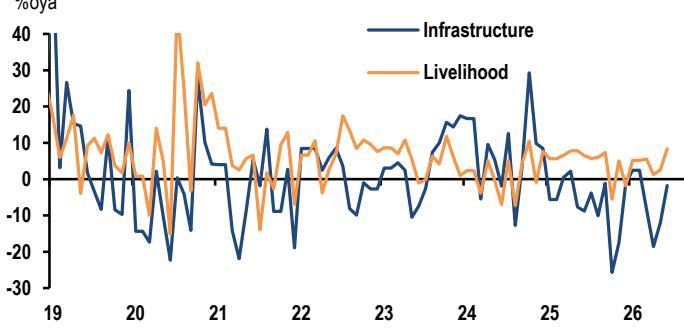
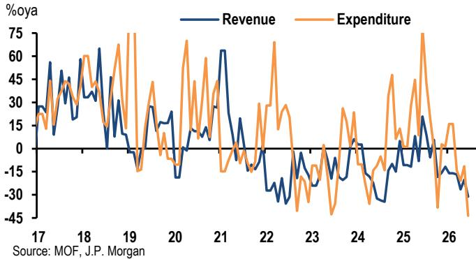
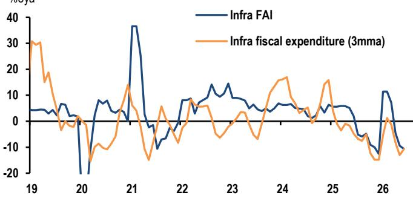
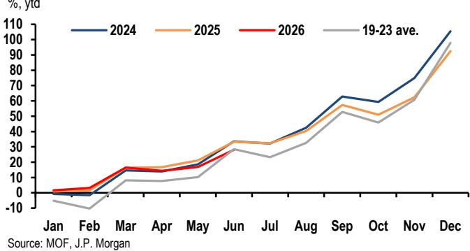
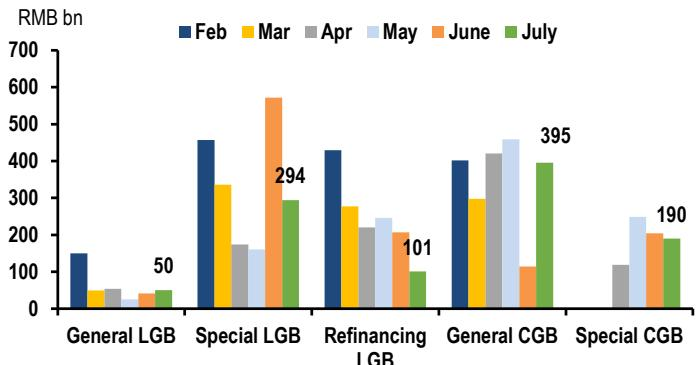

# China: 二季度财政支出节奏较缓，下半年留有余地

# 近期关注执行层面

Extel - 2026

CLICK TO VOTE

Global Fixed Income Research Survey

Voting Open July 6 - July 24
Please vote for JPM (5 stars)

- 6月一般公共预算收入和支出有所改善，而依赖土地出让的政府性基金账户持续承压。
- 预算支出有所回升，但基建相关支出增长仍为负值，对整体项目推进产生影响。
- 尽管加速使用，上半年财政存款增加规模仍高于近年正常水平（2025年除外）。
- 二季度财政执行节奏较缓，为下半年留有更多政策空间，近期关注重点在于加快预算落地。

6月不同账户的财政状况有所分化。一般公共预算收入在PPI走势的支撑下继续改善，支出端也呈现回升态势，令人鼓舞。相比之下，政府性基金账户收入和支出收缩幅度加大，反映出土地出让收入持续偏弱带来的影响。尽管加速使用，上半年财政存款增加仍高于近年正常水平（2025年除外）。结合政府债券发行节奏偏缓，这表明下半年仍有较大财政空间，这也是我们近期上调宏观增长预期的依据之一。

6月一般公共预算收入增速加快，支出也有所回升。6月一般公共预算收入同比增速升至8.7%（全年预算目标为2.2%），为2025年1月以来最快，带动上半年累计增速至4.7%。税收收入是主要拉动项，同比增长10.8%，其中企业所得税增长29.7%，证券交易印花税收入增幅达145.3%。非税收入增速在5月反弹5.6%后回落至2.9%。一般公共预算支出在连续两个月收缩后恢复正增长（同比+4.0%），这是积极信号。但即便6月有所回升，二季度支出同比仅增长0.2%，低于一季度的2.6%和全年4.4%的预算目标。分项看，与“投资于人”政策相关的民生类支出增速回升至8.4%（5月为2.5%）。但基建类支出仍处于收缩状态，同比-1.8%，不过降幅较5月的-12.0%有所收窄。这对基建类固定资金形成（同比-10.6%）和公共类固定资金形成（同比-7.1%）持续产生影响。

土地出让收缩进一步加深，拖累政府性基金账户收支。在一般公共预算之外，政府性基金账户目前是各类基金账户中最大的资金来源，仍然高度依赖土地出让收入，而支出则与土地相关支出及专项债资金使用密切相关。6月，政府性基金收入同比下降31.1%，其中土地出让收入降幅扩大至42.1%，为十多年来最大单月降幅。土地出让状况的再度走弱（而2025年全年降幅为14.7%），凸显了房地产周期调整对地方财政状况的持续影响。收入疲弱的同时，政府性基金支出下降43.7%，表明在地方财政资源受限的情况下，财政落地面临的约束有所增加。

二季度财政执行放缓，为下半年留出更多预算空间。二季度固定资金形成收缩，反映出可落地项目储备有限、资金更多用于偿债、政府债券发行及资金使用进度偏慢，以及为新建项目提供初始资本金的政策性金融工具逐步推进。7月以来，专项债发行再次环比放缓。尽管6月底的集中发行形成了一笔可用于近期项目落地的资金池，但也表明即便二季度GDP（同比4.3%）略低于全年目标（4.5-5%），财政执行并未明显加速。我们认为政策层面对短期宏观背景仍相对满意，上半年4.7%的增长仍在年度目标区间内，因此加码财政落地的紧迫感有所降低。

我们仍判断后续财政呈两阶段路径，近期重点仍在执行。阶段一聚焦于使用已批准的预算资金及财政存款。随着项目审批加快、政府债券发行提速、资金使用效率提升，基建和公共领域资金形成有望逐步改善，同时下半年基数效应也更有利。阶段二则更具条件性：如果三季度增长再次明显低于全年4.5-5.0%目标区间，则年底前追加财政支持的论据将有所增强。但我们的把握度较低，因为目标区间本身已给予政策层面比往年更大的灵活度。目前来看，我们仍处于阶段一，7月政治局会议释放增量财政支持信号的概率较低。

## 中国：月度财政状况

<table><tr><td></td><td>2025</td><td>3月</td><td>4月</td><td>5月</td><td>6月</td></tr><tr><td colspan="6">一般公共预算</td></tr><tr><td>收入</td><td>-1.7</td><td>6.9</td><td>6.7</td><td>6.6</td><td>8.7</td></tr><tr><td>税收</td><td>0.8</td><td>9.1</td><td>8.2</td><td>6.8</td><td>10.8</td></tr><tr><td>非税</td><td>-11.3</td><td>2.2</td><td>-5.3</td><td>5.6</td><td>2.9</td></tr><tr><td>支出</td><td>1.0</td><td>1.0</td><td>-3.2</td><td>-1.6</td><td>4.0</td></tr><tr><td>余额（累计，占目标%）</td><td></td><td>16.5</td><td>14.4</td><td>16.9</td><td>28.1</td></tr><tr><td colspan="6">政府性基金</td></tr><tr><td>收入</td><td>-7.1</td><td>-16.7</td><td>-26.4</td><td>-20.3</td><td>-31.1</td></tr><tr><td>支出</td><td>11.2</td><td>-14.2</td><td>-20.8</td><td>-11.5</td><td>-43.7</td></tr></table>

来源：财政部，JPM

中国：财政预算收支

中国财政支出分项

来源：财政部，JPM

中国：政府性基金收支

中国财政支出与固定资金形成

财政存款增加

来源：财政部，JPM

来源：财政部，JPM

中国：财政余额占目标百分比

来源：财政部，JPM

政府债券发行

来源：Wind，JPM。注：2026年7月数据为月初至今。

中国：土地出让收入

来源：财政部，JPM

分析师薪酬：负责本报告的研究分析人员的薪酬基于多种因素，包括研究的质量和准确性、客户反馈、竞争因素以及公司整体收入。

## 其他披露

JPM是JPM Chase & Co.及其全球子公司和关联公司投资银行业务的营销名称。

UK MIFID FICC研究豁免：英国客户应参考UK MIFID Research Unbundling exemption，了解JPM实施FICC研究豁免的细节以及相关FICC研究分类的指引。

本研究材料中对China; Hong Kong; Taiwan; Macau的任何长格式表述均为Mainland China; Hong Kong SAR (China); Taiwan (China); Macau SAR (China)。

JPM可能不时就受美国、欧盟、英国或其他相关司法管辖区政府当局实施或管理的经济或金融制裁所针对的发行人或证券（“受制裁证券”）进行撰写。本报告中的任何内容均无意被解读为鼓励、促进、推动或以其他方式批准对这类受制裁证券进行投资或交易。客户在做出投资决策时应自行了解其法律和合规义务。

本研究报告中讨论的任何数字或加密资产均受快速变化的监管环境约束。有关加密资产（包括比特币和以太坊）的相关监管提示，请参阅 https://www.JPM.com/disclosures/cryptoasset-disclosure。

本研究报告的作者可能未在您所在的司法管辖区获得开展受监管活动的许可，如果未获得许可，则他们不会声称自己有能力这样做。

交易所交易基金（ETF）：JPM Securities LLC（“JPMS”）担任几乎所有美国上市ETF的授权参与者。如果本报告中提及任何ETF，JPMS可能因分销这些ETF份额而赚取佣金和基于交易的报酬，并可能因执行其他与交易相关的服务（例如向ETF份额卖空者提供证券借贷）而赚取费用。JPMS还可能为ETF本身提供服务，包括担任ETF的经纪商或交易商。此外，JPMS的关联公司可能为ETF提供服务，包括信托、托管、管理、借贷、指数计算和/或维护及其他服务。

银行间报价利率（IBOR）及其他基准利率的变更：某些利率基准可能正在或将在未来接受国际、国家及其他监管指引、改革及改革提案。更多信息请查阅：https://www.JPM.com/global/disclosures/interbank_offered_rates

私人银行客户：如果您是JPM Chase & Co.及其子公司（“JPM私人银行”）提供的私人银行业务的客户并收到研究报告，则研究报告由JPM私人银行提供，而非JPM的任何其他部门，包括但不限于JPM企业与投资银行及其全球研究部门。

负责制作和分发研究的法律实体：本材料中列于Reg AC研究分析师名称下方的法律实体是负责制作本研究的法律实体。如果有多位Reg AC研究分析师以不同法律实体署名，则这些法律实体共同负责制作本研究。如果分析师名称下列出两个以上法律实体，则除非另有说明，第一个法律实体负责制作。JPM各关联公司的研究分析师可能为制作本材料做出了贡献，但可能未在您所在的司法管辖区获得开展受监管活动的许可（且不声称自己有能力这样做）。除非法律实体披露中另有说明，本材料由负责制作的法律实体分发，或者如果分析师名称下列出两个以上法律实体，则由第一个法律实体负责分发。如有任何疑问，请联系您所在司法管辖区的相关研究分析师或分发本研究材料的实体。

## 法律实体披露及国家/地区特定披露：

阿根廷：JPM Chase Bank N.A Sucursal Buenos Aires受阿根廷共和国中央银行（BCRA）和阿根廷国家证券委员会（CNV）监管。

澳大利亚：JPM Securities Australia Limited（JPMSAL）（ABN 61 003 245 234 / AFS Licence No: 238066）受澳大利亚证券和投资委员会监管，是澳大利亚证券交易所的市场参与者、ASX Clear Pty Limited的清算和结算参与者以及ASX Clear（Futures） Pty Limited的清算参与者。本材料由JPMSAL在澳大利亚向“批发客户”（定义见《2001年公司法》第761G条）发行或分发。所有金融产品列表请访问https://www.jpmm.com/research/disclosures。JPM力求覆盖全球行业分类标准（GICS）所有行业以及不同市值规模的国内外读者基础相关的公司。如适用，在对标的公司进行公开尽职调查过程中，研究分析团队可能通过公司实地考察、与公司代表讨论、管理层演示等公司接触方式进行尽职调查。JPMSAL发布的研究已根据JPM Australia的研究独立性政策编制，该政策可在以下链接找到：JPM Australia - Research Independence Policy。

巴西：Banco JPM S.A.受巴西证券委员会（CVM）和巴西中央银行监管。监察员JPM：0800-7700847 / 0800-7700810（听障人士专线）/ ouvidoria.jp.morgan@jpmchase.com。

加拿大：JPM Securities Canada Inc.是一家注册投资交易商，受加拿大投资监管组织和安大略省证券委员会监管，是加拿大交易所的参与会员。本材料由JPM Securities Canada Inc.在加拿大分发。

智利：Inversiones JPM Limitada是根据智利法律成立的非监管实体。

中国：JPM Securities (China) Company Limited已获中国证监会批准开展证券投资咨询业务。

哥伦比亚：Banco JPM Colombia S.A.受哥伦比亚金融监管局（SFC）监管。本材料中提及哥伦比亚境外实体提供的产品或服务仅用于描述目的。此类引用不构成也不应被解释为哥伦比亚境内的促销活动或金融产品或服务的提供。

迪拜国际金融中心（DIFC）：JPM Chase Bank, N.A., Dubai Branch受迪拜金融服务局（DFSA）监管，注册地址为Dubai International Financial Centre - The Gate, West Wing, Level 3 and 9 PO Box 506551, Dubai, UAE。本材料由JPM Chase Bank, N.A., Dubai Branch向符合DFSA规则定义的专业客户或市场对手方分发。

欧洲经济区（EEA）：除非另有说明，研究在EEA由JPM SE（“JPM SE”）分发，JPM SE是一家信用机构，由联邦金融监管局（BaFin）授权，并受BaFin、德国中央银行（Deutsche Bundesbank）和欧洲中央银行（ECB）共同监管。JPM SE总部位于德国，注册地址为TaunusTurm, Taunustor 1, Frankfurt am Main, 60310, Germany。本材料在EEA向符合MiFID II第4条第1款第10项及其附件II定义的“专业读者”（或同等读者）分发。本材料不得由非EEA专业读者依赖或据此行动。

香港：JPM Securities (Asia Pacific) Limited（CE编号AAJ321）受香港金融管理局和香港证券及期货事务监察委员会监管，JPM Broking (Hong Kong) Limited（CE编号AAB027）受香港证券及期货事务监察委员会监管。JPM Chase Bank, N.A., Hong Kong Branch（CE编号AAL996）受香港金融管理局和证券及期货事务监察委员会监管，根据美国法律组织，责任有限。凡本材料的分发在香港属于受监管活动，本材料由JPM Securities (Asia Pacific) Limited和/或JPM Broking (Hong Kong) Limited在香港分发。

印度：JPM India Private Limited（公司识别号U67120MH1992FTC068724），注册地址为JPM Tower, Off. C.S.T. Road, Kalina, Santacruz - East, Mumbai – 400098，在印度证券交易委员会（SEBI）注册为“研究分析师”，注册号INH000001873。JPM India Private Limited还在SEBI注册为国家证券交易所和孟买证券交易所的会员（SEBI注册号INZ000239730）以及商人银行（SEBI注册号MB/INM000002970）。电话：91-22-6157 3000，传真：91-22-6157 3990，网址：http://www.jpmipl.com。JPM Chase Bank, N.A. - Mumbai Branch由印度储备银行（RBI）发牌（许可证号53/Licence No. BY.4/94；SEBI - IN/CUS/014/ CDSL : IN-DP-CDSL-444-2008/ IN-DP-NSDL-285-2008/ INBI00000984/ INE231311239），是印度的持牌商业银行，主要许可允许其在印度开展银行业务及其他印度银行分支机构允许从事的活动。对于非本地研究材料，本材料不在印度由JPM India Private Limited分发。合规官：Ashutosh Sharma；ashutosh.j.sharma@jpmchase.com；+912261575002。申诉官：Ramprasadh K，jpmipl.research.feedback@JPM.com；+912261573000。SEBI的注册和NISM的认证并不保证中介机构的业绩或向读者提供任何回报保证。

印度尼西亚：PT JPM Sekuritas Indonesia是印度尼西亚证券交易所的会员，并在金融服务局（OJK）注册和监管。

韩国：JPM Securities (Far East) Limited, Seoul Branch是韩国交易所（KRX）的会员。JPM Chase Bank, N.A., Seoul Branch在韩国注册为外资银行分行（JPM Chase Bank, N.A.）。两个实体均受金融委员会（FSC）和金融监督院（FSS）监管。对于非宏观研究材料，该材料在韩国由JPM Securities (Far East) Limited, Seoul Branch分发。

日本：JPM Securities Japan Co., Ltd.和JPM Chase Bank, N.A., Tokyo Branch受日本金融厅监管。

马来西亚：本材料由JPM Securities (Malaysia) Sdn Bhd（18146-X）在马来西亚发行和分发，该公司是马来西亚交易所的参与组织，并持有马来西亚证券委员会颁发的资本市场服务牌照。

墨西哥：JPM Casa de Bolsa, S.A. de C.V., JPM Grupo Financiero是墨西哥证券交易所（Bolsa Mexicana de Valores）和机构证券交易所（Bolsa Institucional de Valores）的会员，并获授权由国家银行和证券委员会（Comisión Nacional Bancaria y de Valores）作为经纪交易商运营。

新西兰：本材料由JPMSAL在新西兰仅向“批发客户”（定义见《2013年金融市场行为法》）发行和分发。JPMSAL根据《2008年金融服务提供商（注册和争议解决）法》注册为金融服务提供商。

菲律宾：JPM Securities Philippines Inc.是菲律宾证券交易所的交易参与者，也是菲律宾证券清算公司和证券读者保护基金的会员。受证券交易委员会监管。

新加坡：本材料由JPM Securities Singapore Private Limited（JPMSS）[MDDI (P) 057/08/2025 and Co. Reg. No.: 199405335R]和/或JPM Chase Bank, N.A., Singapore branch（JPMCB Singapore）在新加坡发行和分发，两者均受新加坡金融管理局监管。本材料仅向《证券与期货法》（第289章）第4A条定义的认可读者、专家读者和机构读者发行和分发。本材料不旨在向任何零售读者或不属于“认可读者”、“专家读者”或“机构读者”类别的读者发行或分发。新加坡的接收者应就本材料引起的或与之相关的任何事宜联系JPMSS或JPMCB Singapore。

南非：JPM Equities South Africa Proprietary Limited和JPM Chase Bank, N.A., Johannesburg Branch是约翰内斯堡证券交易所的会员，并受金融部门行为监管局（FSCA）监管。

台湾：JPM Securities (Taiwan) Limited是台湾证券交易所的参与者（公司型），并受台湾证券期货局监管。与权益证券相关的材料由JPM Securities (Taiwan) Limited在台湾发行和分发，受许可证范围及适用法律法规的约束。如果JPM Securities (Taiwan) Limited制作关于未在台湾证券交易所或台北交易所上市的证券（“非台湾上市证券”）的研究材料，这些材料不构成台湾适用法规下的证券推荐，并且为避免疑问，JPM Securities (Taiwan) Limited不充当非台湾上市证券的经纪商。

泰国：本材料由JPM Securities (Thailand) Ltd.在泰国发行和分发，该公司是泰国证券交易所的会员，并受财政部和证券交易委员会监管。注册地址为548 One City Center Building, 50th Floor, Ploenchit Road, Lymphini, Pathum Wan, Bangkok 10330。

英国：研究由JPM Securities plc（“JPMS plc”）在英国制作，该公司是伦敦证券交易所的会员，并受审慎监管局授权及受金融行为监管局和审慎监管局监管，或由JPM Markets Limited（“JPMML Ltd”）制作，后者受金融行为监管局授权和监管。除非另有说明，本材料由JPMS plc在英国分发，并且仅针对：(a) 拥有投资相关事务专业经验的人士（符合《2000年金融服务与市场法（金融促销）令》2005年第19(5)条）；(b) 该命令第49条中概述的人士（高净值公司、非法人协会或合伙企业、高价值信托的受托人等）；或(c) 本通信可以合法传达的任何其他人；所有这些人士均被称为“英国相关人士”。本材料不得由非英国相关人士依赖或据此行动。与本材料相关的任何投资或投资活动仅面向英国相关人士，并将仅与英国相关人士进行。

美国：JPM Securities LLC（“JPMS”）是纽约证券交易所、FINRA、SIPC和NFA的会员。JPM Chase Bank, N.A.是FDIC的会员。由非美国关联公司发布的材料由JPMS在美国分发，JPMS对其内容负责。

一般信息：可根据要求提供更多信息。本材料中的信息来源于被认为可靠的来源。尽管已采取一切合理谨慎措施确风险自担材料中陈述的事实准确，且其中的预测、意见和预期公平合理，但JPM Chase & Co.或其关联公司和/或子公司（统称“JPM”）对所提供材料的完整性或准确性不作任何明示或暗示的陈述或保证，但有关JPM及研究分析师与作为材料主题的发行人之间参与情况的披露除外。因此，不应依赖本材料中所含信息的准确性、公平性或完整性。本材料中的数据或内容可能因计算、调整、翻译成不同语言和/或当地监管限制而存在某些差异。这些差异不应影响总体分析观点和/或对材料中可能讨论的标的公司的推荐。本材料的准备可能使用了人工智能工具，包括协助数据分析、模式识别和研究材料的内容草拟。JPM对因使用本材料或其内容而产生的任何损失不承担任何责任，JPM及其各自的董事、高级职员或员工均不对本材料的内容负责，但相关监管机构在相关司法管辖区可能施加的责任或义务除外。本材料中包含的意见、预测或预测仅代表JPM截至材料日期的当前意见或判断，如有变更，恕不另行通知。可能会根据公司特定发展或公告、市场状况或任何其他公开信息对公司/行业进行定期更新。无法保证未来的结果或事件与任何此类意见、预测或预测一致，这些意见、预测或预测仅代表一种可能的结果。此外，此类意见、预测或预测受到某些未经验证的风险、不确定性和假设的影响，未来的实际结果或事件可能存在重大差异。本材料中提及的任何投资的价值或收入可能会波动和/或受汇率变化的影响。所有定价均为指示性价格，除非另有说明，否则为所讨论证券的市场收盘价。过往表现并不预示未来结果。因此，读者收到的金额可能少于最初投资的金额。本材料不构成购买或出售任何金融工具的邀约或招揽。本文中的意见和建议未考虑个别客户的情况、目标或需求，不构成对特定客户推荐特定证券、金融工具或策略。本材料可能包含有关结构化证券、期权、期货和其他衍生品的观点。这些是复杂工具，可能涉及高风险，仅适合能够理解并承担相关风险的成熟读者。本材料的接收者必须就本文提及的任何证券或金融工具自行做出独立决定，并应寻求其认为必要的独立财务、法律、税务或其他顾问的建议。JPM可能基于研究分析人员的观点和研究进行自营交易，也可能以与本文观点不一致的方式为其自身账户或客户账户进行交易，JPM没有义务确保此类其他沟通引起本材料任何接收者的注意。JPM内部的其他人，包括策略师、销售人员和其他研究分析师，可能持有与本文观点不一致的观点。未参与本材料编制的JPM员工可能持有本材料中提及的证券（或此类证券的衍生品）并可能以与本文讨论的方式不同的方式进行交易。本材料不是任何发行人、其产品或服务或其在任何司法管辖区的证券的广告或营销。

保密与安全通知：本传输可能包含根据适用法律享有特权、保密、法律特权且/或免于披露的信息。如果您不是预期的接收者，特此通知您，严格禁止对此处包含的信息（包括依赖该信息）进行任何披露、复制、分发或使用。尽管本传输及其任何附件被认为没有病毒或其他可能影响接收和打开它的任何计算机系统的缺陷，但接收者有责任确保其没有病毒，JPM Chase & Co.及其子公司和关联公司（如适用）对于因使用本传输而产生的任何损失或损害不承担任何责任。如果您错误地收到此传输，请立即联系发件人并销毁材料的全部内容，无论是电子形式还是硬拷贝形式。此消息受电子监控：https://www.JPM.com/disclosures/email

MSCI：本文件中的某些信息（“信息”）经MSCI Inc.、其关联公司及信息提供商（统称“MSCI”）许可复制。©2026。未经适当许可，不得复制或传播该信息。MSCI对信息不作任何明示或暗示的担保（包括适销性或适用性），并在法律允许的范围内免除所有责任。除MSCI ESG Research的任何适用信息外，任何信息均不构成研究交流。另请参阅msci.com/disclaimer。

Sustainalytics：本文中包含的某些信息、数据、分析和意见经Sustainalytics许可复制，并且：(1) 包含Sustainalytics的专有信息；(2) 除非特别授权，不得复制或再分发；(3) 不构成研究交流也不认可任何产品或项目；(4) 仅用于信息目的；(5) 不保证完整、准确或及时。Sustainalytics不对任何交易决策、损害或其他损失负责。数据的使用受https://www.sustainalytics.com/legal-disclaimers中条件的约束。©2026 Sustainalytics。保留所有权利。

“其他披露”最后修订于2026年7月4日。

版权2026 JPM Chase & Co. 保留所有权利。未经JPM书面同意，不得转载、出售或再分发本材料或其任何部分。严格禁止在未经JPM事先书面同意的情况下，将任何从JPM或授权第三方（“JPM数据”）收到的研究材料用于任何第三方人工智能（“AI”）系统或模型，且此类JPM数据可供第三方访问。

---

22 July 2026
