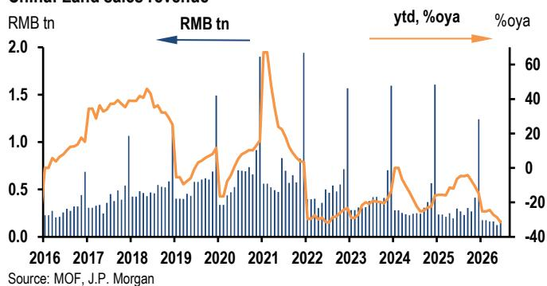
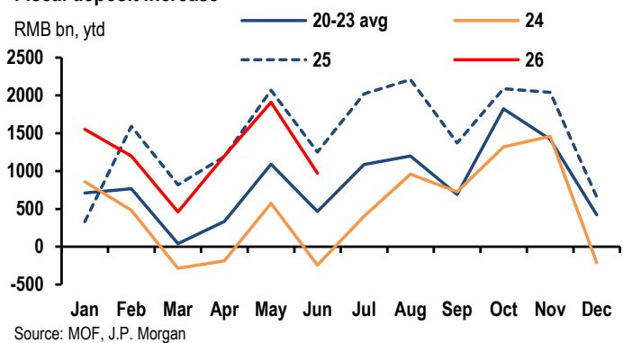

# JPM：研究主题与行业变化观察

6月公共财政数据呈现明显分化。一般公共预算收入在PPI回升推动下继续改善，当月同比增速达到8.7%，为2025年1月以来最快；支出也扭转了此前连续两个月的调整，录得4.0%的正增长。但公共专项基金收入同比下滑31.1%，其中土地出让收入降幅扩大至42.1%，创下十多年来单月较大降幅。这份JPM研报指出，上半年公共财政存款增量仍高于近年均值（剔除2025年），叠加公共债券发行节奏偏慢，意味着下半年仍有充裕的政策空间。

## 1. 一般预算收入改善主要来自税收，非税收入增速回落

6月税收收入同比增长10.8%，成为一般预算收入的主要拉动项。企业所得税收入增长29.7%，特定交易印花税收入更是大幅增长145.3%。非税收入增速从5月的5.6%回落至2.9%。支出端虽然6月出现反弹，但整个二季度支出同比仅增长0.2%，明显低于一季度的2.6%和全年4.4%的预算目标。按类别看，民生类支出（与“研究于人”政策相关）增速加快至8.4%，但基础设施类支出仍处于变化区间，同比下降1.8%，尽管较5月的-12.0%有所收窄。

> **KC评论：** 税收改善与PPI回升、市场活跃度提升有关，但基础设施支出持续负增长，说明公共资金向项目端传导仍存在堵点。二季度基础设施固定资本研究同比下降10.6%，公共固定资本研究下降7.1%，与支出数据相互印证。

## 2. 土地收入降幅扩大，公共专项基金收支同步出现变化

公共专项基金账户目前是各类基金账户中最大的融资来源，但其收入高度依赖土地出让。6月公共专项基金收入同比下降31.1%，其中土地出让收入降幅从2025年全年的-14.7%扩大至-42.1%。支出端同步变化43.7%，反映出地方公共部门在土地收入持续下滑背景下的财政约束在加大。研报认为，土地市场的持续波动是影响地方公共部门状况的核心因素。

## 3. 二季度财政执行节奏变化，下半年存在两阶段路径

研报认为，二季度财政执行节奏变化的原因包括：可落地项目储备有限、地方公共部门更侧重债务偿还、公共债券发行和资金拨付节奏偏慢，以及政策性资金工具逐步落地。尽管二季度GDP增速4.3%低于全年目标区间（4.5-5%），但上半年4.7%的增速仍在目标范围内，降低了决策层立即加码财政执行的紧迫性。

报告提出两阶段财政路径：第一阶段聚焦于执行已批准的预算和动用财政存款，随着项目审批加速、债券发行提速和资金拨付加快，基础设施和公共固定资本研究增速有望回升；第二阶段则取决于三季度增长表现，如果再次明显低于目标区间，年底前追加财政支持的可能性将上升。但研报认为，当前仍处于第一阶段，7月政治局会议释放增量财政信号的概率较低。

> **KC评论：** 理解这份报告的关键在于区分“财政空间”和“财政执行”。空间确实存在——财政存款偏高、债券发行偏慢——但执行节奏取决于决策层对增长目标的容忍度。上半年增速仍在目标区间内，意味着短期内政策重心是加速已有预算的落地，而非追加新刺激。

For informational purposes only. Portions may be generated,translated,summarized,or edited with AI assistance based on source materials and may contain omissions or errors. Please verify independently. This is not investment,legal,tax,accounting,or other professional advice.

For informational purposes only. Portions may be generated,translated,summarized,or edited with AI assistance based on source materials and may contain omissions or errors. Please verify independently. This is not investment,legal,tax,accounting,or other professional advice.

