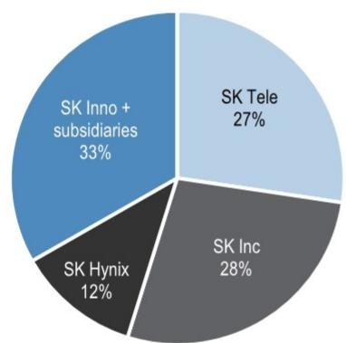
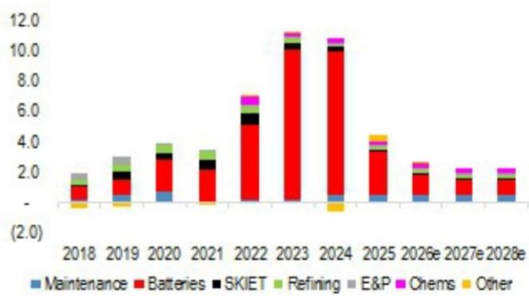
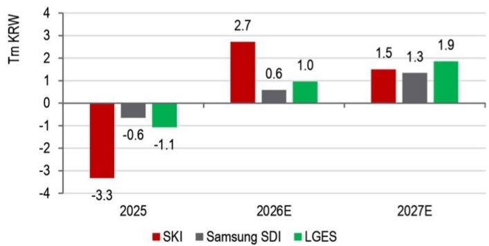
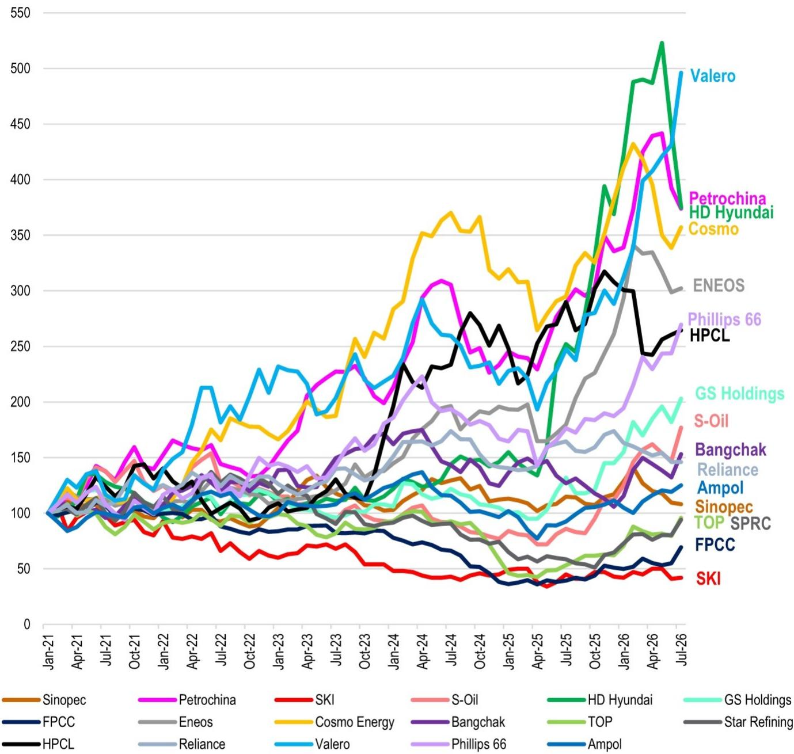

## 企业动态观察

SK Innovation 据报道计划出售其持有的 SK China 部分股份，此举或为日益增长的 AI 能源需求提供资金支持。同时，公司在润滑剂和炼油业务方面的表现令其整体回报表现有望达到近年较高水平。

据当地媒体报道，SK Innovation 将以约 0.9 万亿韩元出售其持有的 SK China 20% 股份。SK China 是 SK 集团在中国进行业务管理的实体，业务范围主要包括房地产、物流和风险投资等非核心领域。SK Innovation 及其子公司当前合计持有 SK China 33% 的股份（SK Innovation 21.7%、SK Geocentric 9.5%、SK Energy 1%、SK On 1%），而 SK Telecom 和 SK Inc 分别持有 27% 和 28%。交易完成后，SK Innovation 及其子公司的合计持股比例预计将降至约 10%，其他 SK 关联公司的有效股份将相应增加。市场分析认为，此次股份出售可能与 Honam 半导体综合体项目所需的电力基础设施资本支出有关。

2026 年 6 月 29 日，韩国总统公布了 Honam 半导体综合体计划，目标是在 2030 年前投入超过 800 万亿韩元，在韩国西南部建设芯片制造中心。该项目是国家级“大跃进：三大超级项目”投资计划的一部分。初步行业估算显示，仅 Honam 综合体就需要超过 6GW 的电力。SK Innovation 一直在为 SK 集团的“AI 全栈”战略提供能源基础设施解决方案，集团高层曾表示：“拥有从 AI 时代所需内存到数据中心基础设施，再到支持这一切的能源和电气化能力的公司非常罕见。”SK 被看作在韩国本土能源解决方案市场中具有独特位置，能够通过燃气发电（SK E&S）、SK On（ESS 电池）和 SMR 创新等多维度布局获取市场份额。

在 Honam 项目启动前，SK Innovation 和 SK Telecom 已与 AWS 合作，在蔚山建设一座 103MW 的 AI 数据中心（可容纳 6 万块 GPU），远期目标扩展至 1GW。该园区将与 SK Innovation 的 LNG 联合循环发电厂相邻布局。在国际层面，SK Innovation 已与越南义安省签署谅解备忘录，计划在当地开发 AI 数据中心，并与 SKI 开发的琼立 LNG 电力项目联动，这是 SK 联盟“韩国式 AI 全栈”模式在海外的首次复制。在下一代 AI 数据中心技术方面，SK Enmove 和 SK Telecom 正在合作，在 SKT 的 AI 数据中心测试平台中部署精密液冷方案，使用 SK Enmove 的热管理流体。此外，SK On 有望向 SKT 的 AI 数据中心供应储能系统，预计将于 2026 年下半年开始生产 LFP 电池，并已获得超过 1.7 GWh 的韩国国内储能订单以及一份 7.2 GWh 的美国储能合同。

关于公司资产组合再平衡的进展：根据近期研究分析，SK Innovation 在完成资产优化、资产负债表趋于稳定后，其润滑剂和炼油业务在 2026 年的收益表现受到市场关注。在韩国电池企业群中，其净利润和回报表现预计在 2026-2027 年期间将处于较高水平。

Figure 1: 韩国能源企业业绩预览（单位：十亿韩元）

| 公司 | 公布日期 | 营业利润（机构预测） | 环比变化 | 同比变化 | 市场共识营业利润 | 市场共识净利润 | 预测 vs 共识 | 中期股息 |
|------|----------|----------------------|----------|----------|------------------|------------------|--------------|----------|
| LGES | 7月30日 | — | — | — | — | — | — |  |
| S-Oil | 8月3-7日 | — | — | — | — | — | — |  |
| LG Chem | 7月31日 | — | — | — | — | — | — |  |
| HSC | 7月29日 | — | — | — | — | — | — |  |
| Kumho | 8月初 | — | — | — | — | — | — |  |
| Lotte Chem | 8月7日 | — | — | — | — | — | — |  |
| SK Innovation | 7月30日 | — | — | — | — | — | — | 可能 |

来源：公司数据，机构预测。

Figure 2: SK China 持股比例分布（%）  
  
来源：公司数据，媒体报道。

Figure 3: SK Innovation 资本支出变化（万亿韩元）  
  
来源：公司数据，机构预测。

Figure 4: 2025-2027E 韩国电池企业净利润（万亿韩元）  
  
来源：机构预测。

Figure 5: 韩国电池行业 2015-2025 年回报表现趋势  
  
来源：公司数据，机构预测。

Figure 6: 全球炼油企业股价表现  
  
来源：Bloomberg Finance L.P.，相关研究。

## 相关研究

- 韩国电池：LGES 赢得 2.9GWh 谷歌 ESS 项目；SK On 赢得韩国 AI ESS 招标 13% 份额（2026年7月17日）
- 韩国能源：第二季度润滑剂业务或表现突出，第四季度有炼油厂补偿基金；维持积极看法，偏好调整为 SK Innovation > S-Oil（2026年7月12日）
- 韩国电池：受美国 AI 数据中心基础设施加速建设预期影响，股价上涨 10-26%；上调美国 ESS 需求预估 52%（2026年6月29日）
- SK Innovation：原子的力量——TerraPower 怀俄明州 SMR 项目实地考察要点（2026年6月4日）
- SK Innovation：电池负担已反映在估值中；作为亚洲最被低估的综合能源平台之一，首次覆盖（2026年5月14日）
