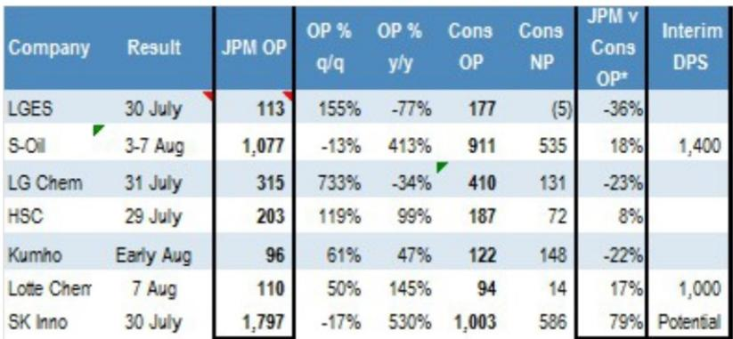
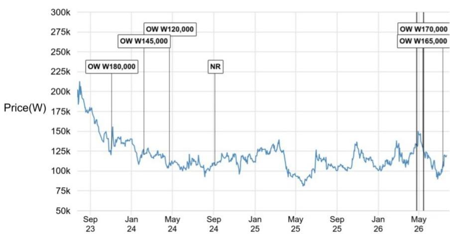
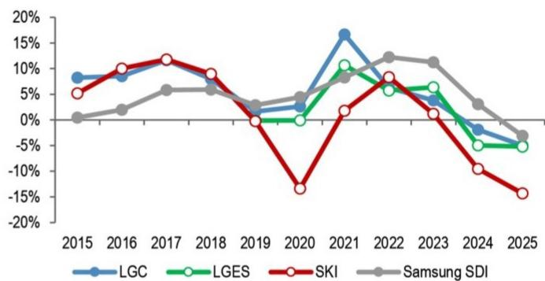

# SK Innovation 资产出售并非撤退——而是成为韩国AI能源基础设施提供商的第一步

SK Innovation 决定出售其持有的SK中国约20%股份，交易金额约0.9万亿韩元，这并非财务困境或退出国际市场的信号。这是将资本从非核心控股公司重新配置到一个具有战略连贯性的方向：为韩国政府确定为国家级优先项目的人工智能基础设施提供能源。据当地媒体7月21日报道，该交易将SK Innovation在SK中国的合计持股比例从约33%降至约10%，释放出现金用于部署到湖南半导体综合体——这是韩国总统于6月29日公布的项目，目标是在2030年前实现超过800万亿韩元的投入。此刻，SK Innovation不再是一家带有电池问题的炼油企业，而是开始成为韩国AI全栈雄心的能源底座。

过去五年，市场对SK Innovation施加了持续压力。在此期间，该公司的表现不及亚洲能源同行，主要受其电动汽车电池子公司SK On的亏损拖累。观察者此前锚定了一个2023-2025年的叙事：资产负债表恶化、资本支出负担沉重、炼油利润率薄弱。这一叙事现已过时。电池业务正在调整规模。资本支出到2027年将下降超过20%，回归2022年之前的水平。该公司有望在2026财年实现九年来的最高股本回报率，预计达到约11%，而2025财年尚处于亏损状态。

使这一转折点具备观察价值的不仅是资产负债表的修复，更是SK Innovation所销售产品的结构性转变。该公司不再仅仅是原油加工商和锂离子电池制造商。它正在成为韩国历史上最大资本部署计划的能源基础设施解决方案提供商。

## SK中国股份出售：从被动持股转为AI基础设施的活跃资本

SK中国处置所得0.9万亿韩元并非机械地返还给股东的资金。据媒体报道，其动机是为与湖南半导体晶圆厂相关的电力基础设施扩建提供资金，这表明管理层将这些现金视为更大规模投入周期的种子资本。SK中国是一家管理SK集团在中国传统业务的实体：房地产、物流和风险投资。这些均非集团AI战略的核心。通过减少风险敞口，SK Innovation实际上承认其未来资本配置方向在于本土能源基础设施，而非那些缺乏运营协同效应的控股公司股份。

根据初步行业估算，仅湖南半导体综合体就需要超过6吉瓦的电力。据路透社报道，四座规划中的晶圆厂最终可能消耗韩国西南省份70%至80%的电力。建设如此规模的发电和电网容量需要数十万亿韩元的投入。SK Innovation通过其现有的燃气发电资产、SK On的电池储能能力以及其在TerraPower小型模块化反应堆技术中的战略股份，是韩国少数能够提供完整解决方案的实体之一。SK中国的出售提供了流动性，使其能够在不过度消耗资产负债表的情况下开始执行这一愿景。

## SK Innovation作为SK集团AI倡议能源解决方案提供商的进展已在多项合同中显现

湖南项目并非假设。SK Innovation和SK Telecom已与亚马逊云服务合作，在蔚山建设一座103兆瓦的AI数据中心，初始容量为6万块GPU，最终目标扩展至1吉瓦。该园区策略性地与SK Innovation现有的液化天然气联合循环发电厂相邻。其模式简单：将数据中心与电源相邻布局，利用SK On的电池储能管理间歇负载，并部署SK Enmove的精密液冷技术处理热密度。SK Telecom和SK Enmove已在SK Telecom的AI数据中心测试平台开展液冷部署合作。

在国际上，同样的模式正在复制。SK Innovation已与越南义安省签署谅解备忘录，开发一个与琼立液化天然气发电项目相连的AI数据中心，该项目同样由SK Innovation开发。这是SK集团所称的“韩国式AI全栈”模式的首次海外拓展。逻辑一致：控制能源、靠近算力、整合冷却和存储解决方案。SK Innovation并非出售电力，而是在AI时代出售集成的能源架构。

SK On在这一框架中的角色也在演变。该电池子公司一直是业绩拖累，但其产品路线图正与AI基础设施需求对齐。SK On计划于2026年下半年开始生产磷酸铁锂电池，并已获得超过1.7吉瓦时的国内储能系统订单以及美国7.2吉瓦时的合同。这些并非汽车电池，而是为支持数据中心可靠性和可再生能源整合而设计的电网级存储解决方案。原本为电动汽车建造的电池生产线正被重新用于更高增长、更高利润的应用。

## 投资组合再平衡与九年高位股本回报率为能源转型奠定财务基础

如果核心炼油和润滑油业务未能同步表现，这一战略转向将缺乏说服力。SK Innovation预计将报告第二季度营业利润约1.8万亿韩元，而市场一致预期为1万亿韩元。这一超预期表现源于润滑油利润率和炼油实力，而非一次性收益。这种盈利实力使管理层能够在不过度依赖外部股权或债务的情况下执行较长期的AI能源战略。

股本回报率的轨迹是对SK Innovation故事持怀疑态度的观察者最关注的指标。该公司预计在2026财年实现11%的股本回报率，为九年来最高。相比之下，2021-2025年的平均值为负2.5%。改善来自三个来源：电池业务现金消耗停止、资本支出下降使资产负债表趋于稳定、以及在全球供应限制支撑利润率环境下润滑油和炼油的结构性盈利提升。

在韩国电池三强中——SK On、LG Energy Solution和三星SDI——SK Innovation预计在2026和2027财年为股东带来最高净利润。这扭转了原先的格局，即SK On被视为落后者。原因很简单：SK Innovation的电池亏损现在达到顶峰，而其能源基础设施收入正在加速。另外两家电池制造商没有来自炼油、润滑油和发电的同样对冲。

## 观察者评估SK Innovation风险回报的决策框架

SK Innovation的研究案例可简化为三部分决策框架，以检验该公司的转型是否真实。

第一，资本配置转向是否可信？SK中国股份出售提供了一个具体、可验证的数据点：0.9万亿韩元正从被动持股转向活跃的基础设施投入。观察者应关注该公司是否在未来两个季度宣布具体的湖南相关电力合同或设备订单。如果现金留在资产负债表上或用于股票回购而未相应承诺基础设施项目，这一判断将弱化。

第二，股本回报率的改善是否可持续？2026年11%的股本回报率预测基于炼油利润率和润滑油收益，这些具有周期性。问题在于能源基础设施业务——发电、数据中心就近布局和电池储能——能否在湖南综合体启动后带来300至500个基点的结构性股本回报率提升。答案取决于监管审批进度和发电厂的最终投入决策。观察者应期望管理层提供一个多年期股本回报率目标，明确区分周期性收益与基础设施回报。

第三，电池业务是成为净贡献者还是持续拖累？SK On向磷酸铁锂生产和储能应用的转型是关键变量。如果电池部门能在2027年下半年实现正营业利润，整个SK Innovation集团将成为自给自足的能源平台。如果电池亏损持续，炼油现金流将被一个尚未找到产品市场契合度的子公司消耗。

基于当前情况，从7月22日收盘价119,600韩元计算，隐含约40%的上行空间。这一估值并不激进。它仅假设回归周期高峰的账面价值，而未计入AI能源转型的溢价。如果湖南基础设施合同落地且电池业务稳定，估值倍数可能显著提升。

SK Innovation不再是关于一家韩国炼油企业试图在电动汽车转型中生存的故事。它是一个关于综合性能源公司重新定位为韩国半导体引领的AI建设提供能源的故事。SK中国出售是管理层认真对待这一转变的首个具体证据。观察者不应将其视为防御性去杠杆，而应视为将资本主动配置到该国最具政治和经济优先地位的基础设施项目中的行动。

*仅供参考。部分内容可能基于源材料通过AI辅助生成、翻译、总结或编辑，可能包含遗漏或错误。请独立核实。本文不构成专业建议。*

仅供参考。部分内容可能基于源材料通过AI辅助生成、翻译、总结或编辑，可能包含遗漏或错误。请独立核实。本文不构成专业建议。

