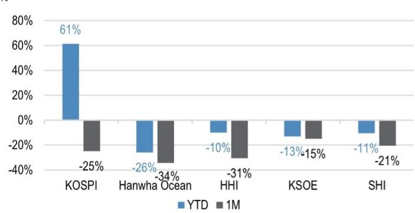
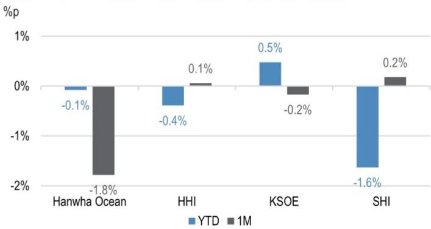
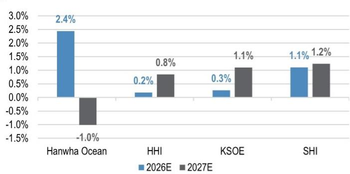
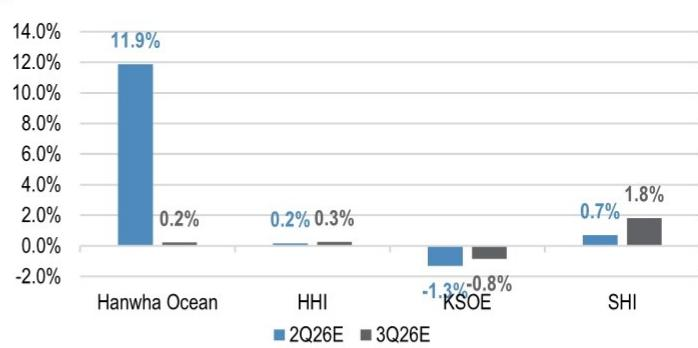
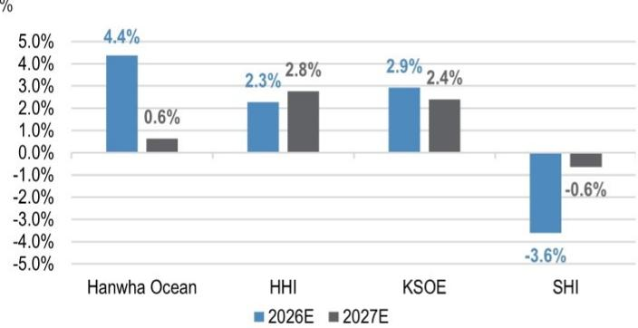
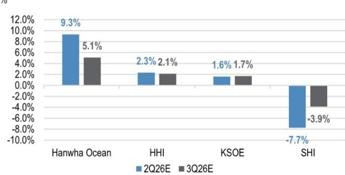
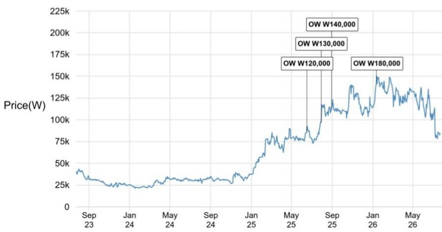
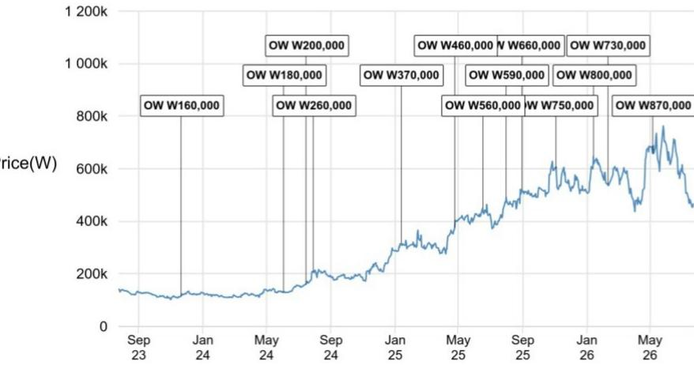
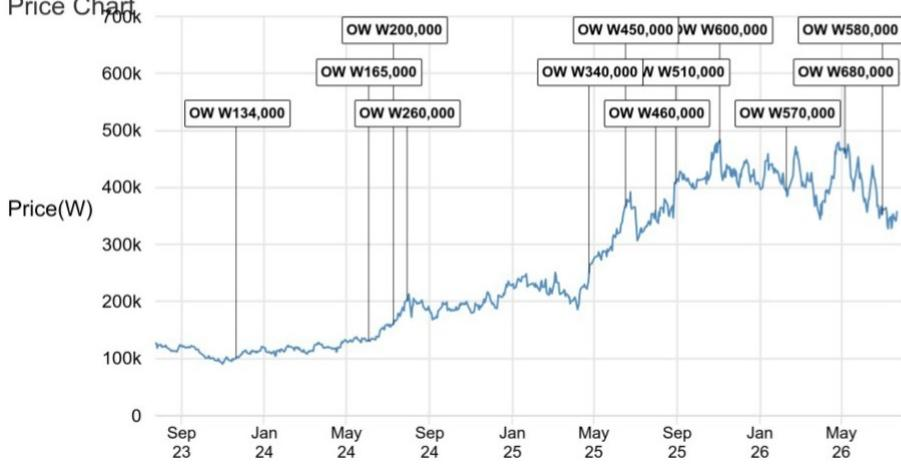
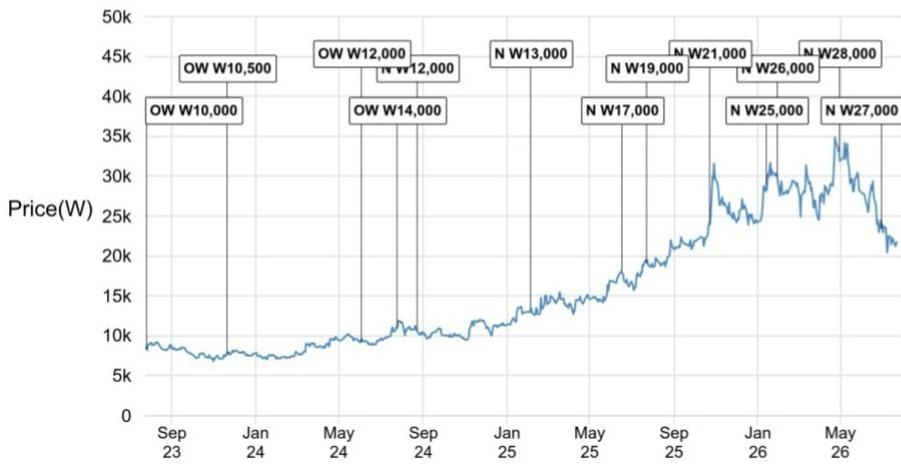

# 研究观察笔记

## 韩国造船业

## 2026年第二季度业绩前瞻：市场参与者反馈

韩国造船板块在加拿大潜艇合同失利后经历了显著的价格调整，市场情绪趋于谨慎。参与者关注的焦点已从短期上行空间转向下行保护以及“什么因素能重新评估该板块”。进入业绩期，讨论预计将集中在：(1) 在投入成本和薪资谈判推进的背景下，核心商船业务利润率能否保持稳定；(2) 发动机产能/订单积压瓶颈是否正在缓解（尤其在HHI），及其对交付节奏和订单时间安排的影响；(3) 任何“期权价值”（海军、AI数据中心发动机、FDC）能否变得足够具象，从而在市场定价中得到反映，而不仅仅是停留在叙事层面。

- **价格表现与净买入情况**：过去一个月，在加拿大潜艇订单失利后，板块报价出现明显调整（韩华海洋 -34%；HHI -31%；KSOE -15%；三星重工 -21%，对比KOSPI -25%）。外资净买入HHI，同时净卖出其他标的，对潜在的AI数据中心发动机价值释放持更建设性看法。个人读者净买入韩华海洋和三星重工，而本地机构净买入KSOE。

- **盈利预期变化**：2026年第二季度营业利润预期中，韩华海洋的变动幅度最大，较一季度业绩发布后上调9%；HHI/KSOE的二季度营业利润预期小幅上调2%/1%；三星重工的二季度盈利预期被下调8%，这一调整基本符合我们对本季度的看法。与工会及分包商的谈判正在进行中，对2027/2028年的盈利展望至关重要。另一个关键观察点是韩华海洋和HHI在二季度商船业务的经营利润率水平，以及关于进一步扩张空间的指引。

- **市场参与者反馈**：市场情绪仍偏谨慎，短期内催化剂路径有限。更多问题转向识别“最佳短期方向”而非高确信度的长期方向。当前市场定价（订单簿在0.5–0.6倍，对比历史峰值约1.0倍）意味着处于周期中段的预期，且几乎没有为期权价值（海军、AI数据中心发动机、FDC）计入溢价。参与者正关注HHI发动机产能扩张公告，将其视为短期内最可能的板块催化剂。在海军方面，参与者仍不愿在没有更清晰的订单可见性和/或使美国军舰能在韩国建造的实质性立法变化的情况下赋予价值。

- **2026年第二季度业绩关键观察点**：二季度业绩应再次以产品组合/定价、投入成本与汇率的核心方程式为框架，但需更多关注负面因素——劳工谈判和成本通胀管理，同时保护下半年利润率指引。更重要的催化剂将是HHI的发动机产能/订单积压瓶颈是否缓解，及这对交付时间表和订单获取时间表意味着什么；以及三星重工在FDC方面的更新和细节。同时需听取关于LNG/LNGC需求和定价的清晰解读，以提升短期利润率数据之外的可见性。

## 韩国造船业

Simon Han AC  
(82-2) 758-5711  
simon.x.han@JPM.com  
JPM Securities (Far East) Limited, Seoul Branch

Jeongsuk Woo  
(82-2) 758 5703  
jeongsuk.woo@JPM.com  
JPM Securities (Far East) Limited, Seoul Branch

Karen Li, CFA  
(852) 2800-8589  
karen.yy.li@JPM.com  
JPM Securities (Asia Pacific) Limited/ JPM Broking (Hong Kong) Limited

参见第5页了解分析师认证和重要披露，包括非美国分析师披露。

表1：韩华海洋：2026年第二季度业绩检查清单

| 议题/问题 | 为何重要/解决什么 | 什么答案会改变 | 什么是“好”答案 |
| :--- | :--- | :--- | :--- |
| 二季度销售收入/经营利润率驱动因素（产品组合 vs 成本 vs 汇率） | 盈利质量 | 下半年利润率区间 | 清晰的驱动因素；偶发性因素有限 |
| LNGC订单更新（包括美国LNG） | 订单可见性 | 订单接收假设 | 价格上涨和节奏的指示 |
| 海工订单更新 | 利润池多元化 | 远期盈利 | 清晰的管线+时间安排 |
| MASGA/美国海军战略更新 | 海军重新定价角度 | 概率/时间安排 | 具体步骤+约束条件 |
| 加拿大CPSP：管理层任一看法 | 事件后情绪 | 重新定价路径 | 若失利：“下一步催化剂”清晰；若胜出：执行节奏 |
| 其他海军机会+优先事项 | 保持专注 | 管线框架 | 时间表细节 |
| 劳工谈判/罢工风险 | 中断风险 | 成本/进度 | 量化影响/缓解措施 |
| 原材料（钢材）更新 | 利润率风险 | 成本假设 | 稳定 |

来源：JPM。

表2：HHI：2026年第二季度业绩检查清单

| 议题/问题 | 为何重要/解决什么 | 什么答案会改变 | 什么是“好”答案 |
| :--- | :--- | :--- | :--- |
| 二季度销售收入/经营利润率驱动因素（产品组合 vs 成本 vs 汇率） | 核心盈利数据 | 下半年利润率区间 | 产品组合/汇率抵消成本；季度表现清晰 |
| 发动机产能扩张计划/积压订单 | 瓶颈风险 | 交付时间表+利润率 | 具体产能增加+时间安排 |
| AI数据中心发动机管线 | 新利润池 | 期权价值 | 具体客户/时间安排 |
| LNGC订单更新（包括美国LNG）+定价 | 需求+定价 | 订单接收假设 | 价格上涨及询价规模的信号 |
| MASGA/美国海军战略更新 | 海军期权价值 | 管线概率 | 清晰的路径和投资计划更新 |
| 劳工谈判/罢工风险 | 短期中断 | 成本和时间表风险 | 受控或清晰的缓解措施 |
| 原材料（钢材）更新 | 利润率风险 | 成本假设 | 稳定 |

来源：JPM。

表3：KSOE：2026年第二季度业绩检查清单

| 议题/问题 | 为何重要/解决什么 | 什么答案会改变 | 什么是“好”答案 |
| :--- | :--- | :--- | :--- |
| Samho二季度销售收入/经营利润率驱动因素（产品组合 vs 成本 vs 汇率） | 核心盈利数据 | 下半年利润率区间 | 产品组合/汇率抵消成本；季度表现清晰 |
| MASGA/美国海军战略更新 | 海军期权价值 | 管线概率 | 清晰的路径和投资计划更新 |
| ASEAN投资更新 | 中期商船建造销售/利润率 | 长期销售/利润率展望 | 投资执行计划 |
| 劳工谈判/罢工风险 | 短期中断 | 成本和时间表风险 | 受控或清晰的缓解措施 |
| Samho Heavy停产影响（若提及） | 偶发性风险 | 二季度/三季度利润率 | 量化影响 |
| 原材料（钢材）更新 | 利润率风险 | 成本假设 | 稳定 |

来源：JPM。

表4：SHI：2026年第二季度业绩检查清单

| 议题/问题 | 为何重要/解决什么 | 什么答案会改变 | 什么是“好”答案 |
| :--- | :--- | :--- | :--- |
| 二季度销售收入/经营利润率驱动因素（产品组合 vs 成本 vs 汇率） | 盈利质量 | 下半年利润率 | 季度表现清晰；偶发性因素有限 |
| LNGC订单更新（包括美国LNG） | 需求+定价 | 订单接收 | 定价稳定，美国LNGC订单讨论进展 |
| Delphin FLNG：销售收入确认轨迹+经营利润率指引 | 关键盈利驱动因素 | 收入时间+利润率 | 清晰的里程碑和确认规则 |
| 海工订单管线 | 可见性 | 远期盈利 | 具体的决策节点 |
| 浮动AI数据中心业务更新 | 新期权价值 | 叙事与现实检查 | 具名客户/时间表 |
| 劳工谈判/罢工风险 | 中断风险 | 成本/进度 | 缓解措施+量化影响 |
| 原材料（钢材）更新 | 利润率风险 | 成本假设 | 稳定 |

来源：JPM。

## 关键图表

图1：韩国造船业：价格表现百分比  
  
来源：Bloomberg Finance L.P. 注：截至2026年7月22日。

图2：韩国造船业：外资持股变化  
  
来源：Bloomberg Finance L.P. 注：截至2026年7月22日。  
图3：韩国造船业：自2026年一季度业绩期以来的共识修正——2026/2027年销售收入

  
来源：Bloomberg Finance L.P. 注：截至2026年7月22日。

图4：韩国造船业：自2026年一季度业绩期以来的共识修正——2026年二季度/三季度销售收入  
  
来源：Bloomberg Finance L.P. 注：截至2026年7月22日。  
图5：韩国造船业：自2026年一季度业绩期以来的共识修正——2026/2027年营业利润

  
来源：Bloomberg Finance L.P. 注：截至2026年7月22日。  
图6：韩国造船业：自2026年一季度业绩期以来的共识修正——2026年二季度/三季度营业利润

  
来源：Bloomberg Finance L.P. 注：截至2026年7月22日。

本报告中讨论的公司（除非另有说明，本报告中所有价格为2026年7月22日市场收盘价）：HD Hyundai Heavy Industries (329180.KS/466,000韩元/OW)、HD Korea Shipbuilding & Offshore Engineering (009540.KS/357,500韩元/OW)、Hanwha Ocean (042660.KS/84,200韩元/OW)、Samsung Heavy Industries (010140.KS/21,750韩元/N)

分析师认证：封面以“AC”标识的研究分析师（或若多位研究分析师主要负责本报告，则以“AC”标识的研究分析师）各自认证：(1) 本报告中表达的所有观点准确反映了研究分析师对相关证券或发行人的个人观点；(2) 研究分析师的薪酬中没有任何部分直接或间接与本报告中的具体建议或观点相关。对于封面上列出的所有韩国研究分析师（如适用），他们还根据KOFIA的要求认证，该研究分析师的分析是本着诚信原则进行的，观点反映了研究分析师自己的意见，没有受到不当影响或干预。

除非另有说明，本报告中列出的所有作者均为独立撰写研究报告的研究分析师。在欧洲，本报告中可能显示行业专家（销售和交易），但他们并非报告的作者，也不属于研究部门。

## 重要披露

- **做市商/流动性提供者**：JPM是韩华海洋、HD Hyundai Heavy Industries、HD Korea Shipbuilding & Offshore Engineering、Samsung Heavy Industries或相关实体金融工具的做市商和/或流动性提供者。

- **主承销商或联席主承销商**：在过去12个月内，JPM曾担任HD Hyundai Heavy Industries、HD Korea Shipbuilding & Offshore Engineering或相关实体证券或金融工具（该术语定义见指令2014/65/EU）公开发行的主承销商或联席主承销商。

- **受益所有权（1%或以上）**：JPM受益持有HD Hyundai Heavy Industries或相关实体一类普通股权益证券的1%或以上。

- **客户**：JPM目前拥有，或在过去12个月内曾拥有以下实体作为客户：Hanwha Ocean、HD Hyundai Heavy Industries、HD Korea Shipbuilding & Offshore Engineering、Samsung Heavy Industries或相关实体。

- **客户/投资银行业务**：JPM目前拥有，或在过去12个月内曾拥有以下实体作为投资银行客户：HD Hyundai Heavy Industries、HD Korea Shipbuilding & Offshore Engineering或相关实体。

- **客户/非投资银行、证券相关**：JPM目前拥有，或在过去12个月内曾拥有以下实体作为客户，所提供的服务为非投资银行、证券相关：Hanwha Ocean、HD Hyundai Heavy Industries、HD Korea Shipbuilding & Offshore Engineering、Samsung Heavy Industries或相关实体。

- **已收到的投资银行报酬**：JPM在过去12个月内已从HD Hyundai Heavy Industries、HD Korea Shipbuilding & Offshore Engineering或相关实体收到投资银行服务的报酬。

- **潜在投资银行报酬**：JPM预计在未来三个月内将从HD Hyundai Heavy Industries、HD Korea Shipbuilding & Offshore Engineering、Samsung Heavy Industries或相关实体收到或寻求投资银行服务的报酬。

- **已收到的非投资银行报酬**：JPM在过去12个月内已从Hanwha Ocean、HD Hyundai Heavy Industries、HD Korea Shipbuilding & Offshore Engineering、Samsung Heavy Industries或相关实体收到产品或服务报酬，而非投资银行报酬。

- **债务头寸**：JPM可能持有Hanwha Ocean、HD Hyundai Heavy Industries、HD Korea Shipbuilding & Offshore Engineering、Samsung Heavy Industries或相关实体的债务证券头寸（如有）。

公司特定披露：JPM确实且寻求与其研究报告所覆盖的公司开展业务。因此，读者应注意，本行可能存在影响本报告客观性的利益冲突。读者应将本报告仅视为其做出决策的单一因素。重要披露，包括图表和信用意见历史表（如适用），可从汇集报告和JPM所覆盖的所有公司以及某些未覆盖公司获取，请访问https://www.jpmm.com/research/disclosures，或致电1-800-477-0406，或发送电子邮件至research.disclosure.inquiries@JPM.com。

来源：Bloomberg Finance L.P. 和 JPM；价格数据已根据拆股和股息调整。2025年6月16日开始覆盖。所有股价均为前一交易日市场收盘价。HD Hyundai Heavy Industries (329180.KS, 329180 KS) 价格图表  
Hanwha Ocean (042660.KS, 042660 KS) 价格图表  

| 日期 | 评级 | 价格（韩元） | 目标价格（韩元） |
| :--- | :--- | :--- | :--- |
| 17-Jun-25 | OW | 85300 | 120,000 |
| 30-Jul-25 | OW | 96800 | 130,000 |
| 31-Aug-25 | OW | 112000 | 140,000 |
| 13-Jan-26 | OW | 143900 | 180,000 |

来源：Bloomberg Finance L.P. 和 JPM；价格数据已根据拆股和股息调整。2022年12月6日开始覆盖。所有股价均为前一交易日市场收盘价。

| 日期 | 评级 | 价格（韩元） | 目标价格（韩元） |
| :--- | :--- | :--- | :--- |
| 21-Nov-23 | OW | 114700 | 160,000 |
| 03-Jun-24 | OW | 128700 | 180,000 |
| 16-Jul-24 | OW | 160000 | 200,000 |
| 30-Jul-24 | OW | 208000 | 260,000 |
| 13-Jan-25 | OW | 314000 | 370,000 |
| 25-Apr-25 | OW | 376000 | 460,000 |
| 17-Jun-25 | OW | 449000 | 560,000 |
| 01-Aug-25 | OW | 490500 | 590,000 |
| 31-Aug-25 | OW | 520000 | 660,000 |
| 03-Nov-25 | OW | 600000 | 750,000 |
| 14-Jan-26 | OW | 645000 | 800,000 |
| 10-Feb-26 | OW | 541000 | 730,000 |
| 07-May-26 | OW | 658000 | 870,000 |

HD Korea Shipbuilding & Offshore Engineering (009540.KS, 009540 KS)  
价格图表 700k  
  
来源：Bloomberg Finance L.P. 和 JPM；价格数据已根据拆股和股息调整。2001年2月7日开始覆盖。所有股价均为前一交易日市场收盘价。

| 日期 | 评级 | 价格（韩元） | 目标价格（韩元） |
| :--- | :--- | :--- | :--- |
| 21-Nov-23 | OW | 100900 | 134,000 |
| 03-Jun-24 | OW | 130400 | 165,000 |
| 10-Jul-24 | OW | 159700 | 200,000 |
| 30-Jul-24 | OW | 203000 | 260,000 |
| 25-Apr-25 | OW | 249500 | 340,000 |
| 17-Jun-25 | OW | 367500 | 450,000 |
| 01-Aug-25 | OW | 359000 | 460,000 |
| 31-Aug-25 | OW | 406500 | 510,000 |
| 03-Nov-25 | OW | 477000 | 600,000 |
| 10-Feb-26 | OW | 394000 | 570,000 |
| 07-May-26 | OW | 460500 | 680,000 |
| 01-Jul-26 | OW | 352500 | 580,000 |

Samsung Heavy Industries (010140.KS, 010140 KS) 价格图表  
  
来源：Bloomberg Finance L.P. 和 JPM；价格数据已根据拆股和股息调整。2001年2月7日开始覆盖。所有股价均为前一交易日市场收盘价。

| 日期 | 评级 | 价格（韩元） | 目标价格（韩元） |
| :--- | :--- | :--- | :--- |
| 27-Jul-23 | OW | 8370 | 10,000 |
| 21-Nov-23 | OW | 7720 | 10,500 |
| 03-Jun-24 | OW | 9160 | 12,000 |
| 25-Jul-24 | OW | 11090 | 14,000 |
| 23-Aug-24 | N | 10680 | 12,000 |
| 05-Feb-25 | N | 13350 | 13,000 |
| 17-Jun-25 | N | 18070 | 17,000 |
| 24-Jul-25 | N | 19140 | 19,000 |
| 23-Oct-25 | N | 24100 | 21,000 |
| 14-Jan-26 | N | 29000 | 25,000 |
| 30-Jan-26 | N | 29900 | 26,000 |
| 30-Apr-26 | N | 33100 | 28,000 |
| 01-Jul-26 | N | 23450 | 27,000 |

图表显示JPM对这些股票的持续覆盖；现任分析师可能并非在整个时期内覆盖该股票。JPM评级或名称：OW = Overweight（超配），N = Neutral（中性），UW = Underweight（低配），NR = Not Rated（未评级）

## 权益研究评级、名称及分析师覆盖范围说明：

JPM使用以下评级体系：超配（在本报告所述目标价格期间内，我们预计该股票的表现将优于研究分析师或其团队覆盖范围内股票的平均总回报）；中性（在本报告所述目标价格期间内，我们预计该股票的表现将与研究分析师或其团队覆盖范围内股票的平均总回报一致）；低配（在本报告所述目标价格期间内，我们预计该股票的表现将逊于研究分析师或其团队覆盖范围内股票的平均总回报）。NR为未评级。在此情况下，JPM已移除对该股票的评级及（如适用）目标价格，原因是缺乏充分的基本面依据，或出于法律、监管或政策原因。先前评级及（如适用）目标价格不应再被视为依据。NR名称并非建议或评级。一些被覆盖的股票有评级但没有目标价格；在此情况下，我们预计该股票在相关地区相应期间内的表现将优于/一致/逊于研究分析师或其团队覆盖范围内股票的平均总回报。在亚洲（除澳大利亚和印度外）及英国中小盘权益研究中，每只股票的预期总回报与基准国家市场指数的预期总回报进行比较，而非与研究分析师的覆盖范围进行比较。如果本报告的“重要披露”部分未显示，认证研究分析师的覆盖范围可在JPM研究网站https://www.JPMmarkets.com上找到。

覆盖范围：Han, Simon : Amorepacific Corp (090430.KS), BGF Retail (282330.KS), Cosmax (192820.KS), GS Retail (007070.KS), HD Hyundai Heavy Industries (329180.KS), HD Hyundai Marine Solution (443060.KS), HD Korea Shipbuilding & Offshore Engineering (009540.KS), Hanwha Aerospace (012450.KS), Hanwha Ocean (042660.KS), Hyundai Rotem (064350.KS), Kolmar Korea (161890.KS), Korea Aerospace Industries (047810.KS), LG H&H (051900.KS), LIG D&A (079550.KS), Samsung Heavy Industries (010140.KS)

JPM权益研究评级分布，截至2026年7月4日

|  | 超配（买入） | 中性（持有） | 低配（卖出） |
| :--- | :--- | :--- | :--- |
| JPM全球权益研究覆盖* | 53% | 36% | 12% |
| 投行客户** | 83% | 80% | 73% |
| JPMS权益研究覆盖* | 51% | 37% | 12% |
| 投行客户** | 95% | 92% | 87% |

\*请注意，由于四舍五入，百分比可能无法加总到100%。

\*\*每个“买入”、“持有”和“卖出”类别中，JPM在过去12个月内提供过投资银行服务的公司所占百分比。

仅为FINRA评级分布规则之目的，我们的超配评级属于报告评级类别；中性评级属于持有评级类别；低配评级属于报告评级类别。请注意，带有NR名称的股票不包括在上表中。该信息截至最近一个日历季度末。

权益估值与风险：有关估值方法及覆盖公司或目标价格的风险，请参阅最新公司特定研究报告（网址：http://www.JPMmarkets.com），联系主要分析师或您的JPM代表，或发送电子邮件至research.disclosure.inquiries@JPM.com。有关所使用专有模型的实质性信息，请参阅公司特定研究报告中的财务摘要以及公司概览表，这些内容可通过我们的客户网站http://www.JPMmarkets.com的公司页面下载。本报告还阐述了所使用的重大基本假设。

## 建议历史：

过去12个月内JPM建议的历史可通过http://www.JPMmarkets.com的“研究与评论”页面访问，您还可以按分析师姓名、行业或金融工具进行搜索。

分析师薪酬：负责编写本报告的研究分析师的薪酬基于多种因素，包括研究的质量和准确性、客户反馈、竞争因素以及公司整体收入。

非美国分析师的注册：除非另有说明，本报告封面列出的非美国分析师是非美国JPM Securities LLC子公司的员工，可能未根据FINRA规则注册为研究分析师，可能不是JPM Securities LLC的关联人士，并且可能不受FINRA第2241条或第2242条关于与覆盖公司沟通、公开露面以及交易研究分析师账户持有证券的限制。

## 其他披露

JPM是JPM Chase & Co.及其全球子公司和关联公司投资银行业务的营销名称。

英国MiFID FICC研究分拆豁免：英国客户应参阅英国MiFID研究分拆豁免，了解JPM实施FICC研究豁免的详情以及相关FICC研究分类指引。

除非相关法律特别允许，所有向客户提供的研究材料均同时在我们的客户网站JPM Markets上提供。并非所有研究内容都会重新分发、通过电子邮件发送或提供给第三方聚合商。如需获取特定股票的所有研究材料，请联系您的销售代表。

本研究材料中提及中国、香港、台湾和澳门的任何长格式名称为：中国大陆、中国香港特别行政区、中国台湾、中国澳门特别行政区。

JPM可能不时撰写有关受美国、欧盟、英国或其他相关司法管辖区政府当局实施或管理的经济或金融制裁（“受制裁证券”）约束的发行人或证券的文章。本报告中没有任何内容旨在或被理解为鼓励、促进、推动或以其他方式批准对受制裁证券的买或卖。客户在做出决策时应了解自身的法律和合规义务。

本研究报告中讨论的任何数字或加密资产均受快速变化的监管环境影响。有关加密资产（包括比特币和以太坊）的相关监管提示，请参阅https://www.JPM.com/disclosures/cryptoasset-disclosure。

本研究报告的作者可能未在您所在司法管辖区获得从事受监管活动的许可；若未获得许可，则不声称具备从事此类活动的能力。

交易所交易基金（ETF）：JPM Securities LLC（“JPMS”）作为几乎所有美国上市ETF的授权参与者。就本报告中提及的任何ETF而言，JPMS可能因分销这些ETF份额而赚取佣金和基于交易的报酬，并可能因执行其他交易相关服务（例如向ETF份额卖空者提供证券借贷）而赚取费用。JPMS也可能为ETF本身提供服务，包括作为ETF的经纪商或交易商。此外，JPMS的关联公司可能为ETF提供服务，包括信托、托管、管理、借贷、指数计算和/或维护及其他服务。

期权和期货相关研究：如果本文所含信息涉及期权或期货相关研究，则该信息仅提供给已收到适当期权或期货风险披露文件的人士。请与您的JPM代表联系，或访问https://www.theocc.com/components/docs/riskstoc.pdf获取期权清算公司的标准化期权特征与风险文件，或访问https://www.finra.org/sites/default/files/2020-08/Security_Futures_Risk_Disclosure_Statement_2020.pdf获取证券期货风险披露声明。

银行间拆借利率（IBORs）及其他基准利率的变更：某些利率基准现在或未来可能受到国际、国家及其他监管指引、改革及改革提案的影响。更多信息请查阅：https://www.JPM.com/global/disclosures/interbank_offered_rates

私人银行客户：如果您作为JPM Chase & Co.及其子公司（“JPM私人银行”）提供的私人银行业务客户接收研究，则研究由JPM私人银行提供，而非JPM的任何其他部门，包括但不限于JPM企业与投资银行及其全球研究部门。

负责制作和分发研究的法律实体：本材料作者名下标识的法律实体（Reg AC研究分析师）为负责制作本研究的法律实体。如果有多位Reg AC研究分析师撰写本材料且其名下标识了不同的法律实体，则这些法律实体共同负责制作本研究。如果分析师名下列出了多个法律实体，则第一个法律实体负责制作，除非另有说明。来自不同JPM关联公司的研究分析师可能已为制作本材料做出贡献，但可能未在您所在的司法管辖区获得从事受监管活动的许可（且不声称具备此能力）。除非法律实体披露部分另有说明，本材料由负责制作的法律实体分发，或者如果分析师名下列出了多个法律实体，则由第一个法律实体负责分发。如有任何疑问，请与您所在司法管辖区的相关研究分析师或分发本研究材料的实体联系。

## 法律实体披露及国家/地区特定披露：

阿根廷：JPM Chase Bank N.A Sucursal Buenos Aires 由阿根廷中央银行（BCRA）和阿根廷国家证券委员会（CNV）监管。

澳大利亚：JPM Securities Australia Limited（“JPMSAL”）（ABN 61 003 245 234/AFS许可号：238066）由澳大利亚证券和投资委员会监管，并且是ASX Limited的市场参与者、ASX Clear Pty Limited的清算和结算参与者以及ASX Clear (Futures) Pty Limited的清算参与者。本材料由JPMSAL或其代表在澳大利亚发行和分发，仅面向“批发客户”（定义见《2001年公司法》第761G条）。所有涵盖金融产品的列表可通过访问https://www.jpmm.com/research/disclosures获取。JPM力求覆盖对所有国内和国际读者具有相关性的、跨全球行业分类标准（GICS）所有行业以及不同市值规模的公司。如适用，在研究分析师对所涉公司进行公共侧尽职调查过程中，可能通过公司拜访、与公司代表讨论、管理层演示等公司接触形式进行尽职调查。JPMSAL发布的研究已按照JPM澳大利亚研究独立政策编制，该政策可在以下链接获取：JPM Australia - Research Independence Policy。

巴西：Banco JPM S.A. 由巴西证券交易委员会（CVM）和巴西中央银行监管。JPM监察员：0800-7700847 / 0800-7700810（听障人士专线）/ ouvidoria.jp.morgan@jpmchase.com。

加拿大：JPM Securities Canada Inc. 是一家注册投资交易商，由加拿大投资监管组织和安大略省证券委员会监管，并且是加拿大交易所的参与会员。本材料由JPM Securities Canada Inc.或其代表在加拿大分发。

智利：Inversiones JPM Limitada 是一家在智利注册的未受监管实体。

中国：JPM Securities (China) Company Limited 已获中国证监会批准开展证券投资咨询业务。

哥伦比亚：Banco JPM Colombia S.A. 受哥伦比亚金融监管局（SFC）监管。本材料中提及的由哥伦比亚境外实体提供的产品或服务的任何引用仅供描述目的。此类引用不构成、也不应被解释为在哥伦比亚领土内进行促销活动或提供金融产品或服务，如适用哥伦比亚法规所定义。

迪拜国际金融中心（DIFC）：JPM Chase Bank, N.A., Dubai Branch 受迪拜金融服务局（DFSA）监管，注册地址为迪拜国际金融中心 - The Gate, West Wing, Level 3 and 9 PO Box 506551, Dubai, UAE。本材料由JPM Chase Bank, N.A., Dubai Branch向根据DFSA规则被视为专业客户或市场对手方的人士分发。

欧洲经济区（EEA）：除非另有说明，研究在EEA由JPM SE（“JPM SE”）分发，JPM SE是一家由德国联邦金融监管局（BaFin）授权、并由BaFin、德国中央银行（Deutsche Bundesbank）和欧洲中央银行（ECB）共同监管的信贷机构。JPM SE总部位于法兰克福，注册地址为TaunusTurm, Taunustor 1, Frankfurt am Main, 60310, Germany。本材料在EEA向根据MiFID II第4条第1款第10项及附件II及其在各自母国的实施规则被视为专业读者（或同等资格）的人士（“EEA专业读者”）分发。本材料不得由非EEA专业读者依据或依赖。本材料涉及的任何投资或投资活动仅面向EEA相关人士，并仅与EEA相关人士开展。

香港：JPM Securities (Asia Pacific) Limited（CE编号AAJ321）受香港金融管理局和香港证券及期货事务监察委员会监管，JPM Broking (Hong Kong) Limited（CE编号AAB027）受香港证券及期货事务监察委员会监管。JPM Chase Bank, N.A., Hong Kong Branch（CE编号AAL996）受香港金融管理局和证券及期货事务监察委员会监管，根据美国法律组织，承担有限责任。当本材料的分发在香港属于受监管活动时，本材料由JPM Securities (Asia Pacific) Limited和/或JPM Broking (Hong Kong) Limited在香港分发。

印度：JPM India Private Limited（企业识别号U67120MH1992FTC068724），注册地址为JPM Tower, Off. C.S.T. Road, Kalina, Santacruz - East, Mumbai – 400098，已在印度证券交易委员会（SEBI）注册为“研究分析师”，注册号为INH000001873。JPM India Private Limited还在SEBI注册为印度国家证券交易所和孟买证券交易所的会员（SEBI注册号INZ000239730）以及商人银行家（SEBI注册号MB/INM000002970）。电话：91-22-6157 3000，传真：91-22-6157 3990，网站：http://www.jpmipl.com。JPM Chase Bank, N.A. - Mumbai Branch 由印度储备银行（RBI）许可（许可证号53/许可证号BY.4/94；SEBI - IN/CUS/014/ CDSL：IN-DP-CDSL-444-2008/ IN-DP-NSDL-285-2008/ INBI00000984/ INE231311239）作为印度的一家指定商业银行，这是其开展银行业务以及印度银行分行允许开展的其他活动的主要许可证。对于非本地研究材料，本材料不在印度由JPM India Private Limited分发。合规官：Ashutosh Sharma；ashutosh.j.sharma@jpmchase.com；+912261575002。申诉官：Ramprasadh K，jpmipl.research.feedback@JPM.com；+912261573000。SEBI的注册和NISM的认证绝不保证中介机构的业绩或向读者提供任何回报保证。请参阅条款与条件以及最重要条款与条件（MITC）。年度合规审计报告可在http://www.jpmipl.com/#research获取。

印度尼西亚：PT JPM Sekuritas Indonesia 是印度尼西亚证券交易所的会员，并受Otoritas Jasa Keuangan（OJK）的注册和监管。

韩国：JPM Securities (Far East) Limited, Seoul Branch 是韩国交易所（KRX）的会员。JPM Chase Bank, N.A., Seoul Branch 作为外国银行分行（JPM Chase Bank, N.A.）在韩国注册。两家实体均受金融委员会（FSC）和金融监督院（FSS）监管。对于非宏观研究材料，该材料在韩国由JPM Securities (Far East) Limited, Seoul Branch或其代表分发。

日本：JPM Securities Japan Co., Ltd. 和 JPM Chase Bank, N.A., Tokyo Branch 受日本金融厅监管。

马来西亚：本材料由JPM Securities (Malaysia) Sdn Bhd（18146-X）在马来西亚发行和分发，该公司是Bursa Malaysia Berhad的参与组织，并持有马来西亚证券委员会颁发的资本市场服务许可证。

墨西哥：JPM Casa de Bolsa, S.A. de C.V., JPM Grupo Financiero 是墨西哥证券交易所和机构证券交易所的会员，并获授权由全国银行和证券委员会作为经纪交易商运营。

新西兰：本材料由JPMSAL在新西兰发行和分发，仅面向“批发客户”（定义见《2013年金融市场行为法》）。JPMSAL根据《2008年金融服务提供者（注册和争议解决）法》注册为金融服务提供者。

菲律宾：JPM Securities Philippines Inc. 是菲律宾证券交易所的交易参与者，并且是菲律宾证券清算公司和菲律宾读者保护基金的会员。它受证券交易委员会监管。

新加坡：本材料由JPM Securities Singapore Private Limited（JPMSS）[MDDI (P) 057/08/2025 和公司注册号：199405335R]（新加坡交易所证券交易有限公司的会员）和/或JPM Chase Bank, N.A., Singapore branch（JPMCB Singapore）在新加坡发行和分发，两者均受新加坡金融管理局监管。本材料仅面向《证券与期货法》（第289章）第4A条定义的认可读者、专家读者和机构读者在新加坡发行和分发。本材料不旨在向任何零售读者或任何不属于“认可读者”、“专家读者”或“机构读者”类别的其他读者发行或分发。新加坡的接收者应就本材料引起或与之相关的任何事宜联系JPMSS或JPMCB Singapore。

南非：JPM Equities South Africa Proprietary Limited 和 JPM Chase Bank, N.A., Johannesburg Branch 是约翰内斯堡证券交易所的会员，并受金融部门行为监管局（FSCA）监管。

台湾：JPM Securities (Taiwan) Limited 是台湾证券交易所的参与者（公司类型），受台湾证券期货局监管。有关权益证券的材料由JPM Securities (Taiwan) Limited在台湾发行和分发，须遵守许可证范围及台湾适用法律和法规。在JPM Securities (Taiwan) Limited制作关于未在台湾证券交易所或台北交易所上市证券（“非台湾上市证券”）的研究材料的情况下，这些材料不应构成台湾适用法规下的证券建议，并且为免生疑问，JPM Securities (Taiwan) Limited不作为非台湾上市证券的经纪商。根据《证券商推介客户买卖有价证券作业规范》第7条之1第2项（经修订或补充）和/或其他适用法律或法规，请注意，本材料的接收者不得从事可能产生利益冲突的与本材料相关的任何活动，除非本材料“重要披露”部分另有披露。

泰国：本材料由JPM Securities (Thailand) Ltd.在泰国发行和分发，该公司是泰国证券交易所的会员，并受财政部和证券交易委员会监管。注册地址：548 One City Center Building, 50th Floor, Ploenchit Road, Lymphini, Pathum Wan, Bangkok 10330。

英国：研究在英国由JPM Securities plc（“JPMS plc”）制作，JPMS plc是伦敦证券交易所的会员，由审慎监管局授权，并由金融行为监管局和审慎监管局监管；或由JPM Markets Limited（“JPMML Ltd”）制作，JPMML Ltd由金融行为监管局授权和监管。除非另有说明，本材料在英国由JPMS plc分发，仅针对：(a) 具有投资相关事务专业经验、符合《2000年金融服务与市场法（金融促销）令2005》（“FPO”）第19(5)条的人士；(b) FPO第49条所述人士（高净值公司、非法人协会或合伙企业、高价值信托的受托人等）；或(c) 可以合法向其传达此通讯的任何其他人士；所有此类人士称为“英国相关人士”。本材料不得由非英国相关人士依据或依赖。本材料涉及的任何投资或投资活动仅面向英国相关人士，并仅与英国相关人士开展。JPM EMEA关于防止和避免研究制作利益冲突的政策描述可在以下链接获取：JPM EMEA - Research Independence Policy。

美国：JPM Securities LLC（“JPMS”）是NYSE、FINRA、SIPC和NFA的会员。JPM Chase Bank, N.A.是FDIC的会员。由非美国关联公司发布的材料在美国由JPMS分发，JPMS对其内容负责。

一般信息：可根据要求提供更多信息。本材料中的信息来自被认为可靠的来源。尽管已采取一切合理谨慎措施确风险自担材料中陈述的事实准确，且其中包含的预测、意见和预期是公平合理的，但JPM Chase & Co.或其关联公司和/或子公司（统称“JPM”）对所提供材料的完整性或准确性不作任何陈述或保证，但有关JPM和研究分析师与作为材料主题的发行人相关的披露除外。因此，不应依赖本材料中所含信息的准确性、公平性或完整性。由于计算、调整、翻译成不同语言和/或当地监管限制（如适用），本材料中可能存在某些数据不一致和/或内容有限。这些差异不应影响对所涉主题公司的整体研究分析、观点和/或建议（如有讨论）。在准备本材料时可能使用了人工智能工具，包括协助数据分析、模式识别以及研究材料的内容起草。JPM对于因使用本材料或其内容而产生的任何损失不承担任何责任，并且JPM及其各自的董事、高级管理人员或员工均不对本材料的内容承担任何责任，但相关司法管辖区的监管机构或该监管制度可能施加的责任和义务除外。本材料中的意见、预测或预测代表JPM截至材料日期的当前意见或判断，因此如有变更，恕不另行通知。可能根据公司特定发展或公告、市场状况或任何其他公开可用信息对公司/行业进行定期更新。无法保证未来结果或事件将与任何此类意见、预测或预测一致，这些意见、预测或预测仅代表一种可能的结果。此外，此类意见、预测或预测受某些未经验证的风险、不确定性和假设的影响，未来的实际结果或事件可能存在重大差异。本材料中提及的任何投资的价值或收入可能会波动和/或受汇率变动影响。除非另有说明，所有定价均为所讨论证券的市场收盘指示性价格。过往表现并非未来结果的指标。因此，读者可能收回的金额少于原始投入。本材料不构成对任何金融工具的购买或出售的要约或招揽。其中的意见和建议未考虑个人客户的情况、目标或需求，也不旨在作为对特定客户适合特定证券、金融工具或策略的建议。本材料可能包含对结构性证券、期权、期货和其他衍生品的看法。这些是复杂的工具，可能涉及高风险，并且可能仅适合能够理解并承担相关风险的成熟读者。本材料的接收者必须就其中提及的任何证券或金融工具做出独立决定，并应寻求独立财务、法律、税务或其他顾问的建议（如认为必要）。JPM可能根据研究分析师的看法和研究作为主体进行交易，也可能以其自身账户或客户账户进行与本材料所持观点不一致的交易，且JPM没有义务确保此类其他通讯被本材料的任何接收者知晓。JPM内的其他人，包括策略师、销售人员和其他研究分析师，可能持有与本材料不一致的观点。未参与本材料制作的JPM员工可能持有本材料中提及的证券（或此类证券的衍生品）并可能以与本材料中讨论的方式不同的方式交易它们。本材料不是对任何发行人、其产品或服务或其证券在任何司法管辖区的广告或营销。

保密与安全通知：此传输可能包含根据适用法律享有特权、保密、法律特权且/或免于披露的信息。如果您不是预期的接收者，特此通知您，对本材料所含信息（包括对其的任何依赖）的任何披露、复制、分发或使用均被严格禁止。尽管此传输及其任何附件被认为不含任何可能影响接收和打开它的任何计算机系统的病毒或其他缺陷，但接收者有责任确保其无病毒，并且JPM Chase & Co.、其子公司和关联公司（如适用）对于因使用而导致的任何损失或损害不承担任何责任。如果您错误地收到了此传输，请立即联系发件人并销毁材料的全部内容，无论其是电子形式还是硬拷贝形式。此消息受电子监控：https://www.JPM.com/disclosures/email

MSCI：此处的某些信息（“信息”）经MSCI Inc.、其关联公司及信息提供商（“MSCI”）许可转载©2026。未经适当许可，不得复制或传播该信息。MSCI不对该信息的准确性或完整性作任何明示或暗示的保证（包括适销性或适用性），并在法律允许的范围内免除所有责任。任何信息均不构成建议，除非是MSCI ESG Research的任何适用信息。另请参阅msci.com/disclaimer

Sustainalytics：此处的某些信息、数据、分析和意见经Sustainalytics许可转载，并且：(1) 包含Sustainalytics的专有信息；(2) 除非特别授权，不得复制或重新分发；(3) 不构成建议或对任何产品或项目的认可；(4) 仅出于信息目的提供；(5) 不保证完整、准确或及时。Sustainalytics不对任何交易决策、损害或与其或其使用相关的其他损失负责。数据的使用受限于https://www.sustainalytics.com/legal-disclaimers上的条件。©2026 Sustainalytics。保留所有权利。

“其他披露”最后更新于2026年7月4日。

Copyright 2026 JPM Chase & Co. 保留所有权利。未经JPM书面同意，不得转载、出售或重新分发本材料或其任何部分。未经JPM事先书面同意，严格禁止在任何第三方人工智能系统或模型中使用或共享从JPM或授权第三方收到的任何研究材料（“JPM数据”），当此类JPM数据可供第三方访问时。

完成于2026年7月22日 下午4:46 HKT

发布于2026年7月22日 下午4:46 HKT
