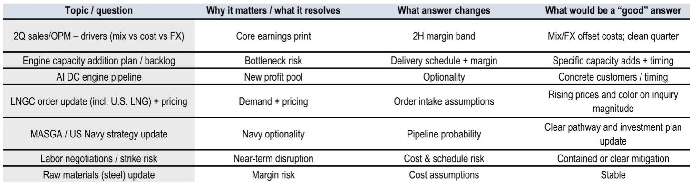
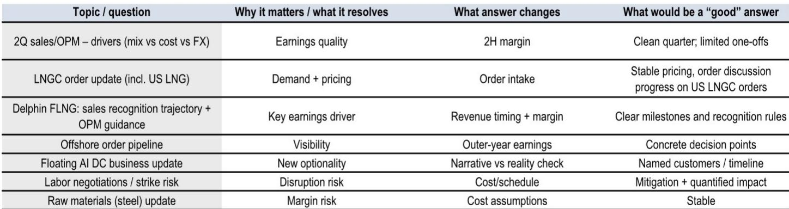
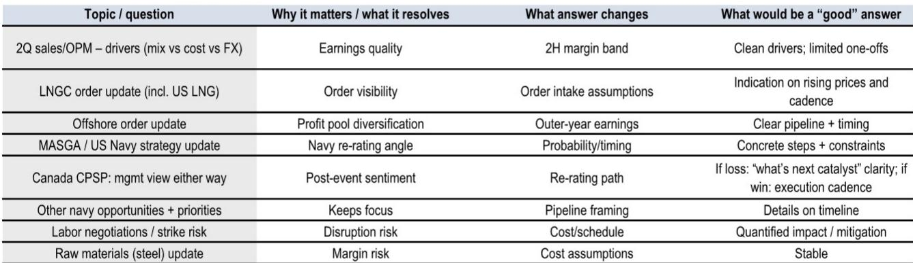

# Korea’s Shipbuilding Giants Are Priced for a Mid-Cycle Reality That No Longer Exists

The four largest Korean shipbuilders have seen their market value decline between 15% and 34% in a single month, triggered by the loss of a Canadian submarine contract that was never in the order book. That development reveals something deeper than a single deal gone wrong. It highlights a market that has priced these companies for a steady mid-cycle earnings trajectory while the actual industry faces simultaneous questions around costs, capacity, and the credibility of its long-term growth options. Market participants are no longer debating upside scenarios. They are examining which name may be the most exposed.

The sharpest adjustment hit Hanwha Ocean, down 34%, followed by HD Hyundai Heavy Industries at 31%, Samsung Heavy Industries at 21%, and HD Korea Shipbuilding & Offshore Engineering at 15%. Foreign investors have been net buyers only of HHI, citing potential value in AI data-center engine exposure. Retail buyers focused on the most significantly corrected names. Local institutions reduced positions. The divergence in buyer behavior reflects a market that has lost conviction in the sector’s re-rating story and is now searching for the nearest catalyst—or the most vulnerable name.

This analysis argues that the current valuation band of 0.5x to 0.6x price-to-order-book, versus a historical peak near 1.0x, is not a clear entry point. It is a rational discount that reflects three unresolved structural tensions: the fragility of commercial margins under wage and input-cost pressure, the engine-capacity bottleneck at HHI that constrains delivery cadence and order timing, and the persistent gap between narrative option values in navy, AI, and floating data centers and the tangible milestones needed to convert them into performance. The 2Q26 earnings season will not resolve these tensions. It will only clarify which companies have the most room to disappoint.

## The Core Commercial Margin Equation Faces Its Most Stressful Test Since the Cycle Began

The fundamental driver of shipbuilder profitability in this cycle has been the interplay of mix, pricing, foreign exchange, and input costs. That equation is now under pressure from two directions simultaneously. Labor negotiations with unions and sub-contractors are underway across all four names, and the outcome will determine not just 2Q26 margins but the trajectory for 2027 and 2028 performance. Steel costs, while currently stable, remain a risk factor that could shift quickly if global supply conditions tighten.

The earnings estimate revisions tell a clear story. Hanwha Ocean saw the largest upward revision to 2Q26 operating profit, up 9% relative to its 1Q26 earnings release. HHI and KSOE saw modest lifts of 2% and 1%, respectively. Samsung Heavy Industries saw its 2Q earnings cut by 8%. These revisions are not random. They reflect the specific mix of order book composition, cost pass-through mechanisms, and labor exposure at each company. Hanwha Ocean’s larger revision suggests the market expects some near-term relief from favorable mix or FX. Samsung Heavy’s cut signals the opposite.

The critical question for market participants is whether these margin levels can be sustained into the second half of 2026. The 2Q earnings calls will provide the first real test of management credibility on this point. If companies guide to stable or expanding margins despite ongoing wage negotiations, the market will demand proof. If they signal compression, the downside risk to outer-year performance becomes material. The earnings quality itself matters: a clean quarter driven by mix and FX is one thing; a quarter padded by one-offs is another. The report’s earnings checklists for each company show that observers are watching for exactly this distinction.

Beyond the quarterly print, the structural issue is that commercial shipbuilding margins are unlikely to expand meaningfully from current levels without a new catalyst on either the cost or pricing side. LNG carrier pricing remains the most important swing factor. Any signal from 2Q26 earnings on the trajectory of LNG carrier inquiry volumes and pricing—especially related to U.S. LNG export projects—will directly affect order intake assumptions for the next 12 to 18 months. Without rising prices, the margin story is capped.

## Engine Capacity Constraints at HHI Are the Single Most Consequential Near-Term Catalyst for the Sector

HD Hyundai Heavy Industries sits at the center of the sector’s most pressing operational bottleneck: engine capacity. The company’s engine backlog has grown to a level that constrains its ability to deliver vessels on schedule and to accept new orders without extending delivery timelines that may deter customers. Observers are watching for any announcement of a capacity addition plan as the nearest potential catalyst that could re-rate the entire group.

The logic is straightforward. If HHI can add engine capacity, it can accelerate delivery schedules, improve working capital turnover, and increase the volume of orders it can accept without degrading pricing discipline. If it cannot, the constraint will cap revenue growth and may force the company to cede market share to competitors with more flexible engine procurement, including Chinese yards. The 2Q26 earnings call is the most likely venue for an update on this front. A specific capacity addition plan with a clear timeline would be viewed as a strong positive signal. Vague guidance or deferral would reinforce the cautious perspective.

This issue is not limited to HHI. Engine capacity constraints affect the entire Korean shipbuilding ecosystem because the major players share a common supply chain for large marine engines. If HHI’s bottleneck eases, it could relieve pressure on the broader sector. If it worsens, the negative read-through will affect KSOE and Hanwha Ocean as well, even if their own engine backlogs are less severe. Observers should treat any HHI engine announcement as a sector-wide signal, not a company-specific event.

The AI data-center engine opportunity adds a second layer to this discussion. Foreign investors have been net buyers of HHI specifically because of potential value unlocking from AI data-center engine exposure. This is a genuinely new profit pool that did not exist in prior cycles. But converting narrative into tangible revenue requires engine capacity that is already constrained. The question is not whether the demand exists. It is whether HHI can allocate engine production capacity to serve both its core shipbuilding orders and a new data-center engine business without compromising either. The 2Q26 earnings update on the AI engine pipeline—specifically named customers and timing—will determine whether this optionality is real or remains a story.

## Navy, AI, and Floating Data Center Options Remain Priced as Free Options, Not as Earnings Drivers

The report’s investor feedback section captures a crucial market psychology: participants are reluctant to ascribe any valuation premium to navy, AI data-center engine, or floating data center opportunities without clearer order visibility or tangible legislative changes. The current valuation of 0.5x to 0.6x price-to-order-book implies that these option values are being priced at zero. That is rational, but it also means that any concrete milestone could trigger a significant re-rating.

Navy orders represent the most debated optionality. The loss of the Canadian submarine contract was a sharp reminder that geopolitical positioning does not guarantee contract wins. Observers are watching for progress on the MASGA framework and any U.S. Navy strategy updates that could enable American warships to be built in Korean yards. The report’s earnings checklists show that for each company, a “good” answer on navy strategy is defined as a clear pathway and investment plan update, not a vague commitment. Without tangible legislative changes in the U.S., the navy option will remain just that—an option with no strike price.

Samsung Heavy Industries offers the most distinct optionality story through its floating AI data center business. The report frames this as a test of narrative versus reality. A good answer would include named customers and a realistic timeline. A vague update would confirm that the concept remains pre-revenue and pre-commitment. For Samsung Heavy, which receives a specific rating in the report, the FDC update is arguably more important than the quarterly earnings print because it represents the only differentiated growth angle in a company that otherwise faces the same commercial margin pressures as its peers.

The pattern across all four companies is the same: the market is not paying for optionality. That creates an asymmetric scenario. If any of these option values become tangible, the re-rating could be rapid and significant. But the burden of proof is on management to provide concrete milestones, not narrative. The 2Q26 earnings season is the first major test of whether that proof is forthcoming.

## A Decision Framework for Navigating 2Q26 Earnings

Market participants can approach the 2Q26 earnings season with a structured framework that separates signal from noise. The following three-part framework organizes the most important questions.

First, evaluate margin sustainability by distinguishing between earnings quality and earnings level. A high operating profit number is not useful if it is driven by one-offs, favorable FX timing, or mix shifts that cannot repeat. The key metric is not the absolute margin but the management commentary on cost pass-through, labor negotiation outcomes, and steel price assumptions for the second half. If management can demonstrate that margins are sustainable without relying on favorable exogenous factors, that is a positive signal. If they guide to compression or hedge their language, the downside risk to 2027 estimates increases.

Second, assess the engine capacity trajectory through HHI’s announcements. This is the one catalyst that can affect the entire sector. A specific capacity addition plan with a timeline would be a clear positive for HHI and a moderate positive for KSOE and Hanwha Ocean. No announcement or a vague reference to ongoing studies would confirm the cautious case. Observers should also listen for any cross-references to engine supply chain constraints affecting delivery schedules at other yards.

Third, separate narrative optionality from tangible milestones on navy, AI, and FDC. For each company, define what a “good” answer looks like before the call. For navy, it is legislative progress or a named program with a timeline. For AI engines, it is a named customer and production allocation. For FDC at Samsung Heavy, it is a named customer and a revenue recognition milestone. If the answer is qualitative and aspirational, the option value remains zero. If it is concrete, the re-rating case becomes credible.

This framework is designed to prevent the common mistake of treating all positive news as equally meaningful. A strong commercial quarter with no progress on optionality is a particular outcome. A weak commercial quarter with a concrete navy milestone is a positive outcome. The market is not pricing any optionality, so the bar for positive surprise is lower on the optionality side than on the commercial side.

The final substantive point is that the sector’s valuation discount is not a mistake. It reflects a rational assessment that the mid-cycle earnings trajectory is fragile, the engine bottleneck is unresolved, and the option values are unpriced for good reason. The 2Q26 earnings season will not resolve all three tensions. But it will reveal which companies are best positioned to continue through the next phase of the cycle and which are most exposed to further adjustment. The answer lies not in the headline earnings numbers but in the specific, verifiable milestones that management chooses to share—or chooses to avoid.

*For informational purposes only. Portions may be generated, translated, summarized, or edited with AI assistance based on source materials and may contain omissions or errors. Please verify independently. This is not professional advice.*

For informational purposes only. Portions may be generated, translated, summarized, or edited with AI assistance based on source materials and may contain omissions or errors. Please verify independently. This is not professional advice.

