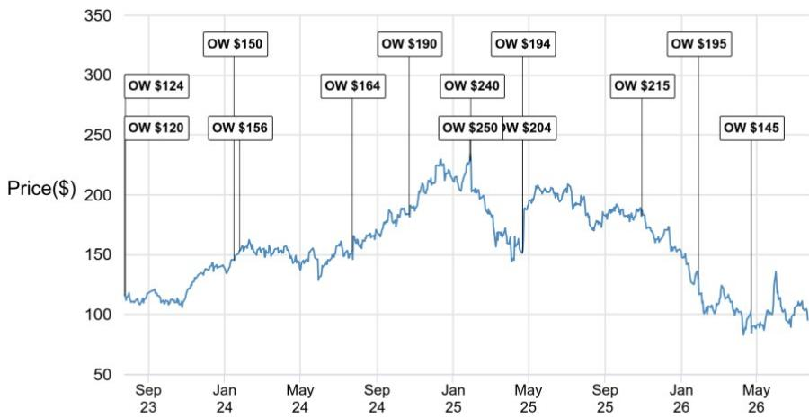
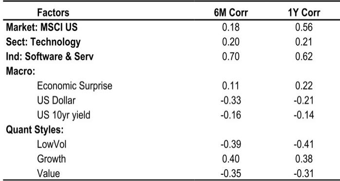
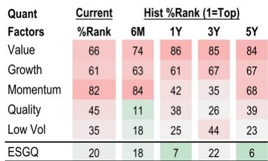

# ServiceNow F2Q业绩显示：AI颠覆性担忧被过度解读——公司通过治理与编排构建持久护城河

对于企业软件领域的研究者而言，2026年最核心的问题并非AI能否创造价值——而是AI是否会在现有企业软件供应商适应之前，过快蚕食其现有收入。ServiceNow于2026年7月22日发布的第二财季业绩，提供了迄今为止最清晰的证据，表明关于颠覆的叙事有所偏颇。该公司实现订阅收入38.77亿美元，超出指引上限150个基点，并报告当前剩余履约义务（cRPO）按固定汇率计算增长21.5%，超出市场一致预期约200个基点。这些数字的意义不仅在于一次超预期并上调指引的故事，更是一个结构性信号：只要平台拥有治理层，ServiceNow正在证明AI可以成为增长加速器，而非利润率侵蚀者。

本次财报季前，围绕企业软件领域的焦虑有其合理基础。近期IBM和Pegasystems的报告曾引发担忧：企业客户在资金压力下为支持生成式AI项目，正在将预算从传统软件许可中重新分配。逻辑很简单：如果首席信息官可以用一个能自己编写脚本的大语言模型来替代工作流自动化工具，那么现有供应商将同时失去定价权和销量。ServiceNow的业绩用数据而非口号反驳了这一论点。公司AI年合同价值（ACV）在该季度突破10亿美元，管理层正朝着全年15亿美元AI ACV目标迈进。更重要的是，公司有望超过其长期目标——到2030财年，30%的ACV由AI产品驱动。

这种韧性的机制并非仅仅因为ServiceNow拥有好产品。而是公司将自己定位为企业AI的控制面板——随着AI采用加速，这一角色变得更有价值，而非相反。内部被称为“AI控制塔”的产品，为AI部署提供可见性、安全性和治理能力，正在以一种将潜在威胁转化为锁定优势的方式与客户产生共鸣。ServiceNow并非与AI竞争，而是治理AI。这一区别是本季度研究者应内化的核心战略洞见。

## AI治理带来定价提升，改变平台单位经济模型

ServiceNow F2Q报告中最被低估的指标是其Pro Plus SKU相关的定价提升。管理层披露，这些AI原生层级比标准产品带来20%到30%的溢价。这并非促销折扣结构或临时捆绑策略。这是一种结构性的平台重新定价，驱动因素是客户愿意为受治理、可审计且安全的AI能力支付更多费用。

考虑对多年收入轨迹的影响。ServiceNow现有客户群已在IT服务管理和工作流自动化上投入大量资金，现在拥有自然升级路径。公司报告称，包含五个及以上ServiceNow AI产品的交易同比增长5.5倍，而超过100万美元的AI交易数量增长了三倍。这些并非小规模实验。它们是嵌入平台更深层进入客户运营的企业级承诺。ServiceNow Agentic AI产品的首次购买者同比增长超过45%，表明采用周期仍处于早期阶段。

定价提升对利润结构也很重要。虽然ServiceNow订阅毛利率同比下降约250个基点至80.5%，但主要驱动因素是超预期的向超大规模基础设施迁移以及客户在公共云上更高的AI消耗。这是由数量驱动的压缩，而非结构性恶化。随着AI工作负载扩展以及公司通过更低成本模型优化推理成本，管理层预计毛利率压力将趋于缓和。与此同时，Pro Plus SKU带来的定价提升以高增量利润率传导，形成应对基础设施成本增加的自然对冲。

## cRPO超预期与有机增长轨迹表明需求正在加速，而非放缓

ServiceNow按固定汇率计算21.5%的cRPO增长是安抚市场的头条数字，但分析师应关注其有机组成。剔除Moveworks收购的贡献，有机固定汇率cRPO本季度增长约19.3%。这一分解至关重要，因为它剥离了收购会计带来的噪音，揭示了潜在的需求动力。

F3Q指引提供按固定汇率20.0%的cRPO增长，或约17.4%的有机基础，这意味着约200个基点的环比减速。然而，ServiceNow有超越cRPO指引的稳定记录，且减速部分源于机械性因素：F2Q数据受益于一项本地政府收入的时间调整，该调整将约三分之二的订阅收入超预期从F3Q提前至F2Q。管理层明确表示，这是季度时间偏移，而非全年收入机会的变化，且联邦管道在下半年仍保持健康。

全年收入指引也讲述类似故事。ServiceNow将2026财年订阅收入固定汇率增长指引上调至同比增长21.0%，此前为20.8%。上调幅度相对于F2Q超预期的规模较为温和，这与管理层历史上的保守风格以及限制传导的时间偏移一致。但方向明确：公司看到的新增净ACV强于年初预期，并选择将这一超预期表现重新投入指引框架而非保留。

## 运营纪律掩盖毛利率压力，但权衡是刻意且可持续的

ServiceNow F2Q运营利润率为29.4%，比市场一致预期高出近300个基点，比指引中点高出290个基点。这一超预期主要受营销支出时间的影响——该支出历史上在财年后期集中。但超预期的幅度引发一个重要问题：公司是否在牺牲长期投资以换取短期利润率表现？

答案似乎是否定的。管理层维持全年运营利润率指引31.5%，表明F2Q超预期是时间现象而非支出计划的根本变化。与此同时，公司将全年订阅毛利率指引从81.5%下调至81.0%，反映了超大规模混合偏移和AI消耗成本。这与企业软件同行群体中正在发生的动态一致——公司们正在应对以解决方案而非代币定价的AI工作负载的基础设施成本。

净效果是，ServiceNow有意用毛利率点数换取运营利润率稳定性。公司还在人员管理上展现出明显纪律：尽管完成了三笔收购，管理层重申致力于在2027财年开始时保持与收购前相同的总员工人数（当前约30,450人）。这意味着公司寄望于AI带来的生产力提升来抵消收购业务带来的增量人员需求。如果这一押注成功，模型中的运营杠杆将十分可观。

## 评估ServiceNow风险回报状况的决策框架

对于试图围绕ServiceNow定位的研究者而言，F2Q业绩提供了一种结构化的方式，在三个时间维度上评估看多与看空情形。以下框架将报告的信号综合为可操作的考量。

**短期（未来6个月）：** 主要风险是F3Q的cRPO指引减速是否不仅仅是时间问题。研究者应关注10月报告中有机cRPO轨迹。如果公司实现或超过20.0%固定汇率指引的高端，减速忧虑将得到化解。需关注的关键数据点是，超预期部分由联邦本地收入驱动还是由商业客户的新增净ACV驱动。

**中期（未来12个月）：** 关键问题是，随着客户群成熟，AI定价提升能否持续。ServiceNow报告Pro Plus SKU带来20%至30%的溢价，但这些仍是早期采用数字。如果来自Salesforce或微软等竞争对手的回应迫使AI层级出现价格压缩，利润率桥梁将变窄。公司维持定价能力的能力将取决于AI控制塔及相关治理功能是否保持差异化。Armis收购（提供安全可见性）和Veza收购（扩展身份治理）是战略性押注，认为这种差异化将扩大。

**长期（12个月以上）：** 结构性论点依赖于ServiceNow实现2030财年目标的能力：30%的ACV由AI驱动，以及Rule of 60表现（收入增长加自由现金流利润率）。F2Q业绩显示，公司在AI ACV目标上领先于进度，已突破10亿美元。2026财年自由现金流利润率指引为35.0%，高于市场一致预期的34.3%，表明Rule of 60轨迹依然完好。风险在于超大规模毛利率压力持续时间超出管理层预期，压缩自由现金流转化率。公司优化推理成本并将工作负载转移到更低成本模型的能力，将决定利润率轨迹能否维持。

本季度最重要的战略收获是：ServiceNow并非仅仅搭乘AI浪潮——它正在构建使AI对企业而言安全的基础设施。随着AI采用规模扩大，这一地位变得更有价值，而非相反。截至报告日，公司报价年初至今下跌约38%，反映出市场已将颠覆情景纳入定价。F2Q业绩表明，该情景不太可能成为现实。

*仅供参考。部分内容可能基于原始材料通过AI辅助生成、翻译、总结或编辑，可能存在遗漏或错误。请独立验证。这不是投资、法律、税务、会计或其他专业建议。*

仅供参考。部分内容可能基于原始材料通过AI辅助生成、翻译、总结或编辑，可能存在遗漏或错误。请独立验证。这不是投资、法律、税务、会计或其他专业建议。

