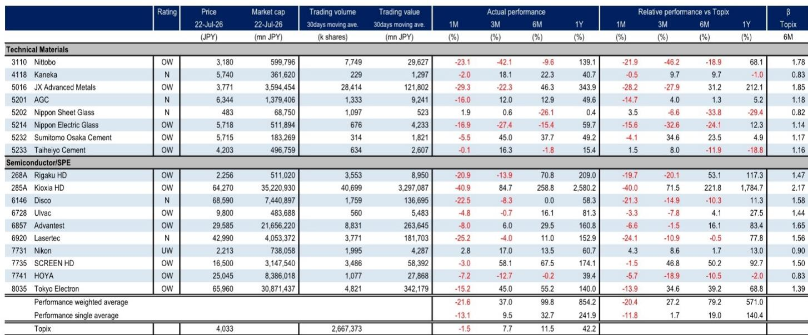
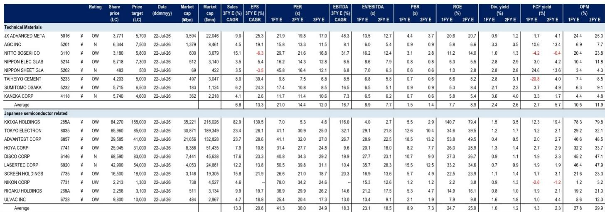

# 半导体设备与材料：亚洲参与者交流——7月WFE观察

7月中旬，某机构研究团队在亚洲与关注者进行了一轮交流。与6月拜访欧美关注者时的情形相比，这次交流的氛围相对稳定，但关注者对日本半导体设备和材料公司的基本面仍然持正面看法。讨论的焦点集中在三个方向：公司价格趋势、哪些企业相对具有韧性，以及WFE（晶圆厂设备）市场是否存在进一步调整的空间。

该报告给出的WFE市场预期为2026年1590亿美元、2027年2050亿美元、2028年2370亿美元，年增幅在16%至29%之间。但许多关注者认为这一数字仍有上调可能，理由包括台积电在7月16日财报中透露的资本支出上升、DRAM相关资本支出预期走高、部分关注者对英特尔7月24日财报可能上调资本支出的期待，以及Terafab概念的推进。部分关注者甚至已经在寻找WFE市场在2028年达到2500亿美元的条件。

## 1. 铠侠价格调整后关注点转向市场走向

在该机构拜访亚洲关注者的一周内，铠侠公司价格从77000日元至52110日元，调整幅度达32%，而同期东证指数仅变化3%。讨论自然集中在价格变化原因和趋势判断上。关注者关注的两个主要议题：一是超大规模云厂商能否维持因存储价格上涨而大幅扩张的支出；二是低成本模型Kimi K3的推出是否会降低KV缓存需求。

报告认为，第一个议题需要通过公司4-6月业绩来验证，但第二个议题在一周后半段已明显缓解——杰文斯悖论（效率提升反而增加总消耗）开始被市场重新理解。一个直接的例子是，Kimi在7月19日因K3需求激增导致GPU容量接近满载，暂停了新用户注册。在盈利预期上，关注者比报告更为积极：市场对铠侠2027财年每股收益的预期为15000日元，而该机构的预期为14149日元；关注者预计7-9月存储价格环比上涨25-35%，该机构的预期为20%。截至7月19日，基于该机构2027财年预期，铠侠的估值倍数已回落至约3.5倍，越来越多的关注者开始关注可能的回升。

> **KC评论：** 这里容易被忽略的是“Super High IOPS”技术。它基于SLC技术，与当前主流的TLC相比，容量折损比约为1:3。这意味着如果该技术被大规模采用，反而可能成为中期供给收紧的驱动因素，而非简单的需求替代。

## 2. 前道设备公司受益于WFE预期与定价能力改善

尽管半导体相关公司普遍有所调整，关注者对前道设备公司的评论整体仍然积极，核心逻辑是WFE预期存在上调空间。该机构重点关注东京电子。该公司的优势在于：在刻蚀、沉积、与EUV协同开发等有望表现较好的设备领域有较强布局，且DRAM业务占比高，而DRAM的增长预期强劲。

更值得关注的是定价能力的变化。东京电子正在通过价格调整改善盈利能力，而日元计价的销售结构使其价格调整更容易被客户接受。这一趋势在近期两家重要客户的财报电话会议上得到了印证：台积电在7月16日表示，半导体设备价格上涨是其资本支出上升的原因之一；ASML在7月15日也提到了“更灵活的定价”。这些信号共同指向一个判断：前道设备公司的定价权正在增强，而这在以往的周期中并不常见。

## 3. 测试设备与材料公司的关注点各有侧重

爱德万测试的公司价格受到两个因素的影响：市场对下一代GPU测试时间增长的预期下调，以及对ASIC市场份额可能变化的关注。但该机构保持积极看法，理由包括新系统占比提升、CPU和CPO测试机会扩大。在CPU领域，测试时间被认为比GPU和ASIC更短，原本使用内部测试设备的客户可能转向外包。随着芯片结构日益复杂，这一趋势可能持续。

在材料领域，JX Advanced Metals和Nittobo虽然短期关注者不多，但关注度很高。JX Advanced Metals在6月16日宣布将InP衬底产能扩大7-10倍，关注者关心的是定价趋势和供应情况。该机构的基础假设是价格上涨2-3倍，但许多关注者预期3倍或更高。供应方面，磷的采购问题成为新的关注点。Nittobo的讨论则集中在T-glass的供需格局上。随着多核架构和AI专用DDR的普及，T-glass的潜在市场空间可能进一步扩大，而Nittobo在尖端T-glass领域的优势地位短期内难以被改变。报告预计，Nittobo可能很快会宣布一项大规模研究计划，以满足2028财年及以后的需求，并可能同时宣布提价以覆盖研究成本。

## 4. 关注者对WFE市场的中期预期高于当前预测

综合来看，这次亚洲关注者交流传递出一个清晰的信号：尽管短期市场情绪有所降温，但关注者对WFE市场的中期预期实际上高于该机构的官方预期。2028年2500亿美元的条件虽然尚未成为共识，但已经被部分关注者纳入讨论范围。这种预期差异主要来自三个来源：台积电、英特尔等头部客户的资本支出上调可能性、DRAM研究的持续扩张，以及Terafab等新概念带来的增量需求。

对于关注日本半导体供应链的关注者来说，当前阶段需要跟踪的关键变量包括：超大规模云厂商的资本支出趋势、存储价格在7-9月的实际变动幅度、以及前道设备公司能否持续实现价格调整。这些因素将共同决定这一轮周期的持续时间和范围。

For informational purposes only. Portions may be generated,translated,summarized,or edited with AI assistance based on source materials and may contain omissions or errors. Please verify independently. This is not investment,legal,tax,accounting,or other professional advice.

For informational purposes only. Portions may be generated,translated,summarized,or edited with AI assistance based on source materials and may contain omissions or errors. Please verify independently. This is not investment,legal,tax,accounting,or other professional advice.

