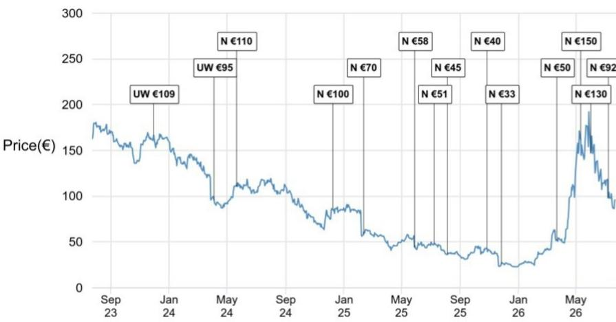

# Soitec的光子学业务迎来实质性进展，市场预期已部分体现

Soitec管理层在发布第一季度销售预告后的电话会议上，对其光子学-SOI业务发表了较为积极的言论。语气并非谨慎，也非有所保留。管理层描述了客户需求加速、通过预付款的产能保留协议提高了可见度，以及新加坡工厂认证时间显著提前。光子学收入，他们表示，随着供应上线，到2027财年应该会环比增长。对于一家过去两年一直在应对核心RF-SOI业务库存修正的公司而言，这是一个重要的战略调整。

直接含义是：受光子学推动，2027财年收入预期可能会上调，并带来盈利的传导效应。但研究的问题不在于光子学是否增长，而在于增长是否已反映在当前报价中。Soitec的报价在近几个月出现一定幅度的上行，因为市场对硅光子学的关注度上升。当前市场定价已经包含了光子学机遇的很大一部分。看好Soitec的论据取决于光子学能否带来超出已折现预期的上行空间。

故事的张力在于：管理层的信心在增强，但未来几年的集团层面预测不应发生重大变化。市场参与者对话显示，2030财年光子学收入已轻松超过5亿欧元。市场不是在等待证据，而是在提前为多年增长进行定价。对观察者而言，问题在于运营现实是否会超过报价中已包含的预期。

## 光子学需求正从可插拔扩展延伸，预示光互联的结构性转变

管理层表示，当前光子学需求的大部分与可插拔扩展相关，但来自近封装光学（Near-Packaged Optics）的比例正在增加。共封装光学（Co-Packaged Optics）预计将在2027财年末开始爬坡，而扩展互联的需求也开始出现。这不是一个单一产品的故事，而是可寻址市场在多种光互联架构上的扩展。

这一扩展的意义值得关注。可插拔扩展只对应数据中心互联市场的一个细分领域。近封装光学和共封装光学则代表更深层次的网络架构集成，具有更高的单位晶圆价值和更稳固的客户关系。每一次架构转变都会增加每个数据节点中的硅光子学含量。如果Soitec的光子学-SOI基板成为这些架构的首选平台，其收入轨迹可能在当前共识预期的2030财年数据基础上进一步延伸。

在强劲的需求环境下，定价依然有利，不过产能保留协议伴随着较低的定价。这是一个经典的量价权衡。预留产能的低定价表明客户愿意以长期订单换取供应保障。这种承诺比现货定价更有价值，因为它将需求可见性转化为收入可预测性。

## 产能保留协议是将需求可见性转化为收入确定性的机制

管理层指出，产能保留协议的构建包含两个关键特征：客户预付款或保证金以锁定产能，以及了解客户库存水平。这些特征直接有助于应对历史上困扰半导体供应链的两大风险：重复下单和渠道积压。

预付款要求降低了虚假需求的风险。当客户需要预先支付资金来保留产能时，需求信号变得更加可靠。库存了解则降低了渠道积压的风险，而这在RF-SOI业务中曾反复出现。Soitec实际上是在构建一个契约框架，使客户激励与供应纪律保持一致。

管理层未披露这些协议所对应的收入规模，但上半财年报告的预付款余额将提供一个有用的参考。这是一个值得关注的指标。预付款余额上升将表明客户是用现金投票，而不仅仅是依赖预测。对于观察者而言，这是比管理层指引或客户声明更可靠的领先指标。

2027财年指引中包含一部分光子学收入，这些收入与预期生产爬坡前的缓冲库存建设有关。这是一个需要注意的细节。部分近期收入实际上来自客户的库存建设，而非终端需求消耗。观察者应区分反映真实消耗的收入和代表提前备货的收入。后者是真实的收入，但可能伴随后续消化风险。

## 新加坡工厂认证加速是最重要的运营催化因素

光子学-SOI指引上调的一个重要驱动因素是新加坡300mm工厂的首次客户认证提前。该认证原计划在2026年底左右完成，现已提前推进。后续认证也在进行中。

这是使需求故事可信的运营催化因素。没有供应，需求只是愿景。新加坡工厂新增的300mm产能与法国伯宁工厂相当。管理层要求客户如果希望获得更多供应，需在两家工厂均进行认证。由于设施对等，认证并不繁琐，但这是必要要求。

战略逻辑清晰。双源供应来自两个地理分离的工厂，降低了客户的供应链风险。同时也让Soitec能够跨站点分配生产，优化负载和成本。对于一家在光子学领域长期受产能限制的公司，这一扩张是收入增长得以实现的关键解锁。

认证时间的提前表明客户需求足够紧迫，促使投资决策提前。这是一个积极信号，意味着客户不仅是在规划未来需求，更是当下就需要供应。

## RF-SOI库存消化进展顺利，但复苏是渐进的，增长驱动已转变

截至6月季度末，RF-SOI客户库存约为170万片200mm等效晶圆，低于3月底的约200万片。公司继续朝着每季度缺货20万至30万片的目标推进，以便使库存恢复正常。

这是进展，但并非驱动因素。RF-SOI业务在恢复，而非加速。公司受益于300mm RF-SOI销售的增长——在该领域其市场份额高于200mm。这种产品结构转变是积极的，但属于渐进式改善，而非变革性变化。

战略意义在于，RF-SOI不再是增长引擎，而是作为基础业务提供现金流和产能利用率，同时光子学成为增长驱动。观察者不应预期RF-SOI的剧烈反弹会主导公司表现。如果上行空间出现，那将来自光子学。

管理层将2027财年晶圆厂负载率指引从约60%上调至约65%，爬坡预计从第二季度开始，第一季度负载率约为48%。负载率提升由光子学实力驱动。因此毛利率故事是产品组合故事，而非数量故事。更高的光子学收入改善了集团层面的组合和价格，即使长期协议带来的定价较低以及裸片成本上升产生抵消。管理层预计2027财年贡献利润率略有扩张。

来自政府资助减少的拖累约为3000万欧元，高于此前预期的约2000万欧元。这是实际影响，但可以管理。CFO表示2027年恢复将是“切实且显著的”，并在2028年“完全实现”。利润率轨迹在改善，但转折点仍在一年之后。

## 一个观察框架：区分运营故事和市场定价故事

运营故事引人关注。光子学需求在扩展，供应上线速度超出预期，契约框架降低了需求风险。管理层信心上升，收入轨迹在2027财年加速。

市场定价故事则更为复杂。公司报价已因光子学题材出现明显重估，处于晶圆制造商高端区间，且较五年均值有约10%溢价。溢价的理由是增长、回报和现金流改善。但这一溢价已假设光子学爬坡能够实现。

对于关注该公司的观察者，框架清晰。看多逻辑取决于光子学收入能否超过已较为乐观的2030财年共识预期。如果市场已经计入2030财年5亿欧元的光子学收入，那么上行空间来自这一数字进一步走高。看空逻辑则取决于新加坡爬坡的执行风险、Global Wafers在RF-SOI和硅光子学领域的竞争压力，或库存恢复正常所需时间长于预期。

风险与回报相对平衡。运营势头真实存在，但市场定价容错空间有限。故事的走向在改善，但报价已反映了大部分改善。

*仅供信息参考。部分内容可能由AI基于源材料生成、翻译、总结或编辑，可能存在遗漏或错误。请独立核实。本文不构成任何专业建议。*

仅供信息参考。部分内容可能由AI基于源材料生成、翻译、总结或编辑，可能存在遗漏或错误。请独立核实。本文不构成任何专业建议。

#学习笔记 #研究笔记 #学习研究 #研报解读
