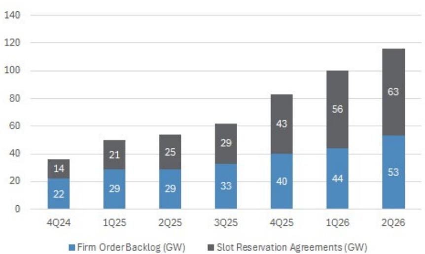
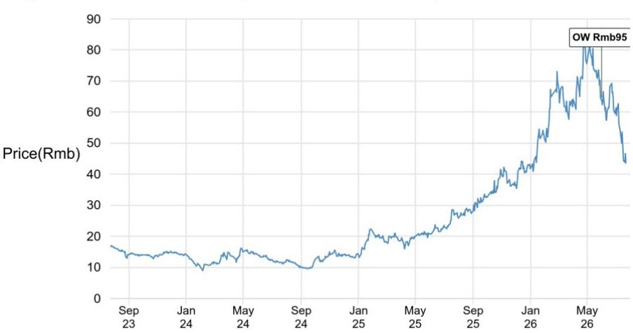

# 应流机电

## 从GE Vernova的2026年第二季度结果看行业趋势

GE Vernova（GEV US）2026年第二季度燃气轮机更新显示，OEM订单积压仍在延长，供应商产能空间依然紧张，这对上游热端部件制造商（如应流机电）具有参考意义，尽管GEV目前并非其直接客户。2026年第二季度，GEV新签约约20GW的燃气发电合同，并将2026年全年燃气订单+服务协议（SRA）的退出预期从此前的至少110GW上调至至少125GW。燃气订单环比增长44GW至53GW，SRA增长56GW至63GW，表明订单管道依然充裕，转化持续推进。我们认为这反映了整个供应链的价格纪律和更长的订单可见性。对应流机电保持关注。

- GEV提供了积极的行业信号。GEV指出已签约燃气轮机数量环比增长100GW至116GW，管理层目标年底前达到至少125GW（此前为至少110GW）。GEV还提到2026年上半年燃气设备订单报价较2025年第四季度水平上涨超过20%，并预计2026年下半年报价将保持在较2025年第四季度10%–20%涨幅区间的较高端。此外，GEV规划了到2030年通过精益生产和在现有设施内增加设备实现年燃气产量30GW的路径。我们认为新增OEM产能对上游供应商具有方向性参考价值，因为这会提高铸件的产量上限，并推动资质认证和采购规划提前。

- 西门子能源的信号显示订单积压延长和报价坚挺。西门子能源（ENR GR）的分析框架继续指向订单积压延伸至2027–2028年，同时报价环境依然强劲，尽管供应在本十年后期逐步增加。这对应流机电很重要，因为西门子能源预计将是未来2-3年内最重要的直接客户，采购量将增长约10倍。

- 关于供应过剩的讨论仍在持续。读者担忧OEM产能扩张是否会在本十年后期造成供应过剩，但GEV将行业供需描述为未来约6年内重型设备“非常平衡”。我们的分析框架显示，2026年全球供应约64GW，需求约115–120GW；2027年供应约70GW，需求约110–120GW；2028年供应约80GW，需求约110–120GW。到2030年，供应可能达到约90GW+或约95GW+（包括GEV的新增产能），届时平衡可能开始趋紧，但我们预计未来2-3年订单积压仍将延长。

**关注**

603308.SS, 603308 CH
报价（2026年7月22日）：Rmb43.57
参考估值（2027年12月）：Rmb95.00

基础设施、工业与运输

Jenny Qiu, CFA AC
(852) 2800 8503
jenny.qiu@JPM.com

Karen Li, CFA
(852) 2800-8589
karen.yy.li@JPM.com

Sunny Su
(852) 2800 8551
sunny.su@JPM.com

Mufan Shi
(852) 2800-8502
mufan.shi@JPM.com
JPM Securities (Asia Pacific) Limited / JPM Broking (Hong Kong) Limited

请参见第4页的分析师认证和重要披露，包括非美国分析师披露。

图1：GEV的订单 + SRA（GW）

来源：JPM、GE Vernova公司报告。

表1：全球燃气轮机部件及OEM对比

| | BBG代码 | 机构看法 | 最新报价（本币） | 机构参考估值（本币） | 上行/下行空间 | 市值（百万美元） | 年初至今公司表现 | 估值倍数（x） | | | 每股回报增长（同比） | | | PEG | | 净资产回报率（%） | |
|---|---|---|---|---|---|---|---|---|---|---|---|---|---|---|---|---|---|
| | | | | | | | FY26E | FY27E | FY28E | FY26E | FY27E | FY28E | FY26E | FY27E | FY26E | FY27E |
| **燃气轮机部件** | | | | | | | | | | | | | | | | |
| 应流机电 | 603308 CH | 关注 | 45 | 95 | 110% | 4,544 | 8% | 47 | 30 | 19 | 90% | 58% | 56% | 0.8 | 0.5 | 11.7 | 16.8 |
| Howmet Aerospace | HWM US | 关注 | 281 | 310 | 10% | 112,310 | 37% | 56 | 47 | 40 | 37% | 17% | 19% | 3.2 | 2.5 | 34.3 | 34.7 |
| Doncasters | DPC US | 未覆盖 | 47 | NA | NA | 7,002 | NA | 114 | 60 | 47 | NA | NA | NA | NA | NA | NA | NA |
| Wedge Industrial | 000534 CH | 未覆盖 | 25 | NA | NA | 1,913 | 16% | 38 | 26 | 18 | 41% | 45% | 49% | 0.8 | 0.5 | 17.6 | 20.4 |
| Himile Mechanical | 002595 CH | 未覆盖 | 49 | NA | NA | 8,454 | -15% | 20 | 17 | 15 | 18% | 15% | 16% | 1.3 | 1.1 | 21.3 | 21.0 |
| **平均** | | | | | | | | **55** | **36** | **28** | **46%** | **34%** | **35%** | **1.5** | **1.2** | **21.2** | **23.2** |
| **燃气轮机OEM** | | | | | | | | | | | | | | | | |
| GE Vernova | GEV US | 关注 | 985 | 1,302 | 32% | 262,347 | 51% | 44 | 41 | 29 | 198% | 8% | 39% | 5.3 | 1.0 | 39.6 | 35.7 |
| Siemens Energy | ENR GY | 关注 | 152 | 235 | 54% | 149,762 | 27% | 31 | 23 | 22 | 204% | 32% | 8% | 1.0 | 2.8 | 34.4 | 33.9 |
| 三菱重工 | 7011 JP | 未覆盖 | 3,895 | NA | NA | 80,586 | 1% | 45 | 32 | 27 | 7% | 42% | 18% | 1.1 | 1.7 | 11.6 | 13.0 |
| Baker Hughes | BKR US | 关注 | 57 | 74 | 31% | 56,151 | 24% | 23 | 20 | 17 | -2% | 19% | 20% | 1.3 | 1.0 | 12.5 | 12.5 |
| Doosan Enerbility | 034020 KS | 关注 | 71,300 | 130,000 | 82% | 31,119 | -6% | 139 | 68 | 46 | N.A | 104% | 48% | 1.3 | 1.4 | 4.1 | 7.9 |
| Caterpillar Inc | CAT US | 关注 | 889 | 1,165 | 31% | 409,609 | 55% | 35 | 29 | 26 | 34% | 21% | 13% | 1.7 | 2.2 | 97.3 | N.A |
| 烟台杰瑞 | 002353 CH | 关注 | 135 | 162 | 20% | 20,432 | 91% | 40 | 27 | 25 | 14% | 47% | 7% | 0.8 | 3.9 | 14.1 | 18.0 |
| 东方电气 | 1072 HK | 未覆盖 | 23 | NA | NA | 13,249 | -9% | 14 | 12 | 11 | 21% | 23% | 6% | 0.6 | 1.9 | 10.5 | 11.7 |
| 上海电气 | 2727 HK | 未覆盖 | 3 | NA | NA | 13,533 | -14% | 31 | 24 | 18 | 84% | 28% | 38% | 1.1 | 0.6 | 2.6 | 3.2 |
| **平均** | | | | | | | | **45** | **31** | **24** | **70%** | **36%** | **22%** | **1.6** | **1.8** | **25.2** | **17.0** |

来源：Bloomberg Finance L.P.、JPM估算。未覆盖公司的估算基于Bloomberg一致预期。日本公司财年于3月结束。DPC于2026年6月上市，暂无预测数据。截至2026年7月23日。

# 研究框架、估值和风险因素

应流机电 - A股（关注；参考估值：Rmb95.00）

## 研究框架

应流机电是中国最大的高温合金精密铸件供应商，专注于燃气轮机和航空发动机热端部件，客户包括Baker Hughes、西门子能源、Ansaldo、Doosan、GE Aerospace、Safran和Rolls-Royce等全球OEM。其核心价值在于稀缺性：应流机电2025年燃气轮机收入仅为Rmb10亿，约占全球叶片市场份额2%，但随着OEM寻求供应商多元化，预计到2030年份额将升至10%。燃气轮机是近期增长引擎，受益于数据中心电力需求和行业供给不足，2026年至2035年全球燃气轮机需求预计超过100GW/年，而2026年制造产能仅为64GW。航空发动机提供了另一增长来源，应流机电是GE Aerospace、Safran和Rolls-Royce在中国相对少见的供应商，合同期限延伸至2030-2032年。

## 估值

我们对应流机电2028年预期每股回报的参考估值为40倍，得出2027年12月的参考估值Rmb95，参考Howmet Aerospace 2027-2028年平均估值倍数约40倍作为基准。

## 风险和评级依据

下行风险包括：1）燃气轮机需求增长慢于预期，如果燃气发动机等替代电源方案获得份额；2）主要OEM（包括Baker Hughes、西门子能源和Ansaldo）客户爬坡延迟；3）由于生产良率、报价或产品组合不及预期，毛利率改善幅度低于预期；4）地缘政治或出口管制风险影响俄罗斯客户敞口或用于产能扩张的进口美欧设备获取。

分析师认证：本报告封面标注“AC”的研究分析师证明（或，若多位研究分析师对本报告负责，则封面或文档内标注“AC”的研究分析师单独证明，就其在本研究中覆盖的每个证券或发行人而言）：(1) 本报告中表达的所有观点均准确反映了研究分析师对任何及所有主题证券或发行人的个人观点；(2) 研究分析师薪酬的任何部分均未直接或间接与本报告所述的具体建议或观点相关。所有以韩文列于封面的韩国研究分析师（如适用）还根据KOFIA要求证明，其分析基于诚信，且观点反映研究分析师自身意见，未受不当影响或干预。

本报告中的所有作者均为独立进行研究的研究分析师（除非另有说明）。在欧洲，行业专家（销售和交易）可能作为联系人出现在本报告中，但并非报告作者或研究部门成员。

## 重要披露

- 做市商/流动性提供者：JPM是应流机电或相关实体金融工具的做市商和/或流动性提供者。
- 债务头寸：JPM可能持有应流机电或相关实体的债务证券头寸。

公司特定披露：JPM会并且寻求与其研究报告覆盖的公司开展业务。因此，读者应注意，JPM可能存在可能影响本报告客观性的利益冲突。读者应将本报告视为做出投资决策的单一因素。重要披露（包括价格图表和信用意见历史表，如适用）可在汇编报告和所有JPM覆盖公司及某些未覆盖公司处获取，网址：https://www.jpmm.com/research/disclosures，电话：1-800-477-0406，或电邮research.disclosure.inquiries@JPM.com。

应流机电（603308.SS, 603308 CH）价格图表

| 日期 | 评级 | 价格（Rmb） | 目标价（Rmb） |
|---|---|---|---|
| 2026年6月1日 | OW | 64.67 | 95 |

来源：Bloomberg Finance L.P. 和 JPM；价格数据已调整股票分割和股息。2026年6月1日开始覆盖。所有股价均为前一交易日收盘价。
图表显示JPM对该股票的持续覆盖；当前分析师可能并未在整个期间内覆盖该股票。
JPM评级或命名：OW = 超配，N = 中性，UW = 低配，NR = 未评级

## 股票研究评级、命名和分析师覆盖范围说明

JPM使用以下评级系统：超配（在本报告所示目标价期限内，预期该股票将跑赢研究分析师或其团队覆盖范围内股票的平均总回报）；中性（在目标价期限内，预期该股票将与研究分析师或其团队覆盖范围内股票的平均总回报持平）；低配（在目标价期限内，预期该股票将跑输研究分析师或其团队覆盖范围内股票的平均总回报）。NR为未评级。此时，JPM因缺乏充分的基本面依据或法律、监管或政策原因，已移除该股票的评级和（如适用）目标价。先前评级和（如适用）目标价不应再被依赖。NR指定并非推荐或评级。某些覆盖股票有评级但无目标价；在这些情况下，我们预期该股票将在相关区域的时间期限内跑赢/持平/跑输研究分析师或其团队覆盖范围内股票的平均总回报。在亚洲（澳大利亚和印度除外）及英国中小盘股研究中，每只股票的预期总回报与基准国别市场指数的预期总回报进行比较，而非与研究分析师覆盖范围比较。若本报告重要披露部分未显示，认证研究分析师的覆盖范围可在JPM研究网站找到：https://www.JPMmarkets.com。

覆盖范围：Qiu, Jenny：中国国航A、中国国航H、北京首都机场、东方航空A、东方航空H、中国中铁A、中国中铁H、南方航空A、南方航空H、中国建筑国际、大秦铁路A、白云机场A、宁沪高速A、宁沪高速H、上海机场A、深圳机场A、春秋航空A、应流机电A、浙江沪杭甬

JPM股票研究评级分布，截至2026年7月4日

| | 超配（买入） | 中性（持有） | 低配（卖出） |
|---|---|---|---|
| JPM全球股票研究覆盖* | 53% | 36% | 12% |
| 投行客户** | 83% | 80% | 73% |
| JPMS股票研究覆盖* | 51% | 37% | 12% |
| 投行客户** | 95% | 92% | 87% |

*请注意，百分比可能因四舍五入未加总至100%。
**在过去12个月内，JPM为其提供投资银行服务的“买入”、“持有”和“卖出”类别中主题公司的百分比。

仅就FINRA评级分布规则而言，我们的“超配”评级属于买入类别；“中性”评级属于持有类别；“低配”评级属于卖出类别。请注意，带有NR指定的股票不包含在上述表格中。此信息截至最近一个日历季度末。

股票估值和风险：关于覆盖公司或目标价的估值方法和风险，请参阅最近的公司特定研究报告（http://www.JPMmarkets.com），联系首席分析师或您的JPM代表，或电邮research.disclosure.inquiries@JPM.com。关于专有模型的重大信息，请参阅公司特定研究报告中的财务摘要和公司一览表，可在客户网站的公司页面下载：http://www.JPMmarkets.com。本报告还阐述了其中使用的重要基本假设。

## 研究交流历史

过去12个月内的JPM研究交流历史可通过研究评论页面访问：http://www.JPMmarkets.com，也可按分析师姓名、行业或金融工具搜索。

## 分析师薪酬

负责本报告的研究分析师薪酬基于多种因素，包括研究和质量准确性、客户反馈、竞争因素和整体公司收入。

## 非美国分析师注册

除非另有说明，本报告封面的非美国分析师是JPM Securities LLC非美国关联公司的员工，可能未根据FINRA规则注册为研究分析师，可能不是JPM Securities LLC的关联人士，且可能不受FINRA Rule 2241或2242关于与覆盖公司沟通、公开露面以及研究分析师账户持有证券交易的限制。

## 其他披露

JPM是JPM Chase & Co.及其全球子公司和关联公司投资银行业务的营销名称。

英国MiFID FICC研究分拆豁免：英国客户应参考UK MiFID Research Unbundling exemption，了解JPM实施FICC研究豁免的详情及相关FICC研究分类指南。

除非相关法律特别允许，所有提供给客户的研究材料均同时在客户网站JPM Markets上发布。并非所有研究内容都会重新分发、通过电子邮件发送或提供给第三方聚合服务商。如需特定股票的所有研究材料，请联系您的销售代表。

本研究材料中对“中国；香港；台湾；澳门”的任何全称表述分别为：中国大陆；中国香港特别行政区；中国台湾；中国澳门特别行政区。

JPM可能不时撰写受美国、欧盟、英国或其他相关司法管辖区政府当局实施或管理的经济或金融制裁约束的发行人或证券。本报告中的任何内容均无意被解读为鼓励、促进、批准或以其他方式认可对该等制裁证券的投资或交易。客户在做出投资决定时应了解自身的法律和合规义务。

本研究报告中讨论的任何数字或加密资产均面临快速变化的监管环境。关于加密资产（包括比特币和以太坊）的相关监管建议，请参阅https://www.JPM.com/disclosures/cryptoasset-disclosure。

本研究报告的作者可能未获得在您所在司法管辖区开展受监管活动的许可，如果未获得许可，则不自称有资格这样做。

交易所交易基金（ETF）：JPM Securities LLC（“JPMS”）作为几乎所有美国上市ETF的授权参与方。如果本报告中提及任何ETF，JPMS可能因分发该ETF份额而赚取佣金和基于交易的报酬，并可能因执行其他交易相关服务（如向卖空该ETF份额的卖空者提供证券借贷）而赚取费用。JPMS也可能为ETF本身提供服务，包括作为ETF的经纪商或交易商。此外，JPMS的关联公司可能为ETF提供服务，包括信托、托管、行政管理、借贷、指数计算和/或维护及其他服务。

期权和期货相关研究：如果本信息涉及期权或期货相关研究，该信息仅向已收到适当期权或期货风险披露文件的人士提供。请致电您的JPM代表，或访问https://www.theocc.com/components/docs/riskstoc.pdf获取期权清算公司标准化期权的特点和风险，或访问https://www.finra.org/sites/default/files/2020-08/Security_Futures_Risk_Disclosure_Statement_2020.pdf获取证券期货风险披露声明。

银行间报价利率（IBOR）及其他基准利率变更：某些利率基准可能或将在未来受到持续的国际、国内和其他监管指导、改革和改革建议的影响。更多信息请访问：https://www.JPM.com/global/disclosures/interbank_offered_rates

私人银行客户：如果您作为JPM Chase & Co.及其子公司提供的私人银行业务客户收到研究材料，该研究由JPM私人银行提供，而非JPM任何其他部门（包括但不限于JPM企业与投资银行及其全球研究部门）。

负责研究材料生产和分发的法律实体：撰写本材料的Reg AC研究分析师姓名下方标识的法律实体是负责生产本研究材料的法律实体。如果多位Reg AC研究分析师以不同法律实体署名合作撰写本材料，则这些法律实体共同负责本研究材料的生产。如果分析师姓名下方列出多个法律实体，则第一个法律实体负责生产（除非另有说明）。来自不同JPM关联公司的研究分析师可能对本材料的生产做出了贡献，但可能未获许可在您所在司法管辖区开展受监管活动（且不自称有资格这样做）。除非下文法律实体披露中另有说明，本材料已由负责生产的法律实体分发，或者如果在分析师姓名下方列出多个法律实体，则第一个法律实体负责分发。如有任何疑问，请联系您所在司法管辖区的相关研究分析师或分发本研究材料的实体。

法律实体披露和国家/地区特定披露：

阿根廷：JPM Chase Bank N.A Sucursal Buenos Aires受阿根廷共和国中央银行（BCRA）和阿根廷国家证券委员会（CNV）监管。
澳大利亚：JPM Securities Australia Limited（ABN 61 003 245 234 / AFS牌照号：238066）受澳大利亚证券和投资委员会监管，是ASX Limited的市场参与者、ASX Clear Pty Limited的清算和结算参与者以及ASX Clear（Futures）Pty Limited的清算参与者。本材料由或代表JPMSAL仅在澳大利亚向“批发客户”（定义见《公司法》2001年第761G条）发行和分发。所有金融产品覆盖列表请访问https://www.jpmm.com/research/disclosures。JPM寻求覆盖对国内外读者具有相关性的所有GICS行业以及不同市值范围的公司。如适用，研究分析师团队在对主题公司进行公开尽职调查时，可能有时通过公司走访、与公司代表讨论、管理层演示等方式进行尽职调查。JPMSAL发布的研究已根据JPM澳大利亚研究独立性政策编制，该政策可通过以下链接获取：JPM Australia - Research Independence Policy.
巴西：Banco JPM S.A.受巴西证券交易委员会（CVM）和巴西中央银行监管。JPM监察员：0800-7700847 / 0800-7700810（听力障碍者）/ ouvidoria.jp.morgan@jpmchase.com.
加拿大：JPM Securities Canada Inc.是一家注册投资交易商，受加拿大投资监管组织和安大略省证券委员会监管，是加拿大交易所的参与会员。本材料由或代表JPM Securities Canada Inc.在加拿大分发。
智利：Inversiones JPM Limitada是在智利注册的未受监管实体。
中国：JPM Securities (China) Company Limited已获中国证监会批准开展证券投资咨询业务。
哥伦比亚：Banco JPM Colombia S.A.受哥伦比亚金融监管局（SFC）监管。本材料中提及的国外由非哥伦比亚银行实体提供的产品或服务仅供说明性目的。此类提及不构成根据哥伦比亚适用法规定义的哥伦比亚领土内的促销活动或金融产品或服务提供。
迪拜国际金融中心：JPM Chase Bank, N.A., Dubai Branch受迪拜金融服务局（DFSA）监管，注册地址：Dubai International Financial Centre - The Gate, West Wing, Level 3 and 9 PO Box 506551, Dubai, UAE。本材料由JPM Chase Bank, N.A., Dubai Branch分发给根据DFSA规则被视为专业客户或市场对手方的人士。
欧洲经济区：除非另有说明，研究材料在EEA由JPM SE分发。JPM SE是一家信贷机构，受德国联邦金融监管局（BaFin）授权，并由BaFin、德国中央银行（Deutsche Bundesbank）和欧洲中央银行共同监管。JPM SE总部位于法兰克福，注册地址：TaunusTurm, Taunustor 1, Frankfurt am Main, 60310, Germany。本材料在EEA分发给根据MiFID II第4条第1款第10项及附件II及其在各自母国实施规则被视为专业读者（或同等资格）的人士。非EEA专业读者不得依赖或据此采取行动。本材料涉及的任何投资或投资活动仅面向EEA相关人士，并将仅与EEA相关人士进行。
香港：JPM Securities (Asia Pacific) Limited（CE编号AAJ321）受香港金融管理局和香港证券及期货事务监察委员会监管，JPM Broking (Hong Kong) Limited（CE编号AAB027）受香港证券及期货事务监察委员会监管。JPM Chase Bank, N.A., Hong Kong Branch（CE编号AAL996）受香港金融管理局和证券及期货事务监察委员会监管，根据美国法律组织，责任有限。若本材料的分发在香港属于受监管活动，则本材料由或通过JPM Securities (Asia Pacific) Limited和/或JPM Broking (Hong Kong) Limited在香港分发。
印度：JPM India Private Limited（公司识别号U67120MH1992FTC068724），注册地址JPM Tower, Off. C.S.T. Road, Kalina, Santacruz - East, Mumbai – 400098，在印度证券交易委员会注册为“研究分析师”，注册号INH000001873。JPM India Private Limited也在SEBI注册为国家证券交易所和孟买证券交易所的成员（SEBI注册号INZ000239730）和商人银行家（SEBI注册号MB/INM000002970）。电话：91-22-6157 3000，传真：91-22-6157 3990，网站：http://www.jpmipl.com。JPM Chase Bank, N.A. - Mumbai Branch已获得印度储备银行许可（牌照号53/牌照号BY.4/94；SEBI - IN/CUS/014/ CDSL : IN-DP-CDSL-444-2008/ IN-DP-NSDL-285-2008/ INBI00000984/ INE231311239）作为印度商业银行，主要许可证允许其在印度开展银行业务及其他印度银行分支机构可从事的活动。对于非本地研究材料，本材料不由JPM India Private Limited在印度分发。合规官：Ashutosh Sharma；ashutosh.j.sharma@jpmchase.com；+912261575002。投诉官：Ramprasadh K，jpmipl.research.feedback@JPM.com；+912261573000。SEBI注册和NISM认证不保证中介表现或向读者提供任何回报保证。请访问条款和条件及重要条款和条件。年度合规审计报告可在http://www.jpmipl.com/#research获取。
印度尼西亚：PT JPM Sekuritas Indonesia是印度尼西亚证券交易所的成员，受Otoritas Jasa Keuangan（OJK）注册和监管。
韩国：JPM Securities (Far East) Limited, Seoul Branch是韩国交易所（KRX）的成员。JPM Chase Bank, N.A., Seoul Branch在韩国注册为外国银行分行（JPM Chase Bank, N.A.）。两者均受金融委员会（FSC）和金融监督院（FSS）监管。对于非宏观研究材料，该材料由或通过JPM Securities (Far East) Limited, Seoul Branch在韩国分发。
日本：JPM Securities Japan Co., Ltd.和JPM Chase Bank, N.A., Tokyo Branch受日本金融厅监管。
马来西亚：本材料由JPM Securities (Malaysia) Sdn Bhd（18146-X）在马来西亚发行和分发，该公司是Bursa Malaysia Berhad的参与组织，持有马来西亚证券委员会颁发的资本市场服务牌照。
墨西哥：JPM Casa de Bolsa, S.A. de C.V., JPM Grupo Financiero是墨西哥证券交易所和机构证券交易所的成员，经授权由国家银行和证券委员会（Comisión Nacional Bancaria y de Valores）作为经纪交易商。
新西兰：本材料由JPMSAL在新西兰仅向“批发客户”（定义见《金融市场行为法2013》）发行和分发。JPMSAL已根据《金融服务提供商（注册和争议解决）法案2008》注册为金融服务提供商。
菲律宾：JPM Securities Philippines Inc.是菲律宾证券交易所的交易参与者，是菲律宾证券清算公司和证券读者保护基金的成员。受证券交易委员会监管。
新加坡：本材料由或通过JPM Securities Singapore Private Limited（JPMSS）[MDDI (P) 057/08/2025，公司注册号199405335R]和/或JPM Chase Bank, N.A., Singapore branch（JPMCB Singapore）在新加坡发行和分发，两者均受新加坡金融管理局监管。本材料在新加坡仅向认可读者、专业读者和机构读者发行和分发（定义见《证券及期货法》第289章第4A条）。本材料无意向任何零售读者或不符合“认可读者”、“专业读者”或“机构读者”定义的其他读者发行或分发。新加坡的接收者应就本材料引起或与之相关的任何事宜联系JPMSS或JPMCB Singapore。
南非：JPM Equities South Africa Proprietary Limited和JPM Chase Bank, N.A., Johannesburg Branch是约翰内斯堡证券交易所的成员，受金融服务行为监管局（FSCA）监管。
台湾：JPM Securities (Taiwan) Limited是台湾证券交易所的参与者（公司类型），受台湾证券期货局监管。与股权证券相关的材料由JPM Securities (Taiwan) Limited在台湾发行和分发，受台湾相关法律法规的许可范围和适用规定约束。若JPM Securities (Taiwan) Limited制作关于非台湾证券交易所或台北交易所上市证券的研究材料，该材料不构成台湾适用法规下的证券推荐，且为免疑义，JPM Securities (Taiwan) Limited不充当非台湾上市证券的经纪商。根据《证券商受托买卖有价证券管理办法》第7-1条第2项（或其后修订或补充）和/或其他适用法律法规，请注意本材料接收者不得利用本材料从事可能导致利益冲突的活动，除非本材料“重要披露”中另有说明。
泰国：本材料由JPM Securities (Thailand) Ltd.在泰国发行和分发，该公司是泰国证券交易所的成员，受财政部和证券交易委员会监管。注册地址：548 One City Center Building, 50th Floor, Ploenchit Road, Lymphini, Pathum Wan, Bangkok 10330。
英国：研究由JPM Securities plc（“JPMS plc”）在英国制作，JPMS plc是伦敦证券交易所成员，受审慎监管局授权并由金融行为监管局和审慎监管局监管，或由JPM Markets Limited（“JPMML Ltd”）制作，JPMML Ltd受金融行为监管局授权和监管。除非另有说明，本材料由JPMS plc在英国分发，且仅针对：(a) 具有投资相关事务专业经验且符合《2000年金融服务与市场法（金融推广）令2005》第19(5)条的人士；(b) 该命令第49条所述人士（高净值公司、非法人协会或合伙企业、高价值信托受托人等）；或(c) 可合法接收该通讯的任何其他人士；以上所有人士称为“英国相关人士”。非英国相关人士不得依赖或据此采取行动。本材料涉及的任何投资或投资活动仅面向英国相关人士，并将仅与英国相关人士进行。JPM EMEA关于防止和避免研究制作利益冲突政策的说明可通过以下链接获取：JPM EMEA - Research Independence Policy.
美国：JPM Securities LLC（“JPMS”）是NYSE、FINRA、SIPC和NFA的成员。JPM Chase Bank, N.A.是FDIC的成员。非美国关联公司发布的材料由JPMS在美国分发，JPMS对其内容负责。
一般性：可根据要求提供更多信息。本材料中的信息来源于可靠来源。已采取一切合理措施确风险自担材料陈述的事实准确以及其中包含的预测、观点和预期公平合理，但JPM Chase & Co.或其关联公司和/或子公司（统称JPM）对材料的完整性或准确性不作任何陈述或保证，但有关JPM和研究分析师与作为材料主题的发行人参与相关的披露除外。因此，不应依赖本材料所含信息的准确性、公平性或完整性。可能因计算、调整、翻译成不同语言和/或当地监管限制而出现某些数据差异和/或内容限制（如适用）。这些差异不应影响对主题公司可能讨论的整体分析、观点和/或建议。人工智能工具可能已用于本材料的制作，包括协助数据分析、模式识别和内容起草。JPM对因使用本材料或其内容而产生的任何损失不承担任何责任，JPM及其各自的董事、高级职员或员工均不对本内容负责，但在相关司法管辖区监管机构或该监管制度下可能施加的责任和义务除外。本材料中的观点、预测或项目仅代表JPM截至材料日期的当前观点或判断，可能随时更改，恕不另行通知。可能会根据公司特定发展或公告、市场状况或任何其他公开信息对公司/行业进行定期更新。无法保证未来结果或事件与任何此类观点、预测或项目一致，它们仅代表一种可能的结果。此外，此类观点、预测或项目受某些未经验证的风险、不确定性和假设的影响，未来实际结果或事件可能存在重大差异。本材料提及的任何投资的价值或收入可能波动和/或受汇率变动影响。除非另有说明，所有定价均为所讨论证券的市场收盘价。过往业绩不代表未来结果。因此，读者可能收回少于原始投资的金额。本材料不构成购买或出售任何金融工具的要约或招揽。本材料中的观点和建议未考虑个别客户的情况、目标或需求，不构成对特定客户推荐特定证券、金融工具或策略。本材料可能包含关于结构化证券、期权、期货和其他衍生品的观点。这些是复杂工具，可能涉及高风险，可能仅适合能够理解和承担相关风险的成熟读者。本材料的接收者必须就其中提及的任何证券或金融工具做出独立决定，并应寻求其认为必要的独立财务、法律、税务或其他顾问的建议。JPM可能基于研究分析师的观点和研究以主体身份进行交易，也可能以与其账户或客户账户不一致的方式从事自营或客户交易，JPM无义务确保此类其他沟通引起本材料任何接收者的注意。其他JPM员工，包括策略师、销售人员和其他研究分析师，可能持有与本材料不一致的观点。未参与本材料制作的JPM员工可能持有本材料提及的证券（或该证券的衍生品）并以与本材料讨论不同的方式交易。本材料不是对任何发行人、其产品或服务、或其证券在任何司法管辖区的广告或营销。

保密与安全通知：此传输可能包含特许保密、法律特权或适用法律免于披露的信息。如果您不是预期接收者，特此通知您严禁披露、复制、分发或使用其中包含的信息（包括依赖该信息）。尽管此传输及任何附件均被认为不含任何可能影响接收和打开计算机系统的病毒或其他缺陷，但接收者负责确保其无病毒，JPM Chase & Co.及其子公司和关联公司对因使用该信息而产生的任何损失或损害不承担任何责任。如果您错误收到此传输，请立即联系发件人并销毁材料的全部内容，无论是电子形式还是硬拷贝形式。此消息受电子监控：https://www.JPM.com/disclosures/email

MSCI：此处某些信息（“信息”）经MSCI Inc.、其关联公司和信息提供商（“MSCI”）许可复制 ©2026。未经适当许可，不得复制或传播信息。MSCI不对信息作任何明示或默示保证（包括适销性或适用性），并在法律允许范围内免除所有责任。任何信息均不构成研究交流，但MSCI ESG Research的任何适用信息除外。同时受msci.com/disclaimer约束。

Sustainalytics：此处包含的某些信息、数据、分析和意见经Sustainalytics许可复制，包括Sustainalytics的专有信息；除非特别授权，否则不得复制或重新分发；不构成研究交流或对任何产品或项目的认可；仅用于信息目的；且不保证完整、准确或及时。Sustainalytics不对任何交易决策、损害赔偿或与其或其使用相关的其他损失负责。数据的使用受https://www.sustainalytics.com/legal-disclaimers处的条件约束。©2026 Sustainalytics。保留所有权利。

“其他披露”最后修订于2026年7月4日。

版权所有2026 JPM Chase & Co. 保留所有权利。未经JPM书面同意，不得转载、出售或重新分发本材料或其任何部分。未经JPM事先书面同意，严格禁止在任何针对第三方的人工智能系统或模型中使用或分享来自JPM或授权第三方的任何研究材料（“JPM数据”）。
