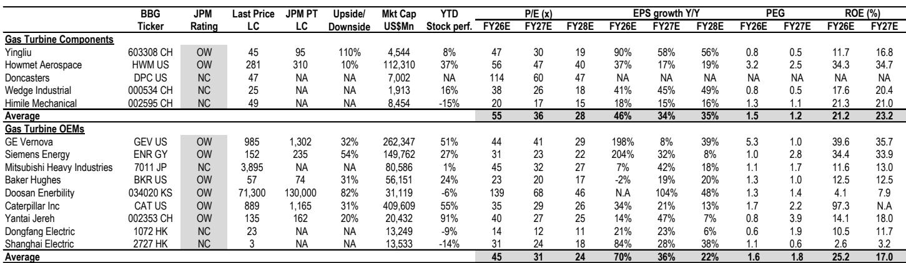

# 市场观察：应流股份与GE Vernova的业务关联分析

两份全球燃气轮机OEM的最新季度数据，为上游热端部件供应商提供了同一方向的信号。GE Vernova在2026年第二季度签署了约20GW的新燃气发电合同，并将全年燃气轮机订单与长期服务协议（SRA）的目标调整为至少125GW（此前为至少110GW）。其燃气轮机积压订单环比增加44GW至53GW，SRA增加56GW至63GW。西门子能源的订单框架同样显示，积压订单正延伸至2027-2028年，定价环境保持稳定。

这两组数据与一家精密铸造企业的关联值得关注。根据市场研究机构的观察，应流股份目前全球燃气轮机叶片市场份额约2%，预计到2030年提升至10%。核心逻辑在于，OEM产能扩张和供应链多元化需求，为上游铸件供应商提供了发展空间。

## 1. OEM订单积压延伸与定价信号一致

GE Vernova在2026年第二季度的更新中提供了几个关键数字。管理层指出，燃气轮机合同数量环比增加100GW至116GW，并设定了年底前至少125GW的目标。更值得关注的是价格趋势：2026年上半年燃气设备订单定价较2025年第四季度水平高出20%以上，2026年下半年定价预计保持在较2025年第四季度提升10-20%的区间。

这份研究认为，OEM产能的增量扩张对上游供应商方向性有利。GE Vernova已勾勒出到2030年实现年产量30GW的路径，主要通过精益生产和现有产能内的增量设备投入。这意味着铸件的产量上限将提升，同时促使供应商的资质认证和采购规划提前。

> **KC评论：** 定价数据比订单量更能反映行业供需状况。如果OEM在产能爬坡阶段仍能维持10%以上的价格提升，说明供需缺口并非短期现象，而是结构性的。这对上游铸件企业的议价能力和利润预期有直接支撑。

## 2. 西门子能源是未来2-3年最关键的客户变量

对于应流股份而言，西门子能源的订单信号可能比GE Vernova更具直接意义。研究指出，西门子能源预计将是未来2-3年最重要的直接客户爬坡来源，其采购量预计增长约10倍。

西门子能源的订单框架显示，积压订单持续延伸至2027-2028年，定价环境在供给逐步增加的情况下依然稳定。应流股份目前已是西门子能源的供应商，但采购规模仍处于早期阶段。随着OEM产能扩张和供应链多元化需求推进，这家铸件企业有望获得更多份额。

## 3. 供给过剩争论与供需平衡的时间窗口

读者对OEM产能扩张是否会在本十年末导致供给过剩存在不同看法。GE Vernova管理层将未来约6年的重工业设备供需描述为“非常平衡”。研究机构提供了更具体的数字：2026年全球供给约64GW，需求约115-120GW；2027年供给约70GW，需求约110-120GW；2028年供给约80GW，需求约110-120GW。到2030年，供给可能达到90GW以上，供需关系逐渐趋紧。

这意味着未来2-3年，积压订单仍将延伸，上游供应商的可见度较高。应流股份2025年燃气轮机收入约10亿元人民币，全球市场份额约2%，但研究认为其发展空间来自OEM多元化采购和自身产能扩张。

## 4. 估值基准与市场定价框架

市场对应流股份的估值方法值得关注。其采用Howmet Aerospace约40倍的2027-2028年平均估值倍数作为关键基准，对应流股份2028年每股收益应用40倍估值倍数。Howmet作为全球领先的航空航天和燃气轮机精密铸件供应商，其估值水平反映了市场对这一领域稀缺资产的结构性认可。

应流股份目前市场定价对应的2028年估值倍数约20倍，与Howmet的40倍存在较大差距。这份研究认为，随着OEM订单延伸和客户爬坡推进，市场定价可能逐步体现其全球市场份额提升的路径。

For informational purposes only. Portions may be generated,translated,summarized,or edited with AI assistance based on source materials and may contain omissions or errors. Please verify independently. This is not investment,legal,tax,accounting,or other professional advice.

For informational purposes only. Portions may be generated,translated,summarized,or edited with AI assistance based on source materials and may contain omissions or errors. Please verify independently. This is not investment,legal,tax,accounting,or other professional advice.

