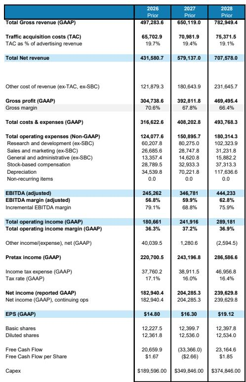
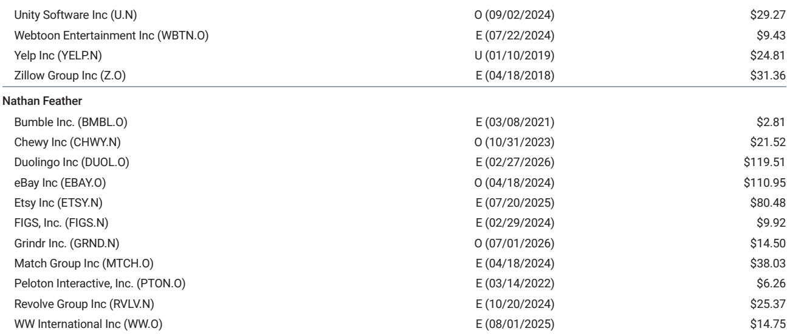
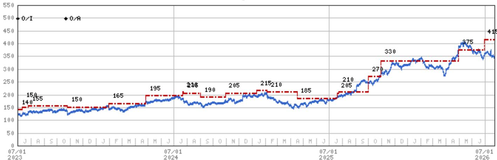

# Google Cloud的资本回报信号清晰，但Alphabet短期盈利路径需要耐心

Alphabet第二季度2026年财报揭示了显著的张力。Google Cloud同比增长82%，环比营收增加47亿美元，并实现了36%的营业利润率，超出市场预期。云积压订单增至5140亿美元，环比增加520亿美元，高于一致预期7%。这些并非渐进式改善，而是代表了GenAI资本支出如何转化为可见且盈利的营收的结构性变化。对于关注大型云基础设施投入资本回报的市场参与者而言，这是目前最清晰的信号。

然而，Alphabet也将2026年资本支出指引上限提高了150亿美元至2050亿美元，分析模型现在预计2027年资本支出将达到3750亿美元。建设未来计算能力的成本增长速度超过了近期营收的增长。结果是2027年每股盈利预期下调，并且依赖于两个尚未证实的催化剂：Gemini 4模型套件的成功发布以及2028年TPU营收机会的可见度提升。

市场参与者面临的战略问题不是Alphabet是否投入足够，而是市场能否容忍一个多年期里投入超过营收增长，同时等待云积压订单和TPU销售承诺的回报。本季度的证据表明答案是肯定的，但前提是管理层能够兑现产品里程碑。

## Google Cloud的118%增长与54%增量利润率显示GenAI资本支出正在产生实际资本回报

本季度最重要的数据点不是相对营收超预期，而是增长与盈利能力的结合。Google Cloud同比增长82%，超过77%的预期，同时实现54%的增量利润率和36%的营业利润率，比预期高出一个百分点。这就是"118法则"——营收增长与利润率之和——这是很少有企业软件业务能达到的规模。它表明GenAI的超大规模模型并非投机建设，而是一个每一美元投入资本都产生递增回报的业务。

5140亿美元的积压订单强化了这一解读。单季度增加520亿美元的积压订单意味着客户正在签订多年合同，而非尝试短期工作负载。这是持久需求。对于比较超大规模公司轨迹的市场参与者而言，这种增长水平给竞争对手带来了战术压力。例如，AWS被建模为34%的同比增长，意味着约40亿美元的环比净营收增量。这种比较并不完美，因为AWS有更大比例的API驱动营收以净额入账，且TPU销售给Google Cloud的总数增加了噪音。但方向性信号清晰：Google Cloud正在GenAI基础设施层获得份额，且该份额的盈利能力正在改善。

## GenAI资本支出与机遇同步扩大，短期盈利与长期能力需权衡

Alphabet将2026年资本支出指引上限提高至2050亿美元，增加了150亿美元，这是由计算能力加速交付推动的，而非组件通胀。分析模型延续了这一轨迹，预计2027年资本支出3750亿美元，2028年4000亿美元。这些并非增量投入，而是两年内资本支出弹性较高，用于建设未来TPU和GPU能力的基础设施，这些能力将在2028年投入使用。

管理层在本季度的语气比一年前对企业和消费者领域的众多GenAI机会明显更加乐观。这种信心，加上纪律性的预算，表明公司看到了清晰的变现路径。但短期会计现实是折旧和运营成本增长快于营收。分析模型显示折旧从2026年的340亿美元增加到2028年的1250亿美元。自由现金流在2027年转为负值，为-680亿美元，模型假设Alphabet将在现在到2027年底之间筹集800亿美元债务来资助建设。

战略含义是市场参与者必须接受多年期盈利增长受压缩，以换取2028年及以后营收能力的阶跃变化。基础情景假设2027年每股盈利15.08美元，2028年18.16美元，这意味着2027年盈利下降后再恢复。这是经典的投入周期模式，但下降幅度大于市场历史上对成熟科技公司的容忍度。

## SPCX租赁协议确认短期需求激增，但成本结构是暂时的

Alphabet与SPCX的租赁协议估计每瓦50美元，提供了一个了解当前需求强度的具体窗口。该协议旨在服务"非常大的云客户"，短期租赁成本高但客户关系的终身价值"高度正向回报"。分析模型基于9月启动和每月9.2亿美元的费率，在第三季度计入约10亿美元运营费用，第四季度30亿美元。2027年第一季度，模型额外计入30亿美元运营费用，假设Alphabet将在12月31日后尽早终止合同，因为任何一方均可提前90天通知取消。

需求激增的背景包括即将推出的由Gemini驱动的Siri AI（秋季发布），以及作为Google Cloud客户的私人实验室持续训练新模型。这不是投机性需求，而是与特定产品发布和客户承诺相关。Alphabet愿意为短期能力支付溢价而不是等待自己的建设上线，表明来自这些客户的营收机会大到足以证明成本的合理性。

市场参与者的关键洞察是这一成本结构是暂时的。管理层将SPCX协议描述为六个月的安排，终止条款让Alphabet能够灵活地转向自己更便宜的计算能力。2026年和2027年初的运营费用逆风是真实的，但并非结构性。它是通往低成本自有基础设施的桥梁，将支撑2028年及以后更高的利润率。

## 评估Alphabet 2028前资金配置逻辑的决策框架

本季度信息可组织为三个维度的决策框架：营收可见度、投入强度、产品催化剂时机。

第一，营收可见度高。5140亿美元的云积压订单提供了Google Cloud营收的多年可见度。TPU机会虽然每吉瓦营收和利润率仍不透明，但估计2027年销售3.5吉瓦，2028年额外4吉瓦，基础情景假设每瓦20美元和20%毛利率。这是一个数十亿美元的营收流，尚未被一致预期定价。

第二，投入强度正在见顶。2027年3750亿美元和2028年4000亿美元的资本支出代表了当前周期的峰值。2027年负自由现金流是这一峰值的函数，800亿美元债务发行的假设是融资桥梁，而非永久资本结构变化。市场参与者应将此与折旧攀升进行比较，折旧到2028年达到1250亿美元，表明自由现金流随着资本支出周期成熟而转为正值。

第三，产品催化剂时机不确定。Gemini 4模型套件（包括高效低成本变体）是关键短期催化剂。管理层表示模型发布节奏加快，随着公司接近Gemini 4，将转向月度发布。2028年TPU机会是中期催化剂，但需要每吉瓦营收和利润率的更大可见度。

资金配置逻辑的风险在于投入周期延长至2028年以后或产品催化剂延迟。不同情景下的估值假设存在较大离散度，最终取决于Alphabet能否证明其GenAI投入产生的回报足以证明资本强度合理。

## 2028年TPU机会仍是Alphabet逻辑中最被低估的要素

分析报告确认Alphabet未将TPU技术许可给第三方，而是建立库存并以毛利率销售。TPU总销售额登记在云积压订单中，并在销售时计入Google Cloud营收。第二季度包含少量第三方TPU销售，但大部分3.5吉瓦的TPU能力预计在2027年实现，另加4吉瓦估计在2028年。

会计处理很重要。TPU销售不是具有高增量利润率的许可版税流，而是具有库存积累、毛利率和营运资金需求的产品业务。基础情景假设每瓦20美元和20%毛利率意味着2027年3.5吉瓦的TPU销售将产生约700亿美元营收和140亿美元毛利润。这是对Google Cloud营收基础的重大补充，尚未反映在一致预期中。

风险在于利润率假设过于乐观或每吉瓦营收低于模型。分析承认这些是需要进一步分析的假设。但机会方向明确。Alphabet正在构建一个定制芯片业务，服务于自身内部工作负载和外部云客户。如果利润率结构维持，2028年TPU营收流可能为每股盈利增加数美元，而这些未在当前估计中。

市场参与者的启示是2027年每股盈利下降可能是为2028年比市场预期更大的盈利恢复付出的代价。在产品催化剂实现且TPU机会发挥潜力时，基础情景中的上行空间是可能达成的。但路径需要耐心，经历投入上升和利润率压缩的时期。

*仅供参考。部分内容可能基于源材料由AI辅助生成、翻译、总结或编辑，可能存在遗漏或错误。请独立核实。这不构成专业建议。*

仅供参考。部分内容可能基于源材料由AI辅助生成、翻译、总结或编辑，可能存在遗漏或错误。请独立核实。这不构成专业建议。

