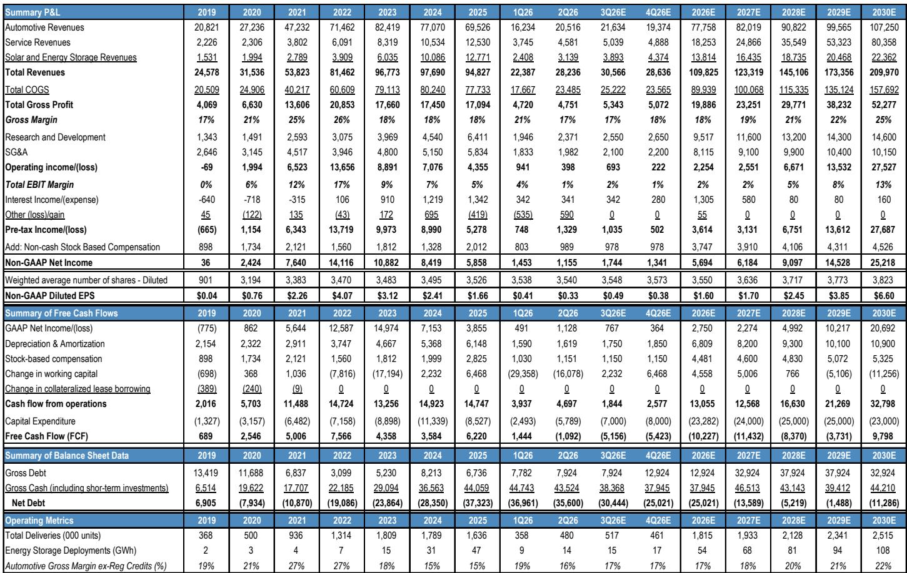
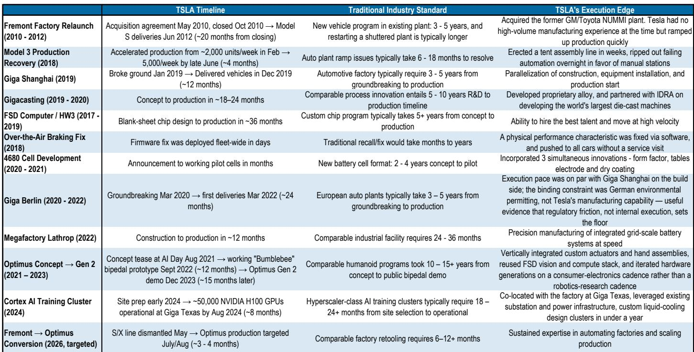
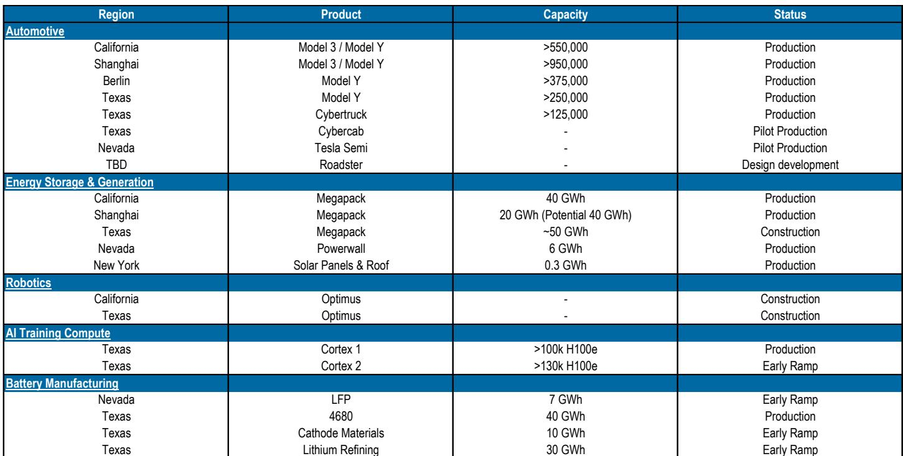

# JPM：特斯拉业务与近期数据观察

特斯拉2026年第二季度财报的核心观察在于：当期财务数据低于市场普遍预期，但两项关键指标——FSD订阅渗透率与无人驾驶Robotaxi累计里程——均呈现加速趋势。这份JPM研报认为，短期财务表现的不确定性主要来自毛利率端的多重影响，而FSD正在从技术选项转变为购车决策中的重要因素，Robotaxi的规模化验证也在推进。财务表现的变化可能需要较长时间才能显现，但支撑公司报价下沿的因素正在积累。

二季度调整后每股收益0.33美元，低于JPM预期的0.60美元和共识预期的0.55美元。营收282亿美元基本符合预期，但EBIT仅3.98亿美元，低于JPM预期的16.19亿美元。毛利率是主要观察项：不含监管积分的汽车毛利率为16.3%，低于JPM预期的19.5%。报告指出，若剔除一季度非经常性保修回拨和关税利好，该毛利率环比持平，说明定价和成本纪律并未出现明显变化。影响来自监管积分收入下降、利率补贴成本上升、商品通胀以及储能业务的一次性保修调整。

> **KC评论：** 毛利率环比持平这个细节容易被忽略。市场看到的是16.3%低于预期，但报告认为剔除一次性因素后并未出现变化，这意味着二季度的销量增长（交付量同比增25%）并非完全靠降价驱动，FSD对需求的拉动开始显现。

## 1. FSD订阅用户环比增长，每用户月度行驶里程加速

FSD正在成为特斯拉的购车需欢迎交流点。报告显示，北美地区FSD渗透率已升至约55%，高于一季度管理层给出的30%-35%参考区间。活跃FSD订阅用户从一季度的约130万增至约150万。更值得关注的是每用户月度行驶里程的加速：3月初至4月初，累计FSD行驶里程增加约5亿英里，对应每用户月均约390英里；而6月下旬至7月下旬，该数字增至约8亿英里，对应每用户月均约540英里。报告认为，这反映了FSD可靠性和功能性的持续提升。FSD收入结构也在变化，随着今年早些时候停止一次性买断选项，订阅收入占比正持续上升。

## 2. 无人驾驶Robotaxi里程周环比增长超10%，安全记录保持零事故

Robotaxi的规模化进展是这份报告另一个关键参考点。截至二季度，特斯拉在六个城市和两个州累计完成超过38万英里无人驾驶里程，未发生任何值得注意的事故。自2026年1月以来，无人驾驶里程周环比增速超过10%。报告强调，特斯拉当前策略是“里程优先于车辆数量”，这意味着即使车队规模不大，通过接近连续运营也能产生大量里程数据。Cybercab已在德州超级工厂投产，年产能超过12.5万辆，但短期内车队数量仍受限于新底盘自身的校准里程积累。报告认为，当前规模化的核心约束是可靠性，而非需求或监管。

## 3. 2026年资本开支指引维持250亿美元以上，自由现金流持续为负

特斯拉重申2026年资本开支超过250亿美元，二季度资本开支58亿美元，环比增长约132%。自由现金流为负11亿美元。报告指出，公司正在机会性地获取债务融资工具，提供最多300亿美元的增量借款能力以支持研究。资本开支投向包括Robotaxi车队、Optimus人形机器人、半导体工厂、太阳能和AI算力。管理层预计，随着垂直整合和算力基础设施研究开始产生回报，回报曲线将呈现非线性特征。

## 4. Optimus供应链建设推进，储能毛利率回归常态

Optimus人形机器人方面，弗里蒙特产线正在安装，早期产品将用于“Optimus学院”以构建训练数据飞轮。报告特别提到，供应商正在与特斯拉共同建设本土人形机器人供应链，三星、台积电和松下被点名。储能业务方面，二季度部署13.5 GWh，同比增长41%，但毛利率从一季度的39.5%降至约20.4%，主要受约2.4亿美元的电池保修调整和一季度约2亿美元非经常性收益的影响。报告认为，随着工业储能市场竞争环境变化，长期毛利率目标已调整至20%-25%区间。

这份报告的核心观察框架可以概括为：短期财务表现与长期投入之间的张力在二季度达到一个阶段性高点。FSD渗透率和Robotaxi里程的加速是支撑长期叙事的关键数据点，但财务表现的变化需要等到较长时间之后，届时Robotaxi、Cybercab和Optimus的规模化效应才可能开始在财务数据中体现。对于关注特斯拉的读者而言，当前阶段可跟踪的指标包括FSD每用户里程增速、Robotaxi城市扩张节奏以及Cybercab产量爬坡曲线。

For informational purposes only. Portions may be generated,translated,summarized,or edited with AI assistance based on source materials and may contain omissions or errors. Please verify independently. This is not investment,legal,tax,accounting,or other professional advice.

For informational purposes only. Portions may be generated,translated,summarized,or edited with AI assistance based on source materials and may contain omissions or errors. Please verify independently. This is not investment,legal,tax,accounting,or other professional advice.

