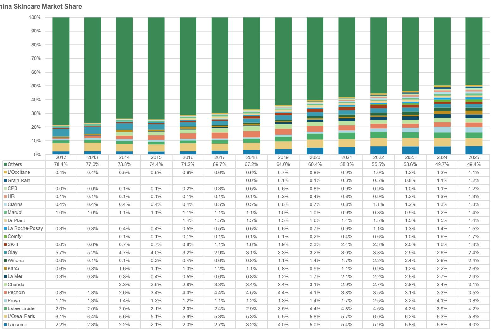
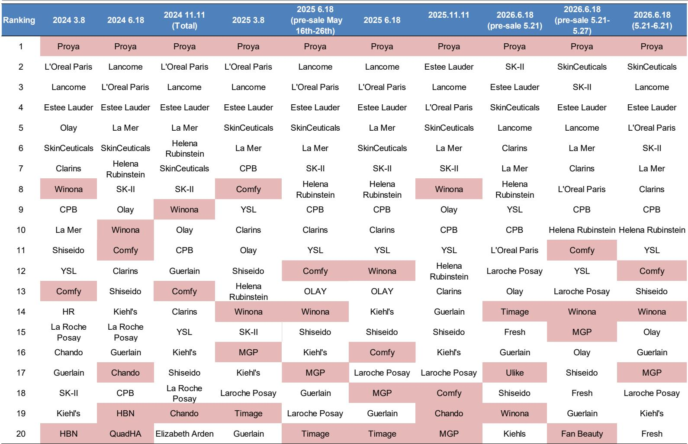
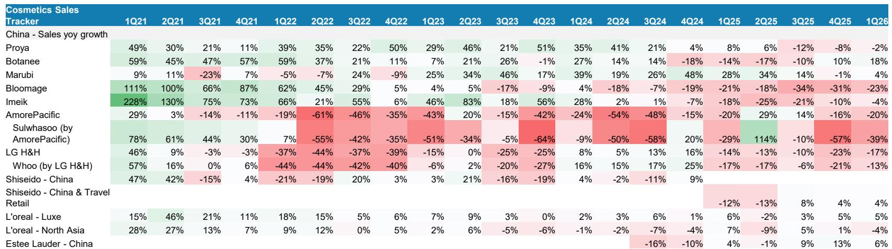

# 亚洲美妆市场的结构性变化：份额重塑比总量增长更值得关注

中国美妆市场已不再是一个单一的增长故事。从2026年上半年数据来看，整体品类呈现增长趋稳的特征：据国家统计局数据，化妆品零售额增速从2021年的两位数增长下降至低个位数，两年平均增速逐步收窄。然而在这表面增速之下的结构性调整，正在清晰地分出不同品牌的发展路径。关键洞察并非市场规模在缩小——而是份额的竞争已从获取新需求转向替代现有品牌，而那些在此过程中表现突出的公司，往往同时掌握了天猫高端和抖音大众市场的渠道能力。这并非周期性波动，而是一种价值创造方式的长期转变。

这一变化意义重大，因为市场体量依然可观。中国护肤品市场零售价值超过500亿美元，“其他”类别（包含数百个中小品牌）的份额已从2012年的78.4%收窄至2025年的49.4%。这约29个百分点的份额转移，意味着大约150亿美元的年收入重新分配给了头部品牌。对于观察者而言，问题不再是市场能否恢复15%的增长，而是哪些公司能在下一轮份额调整中有所斩获。从数据来看，答案指向一批已建立可复制的渠道拓展和消费者品牌忠诚度构建模式的中国本土品牌，而许多传统国际品牌则面临结构性挑战。

## 品类增速趋稳，但份额调整正在加速

总体数据呈现清晰的趋势。中国化妆品零售额同比增速从2021年平均超过20%，到2025-2026年已降至低个位数。两年平均增速（一种更稳定的衡量方式，消除了疫情扰动）从2022年初约15%压缩至2026年中接近零。这并非需求萎缩——化妆品销售额相对值仍明显高于2019年水平，如报告指数图所示——但这无疑是市场成熟期的信号。品类扩张的早期红利已经消退。

更值得关注的是总量之下的结构性变化。中国护肤品市场“其他”类别的份额自2020年以来每年约下降1.5至2个百分点，但在2023年至2024年期间，这一速度加快至近4个百分点。这意味着少数品牌正在以加速的步伐从分散的长尾市场中吸收份额。受益者并非随机分布。珀莱雅从2019年的边缘品牌，成长为2024年至2026年中所有重大购物节期间天猫护肤品类第一名。其市场份额从2012年的不足1%上升至2025年约3-4%，仅份额增长一项的年复合增速就达约20%。与此同时，华熙生物在2021年一季度实现了111%的超高速增长后，其功能性护肤品业务到2025年上半年同比收缩超过50%。这种分化并非偶然——它反映了在渠道掌控和品牌定位上的结构性优势。

## 本土品牌在渠道竞争中取得进展，国际品牌仍在适应变化

数据中最显著的变化之一，是中国本土品牌与国际高端品牌在渠道力量上的对比。在天猫这个高端美妆的主要平台上，中国品牌自2024年初以来已在每个重大购物节占据榜首。珀莱雅连续六次重大活动（2024年和2025年的3.8、6.18和11.11，以及2026年6.18预售）位居第一。相比之下，巴黎欧莱雅、兰蔻和雅诗兰黛这些在2022年和2023年初占据前三的品牌，已下滑至第二至第四位。在抖音上，这一格局更为明显：中国品牌韩束和珀莱雅自2024年初以来在每次重大购物节中均占据前两位，前十名现在以自然堂、谷雨、可复美等本土品牌为主。雅诗兰黛和赫莲娜等国际品牌仅出现在抖音排名中部。

这并非促销时机的巧合。它反映了两类品牌在应对中国数字生态系统时的根本差异。本土品牌已建立整合团队，将天猫、抖音和快手作为主要渠道进行管理，而非次要分销渠道。它们投资于直播基础设施、算法驱动的产品展示和基于实时消费者反馈的快速SKU迭代。相比之下，国际品牌历史上将这些平台视为百货公司和专卖店渠道的营销延伸。报告的进口数据印证了这一点：自2023年中以来，化妆品进口量同比持续下降，进口平均售价也有所压缩，表明国际品牌正在通过折扣维持销量。进口产品的单位包装规格没有明显变化，排除了品类结构变化的解释。核心问题在于，国际品牌在实体和数字货架上，正被更了解平台算法的本土竞争对手占据空间。

## 日韩美妆品类面临结构性调整，而非周期性波动

数据中表现较为明显的调整来自韩国和日本美妆品牌。爱茉莉太平洋在中国市场的销售额在过去21个季度中有14个季度为负增长，2022年和2024年多个季度降幅超过50%。其高端品牌雪花秀表现更为明显，多个季度销售额下降50-60%。LG生活健康的后品牌，曾占据高端定位，自2025年初以来每个季度增长均为负。资生堂在中国和旅游零售业务的增长，从2021年初的47%到2024年以来在低个位数增长和低个位数下降之间波动。

这些并非单纯由消费者情绪或地缘因素导致的暂时下滑。结构性问题在于，韩国和日本品牌在中国市场的定位建立在高端形象之上，依赖旅游零售、百货专柜以及“日本品质”或“韩妆创新”的光环效应。旅游零售在疫情期间受到冲击，且尚未恢复到2019年前水平，进口数据也显示这一点。百货商场客流量已被电商永久性侵蚀。而光环效应已被对本土品牌日益增长的信任所取代，这些本土品牌现在以更具竞争力的价格和更好的数字互动提供相近品质。报告销售追踪显示，即使韩国品牌尝试恢复——例如雪花秀在2025年二季度出现114%的增长峰值——这种恢复并未持续，随后几个季度增长再次转负。这一模式表明，促销带来的提升并未转化为重复购买或品牌忠诚度。

## 评估框架：识别下一阶段美妆品牌发展潜力的三个维度

对于评估亚洲美妆公司的观察者而言，数据指向一个清晰的三步评估框架。第一个维度是渠道覆盖：该品牌是否在重大购物节期间同时进入天猫和抖音的前五名？如果品牌仅在一个平台表现强劲，则存在渠道依赖风险。例如，珀莱雅在多个购物节的护肤品类中均位居天猫和抖音第一。韩束在抖音护肤品中排名第一，但未进入天猫护肤品前二十名，这可能意味着对单一平台的结构性依赖，如果抖音算法或费率结构发生变化，可能成为弱点。第二个维度是份额趋势：该品牌的护肤品市场份额在两年滚动基础上是否在增长？份额持续上升的品牌，如珀莱雅、丸美（从2021年的0.9%上升至2025年的1.4%）和可复美（从2019年的0.1%上升至2025年的1.7%），已证明即使在平稳市场中也能获得份额。份额下降的品牌，如华熙生物（其功能性护肤品在2025年上半年收缩超过50%）以及大多数韩国和日本品牌，则处于调整过程中。

第三个维度是进口依赖：该品牌在中国市场的收入是否依赖进口产品或旅游零售？进口数据显示，自2023年中以来，中国化妆品进口量和价值均持续下降，2024年初以来多数月份进口量增长为负。在中国本土制造的品牌在响应趋势方面具有成本和速度优势。珀莱雅、丸美和可复美均为本土制造。相比之下，资生堂、爱茉莉太平洋和雅诗兰黛均依赖进口产品，这使其面临关税风险、供应链延迟以及无法基于抖音或天猫数据快速迭代SKU的制约。一个在三个维度均表现稳健的品牌——在两个主要平台均表现强劲、份额持续上升且本土制造——更有可能在下一阶段份额整合中有所作为。而在两个或更多维度上表现不足的品牌，无论整体市场增速如何，都可能继续面临挑战。

## 高端市场并未消失，但其重心已转向功能定位和医学级产品

对于本土品牌崛起的常见误解是中国消费者转向更便宜的产品。数据并不支持这一观点。高端护肤品市场，以海蓝之谜、赫莲娜和修丽可等品牌为代表，在天猫排名中依然稳健。海蓝之谜自2024年以来在每次重大购物节中均位列前六。修丽可从2024年初的第六位上升至2026年6.18预售的第二位。赫莲娜稳定在前十。区别在于，这些高端品牌在功能和医学级定位上表现突出，而非依赖传统或原产地光环。修丽可，欧莱雅旗下医学级护肤品牌，其份额增长正是基于临床功效和皮肤科医生推荐的价值主张，而非法式奢侈品定位。相比之下，依赖日本或韩国美妆传统高端形象的历史品牌，如资生堂和雪花秀，则有所调整。

这一变化对医疗美容领域有直接影响，包括注射类、器械类和功效护肤品。报告对爱美客（中国领先的玻尿酸注射品牌）的销售追踪显示，其销售增速从2021年初超过200%放缓至2025年一季度负增长。这并非品类萎缩，而是需求释放和产品上市初期的超高速增长后的正常化。更有意义的信号是华熙生物，其功能性护肤品业务在2022年上半年增长77%后，到2025年上半年收缩超过50%。华熙生物主要是玻尿酸原料供应商，其品牌护肤品业务未能建立持久的消费者忠诚度。启示在于，单纯的功能性宣称是不够的；必须有一个能在数字渠道维持重复购买的品牌。在高端与医学交叉领域表现突出的品牌——修丽可、理肤泉和薇诺娜（中国功效护肤品牌）——均在天猫和抖音有较强存在，并投入医生背书和临床数据营销。

## 购物节数据揭示：促销节奏已成为一种竞争壁垒

购物节排名不仅是营销现象；它是衡量决定全年成功的运营能力的指标。报告详细列出了从2024年初到2026年中九次重大购物节期间天猫和抖音的排名，显示头部品牌的稳定性令人瞩目。珀莱雅在每次购物节都无一例外地保持天猫护肤品首位。韩束在抖音护肤品排名中也保持首位，直到最近一次2026年6.18下降至第六位。这种一致性并非偶然。它反映了在库存规划、算法优化、直播人才管理和定价架构方面的投入，使这些品牌能够在集中的促销窗口期内精准执行，而这些窗口期在年度收入中占据重要份额。

相对应的，排名波动较大的品牌——如雅诗兰黛，从2024年初天猫第四位到2025年底的第二位，或资生堂，排名曾低至第十八位——尚未建立在该环境下持续获胜所需的可重复运营能力。促销日程已成为竞争壁垒，因为同时在管理天猫、抖音和快手不同折扣结构、直播时间表和库存分配方面的运营复杂性，超出了那些将这些平台视为战术而非战略渠道的品牌的能力。数据显示，各平台前三名品牌在购物节之间高度一致，而前二十名后半部分变动较大。这表明头部梯队已达到一种运营规模，对后来者而言越来越难以复制。

*仅供参考。部分内容可能基于原始资料通过AI辅助生成、翻译、总结或编辑，可能存在遗漏或错误。请独立核实。本文不构成任何专业建议。*

仅供参考。部分内容可能基于原始资料通过AI辅助生成、翻译、总结或编辑，可能存在遗漏或错误。请独立核实。本文不构成任何专业建议。

