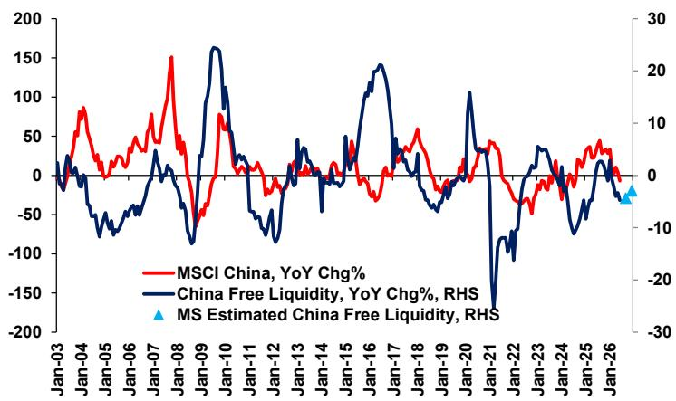

# 中国市场流动性的周期底部：修复路径或比预期温和

中国市场的自由流动性——即剔除通胀和实际经济活动后可用于驱动市场表现的现金——已降至2025年5月以来的最低水平。MSCI中国指数的历史走势与这一指标高度同步，使当前低点成为观察资金环境的重要信号。但真正的关注点不在低点本身，而在于修复路径的形态与节奏。

自由流动性指标定义为M1增速减去生产者价格指数（PPI）增速再减去工业产出（IP）增速。2026年上半年，该指标出现明显收缩。三股力量共同作用：M1扩张温和、PPI因前期商品周期成本压力而维持较高水平、工业产出超预期增长吸纳了较多可用信贷。结果便是，当前资金环境比整体货币政策基调所显示的更为紧张。

值得留意的是，周期低点并不必然触发快速、强劲的反弹。2026年6月的读数很可能标志着本轮PPI增速的周期峰值，这消除了一个阻力。下半年预算内债券发行将加速，为资金注入提供财政渠道。这些因素都指向年底前逐步改善。然而，修复仍将受到一个结构性因素的制约——在宏观环境尚未真正重获动能之时，企业的借贷意愿偏于审慎。

这并非2022年后那轮资金潮的重复——当时宽松政策、全球再通胀协同和企业补库带动市场显著反弹。当前市场面临的是资金环境的正常化，更像缓慢爬坡而非V形回升。理解这一爬坡的机制，以及它更青睐哪些领域和策略，是观察中国市场的重要课题。

## 自由流动性指标历来是MSCI中国回报最可靠的前瞻信号

在中国，自由流动性与市场表现之间的关系并非松散相关，而是经过实证验证的紧密机制。报告图表将自由流动性指标与MSCI中国指数同比变化进行对比，两者在多轮周期中几乎同步运行。当自由流动性上升时，市场随之走高；当它收缩时，指数通常出现回调或横盘。

这并非巧合。自由流动性捕捉的是真正"自由"的资金量——即未被通胀消耗、也未被实际产出吸纳的部分。M1增速代表可用于交易和投资的狭义货币供给。减去PPI，移除了仅用于补偿投入成本上升的那部分货币；减去IP增速，移除了被实体经济扩张吸纳的部分。剩下的便是可流向金融资产（包括权益资产）的资金池。

当前读数处于2025年5月以来新低，意味着这个池子已明显缩小。依赖流动性驱动的读者可将其视为对整体敞口保持审慎的信号。但该指标的预测能力同样适用于反向：当预期中的下半年改善得到确认时，低点本身历史上也曾是关注后续进展的窗口。问题不在于是否参与市场，而在于当修复来临时如何布局。

## 6月PPI峰值消除一个关键阻力，但通胀回落速度决定流动性改善快慢

自由流动性计算中最重要的机械性变化是PPI的走势。报告将2026年6月视为本轮生产者价格通胀的周期峰值。若此判断成立，PPI将在未来数月开始回落，这将在M1和IP增速不变的情况下机械性改善自由流动性。PPI下降意味着更大比例的货币供给真正可用于金融资产配置，而非被上升的投入成本消耗。

但通胀回落的速度至关重要。PPI快速下降——受商品价格下跌或需求疲软驱动——将迅速提振自由流动性，并可能引发市场重新定价。缓慢、渐进的回落则只会带来边际改善，使资金环境持续偏紧。报告的描述暗示后者更可能：改善被描述为"逐步"而非"快速"，整体资金环境预计仍将"相对偏紧"。

对观察者而言，这意味着流动性驱动的整体市场反弹在第三季度不太可能显现。改善是真实但渐进的，这更支持选择性、聚焦优质标的的思路，而非对整体市场的全面押注。受益于投入成本下降的领域——如下游制造和消费类公司——可能在整体流动性状况好转之前率先获得利润改善。

## 下半年财政债券发行注入流动性，但无法弥补企业借贷意愿的不足

2026年下半年预算内债券发行的加速是一个具体的政策手段，将增加自由流动性。财政支出通过债券发行融资，资金流入银行体系，再通过项目支付、转移支付和采购进入实体经济，从而增加M1。这是一个不依赖银行放贷意愿或企业借贷意愿的直接渠道。

然而报告明确指出，尽管有这一财政注入，整体自由流动性仍可能保持"相对偏紧"。原因在于需求端。在仍待观察的宏观背景下，企业借贷意愿偏于温和。当需求可见度较低、利润空间承压时，企业并不急于为扩张、补库或资本开支承担新债务。

这形成了不对称的流动性格局：流动性的供给端——政策驱动的财政注入——正在改善。但需求端——企业借贷并配置资本的意愿——尚未恢复。结果是自由流动性的改善将集中在公共部门和国有相关实体，而私营部门流动性仍受制约。对于市场参与者而言，这指向一个分化格局：政策敏感领域如基础设施、绿色能源和国有企业受益更多，而以内需为主的私营企业在融资和经营条件方面面临更慢的修复。

## 可借助三大因素框架观察流动性周期

与其将自由流动性指标视为简单的"在底部"或"在顶部"的二元信号，不如将其嵌入一个结构性观察框架，考虑驱动它的三个因素：货币流通速度、价格动态和实际活动。每个因素对配置思路都有不同含义。

第一，货币流通速度由M1增速捕捉。当M1加速时，意味着资金从储蓄转向交易和投资，这有利于周期性板块、小市值公司和高弹性标的。当M1减速——如当前状态——防御性板块和大市值优质标的表现更稳。目前M1轨迹温和，值得在流通速度回升前保持相对稳健的倾向。

第二，价格动态由PPI捕捉。PPI下降有利于下游利润和消费类公司，PPI上升则利于商品生产商和上游行业。随着PPI见顶，优势平衡将从资源领域转向投入品消耗者。这是一个独立于整体流动性水平的板块轮动信号。

第三，实际活动由IP增速捕捉。强劲的工业产出并不必然利好市场；在自由流动性框架中，它反而减少了可用于金融资产的资金池，因为更多信贷被生产活动吸纳。当IP增速较高时（如当前），资金环境比货币总量指标所显示的更为紧张。可以关注IP增速放缓作为自由流动性改善的正面信号——即使初看起来对实体经济可能显得不乐观。

应用这一框架至当前环境，可以得到清晰的倾向：关注下游制造、消费领域以及政策驱动的基建方向，而非上游商品生产商；在M1显示持续加速之前，对持仓期限和估值保持稳健。流动性修复将会到来，但它是渐进的、选择性的，并取决于这三个因素的相互作用，而非单一政策动作。

*本文仅为信息参考，部分内容可能基于源材料由AI辅助生成、翻译、摘要或编辑，可能存在遗漏或错误，请独立核实。本文不构成任何专业建议。*

本文仅为信息参考，部分内容可能基于源材料由AI辅助生成、翻译、摘要或编辑，可能存在遗漏或错误，请独立核实。本文不构成任何专业建议。

