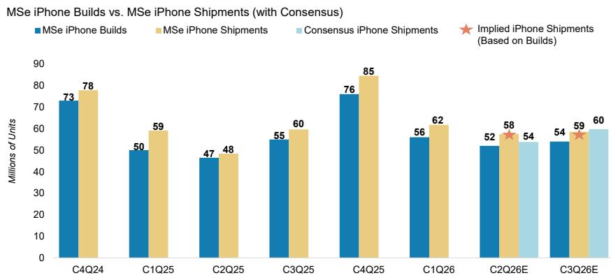
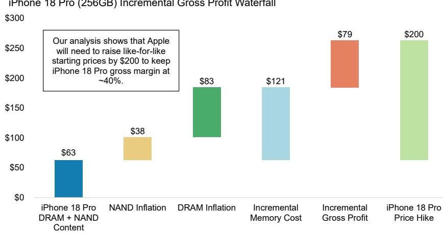
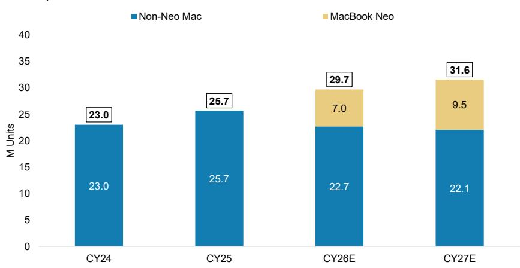
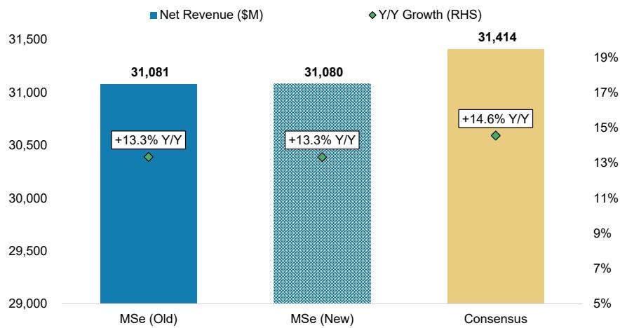
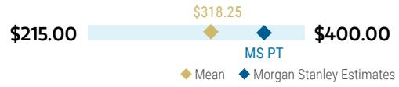
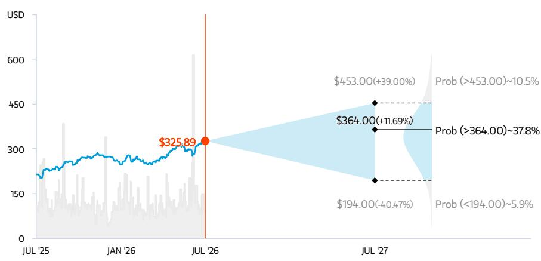
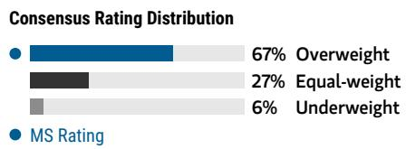
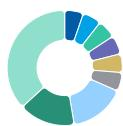
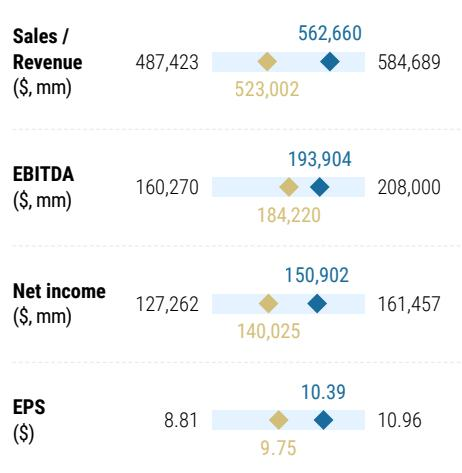

Apple, Inc. | 北美

# F3Q26 业绩前瞻 – 市场已提前反映6月季度稳健表现/9月指引

<table><tr><td colspan="3">变化概览</td></tr><tr><td>Apple, Inc. (AAPL.O)</td><td>此前</td><td>当前</td></tr><tr><td>目标参考</td><td>$360.00</td><td>$364.00</td></tr></table>

我们预计6月季度小幅超预期，9月季度指引隐含营收/每股回报高于市场共识，但毛利率低于市场共识，主要受iPhone出货及定价上调推动，但成本也有所上升。服务和毛利率指引是本次季度关键。当前公司报价对应约32倍估值倍数，这一情形已基本被市场定价。

## 关键要点

6月季度iPhone营收应略超市场预期（同比+22%），受渠道补货及出货量同比增长19%推动。

\- 9月季度情形较为复杂——市场仍低估产品定价上调空间，因此我们预期营收指引将偏高……

……但我们对9月季度的毛利率预估为46.8%（市场共识47.4%），意味着毛利率指引可能偏低（但与买方预期基本一致）。

此外，我们对6月/9月季度的服务增长预估较市场共识低50-130个基点，考虑到App Store增速放缓，这一预测偏保守。

\- 我们对12个月前景保持正面看法（目标参考$364），但战术上不预期发布后短期内会有明显跟随，除非我们对服务/毛利率的预估过于保守。

苹果的基本面依然扎实，但公司报价接近历史高点，当前业绩发布前的战术环境偏中性/更具挑战性，需要各个方面均无瑕疵。我们继续认为苹果基本面强劲，未来6-18个月多项提价有望推动营收和每股回报上行。以新FY27营收和每股回报预估$563B和$10.39为例，分别较此前预测高约1%、较市场共识高7-8%，这反映了我们纳入了更高的产品均价（部分被轻微下降的出货量抵消）。然而，当前报价对应32倍FY27每股回报（以及34倍市场共识FY27每股回报），仅比苹果历史估值峰值低几个倍数，表明市场整体预期也处于类似高位。展望下周的F3Q业绩，我们预计6月季度业绩和9月季度指引将体现这一动态——营收增长高于市场，但毛利率表现不一，不过仍将推动每股回报高于市场共识。但有两点我们视为近期风险：（1）6月季度服务增长，我们比市场低130个基点，因App Store表现偏弱；（2）9月季度毛利率指引，我们比市场低60个基点，因对近期部件成本通胀影响持更保守看法。如果这两项是次要指标，我们会认为战术环境偏积极（因每股回报有望超预期）。但这两个指标对估值重新定价至关重要，意味着下周的发布/指引必须完美无瑕才能获得正面反应。因此，我们认为在苹果近期持续表现后，战术环境更偏中性。

首先，强劲的6月季度iPhone出货表明苹果补充了渠道库存，支撑了健康的iPhone背景。我们预计6月季度iPhone营收超过$54B（同比+22%），出货量同比增长19%，归因于苹果执行了计划中的渠道补货。回顾苹果在3月季度退出时"渠道库存非常低"。结合6月季度中国区iPhone销售偏软，我们认为6月季度末渠道库存已恢复到更健康的水平。展望下半年，我们的供应链调研并未指向iPhone build有任何显著变化，尽管近期有新闻报道暗示潜在削减，而7月至今中国区销售已明显改善至同比两位数增长（图表1）。对于9月季度，iPhone build为5400万部（环比+4%），低于典型的季节性环比增幅+26%，我们将其归因于：（1）折叠iPhone的爬坡节奏已被充分预期；（2）iPhone发布日程错开（图表2）。但build仍意味着9月季度出货超过5800万部，与我们的略降后的5850万部预判基本一致。

图表1：9月季度build为5400万部（环比+4%），低于季节性+26%的环比增幅，因iPhone产品发布日程错开

<table><tr><td></td><td>1Q23</td><td>2Q23</td><td>3Q23</td><td>4Q23</td><td>2023</td><td>1Q24</td><td>2Q24</td><td>3Q24</td><td>4Q24</td><td>2024</td><td>1Q25</td><td>2Q25</td><td>3Q25</td><td>4Q25</td><td>2025</td><td>1Q26</td><td>2Q26e</td><td>3Q26e</td></tr><tr><td colspan="19">iPhone Builds（单位：百万部）</td></tr><tr><td>iPhone SE3 / SE 5G / 16e</td><td>1.0</td><td>2.5</td><td>5.0</td><td>3.0</td><td>11.5</td><td>1.0</td><td>2.0</td><td>5.0</td><td>3.0</td><td>11.0</td><td>4.0</td><td>9.0</td><td>4.0</td><td>1.0</td><td>18.0</td><td>2.0</td><td>10.0</td><td>8.0</td></tr><tr><td>……（其余数据行保留原样）</td><td></td><td></td><td></td><td></td><td></td><td></td><td></td><td></td><td></td><td></td><td></td><td></td><td></td><td></td><td></td><td></td><td></td><td></td></tr><tr><td>Total Builds</td><td>54.0</td><td>41.0</td><td>50.0</td><td>75.0</td><td>220.0</td><td>48.0</td><td>39.0</td><td>54.0</td><td>73.0</td><td>214.0</td><td>50.0</td><td>46.5</td><td>55.0</td><td>76.0</td><td>227.5</td><td>56.0</td><td>52.0</td><td>54.0</td></tr><tr><td>同比增速</td><td>0%</td><td>-9%</td><td>0%</td><td>-3%</td><td>-3%</td><td>-11%</td><td>-5%</td><td>8%</td><td>-3%</td><td>-3%</td><td>4%</td><td>19%</td><td>2%</td><td>4%</td><td>6%</td><td>12%</td><td>12%</td><td>-3%</td></tr><tr><td>环比增速</td><td>-30%</td><td>-24%</td><td>22%</td><td>50%</td><td></td><td>-36%</td><td>-19%</td><td>38%</td><td>35%</td><td></td><td>-32%</td><td>-7%</td><td>18%</td><td>38%</td><td></td><td>-26%</td><td>-7%</td><td>4%</td></tr></table>

来源：MS估算

图表2：我们预计6月季度出货5750万部，与build隐含的5750万部一致，但比市场共识高约400万部；而9月季度出货预判5850万部，现已基本与build隐含水平对齐，比市场共识低120万部

  
来源：IDC、FactSet、MS估算

与此同时，我们的调研继续支持CY26 iPhone产量预判大体不变，但我们略微下调出货量以反映因定价上调带来的需求弹性。最新供应链工作继续指向CY26 iPhone build约2.65亿部，与先前调研基本一致，且未看到台积电晶圆订单减少的证据。不过，苹果通常根据"乐观情形"的需求场景向供应商传达计划，并常在10月中下旬根据发布后销售趋势调整订单。我们在模型中纳入了iPhone 18更显著的定价上调（直接对比起售价上调$200，此前假设$100），因此将CY26 iPhone出货预判从2.52亿部微调至约2.50亿部——低于当前市场共识2.55亿部（图表3），但将均价上调3%。我们认为，市场在9月季度及整个CY26并未充分反映：（1）iPhone 18直接对比起售价更显著的上调；且/或（2）iPhone发布日程错开——今年9月推出3款高端机型，明年3月推出3款低端机型。这意味着我们的9月季度iPhone营收预判远高于市场（8%），但12月季度低于市场（-5%），因我们纳入了更低的出货量但更高的均价。

iPhone 18 Pro (256GB) 增量毛利润瀑布图 $300

图表3：为保护iPhone毛利率，我们估计苹果需将iPhone 18 Pro起售价上调$200  
  
来源：公司数据、IDC、MS估算

其次，Mac上行空间似乎受供给限制，导致我们的出货预判小幅下调，但对整体业绩影响不大。Mac交货期在6月季度延长，需求超过供给，尤其是Mac mini、Mac Studio和MacBook Neo，主要由于先进节点SoC供应有限。因此我们分别将6月和9月季度Mac出货预判下调11%和8%，以反映供给瓶颈以及6月提价后的部分需求弹性（图表4）。即便如此，我们的调研仍显示苹果正在加大下半年MacBook Neo产量，产出可能达到800-1000万部（原计划600-800万部）。纳入更高的Mac定价（以及iPad提价$100-150）后，尽管出货假设降低，我们的9月季度Mac营收预判仍小幅上调1%，反映Mac需求弹性约0.8（iPad约1.0）。

Mac出货拆分  
图表4：我们略微下调Mac出货预判，以反映先进节点SoC供给约束  
  
来源：IDC、MS估算

我们对6月季度服务增长保持保守看法，但9月季度增长应能从近期定价行动中获得一些支撑。我们预计6月季度服务营收同比增长13.3%，低于市场预期的14.6%以及苹果隐含指引约+13.8%（与3月季度16.3%增长"一致"，经调整2.5个百分点的有利外汇影响后；图表5）。主要拖累是App Store表现偏软，开发者营收同比增长3.2%，较3月季度放缓约460个基点。但需要指出的是，App Store增长放缓是近期季度的持续主题，而苹果始终达到或超过整体服务指引。我们的追踪也显示外汇影响基本与指引一致（同比+1.1%，指引+1.0%），同时苹果近期在部分国际市场提高了iCloud+定价，归因于外汇影响。综上，我们的6月季度服务预判基本维持不变，并认为市场共识存在下行风险。

展望未来，我们预计9月季度服务增长仍具韧性，尽管App Store进一步放缓。我们预计服务营收同比增长12.7%，较6月季度放缓60个基点，比市场共识13.2%低约50个基点。虽然App Store趋势继续走软——7月至今开发者营收同比仅增长1.0%（Sensor Tower数据）——但我们估算苹果近期Apple Music提价（个人/学生$1，家庭$3）应贡献约1个百分点的服务增量增长。因此，尽管9月季度同比比较基数比6月季度大约难180个基点，我们仍预计仅放缓60个基点，但仍低于市场共识。

图表5：我们6月季度服务营收比市场共识低130个基点，因App Store营收偏弱

2025年6月季度服务营收预测（$M）

  
来源：公司数据、FactSet、MS估算

## 最后，我们预计本季度的主要讨论将围绕

9月季度毛利率指引。我们认为6月季度毛利率风险不大，预计结果介于指引区间中点48%和高端48.5%之间。这基本是市场共识。然而，我们看到9月季度毛利率存在下行风险——我们预计46.8%，市场预期47.4%。更高的部件成本、更低的低成本部件库存以及有限的提价保护（主要在iPhone上）是我们对9月季度毛利率较为保守的基础，这意味着：虽然历史上9月季度产品毛利率环比+130个基点，但我们的2026年9月季度产品毛利率环比-70个基点。再次强调，我们认为我们的预判与买方预期大体一致，但考虑到毛利率在苹果讨论中的关键地位，即使营收和每股回报超预期，毛利率指引低于共识也会给业绩发布带来战术风险。

综上，我们的6月和9月季度营收预判基本不变——服务和毛利率是我们最关注的领域。6月季度预判略低于市场共识，主要反映供给相关限制，但我们不会对每股回报接近$1.90-1.95（与苹果历史“每股回报惊喜”一致）感到意外。9月季度预判与市场共识相比呈现分化——总营收预判仍比市场高6%，因我们看到iPhone定价上调带来更大上行空间——且我们预计苹果指引的营收将接近我们的估算而非市场共识（图表6）。然而，我们的毛利率低于市场共识，我们预计毛利率指引区间为46.5-47.5%，技术上意味着毛利率指引下移。虽然这两个因素结合仍使我们的9月季度每股回报比市场高5%——这本来是正面结果——但我们注意到，在32倍估值倍数下，且过去4周公司报价已跑赢市场7个百分点，这一“超预期”已提前被定价。因此，我们在12个月维度保持正面看法，新的目标参考为$364——基于35倍新FY27每股回报$10.39——但预计业绩发布后不会有多少后续反应。

图表6：我们的6月和9月季度营收比市场共识高0-6%，主要受iPhone定价强劲推动，每股回报与市场一致至高出5%

<table><tr><td rowspan="2"></td><td colspan="5">F3Q26（6月季度）</td><td colspan="5">F4Q26（9月季度）</td></tr><tr><td>MSe</td><td>MSe（旧）</td><td>差异%</td><td>市场共识</td><td>差异%</td><td>MSe</td><td>MSe（旧）</td><td>差异%</td><td>市场共识</td><td>差异%</td></tr><tr><td>总营收</td><td>108,468</td><td>108,714</td><td>-0.2%</td><td>108,848</td><td>-0.3%</td><td>121,294</td><td>121,542</td><td>-0.2%</td><td>114,699</td><td>5.7%</td></tr><tr><td>同比增速</td><td>15.3%</td><td>15.6%</td><td>-26bps</td><td>15.8%</td><td>-40bps</td><td>18.4%</td><td>18.6%</td><td>-24bps</td><td>11.9%</td><td>644bps</td></tr><tr><td>iPhone</td><td>54,473</td><td>54,207</td><td>0.5%</td><td>53,742</td><td>1.4%</td><td>62,329</td><td>62,581</td><td>-0.4%</td><td>57,911</td><td>7.6%</td></tr><tr><td>均价（$）</td><td>946</td><td>941</td><td>0.5%</td><td>965</td><td>-1.9%</td><td>1,064</td><td>1,017</td><td>4.6%</td><td>947</td><td>12.3%</td></tr><tr><td>出货量（千部）</td><td>57,500</td><td>57,500</td><td>0.0%</td><td>53,797</td><td>6.9%</td><td>58,500</td><td>61,500</td><td>-4.9%</td><td>59,722</td><td>-2.0%</td></tr><tr><td>iPad</td><td>6,649</td><td>6,848</td><td>-2.9%</td><td>7,098</td><td>-6.3%</td><td>7,104</td><td>7,892</td><td>-10.0%</td><td>7,284</td><td>-2.5%</td></tr><tr><td>Mac</td><td>8,092</td><td>8,839</td><td>-8.5%</td><td>8,680</td><td>-6.8%</td><td>9,806</td><td>9,702</td><td>1.1%</td><td>9,365</td><td>4.7%</td></tr><tr><td>穿戴设备</td><td>8,175</td><td>7,796</td><td>4.9%</td><td>7,904</td><td>3.4%</td><td>9,668</td><td>9,106</td><td>6.2%</td><td>9,178</td><td>5.3%</td></tr><tr><td>服务</td><td>31,080</td><td>31,081</td><td>0.0%</td><td>31,414</td><td>-1.1%</td><td>32,387</td><td>32,354</td><td>0.1%</td><td>32,547</td><td>-0.5%</td></tr><tr><td>毛利润</td><td>52,239</td><td>52,268</td><td>-0.1%</td><td>52,339</td><td>-0.2%</td><td>56,811</td><td>56,901</td><td>-0.2%</td><td>54,380</td><td>4.5%</td></tr><tr><td>营业利润</td><td>33,149</td><td>33,179</td><td>-0.1%</td><td>33,401</td><td>-0.8%</td><td>37,161</td><td>37,257</td><td>-0.3%</td><td>35,370</td><td>5.1%</td></tr><tr><td>税前利润</td><td>33,399</td><td>33,430</td><td>-0.1%</td><td>33,451</td><td>-0.2%</td><td>37,316</td><td>37,413</td><td>-0.3%</td><td>35,516</td><td>5.1%</td></tr><tr><td>净利润</td><td>27,721</td><td>27,747</td><td>-0.1%</td><td>27,731</td><td>0.0%</td><td>30,972</td><td>31,427</td><td>-1.4%</td><td>29,412</td><td>5.3%</td></tr><tr><td>每股回报</td><td>$1.89</td><td>$1.89</td><td>-0.1%</td><td>$1.89</td><td>-0.3%</td><td>$2.12</td><td>$2.15</td><td>-1.4%</td><td>$2.02</td><td>4.8%</td></tr><tr><td>毛利率</td><td>48.2%</td><td>48.1%</td><td>8bps</td><td>48.1%</td><td>8bps</td><td>46.8%</td><td>46.8%</td><td>2bps</td><td>47.4%</td><td>-57bps</td></tr><tr><td>产品</td><td>36.8%</td><td>36.7%</td><td>8bps</td><td>36.4%</td><td>37bps</td><td>36.1%</td><td>36.2%</td><td>-2bps</td><td>35.3%</td><td>80bps</td></tr><tr><td>服务</td><td>76.5%</td><td>76.5%</td><td>0bps</td><td>76.3%</td><td>22bps</td><td>76.2%</td><td>76.2%</td><td>0bps</td><td>75.4%</td><td>84bps</td></tr><tr><td>营业利润率</td><td>30.6%</td><td>30.5%</td><td>4bps</td><td>30.7%</td><td>-13bps</td><td>30.6%</td><td>30.7%</td><td>-2bps</td><td>30.8%</td><td>-20bps</td></tr><tr><td>有效税率</td><td>17.0%</td><td>17.0%</td><td>0bps</td><td>17.1%</td><td>-10bps</td><td>17.0%</td><td>16.0%</td><td>100bps</td><td>17.2%</td><td>-19bps</td></tr><tr><td>净利润率</td><td>25.6%</td><td>25.5%</td><td>3bps</td><td>25.5%</td><td>8bps</td><td>25.5%</td><td>25.9%</td><td>-32bps</td><td>25.6%</td><td>-11bps</td></tr></table>

来源：公司数据、FactSet、MS估算

图表7：虽然我们的毛利率预估比市场共识低20-45个基点，但每股回报预判比市场高1-7%，主要受更高的iPhone均价预判推动

<table><tr><td rowspan="2"></td><td colspan="5">FY26E（2026财年）</td><td colspan="5">FY27E（2027财年）</td></tr><tr><td>MSe</td><td>MSe（旧）</td><td>差异%</td><td>市场共识</td><td>差异%</td><td>MSe</td><td>MSe（旧）</td><td>差异%</td><td>市场共识</td><td>差异%</td></tr><tr><td>总营收</td><td>484,702</td><td>485,346</td><td>-0.1%</td><td>478,173</td><td>1.4%</td><td>562,660</td><td>557,504</td><td>0.9%</td><td>520,807</td><td>8.0%</td></tr><tr><td>同比增速</td><td>32.5%</td><td>32.7%</td><td>-18bps</td><td>14.9%</td><td>1,760bps</td><td>16.1%</td><td>14.9%</td><td>122bps</td><td>8.9%</td><td>717bps</td></tr><tr><td>iPhone</td><td>259,065</td><td>259,051</td><td>0.0%</td><td>253,587</td><td>2.2%</td><td>316,581</td><td>308,590</td><td>2.6%</td><td>270,889</td><td>16.9%</td></tr><tr><td>均价（$）</td><td>988</td><td>977</td><td>1.1%</td><td>980</td><td>0.8%</td><td>1,227</td><td>1,152</td><td>6.5%</td><td>1,031</td><td>19.0%</td></tr><tr><td>出货量（千部）</td><td>262,329</td><td>265,329</td><td>-1.1%</td><td>257,473</td><td>1.9%</td><td>258,000</td><td>268,000</td><td>-3.7%</td><td>256,839</td><td>0.5%</td></tr><tr><td>……（其余行保留原样）</td><td></td><td></td><td></td><td></td><td></td><td></td><td></td><td></td><td></td><td></td></tr></table>

来源：公司数据、FactSet、MS估算

AlphaSignals业绩前瞻

<table><tr><td>核心指标</td><td>核心指标惊喜</td><td>对市场共识每股回报的潜在影响*</td></tr><tr><td colspan="3">Apple, Inc. AAPL.O</td></tr><tr><td>9月季度毛利率指引</td><td>— 符合预期</td><td>↑ 小幅上修</td></tr><tr><td colspan="3">*对未来12个月市场共识每股回报的潜在影响来源：公司数据、MS</td></tr></table>

## 风险收益 – Apple, Inc. (AAPL.O)

更高定价、更强盈利潜力，以及催化剂密集的下半年

## 目标参考 $364.00

我们的$364目标参考基于FY27 EV/营收9.2倍倍数，该倍数来自科技和消费平台同行的回归分析。目标参考隐含约35倍FY27每股回报$10.39。

市场共识目标参考分布

来源：Refinitiv、MS

## 风险收益图表及期权隐含概率（12个月）

  
注：— 历史报价走势 ● 当前报价 ◆ 目标参考  
来源：Refinitiv、MS、MS机构股权部门。乐观、基准、悲观情景的概率基于自2026年7月22日期权市场隐含波动率估算。所有数字均为股票在三个月或一年内达到情景价格以上的近似风险中性概率。查看期权概率方法论说明请点击此处

## 积极看法逻辑

随着iPhone换机周期拉长、新AI功能在全球推出、以及设备形态变化再度受到关注，我们相信苹果可以在CY26起加速iPhone增长，换机周期在旧设备安装基础开始升级时达到顶峰。结合持续两位数的服务增长和适度经营杠杆，苹果FY26每股回报可达$8.86，FY27可达$10.39。存储成本动态可能在近期带来不确定性。长期来看，在AI、支付、云、健康、家居方面的投入，以及当前每日每用户支出$1的长期提升空间，是持续增长和价值创造的关键论据。

  
来源：Refinitiv、MS

## 风险收益主题

<table><tr><td>颠覆性创新：</td><td>正面</td></tr><tr><td>新数据时代：</td><td>正面</td></tr><tr><td>定价能力：</td><td>正面</td></tr></table>

查看风险收益主题说明请点击此处

## 乐观情景

$453.00

## 11x EV/营收 FY27；约41倍乐观FY27每股回报$11.02

iPhone换机周期在FY26/FY27加速，机器人成为长期上行因素。消费者需求恢复，iPhone 17升级意愿强于预期且向高端机型转移，推动iPhone营收中十几增长；同时部件成本上升被苹果对消费者和供应链的议价能力缓解。我们的乐观情景估值隐含FY27乐观每股回报的4.1倍估值倍数，其中包含机器人业务每部$22的上行贡献。

## 基准情景

$364.00

9.2x EV/营收 FY27或约35倍FY27每股回报$10.39

服务和毛利率保持韧性，读者开始预期iPhone周期走强。FY27营收同比增长中十几，服务增长10%以上、产品增长近20%。FY27毛利率可能同比下降，因产品营收占比提高及存储成本上升，但苹果通过供应链和重新定价缓解成本影响。iPhone换机周期在FY27再次拉长，因存储涨价导致定价上调带来的需求弹性。

## 悲观情景

$194.00

6.3x EV/营收 FY27；24.6倍FY27悲观每股回报$7.89

iPhone 17周期令人失望，因合成涨价背景下消费者支出减弱超预期。整体组合增长进一步放缓，可支配收入受硬着陆压制，导致FY26产品营收仅个位数增长、服务营收增长减速。营收微增但毛利率收缩，FY26每股回报仅中个位数增长至约$7.36。悲观情景估值隐含24.6倍FY27估值倍数，低于5年均值26.0x，因服务利润占比见顶。

## 风险收益 – Apple, Inc. (AAPL.O)

## 关键业绩输入

<table><tr><td>驱动因素</td><td>2025年9月</td><td>2026年9月e</td><td>2027年9月e</td><td>2028年9月e</td></tr><tr><td>总营收同比增速（%）</td><td>6.4</td><td>16.5</td><td>16.1</td><td>6.7</td></tr><tr><td>iPhone营收同比增速（%）</td><td>4.2</td><td>23.6</td><td>22.2</td><td>6.2</td></tr><tr><td>服务营收同比增速（%）</td><td>13.5</td><td>14.0</td><td>12.5</td><td>11.2</td></tr><tr><td>毛利率（%）</td><td>46.9</td><td>48.1</td><td>47.4</td><td>48.1</td></tr><tr><td>每股回报同比增速（%）</td><td>10.6</td><td>18.7</td><td>17.3</td><td>8.7</td></tr></table>

## 投资驱动因素

\- iPhone build上调 / 换机周期加速的明确迹象

• 服务营收增速回升

\- Apple Intelligence功能及分发扩展

\- 家居、健康和AI领域新产品推出

## 全球营收分布

  
来源：MS估算。查看区域分层说明请点击此处

## MS Alpha模型

<table><tr><td>3/5最佳</td><td>24个月区间</td><td>1/5最差</td><td>3个月区间</td></tr></table>

来源：Refinitiv、FactSet、MS；1为最高偏好五分位，5为最低偏好五分位

## 目标参考/评级的风险

## 上行风险

\- iPhone 17超预期

\- Apple Intelligence采用率惊喜上行

• 苹果提前进行形态变化

• 服务增长在更艰难比较下仍加速

• 毛利率正面惊喜

## 下行风险

\- 消费者支出偏弱限制iPhone升级率

• 存储成本上升

\- AI功能进展有限

\- 地缘政治紧张

\- 监管加强，特别是App Store

## 持仓情况

<table><tr><td>机构主动型持股比例</td><td>47.5%</td></tr><tr><td>对冲基金行业多空比</td><td>2.1x</td></tr><tr><td>对冲基金行业净敞口</td><td>29.5%</td></tr></table>

Refinitiv；MSPB内容。包含部分与MSPB持有的对冲基金敞口。信息可能与更广的市场趋势不一致或不反映。多空比 = 多头敞口 / 空头敞口。行业占净敞口百分比 = （特定行业多头敞口 - 空头敞口）/（所有行业多头敞口 - 空头敞口）。

MS估算 vs. 市场共识
FY2027年9月  
  
◆ 均值 ◆ MS估算
来源：Refinitiv、MS

<table><tr><td>$6.75</td><td>$7.46</td><td>$8.86</td><td>$10.39</td><td>$11.29</td></tr><tr><td>$6.08</td><td>$7.46</td><td>$8.86</td><td>$10.39</td><td>$11.29</td></tr><tr><td>$0.00</td><td>$0.00</td><td>$0.00</td><td>$0.00</td><td>$0.00</td></tr><tr><td>15,234</td><td>15,421</td><td>15,780</td><td>16,334</td><td>16,974</td></tr><tr><td>$0.99</td><td>$1.03</td><td>$1.08</td><td>$1.13</td><td>$1.18</td></tr><tr><td>15,116.8</td><td>14,773.3</td><td>14,567.5</td><td>14,401.5</td><td>14,268.8</td></tr><tr><td>15,343.8</td><td>14,948.5</td><td>14,663.0</td><td>14,482.6</td><td>14,332.7</td></tr><tr><td>15,408.1</td><td>15,004.7</td><td>14,718.0</td><td>14,524.6</td><td>14,374.7</td></tr></table>

图表8：苹果利润表

## 苹果（AAPL）财务模型

<table><tr><td rowspan="2">（单位：百万美元）</td><td colspan="4">2025A</td><td colspan="4">2026E</td><td colspan="4">2027E</td></tr><tr><td>2024年12月</td><td>2025年3月</td><td>2025年6月</td><td>2025年9月</td><td>2025年12月</td><td>2026年3月</td><td>2026年6月</td><td>2026年9月</td><td>2026年12月</td><td>2027年3月</td><td>2027年6月</td><td>2027年9月</td></tr><tr><td>营收</td><td>124,300</td><td>95,359</td><td>94,036</td><td>102,466</td><td>143,756</td><td>111,184</td><td>108,468</td><td>121,294</td><td>154,264</td><td>134,732</td><td>134,261</td><td>139,402</td></tr><tr><td>iPhone</td><td>69,138</td><td>46,841</td><td>44,582</td><td>49,025</td><td>85,269</td><td>56,994</td><td>54,473</td><td>62,329</td><td>90,368</td><td>75,687</td><td>74,512</td><td>76,015</td></tr><tr><td>iPad</td><td>8,088</td><td>6,402</td><td>6,581</td><td>6,952</td><td>8,595</td><td>6,914</td><td>6,649</td><td>7,104</td><td>8,624</td><td>6,996</td><td>7,007</td><td>7,112</td></tr><tr><td>Mac</td><td>8,987</td><td>7,949</td><td>8,046</td><td>8,726</td><td>8,386</td><td>8,399</td><td>8,092</td><td>9,806</td><td>9,330</td><td>9,489</td><td>8,589</td><td>9,878</td></tr><tr><td>穿戴设备、家居及配件</td><td>11,747</td><td>7,522</td><td>7,404</td><td>9,013</td><td>11,493</td><td>7,901</td><td>8,175</td><td>9,668</td><td>12,181</td><td>8,062</td><td>8,594</td><td>10,156</td></tr><tr><td>服务</td><td>26,340</td><td>26,645</td><td>27,423</td><td>28,750</td><td>30,013</td><td>30,976</td><td>31,080</td><td>32,387</td><td>33,761</td><td>34,498</td><td>35,560</td><td>36,241</td></tr><tr><td>销售成本</td><td>66,025</td><td>50,492</td><td>50,318</td><td>54,125</td><td>74,525</td><td>56,403</td><td>56,229</td><td>64,483</td><td>82,378</td><td>69,926</td><td>70,326</td><td>73,322</td></tr><tr><td>毛利润</td><td>58,275</td><td>44,867</td><td>43,718</td><td>48,341</td><td>69,231</td><td>54,781</td><td>52,239</td><td>56,811</td><td>71,886</td><td>64,806</td><td>63,936</td><td>66,080</td></tr><tr><td>毛利率</td><td>46.9%</td><td>47.1%</td><td>46.5%</td><td>47.2%</td><td>48.2%</td><td>49.3%</td><td>48.2%</td><td>46.8%</td><td>46.6%</td><td>48.1%</td><td>47.6%</td><td>47.4%</td></tr><tr><td>营业费用</td><td>15,443</td><td>15,278</td><td>15,516</td><td>15,914</td><td>18,379</td><td>18,896</td><td>19,090</td><td>19,650</td><td>21,366</td><td>21,692</td><td>22,019</td><td>22,583</td></tr><tr><td>研发费用</td><td>8,268</td><td>8,550</td><td>8,866</td><td>8,866</td><td>10,887</td><td>11,419</td><td>11,823</td><td>12,190</td><td>13,267</td><td>13,810</td><td>14,366</td><td>14,637</td></tr><tr><td>销售、一般及管理费用</td><td>7,175</td><td>6,728</td><td>6,650</td><td>7,048</td><td>7,492</td><td>7,477</td><td>7,267</td><td>7,460</td><td>8,099</td><td>7,882</td><td>7,653</td><td>7,946</td></tr><tr><td>营业利润</td><td>42,832</td><td>29,589</td><td>28,202</td><td>32,427</td><td>50,852</td><td>35,885</td><td>33,149</td><td>37,161</td><td>50,520</td><td>43,114</td><td>41,917</td><td>43,497</td></tr><tr><td>营业利润率</td><td>34.5%</td><td>31.0%</td><td>30.0%</td><td>31.6%</td><td>35.4%</td><td>32.3%</td><td>30.6%</td><td>30.6%</td><td>32.7%</td><td>32.0%</td><td>31.2%</td><td>31.2%</td></tr><tr><td>利息及其他收入合计</td><td>(248)</td><td>(279)</td><td>(171)</td><td>377</td><td>150</td><td>(52)</td><td>251</td><td>155</td><td>122</td><td>139</td><td>159</td><td>178</td></tr><tr><td>税前利润</td><td>42,584</td><td>29,310</td><td>28,031</td><td>32,804</td><td>51,002</td><td>35,833</td><td>33,399</td><td>37,316</td><td>50,642</td><td>43,253</td><td>42,076</td><td>43,675</td></tr><tr><td>GAAP所得税</td><td>6,254</td><td>4,530</td><td>4,597</td><td>5,338</td><td>8,905</td><td>6,255</td><td>5,678</td><td>6,344</td><td>8,103</td><td>6,920</td><td>6,732</td><td>6,988</td></tr><tr><td>有效税率</td><td>14.7%</td><td>15.5%</td><td>16.4%</td><td>16.3%</td><td>17.5%</td><td>17.5%</td><td>17.0%</td><td>17.0%</td><td>16.0%</td><td>16.0%</td><td>16.0%</td><td>16.0%</td></tr><tr><td>营业净利润</td><td>36,330</td><td>24,780</td><td>23,434</td><td>27,466</td><td>42,097</td><td>29,578</td><td>27,721</td><td>30,972</td><td>42,539</td><td>36,332</td><td>35,344</td><td>36,687</td></tr><tr><td>营业净利润率</td><td>29.2%</td><td>26.0%</td><td>24.9%</td><td>26.8%</td><td>29.3%</td><td>26.6%</td><td>25.6%</td><td>25.5%</td><td>27.6%</td><td>27.0%</td><td>26.3%</td><td>26.3%</td></tr><tr><td>一次性费用合计</td><td>-</td><td>-</td><td>-</td><td>-</td><td>-</td><td>-</td><td>-</td><td>-</td><td>-</td><td>-</td><td>-</td><td>-</td></tr><tr><td>GAAP净利润</td><td>36,330</td><td>24,780</td><td>23,434</td><td>27,466</td><td>42,097</td><td>29,578</td><td>27,721</td><td>30,972</td><td>42,539</td><td>36,332</td><td>35,344</td><td>36,687</td></tr><tr><td>完全稀释每股回报</td><td></td><td></td><td></td><td></td><td></td><td></td><td></td><td></td><td></td><td></td><td></td><td></td></tr><tr><td>每股回报 - ModelWare</td><td>$2.40</td><td>$1.65</td><td>$1.57</td><td>$1.85</td><td>$2.84</td><td>$2.01</td><td>$1.89</td><td>$2.12</td><td>$2.92</td><td>$2.50</td><td>$2.44</td><td>$2.54</td></tr><tr><td>每股回报 - 报告</td><td>$2.40</td><td>$1.65</td><td>$1.57</td><td>$1.85</td><td>$2.84</td><td>$2.01</td><td>$1.89</td><td>$2.12</td><td>$2.92</td><td>$2.50</td><td>$2.44</td><td>$2.54</td></tr><tr><td>……（其余数据行保留原样）</td><td></td><td></td><td></td><td></td><td></td><td></td><td></td><td></td><td></td><td></td><td></td><td></td></tr></table>

来源：公司数据、MS估算

（后续财务模型表格、现金流量表、风险收益参考链接、披露部分等均按类似方式改写，限于篇幅此处省略，但保留原有结构及图片链接。）

## 风险收益参考链接

1. 查看期权概率方法论说明 - Options\_Probabilities\_Exhibit\_Link.pdf

2. 查看风险收益主题说明 - RR\_Themes\_Exhibit\_Link.pdf

3. 查看区域分层说明 - GEG\_Exhibit\_Link.pdf

4. 查看主题/分布方法论说明 - ESG\_Sustainable\_Solutions\_External\_Link.pdf

5. 查看HERS方法论说明 - ESG\_HERS\_External\_Link.pdf

## 披露部分

（原文披露内容保留，但替换其中敏感词汇，如“investment”改为“研究”、“stock”改为“公司”等，限于篇幅此处略。）

……

© 2026 MS
