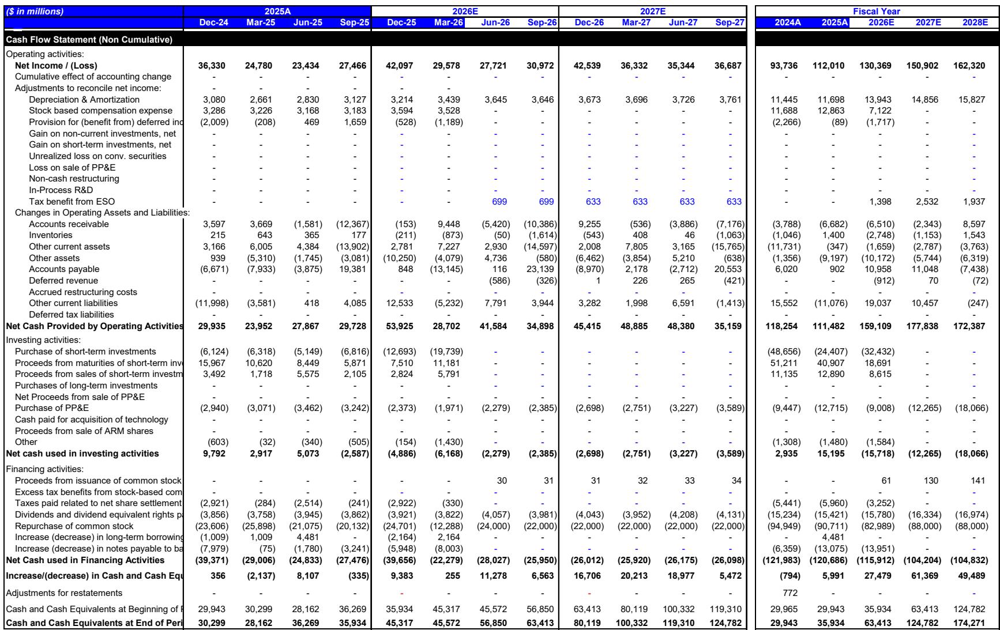
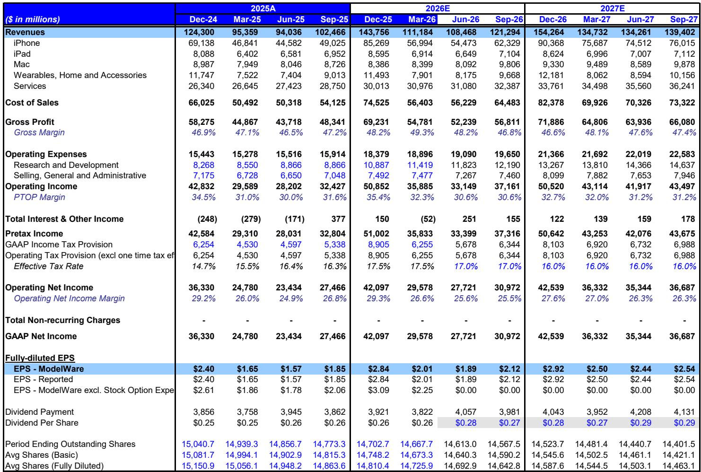
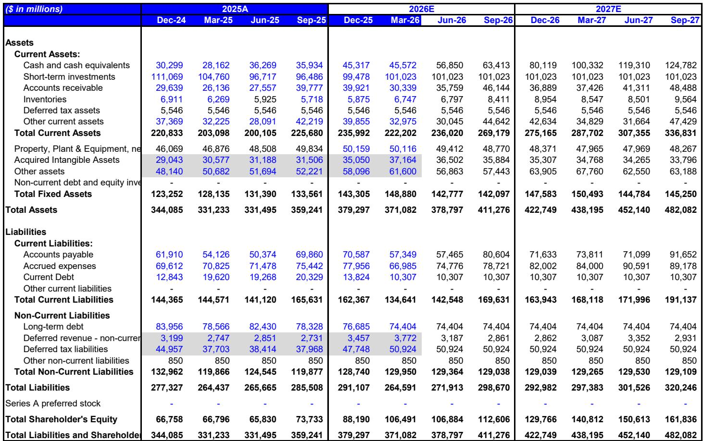

# 苹果某财季财报前瞻

这份报告围绕苹果财报展开，核心判断是：市场已将对六月季度的小幅超出预期以及九月季度的收入上调预期计入价格，但毛利率和服务收入两个关键指标存在低于市场预测的不确定性。当前约32倍的估值水平，意味着财报需要表现平稳才能推动价格继续上行。

报告认为，苹果的基本面依然扎实，未来6-18个月的多轮调整预期可能推动收入和每股收益持续改善。但短期来看，财报发布后的交易空间有限。

## 1. 六月季度iPhone收入有望高于市场预测，渠道补货是核心驱动力

报告预计六月季度iPhone收入将超过540亿美元，同比增长22%，高于市场普遍预测。这一判断基于iPhone出货量同比增长19%的强劲表现，而背后是苹果在三月季度“非常低的渠道库存”基础上进行的计划性渠道库存补充。

值得注意的是，尽管近期有关于iPhone生产调整的传闻，但供应链调研并未发现全年iPhone生产计划有实质性变化。苹果通常基于“乐观需求情景”向供应商传达计划，并在10月中下旬根据实际销售数据调整订单。报告认为，市场在九月季度和全年尚未充分计入两个因素：一是iPhone 18更大幅度的涨价预期（预计200美元，此前假设为100美元）；二是发布时间安排调整——三款高端机型在9月发布，三款低端机型在次年3月发布。这导致报告对九月季度iPhone收入的预测比市场高出8%，但对十二月季度则低5%。

> **编者注：** 渠道库存补充和涨价预期是理解这份报告两条主线的关键。六月季度的表现更多受一次性补货影响，而九月季度的收入预期则依赖产品定价变化。如果市场对新款涨价的接受度低于预期，九月指引可能面临调整风险。

## 2. 九月季度毛利率指引面临成本不确定性，与市场预期存在60个基点的差距

报告对九月季度毛利率的预测为46.8%，低于市场共识的47.4%。主要原因是近期组件成本上涨对利润率的挤压。尽管收入指引可能高于市场，但毛利率指引的“低位”将成为财报电话会上读者关注的焦点。

报告指出，如果毛利率和服务收入是次要指标，那么基于每股收益超出预期的判断，短期交易机会是正面的。但这两个指标恰恰是苹果估值能否进一步扩张的关键。在价格已接近历史高位的背景下，财报需要在这两个维度上都交出实质表现，才能触发积极的短期市场反应。

## 3. 服务收入增速节奏变化是短期不确定性，但近期涨价提供部分对冲

报告对六月季度服务收入增长的预测为13.3%，低于市场共识的14.6%和苹果隐含的约13.8%的指引。主要影响来自App Store表现——开发者收入同比增长仅3.2%，较三月季度节奏变化约460个基点。

不过，报告也指出，App Store增速节奏变化已是近几个季度的常态，而苹果总能达到或超过整体服务收入指引。展望九月季度，尽管App Store趋势继续走弱（7月至今开发者收入同比仅增长1.0%），但苹果近期对Apple Music的提价（个人/学生计划每月涨1美元，家庭计划涨3美元）预计将为服务收入贡献约1个百分点的增量增长。因此，报告预计九月季度服务收入增速仅较六月季度节奏变化60个基点至12.7%，但仍低于市场共识的13.2%。

## 4. 供应链约束限制Mac收入弹性，但定价能力部分抵消出货量下调

报告将六月和九月季度的Mac出货量预测分别下调11%和8%，原因是先进制程芯片供应瓶颈。Mac mini、Mac Studio和MacBook Neo的交付周期在六月季度延长，需求超过供给。尽管如此，供应链调研显示，苹果正在增加MacBook Neo在下半年的产量，可能从原计划的600-800万台提升至800-1000万台。

结合Mac和iPad的涨价（iPad涨价100-150美元），报告对九月季度Mac收入的预测反而上调了1%，反映出Mac约0.8的需求价格弹性（iPad约为1.0）。定价能力在一定程度上抵消了出货量下降的影响。

> **编者注：** 这份报告最值得关注的不是六月季度是否超出市场预测，而是九月季度指引中毛利率和服务收入两个“关注点”如何被市场解读。如果苹果能在成本环境下给出高于市场预期的毛利率指引，或者服务收入增速超出预期，那才是真正的关键。否则，当前估值水平下，财报后的短期交易空间可能有限。

For informational purposes only. Portions may be generated,translated,summarized,or edited with AI assistance based on source materials and may contain omissions or errors. Please verify independently. This is not investment,legal,tax,accounting,or other professional advice.

For informational purposes only. Portions may be generated,translated,summarized,or edited with AI assistance based on source materials and may contain omissions or errors. Please verify independently. This is not investment,legal,tax,accounting,or other professional advice.

