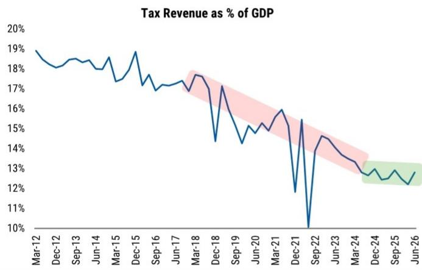
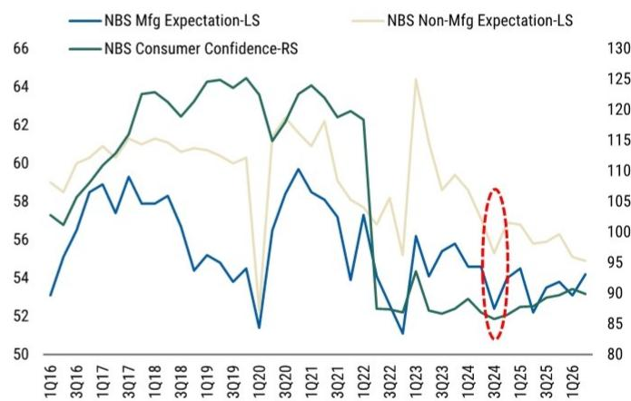
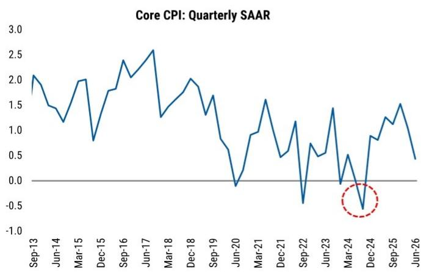
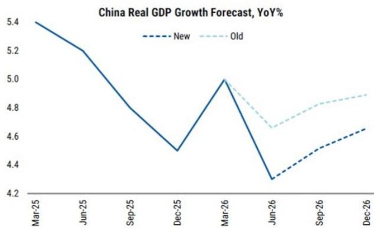
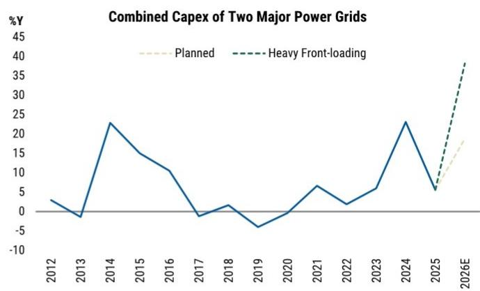
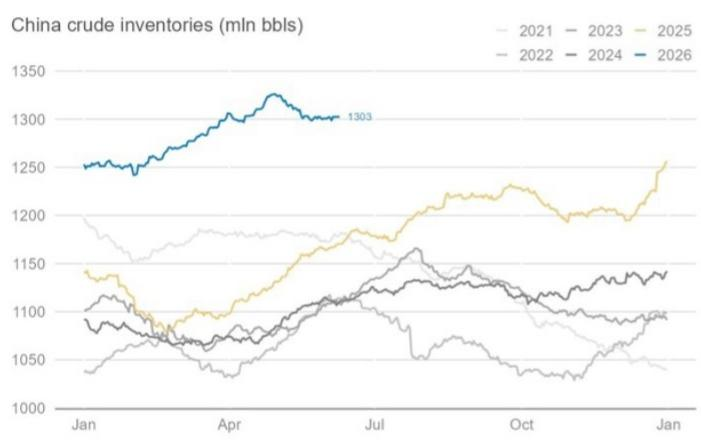
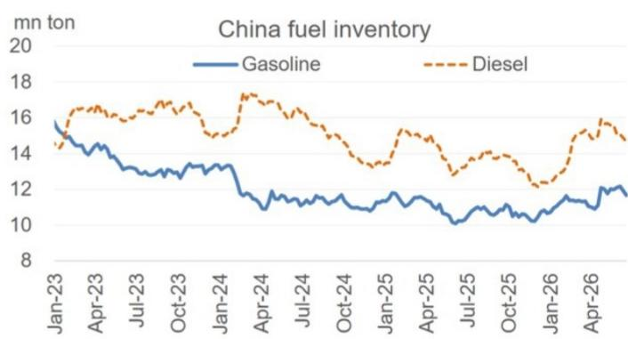

July 23, 2026

亚太观察

# 政策方向尚未转向——但仍需密切关注

目前不需要预期会出现一次类似2024年9月的政策方向变化。宏观活动处于目标区间内，人工智能相关资本开支与亚洲工业周期提供支撑。地方债务、房地产市场及价格相关因素已脱离前期低点。预计将主要使用现有财政工具，而非推出全新的大规模刺激方案。若后续数据表现不及预期，9月可能成为政策调整的观察窗口。

## 核心观察

- 短期内出现类似2024年9月政策转向的可能性较低。宏观活动保持在目标区间内。财政、社会、价格及房地产等相关影响因素已有所缓解。
- 人工智能硬件出口预计将继续作为出口增长的基础。亚洲正在展开的资本开支上行周期提供了另一重支撑。
- 中国可以通过算力与电力网络资本支出来缓冲投资领域的调整，但这些板块规模相对较小，难以带动整体固定资产投资显著回升。
- 中国原油进口可能在一段时间内保持较低水平：库存依然充足，且当前的经济活动结构对石油的依赖度较低。
- 中央会议预计将适度强调政策支持的紧迫性，优先加快财政支出。若7-8月数据不及预期，更广泛的宽松措施可能随之出台。

本报告探讨以下问题：

#1: 当前政策是否接近2024年9月时的转向节点？

#2: 中国为何可以等待？结构性出口为增长提供基础

#3: 中国能否稳定投资？

#4: 中国何时可能增加原油进口？

#5: 后续展望

详细分析

## #1: 当前政策是否接近2024年9月时的转向节点？

目前并不处于类似2024年9月的关键节点。两年前，多重因素共同推动了政策转向。这些因素目前已触底或高于前期低点，同时总体宏观活动仍处于官方目标区间内。如果这些方面没有出现新的、自我强化的下行趋势，预计在即将召开的中央会议上将进行政策微调，而非转向。

2024年9月转向的驱动因素：2024年9月的中央会议标志着从风险控制到增长支持的明确转变。这并非针对单一数据点的回应，而是确认了经济下滑已具有自我强化特征，此前的渐进措施已不足以遏制这一趋势。

- 地方政府融资渠道一度收紧：预算外融资（土地出让）大幅收缩，而预算内收入受到价格下行影响，导致顺周期财政紧缩。
- 社会动态指标曾逼近临界点：衡量家庭收入增长、就业情绪等的指标接近历史上政策转向前的阈值。
- 价格下行趋势较为普遍：经济处于工业品出厂价格持续下行的第三年，国内生产总值平减指数深度负值，核心居民消费价格环比增长转负。持续价格下降的预期正在自我强化。
- 房价曾快速下跌：随着预期转变，调整进入更明显阶段，价格显著下降。
- 增长曾偏离轨道：2024年前三季度实际国内生产总值增长分别为5.3%、4.7%和4.6%，低于约5%的年度目标。

相应的政策回应也较为广泛：包括利率和存款准备金率下调、住房贷款纾困措施、资本市场支持工具、消费品以旧换新计划，以及最为关键的大规模地方债务化解方案，以缓解财政紧缩局面。

当前情况有所不同：上述各项因素目前均已触底或有所缓解，且增长仍处于目标区间内：

- 政府融资状况有所稳定：10万亿元债务置换计划按计划推进，有助于缓解地方融资平台利息和再融资压力。税收占国内生产总值比重在经历长期下降后似乎已趋稳（图表1）。
- 社会动态指标高于前期低点：2024年9月的措施为增长提供了底部支撑，情绪相关指标整体有所改善，尽管幅度有限（图表2）。
- 价格下行压力最严重时期已过：工业品出厂价格从多年负值区间反弹至正值，受益于人工智能需求和输入性成本压力；核心居民消费价格环比恢复至低通胀水平，远好于2024年深度、顽固的通缩状态（图表3），尽管全面再通胀尚未实现。
- 房地产市场调整步伐放缓：在经历全国范围内四到五年的同步下跌后，出现分化迹象——少数一线城市和部分高端住宅显示出趋稳迹象，但整体市场仍处下行趋势。
- 增长仍在目标区间内：2026年上半年国内生产总值增长4.7%，处于官方4.5-5%区间，即便第二季度回落至4.3%。以人工智能和出口为导向的工业活动保持韧性，为总体增长提供支撑，同时低基数可能有助于下半年同比表现（图表4）。

图表1：税收占国内生产总值比重在长期下降后似乎已趋稳  
  
来源：财政部、国家统计局、研究机构

图表2：企业和消费者情绪指标整体已稳定在2024年底低点之上  
  
来源：国家统计局、研究机构

图表3：核心居民消费价格自2024年三季度以来有所回升，年内有所回落  
  
来源：CEIC、研究机构估计

图表4：2026年国内生产总值增长预测已下调，但预计下半年同比将因政策微调和低基数而有所回升  
  
来源：CEIC、研究机构

## #2. 中国为何可以等待？结构性出口为增长提供基础

即便内需相对滞后，增长仍有望保持韧性，主要得益于出口以及两股相互强化的力量：一是中国作为关键硬件供应国的人工智能驱动资本开支周期，二是正在显现的亚洲工业资本开支超级周期。

人工智能相关硬件已成为中国出口的主要引擎：近期人工智能相关基础设施对整体出口增长贡献超过10个百分点，工厂活动保持韧性，即便第二季度国内生产总值增长放缓至4.3%。这一需求具有持久性而非暂时性。

图表5：人工智能相关硬件现为名义出口的关键驱动因素  
  
来源：CEIC、研究机构

有分析认为，存储芯片现已成为人工智能构建的主要瓶颈，数据中心存储芯片价格在第三季度上涨超过25%，且供应短缺可能在2027-28年加剧——“存储芯片相对于人工智能需求不足，且这一状况预计不会改变”。长期供应协议可能平滑周期波动但延长持续时间，这为中国组件、硬件及相关设备出口商提供了多年增长空间——中国在这些领域以及电力设备、电动汽车和清洁能源领域份额持续扩大。

亚洲资本开支超级周期在数据中有所体现：作为该区域的生产大国，中国在亚洲和全球资本开支上升时能获得双重收益。5月亚洲（除中国外）资本品进口增速（三个月移动平均）加快至33%，为2004年以来较强；银行信贷增速（8.5%）和名义工业产出增速（12.5%）均达到18年高点——主要由与企业资本开支和贸易相关的需求带动。增长覆盖人工智能基础设施、能源、国防和工业供应链，且被认为具有结构性、多年期特征，不同于2017-18年的较短周期。详见：亚洲经济：迈向工业超级周期（2026年4月27日）

中国的出口结构与全球和区域资本开支扩张领域高度契合，为总体增长提供支撑，也为中国保持政策相对稳定创造了空间。但需要注意的是，这一增长是资本密集型的，对就业和消费的溢出效应较弱；同时，当前作为积极因素的人工智能资本开支渠道，在全球周期表现不及预期时也可能成为主要的风险来源。

## #3. 中国能否稳定投资？

中国投资领域的调整已成为市场参与者和政策制定者关注的焦点。虽然总体固定资产投资的变化可能夸大了内在动能减弱——支出法国内生产总值数据显示名义资本形成总额仍增长约4%——但建筑相关活动的明显收缩不容忽视。中国已承诺通过提升“六网”建设来应对，其中算力网络和电力网络成为近期两大重点。关键在于这些意图能在多大程度上转化为增长支撑。

人工智能资本开支——有支撑但有限制：分析维持判断认为，人工智能驱动的资本开支周期将在2026-27年对年度国内生产总值增长贡献约0.2个百分点，主要由中国大型超大规模企业的投资拉动（图表6）。在服务器、网络设备、电力系统及相关基础设施方面的支出应保持支撑。然而，并不预期数据中心建设会大幅加速，原因是国产先进芯片的可用性和性能存在限制。

电力网络若积极前置投资可温和提振增长：中国电网资本开支几乎完全由两家国有企业（国家电网占比超过80%，南方电网占比剩余部分）运营。结合其历史年度支出与“十四五”（2021-25年）和“十五五”（2026-30年）规划目标，以及2025年上半年/下半年和2026年上半年的估计值，可以框定2026年的脉冲幅度。在激进假设——即2026年全年投资按2026-30年潜在平均速度进行，意味着大量前置——下，增量电网支出可为下半年国内生产总值增长贡献约0.2个百分点，为下半年固定资产投资增长贡献约0.6个百分点。但如此大规模的前置可能性不大；更均匀的加速推进将带来较小但仍具支撑性的贡献。

其他领域的投资出现决定性扭转仍面临挑战：三个较大的资本开支板块可能继续面临各自的结构性限制。

1. 建筑密集型基础设施：受地方债务状况影响，持续强调隐性债务化解和“正确政绩观”引导地方避免新项目启动。
2. 制造业投资：受产能过剩制约，2026年第二季度工业产能利用率降至73.0%，为两年多来最低，尽管投资自2025年下半年已放缓，但除人工智能和出口相关领域外，缺乏大规模扩张的动力。
3. 房地产投资：受低线城市库存积压限制。

总结：缓冲而非提振。中国稳定投资的意图明确，但提供足够大规模刺激的能力尚不确定。加快财政支出和增加对算力、电力网络的投资应有助于基础设施投资温和改善。然而，这些板块规模仍然太小，无法抵消规模大得多的房地产、建筑密集型基础设施和制造业资本开支领域的持续疲弱。例如，电网资本开支占固定资产投资的比重不足2%。因此，预计政策支持将缓冲投资下滑，而非带来决定性扭转。

图表6：大型超大规模企业预计在2026-27年对年度国内生产总值增长贡献约0.2个百分点  
  
来源：公司数据、研究机构估计

图表7：仅当2026-30年电网投资大量前置时，电网资本开支才可能对2026年国内生产总值产生明显贡献  
  
来源：公开数据、研究机构估计

## #4. 中国何时可能增加原油进口？

当前增长组合（增速放缓但仍有韧性）也在降低中国石油强度，使得原油进口得以维持低位。

全球石油市场的一个重要催化因素是，中国当前在原油购买方面的克制是暂时的。自相关地区局势变化以来，中国起到了重要的缓冲作用，进口量减少约每日500万桶。6月进口进一步降至约每日700万桶。因此，中国采购的部分正常化——无论是为了重建库存还是提高炼厂开工率——都将消除一个重要的需求克制因素，并实质性收紧全球原油平衡。

首先，中国的进口减少不应被解读为国内石油消费出现同等程度的下降。在局势变化前，中国的进口量远超炼厂即时需求，并积累了广泛的商业和战略库存，其隐含原油平衡盈余在2月达到约每日270万桶。参见：石油数据摘要：深入解读中国数据（2026年6月10日）

因此，第一个调整是停止增量建库并随后动用商业库存：没有迹象表明官方战略石油储备被释放。炼厂也大幅削减加工量，因为原油成本上升、国内成品油价格管制以及成品油出口限制将利润推至负值区间。

另一部分调整来自终端需求走弱，尤其是化工和其他石油密集型行业：液化石油气、石脑油和燃料油的供应趋紧及经济性下降迫使化工装置降低开工率，而建筑活动低迷拖累柴油消费。替代品也起到了作用：炼厂在技术可行的情况下增加了乙烷使用量，同时液化天然气和电动卡车、电动乘用车及高速铁路的持续普及边际上减少了石油消费。

中国也减少了石油密集型产品出口：成品油出口从2025年底的稳健增长转为全面收缩，4月同比下降37.8%，5月下降23.6%，6月下降18.3%。除燃料外，6月化肥出口同比下降48%，过去五个月中有四个月合成有机染料出口收缩，化学纤维纺织原料出口增速从2025年平均约23%降至2026年3月以来的仅5%。

现有证据表明，只要中国的增长组合大致不变，中国可以在较长时间内维持当前状态：2026年上半年，建筑业增加值同比下降4.5%，而名义国内生产总值增长5.4%，这使得增长结构对石油的依赖度低于以往周期。如果商业库存接近运营最低水平，中国的采购可能反弹，但最新数据显示，“可观测”原油库存和成品油库存尽管有所下降，但仍远高于此前低点。

图表8：可观测的中国原油库存在3月和4月继续增长  
  
来源：Vortexa、研究机构

图表9：自相关地区局势变化以来，成品油库存一直处于高位  
  
来源：隆众资讯、研究机构

## #5. 后续展望

即将召开的中央会议可能会对经济采取更为审慎的评估，并适度提升政策支持的紧迫性。然而，预计不会立即转向新的刺激方案。初期重点应仍放在更充分利用现有政策空间，并加快此前执行较慢的措施。

7月和8月将为经济和政策落实提供重要检验窗口。在活动方面，关键问题是内需同比增速是否开始企稳。在环比稳步增长的情况下，鉴于较低的基数，这应可以实现。在政策方面，将关注政策性银行债券发行节奏，以判断重大基础设施网络的资金是否正在部署。

如果到9月，活动和政策执行仍未改善，额外宽松的可能性应会上升。近期全国政协经济委员会相关人士的讲话概述了多个可行选项，包括必要时增加政府债券发行、降低存款准备金率和政策利率，以及加快城市更新。但需要注意的是，任何重新推动建筑密集型基础设施的努力，可能都需要更依赖中央财政或政策性银行融资，以及来自中央层面更明确的增长支持信号。

因此，基础情景是逐步的政策加码，而非一次性刺激推动：7月中央会议发出更具支持性的信号，夏季加快执行，只有在数据和政策推出持续不及预期时才会出台额外措施。
