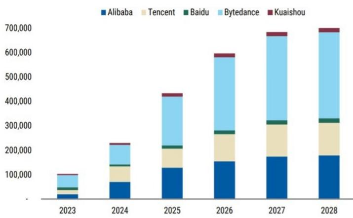
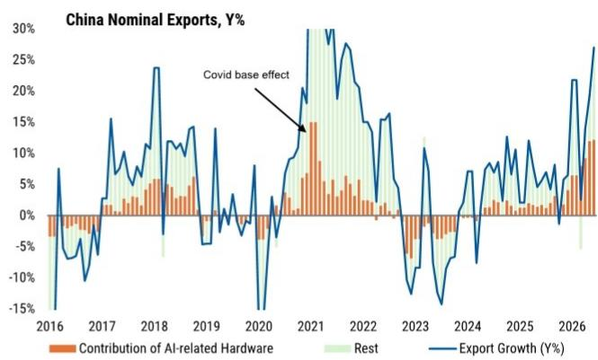

# 研究观察：近期数据与市场变化观察

2026年7月，相关机构发布中国市场观察报告，核心判断是：当前市场环境与2024年9月举措转向前夕有本质区别，有关部门不会在近期推出类似当时的大规模方案。报告认为，增长仍在官方目标区间内运行，财政、社会、价格变化和住房领域的不确定性已从底部改善，决策层更可能选择在现有工具框架内微调，而非启动新一轮大规模刺激。

这一判断的锚点在于对比两组条件。2024年9月转向的背景是多重变化自我强化：地方融资几近冻结，社会动态指标逼近临界阈值，PPI连续三年价格变化且核心CPI环比转负，房价加速调整，实际GDP增速从一季度5.3%滑落至三季度的4.6%。而当前，上述变化均已触底或缓解——地方债务置换计划按进度推进，税收占GDP比重在长期下滑后企稳，核心CPI从深度价格变化回升至低通胀区间，房价调整出现一线城市高端市场局部企稳的分化。上半年GDP增速4.7%，落在官方4.5%-5%的目标区间内，即便二季度节奏变化至4.3%，AI和出口驱动的工业活动仍为增长提供支撑。

> **笔记评论：** 报告的核心分析框架是“条件对比法”——不是看单一数据好坏，而是看多重变化是否同时出现到自我强化的程度。2024年9月的转向发生在“所有变化同时逼近临界点”的时刻，而当前各维度均未回到那个位置。这个框架对判断其他地区的政策拐点也有参考价值。

## 1. 结构性出口为增长提供缓冲，但就业传导有限

有关部门之所以能够等待，关键在于出口端的结构性韧性。报告识别出两股支撑力量：一是AI驱动的硬件研究周期，中国作为关键硬件供应商持续受益；二是亚洲工业资本开支超级周期正在展开。

AI相关硬件已成为中国出口的主要引擎，近期对名义出口增速的贡献超过10个百分点。相关机构美国半导体团队指出，内存已成为AI建设的首要瓶颈，数据中心内存价格在三季度上涨超过25%，短缺将持续至2027-2028年。长期供应协议可能平缓周期振幅但延长持续时间，这意味着中国在组件、硬件和AI配套设备领域的出口增长可能持续多年。与此同时，亚洲（除中国外）资本品进口增速在5月达到33%（三个月移动平均），为2004年以来较强，企业信贷增速和工业产出均触及18年高点，且被判断为结构性、多年期的扩张。

但报告也明确指出这一模式的局限：出口增长是资本密集型，对就业和消费的溢出效应较弱。同样的AI资本开支渠道既是当前的增长支撑，也是全球周期不及预期时的最大节奏变化不确定性。

## 2. 研究稳定意图明确，但规模不足以扭转大局

研究节奏变化已成为读者和决策层的核心关切。报告认为，固定资产研究的下滑幅度可能夸大了实际动能损失——支出法GDP数据显示名义资本形成总额仍在增长约4%。但建筑相关活动的快速调整确实存在。

有关部门已将“六网”建设提升为优先方向，其中算力网和电力网是近期重点。报告测算显示，AI资本开支周期在2026-2027年每年对GDP增速的拉动约为0.2个百分点，主要由头部超大规模云服务商的研究驱动。电网研究在激进前置的假设下，可在下半年额外贡献约0.2个百分点的GDP增长和0.6个百分点的固定资产研究增长。但电网研究占固定资产研究的比重不到2%，难以对冲房地产、传统基建和制造业研究的结构性约束。

三个更大的研究板块面临各自的结构性天花板：建筑密集型基建受制于地方债务化解导向；制造业研究受困于产能利用率降至73.0%的两年低点；房地产研究受限于低线城市库存积压。报告的结论是：相关举措能够缓冲研究节奏变化，但无法实现决定性逆转。

## 3. 原油进口仍在调整的持续性取决于增长结构

中国原油进口的减少是理解全球石油市场的重要变量。自霍尔木兹海峡相关事件以来，中国作为关键缓冲器，进口量减少约500万桶/日，6月进一步降至约700万桶/日。但报告强调，进口下降并不等同于国内石油消费的等量崩塌——事件前中国进口远超炼厂需求，库存积累达到约270万桶/日的盈余。

调整的第一阶段是停止增储并动用商业库存，而非动用战略石油储备。炼厂因成本上升和利润转负而大幅削减开工率。终端需求走弱也起到作用，尤其是石化和建筑相关领域。此外，LNG替代、电动卡车和乘用车的普及、高铁网络扩张，都在边际上减少了石油消费。

报告认为，只要增长结构保持当前特征——上半年建筑业增加值同比下降4.5%，而名义GDP增长5.4%——中国就能在低进口水平上维持更长时间。尽管库存已开始下降，但可观测的原油和成品油库存仍远高于此前低点。

## 4. 七月相关会议：更谨慎评估，但非方向转向

报告对近期举措路径的预期是：即将召开的相关会议将采用更谨慎的市场环境评估，并小幅提升举措支持的紧迫性，但不会立即转向新方案。初期重点仍是更充分地利用现有政策空间，加速执行进度较慢的措施。

七月和八月将是市场环境和举措执行的重要检验窗口。市场环境方面，核心问题是国内需求同比增速能否在低基数效应下企稳。举措方面，政策银行债券发行节奏将是观察基础设施网络融资是否加速的关键指标。

如果到九月市场环境活动和举措执行仍未改善，额外宽松的可能性将上升。报告引用了相关机构副主任近期提出的若干选项，包括必要时增发政府债券、降准降息、加速城市更新。但任何重新推动建筑密集型基建的努力，都需要更依赖中央财政或政策银行融资，以及来自中央决策层的明确增长信号。

报告的基准情景是渐进式举措加码，而非一次性刺激：七月相关会议释放更积极信号，夏季加快执行，只有数据和举措落地持续不及预期时才会推出额外措施。

For informational purposes only. Portions may be generated,translated,summarized,or edited with AI assistance based on source materials and may contain omissions or errors. Please verify independently. This is not investment,legal,tax,accounting,or other professional advice.

